## **Chapter 10 – Platform Security and Trust** 

We will bankrupt ourselves in the vain search for absolute security.

—Dwight D. Eisenhower

The Unified Extensible Firmware Interface (UEFI) and Platform Initialization (PI)

specifications describe the platform elements that take control of the system across the various restart events. These elements are also responsible for ceding control to

hypervisors, operating systems, or staying in the UEFI boot services environment as the “runtime.” These modules and drivers can provide support for various secure boot

and trusted computing scenarios.

Beyond the feature drivers and boot flow, the UEFI and PI specifications describe

interfaces and binary image encoding of executable modules for purposes of interop-erability. This allows for business-to-business engagements, such as a chipset or CPU

vendor providing drivers to a system board vendor for purposes of building a whole solution. This is the positive side of the extensibility. The darker side of extensibility,

though, entails the need to have some assurance that the final system board design meets various security goals, such as integrity, availability, and confidentiality. In

other words, how can the platform manufacturer who ships a system board have con-fidence that the UEFI and PI modules have been safely composed?

This chapter describes some of the security and trusted computing capabilities. Then it discusses how to construct and integrate elements.

**Trust Overview**

We begin the discussion of trusted platforms with some background on trust—specif-ically, the definition of *trust,* and some related concepts, *measurement* and *security:*

■ *Trust.* An entity can be trusted if it always behaves in the expected manner for the

intended purpose.

■ *Measurement.* The process of obtaining the identity of an entity. ■ *Security.* Maintenance that ensures a state of inviolability from hostile acts or in-

fluences (from http://www.thefreedictionary.com/security).

In fact, trust is an amalgam of several elements of the platform that span the enter-prise to consumer, including reliability, safety, confidentiality, integrity, and availa-

bility, as illustrated in Figure 10.1.

DOI 10.1515/9781501505690-012

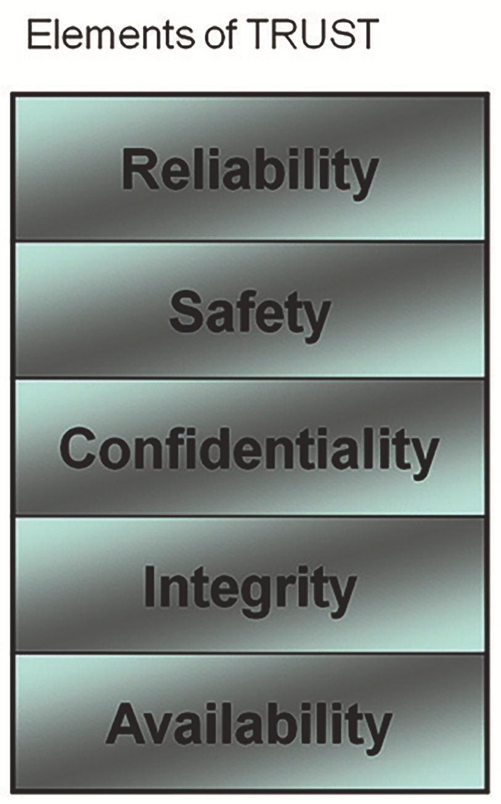

**Figure 10.1:** The Elements of Trust

Where should the solution reside, given the problems to be solved and some of the

capabilities like security, trust, and measurement to help effect the solution?

In fact, the implementation of trust and security entail a security architecture that

spans the entire system, starting at the base with hardware and spanning all of the way to the end-user application.

Figure 10.2 shows all of the layers of a security architecture. The network layer is broken out with a few examples, such as protocols (SSL, IPSec); this chapter does not

delve too deeply into this layer. The firmware layer is highlighted to show that a sin-gle-layer of security is not sufficient.

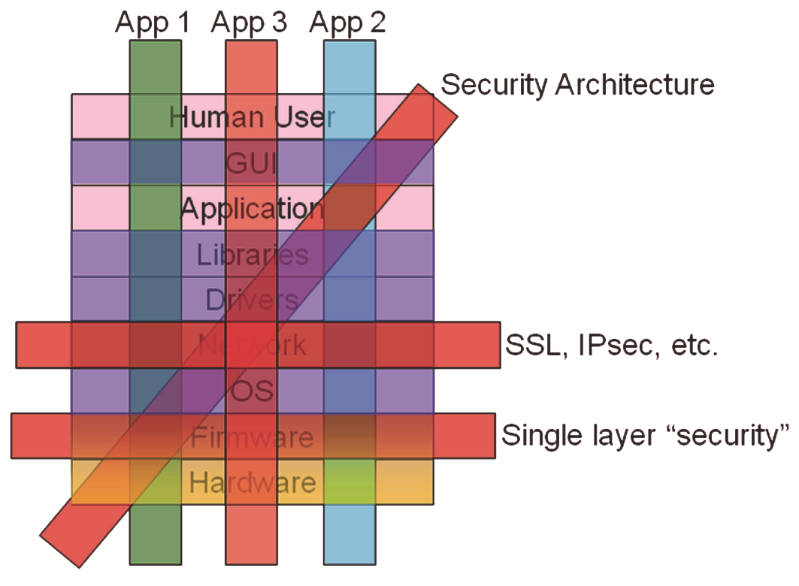

**Figure 10.2:** All Layers of a Security Architecture

In fact, the scope of this chapter largely addresses firmware. Some description of

hardware elements and interaction are provided. Figure 10.3 highlights the area that this chapter discusses in more depth.

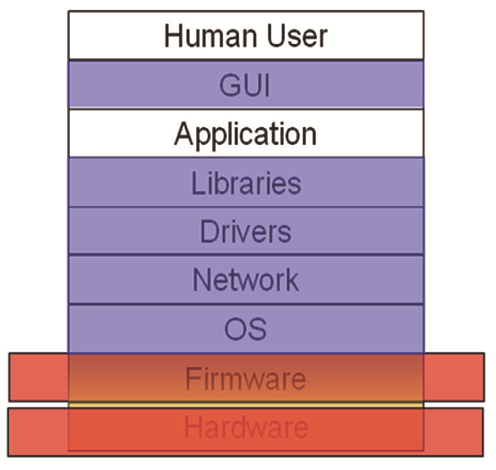

**Figure 10.3:** Layers Examined in this Chapter

As seen in Figure 10.3, all layers are important, but if you do not have firmware/hard-

ware assurance, you cannot have a security architecture. As the logicians would say, it’s “necessary but not sufficient” to have appropriate design in these layers. And as

will be described later, the layer of hardware and firmware provide a “root of trust” for the rest of the security architecture.

So now that we have trust, security, measurement, and a layered picture of the security architecture, the goals of the security architecture and assets that are pro-

tected are as follows.

The first security goal is *integrity,* and this entails the protection of content and in-formation from unauthorized modification. The next goal is *authenticity,* and this pro-vides guarantee or assurance in the source of the code or data. Another important goal

is *availability,* or the ability to ensure behavior and the responsiveness of the system. Availability also protects from destruction or denial of access. And finally, another goal

is *confidentiality,* or the protection of information from unauthorized access.

Through the subsequent discussion of trusted platforms and UEFI, some of these

integrity, authenticity, and availability goals will be discussed in more detail.

It is outside the scope of this chapter to describe confidentiality since this is typ-

ically a concern of higher-level applications, but errors in lower layers of the trusted platform may imperil this goal. Specifically, this relates to the introduction of vulner-

ability via a flaw in integrity or authenticity implementations of a layer that wants to provide confidentiality (say an application) when the hardware or firmware or net-

work underneath is errant.

A final item that will be discussed in this chapter is a final goal that spans all of

the above, namely *assurance.* By assurance we mean having some guarantee of the correctness of an implementation. And for this study, assurance will be treated in de-

tail for the case when platform firmware and trusted computing hardware elements are the embodiment of the platform.

And given the trust definition above, we see that these features are especially im-portant in the enterprise, such as a high-end server, where reliability and safety goals

are co-equal to the other concerns like integrity and confidentiality.

**Trusted Platform Module (TPM) and Measured Boot**

In building out the hardware layer of the security architecture, one problem with open

platforms is that there hasn’t been a location on the system to have a root of trust. The

trusted platform module (TPM) and the infrastructure around this component are an industry attempt to build a series of roots of trust in the platform.

The maintenance and evolution of the capabilities of the TPM are managed

through an industry standards body known as the Trusted Computing Group (TCG). The TCG members include systems manufacturers, TPM manufacturers, CPU and

chipset vendors, operating system vendors, and other parties that contribute hard-ware and software elements into a trusted platform. HP and IBM are examples of ven-

dors that span many of these categories. Intel also participates in the TCG as CPU and chipset vendor.

To begin, what is a trusted platform module? It features a series of protected re-gions and capabilities. Typically, a TPM is built as a microcontroller with integrated

flash/storage that is attached to the LPC bus on PC, but it can also be a virtual device or more deeply integrated in the platform chipset complex. The TPM interacts with

system through a host interface. The TPM Interface Specification (TIS) in the TCG PC

Client working group describes the memory-mapped I/O interfaces; the TIS is just one such interface. The TPM main specification describes the *ordinals* or the byte stream of commands that are sent into the TPM. These commands are the required actions

that a TPM must carry out in service of the host. Figure 10.4 shows some of the speci-fications that describe the TPM and its integration into the platform.

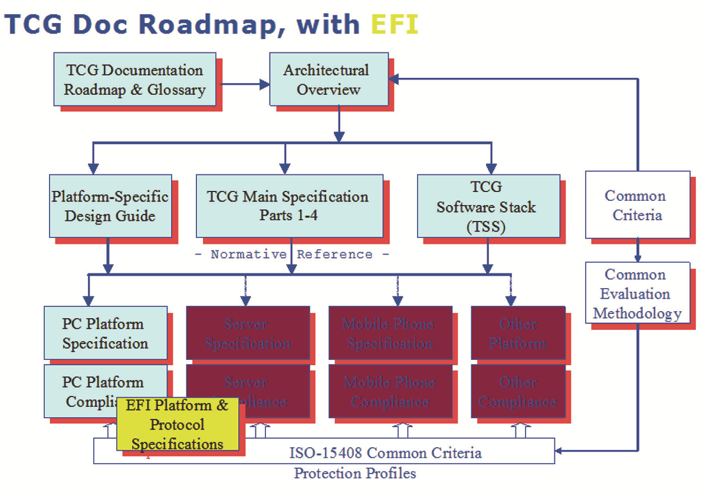

**Figure 10.4:** TCG Specification Hierarchy

The interoperability of the Trusted Computing elements is managed through the Trusted Computing Group (TCG) and a series of specifications. For purposes of this

review, the TPM main specification, platform design guides, protection profiles, and the UEFI collateral will be of interest, as highlighted above.

Figure 10.6 shows an instance of a TPM diagrammatically. Given the existence of the specifications mentioned earlier, multiple vendors can provide conformant in-

stances of this technology with the ability to differentiate their implementations.

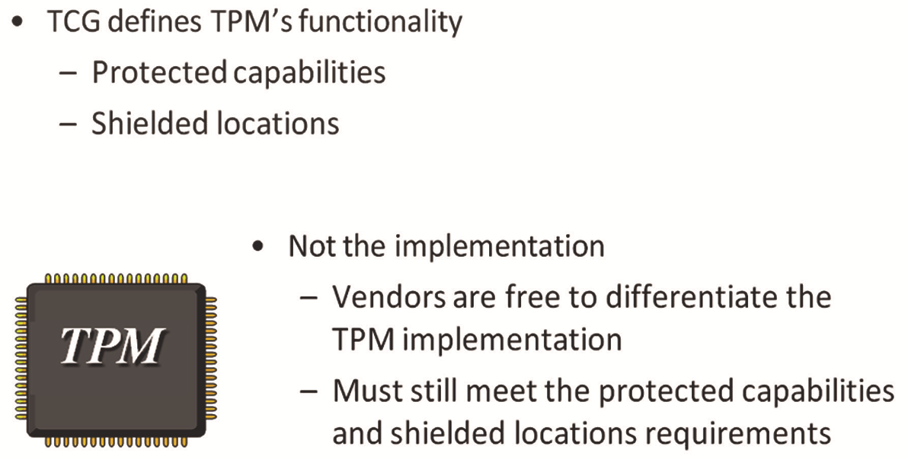

**Figure 10.5:** TPM Overview

Figure 10.6 is a picture of the elements that are typically found within a TPM. The protected execution and storage of the TPM allow for hosting the RSA asymmetric key

pairs, such as the endorsement key (EK), the attestation identity key (AIK), and stor-age root keys (SRKs). Recall that in RSA cryptography, the public key can be known

to all, but the private key must be shrouded from users. The TPM and its isolated ex-ecution can both host the key-pairs and keep the private RSA keys away from at-

tacks/errant agents on the host. In today’s platforms without a TPM, only a custom hardware security module (HSM) or other additional hardware can be used for host-

ing key-pairs. But in these latter solutions, there is no guarantee on construction of platform, surety of the host interface, and so on. The Trusted Computing Group at-

tempts to both describe the requirements on the TPM and the binding into the plat-form in order to have a trusted building block (TBB) via design guides, protection pro-

files, conformance tests, and so on.

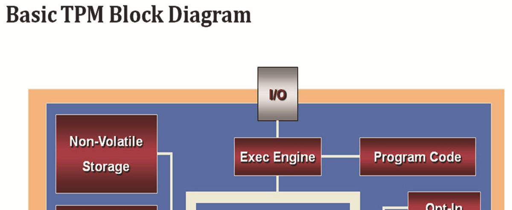

**Figure 10.6:** TPM Block Diagram

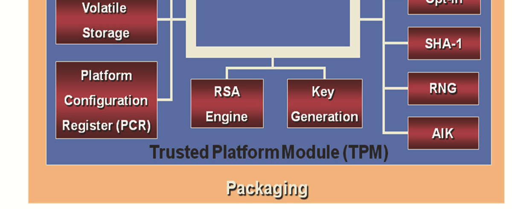

**What Is a Trusted Building Block (TBB)?**

The TBB includes the components that make up the platform. These can include the

TPM, how the TPM is bound to the platform, flash with the system board firmware, and portions of the firmware that must be trusted. The TBB goes beyond TPM ordinals.

It leads into prescriptions on the construction of the physical platform. As such, it is not just an issue at one layer of the stack.

A S-CRTM is a “static core root of trust for measurement.” The S-CRTM is the por-tion of the platform firmware that must be “implicitly trusted.” The S-CRTM makes

the first measurements, starts TPM, and detects physical presence per the TCG privacy model.

And it is where the S-CRTM portion of the TBB intersects with the platform firm-ware and other roots-of-trust in the platform. S-CRTM, CRTM, and SRTM are used in-

terchangeably later in the section.

Following is a quick overview to clarify the roots-of-trust in the platform and

which business entity delivers them.

Taxonomy of terms in the platform:

■ RTM

— Generic term for “Root of Trust for Measurement”

— SRTM is the static root of trust for measurement (SRTM) – CRTM + unbreak-

able measurement chain to OS

— DRTM is the dynamic root of trust for measurement (DRTM)

■ CRTM

— Static CRTM (S-CRTM) or CRTM. Portion of platform firmware that must be

implicitly trusted.

■ RTR

— Root of trust for reporting

— These are the Platform Configuration Registers (PCRs) in the TPM

— 20-byte non-resettable registers to store the *state* or *measurements* of code +

data

— Typically SHA1 (new info \|\| former PCR value), where “\|\|” is the catenation of

data

■ RTS

— Root of trust for storage

— Endorsement key (EK) – unique per TPM

— Storage root keys (SRKs) – used by OS and others to build key hierarchies

■ TPM Owner

— Applies the authentication value

— Several commands are “owner authorized” ■ SRTM

— Static root of trust for measurement

— CRTM (CRTM) + platform firmware measuring all code and data prior to boot

— Records information into non-resettable or “static” PCRs (0-15); these static

PCRs zeroed only across platform reset

— Described by TCG BIOS and UEFI specifications ■ DRTM

— Dynamic root of trust for measurement

— Initiative the measurement later in boot. Includes resettable PCRs 16 and

above; these resettable PCRs zeroed upon initiation of the DRTM launch

■ Physical presence

— Administrative model of the TPM. Assertion by operator of presence in order

to perform privacy or administrative activities with the TPM.

In general, a hardware instantiation of the trusted platform module (TPM) is a passive

hardware device on the system board. It serves as the root of trust for storage (RTS)

and root of trust for reporting (RTR). The former is the use of the storage root key (SRK) and the Platform Configuration Registers (PCRs). Figure 10.7 shows the synthesis of the various roots in the platform.

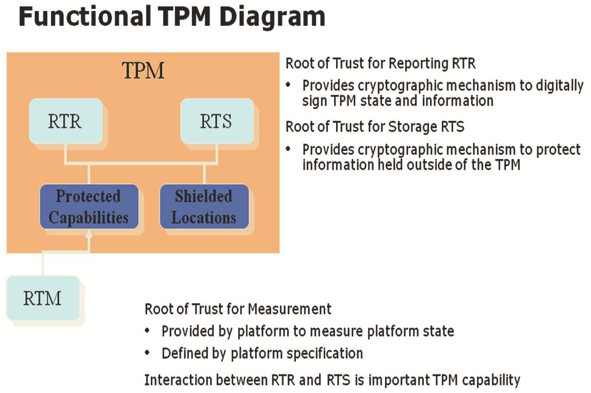

**Figure 10.7:** Functions of a TPM

The active agent on the platform is the root of trust for measurement (RTM). The RTM

can be either static or dynamic (SRTM versus DRTM, respectively). The SRTM, on the other hand, entails a trust chain from the platform reset vector going forward.

The definition of the SRTM for UEFI is defined in the UEFI TCG Protocol Specifi-cation and the TCG UEFI Platform Specification. The flow of the SRTM into the oper-

ating system is shown in Figure 10.8.

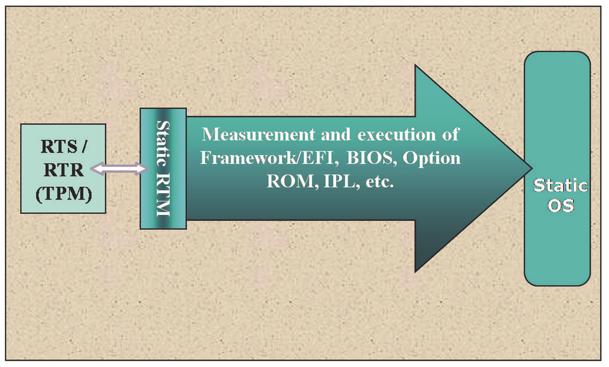

**Figure 10.8:** Boot Flow that Includes a Static Root of Trust

There needs to be UEFI APIs available so that the UEFI OS loader can continue to measure the operating system kernel, pass commands to the TPM to possibly unseal

a secret, and perform other TPM actions prior to the availability of the OS TPM driver.

In addition, this API can be installed at the beginning of DXE to enable measurement of the DXE and UEFI images. Figure 10.9 shows where the UEFI TCG APIs would ap-pear relative to the other interfaces.

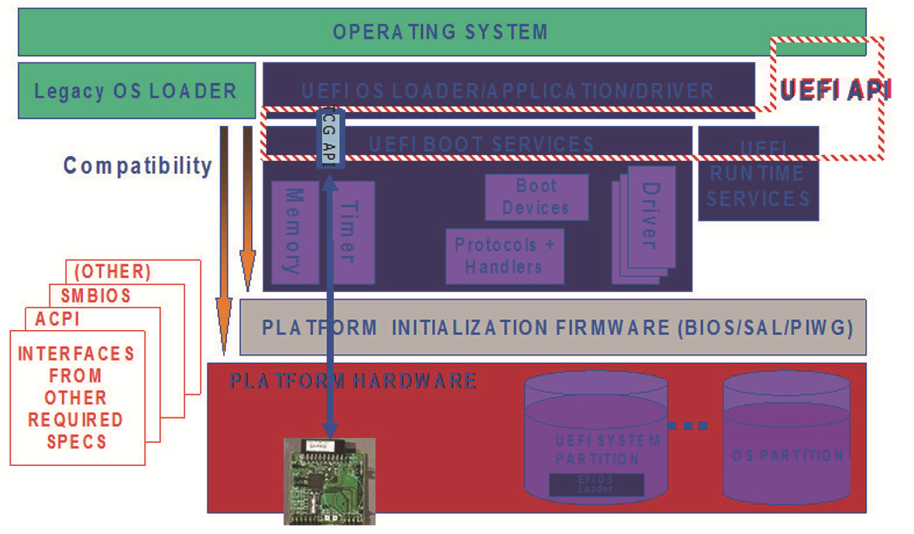

**Figure 10.9:** UEFI API Layering

The UEFI specifications are cross-listed in the TCG PC and Server Working Groups

such that both consumer and enterprise-class operating systems can participate in this boot flow behavior.

The UEFI TCG Platform specification describes which objects to measure in an UEFI system, such as the images, on-disk data structures, and UEFI variables. Figure

10.10 shows which objects in a UEFI system correspond to measures in PCRs.

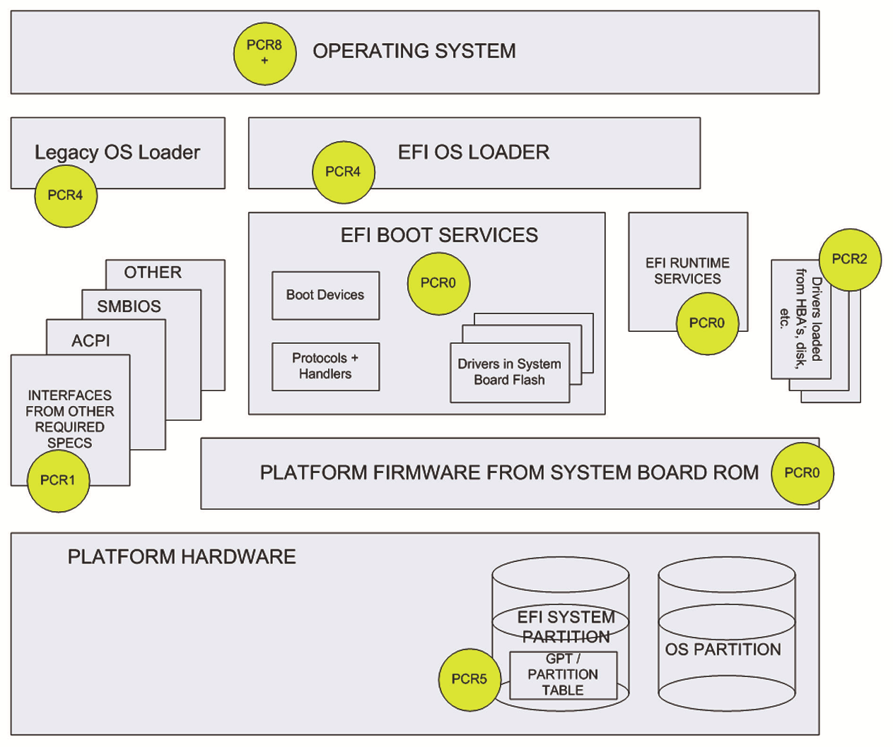

**Figure 10.10:** Measured Objects in UEFI

Prior to the UEFI phase of platform execution, the PI describe the PEI and DXE phases.

In these phases the CRTM is mapped to the PEI phase and what is thought of as BIOS POST is mapped to DXE. There are interfaces in PEI (namely, the PEIM-to-PEIM inter-

face, or PPI) to allow for fine-grain measurement in that phase of execution, too. Fig-ure 10.11 shows one possible PEI-based CRTM and the flow into the operating system.

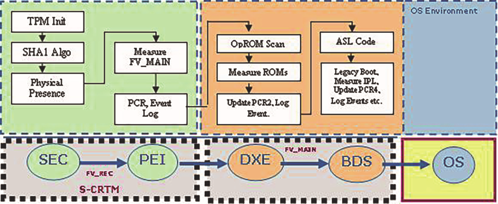

**Figure 10.11:** SRTM boot flow

**What Is the Point of Measurements?**

The process of measurements records the state of the platform, for both executable

code and data hashes, into the TPM’s platform configuration registers (PCRs). These PCRs are write-only and cleared upon a platform reset (at least the static PCRs for SRTM). The PCRs reflect the platform state. They are used such that software, when

installed upon the platform, can “seal” some information to the platform. A Seal op-eration is like an encryption that also includes PCRs. There is a corresponding Unseal

operation, which is a decryption that also uses the PCRs

What this means practically is that if the state of the platform changes between

the installation of some software (and the Seal operation) and successive invocations of software on later restarts (and the use of Unseal operation), unauthorized changes

to the platform in the interim will be detected (that is, PCRs changed).

This is sort of the Resurrecting Duckling security model wherein the initial state

of the platform (that is, PCR values upon installing application) is considered safe or acceptable.

UEFI offers an opportunity here. PI and UEFI have specification-based compo-nents written in a high-level language (for example, C). The software development

lifecycle (SDL) for drivers and other system software can be applied, as can static analysis tools (such as Klockwork† and Coverity†). Later in the chapter we’ll talk

about additional practices to complement the SDL that address domain-specific is-sues with platform firmware.

With all these elements of security and protections in place how the CRTM is up-dated becomes critical and much more challenging. Since the CRTM is the root, and

is itself inherently trusted, it must be a very controlled and secure process. The TCG describes CRTM maintenance in the Trusted Building Block (TBB) protection profile.

Either the CRTM is immutable, or never changed in the field, or appropriate crypto-graphic techniques need to be employed in order to update the CRTM.

Regarding the cryptographic-based update, Figure 10.12 shows a possible imple-mentation where the firmware volume (FV) update is enveloped using an RSA-

2048/SHA-256-based update. This is just one possible UEFI PI implementation that leverages the UEFI PI-based firmware volume construct and the WIN_CERT that can

be found in the UEFI 2.0 specification.

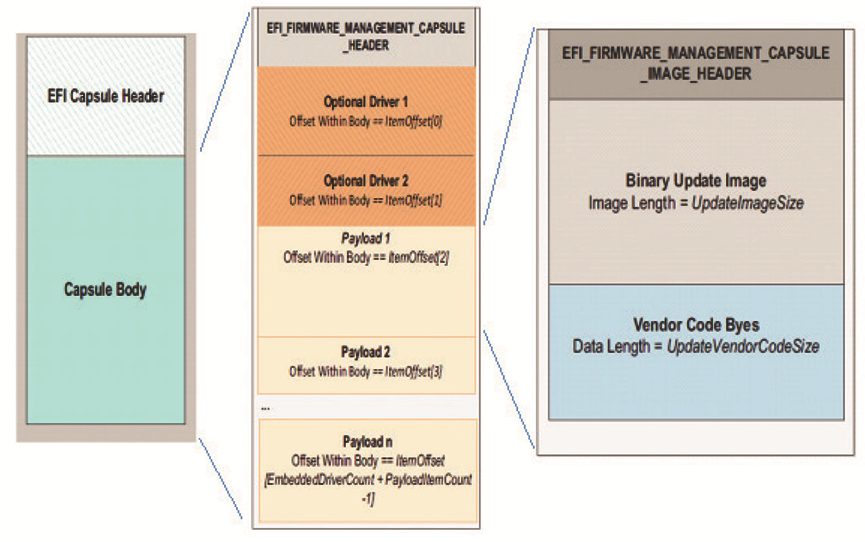

**Figure 10.12:** Firmware Volume Update

As noted above, a signed capsule is one implementation path. The system flash is not directly updated by a flash utility but instead the CRTM update capsule is stored in a staging area. The next time the CRTM gains control of the system (at reset), it will

check for any pending updates. If updates are found, they will be validated and then

cryptographically verified. If they are valid, the CRTM update can be applied. It’s im-portant to note that when validating the update this all must be done by using only CRTM code and data. Code or data outside the CRTM cannot be trusted until verified.

**UEFI Secure Boot**

There are several terms that will be introduced in the context of UEFI and trust. These include *executable verification, driver signing, user identification, network authentica-*

*tion,* and *network security*.

To begin, the UEFI evolution described below appear as elements of the UEFI main specification in version 2.6. These features entail updates to the boot behavior

and the features briefly treated will include image verification, networking enhance-ments such as IPSec, and user identification.

Figure 10.13 shows where in the stack the emergent UEFI features described in

this chapter exist, namely in the UEFI Services and boot manager.

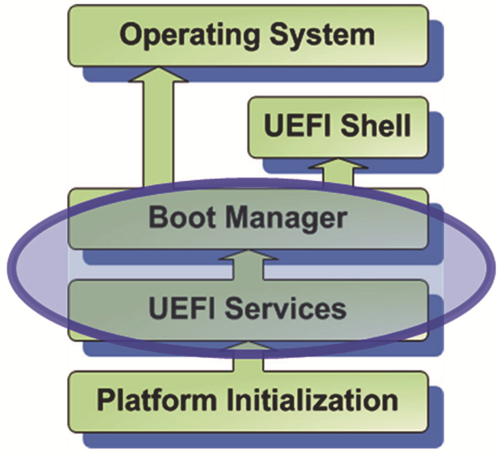

**Fig10.13:** UEFI Software Stack

**UEFI Executable Verification**

The first feature from UEFI to discuss is driver signing or executable verification.

Driver signing:

■ Expands the types of signatures recognized by UEFI

— SHA-1, SHA-256, RSA2048/SHA-1, RSA2048/SHA-256 and Authenticode ■ Standard method for configuring the “known-good” and “known-bad” signature

databases.

■ Provides standard behavior when execution is denied to provide policy-based up-

dates to the lists.

One evolution beyond the SRTM described in earlier chapters, is that UEFI can pro-vide “verification.” Recall that the SRTM records the state of the code and data in the

platform such that a later entity may assess the measurements. For verification, or enforcement, of some policy, the UEFI firmware can act as a root-of-trust-for-enforce-

ment (RTE) or root-of-trust-for-verification (RTV) wherein the boot process can change as part of policy. This policy can include the UEFI image verification using

Authenticode-signed images, for example.

Figure 10.14 shows the steps necessary for signing of UEFI images. The signing can include RSA asymmetric encryption and the hash function a member of the secu-

rity hash algorithm family.

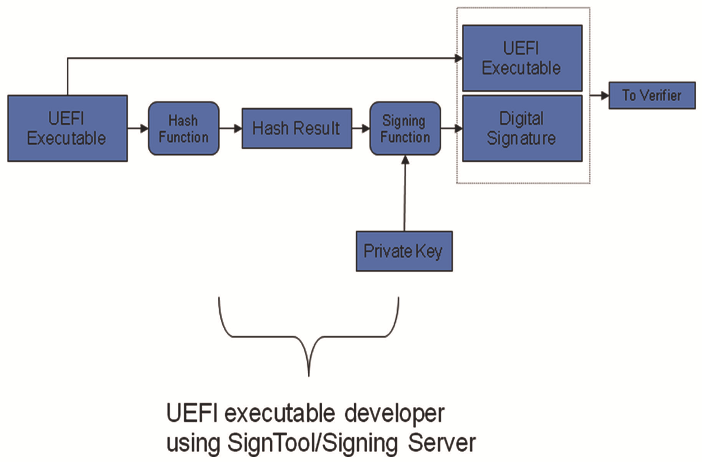

**Figure 10.14:** Driver signing

This preparation would happen at the manufacturer facility or could be facilitated by

a third party, such as VeriSign† Certificate Authority (CA).

Once the signed images are deployed in the field, whether loaded across the net-

work, from a host-bus adapter card, or via the UEFI system partition, the UEFI 2.6 firmware verifies the image integrity, as illustrated in Figure 10.15.

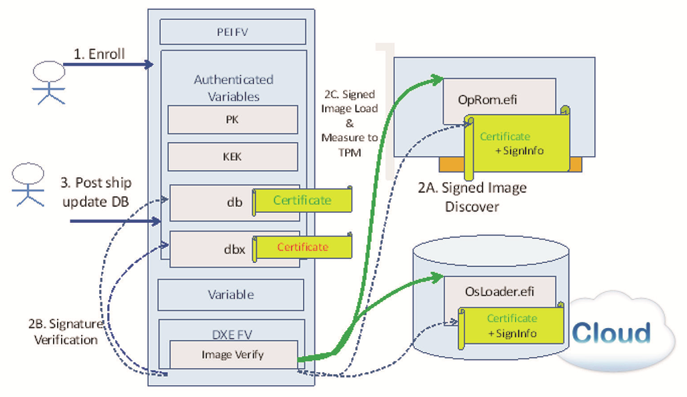

**Fig10.15:** Verification of UEFI images

The figure above shows a single logical firmware volume from the system board man-

ufacturer. The characters on the left can either be the manufacturer provisioning and

enrolling the keys during system constructor, or the platform owner updating the da-tabase (DB) of the keys during the one-touch provisioning.

The UEFI Secure boot flow has the DB and DBX for the allowed and disallowed

UEFI images, respectively, but it does not talk about boot time verification of the un-derlying PEI and DXE FV. For that a hardware verifier that runs prior to the PEI FV

can be used. This logically maps to the PI SEC phase. One embodiment of this hard-ware verification of the system board vendor PI code is shown below.

CPU/SOC BIOS OS Start Block

PEI DXE/UEFI Loader/Kernel

(OEM) (OEM) (OSV)

**Boot Guard** **Intel** **Executable** **Executable** **Executable**

**Enforces** **Enforces** **Enforces** **Policy Engine** **Policy Engine** **Policy Engine**

**Policy** **Policy** **Policy**

**Intel® Device Protection** OEM PI OEM UEFI 2.6 **Technology with Boot Guard** Verification Secure Boot

Using PI Signed

Firmware Volumes

**Fig. 16:** Verification of OEM flow

This flow above shows the UEFI 2.6 chapter 30 UEFI Secure boot flow on the right

hand side, along with a hardware verification of the initial block on the left hand side, including reference to Intel® Device Protection with Boot Guard Technology. There

are many other hardware implementations beyond Intel Boot Guard for Intel ® Atom® class SOC’s and other vendor SOC’s. The ‘middle’ of the diagram shows how

the verification action must be continued, with one embodiment including signed firmware volumes.

The combination of robust UEFI implements and interoperable trust infrastruc-

ture will allow for evolving the extensibility of UEFI in a safe, robust fashion.

**UEFI Networking**

Another element that appears in UEFI entails additional network security, including IPsec support. Trusted hardware like the TPM can be used to help store the IPsec cre-

dentials, but to be stronger, assurance around the UEFI firmware implementation of the IPsec cryptography and the networking code will need to follow the guidelines in

the preceding chapter. IPSec can be used for platform network boot to harden scenar-ios such as ISCSI-based provisioning.

Figure 10.17 shows the EFI IPsec implementation using the UEFI IPsec protocol and IPV6 network stack, including a pre-deployed security association (SA).

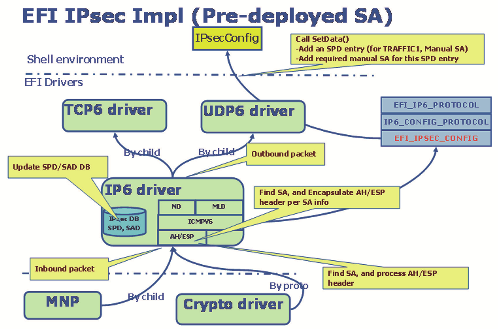

**Figure 10.17:** UEFI IPsec

IPsec in the platform will allow for performing both an IPV4 and IPV6-based ISCSI boot and provisioning. Figure 10.18 shows an iSCSI layering on top of the UEFI net-

work stack, for example.

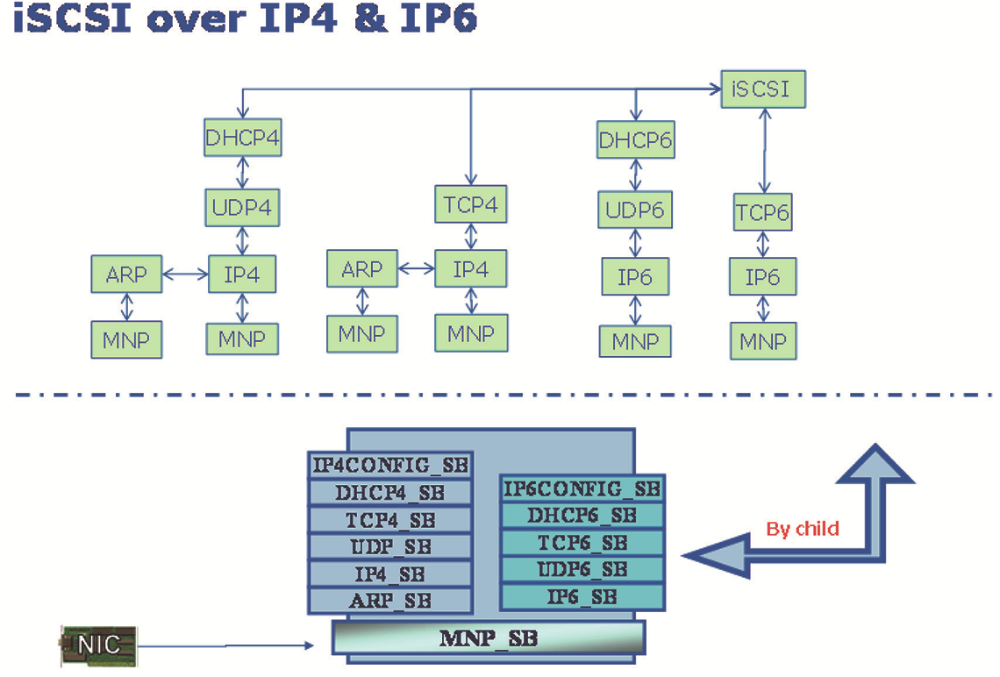

**Figure 10.18:** An iSCSI Application with UEFI Network Stack

Beyond the IP6 and IPsec UEFI interfaces, the wire-protocol for network booting has commensurate evolution to the UEFI APIs. Specifically, in the DHCPv6 extensions

for IPV6 network booting, the boot file information is sent as a Uniform Resource

Locator (URL); the network boot option details are described in both the UEFI 2.6 specification and in IETF Request For Comment (RFC) 5970. As such, the UEFI client machine and the boot server can negotiate various types of downloads, including

TFTP, FTP, HTTP, NFS, or ISCSI. This allows the network capabilities to track the needs of the market and the machine’s firmware capabilities.

Beyond IPSec, the Transport Layer Security (TLS) has been added to the UEFI Specification. A layering of this new protocol for purposes of secured HTTP, namely

HTTP-S, is shown below.

HpDxe HpDxe

comsume

TLS_CONFIGRATION TLS_CONFIGRATION

TCP_PROTOCOL TCP_PROTOCOL TLS_PROTOCOL TLS_PROTOCOL

\_PROTOCOL \_PROTOCOL

Produce Produce

TcpDxe TcpDxe TlsDxe TlsDxe

**Figure 10.19:** UEFI TLS

TLS allows for confidentiality on HTTP boot via HTTP-S, but it can be used for other usages. These other usages include support for EAP-TLS for a WIFI supplicant, as

shown in the following diagram of the UEFI 2.6 WIFI stack.

MnpSb Protocol

MNP Driver

SNP Protocol

SNP Driver

UNDI / NII

Device Path AIP Protocol

EFI_WIRELESS_MAC\_ Wireless Connection

Wireless UNDI driver CONNECTION_II_PROTOCOL

Manager

EFI_SUPPLICANT_PROTOCOL

EFI_EAP_CONFIGURATIO

N_PROTOCOL

EFI_SUPPLICANT_SERVIC

E_BINDING_PROTOCOL

Supplicant Driver

**Figure 10.20:** UEFI WIFI

Wherein the ‘supplicant driver’ would produce the EFI_EAP_CONFIGURATION_PRO-TOCOL, with the embodiment can include EAP-TLS.

More details on the EFI_TLS_PROTOOCL can be found in chapter 27 of the UEFI 2.6 specification. More details on the UEFI WIFI support can be found in chapter 25 of

the UEFI 2.6 specification, too.

**UEFI User Identification (UID)**

A final ingredient in UEFI includes the user identity support. This is infrastructure

that allows for loading drivers from token vendors to abstract authentication of the user, including many factors, and a policy engine to assign rights to certain users.

This can include limiting service access for certain users. Figure 10.21 shows this ca-pability.

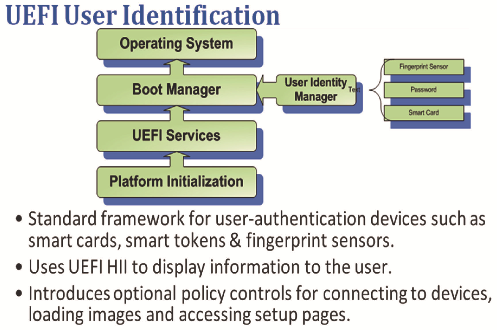

**Figure 10.21:** User Identity

Implementation of these UEFI features would also build upon and require the assur-

ance/best practices in firmware discussed earlier. More information on the UEFI-based features can be found in the UEFI main specification.

**Hardware Evolution: SRTM-to-DRTM**

As a final element getting introduced into the platform going forward is the dynamic root of trust for measurement, or D-RTM. The D-RTM provides platform hardware ca-

pabilities to support a measured launch environment (MLE). An S-RTM and D-RTM feature set can exist on the same platform, or each feature can exist independently.

Figure 10.22 compares the two RTMs and their temporal evolution and features.

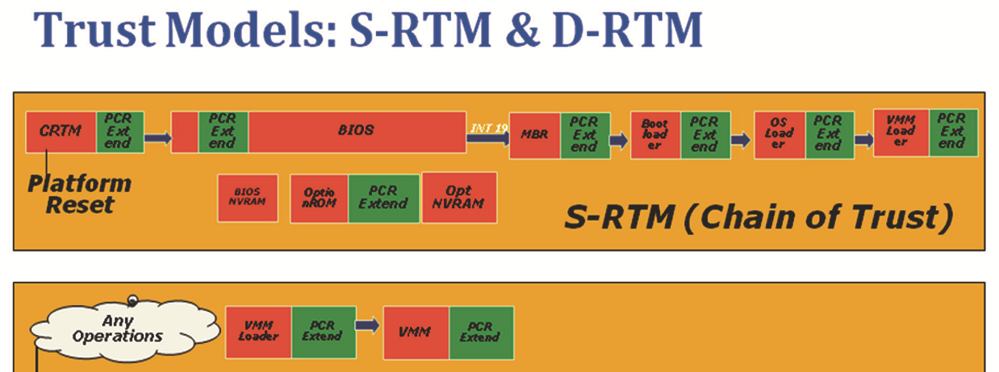

**Figure 10.22:** DRTM Boot Flow

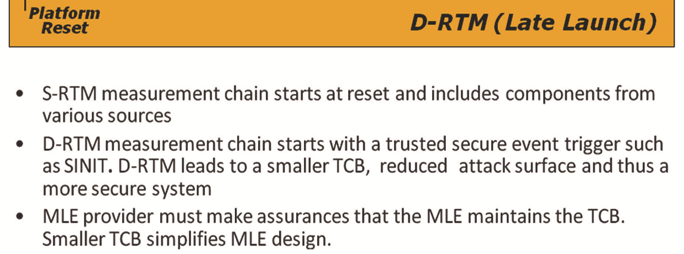

A DRTM implementation can also include a root-of-trust for verification (RTV), too. More information on Intel’s D-RTM implementation can be found in the following

book by David Grawrock, *Dynamics of a Trusted Platform* from Intel Press.

**Platform Manufacturer**

There are several terms that will be introduced in order to facilitate the following dis-

cussion. The first includes the entity that produces the final system board that in-cludes the collection of UEFI and PI modules shown in Figure 10.23. This will be called

the *platform manufacturer* or PM. The authority to perform updates or changes to the configuration of the UEFI and PI modules that ship from the factory are mediated by

PM_AUTH or Platform Manufacturer Authority. PM_AUTH essentially describes the administrative roles that an entity who authenticates or proves itself to be the PM or

delegate of the PM can perform. These actions can include but are not limited to the update of modules, firmware, or early PI settings. PM_AUTH typically is used to en-

sure the integrity of the PI and UEFI modules, and this integrity, or ensuring that the modules came from the manufacturer, can be accomplished via cryptographic up-

dates of modules or signed UEFI capsules, for example.

As noted above, integrity forms one of the key security goals of the platform. If a

third party can replace or impersonate a PI module without the PM’s knowledge, there is an opportunity to introduce a vulnerability into the system.

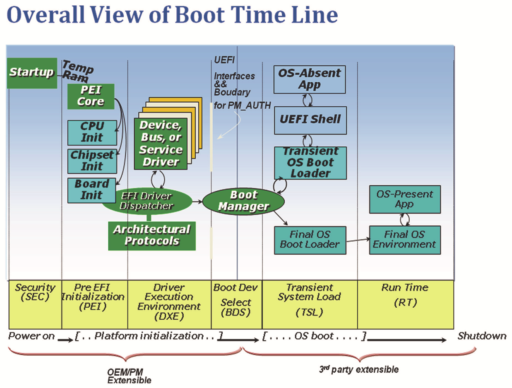

**Figure 10.23:** Overall View of Boot Time Line

When we refer to PM_AUTH, we mean “components that are under the authority of

the Platform manufacturer.” This can include provenance of the PI code and data at rest (in the system board ROM container) and also the temporal state of the code in

memory during system boot and runtime. The PM_AUTH can include the PEI and DXE driver dispatch responsive to an S5 restart, the SMM code running during the operat-

ing system runtime x64, and data at rest in the ROM after field updates.

The PM_AUTH really means that we do not have arbitrary third party extensibil-

ity. Arbitrary third party code could include an operating system loader deposited on the EFI System Partition during a post-ship OS install or upgrade, a PC/AT option

ROM from a host bus adapter plugged into a system.

So for this model of integrity analysis, PM_AUTH = {SEC, PEI Core, PEIMs, DXE

core, DXE drivers, firmware volumes, UEFI variables used only by PEI + DXE, BDS, PMI, SMM, UEFI runtime, ACPI tables, SMBIOS tables}.

Non-PM_AUTH is non-signed UEFI drivers from a host-bus adapter (HBA), non-signed UEFI OS loaders.

**Vulnerability Classification**

There are several terms that will be introduced in this section. These include spoofing, tampering, repudiation, information disclosure, denial of service, and elevation of

privilege.

In order to talk about platform security, some terms will be introduced. Specifically, a vulnerability in a software or firmware product can subject the computer on which

it is running to various attacks. Attacks may be grouped in the following categories: ■ *Spoofing.* An attacker pretends that he is someone else, perhaps in order to inflict

some damage on the person or organization impersonated. ■ *Tampering.* An attacker is able to modify data or program behavior.

■ *Repudiation.* An attacker, who has previously taken some action, is able to deny

that he took it.

■ *Information Disclosure.* An attacker is able to obtain access to information that he

is not allowed to have.

■ *Denial of Service.* An attacker prevents the system attacked from providing ser-

vices to its legitimate users. The victim may become bogged down in fake work-

load, or even shut down completely.

■ *Elevation of Privilege.* An attacker, who has entered the system at a low privilege

level (such as a user), acquires higher privileges (such as those of an administra-

tor).

**Roots of Trust/Guards**

When discussing integrity, a more formal model helps define some of the terms. A

popular commercial integrity model includes that defined by Clark-Wilson (CW). In the CW model, there are controlled data items (CDIs) and uncontrolled data items (UDIs). The former must have some administrative control for changes, whereas the

latter do not.

An example of a UDI can include a UEFI variable like the language code, whereas

a CDI can include authenticated variables such as the signature data base used for managing the x509V3 certificates. Figure 10.24 shows an example of a CDI, such as

UEFI variables, and the Guard. Typically the caller would be a UEFI or OS application, the “request” would be the “set variable,” the Guard would be the UEFI implementa-

tion of the variable services, and the variable itself could include the EFI_VARIA-BLE_AUTHENTICATED_WRITE_ACCESS bit set.

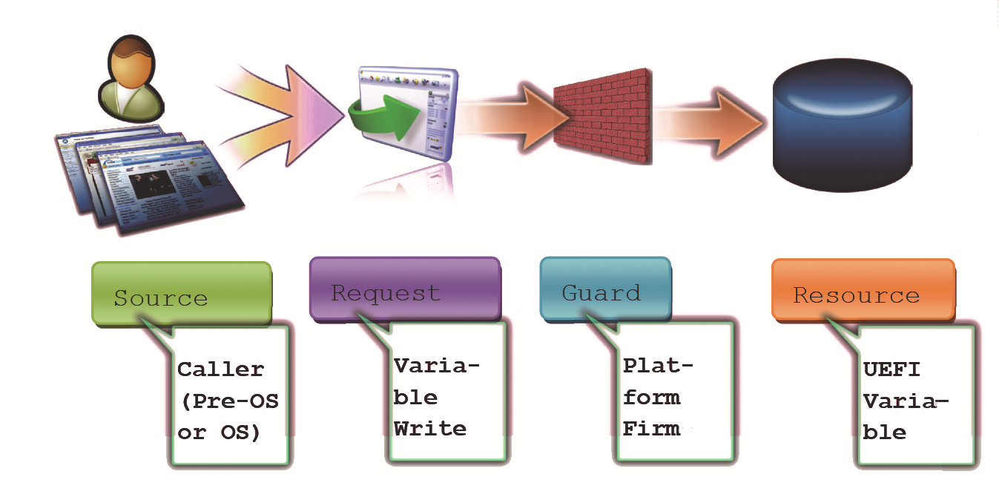

**Figure 10.24:** Example of a CDI

**Summary**

This chapter has reviewed the static root of trust for measurement, or trusted boot, and the associated trusted computing hardware, including the TPM. It then described

other preventive security technology, such as UEFI secure boot.

This chapter then described some background and guidance on how to prepare

and integrate components that meet the platform assurance goals and also realize the purported capabilities of the security and trusted computing elements. This includes

the concepts of trust and security. It also reviewed trusted computing technology, such as the Trusted Platform Module, SRTM, CRTM, and the TBB. Finally, the tech-

nology in the UEFI 2.6 specification for security, such as driver signing, network au-thentication, and user identification was treated.