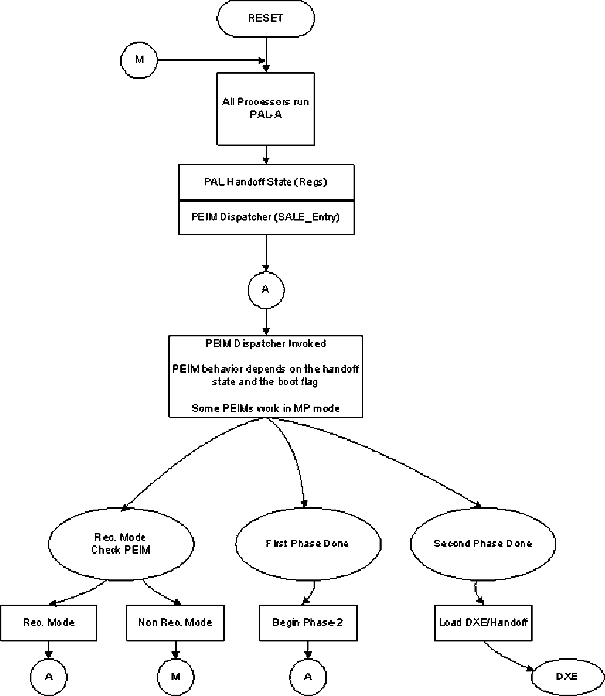

## **Chapter 12 – Boot Flows** 

 

Two roads diverged in a wood….

—Robert Frost, “The Road Less Taken”

 

The restart of a system admits to many possibilities, or paths of execution. The restart

of a CPU execution for a given CPU can have many causes and different environment states that impinge upon it. These can include requests to the firmware for an update

of the flash store, resumption of a power management event, initial startup of the system, and other possible restarts. This chapter describes some of these possible

flows and how the UEFI PI handles the events.

 

To begin, the normal code flow in the UEFI PI passes through a succession of phases, in the following order:

1\. SEC

2\. PEI

3\. DXE

4\. BDS

5\. Runtime

6\. Afterlife

 

This chapter describes alternatives to this ordering, which can also be seen in

Figure 12.1.

 

**Verifier** **Pre** Exposed **OS-Absent** Previously API **App** exposed **CPU** Framework

**ify** **Init** APIs now

**ver** **Chipset** **Device,** **Environment** **Init** **Transient OS** limited

**Board** **Service** **Transient OS** **Init** **Bus, or**

**Driver** **Boot Loader**

**DXE** **Boot** **OS-Present**

**Dispatcher** **Dispatcher** **App**

 

**Runtime Services** **Boot Services** **Final OS** **Final OS** **?** **Boot Loader** **Environment** **DXE Services**

***security***

**Security** **Pre-EFI** **Driver** **Boot** **Transient** **Runtime** **After-**

**(SEC)** **Initialization** **Execution** **Device** **System Load** **(RT)** **life**

**(PEI)** **Environment** **Selection** **(TSL)** **(AL)**

**(DXE)** **(BDS)**

**Power on** **\[ . . Platform initialization . . \]** **\[ . . . . OS boot . . . . \]** **Shutdown**

 

**Figure 12.1:** Ordering of UEFI PI Execution Phases

 

DOI 10.1515/9781501505690-014

**196** \| Chapter 12 – Boot Flows

 

The PEI Foundation is unaware of the boot path required by the system. It relies on the PEIMs to determine the boot mode and to take appropriate action depending on the

mode. To implement this determination of the boot mode, each PEIM has the ability

to manipulate the boot mode using the PEI Service SetBootMode() described in the discussion of PEI in Chapter 13. Note that the PEIM does not change the order in which PEIMs are dispatched depending on the boot mode.

 

**Defined Boot Modes**

 

The list of possible boot modes and their corresponding priorities is shown in the fol-lowing section. UEFI PI architecture avoids defining an upgrade path specifically,

should new boot modes need be defined. This is necessary as the nature of those ad-

ditional boot modes may work in conjunction with or may conflict with the previously defined boot modes.

 

**Priority of Boot Paths**

 

Within a given PEIM, a priority of the boot modes must be observed, as shown in Fig-

ure 12.2. The priority ordering of the sources of boot mode should be as follows (from highest priority to lowest):

 

1\. BOOT_IN_RECOVERY_MODE

2\. BOOT_ON_FLASH_UPDATE

3\. BOOT_ON_S3_RESUME

4\. BOOT_WITH_MINIMAL_CONFIGURATION

5\. BOOT_WITH_FULL_CONFIGURATION

6\. BOOT_ASSUMING_NO_CONFIGURATION_CHANGES

7\. BOOT_WITH_FULL_CONFIGURATION_PLUS_DIAGNOSTICS

8\. BOOT_WITH_DEFAULT_SETTINGS

9\. BOOT_ON_S4_RESUME

10\. BOOT_ON_S5_RESUME

11\. BOOT_ON_S2\_RESUME

Priority of Boot Paths \| **197**

 

Special PEIM -

Warm/Cold Start Detect

**PEI_SPECIAL_BOOT_MODE_PEIM_PPI**

 

S3 Detect

 

**PEI_S \_STA TE_BOOT_MODE_PEIM_PPI** Boot Path Type PEIM

-Ascertain this state, incl. Full

Config, Min config, etc.

 

**PEI_S \_STA TE_BOOT_MODE_PEIM_PPI**

Master/Special PEIM

 

**PEI_MASTER_BOOT_MODE_PEIM_PPI**

Any P EIM ’s

that need different

behavior

Other PEIM 1 Other PEIM N on Boot M ode

 

**Figure 12.2:** Priority of the Boot Modes

 

Table 12.1 lists the assumptions that can and cannot be made about the system for each sleep state.

 

**Table 12.1:** Boot Path Assumptions

 

**System State** **Description** **Assumptions**

 

R0 Cold Boot Cannot assume that the previously stored

configuration data is valid.

 

R1 Warm Boot May assume that the previously stored

configuration data is valid.

 

S3 ACPI Save to RAM Resume The previously stored configuration data

is valid and RAM is valid. RAM configura-

tion must be restored from nonvolatile

storage (NVS) before RAM may be used.

The firmware may only modify previously

reserved RAM. There are two types of re-

served memory. One is the equivalent of

the BIOS INT15h, E820 type-4 memory

and indicates that the RAM is reserved

for use by the firmware. The suggestion

is to add another type of memory that al-

lows the OS to corrupt the memory during

runtime but that may be overwritten dur-

ing resume.

**198** \| Chapter 12 – Boot Flows

 

**System State** **Description** **Assumptions**

 

S4, Save to Disk Resume, S4 and S5 are identical from a PEIM's S5 “Soft Off” point of view. The two are distinguished

to support follow-on phases. The entire

system must be reinitialized but the

PEIMs may assume that the previous con-

figuration is still valid.

 

Boot on Flash Update This boot mode can be either an INIT, S3,

or other means by which to restart the

machine. If it is an S3, for example, the

flash update cause will supersede the S3

restart. It is incumbent upon platform

code, such as the Memory Initialization

PEIM, to determine the exact cause and

perform correct behavior (that is, S3

state restoration versus INIT behavior).

 

**Reset Boot Paths**

 

The following sections describe the boot paths that are followed when a system en-

counters several different types of reset.

 

**Intel® Itanium® Processor Reset**

 

Intel® Itanium® architecture contains enough hooks to authenticate PAL-A and PAL-

B code that is distributed by the processor vendor. The internal microcode on the pro-cessor silicon, which starts up on a PowerGood reset, finds the first layer of processor

abstraction code (called PAL-A) that is located in the Boot Firmware Volume (BFV) using architecturally defined pointers in the BFV. It is the responsibility of this micro-

code to authenticate that the PAL-A code layer from the processor vendor has not been tampered with. If the authentication of the PAL-A layer passes, control then

passes to the PAL-A layer, which then authenticates the next layer of processor ab-straction code (called PAL-B) before passing control to it. In addition to this microar-

chitecture-specific authentication, the SEC phase of UEFI PI is still responsible for lo-cating the PEI Foundation and verifying its authenticity.

In an Itanium-based system, it is also imperative that the firmware modules in the BFV be organized such that at least the PAL-A is contained in the fault-tolerant

regions. This processor-specific PAL-A authenticates the PAL-B code, which is usu-ally contained in the regions of the firmware system that do not support fault-tolerant

Normal Boot Paths \| **199**

 

updates. The PAL-A and PAL-B binary components are always visible to all the pro-cessors in a node at the time of power-on; the system fabric should not need to be in-

itialized.

 

**Non-Power-On Resets**

 

Non-power-on resets can occur for many reasons. Some PEI and DXE system services

reset and reboot the entire platform, including all processors and devices. It is im-

portant to have a standard variant of this boot path for cases such as the following: ■ Resetting the processor to change frequency settings ■ Restarting hardware to complete chipset initialization

■ Responding to an exception from a catastrophic error

 

This reset is also used for Configuration Values Driven through Reset (CVDR) config-uration.

 

**Normal Boot Paths**

 

A traditional BIOS executes POST from a cold boot (G3 to S0 state), on resumes, or in special cases like INIT. UEFI covers all those cases but provides a richer and more

standardized operating environment

The basic code flow of the system needs to be changeable due to different circum-

stances. The boot path variable satisfies this need. The initial value of the boot mode is defined by some early PEIMs, but it can be altered by other, later PEIMs. All systems

must support a basic S0 boot path. Typically a system has a richer set of boot paths, including S0 variations, S-state boot paths, and one or more special boot paths.

 

The architecture for multiple boot paths presented here has several benefits: ■ The PEI Foundation is not required to be aware of system-specific requirements

such as multi-processor capability and various power states. This lack of aware-

ness allows for scalability and headroom for future expansion. ■ Supporting the various paths only minimally impacts the size of the PEI Founda-

tion.

■ The PEIMs required to support the paths scale with the complexity of the system.

 

Note that the Boot Mode Register becomes a variable upon transition to the DXE

phase. The DXE phase can have additional modifiers that affect the boot path more than the PEI phase. These additional modifiers can indicate if the system is in manu-

facturing mode, chassis intrusion, or AC power loss or if silent boot is enabled.

**200** \| Chapter 12 – Boot Flows

 

In addition to the boot path types, modifier bits might be present. The recovery-needed modifier is set if any PEIM detects that it has become corrupted.

 

**Basic G0-to-S0 and S0 Variation Boot Paths**

 

The basic S0 boot path is *boot with full configuration.* This path setting informs all PEIMs to do a full configuration. The basic S0 boot path must be supported.

 

The UEFI PI architecture also defines several optional variations to the basic S0 boot path. The variations that are supported depend on the following: ■ Richness of supported features

■ If the platform is open or closed ■ Platform hardware

 

For example, a closed system or one that has detected a chassis intrusion could sup-port a boot path that assumes no configuration changes from last boot option, thus allowing a very rapid boot time. Unsupported variations default to basic S0 operation.

The following are the defined variations to the basic boot path: ■ *Boot with minimal configuration:* This path is for configuring the minimal amount

of hardware to boot the system.

■ *Boot assuming no configuration changes:* This path uses the last configuration

data.

■ *Boot with full configuration plus diagnostics:* This path also causes any diagnos-

tics to be executed.

■ *Boot with default settings:* This path uses a known set of safe values for program-

ming hardware.

 

**S-State Boot Paths**

 

The following optional boot paths allow for different operation for a resume from S3,

S4, and S5:

■ *S3 (Save to RAM Resume):* Platforms that support S3 resume must take special

care to preserve/restore memory and critical hardware. ■ *S4 (Save to Disk):* Some platforms may want to perform an abbreviated PEI and

DXE phase on a S4 resume.

■ *S5 (Soft Off):* Some platforms may want an S5 system state boot to be differenti-

ated from a normal boot—for example, if buttons other than the power button can

wake the system.

Recovery Paths \| **201**

 

An S3 resume needs to be explained in more detail because it requires cooperation between a G0-to-S0 boot path and an S3 resume boot path. The G0-to-S0 boot path

needs to save hardware programming information that the S3 resume path needs to

retrieve. This information is saved in the Hardware Save Table using predefined data structures to perform I/O or memory writes. The data is stored in a UEFI equivalent of the INT15 E820 type 4 (firmware reserved memory) area or a firmware device area that

is reserved for use by UEFI. The S3 resume boot path code can access this region after memory has been restored.

 

**Recovery Paths**

 

All of the previously described boot paths can be modified or aborted if the system

detects that recovery is needed. Recovery is the process of reconstituting a system’s firmware devices when they have become corrupted. The corruption can be caused by various mechanisms. Most firmware volumes on nonvolatile storage devices

(flash, disk) are managed as blocks. If the system loses power while a block, or se-mantically bound blocks, are being updated, the storage might become invalid. On

the other hand, the device might become corrupted by an errant program or by errant hardware. The system designers must determine the level of support for recovery

based on their perceptions of the probabilities of these events occurring and their consequences.

 

The following are some reasons why system designers may choose not to support re-covery:

■ A system’s firmware volume storage media might not support modification after

being manufactured. It might be the functional equivalent of ROM. ■ Most mechanisms of implementing recovery require additional firmware volume

space, which might be too expensive for a particular application. ■ A system may have enough firmware volume space and hardware features that

the firmware volume can be made sufficiently fault tolerant to make recovery un-

necessary.

 

**Discovery**

 

Discovering that recovery is required may be done using a PEIM (for example, by checking a “force recovery” jumper) or the PEI Foundation itself. The PEI Foundation

might discover that a particular PEIM has not validated correctly or that an entire firmware has become corrupted.

**202** \| Chapter 12 – Boot Flows

 

**General Recovery Architecture**

 

The concept behind recovery is to preserve enough of the system firmware so that the

system can boot to a point where it can do the following: ■ Read a copy of the data that was lost from chosen peripherals. ■ Reprogram the firmware volume with that data.

 

Preserving the recovery firmware is a function of the way the firmware volume store

is managed, which is generally beyond the scope of this book. For the purpose of this

description, it is expected that the PEIMs and other contents of the firmware volumes required for recovery are marked. The architecture of the firmware volume store must then preserve marked items, either by making them unalterable (possibly with hard-

ware support) or must protect them using a fault-tolerant update process. Note that a PEIM is required to be in a fault-tolerant area if it indicates it is required for recovery

or if a PEIM required for recovery depends on it. This architecture also assumes that it is fairly easy to determine that firmware volumes have become corrupted.

The PEI Dispatcher then proceeds as normal. If it encounters PEIMs that have been corrupted (for example, by receiving an incorrect hash value), it itself must

change the boot mode to recovery. Once set to recovery, other PEIMs must not change it to one of the other states. After the PEI Dispatcher has discovered that the system is

in recovery mode, it will restart itself, dispatching only those PEIMs that are required for recovery. A PEIM can also detect a catastrophic condition or a forced-recovery

event and inform the PEI Dispatcher that it needs to proceed with a recovery dispatch. A PEIM can alert the PEI Foundation to start recovery by OR-ing the BOOT_IN_RE-

COVERY_MODE_MASK bit onto the present boot mode. The PEI Foundation then re-sets the boot mode to BOOT_IN_RECOVERY_MODE and starts the dispatch from the

beginning with BOOT_IN_RECOVERY_MODE as the sole value for the mode.

It is possible that a PEIM could be built to handle the portion of the recovery that would initialize the recovery peripherals (and the buses they reside on) and then to read the new images from the peripherals and update the firmware volumes.

It is considered far more likely that the PEI will transition to DXE because DXE is designed to handle access to peripherals. This transition has the additional benefit

that, if DXE then discovers that a device has become corrupted, it may institute recov-ery without transferring control back to the PEI.

If the PEI Foundation does not have a list of what it is to dispatch, how does it know whether an area of invalid space in a firmware volume should have contained

a PEIM or not? It seems that the PEI Foundation may discover most corruption as an incidental result of its search for PEIMs. In this case, if the PEI Foundation completes

its dispatch process without discovering enough static system memory to start DXE, then it should go into recovery mode.

Special Boot Path Topics \| **203**

 

**Special Boot Path Topics**

 

The remaining sections in this chapter discuss special boot paths that might be avail-able to all processors or specific considerations that apply only for Intel Itanium pro-

cessors.

 

**Special Boot Paths**

 

The following are special boot paths in the UEFI PI architecture. Some of these paths

are optional and others are processor-family specific.

■ *Forced recovery boot:* A jumper or an equivalent mechanism indicates a forced

recovery.

■ *Intel Itanium architecture boot paths:* See the next section.

■ *Capsule update:* This boot mode can be an INIT, S3, or some other means by

which to restart the machine. If it is an S3, for example, the capsule cause will

supersede the S3 restart. It is incumbent upon platform code, such as a memory

initialization PEIM, to determine the exact cause and perform the correct behav-

ior—that is, S3 state restoration versus INIT behavior.

 

**Special Intel Itanium****®** **Architecture Boot Paths**

 

The architecture requires the following special boot paths: ■ *Boot after INIT:* An INIT has occurred. ■ *Boot after MCA:* A Machine Check Architecture (MCA) event has occurred.

 

Intel Itanium processors possess several unique boot paths that also invoke the dis-

patcher located at the System Abstraction Layer entry point SALE_ENTRY. The pro-

cessor INIT and MCA are two asynchronous events that start up the SEC code/dis-patcher in an Itanium-based system. The UEFI PI security module is transparent during all the code paths except for the recovery check call that happens during a

cold boot. The PEIMs or DXE drivers that handle these events are architecture-aware and do not return the control to the core dispatcher. They call their respective archi-

tectural handlers in the OS.

 

**Intel Itanium® Architecture Access to the Boot Firmware Volume**

 

Figure 12.3 shows the reset boot path that an Intel Itanium processor follows. Figure

12.4 shows the boot flow.

**204** \| Chapter 12 – Boot Flows

 

**PowerGood**

 

Microcode PAL-A PAL-B

Startup Authenticate Authenticate

 

**Framework SEC Phase Starts Up**

 

**Figure 12.3:** Intel® Itanium® Architecture Resets

 

**Figure 12.4:** Intel® Itanium® Processor Boot Flow (MP versus UP on Other CPUs)

 

In Intel Itanium architecture, the microcode starts up the first layer of the PAL code,

provided by the processor vendor, which resides in the Boot Firmware Volume (BFV). This code minimally initializes the processor and then finds and authenticates the

second layer of PAL code (called PAL-B). The location of both PAL-A and PAL-B can

Special Boot Path Topics \| **205**

 

be found by consulting either the architected pointers in the ROM near the 4-gigabyte region or by consulting the Firmware Interface Table (FIT) pointer in the ROM. The

PAL layer communicates with the OEM boot firmware using a single entry point called

SALE_ENTRY.

 

The Intel Itanium architecture defines the initialization described above. In addition,

however, Itanium-based systems that use the UEFI PI architecture must do the fol-lowing:

■ A “special” PEIM must be resident in the BFV to provide information about the

location of the other firmware volumes.

■ The PEI Foundation will be located at the SALE_ENTRY point on the BFV. The

Intel Itanium architecture PEIMs may reside in the BFV or other firmware vol-

umes, but a special PEIM must be resident in the BFV to provide information

about the location of the other firmware volumes.

■ The BFV of a particular node must be accessible by all the processors running in

that node.

■ All the processors in each node start up and execute the PAL code and subse-

quently enter the PEI Foundation. The BFV of a particular node must be accessi-

ble by all the processors running in that node. This distinction also means that

some of the PEIMs in the Intel Itanium architecture boot path will be multi-pro-

cessor-aware.

■ Firmware modules in a BFV must be organized such that PAL-A, PAL-B, and FIT

binaries are always visible to all the processors in a node at the time of power-on. ■ These binaries must be visible without any initialization of the system fabric.

 

//\*\*\*\*\*\*\*\*\*\*\*\*\*\*\*\*\*\*\*\*\*\*\*\*\*\*\*\*\*\*\*\*\*\*\*\*\*\*\*\*\*\*\*\*\*\*\*\*\*\*\*\*\*\*\* // EFI_BOOT_MODE

//\*\*\*\*\*\*\*\*\*\*\*\*\*\*\*\*\*\*\*\*\*\*\*\*\*\*\*\*\*\*\*\*\*\*\*\*\*\*\*\*\*\*\*\*\*\*\*\*\*\*\*\*\*\*\* typedef UINT32 EFI_BOOT_MODE;

 

\#define

BOOT_WITH_FULL_CONFIGURATION 0x00 \#define

BOOT_WITH_MINIMAL_CONFIGURATION 0x01 \#define

BOOT_ASSUMING_NO_CONFIGURATION_CHANGES 0x02 \#define

BOOT_WITH_FULL_CONFIGURATION_PLUS_DIAGNOSTICS 0x03 \#define

BOOT_WITH_DEFAULT_SETTINGS 0x04 \#define

BOOT_ON_S4_RESUME 0x05 \#define

BOOT_ON_S5_RESUME 0x06 \#define

BOOT_ON_S2_RESUME 0x10 \#define

**206** \| Chapter 12 – Boot Flows

 

BOOT_ON_S3_RESUME 0x11 \#define

BOOT_ON_FLASH_UPDATE 0x12 \#define

BOOT_IN_RECOVERY_MODE 0x20

 

0x21 -- 0xF..F Reserved Encodings

 

Table 12.2 lists the values and descriptions of the boot modes.

 

**Table 12.2:** Boot Mode Register

 

**REGISTER BIT(S)** **VALUES DESCRIPTIONS**

 

MSBit-0 000000b Boot with full configuration

 

000001b Boot with minimal configuration

 

000010b Boot assuming no configuration changes from last

boot

 

000011b Boot with full configuration plus diagnostics

 

000100b Boot with default settings

 

000101b Boot on S4 resume

 

000110b Boot in S5 resume

 

000111b-001111b Reserved for boot paths that configure memory

 

010000b Boot on S2 resume

 

010001b Boot on S3 resume

 

010010b Boot on flash update restart

 

010011b-011111b Reserved for boot paths that preserve memory con-

text

 

100000b Boot in recovery mode

 

100001b-111111b Reserved for special boots

Recovery \| **207**

 

**Architectural Boot Mode PPIs**

 

In the PEI chapter the concept of an PEIM-to-PEIM interface (PPI) is introduced as the unit of interoperability in this phase of execution. PEI modules can ascertain the boot

mode via the GetBootMode service once the module is dispatched, but a system

designer may not want a PEIM to even run unless in a given boot mode. A possible hierarchy of boot mode PPIs abstracts the various producers of the boot mode. It is a hierarchy in that there should be an order of precedence in which each mode can be

set. The PPIs and their respective GUIDs are described in Required Architectural PPIs for the PEI phase that can be found in the PEI Core Interface Specification and Optional Architectural

PPIs. The hierarchy includes the master PPI, which publishes a PPI depended upon by

the appropriate PEIMs, and some subsidiary PPI. For PEIMs that require that the boot mode is finally known, the Master Boot Mode PPI can be used as a dependency.

Table 12.3 lists the architectural boot mode PPIs.

 

**Table 12.3:** Architectural Boot Mode PPIs

 

**PPI Name** **Required or Optional?** **PPI Definition in Section...**

 

Master Boot Mode PPI Required Architectural PPIs: Required

Architectural PPIs

 

Boot in Recovery Mode PPI Optional Architectural PPIs: Optional

Architectural PPIs

 

**Recovery**

 

This section describes platform firmware recovery. *Recovery* is an option to provide higher RASUM (Reliability, Availability, Serviceability, Usability, Manageability) in

the field. Recovery is the process of reconstituting a system’s firmware devices when they have become corrupted. The corruption can be caused by various mechanisms.

Most firmware volumes (FVs) in nonvolatile storage (NVS) devices (flash or disk, for example) are managed as blocks. If the system loses power while a block, or seman-

tically bound blocks, are being updated, the storage might become invalid. On the other hand, an errant program or hardware could corrupt the device. The system de-

signers must determine the level of support for recovery based on their perceptions of the probabilities of these events occurring and the consequences.

**208** \| Chapter 12 – Boot Flows

 

**Discovery**

 

Discovering that recovery is required may be done using a PEIM (for example, by

checking a “force recovery” jumper) or the PEI Foundation itself. The PEI Foundation might discover that a particular PEIM has not validated correctly or that an entire firmware has become corrupted.

 

**Note** At this point a physical reset of the system has not occurred. The PEI Dispatcher has

only cleared all state information and restarted itself.

 

It is possible that a PEIM could be built to handle the portion of the recovery that

would initialize the recovery peripherals (and the buses they reside on) and then to read the new images from the peripherals and update the FVs.

It is considered far more likely that the PEI will transition to DXE because DXE is designed to handle access to peripherals. This has the additional benefit that, if DXE

then discovers that a device has become corrupted, it may institute recovery without transferring control back to the PEI.

Since the PEI Foundation does not have a list of what to dispatch, how does it know if an area of invalid space in an FV should have contained a PEIM or not? The

PEI Foundation should discover most corruption as an incidental result of its search for PEIMs. In this case, if the PEI Foundation completes its dispatch process without

discovering enough static system memory to start DXE, then it should go into recov-ery mode.

 

**Summary**

 

This chapter has described the various boot modes that the UEFI PI firmware can sup-port. This concept is important to understand as both a provider of PEI modules and

DXE drivers, along with platform integrators. The former constituency needs to de-sign their code to handle the boot modes appropriately, whereas the latter group of

engineers needs to understand how to compose a set of modules and drivers for the respective boot paths of a resultant system.