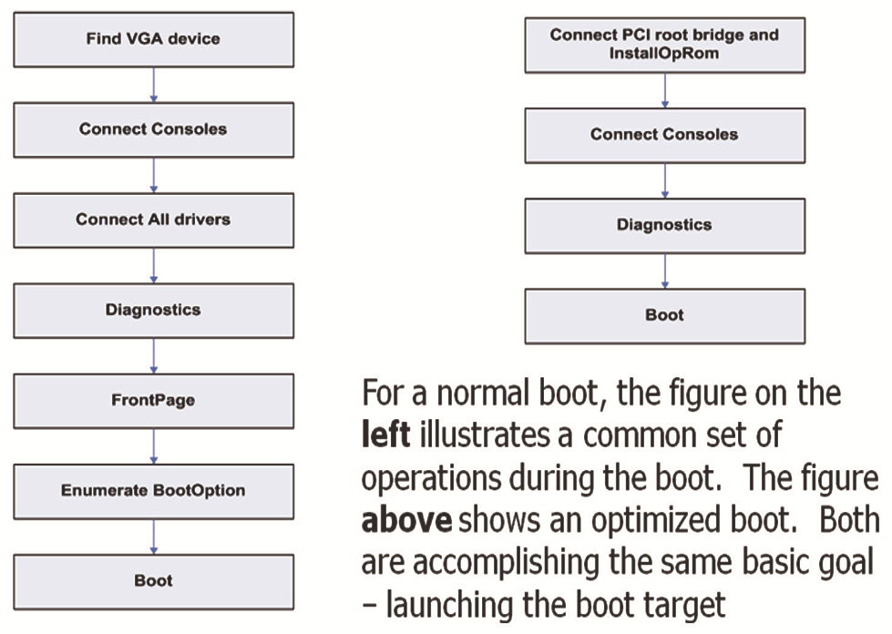
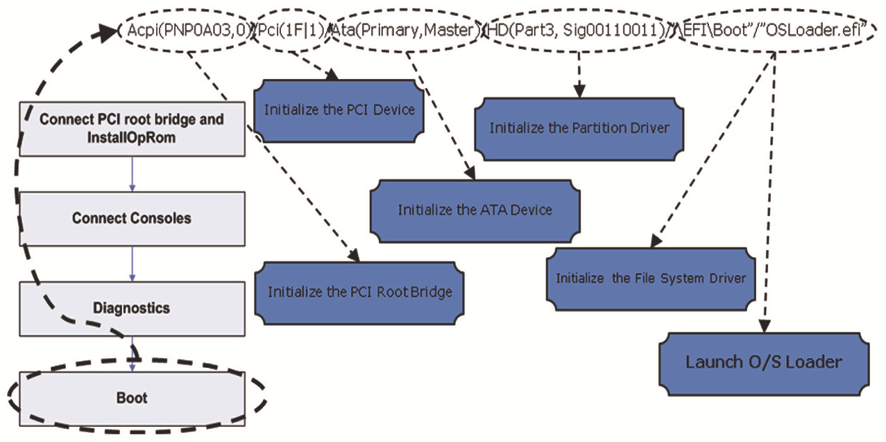

## **Chapter 15 – Reducing Platform Boot Times** 

 

All problems are either kernel or BIOS problems depending on which context you are running in!

—Rothman’s Axiom

 

This chapter presents a series of methods that should enable a BIOS engineer to opti-

mize the underlying platform firmware so that it can reduce a platform’s boot speed. However, it should be noted that the intent of this chapter is to illustrate how various,

seemingly unrelated product requirements can greatly affect the resulting platform boot performance. That being said, this section also illustrates how the platform de-

sign based on marketing requirements, coupled with a properly constructed UEFI-compliant firmware, can greatly affect the performance characteristics of a platform.

Some of the key points are:

■ How specific marketing requirements affect boot performance

■ Suggestions on what firmware engineering choices can be made to optimize for a

given platform requirement.

■ Provide a realistic view of what performance enhancements can be done in a pro-

duction firmware.

■ Establish viable next steps.

 

This chapter focuses on specific aspects of a platform’s pre-O/S boot behavior and leverages concepts that are based on the UEFI firmware architecture.

Some of the fundamental things that need to be understood are different phases of platform initialization and how they are exercised as part of the platform boot pro-

cess. The following flow diagrams, Figures 15.1, 15.2, and 15.3, illustrate the evolution of the platform initialization from the first moment that power is applied until the

point where the BIOS hands-off to the target O/S:

 

DOI 10.1515/9781501505690-017

**238** \| Chapter 15 – Reducing Platform Boot Times

 

Reset Vector

 

Flush cache and jump into main initialization

routine in the ROM.

 

Switch to protected mode

 

Transition to a non-paged flat-model protected mode

 

Initialize MTRRs for BSP

 

Set cache states for various memory ranges to a known state.

 

Microcode Patch Update

 

Execute Microcode Patch Update for all of the present CPUs.

(Common process, but an optional behavior in closed-box

controlled configuration systems)

 

Initialize No-Eviction Mode (NEM)

 

Prior to the discovery of memory on the platform, a data area will

be established within the CPU cache so that a stack-based

programming language can be used early in the initialization.

 

Various early BSP/AP interactions

 

A series of standard steps which contain some fixed delay events such as:

Send INIT IPI to all APs

Send Start-up IPI (SIPI) to all Aps

Collect BIST data from the APs

 

Hand-off to PEI entry point

 

**Figure 15.1:** SEC Phase

Proof of Concept \| **239**

 

**Dashed Boxes or lines** Hand-off from SEC to PEI Core **are informational.**

 

Establish use of “memory”

Transfer services from being ROM-based to data running from early

memory (e.g. CPU cache). This includes the presence of PEI

services such as memory, PEI module interfaces, and security.

 

PEI Dispatcher

Loads a series of PEI modules (PEIM) based on a series of criterion. Dispatching starts with modules which have no

prerequisites and proceed through other modules which have more complex dependencies. This is typically a loop which

is exhausted when there are no further modules that need dispatching and there are no newly discovered modules.

 

CPU PEIM

Module which exposes a series of CPU-related functions.

Some of these functions are the CPU Cache interface (Set/

Reset), and CPU Frequency Select Interface.

 

Miscellaneous Platform PEIM

ICH Init

MCH Init Executes a series of early hardware initialization such as

memory controller hub (MCH) init, I/O controller hub (ICH)

Do absolute minimal ICH

Programs some key init, initialize built-in platform interfaces (e.g. Stall, SMBUS

programming. This includes

aspects of the MCH such Policy, Reset, etc). Also determines what the boot mode is

basic ACPI/GPIO initialization,

as the base address of we are currently booting with (e.g. Normal, Recovery, S3,

and programming Flash map

several key components. etc.). This is also where the platform exposes the boot

access into ICH

mode so that subsequent modules can potentially have

boot mode based behavior.

 

Memory Initialization PEIM

Execute Memory Initialization for the platform. Assign memory for remainder of PEI and subsequent boot

phases. In this case, some optimizations are enabled for performance such as eliminating memory test

during S3 resume or re-programming captured memory reference code state in S3 resume mode.

 

Are we in an

No

S3 Boot mode?

 

Yes

Multiprocessor CPU PEIM For S3 Boot Mode

Initializes a variety of components within the CPU domain with optimizations

associated with S3. Basic initialization of CPU to establish various CPU-specific

settings (e.g. VMX, SMRR, Thermal Throttling settings, MTRR Synchronization, etc.)

S3 Boot Script Executor

Executes the S3 Boot Script to re-establish hardware

programming in a very low-overhead manner.

 

O/S Resume Vector Hand-off to DXE entry point

 

**Figure 15.2:** PEI Phase

**240** \| Chapter 15 – Reducing Platform Boot Times

 

**Dashed Boxes or lines** Hand-off from PEI to DXE Core

**are informational.**

 

Establish DXE infrastructure

The Driver eXecution Environment (DXE) is established based on the discovered

resources described by the prior PEI phase of operations. This includes DXE core

callable interfaces, event services, and the eventual launch of the DXE dispatcher.

 

DXE Dispatcher

Architectural Protocols

The dispatcher is tasked with the job of discovering the FV (firmware volume)

Some of the key drivers

components that are available and processing them. Each of the discovered drivers

needed for the core to

within the FV is scheduled to be launched if and when their dependencies are met.

operate. Some of these are

Once a driver is scheduled to run, the dispatcher will proceed to launch the

the BDS, CPU, Timer, etc.

scheduled drivers and continue to do so until there are no more scheduled drivers.

 

Discovered Components

During the search for FVs, Boot Device Select Phase

various drivers can be

discovered and potentially Based on the programmed boot variable, the Boot Device Select (BDS) phase ultimately will

launched. Some of these attempt to connect the boot devices required to load and invoke the selected boot target

drivers are components such (e.g. O/S). This usually encompasses a recursive search for additional FVs and content to

as network drivers, I/O drivers dispatch from them.

(e.g. USB/PCI), and any OEM

or platform specific drivers.

 

Yes

Dispatch new DXE drivers

Have we made

Can the boot target

Yes No progress since last Yes

be loaded? Dispatch content from

attempt?

discovered FVs.

No

 

Hand-off to the Boot Target

Are there more

Yes Load new boot option

boot options to try?

 

Platform Policy

When no viable boot options exist, the platform

will have some built-in boot behavior that is

specific to the manufacturer of that platform.

 

**Figure 15.3:** DXE and BDS Phase

 

Given the above information, the remainder of the chapter focuses on the important

elements when considering how to best optimize some of the aforementioned behav-ior so a platform meets both its technical and marketing requirements yet achieves an optimal boot speed.

 

**Proof of Concept**

 

In the proof of concept for this chapter, the overall performance numbers used are

measured in microseconds and the total boot time is described in seconds. Total boot time is measured as the time between the CPU first having power applied and the

transferring of control to the boot target (which is typically the OS). This chapter does Marketing Requirements \| **241**

 

not focus on the specifics of the hardware design itself since the steps that are de-scribed are intended to be platform-agnostic. However, for those who absolutely must

know from what type of platform some of the numbers are derived, they are:

■ 1.8-GHz Intel® Atom™-based netbook design ■ 1 GB DDR2 memory

■ 2 MB flash

■ Western Digital† 80-GB Scorpio Blue 5400-RPM drive (normal configuration) ■ Intel® Solid State Drive X25-E (Intel® X25E SSD) (in optimized configuration)

 

It should also be noted that this proof of concept was intended to emulate real-world

expectations of a BIOS, meaning that nothing was done to achieve results that could not reasonably be expected in a mass-market product design. The steps that were

taken for this effort should be easily portable to other designs and should largely be codebase-independent.

Figure 15.4 shows the performance numbers achieved while maintaining all of the various platform/marketing requirements for this particular system.

 

SEC Phase Duration : 26342 (us) SEC Phase Duration : 26419 (us) PEI Phase Duration : 1230905 (us) PEI Phase Duration : 763315 (us) DXE Phase Duration : 998234 (us) DXE Phase Duration : 443021 (us) BDS Phase Duration : 7396050 (us) BDS Phase Duration : 766778 (us) Total Duration : **9.651531 (s)** Total Duration : **1.999533 (s)**

**Normal Boot** **Optimized Boot**

 

**Figure 15.4:** Performance Measurement Results (Before/After)

 

The next several sections detail the various decisions that were made for this proof of

concept and how they improved the boot performance.

 

**Marketing Requirements**

 

Admittedly, marketing requirements are not the first thing that comes to mind when

an engineer sits down to optimize a BIOS’s performance. However, the reality is that marketing requirements form the practical limits for how the technical solution can

be adjusted.

The highlighted requirements are the pivot points in which an engineer can make

decisions that ultimately affect performance characteristics of the system. Since this section details the engineering responses to marketing-oriented requirements, it does

not provide a vast array of code optimization “tricks.” Unless there is a serious set of implementation bugs in a given codebase, the majority of boot speed improvements

are achieved from following the guidelines provided in this section. Not to worry **242** \| Chapter 15 – Reducing Platform Boot Times

 

though, there are codebase independent “tricks” included that provide additional help.

 

**What Are the Design Goals?**

 

How does the user need to use the platform? Is it a “closed box” system? Is it a tradi-tional desktop? Is it a server? How the platform is thought of ultimately affects what

the user expects. Making conscious design choices to either enable or limit some of

these expectations is where the platform policy can greatly affect the resulting per-formance characteristics.

 

**Platform Policy**

 

One of the first considerations when looking at a BIOS and the corresponding require-ments is whether or not an engineer can limit the number of variables associated with what the user can do “to” the system. For instance, it might be reasonable to presume

that in a platform with no add-in slots, a user will not be able to boot from a RAID controller since the user cannot physically plug one in.

This is where a designer enters the zone of platform policy. Even though a plat-form may not expose a slot, the platform might expose a USB connection. A conscious

decision needs to be made for how and when these components are used. A good general performance optimization statement would be:

 

“If you can put off doing something in BIOS that the OS can do—then put it off!”

 

Since a user can connect anything from a record player to a RAID chassis via USB, the user might think that they would be able to boot from a USB-connected device if phys-ically possible. Though this is physically possible, it is within the purview of the plat-

form design to enable or disable such a behavior.

In this particular platform, the decision was made to not support booting from

USB media and to not support the user interrupting the boot process. This means that during the DXE/BDS phase, the BIOS was able to avoid initializing the USB infrastruc-

ture to get keystrokes and this resulted in a savings of nearly 0.5 second in boot time.

 

**Note** Even though 0.5 second of boot time was saved by eliminating late BIOS USB initiali-

zation, upon launching the platform OS, the OS was able to interact with plugged-in USB devices without a problem.

 

Platform policy ultimately affects how an engineer responds to the remaining ques-tions.

Marketing Requirements \| **243**

 

**What Are the Supported OS Targets?**

 

Understanding the requirements of a particular platform-supported OS greatly affects

what optimization paths can be taken in the BIOS. Since many “open” platforms (plat-forms without a fixed software or hardware configuration) have a wide variety of op-erating systems that they choose to support, this limits some of the choices available.

In the case of the proof-of-concept platform, only two main operating systems were required to be supported. This enabled the author to make a few choices that allowed

the codebase to save roughly 400 ms of boot time by avoiding the reading of some of the DIMM SPD data for creating certain SMBIOS records since they weren’t used by

the target operating systems.

 

**Note** Changes in the BIOS codebase that avoided the unnecessary creation of certain ta-

bles saved roughly 400 ms in the boot time.

 

**Do We Have to Support Legacy Operating Systems?**

 

The main consideration was whether a particular OS target was UEFI-compliant or not. If all the OS targets were UEFI-compliant, then the platform could have saved roughly 0.5 second in the underlying initialization of the video option ROM. In this

case, we had conflicting requirements: one was UEFI-compliant and one was not. There are a variety of tricks that could have been achieved by the platform BIOS when

booting the UEFI-compliant OS but for purposes of keeping fair measurement num-bers, the overall boot speed numbers reflect the overhead of supporting legacy oper-

ating systems as well.

To save an additional 0.5 second or more of boot time when booting a UEFI-com-

pliant OS, the BDS could analyze the target BOOT#### variable to determine if the target were associated with an OS loader and thus it is a UEFI target. The platform in

this case at least has the option to avoid some of the overhead associated with the legacy compatibility support infrastructure.

 

**Do We Have to Support Legacy Option ROMs?**

 

Whether or not to launch a legacy option ROM depends on several possible variables: ■ Does the motherboard have any devices built in that have a legacy option ROM?

■ Does the platform support adding a device that requires the launch of a legacy

option ROM?

■ If any of the first two are true, does the platform need to initialize the device as-

sociated with that option ROM?

**244** \| Chapter 15 – Reducing Platform Boot Times

 

One reason why launching legacy option ROMs is fraught with peril for boot perfor-mance is that there are no rules associated with what a legacy option ROM will do

while it has control of the system. In some cases, the option ROM may be rather in-

nocuous regarding boot performance, but not always. For example, the legacy option ROM could attempt to interact with the user during launch. This normally involves advertising a hot-key or two for the user to press, which would delay the BIOS in fin-

ishing its job for however long the option ROM pauses waiting for a keystroke.

For this particular situation, we avoided the launching of all of the drivers in a

particular BIOS and instead opted to launch only the drivers necessary for reaching the boot target itself. Since the device we were booting from was a SATA device for

which the BIOS had a native UEFI driver, there was no need to launch an option ROM. This action alone saved approximately three seconds on the platform. More details

associated with this trick and others are in the section “Additional Details.”

 

**Are We Required to Display an OEM Splash Screen?**

 

This is often a crucial element for many platforms, especially from a marketing point

of view. The display of the splash screen itself typically does not take that much time. Usually initializing the video device to enable such a display takes a sizable amount

of time. On the proof-of-concept platform, it would typically take 300 ms. An im-portant question is how long does marketing want the logo to be displayed? The an-

swer to this question will focus on what is most important for the OEM delivering the platform. Sometimes speed is paramount (as it was with this proof of concept), and

the splash screen can be eliminated completely. Other times, the display of the logo is deemed much more important and all things stop while the logo is displayed. An

engineer’s hands are usually tied by the decisions of the marketing infrastructure.

One could leverage the UEFI event services to take advantage of the marketing-

driven delay to accomplish other things, which effectively parallelizes some of the initialization.

 

**What Type of Boot Media Is Supported?**

 

In the proof of concept platform description, one element was a bit unusual. There was a performance and a standard configuration associated with the drive attached

to the system. Though it may not be obvious, the choice of boot media can be a sig-nificant element in the boot time when you consider that some drives require 1–5 sec-

onds (or much more) to spin up. The characteristics of the boot media are very im-portant since, regardless of whatever else you might do to optimize the boot process,

the platform still has to read from the boot media and there are some inherent tasks Marketing Requirements \| **245**

 

associated with doing that. Spin-up delays are one of those tasks that are unavoidable in today’s rotating magnetic media.

For the proof of concept, the boot media of choice was one which incurs no spin-

up penalty; thus a solid state drive (SSD) was chosen. This saved about two seconds from the boot time.

 

**What Is the BIOS Recovery/Update Strategy?**

 

How a platform handles a BIOS update or recovery can affect the performance of a platform. Since this task may be accomplished in many ways, this may inevitably be one of those mechanisms that has significant platform variability. There are a few

very common ways a BIOS update is achieved from a user’s perspective: ■ A user executes an OS application, which they likely downloaded from the OEM’s

Website. This will eventually cause the machine to reboot. ■ A user downloads a special file from an OEM’s Website and puts it on a USB don-

gle and reboots the platform with the USB dongle connected. ■ A user receives or creates a CD or floppy with a special file and reboots the plat-

form to launch the BIOS update utility contained within that special file.

 

These user scenarios usually resolve into the BIOS, during the initialization caused by the reboot, reading the update/recovery file from a particular location. Where that

update/recovery file is stored and when it is processed is really what affects perfor-mance.

 

**When Processing Things Early**

 

Frequently during recovery one cannot presume that the target OS is working. For a reasonable platform design, someone would need to design a means by which to up-

date or recover the BIOS without the assistance of the OS. This would lead to user scenarios \#2 or \#3 listed above.

The question an engineer should ask themselves is, how do you notify the BIOS that the platform is in recovery mode? Depending on what the platform policy pre-

scribes, this method can vary greatly. One option is to always probe a given set of possible data repositories (such as USB media, a CD, or maybe even the network) for

recovery content. The act of always probing is typically a time-consuming effort and not conducive to quick boot times.

There is definitely the option of having a platform-specific action, which is easy and quick to probe that “turns on” the recovery mode. How to turn on the recovery

mode (if such a concept exists for the platform) is very platform-specific. Examples of this are holding down a particular key (maybe associated with a GPIO), flipping a **246** \| Chapter 15 – Reducing Platform Boot Times

 

switch (equivalent of moving a jumper), which can be probed for, and so on. These methods are highly preferable since they allow a platform to run without much bur-

den (no extensive probing for update/recovery.)

 

**Is There a Need for Pre-OS User Interaction?**

 

Normally the overall goal is to boot the target OS as quickly as possible and the only

expected user interaction is with the OS. That being said, the main reason for people

today to interact with the BIOS is to launch the BIOS setup. Admittedly, some settings are within this environment that are unique and cannot be properly configured out-side of the BIOS. However at least one major OEM (if not more) has chosen to ship

millions of UEFI-based units without exposing what is considered a BIOS setup. It might be reasonable to presume for some platforms that the established factory de-

fault settings are sufficient and require no user adjustments. Most OEMs do not go this route. However, it is certainly possible for an OEM to expose “applets” within the

OS to provide some of the configurability that would have otherwise been exposed in the pre-OS timeframe.

With the advent of UEFI 2.1, and more specifically the HII (Human Interface In-frastructure) content in that specification, the ability for configuration data in the

BIOS to be exposed to the OS was made possible. This makes it possible for many of the BIOS settings to have methods exposed and configured in nontraditional (pre-OS)

ways.

If it is deemed unnecessary to interact with the BIOS, there is very little reason

(except as noted in prior sections) for the BIOS to probe for a hot key. This only takes time from a platform boot without being a useful feature of the platform.

 

**Additional Details**

 

When it comes time to address some codebase issues, the marketing requirements

clearly define the problem space an engineer has to design around. With that infor-mation, several methods can help that are fairly typical of a UEFI-based platform. These are not the only methods, but they are the ones that most any UEFI codebase

can use.

 

**Adjusting the BIOS to Avoid Unnecessary Drivers**

 

It is useful to understand the details of how we avoided executing some of the extra

drivers in our platform. It is also useful to reference the appropriate sections in the Additional Details \| **247**

 

UEFI specification to better understand some of the underlying parts that cannot, for conciseness, be covered in this chapter.

The BDS phase of operations is where various decisions are made regarding what

gets launched and what platform policy is enacted. That being said, this is the code (regardless of which UEFI codebase you use) that will frequently get the most atten-tion in the optimizations. If we refer again to the boot times for our proof of concept,

it should be noted that the BDS phase was where the majority of time was reduced. Most of the reduction had to do with optimizations as well as some of the design

choices that were made and the phase of initialization where that activity often takes place.

At its simplest, the BDS phase is the means by which the BIOS completes any required hardware initialization so that it can launch the boot target. At its most com-

plex, you can add a series of platform-specific, extensive, value-added hardware ini-tializations that are not required for launching the boot target.

 

**What Is the Boot Target?**

 

The boot target is defined by something known as an EFI device path (see UEFI spec-ification). This device path is a binary description of where the required boot target is

physically located. This gives the BIOS sufficient information to understand what components of the platform need to be initialized to launch the boot target.

Below is an example of just such a boot target:

 

Acpi(PNP0A03,0)/Pci(1F\|1)/Ata(Primary,Master)/HD(Part3,Si g00110011)/’’\EFI\Boot’’/’’OSLoader.efi’’

 

**Steps Taken in a Normal and Optimized Boot**

 

Figure 15.5 indicates that between the non-optimized boot and an optimized boot, there are no design differences from a UEFI architecture point of view. In addition,

Figure 15.6 shows how significantly the behavior of the platform might be in each of the contrasting scenarios, however optimizing a platform’s boot performance does

*not* mean that one has to violate any of the design specifications.

**248** \| Chapter 15 – Reducing Platform Boot Times

 

SEC Phase SEC Phase

Pre-memory early initialization, microcode Pre-memory early initialization, microcode

patching, and MTRR programming. patching, and MTRR programming.

 

PEI Phase

PEI Phase

Dispatches various PEI drivers. Pre-memory early Dispatches only **minimal**PEI drivers.

Pre-memory early initialization, microcode

initialization, microcode patching, and MTRR programming.

patching, and MTRR programming.

 

Yes Are we in an Are we in an Yes S3 Boot mode? S3 Boot mode?

 

O/S Resume Vector O/S Resume Vector

No No

 

DXE + BDS Phase DXE + BDS Phase

Discover all drivers available to the platform. Discover the drivers available to the platform.

Dispatch all drivers encountered. Dispatch only the **minimal**drivers required to

boot the target.

 

**Non-Optimized Boot** **Optimized Boot**

 

**Figure 15.5:** Architectural Boot Flow Comparison

 

**Figure 15.6:** Functional Boot Flow Comparison

 

**Loading a Boot Target**

 

The logic associated with the BDS optimization focuses solely on the minimal behav-

ior associated with initializing the platform and launching the OS loader. When cus-tomizing the platform BDS, you can avoid calling routines that attempt to connect all

drivers to all devices recursively, such as BdsConnectAll(), and instead only Additional Details \| **249**

 

connect the devices directly associated with the boot target. Figure 15.7 illustrates an example of that logic.

 

**Figure 15.7:** Deconstructing the BDS launch of the Boot Target

 

**Organizing the Flash Effectively**

 

In a BIOS that complies with the PI specification, there is a flash component concept known as an firmware volume (FV). This is typically an accumulation of BIOS drivers.

It would be reasonable to expect that these FVs are organized into several logical col-lections that may or may not be associated with their phase of operations or functions.

There are two major actions that the core initiates associated with drivers. The first one is when a driver is dispatched (loaded into memory from flash), and the second

one is when a driver is connected to a device. Platform policy could dictate that the DXE core avoids finding unnecessary drivers. For instance, if the USB device boot is

not needed, the USB-related drivers could be segregated to a specific FV, and material associated with that FV would not be dispatched.

 

**Minimize the Files Needed**

 

Since one of the slowest I/O resources in a platform is normally the flash part on which the BIOS is stored, it is a very prudent idea to minimize the amount of space

that a BIOS occupies. The less space a BIOS occupies, the shorter the time is for rou-tines within the BIOS to read content into faster areas of the platform (such as **250** \| Chapter 15 – Reducing Platform Boot Times

 

memory). This can be done by minimizing the drivers that are required by the plat-form, and pruning can typically be accomplished by a proper study of the marketing

requirements.

 

**Summary**

 

Ultimately, the level of performance optimization that is achievable is largely subject to the requirements of the platform. Given sufficient probing, there are almost always methods to achieve boot speed gains using some of the techniques highlighted in this

chapter. Here are some of the highlights of items to focus on and areas within each BIOS codebase that deserve further investigation.

 

**The Primary Adjustments**

 

Based on various conditions in a platform, the boot behavior can be adjusted to speed up the boot process. Much of this occurs in the BDS, but some areas of optimization

may vary per each individual codebase.

■ Focus on the marketing requirements

— Based on the marketing requirements, many decisions that affect boot per-

formance can be made. Open dialog between marketing and engineering

helps with this.

■ Minimize the use of slow media

— Scanning for firmware component in a flash device can be very slow. Opti-

mize routines that touch slow media.

■ No need to poll for setup pages or even initialize a console in some cases.

— Polling for keys or user interaction can be minimized in the BDS.

■ Not all hardware needs to be initialized. Often only the hardware directly associ-

ated with the valid boot target needs to be initialized.

■ Tweaks

— Only initiate activity that the BIOS must do; the OS is often going to repeat

what the BIOS just did.

— If no hardware changes are detected there is no need to re-enumerate vari-

ous subcomponents.

— It may not be a need to probe boot options if we cache the last known valid

boot option.

Summary \| **251**

 

**Suggested Next Steps**

 

Some common procedures can be applied to all platforms:

■ Make full use of platform cache

— Especially in PEI phase where the code is XIP (eXecute-In-Place), caching

the flash region can contribute significantly to code fetch and execution im-

provements.

■ Minimize the use of slow media

— Scanning for a firmware component in a flash device can be very slow.

Optimize routines that touch slow media. For instance, the variable re-

gion is normally stored in flash and it is very time-consuming to traverse the whole flash region for each variable search. It would be a reasonable

optimization to use memory-based cache to store the whole variable re-gion or just the variable index to speed up the variable search time.

■ Analyze drivers that spend time blocking the boot progress. More often than not,

these drivers can gain improvements in performance with minor adjustments.

— If hard disk spin-up time is a blocking factor in the platform boot times,

the BIOS owner could adjust some of the logic to initiate the disk spin-

up in an earlier stage of the boot logic to mitigate some of this slow-down and avoid a blocking behavior. Using an EFI event for such an

optimization may be very reasonable.

 

First focus optimization work on the components that the BIOS spends the most time on. Usually more optimization results can be achieved in these components.