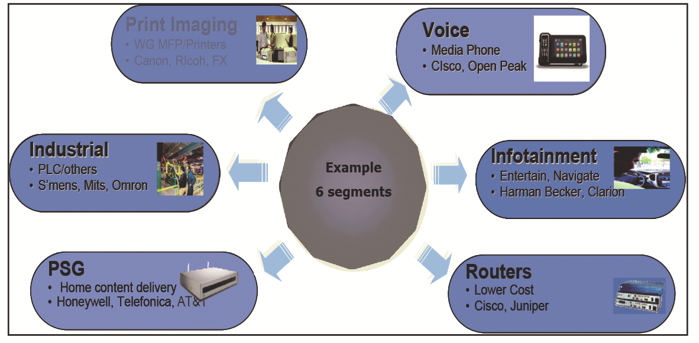
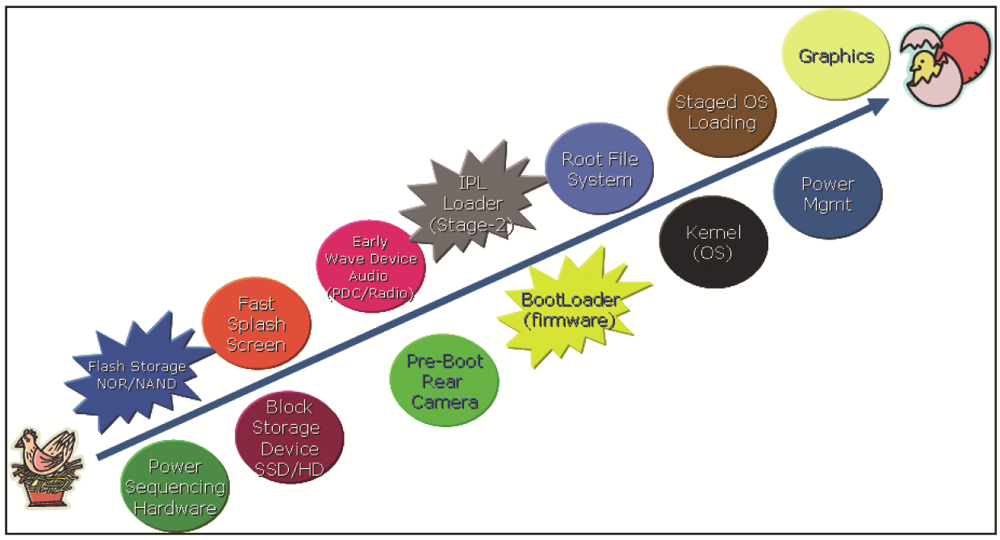
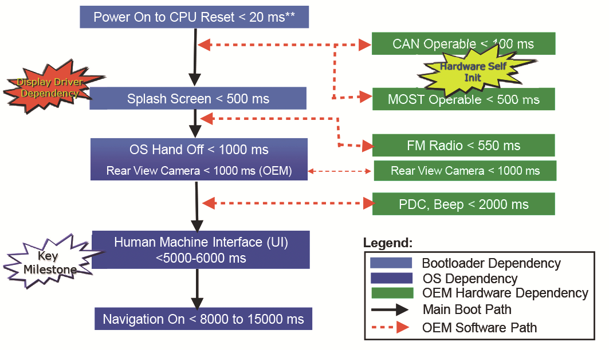
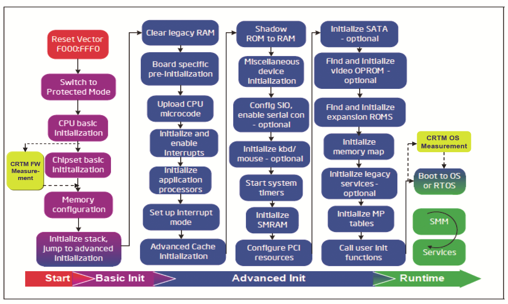
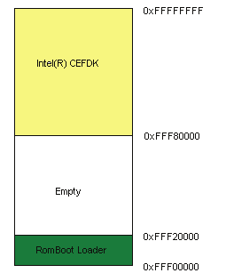
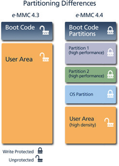

## **Chapter 16 – Embedded Boot Solution** 

Unless you try to do something beyond what you have already mastered, you will never grow

—Ralph Waldo Emerson

The expected market segment opportunity beyond 2012 for embedded systems will be

over 10 billion USD. Some examples of this focused segment, as shown in Figure 16.1, include: in-vehicle infotainment (IVI) for automotive use, print imaging (enterprise

printing solutions), industrial control, residential or premise service gateways (PSG), home control, media phones (MPs), set top boxes, mobile Internet devices (MIDs) and

physical security/digital security and surveillance (video analytics systems and IP cameras).

**Figure 16.1:** Embedded Usage Examples

This chapter describes the boot firmware challenges and solutions for these market segments. The primary focus is to cover the platform boot solution, which includes

standard PC BIOS, bootloaders (also known as steploaders), initial program loaders (IPLs, also known as second-stage bootloaders), and OS boot driver components for

running a shrinkwrap and/or industry standard embedded OS.

**CE Device Landscape**

The Intel® Atom™ processor family of low power embedded processors are making

their way into many lower power platforms, the key being MIDs (mobile Internet de-vices), netbooks and a variety of embedded markets as enumerated above. Some of

DOI 10.1515/9781501505690-018

these segments are targeted towards consumers, following the Consumer Electronics (CE) device model paradigm. One of the key attributes of a CE device is the positive

end-user experience, which is of paramount importance. The user experience is based

on such factors as:

■ Battery life/low thermal dissipation for fanless device operation ■ Small device form factor/footprint for portability

■ Ease of use

■ Low bill of material (BOM) resulting in lower end-user cost

■ Interoperability with other CE devices ■ The time between power-on and the user interface becoming active, also known

as boot latency to user interface/human machine interface (UI/HMI)

**CE Device Boot Challenges**

Traditional CE devices from OEMs were fully customized solutions with OEM specific

hardware and software components that were uniquely tuned for a particular use model such as smart phones or MIDs. In this case, custom platforms were developed

top-down from scratch for pre-determined usage models with customized applica-tions, middleware, device drivers, OS, system boot firmware and tightly coupled com-

panion boot devices/hardware. With each new platform development, the software solution had to be recreated.

The use of Intel® architecture would help reduce this re-development, reducing time to market and cost. One of the value propositions and advantages of using both

Intel architecture based processor family System on a Chip (SoC) solutions and plat-forms is the wide availability of standard platform building blocks from Intel and ex-

ternal ecosystem suppliers providing hardware, software, BIOS, applications, devel-opment tools, and so on.

As many of these platform building blocks migrated from a standard PC to em-bedded SoC segments, they posed some interesting challenges to directly map to the

top-down CE device use model. It takes optimization of more than a dozen system hardware and software components across the system stack to achieve the desired CE

goals, with the boot firmware being a key component of it. Figure 16.2 identifies some of the components in the boot path that contribute to the overall system boot latency

as needed for the CE devices.

The following is a short list of some key components that contribute to the overall boot latency to UI active time.

■ Platform power sequencing latencies, such as stabilization of PLL/Clocks, volt-

age regulators, and power rails

■ Speed of bus interface to boot device, such as Serial Peripheral Interface (SPI)

and Low Pin Count (LPC)

■ Access latency of storage device for firmware, such as NOR/NAND Flash ■ Access latency of mass storage device, such as HDD, SSD, MMC/SD

■ Splash screen latency

■ Latencies associated with boot firmware or bootloader execution ■ Initial program load latencies, such as second stage OS boot loader (also known

as IPL)

■ Partitioning of the firmware and OS boot components across the storage device,

such as NOR, SDD, HD, and MMC

■ Use of file system type for storing the boot image, such as ROM, FAT, and EXT3 ■ Latency of graphics and audio device startup if required

Figure 16.2 shows various boot components across the system stack that need to be

optimized and aligned to get to the end goal of low boot latency as desired by a CE device user. Moreover, many of these components have interdependencies for them

to function effectively. For example: the fast splash screen needs to provide a seam-less handoff to the graphics driver, and the block storage device must power-on early

in firmware before a handoff to IPL.

**Figure 16.2:** End-to-End Boot Latency Dependency Components

A case study of one of the CE device usages for IVI with typical boot requirements follows. The fast boot requirements for most other CE segments are considered to be

a subset of IVI, which has the most stringent requirements of all.

**In-Vehicle Infotainment**

An IVI user expects an instant power-on experience, similar to that of most consumer appliances like TVs. To meet this same expectation, one of the key requirements of

the IVI platform is the sub-second cold boot time, which helps facilitate the user ex-

perience when the ignition key/button is turned on. The typical boot latency require-ments are as illustrated in Figure 16.3.

**Figure 16.3:** Typical CE Device Boot Latency Requirements

Within the requirements highlighted above, there are multiple key latency check-points where the boot firmware plays a key role. These include: ■ *Power-on to splash screen active.* The time between hardware power-on and

splash screen active is key because it helps improve the user perception with an

early audio/visual experience. This is accomplished by displaying a static image

bitmap or a logo on the display device. The pre-OS boot environment is where

this typically gets activated, immediately after the memory initialization is done.

Several of the initialization functions are needed to enable the display to occur

in parallel while the boot firmware is busy performing its other unrelated boot

functions in the background, such as memory and chipset initialization. Once the

splash screen is enabled, the firmware typically does a handshake with the OS

environment for a seamless handoff of the splash screen display status and re-

lated information, such as frame buffer physical address and display mode. If the

firmware can hand-off to the OS in less than 50–100 ms, it is possible to leave this

function for the OS to enable, thereby making it a post-OS boot feature.

■ *Power-on to rear view camera active.* This is another operation that may have to

get activated in the background and be presented to the user with a motion image

from the rear view camera. This function is typically used when backing up an

automobile and the function needs to be activated upon entering reverse (“R”

gear). In some use cases, video from an embedded camera may be preferred in

place of a static splash screen image. The initialization and activation of the cam-

era interface can be done in parallel with bootloader flows through hardware

state machine assist. The event generation and notification mechanism (“R”)

also needs to be enabled early on in the boot sequence. ■ *Power-on to the boot storage device active.* The time between these functions im-

pacts the speed at which the OS can be shadowed and launched by the Initial

Program Load. This is typically done in the early firmware boot sequence as part

of the chipset initialization, to hide the boot device ready latency such as hard

disk spin-up, eMMC/SD device ready, and so on.

■ *Power-on to OS handoff (IPL).* This function is done in the background and is a

measure of overall firmware latency of the boot firmware. All actions beyond this

fall into the OS boot domain for a typical bootloader. ■ *OEM-specific functions.* Other OEM device-specific functions such as Controller

Area Network (CAN)/Media Oriented Systems Transport (MOST) interface activa-

tion, FM radio activation, and TPM measured boot, are orthogonal to the core

platform functions and are managed by OEM-specific hardware/firmware. Typi-

cally the events from CAN and data over MOST can be used as trigger events for

operation of functions such as rear view camera activation.

All other boot latency checkpoints illustrated are outside the scope of the boot firm-ware and have a dependency on the kernel components and device drivers that are

associated with the key boot devices: storage (such as NAND), audio, graphics, video, and so on.

**Other Embedded Platforms**

As noted above, IVI is just one of the many embedded segments with rapid boot time requirements. The interesting thing to note is that when all the segments are taken

into consideration, the fundamental common denominator across all of them is the boot firmware, which needs to work with a variety of operating systems including

Fedora Linux†, QNX†, Microsoft XP Embedded†, Microsoft WinCE†, WindRiver Auto-motive Grade Linux†, Microsoft Automotive† (based on Win CE), WindRiver

VxWorks†, Microsoft Windows XP†, Microsoft Vista Embedded†, 4690/DOS†, MeeGo†, SuSe†, Microsoft Windows for Point-of-Sales (WEPOS) †, Win7e†, and Win8.

For a typical CE platform, the boot firmware must support interoperability with mul-tiple types of OS IPLs as follows:

■ ACPI-compliant UEFI BIOS with an UEFI OS IPL (such as eLilo): this is typically

used with aftermarket products that may run an embedded version of a shrink-

wrap OS such as Standard Embedded Linux or Window XPe that requires PC com-

patibility and is readily available from the BIOS vendors or original device man-

ufacturers (ODM).

■ Embedded OS IPL: this solution is meant to work with an OS that does not rely on

the PC BIOS compatibility such as an embedded OS and some variants of Linux.

This approach requires specialized IPL that is customized for the platform topol-

ogy and the nonstandard secondary storage device such as managed NAND (also

known as an eMMC device).

**Note** Reducing the bill of material cost of a CE platform is quite critical, hence consolidating

the SPI Flash (NOR) and NAND storage to one device like eMMC is beneficial. However, this comes with some challenges for Intel boot architecture and the firmware flow that depends on various aspects such as execute in place ROM (XIP), secure and write-protected regions offered by SPI flash controllers, and so on.

**Generic Requirements**

Traditional platforms typically have boot latencies to UI active times that average 10– 40 seconds. Getting this UI active latency down to below 5–6 seconds, with an active

splash screen in less than 500 ms is a big challenge. To reduce time to market and product development costs, it is highly desired to develop one boot firmware and OS

solution that can scale across different CE device platforms from each of the OEMs with varying topologies, but based on the same SoC core. Many optimizations were

done to both the BIOS and bootloader solutions to fit into the IVI platform and the same can be easily extended to any CE device. The key being the reordering and early

initialization of user-visible I/O like display activation, initial program load (IPL) boot menus, enabling processor cache usage at boot as high speed RAM (CAR), and so on.

The basic or generic bootloader for any CE device model requires the following attrib-

utes:

■ *Low Boot Latency.* The generic boot requirements for a CE device can be summa-

rized as: power-on to OS handoff in less than one second and splash screen in

less than 500 ms.

■ *Footprint*. The firmware code size needs to be small, reusable, and portable across

all platforms using the same SoC without modifications, such as a size of less than

384 KB.

■ *Reliability.* The bootloader must provide interoperability across a variety of oper-

ating systems, including shrinkwrap, embedded real-time operating systems,

and so on.

■ *Cost optimization.* The solution must minimize the platform bill of material cost

through consolidation of multiple storage devices like SPI Flash and Secure Dig-

ital Input Output (SDIO) managed NAND.

■ *Lifecycle*. The bootloader should have a typical lifecycle of 5 years.

Figure 16.4 illustrates the common initialization flows encountered in a typical plat-form initialization.

**Figure 16.4:** Typical Intel® Architecture CE Device Firmware Boot Flow

**Boot Strategies**

To fit most of the usage models described above, different CE device boot strategies

are adopted, namely Fixed Topology Systems, Binary Modules model and Simplified bootloader, as described below:

■ *Fixed Topology Systems.* This strategy uses standard ACPI-compliant UEFI BIOS

with a fixed platform topology and a compliant IPL, such as eLilo. This is typically

used with aftermarket products that may run an embedded version of a shrink-

wrap OS, but with varying I/O devices that are chosen by the end customer (such

as Standard Embedded Linux or Window XPe). The BIOS is required to provide

PC compatibility and is readily available from independent BIOS vendors (IBV)

or Original Device Manufacturers (ODM). This solution provides the most flexibil-

ity for seamless addition of I/O for each of the OEM machine topologies, but at

the expense of higher boot latencies. Many of the initialization sequences in the

boot path are optimized to reduce the latencies significantly in the order of 5–10

seconds. Some of the noncritical PC BIOS functions such as PCIe device enumer-

ation, OptionROM scanning, memory testing, POST, and video BIOS usage may

be eliminated or simplified during the boot sequence. The disabling of these and

other functions helps reduce boot latencies significantly. Refer to the white paper

on one such implementation and the optimizations done for it: ■ http://download.intel.com/design/intarch/papers/320497.pdf

■ *Binary Modules with Configuration.* This is the most highly optimized solution for

the CE platform for low boot latencies and is tightly coupled to the functions on

the SoC. Since the functions of the SoC do not change across different OEM im-

plementations, one single firmware image compiled from a set of object libraries

would suffice to boot all platforms built around the SoC. The OEM may use a de-

velopment kit, which would allow customization facilitated through a set of ex-

posed application programming interfaces (APIs) in the objects. These object

API’s could perform basic and advanced initialization and control tasks like the

following:

– Processor initialization (including multiprocessor support, cache configura-

tion, and control)

– Chipset and memory initialization

– Core libraries for I/O initialization such as PCI resource allocation, and IDE

HD initialization.

– Flash Storage (NOR, NAND), Super I/O support

– Pre-boot graphics (splash screen) support where available

This solution is primarily meant to work with an OS, which does not rely on the PC

BIOS compatibility, such as an embedded OS and some variants of Linux. The boot latencies achieved are deterministically optimized for a fixed CE device model built

around the same SoC. The goal of this approach is to allow the OS to enable other standard non-boot and OEM-specific I/O device enabling through the use of loadable

device drivers in the OS. Refer to the white paper on one such approach and the opti-mizations done for it:

http://download.intel.com/design/intarch/papers/323246.pdf

■ *Simplified Bootloader.* This is the third category of firmware bootloader that has a

subset of functionality of the above two mechanisms. In this type of implementa-

tion, the bootloader firmware consists of the basic initialization functionality of

the CPU, flash, and the DRAM subsystem. The subsequent portion of chipset

hardware and I/O device initialization is left for the OS hardware abstraction

layer (HAL) to deal with, essentially moving much of the firmware platform ini-

tialization function to the OS. This gives the OS more control to optimize the boot

latencies by allowing it to touch or initialize devices on a demand basis, thereby

eliminating the latency associated with non-boot related platform device initiali-

zation. The major disadvantage of this approach is that for every new SoC and

platform topology, the HAL component for each OS needs to be rewritten and this

is a major undertaking.

**Power Management**

Traditional Intel architecture platforms support various power management capabil-

ities to conserve power of battery powered devices and to reduce thermal dissipation

for AC powered devices. The CE device will leverage from the same power states as defined in the ACPI specification (Sx) and (Dx), but with or without ACPI support in the firmware. A simplified ACPI table or its equivalent, with a capability to communi-

cate standby (S3) state wake-up vector information between the OS and the firmware is the minimum requirement for this usage model.

As highlighted earlier, one of the key design goals of the CE device is a fast boot in the order of seconds. Typically, any resumption from Suspend/Hibernate back to

active state involves restoring the previous state. In certain CE device use cases, the Resume from Sleep (suspend to RAM) could be used for sub-second fast boot pur-

poses. However, Sleep mode is undesirable for some CE device use cases like IVI, due to the battery drain from DRAM leakage current in an extended park scenario or a

need to avoid inadvertently restoring one user context for another for a rental car sce-nario. This makes the fast cold boot with a completely fresh state on every power-on

a key requirement for the CE device architecture.

**Boot Storage Devices**

Another factor that plays a significant role in helping reduce the overall boot latency

is the choice of the boot storage device and the system interconnect to it, such as LPC and IDE.

Firmware is typically stored on a flash device, which can take the form of NOR, Raw NAND or Managed NAND (MMC-NAND). Each of these is connected through dif-

ferent system interfaces like LPC/SPI, Open NAND Flash Interface (ONFI), or SDIO. Depending on the combination of the bus interface and storage device used, the read

throughputs can vary anywhere from 1.5 MB/s to 52 MB/s at the time of writing of this book. It is to be noted that to satisfy the Intel architecture platform boot sequence and

legacy compatibility, XIP flash (NOR) is best. NAND is a block storage device and does not lend itself very well as the XIP memory. The mitigation to overcome this NAND

limitation is to use SRAM caches in the path to the processor or the NAND accesses redirected in hardware to DRAM, where the firmware is shadowed ahead of time. The

look-ahead shadowing of NAND content to DRAM does introduce additional latencies

in the boot path.

In the case of software partitioning, an IPL which is part of the OS and includes the kernel may be stored on a secondary block storage device, such as a hard disk

(HD), solid state drive (SSD) or a managed/unmanaged NAND. There are spin-up times associated with HD and power-on to device ready latencies associated with

SSD/NAND and these contribute to the boot latencies as well.

To help keep the platform BOM cost low, it is highly desirable to consolidate the

storage device used for the boot firmware, OS, and user applications/data. While NOR flash does offer some speed advantages, the NAND flash offers both a cost and per-

formance advantage that is well balanced. The latest managed NAND version based on the MMC 4.4 specification offers quite a few capabilities to allow the unified stor-

age use case, such as boot block for firmware storage, user Storage, and security fea-tures. It is quite possible to achieve this unified boot storage CE device use model with

some changes in the Intel architecture platform hardware and firmware flows. This is illustrated in Figure 16.5.

SPI SPI SPI SPI

Legacy Legacy Legacy Legacy

Address Range Address Range Address Range Address Range

(XIP) (XIP) (XIP) (XIP) SDIO SDIO SDIO SDIO

Block Storage Block Storage Block Storage Block Storage

Device Device Device Device

**Flash with Boot Partition** **Flash with Boot Partition** **Flash with Boot Partition** **Flash with Boot Partition**

Top 1MB Top 1MB Top 1MB Top 1MB

Boot Partition Boot Partition Boot Partition Boot Partition

(NOR Latencies) (NOR Latencies) (NOR Latencies) (NOR Latencies)

CRT CRT CRT CRT

M M

Boot FW Boot FW Boot FW Boot FW

CMC CMC CMC CMC

User NAND User NAND User NAND User NAND

SPI SPI SPI SPI (eMMC) (eMMC) (eMMC) (eMMC)

Legacy Legacy Legacy Legacy

Address Range Address Range Address Range Address Range 1 1 1 1----32GB 32GB 32GB 32GB

(XIP) (XIP) (XIP) (XIP)

Descriptor Descriptor Descriptor Descriptor

SDIO SDIO SDIO SDIO

Block Storage Block Storage Block Storage Block Storage

Device Device Device Device

**Figure 16.5:** Typical Intel® Architecture Storage Device Consolidation Model

**Security**

Different embedded segments have varying security requirements collectively cate-gorized as Security. These security requirements apply to two different usage models,

which are orthogonal to each other:

■ Security as it relates to platform defense against attacks from hackers and mal-

ware.

■ Security as it relates to encryption/decryption of network packets (example: IP-

Sec/SSL, Voice SRTP)

SoC-based embedded platforms are targeted to support “open and closed device” us-age models. This means that the user will be able to download and install any native

application on the device. This puts these devices on par with the standard PC as far as threats from viruses and malware are concerned. This is where the security for de-

fense against attacks becomes a key platform feature, with the boot firmware playing a key role in establishing a chain of trust.

Since the CE platforms are targeted to support “open and closed device” usage models, it requires special attention for two key aspects of security. First, the system

must have a tamper-resistant software environment to protect against malicious at-tacks, and second, it must offer the ability to playback DRM protected content such

as Blu-ray† without being compromised. Table 16.1 shows the usage and threat model of a typical CE device.

**Table 16.1:** Usage Model and Security Threats

**CE Usage Model** **Threats**

Internet Connectivity Malware attack, DoS Attacks, packet replay/reuse, etc.

Secure Internet Transaction Steal privacy sensitive data

DRM Content Usage Steal DRM protected content

Browser Usage Malware attack, phishing

Software Downloads/Updates Change OS/software stack

Device Management DoS attack, Illegal device connections

ID Management Dictionary attacks, stolen privacy data

One Time Provisioning Steal OEM data, unauthorized activation

Full Featured OS All of the above

Biometrics (Finger print sensor) Steal user data, authentication credentials

Based on the usage model described in Table 16.1, the assets on the platform that need to be protected from a hacker are as follows:

■ Platform resources including: CPU, memory, and network (3G, WiMax, Wi-Fi)

■ Privacy sensitive data including: ID, address book, location, e-mails, DRM pro-

tected copyrighted content such as music and video

■ Trusted services including: financial, device management and provisioning,

trusted kernel components

Based on the techniques needed for threat mitigation, one of the fundamental mech-anisms to achieve security is to make the software tamper-resistant (TRS). TRS goal is

achieved by having platform and software mechanisms in place to check for software integrity, both at system boot and runtime. The high level overview of this is as fol-

lows:

■ *Boot Time.* This is typically accomplished through a mechanism called *measured*

*boot*, where the core platform software components (firmware or OS) are checked

for unauthorized changes.

■ *Runtime.* This runtime security protection is typically achieved by having soft-

ware agents monitoring the system against attacks (for example, anti-virus soft-

ware) and also by securing through application sandboxing, which restricts the

application accesses to limited resources and contains the malware attack impact

to the restricted domain.

In addition, any runtime software updates or patching will be limited to trusted soft-ware from trusted entities, which may be digitally signed for authenticity.

The mitigation against the security threats requires the embedded platform security

architecture to use a combination of hardware and software security ingredients such as:

■ Measured boot with TPM coupled with appropriate hardware-based Root of Trust

(RoT); examples: Intel® Trusted Execution Technology (Intel TXT) or BootROM

as Root of Trust.

■ DRM content protection based on commercial media players executing on Intel

architecture

■ Application isolation through OS-based mechanisms

■ Trusted domains and isolation through OS-based mechanism ■ OEM/OSV trusted binaries, which are digitally signed by an authentic source

■ Secure storage and key management through TPM assist ■ Anti-virus through third party software libraries and application design

■ Device management/provisioning through industry standard mechanisms

BootROM RoT: To provide Measured Boot functionality, an embedded platform can support BootROM as hardware RoT and a trusted platform module (TPM) can be used

to securely store measurements. Some SPI-Flash controllers support write-protection of the flash device at reset through hardware based auto configuration. Additionally,

SPI Flash devices from various vendors allow for boot block write protection through

strap pin configuration. Any of these techniques can be used to protect the firmware boot block from being tampered by malware.

In compliance with the TCG specification, the boot firmware is divided into two

parts. The first part is the boot block, which is a very small firmware component that includes the minimal platform initialization firmware and TPM driver. The rest of the

boot firmware is contained in the subsequent portions of the flash.

The Intel architecture CE device can include other platform-specific firmware that

is outside the context of the core BIOS or firmware. An example of this is the p-Unit (microcontroller) that is used for smart power management for the SoC device. This is

configured as the first entity where the platform execution begins after reset. Other CE devices may have similar processing elements. Any measured boot mechanism

must assure the integrity of such firmware and make it part of the overall trust chain. Figure 16.6 is an example of the trust boundary for a typical Intel architecture

CE device.

**Trust Boundary**

**p****-****-****Unit** **Unit**

**BootROM** **CRTM in** **CRTM in** **Bootloader** **Bootloader** **BootROM** **OS Loader** **OS Loader** **/BIOS** **/BIOS** **OS** **OS** **App** **App** **(HW RoT)** **(HW RoT)**

**Figure 16.6:** Typical Intel® Architecture CE Device Trust Boundary

The BootBlock can be burned into ROM so that it cannot be modified and hence can act as a hardware RoT. Core Root of Trust for Measurement (CRTM) is the root of trust

from which integrity measurements begin within a trusted CE device platform. The platform manufacturer provides CRTM logic for each trusted platform. The CRTM

logic can be changed, but only under controlled conditions by the OEM.

The OS loader, kernel, and drivers will be measured as part of the CE device measured boot flow. The details of a typical chain of trust for measurement with a TPM device

and PCRx is as illustrated in Figure 16.7 and are outlined as follows:

■ CRTM measures firmware (bootloader or BIOS)

— Stores the measurement in PCR-0

— Standard OS handoff tables like ACPI, E820, and EFI measurements are

stored in PCR-1

— Any option ROM measurements are stored in PCR-2

■ Bootloader/BIOS measures OS Initial Program Load (IPL)

— Stores the measurement in PCR-4

■ OS loader measures kernel, including kernel command line and drivers

— Stores the measurement in PCR-8

— Each OS can use different implementations

— If the measurements are changed, the OS may fail to boot or alert the user.

Coming out of

System reset

p-Unit fetches 2K boot block code from BIOS Flash

through SPI interface in Legacy unit

p-Unit initializes non-CPU part of North Complex

(i.e. H/A/B/D) and DDR RCOMP

p-Unit de-asserts IA CPU reset and Security

Processor reset & Awaits for IA Wakeup

IA CPU comes out of reset and executes Security Processor coming out of reset,

BIOS code from SPI Flash CRTM and starts program execution from

masked ROM

• Firmware initializes DDR controller and DRAM.

• Security Processor does the followings:

memory. Initialize all hardware and software • Firmware measures and shadows x86 firmware into DDR

• Firmware measures and shadows p-Unit firmware into a version number soft copies

portion of the DDR memory. Clear all maskable interrupts •

• Firmware switches to execute from DRAM memory. • Initialize owners of IPC shared

• Firmware programs p-Unit address redirection to DDR memory (SEC initially owns the IPC

• Firmware initiates p-Unit wakeup to fetch its code from DDR shared memory)

• Etc. Invalidate all keys in hardware and •

software key ladders

• Set all internal devices to idle states

IA CPU downloads codes to Security Processor (AES, DES, HASH, RNG, EAU)

(i) Blu-ray application codes, Initialize all DMA channels •

(ii) Firmware Patches • Initialize all SRAM, including EAU,

SeP Timers

• Read SOC chip unique ID (64-bit

serial number) and store locally

• Decrypt PSK or SSK if necessary • Initialize the RNG and CTRDRBG • Enable maskable interrupt

Security Processor asserts Input ready

and wait for host commands

**Figure 16. 7:** Typical Intel® Architecture CE Device Measured Boot Flow

Measured Boot Latency: Measured boot introduces latencies in the boot path of a CE device due to the following:

■ TPM initialization

■ Calculation of SHA1 checksum of various binaries ■ Appending the checksum in TPM PCR

The measure boot components of the TPM are distributed across the standard firm-ware boot flow The CRTM algorithm would play a key role in optimizing for the CE

device fast boot. It is beyond the scope of this chapter to describe the various tech-niques that can be used for this optimization. However, a carefully designed CRTM

might use a combination of the following:

■ Execute-in-place (out of flash) with processor caches enabled

■ Measure only portions of firmware after it is shadowed into memory or before

**Manageability**

The manageability framework, also known as the Device Management (DM) frame-

work, provides services on the client platform for use by IT personnel remotely. These

services facilitate key device management functions such as provisioning, platform configuration changes, system logs, event management, software inventory, and software/firmware updates. The actual services enabled on a particular platform are

a CE OEM choice. The following sections describe the two key frameworks in use for a CE device, namely OMA-DM and AMT.

Open Mobile Alliance - Device Management (OMA-DM) is one of the popular pro-tocols that would allow manufacturers to cleanly build DM applications that fit well

into the CE device usage model. Many of the standard operating systems support OMA-DM or a variation of it with enhanced security. The data transport for OMA-DM

is typically over a wireless connectivity such as WiMax, 3G/4G, and so on. This proto-col can run well on top of the transport layers such as HTTPS, OBEX, and WAP-WSP.

The CE device platform would be able to support this, as long as the OEM supports the connectivity and the client services.

The other possible framework for manageability is Intel® Active Management Technology (Intel AMT). Intel AMT provides a full featured DASH-compliant manage-

ability solution that can discover failures, proactively alert, remotely heal-recover, and protect. Intel AMT Out of Band (OOB) device management allows remote man-

agement regardless of device power or OS state. Remote troubleshooting and recovery could significantly reduce OEM service calls. Proactive alerting decreases downtime

and minimizes time to repair.

In the manageability space, making DASH-compliant manageability on CE plat-

form is opportunity that allows OEM differentiation and provides a much richer man-ageability features.

**Summary**

The need for a boot solution that is low cost, has a small footprint, offers low boot latencies, and is platform-agnostic provides an exciting opportunity to ISVs and

OSVs to develop and deliver such tool kits. This also creates opportunities for CE

device OEMs to provide creative solutions of their own, making their products more competitive and unique. In addition, device vendors can take advantage of oppor-tunities to provide hardware IP (Intellectual Property) that are self-initializing,

thereby relieving the boot software from doing the same and giving back some time to improve latencies.

The challenge that remains to be addressed is a single boot firmware solution that can boot both shrinkwrap operating systems that require PC compatibility and em-

bedded operating systems. There are multiple challenges to be addressed with inno-vative solutions like supporting security features, manageability, and a unified stor-

age device like an eMMC, all with the key low boot latency attribute. Finally, there are opportunities for the OS vendors to come up with innovative optimizations within the

OS boot flows to achieve faster boots.