## Chapter 2. Basic Parallelism: The Eval Monad

This chapter will teach you the basics of adding parallelism to your Haskell code. We’ll start with some essential background about lazy evaluation in the next section before moving on to look at how to use parallelism in The Eval Monad, rpar, and rseq.

## Lazy Evaluation and Weak Head Normal Form

Haskell is a *lazy* language which means that expressions are not evaluated until they are required.^(\[1\]) Normally, we don’t have to worry about how this happens; as long as expressions are evaluated when they are needed and not evaluated if they aren’t, everything is fine. However, when adding parallelism to our code, we’re telling the compiler something about how the program should be run: Certain things should happen in parallel. To be able to use parallelism effectively, it helps to have an intuition for how lazy evaluation works, so this section will explore the basic concepts using GHCi as a playground.

Let’s start with something very simple:

```
Prelude> let x = 1 + 2 :: Int
```

This binds the variable `x` to the expression `1 + 2` (at type `Int`, to avoid any complications due to overloading). Now, as far as Haskell is concerned, `1 + 2` is equal to `3`: We could have written `let x = 3 :: Int` here, and there is no way to tell the difference by writing ordinary Haskell code. But for the purposes of parallelism, we really do care about the difference between `1 + 2` and `3`, because `1 + 2` is a computation that has not taken place yet, and we might be able to compute it in parallel with something else. Of course in practice, you wouldn’t want to do this with something as trivial as `1 + 2`, but the principle of an unevaluated computation is nevertheless important.

We say at this point that `x` is *unevaluated*. Normally in Haskell, you wouldn’t be able to tell that `x` was unevaluated, but fortunately GHCi’s debugger provides some commands that inspect the structure of Haskell expressions in a noninvasive way, so we can use those to demonstrate what’s going on. The `:sprint` command prints the value of an expression without causing it to be evaluated:

```
Prelude> :sprint x
x = _
```

The special symbol `_` indicates “unevaluated.” Another term you may hear in this context is "thunk,” which is the object in memory representing the unevaluated computation `1 + 2`. The thunk in this case looks something like Figure 2-1.

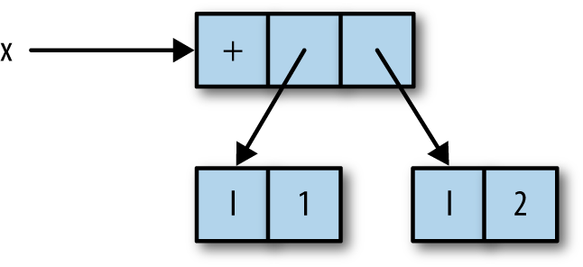

Figure 2-1. The thunk representing 1 + 2

Here, `x` is a pointer to an object in memory representing the function `+` applied to the integers `1` and `2`.

The thunk representing `x` will be evaluated whenever its value is required. The easiest way to cause something to be evaluated in GHCi is to print it; that is, we can just type `x` at the prompt:

```
Prelude> x
3
```

Now if we inspect the value of `x` using `:sprint`, we’ll find that it has been evaluated:

```
Prelude> :sprint x
x = 3
```

In terms of the objects in memory, the thunk representing `1 + 2` is actually overwritten by the (boxed) integer 3.^(\[2\]) So any future demand for the value of `x` gets the answer immediately; this is how lazy evaluation works.

That was a trivial example. Let’s try making something slightly more complex.

```
Prelude> let x = 1 + 2 :: Int
Prelude> let y = x + 1
Prelude> :sprint x
x = _
Prelude> :sprint y
y = _
```

Again, we have `x` bound to `1 + 2`, but now we have also bound `y` to `x + 1`, and `:sprint` shows that both are unevaluated as expected. In memory, we have a structure like Figure 2-2.

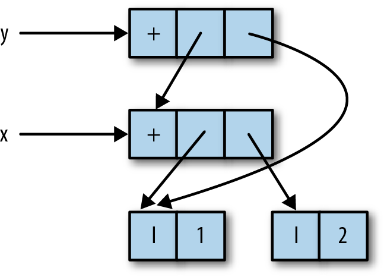

Figure 2-2. One thunk referring to another

Unfortunately there’s no way to directly inspect this structure, so you’ll just have to trust me.

Now, in order to compute the value of `y`, the value of `x` is needed: `y` depends on `x`. So evaluating `y` will also cause `x` to be evaluated. This time we’ll use a different way to force evaluation: Haskell’s built-in `seq` function.

```
Prelude> seq y ()
()
```

The `seq` function evaluates its first argument, here `y`, and then returns its second argument—in this case, just `()`. Now let’s inspect the values of `x` and `y`:

```
Prelude> :sprint x
x = 3
Prelude> :sprint y
y = 4
```

Both are now evaluated, as expected. So the general principles so far are:

- Defining an expression causes a thunk to be built representing that expression.
- A thunk remains unevaluated until its value is required. Once evaluated, the thunk is replaced by its value.

Let’s see what happens when a data structure is added:

```
Prelude> let x = 1 + 2 :: Int
Prelude> let z = (x,x)
```

This binds `z` to the pair `(x,x)`. The `:sprint` command shows something interesting:

```
Prelude> :sprint z
z = (_,_)
```

The underlying structure is shown in Figure 2-3.

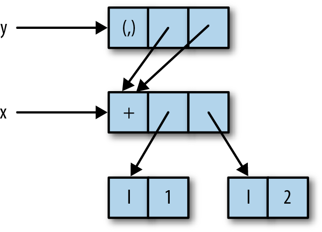

Figure 2-3. A pair with both components referring to the same thunk

The variable `z` itself refers to the pair `(x,x)`, but the components of the pair both point to the unevaluated thunk for `x`. This shows that we can build data structures with unevaluated components.

Let’s make `z` into a thunk again:

```
Prelude> import Data.Tuple
Prelude Data.Tuple> let z = swap (x,x+1)
```

The `swap` function is defined as: `swap (a,b) = (b,a)`. This `z` is unevaluated as before:

```
Prelude Data.Tuple> :sprint z
z = _
```

The point of this is so that we can see what happens when `z` is evaluated with `seq`:

```
Prelude Data.Tuple> seq z ()
()
Prelude Data.Tuple> :sprint z
z = (_,_)
```

Applying `seq` to `z` caused it to be evaluated to a pair, *but the components of the pair are still unevaluated*. The `seq` function evaluates its argument only as far as the first constructor, and doesn’t evaluate any more of the structure. There is a technical term for this: We say that `seq` evaluates its first argument to *weak head normal form*. The reason for this terminology is somewhat historical, so don’t worry about it too much. We often use the acronym WHNF instead. The term *normal* *form* on its own means “fully evaluated,” and we’ll see how to evaluate something to normal form in Deepseq.

The concept of weak head normal form will crop up several times over the next two chapters, so it’s worth taking the time to understand it and get a feel for how evaluation happens in Haskell. Playing around with expressions and `:sprint` in GHCi is a great way to do that.

Just to finish the example, we’ll evaluate `x`:

```
Prelude Data.Tuple> seq x ()
()
```

What will we see if we print the value of `z`?

```
Prelude Data.Tuple> :sprint z
z = (_,3)
```

Remember that `z` was defined to be `swap (x,x+1)`, which is `(x+1,x)`, and we just evaluated `x`, so the second component of `z` is now evaluated and has the value `3`.

Finally, we’ll take a look at an example with lists and a few of the common list functions. You probably know the definition of `map`, but here it is for reference:

```
map :: (a -> b) -> [a] -> [b]
map f []     = []
map f (x:xs) = f x : map f xs
```

The `map` function builds a lazy data structure. This might be clearer if we rewrite the definition of `map` to make the thunks explicit:

```
map :: (a -> b) -> [a] -> [b]
map f []     = []
map f (x:xs) = let
                   x'  = f x
                   xs' = map f xs
               in
                   x' : xs'
```

This behaves identically to the previous definition of `map`, but now we can see that both the head and the tail of the list that `map` returns are thunks: `f x` and `map f xs`, respectively. That is, `map` builds a structure like Figure 2-4.

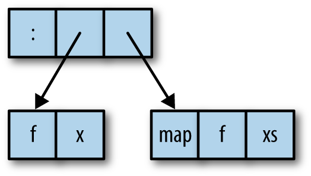

Figure 2-4. Thunks created by a map

Let’s define a simple list structure using `map`:

```
Prelude> let xs = map (+1) [1..10] :: [Int]
```

Nothing is evaluated yet:

```
Prelude> :sprint xs
xs = _
```

Now we evaluate this list to weak head normal form:

```
Prelude> seq xs ()
()
Prelude> :sprint xs
xs = _ : _
```

We have a list with at least one element, but that is all we know about it so far. Next, we’ll apply the `length` function to the list:

```
Prelude> length xs
10
```

The `length` function is defined like this:

```
length :: [a] -> Int
length []     = 0
length (_:xs) = 1 + length xs
```

Note that `length` ignores the head of the list, recursing on the tail, `xs`. So when `length` is applied to a list, it will descend the structure of the list, evaluating the list cells but not the elements. We can see the effect clearly with `:sprint`:

```
Prelude> :sprint xs
xs = [_,_,_,_,_,_,_,_,_,_]
```

GHCi noticed that the list cells were all evaluated, so it switched to using the bracketed notation rather than infix `:` to display the list.

Even though we have now evaluated the entire spine of the list, it is still not in normal form (but it is still in weak head normal form). We can cause it to be fully evaluated by applying a function that demands the values of the elements, such as `sum`:

```
Prelude> sum xs
65
Prelude> :sprint xs
xs = [2,3,4,5,6,7,8,9,10,11]
```

We have scratched the surface of what is quite a subtle and complex topic. Fortunately, most of the time, when writing Haskell code, you don’t need to worry about understanding when things get evaluated. Indeed, the Haskell language definition is very careful not to specify exactly how evaluation happens; the implementation is free to choose its own strategy as long as the program gives the right answer. And as programmers, most of the time that’s all we care about, too. However, when writing parallel code, it becomes important to understand when things are evaluated so that we can arrange to parallelize computations.

An alternative to using lazy evaluation for parallelism is to be more explicit about the data flow, and this is the approach taken by the `Par` monad in Chapter 4. This avoids some of the subtle issues concerning lazy evaluation in exchange for some verbosity. Nevertheless, it’s worthwhile to learn about both approaches because there are situations where one is more natural or more efficient than the other.

## The Eval Monad, rpar, and rseq

Next, we introduce some basic functionality for creating parallelism, which is provided by the module `Control.Parallel.Strategies`:

```
data Eval a
instance Monad Eval

runEval :: Eval a -> a

rpar :: a -> Eval a
rseq :: a -> Eval a
```

Parallelism is expressed using the `Eval` monad, which comes with two operations, `rpar` and `rseq`. The `rpar` combinator creates parallelism: It says, “My argument could be evaluated in parallel”; while `rseq` is used for forcing sequential evaluation: It says, “Evaluate my argument and wait for the result.” In both cases, evaluation is to weak head normal form. It’s also worth noting that the argument to `rpar` should be an unevaluated computation—a thunk. If the argument is already evaluated, nothing useful happens, because there is no work to perform in parallel.

The `Eval` monad provides a `runEval` operation that performs the `Eval` computation and returns its result. Note that `runEval` is completely pure; there’s no need to be in the `IO` monad here.

To see the effects of `rpar` and `rseq`, suppose we have a function `f`, along with two arguments to apply it to, `x` and `y`, and we would like to calculate the results of `f x` and `f y` in parallel. Let’s say that `f x` takes longer to evaluate than `f y`. We’ll look at a few different ways to code this and investigate the differences between them. First, suppose we used `rpar` with both `f x` and `f y`, and then returned a pair of the results, as shown in Example 2-1.

Example 2-1. rpar/rpar

```
  runEval $ do
     a <- rpar (f x)
     b <- rpar (f y)
     return (a,b)
```

Execution of this program fragment proceeds as shown in Figure 2-5.

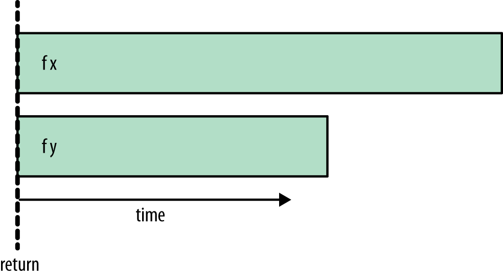

Figure 2-5. rpar/rpar timeline

We see that `f x` and `f y` begin to evaluate in parallel, while the `return` happens immediately: It doesn’t wait for either `f x` or `f y` to complete. The rest of the program will continue to execute while `f x` and `f y` are being evaluated in parallel.

Let’s try a different variant, replacing the second `rpar` with `rseq`:

Example 2-2. rpar/rseq

```
  runEval $ do
     a <- rpar (f x)
     b <- rseq (f y)
     return (a,b)
```

Now the execution will look like Figure 2-6.

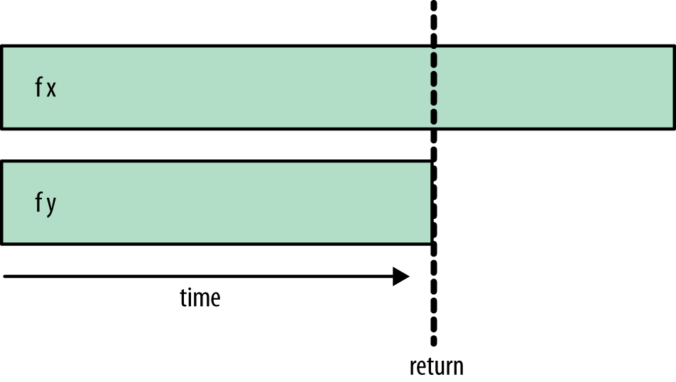

Figure 2-6. rpar/rseq timeline

Here `f x` and `f y` are still evaluated in parallel, but now the final `return` doesn’t happen until `f y` has completed. This is because we used `rseq`, which waits for the evaluation of its argument before returning.

If we add an additional `rseq` to wait for `f x`, we’ll wait for both `f x` and `f y` to complete:

Example 2-3. rpar/rseq/rseq

```
  runEval $ do
     a <- rpar (f x)
     b <- rseq (f y)
     rseq a
     return (a,b)
```

Note that the new `rseq` is applied to `a`, namely the result of the first `rpar`. This results in the ordering shown in Figure 2-7.

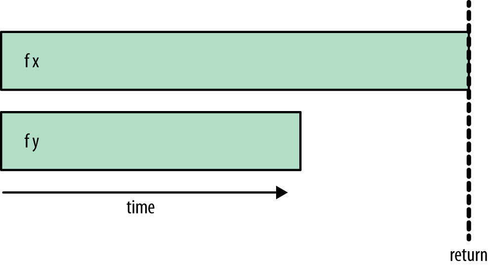

Figure 2-7. rpar/rseq/rseq timeline

The code waits until both `f x` and `f y` have completed evaluation before returning.

Which of these patterns should we use?

- *rpar/rseq* is unlikely to be useful because the programmer rarely knows in advance which of the two computations takes the longest, so it makes little sense to wait for an arbitrary one of the two.
- The choice between *rpar/rpar* or *rpar/rseq/rseq* styles depends on the circumstances. If we expect to be generating more parallelism soon and don’t depend on the results of either operation, it makes sense to use *rpar/rpar*, which returns immediately. On the other hand, if we have generated all the parallelism we can, or we need the results of one of the operations in order to continue, then *rpar/rseq/rseq* is an explicit way to do that.

There is one final variant:

Example 2-4. rpar/rpar/rseq/rseq

```
  runEval $ do
     a <- rpar (f x)
     b <- rpar (f y)
     rseq a
     rseq b
     return (a,b)
```

This has the same behavior as *rpar/rseq/rseq*, waiting for both evaluations before returning. Although it is the longest, this variant has more symmetry than the others, so it might be preferable for that reason.

To experiment with these variants yourself, try the sample program *rpar.hs*, which uses the Fibonacci function to simulate the expensive computations to run in parallel. In order to use parallelism with GHC, we have to use the `-threaded` option. Compile the program like this:

```
$ ghc -O2 rpar.hs -threaded
```

To try the *rpar/rpar* variant, run it as follows. The `+RTS -N2` flag tells GHC to use two cores to run the program (ensure that you have at least a dual-core machine):

```
$ ./rpar 1 +RTS -N2
time: 0.00s
(24157817,14930352)
time: 0.83s
```

The first timestamp is printed when the `rpar`/`rseq` fragment returns, and the second timestamp is printed when the last calculation finishes. As you can see, the return here happened immediately. In *rpar/rseq*, it happens after the second (shorter) computation has completed:

```
$ ./rpar 2 +RTS -N2
time: 0.50s
(24157817,14930352)
time: 0.82s
```

In *rpar/rseq/rseq*, the return happens at the end:

```
$ ./rpar 3 +RTS -N2
time: 0.82s
(24157817,14930352)
time: 0.82s
```

## Example: Parallelizing a Sudoku Solver

In this section, we’ll walk through a case study, exploring how to add parallelism to a program that performs the same computation on multiple input data. The computation is an implementation of a Sudoku solver. This solver is fairly fast as Sudoku solvers go, and can solve all 49,000 of the known 17-clue puzzles in about 2 minutes.

The goal is to parallelize the solving of multiple puzzles. We aren’t interested in the details of how the solver works; for the purposes of this discussion, the solver will be treated as a black box. It’s just an example of an expensive computation that we want to perform on multiple data sets, namely the Sudoku puzzles.

We will use a module `Sudoku` that provides a function `solve` with type:

```
solve :: String -> Maybe Grid
```

The `String` represents a single Sudoku problem. It is a flattened representation of the 9×9 board, where each square is either empty, represented by the character *`.`*, or contains a digit 1–9.

The function `solve` returns a value of type `Maybe Grid`, which is either `Nothing` if a problem has no solution, or `Just g` if a solution was found, where `g` has type `Grid`. For the purposes of this example, we are not interested in the solution itself, the `Grid`, but only in whether the puzzle has a solution at all.

We start with some ordinary sequential code to solve a set of Sudoku problems read from a file:

*sudoku1.hs*

```
import Sudoku
import Control.Exception
import System.Environment
import Data.Maybe

main :: IO ()
main = do
  [f] <- getArgs                           -- ①
  file <- readFile f                       -- ②

  let puzzles   = lines file               -- ③
      solutions = map solve puzzles        -- ④

  print (length (filter isJust solutions)) -- ⑤
```

This short program works as follows:

①  
Grab the command-line arguments, expecting a single argument, the name of the file containing the input data.

②  
Read the contents of the given file.

③  
Split the file into lines; each line is a single puzzle.

④  
Solve all the puzzles by mapping the `solve` function over the list of lines.

⑤  
Calculate the number of puzzles that had solutions, by first filtering out any results that are `Nothing` and then taking the length of the resulting list. This length is then printed. Even though we’re not interested in the solutions themselves, the `filter isJust` is necessary here: Without it, the program would never evaluate the elements of the list, and the work of the solver would never be performed (recall the `length` example at the end of Lazy Evaluation and Weak Head Normal Form).

Let’s check that the program works by running over a set of sample problems. First, compile the program:

```
$ ghc -O2 sudoku1.hs -rtsopts
[1 of 2] Compiling Sudoku           ( Sudoku.hs, Sudoku.o )
[2 of 2] Compiling Main             ( sudoku1.hs, sudoku1.o )
Linking sudoku1 ...
```

Remember that when working on performance, it is important to compile with full optimization (`-O2`). The goal is to make the program run faster, after all.

Now we can run the program on 1,000 sample problems:

```
$ ./sudoku1 sudoku17.1000.txt
1000
```

All 1,000 problems have solutions, so the answer is 1,000. But what we’re really interested in is how long the program took to run, because we want to make it go faster. So let’s run it again with some extra command-line arguments:

```
$ ./sudoku1 sudoku17.1000.txt +RTS -s
1000
   2,352,273,672 bytes allocated in the heap
      38,930,720 bytes copied during GC
         237,872 bytes maximum residency (14 sample(s))
          84,336 bytes maximum slop
               2 MB total memory in use (0 MB lost due to fragmentation)

                                    Tot time (elapsed)  Avg pause  Max pause
  Gen  0      4551 colls,     0 par    0.05s    0.05s     0.0000s    0.0003s
  Gen  1        14 colls,     0 par    0.00s    0.00s     0.0001s    0.0003s

  INIT    time    0.00s  (  0.00s elapsed)
  MUT     time    1.25s  (  1.25s elapsed)
  GC      time    0.05s  (  0.05s elapsed)
  EXIT    time    0.00s  (  0.00s elapsed)
  Total   time    1.30s  (  1.31s elapsed)

  %GC     time       4.1%  (4.1% elapsed)

  Alloc rate    1,883,309,531 bytes per MUT second

  Productivity  95.9% of total user, 95.7% of total elapsed
```

The argument `+RTS -s` instructs the GHC runtime system to emit the statistics shown. These are particularly helpful as a first step in analyzing performance. The output is explained in detail in the GHC User’s Guide, but for our purposes we are interested in one particular metric: `Total time`. This figure is given in two forms: the total CPU time used by the program and the *elapsed* or wall-clock time. Since we are running on a single processor core, these times are almost identical (sometimes the elapsed time might be slightly longer due to other activity on the system).

We shall now add some parallelism to make use of two processor cores. We have a list of problems to solve, so as a first attempt we’ll divide the list in two and solve the problems in both halves of the list in parallel. Here is some code to do just that:

*sudoku2.hs*

```
main :: IO ()
main = do
  [f] <- getArgs
  file <- readFile f

  let puzzles = lines file

      (as,bs) = splitAt (length puzzles `div` 2) puzzles -- ①

      solutions = runEval $ do
                    as' <- rpar (force (map solve as))   -- ②
                    bs' <- rpar (force (map solve bs))   -- ③
                    rseq as'                             -- ④
                    rseq bs'                             -- ⑤
                    return (as' ++ bs')                  -- ⑥

  print (length (filter isJust solutions))
```

①  
Divide the list of puzzles into two equal sublists (or almost equal, if the list had an odd number of elements).

② ③  
We’re using the *rpar/rpar/rseq/rseq* pattern from the previous section to solve both halves of the list in parallel. However, things are not completely straightforward, because `rpar` only evaluates to weak head normal form. If we were to use `rpar (map solve as)`, the evaluation would stop at the first `(:)` constructor and go no further, so the `rpar` would not cause any of the work to take place in parallel. Instead, we need to cause the whole list and the elements to be evaluated, and this is the purpose of `force`:

```
force :: NFData a => a -> a
```

The `force` function evaluates the entire structure of its argument, reducing it to *normal form*, before returning the argument itself. It is provided by the `Control``.DeepSeq` module. We’ll return to the `NFData` class in Deepseq, but for now it will suffice to think of it as the class of types that can be evaluated to normal form.

Not evaluating deeply enough is a common mistake when using `rpar`, so it is a good idea to get into the habit of thinking, for each `rpar`, “How much of this structure do I want to evaluate in the parallel task?” (Indeed, it is such a common problem that in the `Par` monad to be introduced later, the designers went so far as to make `force` the default behavior).

④ ⑤  
Using `rseq`, we wait for the evaluation of both lists to complete.

⑥  
Append the two lists to form the complete list of solutions.

Let’s run the program and measure how much performance improvement we get from the parallelism:

```
$ ghc -O2 sudoku2.hs -rtsopts -threaded
[2 of 2] Compiling Main             ( sudoku2.hs, sudoku2.o )
Linking sudoku2 ...
```

Now we can run the program using two cores:

```
$ ./sudoku2 sudoku17.1000.txt +RTS -N2 -s
1000
   2,360,292,584 bytes allocated in the heap
      48,635,888 bytes copied during GC
       2,604,024 bytes maximum residency (7 sample(s))
         320,760 bytes maximum slop
               9 MB total memory in use (0 MB lost due to fragmentation)

                                    Tot time (elapsed)  Avg pause  Max pause
  Gen  0      2979 colls,  2978 par    0.11s    0.06s     0.0000s    0.0003s
  Gen  1         7 colls,     7 par    0.01s    0.01s     0.0009s    0.0014s

  Parallel GC work balance: 1.49 (6062998 / 4065140, ideal 2)

                        MUT time (elapsed)       GC time  (elapsed)
  Task  0 (worker) :    0.81s    (  0.81s)       0.06s    (  0.06s)
  Task  1 (worker) :    0.00s    (  0.88s)       0.00s    (  0.00s)
  Task  2 (bound)  :    0.52s    (  0.83s)       0.04s    (  0.04s)
  Task  3 (worker) :    0.00s    (  0.86s)       0.02s    (  0.02s)

  SPARKS: 2 (1 converted, 0 overflowed, 0 dud, 0 GC'd, 1 fizzled)

  INIT    time    0.00s  (  0.00s elapsed)
  MUT     time    1.34s  (  0.81s elapsed)
  GC      time    0.12s  (  0.06s elapsed)
  EXIT    time    0.00s  (  0.00s elapsed)
  Total   time    1.46s  (  0.88s elapsed)

  Alloc rate    1,763,903,211 bytes per MUT second

  Productivity  91.6% of total user, 152.6% of total elapsed
```

Note that the `Total time` now shows a marked difference between the CPU time (1.46s) and the elapsed time (0.88s). Previously, the elapsed time was 1.31s, so we can calculate the *speedup* on 2 cores as 1.31/0.88 = 1.48. Speedups are always calculated as a ratio of wall-clock times. The CPU time is a helpful metric for telling us how busy our cores are, but as you can see here, the CPU time when running on multiple cores is often greater than the wall-clock time for a single core, so it would be misleading to calculate the speedup as the ratio of CPU time to wall-clock time (1.66 here).

Why is the speedup only 1.48, and not 2? In general, there could be a host of reasons for this, not all of which are under the control of the Haskell programmer. However, in this case the problem is partly of our doing, and we can diagnose it using the *ThreadScope* tool. To profile the program using *ThreadScope*, we need to first recompile it with the `-eventlog` flag and then run it with `+RTS -l`. This causes the program to emit a log file called `sudoku2.eventlog`, which we can pass to `threadscope`:

```
$ rm sudoku2; ghc -O2 sudoku2.hs -threaded -rtsopts -eventlog
[2 of 2] Compiling Main             ( sudoku2.hs, sudoku2.o )
Linking sudoku2 ...
$ ./sudoku2 sudoku17.1000.txt +RTS -N2 -l
1000
$ threadscope sudoku2.eventlog
```

The *ThreadScope* profile is shown in Figure 2-8. This graph was generated by selecting “Export image” from *ThreadScope*, so it includes the timeline graph only, and not the rest of the *ThreadScope* GUI.

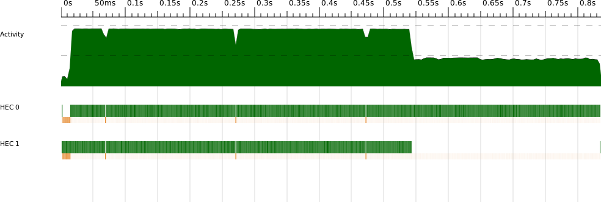

Figure 2-8. sudoku2 ThreadScope profile

The *x*-axis of the graph is time, and there are three horizontal bars showing how the program executed over time. The topmost bar is known as the “activity” profile, and it shows how many cores were executing Haskell code (as opposed to being idle or garbage collecting) at a given point in time. Underneath the activity profile is one bar per core, showing what that core was doing at each point in the execution. Each bar has two parts: The upper, thicker bar is green when that core is executing Haskell code, and the lower, narrower bar is orange or green when that core is performing garbage collection.

As we can see from the graph, there is a period at the end of the run where just one processor is executing and the other one is idle (except for participating in regular garbage collections, which is necessary for GHC’s parallel garbage collector). This indicates that our two parallel tasks are uneven: One takes much longer to execute than the other. We are not making full use of our two cores, and this results in less-than-perfect speedup.

Why should the workloads be uneven? After all, we divided the list in two, and we know the sample input has an even number of problems. The reason for the unevenness is that each problem does not take the same amount of time to solve: It all depends on the searching strategy used by the Sudoku solver.^(\[3\])

This illustrates an important principle when parallelizing code: Try to avoid partitioning the work into a small, fixed number of chunks. There are two reasons for this:

- In practice, chunks rarely contain an equal amount of work, so there will be some imbalance leading to a loss of speedup, as in the example we just saw.
- The parallelism we can achieve is limited to the number of chunks. In our example, even if the workloads were even, we could never achieve a speedup of more than two, regardless of how many cores we use.

Even if we tried to solve the second problem by dividing the work into as many segments as we have cores, we would still have the first problem, namely that the work involved in processing each segment may differ.

GHC doesn’t force us to use a fixed number of `rpar` calls; we can call it as many times as we like, and the system will automatically distribute the parallel work among the available cores. If the work is divided into smaller chunks, then the system will be able to keep all the cores busy for longer.

A fixed division of work is often called *static partitioning*, whereas distributing smaller units of work among processors at runtime is called *dynamic partitioning*. GHC already provides the mechanism for dynamic partitioning; we just have to supply it with enough tasks by calling `rpar` often enough so that it can do its job and balance the work evenly.

The argument to `rpar` is called a *spark*. The runtime collects sparks in a pool and uses this as a source of work when there are spare processors available, using a technique called *work stealing*. Sparks may be evaluated at some point in the future, or they might not—it all depends on whether there is a spare core available. Sparks are very cheap to create: `rpar` essentially just writes a pointer to the expression into an array.

So let’s try to use dynamic partitioning with the Sudoku problem. First, we define an abstraction that will let us apply a function to a list in parallel, `parMap`:

```
parMap :: (a -> b) -> [a] -> Eval [b]
parMap f [] = return []
parMap f (a:as) = do
   b <- rpar (f a)
   bs <- parMap f as
   return (b:bs)
```

This is rather like a monadic version of `map`, except that we have used `rpar` to lift the application of the function `f` to the element `a` into the `Eval` monad. Hence, `parMap` runs down the whole list, eagerly creating sparks for the application of `f` to each element, and finally returns the new list. When `parMap` returns, it will have created one spark for each element of the list. Now, the evaluation of all the results can happen in parallel:

*sudoku3.hs*

```
main :: IO ()
main = do
  [f] <- getArgs
  file <- readFile f

  let puzzles   = lines file
      solutions = runEval (parMap solve puzzles)

  print (length (filter isJust solutions))
```

Note how this version is nearly identical to the first version, *sudoku1.hs*. The only difference is that we’ve replaced `map solve puzzles` by `runEval (parMap solve puzzles)`.

Running this new version yields more speedup:

```
  Total   time    1.42s  (  0.72s elapsed)
```

which corresponds to a speedup of 1.31/0.72 = 1.82, approaching the ideal speedup of 2. Furthermore, the GHC runtime system tells us how many sparks were created:

```
  SPARKS: 1000 (1000 converted, 0 overflowed, 0 dud, 0 GC'd, 0 fizzled)
```

We created exactly 1,000 sparks, and they were all *converted* (that is, turned into real parallelism at runtime). Here are some other things that can happen to a spark:

 overflowed  
The spark pool has a fixed size, and if we try to create sparks when the pool is full, they are dropped and counted as overflowed.

 dud  
When `rpar` is applied to an expression that is already evaluated, this is counted as a *dud* and the `rpar` is ignored.

 GC’d  
The sparked expression was found to be unused by the program, so the runtime removed the spark. We’ll discuss this in more detail in GC’d Sparks and Speculative Parallelism.

 fizzled  
The expression was unevaluated at the time it was sparked but was later evaluated independently by the program. Fizzled sparks are removed from the spark pool.

The *ThreadScope* profile for this version looks much better (Figure 2-9). Furthermore, now that the runtime is managing the work distribution for us, the program will automatically scale to more processors. On an 8-core machine, for example, I measured a speedup of 5.83 for the same program.^(\[4\])

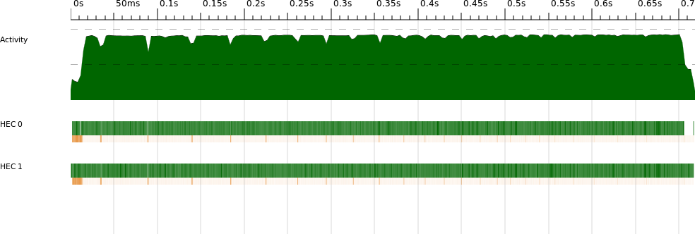

Figure 2-9. sudoku3 ThreadScope profile

If we look closely at the two-processor profile, there appears to be a short section near the beginning where not much work is happening. In fact, zooming in on this section in *ThreadScope* (Figure 2-10) reveals that both processors are working, but most of the activity is garbage collection, and only one processor is performing most of the garbage collection work. In fact, what we are seeing here is the program reading the input file (lazily) and dividing it into lines, driven by the demand of `parMap`, which traverses the whole list of lines. Splitting the file into lines creates a lot of data, and this seems to be happening on the second core here. However, note that even though splitting the file into lines is sequential, the program doesn’t wait for it to complete before the parallel work starts. The `parMap` function creates the first spark when it has the first element of the list, so two processors can be working before we’ve finished splitting the file into lines. Lazy evaluation helps the program be more parallel, in a sense.

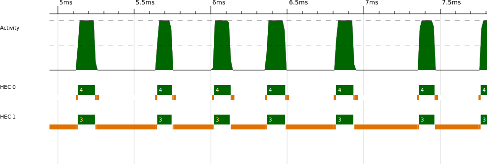

Figure 2-10. sudoku3: zoomed ThreadScope profile

We can experiment with forcing the splitting into lines to happen all at once before we start the main computation, by adding the following (see *sudoku3.hs*):

```
    evaluate (length puzzles)
```

The `evaluate` function is like a `seq` in the `IO` monad: it evaluates its argument to weak head normal form and then returns it:

```
evaluate :: a -> IO a
```

Forcing the lines to be evaluated early reduces the parallelism slightly, because we no longer get the benefit of overlapping the line splitting with the solving. Our two-core runtime is now 0.76s. However, we can now clearly see the boundary between the sequential and parallel parts in *ThreadScope* (Figure 2-11).

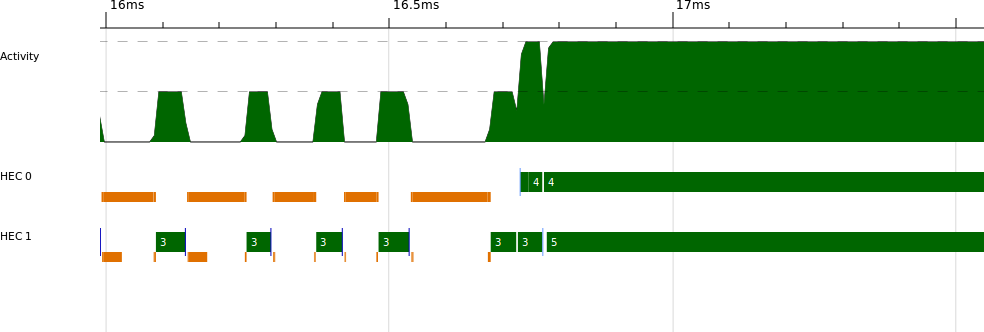

Figure 2-11. sudoku4 ThreadScope profile

Looking at the profile, we can see that the program is sequential until about 16.7ms, when it starts executing in parallel. A program that has a sequential portion like this can never achieve perfect speedup, and in fact we can calculate the maximum achievable speedup for a given number of cores using Amdahl’s law. Amdahl’s law gives the maximum speedup as the ratio:

1 / ((1 - *P*) + *P*/*N*)

where *P* is the portion of the runtime that can be parallelized, and *N* is the number of processors available. In our case, *P* is (0.76 - 0.0167)/0.76 = 0.978, and the maximum speedup is 1.96. The sequential fraction here is too small to make a significant impact on the theoretical maximum speedup with two processors, but when we have more processors, say 64, it becomes much more important: 1 / ((1-0.978) + 0.978/64) = 26.8. So no matter what we do, this tiny sequential part of our program will limit the maximum speedup we can obtain with 64 processors to 26.8. In fact, even with 1,024 cores, we could achieve only around 44 speedup, and it is impossible to achieve a speedup of 46 no matter how many cores we have. Amdahl’s law tells us that not only does parallel speedup become harder to achieve the more processors we add, but in practice most programs have a theoretical maximum amount of parallelism.

## Deepseq

We encountered `force` earlier, with this type:

```
force :: NFData a => a -> a
```

The `force` function fully evaluates its argument and then returns it. This function isn’t built-in, though: Its behavior is defined for each data type through the `NFData` class. The name stands for normal-form data, where normal-form is a value with no unevaluated subexpressions, and “data” because it isn’t possible to put a function in normal form; there’s no way to “look inside” a function and evaluate the things it mentions.^(\[5\])

The `NFData` class has only one method:

```
class NFData a where
  rnf :: a -> ()
  rnf a = a `seq` ()
```

The `rnf` name stands for “reduce to normal-form.” It fully evaluates its argument and then returns `()`. The default definition uses `seq`, which is convenient for types that have no substructure; we can just use the default. For example, the instance for `Bool` is defined as simply:

```
instance NFData Bool
```

And the `Control.Deepseq` module provides instances for all the other common types found in the libraries.

You may need to create instances of `NFData` for your own types. For example, if we had a binary tree data type:

```
data Tree a = Empty | Branch (Tree a) a (Tree a)
```

then the `NFData` instance should look like this:

```
instance NFData a => NFData (Tree a) where
  rnf Empty = ()
  rnf (Branch l a r) = rnf l `seq` rnf a `seq` rnf r
```

The idea is to just recursively apply `rnf` to the components of the data type, composing the calls to `rnf` together with `seq`.

There are some other operations provided by `Control.DeepSeq`:

```
deepseq :: NFData a => a -> b -> b
deepseq a b = rnf a `seq` b
```

The function `deepseq` is so named for its similarity with `seq`; it is like `seq`, but if we think of weak head normal form as being *shallow* evaluation, then normal form is *deep* evaluation, hence `deepseq`.

The `force` function is defined in terms of `deepseq`:

```
force :: NFData a => a -> a
force x = x `deepseq` x
```

You should think of `force` as turning WHNF into NF: If the program evaluates `force x` to WHNF, then `x` will be evaluated to NF.

### Caution

Evaluating something to normal form involves traversing the whole of its structure, so you should bear in mind that it is *O*(*n*) for a structure of size *n*, whereas `seq` is *O*(1). It is therefore a good idea to avoid repeated uses of `force` or `deepseq` on the same data.

WHNF and NF are two ends of a scale; there may be lots of intermediate “degrees of evaluation,” depending on the data type. For example, we saw earlier that the `length` function evaluates only the *spine* of a list; that is, the list cells but not the elements. The module `Control.Seq` (from the `parallel` package) provides a set of combinators that can be composed together to evaluate data structures to varying degrees. We won’t need it for the examples in this book, but you may find it useful.

  

------------------------------------------------------------------------

^(\[1\]) Technically, this is not correct. Haskell is actually a *non-strict* language, and lazy evaluation is just one of several valid implementation strategies. But GHC uses lazy evaluation, so we ignore this technicality for now.

^(\[2\]) Strictly speaking, it is overwritten by an indirect reference to the value, but the details aren’t important here. Interested readers can head over to the [GHC wiki](http://trac.haskell.org/ghc) to read the documentation about the implementation and the many papers written about its design.

^(\[3\]) In fact, I sorted the problems in the sample input so as to clearly demonstrate the problem.

^(\[4\]) This machine was an Amazon EC2 High-CPU extra-large instance.

^(\[5\]) However, there is an instance of `NFData` for functions, which evaluates the function to WHNF. This is purely for convenience, because we often have data structures that contain functions and nevertheless want to evaluate them as much as possible.