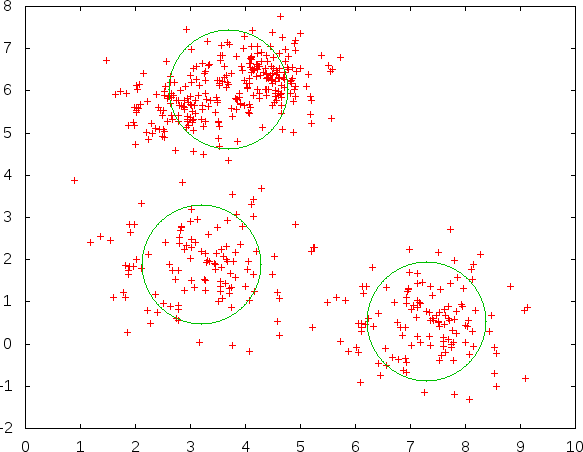
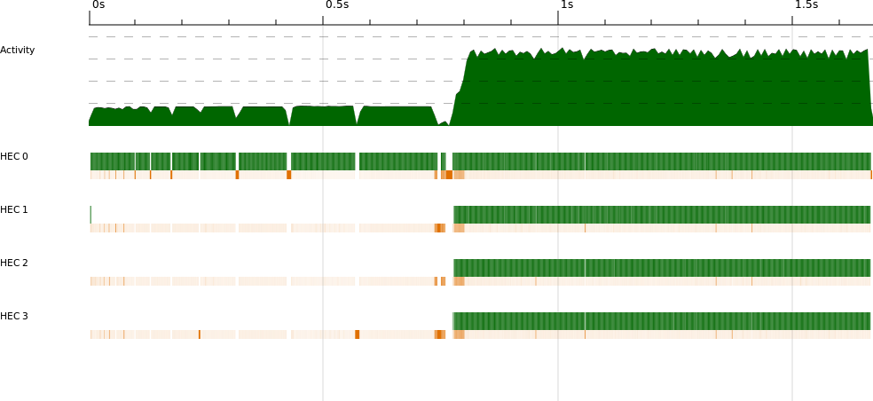
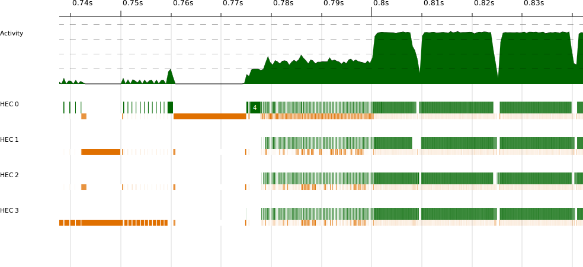
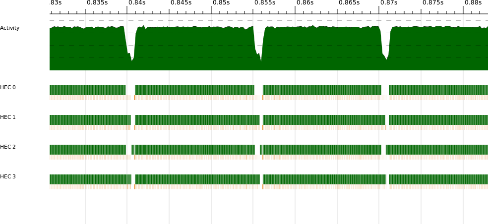
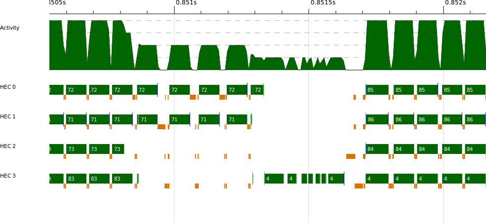
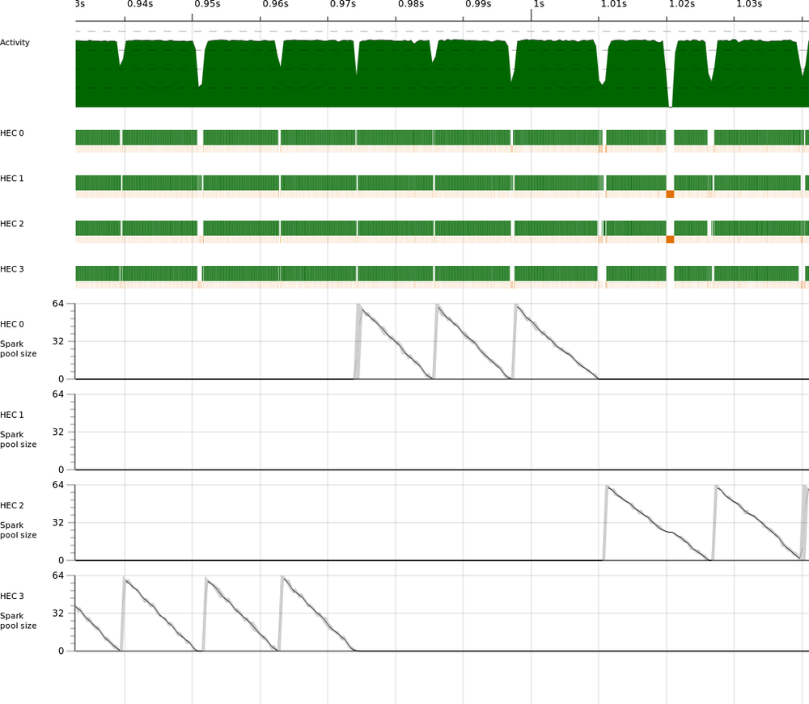
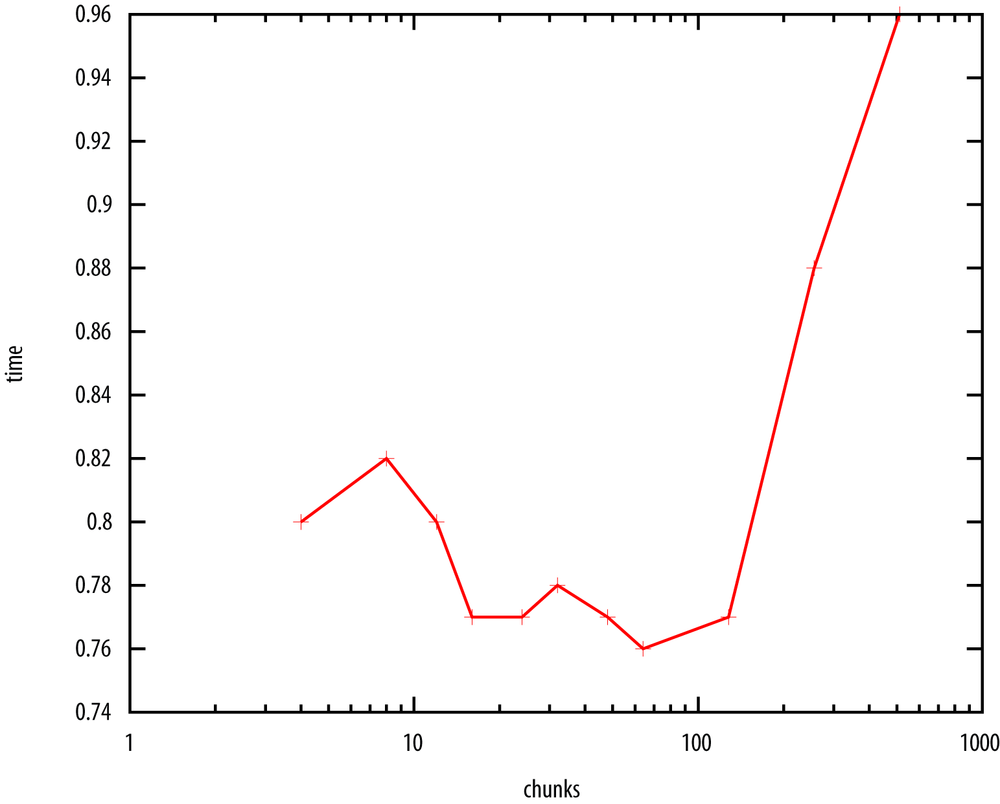
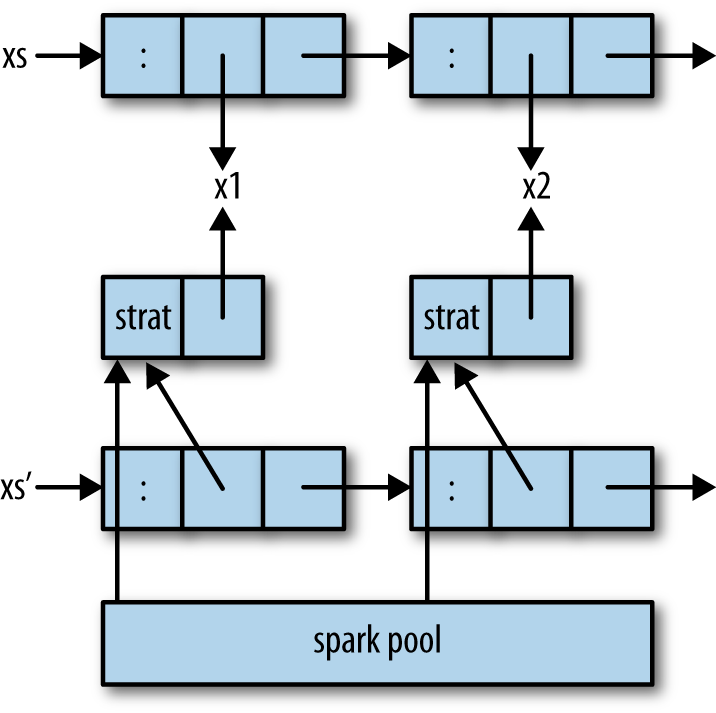
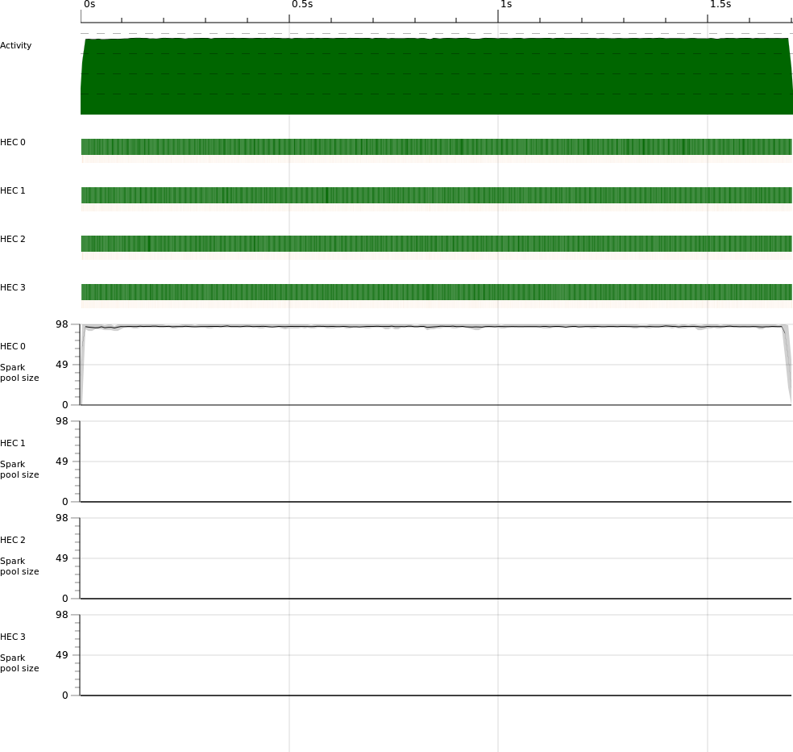

## Chapter 3. Evaluation Strategies

Evaluation Strategies, or simply Strategies, are a means for modularizing parallel code by separating the algorithm from the parallelism. Sometimes they require you to rewrite your algorithm, but once you do so, you will be able to parallelize it in different ways just by substituting a new Strategy.

Concretely, a `Strategy` is a function in the `Eval` monad that takes a value of type `a` and returns the same value:

```
type Strategy a = a -> Eval a
```

The idea is that a Strategy takes a data structure as input, traverses the structure creating parallelism with `rpar` and `rseq`, and then returns the original value.

Here’s a simple example: Let’s create a Strategy for pairs that evaluates the two components of the pair in parallel. We want a function `parPair` with the following type:

```
parPair :: Strategy (a,b)
```

From the definition of the `Strategy` type previously shown, we know that this type is the same as `(a,b) -> Eval (a,b)`. So `parPair` is a function that takes a pair, does some computation in the `Eval` monad, and returns the pair again. Here is its definition:

*strat.hs*

```
parPair :: Strategy (a,b)
parPair (a,b) = do
  a' <- rpar a
  b' <- rpar b
  return (a',b')
```

This is similar to the *rpar/rpar* pattern that we saw in The Eval Monad, rpar, and rseq. The difference is that we’ve packaged it up as a Strategy: It takes a data structure (in this case a pair), creates some parallelism using `rpar`, and then returns the same data structure.

We’ll see this in action in a moment, but first we need to know how to use a Strategy. Using a Strategy consists of applying it to its input and running the `Eval` computation to get the output. We could write that directly with `runEval`; for example, to evaluate the pair `(fib 35, fib 36)` in parallel, we could write:

```
  runEval (parPair (fib 35, fib 36))
```

This works just fine, but it turns out to be much nicer to package up the application of a Strategy into a function named `using`:

```
using :: a -> Strategy a -> a
x `using` s = runEval (s x)
```

The `using` function takes a value of type `a` and a Strategy for `a`, and applies the Strategy to the value. We normally write `using` infix, as its definition suggests. Here is the `parPair` example above rewritten with `using`:

```
   (fib 35, fib 36) `using` parPair
```

Why write it this way? Well, a Strategy returns the same value that it was passed, so we know that aside from its performance, the above code is equivalent to just:

```
   (fib 35, fib 36)
```

So we’ve clearly separated the code that describes what the program *does* (the pair) from the code that adds the parallelism (`` `using` parPair ``). Indeed, everywhere we see `` x `using` s `` in our program, we can delete the `` `using` s `` part and the program should produce the same result.^(\[6\]) Conversely, someone who is interested in parallelizing the program can focus on modifying the Strategy without worrying about breaking the program.

The example program *strat.hs* contains the `parPair` example just shown; try running it yourself with one and two processors to see it compute the two calls to `fib` in parallel.

## Parameterized Strategies

The `parPair` Strategy embodies a fixed policy: It always evaluates the components of the pair in parallel, and always to weak head normal form. If we wanted to do something different with a pair—fully evaluate the components to normal form, for example—we would have to write a completely new Strategy. A better way to factor things is to write a *parameterized* Strategy, which takes as arguments the Strategies to apply to the components of the data structure. Here is a parameterized Strategy for pairs:

*strat.hs*

```
evalPair :: Strategy a -> Strategy b -> Strategy (a,b)
evalPair sa sb (a,b) = do
  a' <- sa a
  b' <- sb b
  return (a',b')
```

This Strategy no longer has parallelism built in, so I’ve called it `evalPair` instead of `parPair`.^(\[7\]) It takes two `Strategy` arguments, `sa` and `sb`, applies them to the respective components of the pair, and then returns the pair.

Compared with `parPair`, we are passing in the functions to apply to `a` and `b` instead of making fixed calls to `rpar`. So to define `parPair` in terms of `evalPair`, we can just pass `rpar` as the arguments:

```
parPair :: Strategy (a,b)
parPair = evalPair rpar rpar
```

This means we’re using `rpar` itself as a `Strategy`:

```
rpar :: Strategy a
```

The type of `rpar` is `a -> Eval a`, which is equivalent to `Strategy a`; `rpar` is therefore a Strategy for any type, with the effect of starting the evaluation of its argument while the enclosing `Eval` computation proceeds in parallel. (The `rseq` operation is also a `Strategy`.)

But `parPair` is still restrictive, in that the components of the pair are always evaluated to weak head normal form. What if we wanted to fully evaluate the components using `force`, for example? We can make a `Strategy` that fully evaluates its argument:

```
rdeepseq :: NFData a => Strategy a
rdeepseq x = rseq (force x)
```

But how do we combine `rpar` with `rdeepseq` to give us a single Strategy that fully evaluates its argument in parallel? We need one further combinator, which is provided by `Control.Parallel.Strategies`:

```
rparWith :: Strategy a -> Strategy a
```

Think of `rparWith s` as wrapping the Strategy `s` in an `rpar`.

Now we can provide a parameterized version of `parPair` that takes the Strategies to apply to the components:

```
parPair :: Strategy a -> Strategy b -> Strategy (a,b)
parPair sa sb = evalPair (rparWith sa) (rparWith sb)
```

And we can use `parPair` to write a `Strategy` that fully evaluates both components of a pair in parallel:

```
  parPair rdeepseq rdeepseq :: (NFData a, NFData b) => Strategy (a,b)
```

To break down what happens when this `Strategy` is applied to a pair: `parPair` calls `evalPair`, and `evalPair` calls `rparWith rdeepseq` on each component of the pair. So the effect is that each component will be fully evaluated to normal form in parallel.

When using these parameterized Strategies, we sometimes need a way to say, “Don’t evaluate this component at all.” The `Strategy` that does no evaluation is called `r0`:

```
r0 :: Strategy a
r0 x = return x
```

For example, we can write a `Strategy` over a pair of pairs that evaluates the first component (only) of both pairs in parallel.

```
  evalPair (evalPair rpar r0) (evalPair rpar r0) :: Strategy ((a,b),(c,d))
```

The first `rpar` applies to `a` and the first `r0` to `b`, while the second `rpar` applies to `c` and the second `r0` to `d`.

## A Strategy for Evaluating a List in Parallel

In Chapter 2, we defined a function `parMap` that would map a function over a list in parallel. We can think of `parMap` as a composition of two parts:

- The algorithm: `map`
- The parallelism: evaluating the elements of a list in parallel

And indeed, with Strategies, we can express it exactly this way:

```
parMap :: (a -> b) -> [a] -> [b]
parMap f xs = map f xs `using` parList rseq
```

The `parList` function is a Strategy on lists that evaluates the list elements in parallel. To define `parList`, we can take the same approach that we took with pairs earlier and first define a parameterized Strategy on lists, called `evalList`:

*parlist.hs*

```
evalList :: Strategy a -> Strategy [a]
evalList strat []     = return []
evalList strat (x:xs) = do
  x'  <- strat x
  xs' <- evalList strat xs
  return (x':xs')
```

Note that `evalList` walks the list recursively, applying the Strategy parameter `strat` to each of the elements and building the result list. Now we can define `parList` in terms of `evalList`, using `rparWith`:

```
parList :: Strategy a -> Strategy [a]
parList strat = evalList (rparWith strat)
```

In fact, both `evalList` and `parList` are already provided by `Control.Parallel``.Strategies` so you don’t have to define them yourself, but it’s useful to see that their implementations are not mysterious.

As with `parPair`, the `parList` function is a parameterized Strategy. That is, it takes as an argument a Strategy on values of type `a` and returns a Strategy for lists of `a`. So `parList` describes a family of Strategies on lists that evaluate the list elements in parallel.

The `parList` Strategy covers a wide range of uses for parallelism in typical Haskell programs; in many cases, a single `parList` is all that is needed to expose plenty of parallelism.

Returning to our Sudoku solver from Chapter 2 for a moment: instead of our own hand-written `parMap`, we could have used `parList`:

*sudoku5.hs*

```
  let solutions = map solve puzzles `using` parList rseq
```

Using `rseq` as the Strategy for the list elements is enough here: The result of `solve` is a `Maybe`, so evaluating it to weak head normal form forces the solver to determine whether the puzzle has a solution.

This version has essentially the same performance as the version that used `parMap` in Chapter 2.

## Example: The K-Means Problem

Let’s look at a slightly more involved example. In the *K-Means* problem, the goal is to partition a set of data points into clusters. Figure 3-1 shows an example data set, and the circles indicate the locations of the clusters that the algorithm should derive. From the locations of the clusters, partitioning the points is achieved by simply finding the closest cluster to each point.



Figure 3-1. The K-Means problem

Finding an optimal solution to the problem is too expensive to be practical. However, there are several heuristic techniques that are fast, and even though they don’t guarantee an optimal solution, in practice, they give good results. The most well-known heuristic technique for K-Means is Lloyd’s algorithm, which finds a solution by iteratively improving an initial guess. The algorithm takes as a parameter the number of clusters to find and makes an initial guess at the center of each cluster. Then it proceeds as follows:

1.  Assign each point to the cluster to which it is closest. This yields a new set of clusters.
2.  Find the *centroid* of each cluster (the average of all the points in the cluster).
3.  Repeat steps 1 and 2 until the cluster locations stabilize. We cut off processing after an arbitrarily chosen number of iterations, because sometimes the algorithm does not converge.

The initial guess can be constructed by randomly assigning each point in the data set to a cluster and then finding the centroids of those clusters.

The algorithm works in any number of dimensions, but we will use two for ease of visualization.

A complete Haskell implementation can be found in the directory *kmeans* in the sample code.

A data point is represented by the type `Point`, which is just a pair of `Double`s representing the `x` and `y` coordinates respectively:^(\[8\])

```
data Point = Point !Double !Double
```

There are a couple of basic operations on `Point`:

*kmeans/KMeansCore.hs*

```
zeroPoint :: Point
zeroPoint = Point 0 0

sqDistance :: Point -> Point -> Double
sqDistance (Point x1 y1) (Point x2 y2) = ((x1-x2)^2) + ((y1-y2)^2)
```

We can make a zero point with `zeroPoint`, and find the square of the distance between two points with `sqDistance`. The actual distance between the points would be given by the square root of this value, but since we will only be comparing distances, we can save time by comparing squared distances instead.

Clusters are represented by the type `Cluster`:

```
data Cluster
  = Cluster { clId    :: Int
            , clCent  :: Point
            }
```

A `Cluster` contains its number (`clId`) and its centroid (`clCent`).

We will also need an intermediate type called `PointSum`:

```
data PointSum = PointSum !Int !Double !Double
```

A `PointSum` represents the sum of a set of points; it contains the number of points in the set and the sum of their `x` and `y` coordinates respectively. A `PointSum` is constructed incrementally, by repeatedly adding points using `addToPointSum`:

*kmeans/kmeans.hs*

```
addToPointSum :: PointSum -> Point -> PointSum
addToPointSum (PointSum count xs ys) (Point x y)
  = PointSum (count+1) (xs + x) (ys + y)
```

A `PointSum` can be turned into a `Cluster` by computing the centroid. The `x` coordinate of the centroid is the sum of the `x` coordinates of the points in the cluster divided by the total number of points, and similarly for the `y` coordinate.

```
pointSumToCluster :: Int -> PointSum -> Cluster
pointSumToCluster i (PointSum count xs ys) =
  Cluster { clId    = i
          , clCent  = Point (xs / fromIntegral count) (ys / fromIntegral count)
          }
```

The roles of the types `Point`, `PointSum`, and `Cluster` in the algorithm are as follows. The input is a set of points represented as `[Point]`, and an initial guess represented as `[Cluster]`. The algorithm will iteratively refine the clusters until convergence is reached.

- Step 1 divides the points into new sets by finding the `Cluster` to which each `Point` is closest. However, instead of collecting sets of `Point`s, we build up a `PointSum` for each cluster. This is an optimization that avoids constructing the intermediate data structure and allows the algorithm to run in constant space. We’ll represent the output of this step as `Vector PointSum`.
- The `Vector PointSum` is fed into step 2, which makes a `Cluster` from each `PointSum`, giving `[Cluster]`.
- The result of step 2 is fed back into step 1 until convergence is reached.

The function `assign` implements step 1 of the algorithm, assigning points to clusters and building a vector of `PointSum`s:

```
assign :: Int -> [Cluster] -> [Point] -> Vector PointSum
assign nclusters clusters points = Vector.create $ do
    vec <- MVector.replicate nclusters (PointSum 0 0 0)
    let
        addpoint p = do
          let c = nearest p; cid = clId c
          ps <- MVector.read vec cid
          MVector.write vec cid $! addToPointSum ps p

    mapM_ addpoint points
    return vec
 where
  nearest p = fst $ minimumBy (compare `on` snd)
                        [ (c, sqDistance (clCent c) p) | c <- clusters ]
```

Given a set of clusters and a set of points, the job of `assign` is to decide, for each point, which cluster is closest. For each cluster, we build up a `PointSum` of the points that were found to be closest to it. The code has been carefully optimized, using mutable vectors from the `vector` package; the details aren’t important here.

The function `makeNewClusters` implements step 2 of the algorithm:

```
makeNewClusters :: Vector PointSum -> [Cluster]
makeNewClusters vec =
  [ pointSumToCluster i ps
  | (i,ps@(PointSum count _ _)) <- zip [0..] (Vector.toList vec)
  , count > 0
  ]
```

Here we make a new `Cluster`, using `pointSumToCluster`, from each `PointSum` produced by `assign`. There is a slight complication in that we have to avoid creating a cluster with no points, because it cannot have a centroid.

Finally `step` combines `assign` and `makeNewClusters` to implement one complete iteration:

```
step :: Int -> [Cluster] -> [Point] -> [Cluster]
step nclusters clusters points
   = makeNewClusters (assign nclusters clusters points)
```

To complete the algorithm, we need a loop to repeatedly apply the `step` function until convergence. The function `kmeans_seq` implements this:

```
kmeans_seq :: Int -> [Point] -> [Cluster] -> IO [Cluster]
kmeans_seq nclusters points clusters =
  let
      loop :: Int -> [Cluster] -> IO [Cluster]
      loop n clusters | n > tooMany = do                  -- ①
        putStrLn "giving up."
        return clusters
      loop n clusters = do
        printf "iteration %d\n" n
        putStr (unlines (map show clusters))
        let clusters' = step nclusters clusters points    -- ②
        if clusters' == clusters                          -- ③
           then return clusters
           else loop (n+1) clusters'
  in
  loop 0 clusters

tooMany = 80
```

①  
The first argument to `loop` is the number of iterations completed so far. If this figure reaches the limit `tooMany`, then we bail out (sometimes the algorithm does not converge).

②  
After printing the iteration number and the current clusters for diagnostic purposes, we calculate the next iteration by calling the function `step`. The arguments to `step` are the number of clusters, the current set of clusters, and the set of points.

③  
If this iteration did not change the clusters, then the algorithm has converged, and we return the result. Otherwise, we do another iteration.

We compile this program in the same way as before:

```
$ cd kmeans
$ ghc -O2 -threaded -rtsopts -eventlog kmeans.hs
```

The sample code comes with a program to generate some input data, *GenSamples.hs*, which uses the `normaldistribution` package to generate a realistically clustered set of values. The data set is large, so it isn’t included with the sample code, but you can generate it using `GenSamples`:

```
$ ghc -O2 GenSamples.hs
$ ./GenSamples 5 50000 100000 1010
```

This should generate a data set of about 340,000 points with 5 clusters in the file `points.bin`.

Run the `kmeans` program using the sequential algorithm:

```
$ ./kmeans seq
```

The program will display the clusters at each iteration and should converge after 65 iterations.

Note that the program displays its own running time at the end; this is because there is a significant amount of time spent reading in the sample data at the beginning, and we want to be able to calculate the parallel speedup for the portion of the runtime spent computing the K-Means algorithm only.

### Parallelizing K-Means

How can this algorithm be parallelized? One place that looks profitable to parallelize is the `assign` function because it is essentially just a `map` over the points, and indeed that is where we will concentrate our efforts. The operations are too fine-grained here to use a simple `parMap` or `parList` as we did before; the overhead of the `parMap` will swamp the parallelism, so we need to increase the size of the operations. One way to do that is to divide the list of points into chunks, and process the chunks in parallel. First we need some code to split a list into chunks:

```
split :: Int -> [a] -> [[a]]
split numChunks xs = chunk (length xs `quot` numChunks) xs

chunk :: Int -> [a] -> [[a]]
chunk n [] = []
chunk n xs = as : chunk n bs
  where (as,bs) = splitAt n xs
```

So we can split the list of points into chunks and map `assign` over the list of chunks. But what do we do with the results? We have a list of `Vector PointSum`s that we need to combine into a single `Vector PointSum`. Fortunately, `PointSum`s can be added together:

```
addPointSums :: PointSum -> PointSum -> PointSum
addPointSums (PointSum c1 x1 y1) (PointSum c2 x2 y2)
  = PointSum (c1+c2) (x1+x2) (y1+y2)
```

And using this, we can combine vectors of `PointSum`s:

```
combine :: Vector PointSum -> Vector PointSum -> Vector PointSum
combine = Vector.zipWith addPointSums
```

We now have all the pieces to define a parallel version of `step`:

```
parSteps_strat :: Int -> [Cluster] -> [[Point]] -> [Cluster]
parSteps_strat nclusters clusters pointss
  = makeNewClusters $
      foldr1 combine $
          (map (assign nclusters clusters) pointss
            `using` parList rseq)
```

The arguments to `parSteps_strat` are the same as for `step`, except that the list of points is now a list of lists of points, that is, the list of points divided into chunks by `split`. We want to pass in the chunked data rather than call `split` inside `parSteps_strat` so that we can do the chunking of the input data just once instead of repeating it for each iteration.

The `kmeans_strat` function below is our parallel version of `kmeans_seq`, the only differences being that we call `split` to divide the list of points into chunks (①) and we call `parSteps_strat` instead of `steps` (②):

```
kmeans_strat :: Int -> Int -> [Point] -> [Cluster] -> IO [Cluster]
kmeans_strat numChunks nclusters points clusters =
  let
      chunks = split numChunks points                            -- ①

      loop :: Int -> [Cluster] -> IO [Cluster]
      loop n clusters | n > tooMany = do
        printf "giving up."
        return clusters
      loop n clusters = do
        printf "iteration %d\n" n
        putStr (unlines (map show clusters))
        let clusters' = parSteps_strat nclusters clusters chunks -- ②
        if clusters' == clusters
           then return clusters
           else loop (n+1) clusters'
  in
  loop 0 clusters
```

Note that the number of chunks doesn’t have to be related to the number of processors; as we saw earlier, it is better to produce plenty of sparks and let the runtime schedule them automatically, because this should enable the program to scale over a wide range of processors.

### Performance and Analysis

Next we’re going on an exploration of the performance of this parallel program. Along the way, we’ll learn several lessons about the kinds of things that can go wrong when parallelizing Haskell code, how to look out for them using ThreadScope, and how to fix them.

We’ll start by taking some measurements of the speedup for various numbers of cores. When running the program in parallel, we get to choose the number of chunks to divide the input into, and for these measurements I’ll use 64 (but we’ll revisit this in Granularity). The program is run in parallel like this:

```
$ ./kmeans strat 64 +RTS -N2
```

`strat` indicates that we want to use the Strategies version of the algorithm, and 64 is the number of chunks to divide the input data into. Here, I’m telling the GHC runtime to use two cores.

Here are the speedup results I get on my computer for the `kmeans` program I showed earlier.^(\[9\]) For each measurement, I ran the program a few times and took the average runtime.^(\[10\])

| Cores | Time (s) | Speedup |
|-------|----------|---------|
| 1     | 2.56     | 1       |
| 2     | 1.42     | 1.8     |
| 3     | 1.06     | 2.4     |
| 4     | 0.97     | 2.6     |

We can see that speedup is quite good for two to three cores but starts to drop off at four cores. Still, a 2.6 speedup on 4 cores is reasonably respectable.

The ThreadScope profile gives us some clues about why the speedup might be less than we hope. The overall view of the four-core run can be seen in Figure 3-2.



Figure 3-2. kmeans on four cores

We can clearly see the sequential section at the start, where the program reads in the input data. But that isn’t a problem; remember that the program emits its own timing results, which begin at the parallel part of the run. The parallel section itself looks quite good; all cores seem to be running for the duration. Let’s zoom in on the beginning of the parallel section, as shown in Figure 3-3.



Figure 3-3. kmeans on four cores, start of parallel execution

There’s a segment between 0.78s and 0.8s where, although parallel execution has started, there is heavy GC activity. This is similar to what we saw in Example: Parallelizing a Sudoku Solver, where the work of splitting the input data into lines was overlapped with the parallel execution. In the case of `kmeans`, the act of splitting the data set into chunks is causing the extra work.

The sequential version of the algorithm doesn’t need to split the data into chunks, so chunking is a source of extra overhead in the parallel version. This is one reason that we aren’t achieving full speedup. If you’re feeling adventurous, you might want to see whether you can avoid this chunking overhead by using `Vector` instead of a list to represent the data set, because `Vector`s can be sliced in *O*(1) time.

Let’s look at the rest of the parallel section in more detail (see Figure 3-4).



Figure 3-4. kmeans on four cores, parallel execution

The parallel execution, which at first looked quite uniform, actually consists of a series of humps when we zoom in. Remember that the algorithm performs a series of iterations over the data set—these humps in the profile correspond to the iterations. Each iteration is a separate parallel segment, and between the iterations lies some sequential execution. We expect a small amount of sequential execution corresponding to `makeNewClusters`, `combine`, and the comparison between the new and old clusters in the outer loop.

Let’s see whether the reality matches our expectations by zooming in on one of the gaps to see more clearly what happens between iterations (Figure 3-5).



Figure 3-5. kmeans on four cores, gap between iterations

There’s quite a lot going on here. We can see the parallel execution of the previous iteration tailing off, as a couple of cores run longer than the others. Following this, there is some sequential execution on HEC 3 before the next iteration starts up in parallel.

Looking more closely at the sequential bit on HEC 3, we can see some gaps where nothing appears to be happening at all. In the ThreadScope GUI, we can show the detailed events emitted by the RTS (look for the “Raw Events” tab in the lower pane), and if we look at the events for this section, we see:

```
0.851404792s HEC 3: stopping thread 4 (making a foreign call)
0.851405771s HEC 3: running thread 4
0.851406373s HEC 3: stopping thread 4 (making a foreign call)
0.851419669s HEC 3: running thread 4
0.851451713s HEC 3: stopping thread 4 (making a foreign call)
0.851452171s HEC 3: running thread 4
...
```

The program is popping out to make several foreign calls during this period. ThreadScope doesn’t tell us any more than this, but it’s enough of a clue: A foreign call usually indicates some kind of I/O, which should remind us to look back at what happens between iterations in the `kmeans_seq` function:

```
      loop n clusters = do
        printf "iteration %d\n" n
        putStr (unlines (map show clusters))
        ...
```

We’re printing some output. Furthermore, we’re doing this in the sequential part of the program, and Amdahl’s law is making us pay for it in parallel speedup.

Commenting out these two lines (in both `kmeans_seq` and `kmeans_strat`, to be fair) improves the parallel speedup from 2.6 to **3.4** on my quad-core machine. It’s amazing how easy it is to make a small mistake like this in parallel programming, but fortunately ThreadScope helps us identify the problem, or at least gives us clues about where we should look.

### Visualizing Spark Activity

We can also use ThreadScope to visualize the creation and use of sparks during the run of the program. Figure 3-6 shows the profile for `kmeans` running on four cores, showing the spark pool size over time for each HEC (these graphs are enabled in the ThreadScope GUI from the “Traces” tab in the left pane).



Figure 3-6. kmeans on four cores, spark pool sizes

The figure clearly shows that as each iteration starts, 64 sparks are created on one HEC and then are gradually consumed. What is perhaps surprising is that the sparks aren’t always generated on the same HEC; this is the GHC runtime moving work behind the scenes as it tries to keep the load balanced across the cores.

There are more spark-related graphs available in ThreadScope, showing the rates of spark creation and conversion (running sparks). All of these can be valuable in understanding the performance characteristics of your parallel program.

### Granularity

Looking back at Figure 3-5, I remarked earlier that the parallel section didn’t finish evenly, with two cores running a bit longer than the others. Ideally, we would have all the cores running until the end to maximize our speedup.

As we saw in Example: Parallelizing a Sudoku Solver, having too few work items in our parallel program can impact the speedup, because the work items can vary in cost. To get a more even run, we want to create fine-grained work items and more of them.

To see the effect of this, I ran `kmeans` with various numbers of chunks from 4 up to 512, and measured the runtime on 4 cores. The results are shown in Figure 3-7.



Figure 3-7. The effect of the number of chunks in kmeans

We can see not only that having too few chunks is not good for the reasons given above, but also having too many can have a severe impact. In this case, the sweet spot is somewhere around 50-100.

Why does having too many chunks increase the runtime? There are two reasons:

- There is some overhead per chunk in creating the spark and arranging to run it on another processor. As the chunks get smaller, this overhead becomes more significant.
- The amount of sequential work that the program has to do is greater. Combining the results from 512 chunks takes longer than 64, and because this is in the sequential part, it significantly impacts the parallel performance.

## GC’d Sparks and Speculative Parallelism

Recall the definition of `parList`:

```
parList :: Strategy a -> Strategy [a]
parList strat = evalList (rparWith strat)
```

And the underlying parameterized `Strategy` on lists, `evalList`:

```
evalList :: Strategy a -> Strategy [a]
evalList strat []     = return []
evalList strat (x:xs) = do
  x'  <- strat x
  xs' <- evalList strat xs
  return (x':xs')
```

As `evalList` traverses the list applying the strategy `strat` to the list elements, it remembers each value returned by `strat` (bound to `x'`), and constructs a new list from these values. Why? Well, one answer is that a Strategy must return a data structure equal to the one it was passed.

But do we really need to build a new list? After all, this means that `evalList` is not *tail-recursive*; the recursive call to `evalList` is not the last operation in the `do` on its right-hand side, so `evalList` requires stack space linear in the length of the input list.

Couldn’t we just write a tail-recursive version of `parList` instead? Perhaps like this:

```
parList :: Strategy a -> Strategy [a]
parList strat xs = do
  go xs
  return xs
 where
  go []     = return ()
  go (x:xs) = do rparWith strat x
                 go xs
```

After all, this is type-correct and seems to call `rparWith` on each list element as required.

Unfortunately, this version of `parList` has a serious problem: All the parallelism it creates will be discarded by the garbage collector. The omission of the result list turns out to be crucial. Let’s take a look at the data structures that our original, correct implementations of `parList` and `evalList` created (Figure 3-8).



Figure 3-8. parList heap structures

At the top of the diagram is the input list `xs`: a linked list of cells, each of which points to a list element (`x1`, `x2`, and so forth). At the bottom of the diagram is the *spark pool*, the runtime system data structure that stores references to sparks in the heap. The other structures in the diagram are built by `parList` (the correct version, not the one I most recently showed). Each `strat` box represents the strategy `strat` applied to an element of the original list, and `xs'` is the linked list of cells in the output list. The spark pool contains pointers to each of the `strat` boxes; these are the pointers created by each call to `rparWith`.

The GHC runtime regularly checks the spark pool for any entries that are not required by the program and removes them. It would be bad to retain entries that aren’t needed, because that could cause the program to hold on to memory unnecessarily, leading to a space leak. We don’t want parallelism to have a negative impact on performance.

How does the runtime know whether an entry is needed? The same way it knows whether any item in memory is needed: There must be a pointer to it from something else that is needed. This is the reason that `parList` creates a new list `xs'`. Suppose we did not build the new list `xs'`, as in the tail-recursive version of `parList` above. Then the only reference to each `strat` box in the heap would be from the spark pool, and hence the runtime would automatically sweep all those references from the spark pool, discarding the parallelism. So we build a new list `xs'` to hold references to the `strat` calls that we need to retain.

The automatic discarding of unreferenced sparks has another benefit besides avoiding space leaks; suppose that under some circumstances the program does not need the entire list. If the program simply forgets the unused remainder of the list, the runtime system will clean up the unreferenced sparks from the spark pool and will not waste any further parallel processing resources on evaluating those sparks. The extra parallelism in this case is termed *speculative*, because it is not necessarily required, and the runtime will automatically discard speculative tasks that it can prove will never be required—a useful property!

Although the runtime system’s discarding of unreferenced sparks is certainly useful in some cases, it can be tricky to work with because there is no language-level support for catching mistakes. Fortunately, the runtime system will tell us if it garbage-collects unreferenced sparks. For example, if you use the tail-recursive `parList` with the Sudoku solver from Chapter 2, the `+RTS -s` stats will show something like this:

```
  SPARKS: 1000 (2 converted, 0 overflowed, 0 dud, 998 GC'd, 0 fizzled)
```

Garbage-collected sparks are reported as “GC’d.” ThreadScope will also indicate GC’d sparks in its spark graphs.

If you see that a large number of sparks are GC’d, it’s a good indication that sparks are being removed from the spark pool before they can be used for parallelism. Unless you are using speculation, a non-zero figure for GC’d sparks is probably a bad sign.

All the combinators in the `Control.Parallel.Strategies` libraries retain references to sparks correctly. These are the rules of thumb for not shooting yourself in the foot:

- Use `using` to apply Strategies instead of `runEval`; it encourages the right pattern, in which the program uses the results of applying the Strategy.

- When writing your own `Eval` monad code, this is wrong:

  ```
    do
      ...
      rpar (f x)
      ...
  ```

  Equivalently, using `rparWith` without binding the result is wrong. However, this is OK:

  ```
    do
      ...
      y <- rpar (f x)
      ... y ...
  ```

  And this might be OK, as long as `y` is required by the program somewhere:

  ```
    do
      ...
      rpar y
      ...
  ```

## Parallelizing Lazy Streams with parBuffer

A common pattern in Haskell programming is to use a lazy list as a stream so that the program can consume input while simultaneously producing output and consequently run in constant space. Such programs present something of a challenge for parallelism; if we aren’t careful, parallelizing the computation will destroy the lazy streaming property and the program will require space linear in the size of the input.

To demonstrate this, we will use the sample program *rsa.hs*, an implementation of RSA encryption and decryption. The program takes two command line arguments: the first specifies which action to take, `encrypt` or `decrypt`, and the second is either the filename of the file to read, or the character `-` to read from `stdin`. The output is always produced on `stdout`.

The following example uses the program to encrypt the message `"Hello World!"`:

```
$ echo 'Hello World!' | ./rsa encrypt -
11656463941851871045300458781178110195032310900426966299882646602337646308966290
04616367852931838847898165226788260038683620100405280790394258940505884384435202
74975036125752600761230510342589852431747
```

And we can test that the program successfully decrypts the output, producing the original text, by piping the output back into `rsa decrypt`:

```
$ echo "Hello World!" | ./rsa encrypt - | ./rsa decrypt -
Hello World!
```

The `rsa` program is a stream transformer, consuming input and producing output lazily. We can see this by looking at the RTS stats:

```
$ ./rsa encrypt /usr/share/dict/words >/dev/null +RTS -s
   8,040,128,392 bytes allocated in the heap
      66,756,936 bytes copied during GC
         186,992 bytes maximum residency (71 sample(s))
          36,584 bytes maximum slop
               2 MB total memory in use (0 MB lost due to fragmentation)
```

The */usr/share/dict/words* file is about 1 MB in size, but the program has a maximum residency (live memory) of 186,992 bytes.

Let’s try to parallelize the program. The program uses the lazy `ByteString` type from `Data.ByteString.Lazy` to achieve streaming, and the top-level `encrypt` function has this type:

```
encrypt :: Integer -> Integer -> ByteString -> ByteString
```

The two `Integer`s are the key with which to encrypt the data. The implementation of `encrypt` is a beautiful pipeline composition:

*rsa.hs*

```
encrypt n e = B.unlines                                -- ①
            . map (B.pack . show . power e n . code)   -- ②
            . chunk (size n)                           -- ③
```

③  
Divide the input into chunks. Each chunk is encrypted separately; this has nothing to do with parallelism.

②  
Encrypt each chunk.

①  
Concatenate the result as a sequence of lines.

We won’t delve into the details of the RSA implementation here, but if you’re interested, go and look at the code in *rsa.hs* (it’s fairly short). For the purposes of parallelism, all we need to know is that there’s a `map` on the second line, so that’s our target for parallelization.

First, let’s try to use the `parList` Strategy that we have seen before:

*rsa1.hs*

```
encrypt n e = B.unlines
            . withStrategy (parList rdeepseq)        -- ①
            . map (B.pack . show . power e n . code)
            . chunk (size n)
```

①  
I’m using `withStrategy` here, which is just a version of `using` with the arguments flipped; it is slightly nicer in situations like this. The Strategy is `parList`, with `rdeepseq` as the Strategy to apply to the list elements (the list elements are lazy `ByteStrings`, so we want to ensure that they are fully evaluated).

If we run this program on four cores, the stats show something interesting:

```
   6,251,537,576 bytes allocated in the heap
      44,392,808 bytes copied during GC
       2,415,240 bytes maximum residency (33 sample(s))
         550,264 bytes maximum slop
              10 MB total memory in use (0 MB lost due to fragmentation)
```

The maximum residency has increased to 2.3 MB, because the `parList` Strategy forces the whole spine of the list, preventing the program from streaming in constant space. The speedup in this case was 2.2; not terrible, but not great either. We can do better.

The `Control.Parallel.Strategies` library provides a Strategy to solve exactly this problem, called `parBuffer`:

```
parBuffer :: Int -> Strategy a -> Strategy [a]
```

The `parBuffer` function has a similar type to `parList` but takes an `Int` argument as a buffer size. In contrast to `parList` which eagerly creates a spark for every list element, `parBuffer` *N* creates sparks for only the first *N* elements of the list, and then creates more sparks as the result list is consumed. The effect is that there will always be *N* sparks available until the end of the list is reached.

The disadvantage of `parBuffer` is that we have to choose a particular value for the buffer size, and as with the chunk factor we saw earlier, there will be a “best value” somewhere in the range. Fortunately, performance is usually not too sensitive to this value, and something in the range of 50-500 is often good. So let’s see how well this works:

*rsa2.hs*

```
encrypt n e = B.unlines
            . withStrategy (parBuffer 100 rdeepseq)             -- ①
            . map (B.pack . show . power e n . code)
            . chunk (size n)
```

①  
Here I replaced `parList` with `parBuffer 100`.

This programs achieves a speedup of 3.5 on 4 cores. Furthermore, it runs in much less memory than the `parList` version:

```
   6,275,891,072 bytes allocated in the heap
      27,749,720 bytes copied during GC
         294,872 bytes maximum residency (58 sample(s))
          62,456 bytes maximum slop
               4 MB total memory in use (0 MB lost due to fragmentation)
```

We can expect it to need more memory than the sequential version, which required only 2 MB, because we’re performing many computations in parallel. Indeed, a higher residency is common in parallel programs for the simple reason that they are doing more work, although it’s not always the case; sometimes parallel evaluation can reduce memory overhead by evaluating thunks that were causing space leaks.

ThreadScope’s spark pool graph shows that `parBuffer` really does keep a constant supply of sparks, as shown in Figure 3-9.



Figure 3-9. rsa on four cores, using parBuffer

The spark pool on HEC 0 constantly hovers around 90-100 sparks.

In programs with a multistage pipeline, interposing more calls to `withStrategy` in the pipeline can expose more parallelism.

## Chunking Strategies

When parallelizing K-Means in Parallelizing K-Means, we divided the input data into chunks to avoid creating parallelism with excessively fine granularity. Chunking is a common technique, so the `Control.Parallel.Strategies` library provides a version of `parList` that has chunking built in:

```
parListChunk :: Int -> Strategy a -> Strategy [a]
```

The first argument is the number of elements in each chunk; the list is split in the same way as the `chunk` function that we saw earlier in the `kmeans` example. You might find `parListChunk` useful if you have a list with too many elements to spark every one, or when the list elements are too cheap to warrant a spark each.

The spark pool has a fixed size, and when the pool is full, subsequent sparks are dropped and reported as `overflowed` in the `+RTS -s` stats output. If you see some overflowed sparks, it is probably a good idea to create fewer sparks; replacing `parList` with `parListChunk` is a good way to do that.

Note that chunking the list incurs some overhead, as we noticed in the earlier `kmeans` example when we used chunking directly. For that reason, in `kmeans` we created the chunked list once and shared it amongst all the iterations of the algorithm, rather than using `parListChunk`, which would chunk the list every time.

## The Identity Property

I mentioned at the beginning of this chapter that if we see an expression of this form:

```
  x `using` s
```

We can delete `` `using` s ``, leaving an equivalent program. For this to be true, the Strategy `s` must obey the *identity property*; that is, the value it returns must be equal to the value it was passed. The operations provided by the `Control.Parallel``.Strategies` library all satisfy this property, but unfortunately it isn’t possible to enforce it for arbitrary user-defined Strategies. Hence we cannot *guarantee* that `` x `using` s == x ``, just as we cannot guarantee that all instances of `Monad` satisfy the monad laws, or that all instances of `Eq` are reflexive. These properties are satisfied by convention only; this is just something to be aware of.

There is one more caveat to this property. The expression `` x `using` s `` might be *less defined* than `x`, because it evaluates more structure of `x` than the context does. What does *less defined* mean? It means that the program containing `` x `using` s `` might fail with an error when simply `x` would not. A trivial example of this is:

```
print $ snd (1 `div` 0, "Hello!")
```

This program works and prints `"Hello!"`, but:

```
print $ snd ((1 `div` 0, "Hello!") `using` rdeepseq)
```

This program fails with `divide by zero`. The original program didn’t fail because the erroneous expression was never evaluated, but adding the Strategy has caused the program to fully evaluate the pair, including the division by zero.

This is rarely a problem in practice; if the Strategy evaluates more than the program would have done anyway, the Strategy is probably wasting effort and needs to be modified.

  

------------------------------------------------------------------------

^(\[6\]) This comes with a couple of minor caveats that we’ll describe in The Identity Property.

^(\[7\]) The `evalPair` function is provided by `Control.Parallel.Strategies` as `evalTuple2`.

^(\[8\]) The actual implementation adds `UNPACK` pragmas for efficiency, which I have omitted here for clarity.

^(\[9\]) A quad-core Intel i7-3770

^(\[10\]) To do this scientifically, you would need to be much more rigorous, but the goal here is just to optimize our program, so rough measurements are fine.