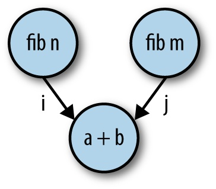
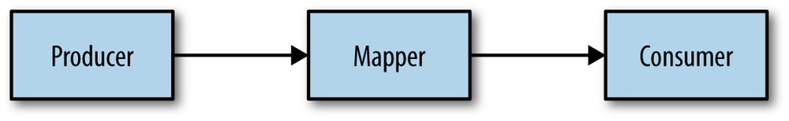
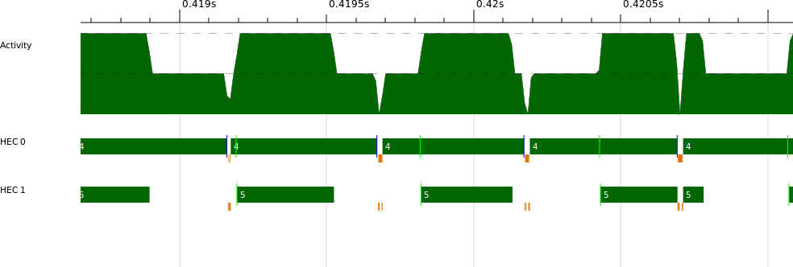
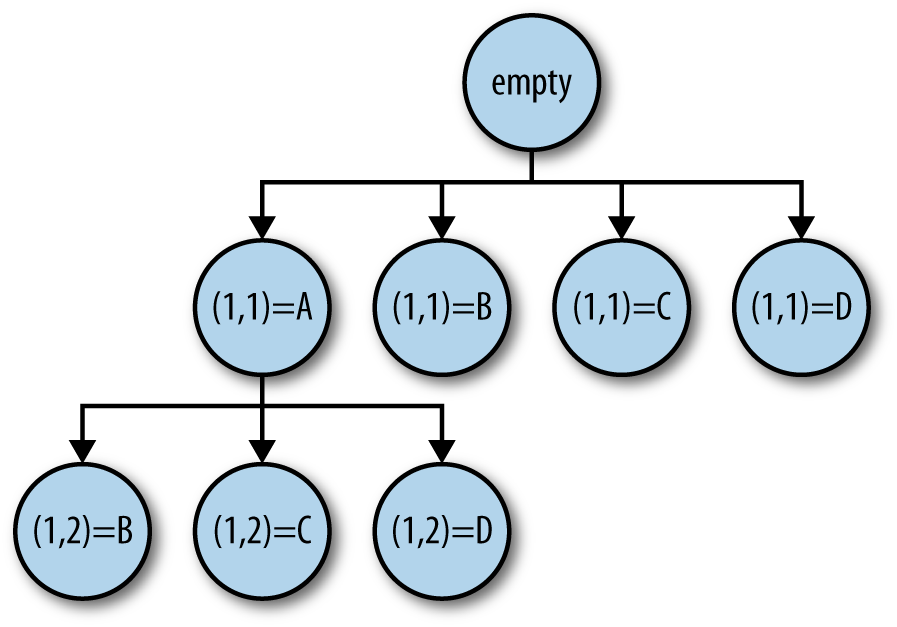
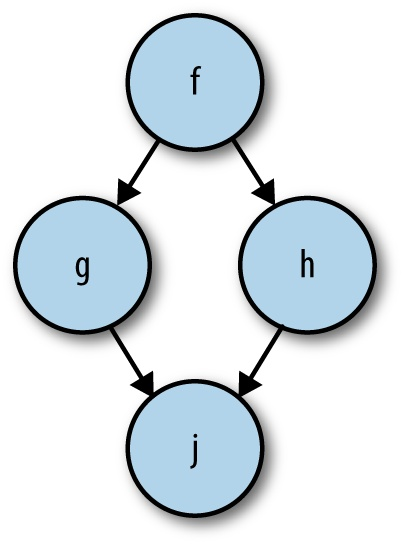

## Chapter 4. Dataflow Parallelism: The Par Monad

In the previous two chapters, we looked at the `Eval` monad and Strategies, which work in conjunction with lazy evaluation to express parallelism. A Strategy consumes a lazy data structure and evaluates parts of it in parallel. This model has some advantages: it allows the decoupling of the algorithm from the parallelism, and it allows parallel evaluation strategies to be built compositionally. But Strategies and `Eval` are not always the most convenient or effective way to express parallelism. We might not want to build a lazy data structure, for example. Lazy evaluation brings the nice modularity properties that we get with Strategies, but on the flip side, lazy evaluation can make it tricky to understand and diagnose performance.

In this chapter, we’ll explore another parallel programming model, the `Par` monad, with a different set of tradeoffs. The goal of the `Par` monad is to be more explicit about granularity and data dependencies, and to avoid the reliance on lazy evaluation, but without sacrificing the determinism that we value for parallel programming. In this programming model, the programmer has to give more detail but in return gains more control. The `Par` monad has some other interesting benefits; for example, it is implemented entirely as a Haskell library and the implementation can be readily modified to accommodate alternative scheduling strategies.

The interface is based around a monad called, unsurprisingly, `Par`:

```
newtype Par a
instance Applicative Par
instance Monad Par

runPar :: Par a -> a
```

A computation in the `Par` monad can be run using `runPar` to produce a pure result. The purpose of `Par` is to introduce parallelism, so we need a way to create parallel tasks:

```
fork :: Par () -> Par ()
```

The `Par` computation passed as the argument to `fork` (the “child”) is executed in parallel with the caller of `fork` (the “parent”). But `fork` doesn’t return anything to the parent, so you might be wondering how we get the result back if we start a parallel computation with `fork`. Values can be passed between `Par` computations using the `IVar` type^(\[11\]) and its operations:

```
data IVar a  -- instance Eq

new :: Par (IVar a)
put :: NFData a => IVar a -> a -> Par ()
get :: IVar a -> Par a
```

Think of an `IVar` as a box that starts empty. The `put` operation stores a value in the box, and `get` reads the value. If the `get` operation finds the box empty, then it waits until the box is filled by a `put`. So an `IVar` lets you communicate values between parallel `Par` computations, because you can `put` a value in the box in one place and `get` it in another.

Once filled, the box stays full; the `get` operation doesn’t remove the value from the box. It is an error to call `put` more than once on the same `IVar`.

The `IVar` type is a relative of the `MVar` type that we shall see later in the context of Concurrent Haskell (Communication: MVars), the main difference being that an `IVar` can be written only once. An `IVar` is also like a *future* or *promise*, concepts that may be familiar to you from other parallel or concurrent languages.

### Caution

There is nothing in the types to stop you from returning an `IVar` from `runPar` and passing it to another call of `runPar`. This is a Very Bad Idea; don’t do it. The implementation of the `Par` monad assumes that `IVar`s are created and used within the same `runPar`, and breaking this assumption could lead to a runtime error, deadlock, or worse.

The library could prevent you from doing this using qualified types in the same way that the `ST` monad prevents you from returning an `STRef` from `runST`. This is planned for a future version.

Together, `fork` and `IVar`s allow the construction of *dataflow* networks. Let’s see how that works with a few simple examples.

We’ll start in the same way we did in Chapter 2: write some code to perform two independent computations in parallel. As before, I’m going to use the `fib` function to simulate some work we want to do:

*parmonad.hs*

```
    runPar $ do
      i <- new                          -- ①
      j <- new                          -- ②
      fork (put i (fib n))              -- ③
      fork (put j (fib m))              -- ④
      a <- get i                        -- ⑤
      b <- get j                        -- ⑥
      return (a+b)                      -- ⑦
```

① ②  
Creates two new `IVar`s to hold the results, `i` and `j`.

③ ④  
`fork` two independent `Par` computations. The first puts the value of `fib n` into the `IVar` `i`, and the second puts the value of `fib m` into the `IVar` `j`.

⑤ ⑥  
The parent of the two `fork`s calls `get` to wait for the results from `i` and `j`.

⑦  
Finally, add the results and return.

When run, this program evaluates `fib n` and `fib m` in parallel. To try it yourself, compile *parmonad.hs* and run it passing two values for `n` and `m`, for example:

```
$ ./parmonad 34 35 +RTS -N2
```

The pattern in this program is represented graphically in Figure 4-1.



Figure 4-1. Simple Par example

The diagram makes it clear that what we are creating is a *dataflow graph*: that is, a graph in which the nodes (`fib n`, etc.) contain the computation and data flows down the edges (`i` and `j`). To be concrete, each `fork` in the program creates a node, each `new` creates an edge, and `get` and `put` connect the edges to the nodes.

From the diagram, we can see that the two nodes containing `fib n` and `fib m` are independent of each other, and that is why they can be computed in parallel, which is exactly what the `monad-par` library will do. However, the dataflow graph doesn’t exist in any explicit form at runtime; the library works by keeping track of all the computations that can currently be performed (a *work pool*), and dividing those amongst the available processors using an appropriate scheduling strategy. The dataflow graph is just a way to visualize and understand the structure of the parallelism. Unfortunately, right now there’s no way to generate a visual representation of the dataflow graph from some `Par` monad code, but hopefully in the future someone will write a tool to do that.

Using dataflow to express parallelism is quite an old idea; there were people experimenting with custom hardware architectures designed around dataflow back in the 1970s and 1980s. In contrast to those designs that were focused on exploiting very fine-grained parallelism automatically, here we are using dataflow as an explicit parallel programming model. But we are using dataflow here for the same reasons that it was attractive back then: instead of saying what is to be done in parallel, we only describe the data dependencies, thereby exposing all the implicit parallelism to be exploited.

While the `Par` monad is particularly suited to expressing dataflow networks, it can also express other common patterns. For example, we can build an equivalent of the `parMap` combinator that we saw earlier in Chapter 2. To make it easier to define `parMap`, let’s first build a simple abstraction for a parallel computation that returns a result:

```
spawn :: NFData a => Par a -> Par (IVar a)
spawn p = do
  i <- new
  fork (do x <- p; put i x)
  return i
```

The `spawn` function forks a computation in parallel and returns an `IVar` that can be used to wait for the result. For convenience, `spawn` is already provided by `Control``.Monad.Par`.

Parallel map consists of calling `spawn` to apply the function to each element of the list and then waiting for all the results:

```
parMapM :: NFData b => (a -> Par b) -> [a] -> Par [b]
parMapM f as = do
  ibs <- mapM (spawn . f) as
  mapM get ibs
```

(`parMapM` is also provided by `Control.Monad.Par`, albeit in a more generalized form than the version shown here.)

Note that the function argument, `f`, returns its result in the `Par` monad; this means that `f` itself can create further parallelism using `fork` and the other `Par` operations. When the function argument of a map is monadic, convention is to add the `M` suffix to the function name, hence `parMapM`.

It is straightforward to define a variant of `parMapM` that takes a non-monadic function instead, by inserting a `return`:

```
parMap :: NFData b => (a -> b) -> [a] -> Par [b]
parMap f as = do
  ibs <- mapM (spawn . return . f) as
  mapM get ibs
```

One other thing to note here is that, unlike the `parMap` we saw in Chapter 2, `parMapM` and `parMap` wait for all the results before returning. Depending on the context, this may or may not be the most useful behavior. If you don’t want to wait for the results, then you could always just use `mapM (spawn . f)`, which returns a list of `IVar`s.

Strictness of put

The `put` function calls `deepseq` on the value it puts in the `IVar`, which is why its type has an `NFData` constraint. This is a deliberate design choice; in the `Par` monad, we want the work to happen where we expect it to, so we rule out the possibility that an unevaluated expression is transferred via an `IVar`.

This means that `put` causes a traversal of the value stored in the `IVar`, which can be expensive if the value is a large data structure. For this reason, there’s a backdoor to use if you know what you’re doing:

```
put_ :: IVar a -> a -> Par ()
```

The `put_` operation evaluates the value to WHNF only. Replacing `put` with `put_` can save some time if you know that the argument is already fully evaluated.

## Example: Shortest Paths in a Graph

The Floyd-Warshall algorithm finds the lengths of the shortest paths between all pairs of nodes in a weighted directed graph. The algorithm is quite simple and can be expressed as a function over three vertices. Assuming vertices are numbered from one, and we have a function `weight g i j` that gives the weight of the edge from `i` to `j` in graph `g`, the algorithm is described by this pseudocode:

```
shortestPath :: Graph -> Vertex -> Vertex -> Vertex -> Weight
shortestPath g i j 0 = weight g i j
shortestPath g i j k = min (shortestPath g i j (k-1))
                           (shortestPath g i k (k-1) + shortestPath g k j (k-1))
```

You can think of the algorithm intuitively this way: `shortestPath g i j k` gives the length of the shortest path from `i` to `j`, passing through vertices up to `k` only. At `k == 0`, the paths between each pair of vertices consists of the direct edges only. For a non-zero `k`, there are two cases: either the shortest path from `i` to `j` passes through `k`, or it does not. The shortest path passing through `k` is given by the sum of the shortest path from `i` to `k` and from `k` to `j`. Then the shortest path from `i` to `j` is the minimum of the two choices, either passing through `k` or not.

We wouldn’t want to implement the algorithm like this directly, because it requires an exponential number of recursive calls. This is a classic example of a dynamic programming problem: rather than recursing top-down, we can build the solution bottom-up, so that earlier results can be used when computing later ones. In this case, we want to start by computing the shortest paths between all pairs of nodes for `k == 0`, then for `k == 1`, and so on until `k` reaches the maximum vertex. Each step is *O*(*n*²) in the vertices, so the whole algorithm is *O*(*n*³).

The algorithm is often run over an adjacency matrix, which is a very efficient representation of a dense graph. But here we’re going to assume a sparse graph (most pairs of vertices do not have an edge between them), and use a representation more suitable for this case:

*fwsparse/SparseGraph.hs*

```
type Vertex = Int
type Weight = Int

type Graph = IntMap (IntMap Weight)

weight :: Graph -> Vertex -> Vertex -> Maybe Weight
weight g i j = do
  jmap <- Map.lookup i g
  Map.lookup j jmap
```

The graph is essentially a mapping from pairs of nodes to weights, but it is represented more efficiently as a two-layer map. For example, to find the edge between `i` and `j`, we look up `i` in the outer map, yielding another map in which we look up `j` to find the weight. The function `weight` embodies this pair of lookups using the `Maybe` monad. If there is no edge between the two vertices, then `weight` returns `Nothing`.

Here is the sequential implementation of the shortest path algorithm:

*fwsparse/fwsparse.hs*

```
shortestPaths :: [Vertex] -> Graph -> Graph
shortestPaths vs g = foldl' update g vs            -- ①
 where
  update g k = Map.mapWithKey shortmap g           -- ②
   where
     shortmap :: Vertex -> IntMap Weight -> IntMap Weight
     shortmap i jmap = foldr shortest Map.empty vs -- ③
        where shortest j m =
                case (old,new) of                  -- ④
                   (Nothing, Nothing) -> m
                   (Nothing, Just w ) -> Map.insert j w m
                   (Just w,  Nothing) -> Map.insert j w m
                   (Just w1, Just w2) -> Map.insert j (min w1 w2) m
                where
                  old = Map.lookup j jmap          -- ⑤
                  new = do w1 <- weight g i k      -- ⑥
                           w2 <- weight g k j
                           return (w1+w2)
```

`shortestPaths` takes a list of vertices in addition to the graph; we could have derived this from the graph, but it’s slightly more convenient to pass it in. The result is also a `Graph`, but instead of containing the weights of the edges between vertices, it contains the lengths of the shortest paths between vertices. For simplicity, we’re not returning the shortest paths themselves, although this can be added without affecting the asymptotic time or space complexity.

①  
The algorithm as a whole is a left-fold over the list of vertices; this corresponds to iterating over values of `k` in the pseudocode description shown earlier. At each stage we add a new vertex to the set of vertices that can be used to construct paths, until at the end we have paths that can use all the vertices. Note that we use the strict left-fold, `foldl'`, to ensure that we’re evaluating the graph at every step and not building up a chain of thunks (we’re also using a strict `IntMap` to avoid thunks building up inside the `Graph`; this turns out to be vital for avoiding a space leak).

②  
The `update` function computes each step by mapping the function `shortmap` over the outer `IntMap` in the graph. There’s no need to map over the whole list of vertices because we know that any vertex that does not have an entry in the outer map cannot have a path to any other vertex (although it might have *incoming* paths).

③  
`shortmap` takes `i`, the current vertex, and `jmap`, the mapping of shortest paths from `i`. This function *does* need to consider every vertex in the graph as a possible destination because there may be vertices that we can reach from `i` via `k`, but which do not currently have an entry in `jmap`. So here we’re building up a new `jmap` by folding over the list of vertices, `vs`.

⑤  
For a given `j`, look up the current shortest path from `i` to `j`, and call it `old`.

⑥  
Look up the shortest path from `i` to `j` via `k` (if one exists), and call it `new`.

④  
Find the minimum of `old` and `new`, and insert it into the new mapping. Naturally, one path is the winner if the other path does not exist.

The algorithm is a nest of three loops. The outer loop is a left-fold with a data dependency between iterations, so it cannot be parallelized (as a side note, folds can be parallelized only when the operation being folded is associative, and then the linear fold can be turned into a tree). The next loop, however, is a map:

```
  update g k = Map.mapWithKey shortmap g
```

As we know, maps parallelize nicely. Will this give the right granularity? The map is over the outer `IntMap` of the `Graph`, so there will be as many tasks as there are vertices without edges. There will typically be at least hundreds of edges in the graph, so there are clearly enough separate work items to keep even tens of cores busy. Furthermore, each task is an *O*(*n*) loop over the list of vertices, so we are unlikely to have problems with the granularity being too fine.

Let’s consider how to add parallelism here. It’s not an ordinary `map`—we’re using the `mapWithKey` function provided by `Data.IntMap` to map directly over the `IntMap`. We could turn the `IntMap` into a list, run a standard `parMap` over that, and then turn it back into an `IntMap`, but the conversion to and from a list would add some overhead. Fortunately, the `IntMap` library provides a way to traverse an `IntMap` in a monad:

```
traverseWithKey :: Applicative t
                => (Key -> a -> t b)
                -> IntMap a
                -> t (IntMap b)
```

Don’t worry if you’re not familiar with the `Applicative` type class; most of the time, you can read `Applicative` as `Monad` and you’ll be fine. All the standard `Monad` types are also `Applicative`, and in general any `Monad` can be made into an `Applicative` easily.^(\[12\])

So `traverseWithKey` essentially maps a monadic function over the `IntMap`, for any monad `t`. The monadic function is passed not only the element `a`, but also the `Key`, which is just what we need here: `shortmap` needs both the key (the source vertex) and the element (the map from destination vertices to weights).

So we want to behave like `parMap`, except that we’ll use `traverseWithKey` to map over the `IntMap`. Here is the parallel code for `update`:

```
  update g k = runPar $ do
    m <- Map.traverseWithKey (\i jmap -> spawn (return (shortmap i jmap))) g
    traverse get m
```

We’ve put `runPar` inside `update`; the rest of the `shortestPaths` function will remain as before, and all the parallelism is confined to `update`. We’re calling `traverseWithKey` to `spawn` a call to `shortmap` for each of the elements of the `IntMap`. The result of this call will be an `IntMap (IVar (IntMap Weight))`; that is, there’s an `IVar` in place of each element. To get the new `Graph`, we need to call `get` on each of these `IVar`s and produce a new `Graph` with all the elements, which is what the final call to `traverse` does. The `traverse` function is from the `Traversable` class; for our purposes here, it is like `traverseWithKey` but doesn’t pass the `Key` to the function.

Let’s take a look at the speedup we get from this code. Running the original program on a random graph with 800 edges over 1,000 vertices:

```
$ ./fwsparse 1000 800 +RTS -s
...
  Total   time    4.16s  (  4.17s elapsed)
```

And our parallel version, first on one core:

```
$ ./fwsparse1 1000 800 +RTS -s
...
  Total   time    4.54s  (  4.57s elapsed)
```

Adding the parallel traversal has cost us about 10% overhead; this is quite a lot, and if we were optimizing this program for real, we would want to look into whether that overhead can be reduced. Perhaps it is caused by doing one `runPar` per iteration (a `runPar` is quite expensive) or perhaps `traverseWithKey` is expensive.

The speedup on four cores is fairly respectable:

```
$ ./fwsparse1 1000 800 +RTS -s -N4
...
  Total   time    5.27s  (  1.38s elapsed)
```

This gives us a speedup of 3.02 over the sequential version. To improve this speedup further, the first target would be to reduce the overhead of the parallel version.

## Pipeline Parallelism

Next, we’re going to look at a different way to expose parallelism: *pipeline* parallelism. Back in Parallelizing Lazy Streams with parBuffer, we saw how to use parallelism in a program that consumed and produced input lazily, although in that case we used *data parallelism*, which is parallelism between the stream elements. Here, we’re going to show how to make use of parallelism between the stages of a pipeline. For example, we might have a pipeline that looks like this:



Each stage of the pipeline is doing some computation on the stream elements and maintaining state as it does so. When a pipeline stage maintains some state, we can’t exploit parallelism between the stream elements as we did in Parallelizing Lazy Streams with parBuffer. Instead, we would like each of the pipeline stages to run on a separate core, with the data streaming between them. The `Par` monad, together with the techniques in this section, allows us to do that.

The basic idea is as follows: instead of representing the stream as a lazy list, use an explicit representation of a stream:

```
data IList a
  = Nil
  | Cons a (IVar (IList a))

type Stream a = IVar (IList a)
```

An `IList` is a list with an `IVar` as the tail. This allows the producer to generate the list incrementally, while a consumer runs in parallel, grabbing elements as they are produced. A `Stream` is an `IVar` containing an `IList`.

We’ll need a few functions for working with `Stream`s. First, we need a generic producer that turns a lazy list into a `Stream`:

```
streamFromList :: NFData a => [a] -> Par (Stream a)
streamFromList xs = do
  var <- new                            -- ①
  fork $ loop xs var                    -- ②
  return var                            -- ③
 where
  loop [] var = put var Nil             -- ④
  loop (x:xs) var = do                  -- ⑤
    tail <- new                         -- ⑥
    put var (Cons x tail)               -- ⑦
    loop xs tail                        -- ⑧
```

①  
Creates the `IVar` that will be the `Stream` itself.

②  
`fork`s the loop that will create the `Stream` contents.

③  
Returns the `Stream` to the caller. The `Stream` is now being created in parallel.

④  
This `loop` traverses the input list, producing the `IList` as it goes. The first argument is the list, and the second argument is the `IVar` into which to store the `IList`. In the case of an empty list, we simply store an empty `IList` into the `IVar`.

⑤  
In the case of a non-empty list,

⑥  
we create a new `IVar` for the tail,

⑦  
and store a `Cons` cell representing this element into the current `IVar`. Note that this fully evaluates the list element `x`, because `put` is strict.

⑧  
Recurse to create the rest of the stream.

Next, we’ll write a consumer of `Stream`s, `streamFold`:

```
streamFold :: (a -> b -> a) -> a -> Stream b -> Par a
streamFold fn !acc instrm = do
  ilst <- get instrm
  case ilst of
    Nil      -> return acc
    Cons h t -> streamFold fn (fn acc h) t
```

This is a left-fold over the `Stream` and is defined exactly as you would expect: recursing through the `IList` and accumulating the result until the end of the `Stream` is reached. If the `streamFold` consumes all the available stream elements and catches up with the producer, it will block in the `get` call waiting for the next element.

The final operation we’ll need is a map over `Stream`s. This is both a producer and a consumer:

```
streamMap :: NFData b => (a -> b) -> Stream a -> Par (Stream b)
streamMap fn instrm = do
  outstrm <- new
  fork $ loop instrm outstrm
  return outstrm
 where
  loop instrm outstrm = do
    ilst <- get instrm
    case ilst of
      Nil -> put outstrm Nil
      Cons h t -> do
        newtl <- new
        put outstrm (Cons (fn h) newtl)
        loop t newtl
```

There’s nothing particularly surprising here—the pattern is a combination of the producer we saw in `streamFromList` and the consumer in `streamFold`.

To demonstrate that this works, I’ll construct an example using the RSA encryption code that we saw earlier in Parallelizing Lazy Streams with parBuffer. However, this time, in order to construct a nontrivial pipeline, I’ll compose together encryption and decryption; encryption will produce a stream that decryption consumes (admittedly this isn’t a realistic use case, but it does demonstrate pipeline parallelism).

Previously, `encrypt` and `decrypt` consumed and produced lazy `ByteStrings`. Now they work over `Stream ByteString` in the `Par` monad, and are expressed as a `streamMap`:

*rsa-pipeline.hs*

```
encrypt :: Integer -> Integer -> Stream ByteString -> Par (Stream ByteString)
encrypt n e s = streamMap (B.pack . show . power e n . code) s

decrypt :: Integer -> Integer -> Stream ByteString -> Par (Stream ByteString)
decrypt n d s = streamMap (B.pack . decode . power d n . integer) s
```

The following function composes these together and also adds a `streamFromList` to create the input `Stream` and a `streamFold` to consume the result:

```
pipeline :: Integer -> Integer -> Integer -> ByteString -> ByteString
pipeline n e d b = runPar $ do
  s0 <- streamFromList (chunk (size n) b)
  s1 <- encrypt n e s0
  s2 <- decrypt n d s1
  xs <- streamFold (\x y -> (y : x)) [] s2
  return (B.unlines (reverse xs))
```

Note that the `streamFold` produces a list of `ByteString`s at the end, to which we apply `unlines`, and then the caller prints out the result.

This works rather nicely: I see a speedup of 1.45 running the program over a large text file. What’s the maximum speedup we can achieve here? Well, there are four independent pipeline stages: `streamFromList`, two `streamMap`s, and a `streamFold`, although only the two maps really involve any significant computation.^(\[13\]) So the best we can hope for is to reduce the running time to the longer of the two maps. We can verify, by timing the *rsa.hs* program, that encryption takes approximately twice as long as decryption, which means that we can expect a speedup of about 1.5, which is close to the sample run here.

The ThreadScope profile of this program is quite revealing. Figure 4-2 is a typical section from it.



Figure 4-2. ThreadScope profile of rsa-pipeline

HEC 0 appears to be doing the encryption, and HEC 1 the decryption. Decryption is faster than encryption, so HEC 1 repeatedly gets stuck waiting for the next element of the encrypted stream; this accounts for the gaps in execution we see on HEC 1.

One interesting thing to note about this profile is that the pipeline stages tend to stay on the same core. This is because each pipeline stage is a single `fork` (a single node in the dataflow graph) and the `Par` scheduler will run a task to completion on the current core before starting on the next task. Keeping each pipeline stage running on a single core is good for locality.

### Rate-Limiting the Producer

In our previous example, the consumer was faster than the producer. If, instead, the producer had been faster than the consumer, then there would be nothing to stop the producer from getting a long way ahead of the consumer and building up a long `IList` chain in memory. This is undesirable, because large heap data structures incur overhead due to garbage collection, so we might want to rate-limit the producer to avoid it getting too far ahead. There’s a trick that adds some automatic rate-limiting to the stream API. It entails adding another constructor to the `IList` type:

```
data IList a
  = Nil
  | Cons a (IVar (IList a))
  | Fork (Par ()) (IList a)  -- ①
```

①  
The idea is that the creator of the `IList` produces a fixed amount of the list and inserts a `Fork` constructor containing another `Par` computation that will produce more of the list. The consumer, upon finding a `Fork`, calls `fork` to start production of the next chunk of the list. The `Fork` doesn’t have to be at the end; for example, the list might be produced in chunks of 200 elements, with the first `Fork` being at the 100 element mark, and every 200 elements thereafter. This would mean that at any time there would be at least 100 and up to 300 elements waiting to be consumed.

I’ll leave the rest of the implementation of this idea as an exercise for you to try on your own. See if you can modify `streamFromList`, `streamFold`, and `streamMap` to incorporate the `Fork` constructor. The chunk size and fork distance should be parameters to the producers (`streamFromList` and `streamMap`).

### Limitations of Pipeline Parallelism

Pipeline parallelism is limited in that we can expose only as much parallelism as we have pipeline stages. It therefore tends to be less effective than data parallelism, which can expose a lot more parallelism. Still, pipeline parallelism is a useful tool to have in your toolbox.

The earlier example also exposes a limitation of the `Par` monad; we cannot produce a lazy stream from `runPar` itself. The call to `streamFold` accumulates the entire list before it returns. You can’t return an `IList` from `runPar` and consume it in another `runPar`, because returning an `IVar` from `runPar` is illegal and will probably result in an error. Besides, `runPar` always runs all the forked `Par` computations to completion before returning, because this is necessary to ensure deterministic results. There is an `IO` version of the `Par` monad that we’ll encounter in The ParIO monad, and you could use that for lazy streaming, although unlike the pure `Par` monad, determinism is not guaranteed when using the `IO` version.

## Example: A Conference Timetable

In this section, we’ll look at a program that finds a valid timetable for a conference.^(\[14\]) The outline of the problem is this:

- The conference runs *T* parallel tracks, and each track has the same number of talk slots, *S*; hence there are *T \* S* talk slots in total. For simplicity, we assume that the talk slots all start and finish at the same time across the tracks.
- There are at most *T \* S* talks to assign to tracks and slots (if there are fewer talks than slots, we can make up the difference with dummy talks that represent empty slots).
- There are a number of attendees who have each expressed a preference for some talks they would like to see.
- The goal is to assign talks to slots and tracks so that the attendees can attend all the talks they want to see; that is, we never schedule two talks that an attendee wanted to see on two different tracks in the same slot.

Here’s a small example. Suppose we have two tracks and two slots, and four talks named *A*, *B*, *C*, and *D*. There are four attendees—*P*, *Q*, *R*, and *S*—and each wants to go to two talks:

- *P* wants to see *A* and *B*
- *Q* wants to see *B* and *C*
- *R* wants to see *C* and *D*
- *S* wants to see *A* and *D*

One solution is:

| Track | Slot 1 | Slot 2 |
|-------|--------|--------|
| 1     | B      | C      |
| 2     | D      | A      |

There are other solutions, but they are symmetrical with this one (interchange either the tracks or the slots or both).

Timetabling is an instance of a *constraint satisfaction* problem: we’re finding assignments for variables (talk slots) that satisfy the constraints (attendees’ preferences). The problem requires an exhaustive search, but we can be more clever than just generating all the possible assignments and testing each one. We can fill in the timetable incrementally: assign a talk to the first slot of the first track, then find a talk for the first slot of the second track that doesn’t introduce a conflict, and so on until we’ve filled up the first slot of all the tracks. Then we proceed to the second slot and so on until we’ve filled the whole timetable. This incremental approach prunes a lot of the search space because we avoid searching for solutions when the partial grid already contains a conflict.^(\[15\])

If at any point we cannot fill a slot without causing a conflict, we have to *backtrack* to the previous slot and choose a different talk instead. If we exhaust all the possibilities at the previous slot, then we have to backtrack further. So, in general, the search pattern is a tree. A fragment of the search tree for the example above is shown in Figure 4-3.



Figure 4-3. Tree-shaped search pattern for the timetabling problem

If we are interested in *all* the solutions (perhaps because we want to pick the best one according to some criteria), we have to explore the whole tree.

Algorithms that have this tree-shaped structure are often called *divide and conquer*. A divide-and-conquer algorithm is one in which the problem is recursively split into smaller subproblems that are solved separately, then combined to form the whole solution. In this case, starting from the empty timetable, we’re dividing the solution space according to which talk goes in the first slot, and then by which talk goes in the second slot, and so on recursively until we fill the timetable. Divide-and-conquer algorithms have some nice properties, not least of which is that they parallelize well because the branches are independent of one another.

So let’s look at how to code up a solution in Haskell. First, we need a type to represent talks; for simplicity, I’ll just number them:

*timetable.hs*

```
newtype Talk = Talk Int
  deriving (Eq,Ord)

instance NFData Talk

instance Show Talk where
  show (Talk t) = show t
```

An attendee is represented by her name and the talks she wants to attend:

```
data Person = Person
  { name  :: String
  , talks :: [Talk]
  }
  deriving (Show)
```

And the complete timetable is represented as a list of lists of `Talk`. Each list represents a single slot. So if there are four tracks and three slots, for example, the timetable will be three lists of four elements each.

```
type TimeTable = [[Talk]]
```

Here’s the top-level function: it takes a list of `Person`, a list of `Talk`, the number of tracks and slots, and returns a list of `TimeTable`:

```
timetable :: [Person] -> [Talk] -> Int -> Int -> [TimeTable]
timetable people allTalks maxTrack maxSlot =
```

First, I’m going to cache some information about which talks clash with each other. That is, for each talk, we want to know which other talks cannot be scheduled in the same slot, because one or more attendees want to see both of them. This information is collected in a `Map` called `clashes`, which is built from the `[Person]` passed to `timetable`:

```
  clashes :: Map Talk [Talk]
  clashes = Map.fromListWith union
     [ (t, ts)
     | s <- people
     , (t, ts) <- selects (talks s) ]
```

The auxiliary function `selects` takes a list and returns a list of pairs, one pair for each item in the input list. The first element of each pair is an element, and the second is the original list with that element removed. For efficient implementation, `selects` does not preserve the order of the elements. Example output:

```
*Main> selects [1..3]
[(1,[2,3]),(2,[1,3]),(3,[2,1])]
```

Now we can write the algorithm itself. Remember that the algorithm is recursive: at each stage, we start with a partially filled-in timetable, and we want to determine all the possible ways of filling in the next slot and recursively generate all the solutions from those. The recursive function is called `generate`. Here is its type:

```
  generate :: Int          -- current slot number
           -> Int          -- current track number
           -> [[Talk]]     -- slots allocated so far
           -> [Talk]       -- talks in this slot
           -> [Talk]       -- talks that can be allocated in this slot
           -> [Talk]       -- all talks remaining to be allocated
           -> [TimeTable]  -- all possible solutions
```

The first two arguments tell us where in the timetable we are, and the second two arguments are the partially complete timetable. In fact, we’re filling in the slots in reverse order, but the slots are independent of one another so it makes no difference. The last two arguments keep track of which talks remain to be assigned: the first is the list of talks that we can put in the current slot (taking into account clashes with other talks already in this slot), and the second is the complete list of talks still left to assign.

The implementation of `generate` looks a little dense, but I’ll walk through it step by step:

```
  generate slotNo trackNo slots slot slotTalks talks
     | slotNo == maxSlot   = [slots]                                    -- ①
     | trackNo == maxTrack =
         generate (slotNo+1) 0 (slot:slots) [] talks talks              -- ②
     | otherwise = concat                                               -- ③
         [ generate slotNo (trackNo+1) slots (t:slot) slotTalks' talks' -- ④
         | (t, ts) <- selects slotTalks                                 -- ⑤
         , let clashesWithT = Map.findWithDefault [] t clashes          -- ⑥
         , let slotTalks' = filter (`notElem` clashesWithT) ts          -- ⑦
         , let talks' = filter (/= t) talks                             -- ⑧
         ]
```

①  
If we’ve filled in all the slots, we’re done; the current list of slots is a solution.

②  
If we’ve filled in all the tracks for the current slot, move on to the next slot.

③  
Otherwise, we’re going to fill in the next talk in this slot. The result is the concatenation of all the solutions arising from the possibilities for filling in that talk.

⑤  
Here we select all the possibilities for the next talk from `slotTalks`, binding the next talk to `t`.

⑥  
Decide which other talks clash with `t`.

⑦  
Remove from `slotTalks` the talks that clash with `t`.

⑧  
Remove `t` from `talks`.

④  
For each `t`, recursively call `generate` with the new partial solution.

Finally, we need to call `generate` with the empty timetable to start things off:

```
  generate 0 0 [] [] allTalks allTalks
```

The program is equipped with some machinery to generate test data, so we can see how long it takes with a variety of inputs. Unfortunately, it turns out to be hard to find some parameters that don’t either take forever or complete instantaneously, but here’s one set:

```
$ ./timetable 4 3 11 10 3 +RTS -s
```

The command-line arguments set the parameters for the search: 4 slots, 3 tracks, 11 total talks, and 10 participants who each want to go to 3 talks. This takes about 1 second to calculate the number of possible timetables (about 31,000).

### Adding Parallelism

This code is already quite involved, and if we try to parallelize it directly, it is likely to get more complicated. We’d prefer to separate the parallelism as far as possible from the algorithm code. With Strategies (Chapter 3), we did this by generating a lazy data structure. But this application is an example where generating a lazy data structure doesn’t work very well, because we would have to return the entire search tree as a data structure.

Instead, I want to demonstrate another technique for separating the parallelism from the algorithm: building a *parallel skeleton*. A parallel skeleton is nothing more than a higher-order function that abstracts a pattern of computation. We’ve already seen one parallel skeleton: `parMap`, the function that describes data parallelism, abstracted over the function to apply in parallel. Here we need a different skeleton, which I’ll call the *search* skeleton (although it’s a variant of a more general divide-and-conquer skeleton).

I’ll start by refactoring the algorithm into a skeleton and its instantiation, and then add parallelism to the skeleton. The type of the `search` skeleton is as follows:

*timetable1.hs*

```
search :: ( partial -> Maybe solution )   -- ①
       -> ( partial -> [ partial ] )      -- ②
       -> partial                         -- ③
       -> [solution]                      -- ④
```

The `search` function is polymorphic in two types: `partial` is the type of partial solutions, and `solution` is the type of complete solutions. We’ll see how these are instantiated in our example shortly.

①  
The first argument to `search` is a function that tells whether a particular `partial` solution corresponds to a complete `solution`, and if so, what the solution is.

②  
The second argument takes a `partial` solution and refines it to a list of further `partial` solutions. It is expected that this process doesn’t continue forever!

③  
To get things started, we need an initial, empty value of type `partial`.

④  
The result is a list of `solution`s.

The definition of `search` is quite straightforward. It’s one of those functions that is almost impossible to get wrong, because the type describes exactly what it does:

```
search finished refine emptysoln = generate emptysoln
  where
    generate partial
       | Just soln <- finished partial = [soln]
       | otherwise  = concat (map generate (refine partial))
```

Now to refactor `timetable` to use `search`. The basic idea is that the arguments to `generate` constitute the partial solution, so we’ll just package them up:

```
type Partial = (Int, Int, [[Talk]], [Talk], [Talk], [Talk])
```

The rest of the refactoring is mechanical, so I won’t describe it in detail. The result is:

```
timetable :: [Person] -> [Talk] -> Int -> Int -> [TimeTable]
timetable people allTalks maxTrack maxSlot =
  search finished refine emptysoln
 where
  emptysoln = (0, 0, [], [], allTalks, allTalks)

  finished (slotNo, trackNo, slots, slot, slotTalks, talks)
     | slotNo == maxSlot = Just slots
     | otherwise         = Nothing

  clashes :: Map Talk [Talk]
  clashes = Map.fromListWith union
     [ (t, ts)
     | s <- people
     , (t, ts) <- selects (talks s) ]

  refine (slotNo, trackNo, slots, slot, slotTalks, talks)
     | trackNo == maxTrack = [(slotNo+1, 0, slot:slots, [], talks, talks)]
     | otherwise =
         [ (slotNo, trackNo+1, slots, t:slot, slotTalks', talks')
         | (t, ts) <- selects slotTalks
         , let clashesWithT = Map.findWithDefault [] t clashes
         , let slotTalks' = filter (`notElem` clashesWithT) ts
         , let talks' = filter (/= t) talks
         ]
```

The algorithm works exactly as before. All we did was pull out the search pattern as a higher-order function and call it.

Now to parallelize the `search` skeleton. As you might expect, the basic idea is that at each stage, we’ll spawn off the recursive calls in parallel and then collect the results. Here’s how to express that using the `Par` monad:

*timetable2.hs*

```
parsearch :: NFData solution
      => ( partial -> Maybe solution )
      -> ( partial -> [ partial ] )
      -> partial
      -> [solution]

parsearch finished refine emptysoln
  = runPar $ generate emptysoln
  where
    generate partial
       | Just soln <- finished partial = return [soln]
       | otherwise  = do
           solnss <- parMapM generate (refine partial)
           return (concat solnss)
```

We’re using `parMapM` to call `generate` in parallel on the list of partial solutions returned by `refine`, and then concatenating the results. However, this doesn’t work out too well; on the parameter set we used before, it adds a factor of five overhead. The problem is that as we get near the leaves of the search tree, the granularity is too fine in relation to the overhead of spawning the calls in parallel.

So we need a way to make the granularity coarser. We can’t use chunking, because we don’t have a flat list here; we have a tree. For tree-shaped parallelism we need to use a different technique: a *depth threshold*. The basic idea is quite simple: spawn recursive calls in parallel down to a certain depth, and below that depth use the original sequential algorithm.

Our `parsearch` function needs an extra parameter, namely the depth to parallelize to:

*timetable3.hs*

```
parsearch :: NFData solution
      => Int
      -> ( partial -> Maybe solution )   -- finished?
      -> ( partial -> [ partial ] )      -- refine a solution
      -> partial                         -- initial solution
      -> [solution]

parsearch maxdepth finished refine emptysoln
  = runPar $ generate 0 emptysoln
  where
    generate d partial | d >= maxdepth               -- ①
       = return (search finished refine partial)
    generate d partial
       | Just soln <- finished partial = return [soln]
       | otherwise  = do
           solnss <- parMapM (generate (d+1)) (refine partial)
           return (concat solnss)
```

①  
The depth argument `d` increases by one each time we make a recursive call to `generate`. If it reaches the `maxdepth` passed as an argument to `parsearch`, then we call `search` (the sequential algorithm) to do the rest of the search below this point.

Using a depth of three in this case works reasonably well and gets us a speedup of about three on four cores relative to the original sequential version. Adding the skeleton unfortunately incurs some overhead, but in return it gains us some worthwhile modularity: it would have been difficult to add the depth threshold without first abstracting the skeleton.

Here are the main points to take away from this example:

- Tree-shaped (*divide and conquer*) computations parallelize well.
- You can abstract the parallel pattern as a *skeleton* using higher-order functions.
- To control the granularity in a tree-shaped computation, add a *depth threshold*, and use the sequential version of the algorithm below a certain depth.

## Example: A Parallel Type Inferencer

In this section, we will parallelize a type inference engine, such as you might find in a compiler for a functional language. The purpose of this example is to demonstrate two things: one, that parallelism can be readily applied to program analysis problems, and two, that the dataflow model works well even when the structure of the parallelism is entirely dependent on the input and cannot be predicted beforehand.

The outline of the problem is as follows: given a list of bindings of the form `x = e` for a variable `x` and expression `e`, infer the types for each of the variables. Expressions consist of integers, variables, application, lambda expressions, `let` expressions, and arithmetic operators (`+`, `-`, `*`, `/`).

We can test the type inference engine on a few simple examples. Load it in GHCi (from the directory *parinfer* in the sample code):

```
$ ghci parinfer.hs
```

The function `test` typechecks an expression. Simple arithmetic expressions have type `Int`:

```
*Main> test "1 + 2"
Int
```

We can use lambda expressions, `let` expressions, and higher-order functions, just like in Haskell:

```
*Main> test "\\x -> x"
a0 -> a0
*Main> test "\\x -> x + 1"
Int -> Int
*Main> test "\\g -> \\h -> g (h 3)"
(a2 -> a3) -> (Int -> a2) -> a3
```

(Note that in order to get the backslash character in a Haskell `String`, we need to use `"\\"`.)

When the type inferencer is run as a standalone program, it typechecks a file of bindings, and infers a type for each one. For simplicity, we assume the list of bindings is ordered and nonrecursive; any variable used in an expression has to be defined earlier in the list. Later bindings may also shadow earlier ones.

For example, consider the following set of bindings for which we want to infer types:

```
  f = ...
  g = ... f ...
  h = ... f ...
  j = ... g ... h ...
```

I’m using the notation "`... f ...`" to stand for an expression involving `f`. The specific expression isn’t important here, only that it mentions `f`.

We could proceed in a linear fashion through the list of bindings: first inferring the type for `f`, then the type for `g`, then the type for `h`, and so on. However, if we look at the dataflow graph for this set of bindings (Figure 4-4), we can see that there is some parallelism.



Figure 4-4. Flow of types between f, g, h, j

Clearly we can infer the types of `g` and `h` in parallel, once the type of `f` is known. When viewed this way, we can see that type inference is a natural fit for the dataflow model; we can consider each binding to be a node in the graph, and the edges of the graph carry inferred types from bindings to usage sites in the program.

Building a dataflow graph for the type inference problem allows parallelism to be automatically extracted from the type inference process. The actual amount of parallelism present depends entirely on the structure of the input program, however. An input program in which every binding depends on the previous one in the list would have no parallelism to extract. Fortunately, most programs aren’t like that—usually there is a decent amount of parallelism implicit in the dependency structure.

Note that we’re not necessarily exploiting *all* the available parallelism here. There might be parallelism available within the inference of individual bindings. However, to try to parallelize too deeply might cause granularity problems, and parallelizing the outer level is likely to gain the most reward.

The type inference engine that I’m using for this example is a rather ancient piece of code that I modified to add parallelism.^(\[16\]) The changes to add parallelism were quite modest.^(\[17\])

The types from the inference engine that we will need to work with are as follows:

```
type VarId = String -- Variables
data Term     -- Terms in the input program
data Env      -- Environment, mapping VarId to PolyType
data PolyType -- Polymorphic types
```

In programming language terminology, an environment is a mapping that assigns some meaning to the variables of an expression. A type inference engine uses an environment to assign types to variables; this is the purpose of the `Env` type. When we typecheck an expression, we must supply an `Env` that gives the types of the variables that the expression mentions. An `Env` is created using `makeEnv`:

```
makeEnv :: [(VarId,PolyType)] -> Env
```

To determine which variables we need to populate the `Env` with, we need a way to extract the free (unbound) variables of an expression; this is what the `freeVars` function does:

```
freeVars :: Term -> [VarId]
```

The underlying type inference engine for expressions takes a `Term` and an `Env` that supplies the types for the free variables of the `Term` and delivers a `PolyType`:

```
inferTopRhs :: Env -> Term -> PolyType
```

While the sequential part of the inference engine uses an `Env` that maps `VarId`s to `PolyType`s, the parallel part of the inference engine will use an environment that maps `VarId`s to `IVar PolyType`, so that we can `fork` the inference engine for a given binding, and then wait for its result later.^(\[18\]) The environment for the parallel type inferencer is called `TopEnv`:

```
type TopEnv = Map VarId (IVar PolyType)
```

All that remains is to write the top-level loop. We’ll do this in two stages. First, a function to infer the type of a single binding:

```
inferBind :: TopEnv -> (VarId,Term) -> Par TopEnv
inferBind topenv (x,u) = do
  vu <- new                                                     -- ①
  fork $ do                                                     -- ②
    let fu = Set.toList (freeVars u)                            -- ③
    tfu <- mapM (get . fromJust . flip Map.lookup topenv) fu    -- ④
    let aa = makeEnv (zip fu tfu)                               -- ⑤
    put vu (inferTopRhs aa u)                                   -- ⑥
  return (Map.insert x vu topenv)                               -- ⑦
```

①  
Create an `IVar`, `vu`, to hold the type of this binding.

②  
Fork the computation that does the type inference.

③  
The inputs to this type inference are the types of the variables mentioned in the expression `u`. Hence we call `freeVars` to get those variables.

④  
For each of the free variables, look up its `IVar` in the `topenv`, and then call `get` on it. Hence this step will wait until the types of all the free variables are available before proceeding.

⑤  
Build an `Env` from the free variables and their types.

⑥  
Infer the type of the expression `u`, and put the result in the `IVar` we created at the beginning.

⑦  
Back in the parent, return `topenv` extended with `x` mapped to the new `IVar` `vu`.

Next we use `inferBind` to define `inferTop`, which infers types for a list of bindings:

```
inferTop :: TopEnv -> [(VarId,Term)] -> Par [(VarId,PolyType)]
inferTop topenv0 binds = do
  topenv1 <- foldM inferBind topenv0 binds                          -- ①
  mapM (\(v,i) -> do t <- get i; return (v,t)) (Map.toList topenv1) -- ②
```

①  
Use `foldM` (from `Control.Monad`) to perform `inferBind` over each binding, accumulating a `TopEnv` that will contain a mapping for each of the variables.

②  
Wait for all the type inference to happen, and collect the results. Hence we turn the `TopEnv` back into a list and call `get` on all of the `IVar`s.

This parallel implementation works quite nicely. To demonstrate it, I’ve constructed a synthetic input for the type checker, a fragment of which is given below (the full version is in the file *parinfer/benchmark.in*).

```
id = \x->x ;

a = \f -> f id id ;
a = \f -> f a a ;
a = \f -> f a a ;
...
a = let f = a in \x -> x ;

b = \f -> f id id ;
b = \f -> f b b ;
b = \f -> f b b ;
...
b = let f = b in \x -> x ;

c = \f -> f id id ;
c = \f -> f c c ;
c = \f -> f c c ;
...
c = let f = c in \x -> x ;

d = \f -> f id id ;
d = \f -> f d d ;
d = \f -> f d d ;
...
d = let f = d in \x -> x ;
```

There are four sequences of bindings that can be inferred in parallel. The first sequence is the set of bindings for `a` (each successive binding for `a` shadows the previous one), then identical sequences named `b`, `c`, and `d`. Each binding in a sequence depends on the previous one, but the sequences are independent of one another. This means that our parallel typechecking algorithm should automatically infer types for the `a`, `b`, `c`, and `d` bindings in parallel, giving a maximum speedup of 4.

With one processor, the result should be something like this:

```
$ ./parinfer <benchmark.in +RTS -s
...
  Total   time    4.71s  (  4.72s elapsed)
```

The result with two processors represents a speedup of 1.96:

```
$ ./parinfer <benchmark.in +RTS -s -N2
...
  Total   time    4.79s  (  2.41s elapsed)
```

With three processors, the result is:

```
$ ./parinfer <benchmark.in +RTS -s -N3
...
  Total   time    4.92s  (  2.42s elapsed)
```

This is almost exactly the same as with two processors! But this is to be expected: there are four independent problems, so the best we can do is to overlap the first three and then run the final one. Thus the program will take the same amount of time as with two processors, where we could overlap two problems at a time. Adding the fourth processor allows all four problems to be overlapped, resulting in a speedup of 3.66:

```
$ ./parinfer <benchmark.in +RTS -s -N4
...
  Total   time    5.10s  (  1.29s elapsed)
```

## Using Different Schedulers

The `Par` monad is implemented as a library in Haskell, so aspects of its behavior can be changed without changing GHC or its runtime system. One way in which this is useful is in changing the scheduling strategy; certain scheduling strategies are better suited to certain patterns of execution.

The `monad-par` library comes with two schedulers: the “Trace” scheduler and the “Direct” scheduler, where the latter is the default. In general the Trace scheduler performs slightly worse than the Direct scheduler, but not always; it’s worth trying both with your code to see which gives the better results.

To choose one or the other, just import the appropriate module. For example, to use the Trace scheduler instead of the Direct scheduler:

```
import Control.Monad.Par.Scheds.Trace
   -- instead of Control.Monad.Par
```

Remember that you need to make this change in *all* the modules of your program that import `Control.Monad.Par`.

## The Par Monad Compared to Strategies

I’ve presented two different parallel programming models, each with advantages and disadvantages. In reality, though, both approaches are suitable for a wide range of tasks; most Parallel Haskell benchmarks achieve broadly similar results when coded with either Strategies or the `Par` monad. So which to choose is to some extent a matter of personal preference. However, there are a number of trade-offs that are worth bearing in mind, as these might tip the balance one way or the other for your code:

- As a general rule of thumb, if your algorithm naturally produces a lazy data structure, then writing a `Strategy` to evaluate it in parallel will probably work well. If not, then it can be more straightforward to use the `Par` monad to express the parallelism.
- The `runPar` function itself is relatively expensive, whereas `runEval` is free. So when using the `Par` monad, you should usually try to thread the `Par` monad around to all the places that need parallelism to avoid needing multiple `runPar` calls. If this is inconvenient, then `Eval` or Strategies might be a better choice. In particular, nested calls to `runPar` (where a `runPar` is evaluated during the course of executing another `Par` computation) usually give poor results.
- Strategies allow a separation between algorithm and parallelism, which can allow more reuse and a cleaner specification of parallelism. However, using a parallel skeleton works with both approaches.
- The `Par` monad has more overhead than the `Eval` monad. At the present time, `Eval` tends to perform better at finer granularities, due to the direct runtime system support for sparks. At larger granularities, `Par` and `Eval` perform approximately the same.
- The `Par` monad is implemented entirely in a Haskell library (the `monad-par` package), and is thus easily modified. There is a choice of scheduling strategies (see Using Different Schedulers).
- The `Eval` monad has more diagnostics in ThreadScope. There are graphs that show different aspects of sparks: creation rate, conversion rate, and so on. The `Par` monad is not currently integrated with ThreadScope.
- The `Par` monad does not support speculative parallelism in the sense that `rpar` does (GC’d Sparks and Speculative Parallelism); parallelism in the `Par` monad is always executed.

  

------------------------------------------------------------------------

^(\[11\]) `IVar` has this name because it is an implementation of I-Structures, a concept from an early Parallel Haskell variant called *pH*.

^(\[12\]) For more details, see the documentation for `Control.Monad.Applicative`.

^(\[13\]) You can verify this for yourself by profiling the *rsa.hs* program. Most of the execution time is spent in `power`.

^(\[14\]) I’m avoiding the term “schedule” here because we already use it a lot in concurrent programming.

^(\[15\]) I should mention that even with some pruning, an exhaustive search will be impractical beyond a small number of slots. Real-world solutions to this kind of problem use heuristics.

^(\[16\]) This code was authored by Philip Wadler and found in the `nofib` benchmark suite of Haskell programs.

^(\[17\]) I did, however, take the liberty of modernizing the code in various ways, although that wasn’t strictly necessary.

^(\[18\]) We are ignoring the possibility of type errors here; in a real implementation, the `IVar` would probably contain an `Either` type representing either the inferred type or an error.