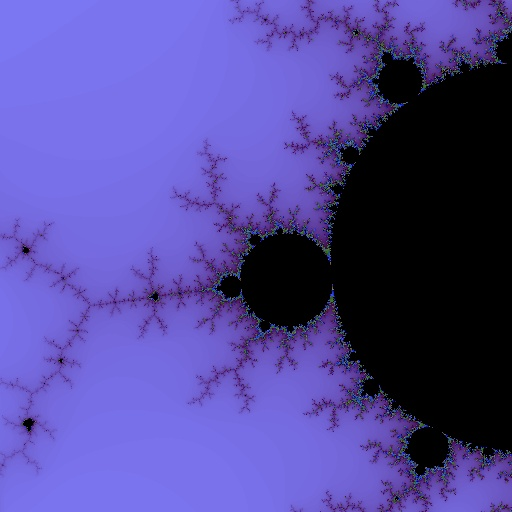

## Chapter 6. GPU Programming with Accelerate

The most powerful processor in your computer may not be the CPU. Modern graphics processing units (GPUs) usually have something on the order of 10 to 100 times more raw compute power than the general-purpose CPU. However, the GPU is a very different beast from the CPU, and we can’t just run ordinary Haskell programs on it. A GPU consists of a large number of parallel processing units, each of which is much less powerful than one core of your CPU, so to unlock the power of a GPU we need a highly parallel workload. Furthermore, the processors of a GPU all run exactly the same code in lockstep, so they are suitable only for data-parallel tasks where the operations to perform on each data item are identical.

In recent years GPUs have become less graphics-specific and more suitable for performing general-purpose parallel processing tasks. However, GPUs are still programmed in a different way from the CPU because they have a different instruction set architecture. A special-purpose compiler is needed to compile code for the GPU, and the source code is normally written in a language that resembles a restricted subset of C. Two such languages are in widespread use: NVidia’s CUDA and OpenCL. These languages are very low-level and expose lots of details about the workings of the GPU, such as how and when to move data between the CPU’s memory and the GPU’s memory.

Clearly, we would like to be able to make use of the vast computing power of the GPU from Haskell without having to write code in CUDA or OpenCL. This is where the Accelerate library comes in: Accelerate is an embedded domain-specific language (EDSL) for programming the GPU. It allows us to write Haskell code in a somewhat stylized form and have it run directly on the GPU. For certain tasks, we can obtain orders of magnitude speedup by using Accelerate.

During the course of this chapter, I’ll be introducing the various concepts of Accelerate, starting with the basic data types and operations and progressing to full-scale examples that run on the GPU.

As with Repa in the previous chapter, I’ll be illustrating many of the Accelerate operations by typing expressions into GHCi. Accelerate comes with an interpreter, which means that for experimenting with Accelerate code, you don’t need a machine with a GPU. To play with examples yourself, first make sure the `accelerate` package is installed:

```
$ cabal install accelerate
```

The `accelerate` package provides the basic infrastructure, which includes the `Data``.Array.Accelerate` module for constructing array computations, and `Data``.Array.Accelerate.Interpreter` for interpreting them. To actually run an Accelerate computation on a GPU, you will also need a supported GPU card and the `accelerate-cuda` package; I’ll cover that later in Running on the GPU.

When you have the `accelerate` package installed, you can start up GHCi and import the necessary modules:

```
$ ghci
Prelude> import Data.Array.Accelerate as A
Prelude A> import Data.Array.Accelerate.Interpreter as I
Prelude A I>
```

As we’ll see, Accelerate shares many concepts with Repa. In particular, array shapes and indices are the same, and Accelerate also has the concept of shape-polymorphic operations like fold.

## Overview

I mentioned earlier that Accelerate is an embedded domain-specific language for programming GPUs. More specifically, it is a deeply embedded DSL. This means that programs are written in Haskell syntax using operations of the library, but the method by which the program runs is different from a conventional Haskell program. A program fragment that uses Accelerate works like this:

- The Haskell code generates a data structure in an internal representation that the programmer doesn’t get to see.
- This data structure is then compiled into GPU code using the `accelerate-cuda` package and run directly on the GPU. When you don’t have a GPU, the `accelerate` package *interprets* the code instead, using Accelerate’s built-in interpreter. Both methods give the same results, but of course running on the GPU should be far faster.

Both steps happen while the Haskell program is running; there’s no extra compile step, apart from compiling the Haskell program itself.

By the magic of Haskell’s overloading and abstraction facilities, the Haskell code that you write using Accelerate usually looks much like ordinary Haskell code, even though it generates another program rather than actually producing the result directly.

While reading this chapter, you probably want to have a copy of the Accelerate [API documentation](http://hackage.haskell.org/package/accelerate/) at hand.

## Arrays and Indices

As with Repa, Accelerate is a framework for programming with arrays. An Accelerate computation takes arrays as inputs and delivers one or more arrays as output. The type of Accelerate arrays has only two parameters, though:

```
data Array sh e
```

Here, `e` is the element type, and `sh` is the shape. There is no representation type. Even though Accelerate does have delayed arrays internally and compositions of array operations are fused in much the same way as in Repa, arrays are not explicitly tagged with a representation type.

Shapes and indices use the same data types as Repa (for more details see Arrays, Shapes, and Indices):

```
data Z = Z
data tail :. head = tail :. head
```

And there are some convenient type synonyms for common shapes:

```
type DIM0 = Z
type DIM1 = DIM0 :. Int
type DIM2 = DIM1 :. Int
```

Because arrays of dimensionality zero and one are common, the library provides type synonyms for those:

```
type Scalar e = Array DIM0 e
type Vector e = Array DIM1 e
```

You can build arrays and experiment with them in ordinary Haskell code using `fromList`:

```
fromList :: (Shape sh, Elt e) => sh -> [e] -> Array sh e
```

As we saw with Repa, we have to be careful to give GHC enough type information to fix the type of the indices (to `Int`), and the same is true in Accelerate. Let’s build a 10-element vector using `fromList`:

```
> fromList (Z:.10) [1..10] :: Vector Int
Array (Z :. 10) [1,2,3,4,5,6,7,8,9,10]
```

Similarly, we can make a two-dimensional array, with three rows of five columns:

```
> fromList (Z:.3:.5) [1..] :: Array DIM2 Int
Array (Z :. 3 :. 5) [1,2,3,4,5,6,7,8,9,10,11,12,13,14,15]
```

The operation for indexing one of these arrays is `indexArray`:

```
> let arr = fromList (Z:.3:.5) [1..] :: Array DIM2 Int
> indexArray arr (Z:.2:.1)
12
```

(There is also a `!` operator that performs indexing, but unlike `indexArray` it can only be used in the context of an Accelerate computation, which we’ll see shortly.)

One thing to remember is that in Accelerate, arrays cannot be nested; it is impossible to build an array of arrays. This is because arrays must be able to be mapped directly into flat arrays on the GPU, which has no support for nested arrays.

We can, however, have arrays of tuples. For example:

```
> fromList (Z:.2:.3) (Prelude.zip [1..] [1..]) :: Array DIM2 (Int,Int)
Array (Z :. 2 :. 3) [(1,1),(2,2),(3,3),(4,4),(5,5),(6,6)]
```

Internally, Accelerate will translate an array of tuples into a tuple of arrays; this is done entirely automatically, and we don’t need to worry about it. Arrays of tuples are a very useful structure, as we shall see.

## Running a Simple Accelerate Computation

So far, we have been experimenting with arrays in the context of ordinary Haskell code; we haven’t constructed an actual Accelerate computation over arrays yet. An Accelerate computation takes the form `run` *`E`*, where:

```
run :: Arrays a => Acc a -> a
```

The expression *`E`* has type `Acc a`, which means “an accelerated computation that delivers a value of type `a`.” The `Arrays` class allows `a` to be either an array or a tuple of arrays. A value of type `Acc a` is really a data structure (we’ll see in a moment how to build it), and the `run` function evaluates the data structure to produce a result. There are two versions of `run`: one exported by `Data.Array.Accelerate.Interpreter` that we will be using for experimentation and testing, and another exported by `Data.Array.Accelerate.CUDA` (in the `accelerate-cuda` package) that runs the computation on the GPU.

Let’s try a very simple example. Starting with the 3×5 array of `Int` from the previous section, let’s add one to every element:

```
> let arr = fromList (Z:.3:.5) [1..] :: Array DIM2 Int
> run $ A.map (+1) (use arr)
Array (Z :. 3 :. 5) [2,3,4,5,6,7,8,9,10,11,12,13,14,15,16]
```

Breaking this down, first we call `A.map`, which is the `map` function from `Data.Array.Accelerate`; recall that we used `import Data.Array.Accelerate as A` earlier. We have to use the qualified name, because there are two `map` functions in scope: `A.map` and `Prelude.map`.

Here is the type of `A.map`:

```
A.map :: (Shape ix, Elt a, Elt b)
      => (Exp a -> Exp b)
      -> Acc (Array ix a)
      -> Acc (Array ix b)
```

A few things will probably seem unusual about this type. First let’s look at the second argument. This is the array to map over, but rather than just an `Array ix a`, it is an `Acc (Array ix a)`—that is, an array in the Accelerate world rather than the ordinary Haskell world. We need to somehow turn our `Array DIM2 Int` into an `Acc (Array DIM2 Int)`. This is what the `use` function is for:

```
use :: Arrays arrays => arrays -> Acc arrays
```

The `use` function is the way to take arrays from Haskell and inject them into an Accelerate computation. This might actually involve copying the array from the computer’s main memory into the GPU’s memory.

The first argument to `A.map` has type `Exp a -> Exp b`. Here, `Exp` is a bit like `Acc`. It represents a computation in the world of Accelerate, but whereas `Acc` is a computation delivering an array, `Exp` is a computation delivering a single value.

In the example we passed `(+1)` as the first argument to map. This expression is overloaded in Haskell with type `Num a => a -> a`, and we’re accustomed to seeing it used at types like `Int -> Int` and `Double -> Double`. Here, however, it is being used at type `Exp Int -> Exp Int`; this is possible because Accelerate provides an instance for `Num (Exp a)`, so expressions built using integer constants and overloaded `Num` operations work just fine in the world of `Exp`.^(\[22\])

Here’s another example, which squares every element in the array:

```
> run $ A.map (^2) (use arr)
Array (Z :. 3 :. 5) [1,4,9,16,25,36,49,64,81,100,121,144,169,196,225]
```

We can inject values into the Accelerate world with functions such as `use` (and some more that we’ll see shortly), but the only way to get data *out* of an Accelerate computation is to run it with `run`, and then the result becomes available to the caller as an ordinary Haskell value.

Type Classes: Elt, Arrays, and Shape

There are a few type classes that commonly appear in the operations from `Data.Array.Accelerate`. The types are restricted to a fixed set, and aside from this we don’t need to know anything more about them; indeed, Accelerate hides the methods from the public API. Briefly, these are the three type classes you will encounter most often:

 `Elt`  
The class of types that may be array elements. Includes all the usual numeric types, as well as indices and tuples. In types of the form `Exp e`, the `e` is often required to be an instance of `Elt`. Note in particular that arrays are not an instance of `Elt`; this is the mechanism by which Accelerate enforces that arrays cannot be nested.

 `Arrays`  
This type class includes arrays and tuples of arrays. In `Acc a`, the `a` must always be an instance of the type class `Arrays`.

 `Shape`  
The class of shapes and indices. This class includes only `Z` and `:.` and is used to ensure that values used as shapes and indices are constructed from these two types.

See the Accelerate documentation for a full list of the instances of each class.

## Scalar Arrays

Sometimes we want to use a single value in a place where the API only allows an array; this is quite common in Accelerate because most operations are over arrays. For example, the result of `run` contains only arrays, not scalars, so if we want to return a single value, we have to wrap it in an array first. The `unit` operation is provided for this purpose:

```
unit :: Elt e => Exp e -> Acc (Scalar e)
```

Recall that `Scalar` is a type synonym for `Array DIM0`; an array with zero dimensions has only one element. Now we can return a single value from `run`:

```
> run $ unit (3::Exp Int)
Array (Z) [3]
```

The dual to `unit` is `the`, which extracts a single value from a `Scalar`:

```
the :: Elt e => Acc (Scalar e) -> Exp e
```

## Indexing Arrays

The `!` operator indexes into an array:

```
(!) :: (Shape ix, Elt e) => Acc (Array ix e) -> Exp ix -> Exp e
```

Unlike the `indexArray` function that we saw earlier, the `!` operator works in the Accelerate world; the array argument has type `Acc (Array ix e)`, and the index is an `Exp ix`. So how do we get from an ordinary index like `Z:.3` to an `Exp (Z:.Int)`? There is a handy function `index1` for exactly this purpose:

```
index1 :: Exp Int -> Exp (Z :. Int)
```

So now we can index into an array. Putting these together in GHCi:

```
> let arr = fromList (Z:.10) [1..10] :: Array DIM1 Int
> run $ unit (use arr ! index1 3)
Array (Z) [4]
```

## Creating Arrays Inside Acc

We saw earlier how to create arrays using `fromList` and then inject them into the `Acc` world with `use`. This is not a particularly efficient way to create arrays. Even if the compiler is clever enough to optimize away the intermediate list, the array data will still have to be copied over to the GPU’s memory. So it’s usually better to create arrays inside `Acc`. The Accelerate library provides a few ways to create arrays inside `Acc`; the simplest one is `fill`:

```
fill :: (Shape sh, Elt e) => Exp sh -> Exp e -> Acc (Array sh e)
```

The `fill` operation creates an array of the specified shape in which all elements have the same value. We can create arrays in which the elements are drawn from a sequence by using `enumFromN` and `enumFromStepN`:

```
enumFromN     :: (Shape sh, Elt e, IsNum e)
              => Exp sh -> Exp e -> Acc (Array sh e)

enumFromStepN :: (Shape sh, Elt e, IsNum e)
              => Exp sh -> Exp e -> Exp e -> Acc (Array sh e)
```

In `enumFromN`, the first argument is the shape and the second is the value of the first element. For example, `enumFromN` `(index1` *`N`*`)` *`M`* is the same as `use` `(fromList (Z:.`*`N`*`)` `[`*`M`*`..])`.

The `enumFromStepN` function is the same, except that we can specify the increment between the element values. For instance, to create a two-dimensional array of shape three rows of five columns, where the elements are drawn from the sequence `[15,14..]`:

```
> run $ enumFromStepN (index2 3 5) 15 (-1) :: Array DIM2 Int
Array (Z :. 3 :. 5) [15,14,13,12,11,10,9,8,7,6,5,4,3,2,1]
```

Note that we used `index2`, the two-dimensional version of `index1` that we saw earlier, to create the shape argument.

A more general way to create arrays is provided by `generate`:

```
generate :: (Shape ix, Elt a)
         => Exp ix -> (Exp ix -> Exp a)
         -> Acc (Array ix a)
```

This time, the values of the elements are determined by a user-supplied function from `Exp ix` to `Exp a`; that is, the function that will be applied to each index in the array to determine the element value at that position. This is exactly like the `fromFunction` operation we used in Repa, except that here we must supply a function in the `Exp` world rather than an arbitrary Haskell function.

For instance, to create a two-dimensional array in which every element is given by the sum of its `x` and `y` coordinates, we can use `generate`:

```
> run $ generate (index2 3 5) (\ix -> let Z:.y:.x = unlift ix in x + y)
Array (Z :. 3 :. 5) [0,1,2,3,4,1,2,3,4,5,2,3,4,5,6]
```

Let’s look in more detail at the function argument:

```
  \ix -> let Z:.y:.x = unlift ix in x + y
```

The function as a whole must have type `Exp DIM2 -> Exp Int`, and hence `ix` has type `Exp DIM2`. We need to extract the `x` and `y` values from the index, which means we need to deconstruct the `Exp DIM2`. The function `unlift` does this; in general, you should think of `unlift` as a way to take apart a structured value inside an `Exp`. It works for tuples and indices. In the previous example, we’re using `unlift` at the following type:^(\[23\])

```
unlift :: Exp (Z :. Int :. Int) -> Z :. Exp Int :. Exp Int
```

The result is a `DIM2` value in the Haskell world, so we can pattern match against `Z:.x:.y` to extract the `x` and `y` values, both of type `Exp Int`. Then `x + y` gives us the sum of `x` and `y` as an `Exp Int`, by virtue of the overloaded `+` operator.

There is a dual to `unlift`, unsurprisingly called `lift`, which does the opposite transformation. In fact, the `index2` function that we used in the `generate` example earlier is defined in terms of `lift`:

```
index2 :: Exp Int -> Exp Int -> Exp DIM2
index2 i j = lift (Z :. i :. j)
```

This use of `lift` has the following type:

```
lift :: Z :. Exp Int :. Exp Int -> Exp (Z :. Int :. Int)
```

The `lift` and `unlift` functions are essential when we’re working with indices in Accelerate, and as we’ll see later, they’re useful for working with tuples as well.

## Zipping Two Arrays

The `zipWith` function combines two arrays to produce a third array by applying the supplied function to corresponding elements of the input arrays:

```
zipWith :: (Shape ix, Elt a, Elt b, Elt c)
        => (Exp a -> Exp b -> Exp c)
        -> Acc (Array ix a) -> Acc (Array ix b)
        -> Acc (Array ix c)
```

The first argument is the function to apply to each pair of elements, and the second and third arguments are the input arrays. For example, zipping two arrays with `(+)`:

```
> let a = enumFromN (index2 2 3) 1 :: Acc (Array DIM2 Int)
> let b = enumFromStepN (index2 2 3) 6 (-1) :: Acc (Array DIM2 Int)
> run $ A.zipWith (+) a b
Array (Z :. 2 :. 3) [7,7,7,7,7,7]
```

Here we zipped together two arrays of identical shape, but what happens if the shapes are different? The type of `zipWith` requires that the input arrays have identical dimensionality, but the sizes of the dimensions might be different. For example, we’ll use the same 2×3 array as before, but zip it with a 3×5 array containing elements `[10, 20..]`:

```
> let a = enumFromN (index2 2 3) 1 :: Acc (Array DIM2 Int)
> let b = enumFromStepN (index2 3 5) 10 10 :: Acc (Array DIM2 Int)
> run $ A.zipWith (+) a b
Array (Z :. 2 :. 3) [11,22,33,64,75,86]
```

What happened is that `zipWith` used the overlapping intersection of the two arrays. With two-dimensional arrays, you can visualize it like this: lay one array on top of the other, with their upper-left-hand corners at the same point, and pair together the elements that coincide. The final array has the shape of the overlapping portion of the two arrays.

## Constants

We saw earlier that simple integer literals and numeric operations are automatically operations in `Exp` by virtue of being overloaded. But what if we already have an `Int` value and we need an `Exp Int`? This is what the function `constant` is for:

```
constant :: Elt t => t -> Exp t
```

Note that `constant` works only for instances of `Elt`, which you may recall is the class of types allowed to be array elements, including numeric types, indices, and tuples of `Elt`s.

## Example: Shortest Paths

As our first full-scale example, we’ll again tackle the Floyd-Warshall shortest paths algorithm. For details of the algorithm, please see the Repa example in Example: Computing Shortest Paths; the algorithm here will be identical, except that we’re going to run it on a GPU using Accelerate to see how much faster it goes.

Here are the type of graphs, represented as adjacency matrices:

*fwaccel.hs*

```
type Weight = Int32
type Graph = Array DIM2 Weight
```

The algorithm is a sequence of steps, each of which takes a value for `k` and a `Graph` as input and produces a new `Graph`. First, we’ll write the code for an individual step before we see how to put multiple steps together. Here is the code for a step:

```
step :: Acc (Scalar Int) -> Acc Graph -> Acc Graph
step k g = generate (shape g) sp                           -- ①
 where
   k' = the k                                              -- ②

   sp :: Exp DIM2 -> Exp Weight
   sp ix = let
             (Z :. i :. j) = unlift ix                     -- ③
           in
             A.min (g ! (index2 i j))                      -- ④
                   (g ! (index2 i k') + g ! (index2 k' j))
```

①  
The `step` function takes two arguments: `k`, which is the iteration number, and `g`, which is the graph produced by the previous iteration. In each step, we’re computing the lengths of the shortest paths between each two elements, using only vertices up to `k`. The graph from the previous iteration, `g`, gives us the lengths of the shortest paths using vertices up to `k - 1`. The result of this step is a new `Graph`, produced by calling the `generate` function. The new array has the same shape as `g`, and the elements of the array are determined by the function `sp`, defined in the `where` clause.

②  
The `k` argument is passed in as a scalar array; the sidebar explains why. To extract the value from the array, we call `the`.

③  
The `sp` function takes the index of an element in the array and returns the value of the element at that position. We need to `unlift` the input index to extract the two components, `i` and `j`.

④  
This is the core of the algorithm; to determine the length of the shortest path between `i` and `j`, we take the minimum of the previous shortest path from `i` to `j`, and the path that goes from `i` to `k` and then from `k` to `j`. All of these lookups in the `g` graph are performed using the `!` operator, and using `index2` to construct the indices.

Passing Inputs as Arrays

Why did we pass in the `k` value as an `Acc (Scalar Int)` rather than a plain `Int`? After all, we could use `constant` to convert an `Int` into an `Exp Int` that we could use with `index2`. The answer is quite subtle, and to understand it we first need to know a little more about how Accelerate works. When the program runs, the Accelerate library evaluates the expression passed to `run` to make a series of CUDA fragments (called *kernels*). Each kernel takes some arrays as inputs and produces arrays as outputs. In our example, each call to `step` will produce a kernel, and when we compose a sequence of `step` calls together, we get a series of kernels. Each kernel is a piece of CUDA code that has to be compiled and loaded onto the GPU; this can take a while, so Accelerate remembers the kernels it has seen before and tries to reuse them.

Our goal with `step` is to make a kernel that will be reused. If we don’t reuse the same kernel for each `step`, the overhead of compiling new kernels will ruin the performance.

We can look at the code that Accelerate sees when it evaluates the argument to `run` by evaluating an `Acc` expression in GHCi. Here’s what a typical call to `step` evaluates to:

```
> step (unit (constant 2)) (use (fromList (Z:.3:.3) [1..9]))
let a0 = use ((Array (Z :. 3 :. 3) [1,2,3,4,5,6,7,8,9]))
in let a1 = unit 2
   in generate
        (shape a0)
        (\x0 -> ...)
```

I’ve omitted the innards of the `generate` argument for space, but by all means try it yourself. The important thing to notice here is the line `let a1 = unit 2`; this is the scalar array for the `k` argument to step, and it is outside the call to `generate`. The `generate` function is what turns into the CUDA kernel, and to arrange that we get the same CUDA kernel each time we need the arguments to `generate` to remain constant.

Now see what happens if we change `step` so that it takes an `Int` as an argument instead. I’ve replaced the `Acc (Scalar Int)` with `Int`, and changed `k' = the k` to `k' = constant k`.

```
> step 2 (use (fromList (Z:.3:.3) [1..9]))
let a0 = use ((Array (Z :. 3 :. 3) [1,2,3,4,5,6,7,8,9]))
in generate
     (shape a0)
     (\x0 -> min (let x1 = 2
                  in ... ))
```

Previously, the code created by `k` was defined outside the `generate` call, but now the definition `let x1 = 2` is embedded inside the call. Hence each `generate` call will have a different `k` value embedded in it, which will defeat Accelerate’s caching of CUDA kernels.

The rule of thumb is that if you’re running a sequence of array operations inside `Acc`, make sure that the things that change are always passed in as arrays and not embedded in the code as constants.

How can you tell if you get it wrong? One way is to look at the code as we just did. Another way is to use the debugging options provided by the `accelerate-cuda` package, which are described briefly in Debugging the CUDA Backend.

Now that we have the `step` function, we can write the wrapper that composes the sequence of `step` calls together:

```
shortestPathsAcc :: Int -> Acc Graph -> Acc Graph
shortestPathsAcc n g0 = foldl1 (>->) steps g0              -- ①
 where
  steps :: [ Acc Graph -> Acc Graph ]                      -- ②
  steps =  [ step (unit (constant k)) | k <- [0 .. n-1] ]  -- ③
```

②  
First we construct a list of the steps, where each takes a `Graph` and delivers a `Graph`.

③  
The list of steps is constructed by applying `step` to each value of `k` in the sequence `0 .. n-1`, wrapping the `k` values up as scalar arrays using `unit` and `constant`.

①  
To put the sequence together, Accelerate provides a special operation designed for this task:

```
(>->) :: (Arrays a, Arrays b, Arrays c)
       => (Acc a -> Acc b) -> (Acc b -> Acc c) -> Acc a -> Acc c
```

This is called the pipeline operator, because it is used to connect two `Acc` computations together in a pipeline, where the output from the first is fed into the input of the second. We could achieve this with simple function composition, but the advantage of using the `>->` operator is that it tells Accelerate that there is no sharing between the two computations, and any intermediate arrays used by the first computation can be garbage-collected when the second begins. Without this operator, it is possible to fill up memory when running algorithms with many iterations. So our `shortestPathsAcc` function connects together the sequence of `step` calls by left-folding with `>->` and then passes `g0` as the input to the pipeline.

Now that we have defined the complete computation, we can write a function that wraps `run` around it:

```
shortestPaths :: Graph -> Graph
shortestPaths g0 = run (shortestPathsAcc n (use g0))
  where
    Z :. _ :. n = arrayShape g0
```

We can try the program on test data, using the Accelerate interpreter:

```
> shortestPaths testGraph
Array (Z :. 6 :. 6) [0,16,999,13,20,20,19,0,999,5,4,9,11,27,0,24,31,31,18,3,
999,0,7,7,15,4,999,1,0,8,11,17,999,14,21,0]
```

### Running on the GPU

To run the program on a real GPU, you’ll need a supported GPU card and some additional software. Consult the Accelerate documentation to help you get things set up. Then install the `accelerate-cuda` package:

```
$ cabal install accelerate-cuda -fdebug
```

I’ve enabled debugging support here with the `-fdebug` flag, which lets us pass some extra options to the program to see what the GPU is doing.

To use Accelerate’s CUDA support, we need to use:

```
import Data.Array.Accelerate.CUDA
```

in place of:

```
import Data.Array.Accelerate.Interpreter
```

A version of the shortest paths program that has this is in `fwaccel-gpu.hs`. Compile it in the usual way:

```
$ ghc -O2 fwaccel.hs -threaded
```

The program includes a benchmarking wrapper that generates a large graph over which to run the algorithm. Let’s run it on a graph with 2,000 nodes:^(\[24\])

```
$ ./fwaccel 2000 +RTS -s
...
  Total   time   14.71s  ( 16.25s elapsed)
```

For comparison, I tried the Repa version of this program on a graph of the same size, using seven cores on the same machine:^(\[25\])

```
$ ./fwdense1 2000 +RTS -s -N7
...
  Total   time  259.78s  ( 40.13s elapsed)
```

So the Accelerate program running on the GPU is significantly faster than Repa. Moreover, about 3.5s of the runtime of the Accelerate program is taken up by initializing the GPU on this machine, which we can see by running the program with a small input size.

### Debugging the CUDA Backend

When the `accelerate-cuda` package is compiled with `-fdebug`, there are a few extra debugging options available. These are the most useful ones:

 `-dverbose`  
Prints some information about the type and capabilities of the GPU being used.

 `-ddump-cc`  
Prints information about CUDA kernels as they are compiled and run. Using this option will tell you whether your program is generating the number of kernels that you were expecting.

For a more complete list, see the *accelerate-cuda.cabal* file in the `accelerate-cuda` package sources.

## Example: A Mandelbrot Set Generator

In this second example, we’ll build a Mandelbrot set generator that runs on the GPU. The end result will be the picture in Figure 6-1. Generating an image of the Mandelbrot set is a naturally parallel process—each pixel is independent of the others—but there are some aspects to this problem that make it an interesting example to program using Accelerate. In particular, we’ll see how to use conditionals and to work with arrays of tuples.



Figure 6-1. Mandelbrot set picture generated on the GPU

The Mandelbrot set is a mathematical construction over the *complex plane*, which is the two-dimensional plane of complex numbers. A particular point is said to be in the set if, when the following equation is repeatedly applied, the magnitude of *z* (written as \|*z*\|) does not diverge to infinity:

*z*_((*n*+1)) = *c* + *z*_(*n*)²

where *c* is the point on the plane (a complex number), and *z*₀ = *c*.

In practice, we iterate the equation for a fixed number of times, and if it has not diverged at that point, we declare the point to be in the set. Furthermore, to generate a pretty picture, we remember the iteration at which each point diverged and map the iteration values to a color gradient.

We know that \|*z*\| will definitely diverge if it is greater than 2. The magnitude of a complex number *x* + i*y* is given by √(x² + y²), so we can simplify the condition by squaring both sides, giving us this condition for divergence: x² + y² \> 4.

Let’s express this using Accelerate. First, we want a type for complex numbers. Accelerate lets us work with tuples, so we can represent complex numbers as pairs of floating point numbers. Not all GPUs can work with `Double`s, so for the best compatibility we’ll use `Float`:

*mandel/mandel.hs*

```
type F            = Float
type Complex      = (F,F)
type ComplexPlane = Array DIM2 Complex
```

We’ll be referring to `Float` a lot, so the `F` type synonym helps to keep things readable.

The following function, `next`, embodies the main Mandelbrot formula: it computes the next value of *z* for a given point *c*.

```
next :: Exp Complex -> Exp Complex -> Exp Complex
next c z = c `plus` (z `times` z)
```

We can’t use the normal `+` and `*` operations here, because there is no instance of `Num` for `Exp Complex`. In other words, Accelerate doesn’t know how to add or multiply our complex numbers, so we have to define these operations ourselves. First, `plus`:

```
plus :: Exp Complex -> Exp Complex -> Exp Complex
plus a b = ...
```

To sum two complex numbers, we need to sum the components. But how can we access the components? We cannot pattern match on `Exp Complex`. There are a few different ways to do it, and we’ll explore them briefly. Accelerate provides operations for selecting the components of pairs in `Exp`, namely:

```
fst :: (Elt a, Elt b) => Exp (a, b) -> Exp a
snd :: (Elt a, Elt b) => Exp (a, b) -> Exp b
```

So we could write `plus` like this:

```
plus :: Exp Complex -> Exp Complex -> Exp Complex
plus a b = ...
  where
    ax = A.fst a
    ay = A.snd a
    bx = A.fst b
    by = A.snd b
```

But how do we construct the result? We want to write something like `(ax+bx, ay+by)`, but this has type `(Exp F, Exp F)`, whereas we want `Exp (F,F)`. Fortunately the `lift` function that we saw earlier performs this transformation, so the result is:

```
plus :: Exp Complex -> Exp Complex -> Exp Complex
plus a b = lift (ax+bx, ay+by)
  where
    ax = A.fst a
    ay = A.snd a
    bx = A.fst b
    by = A.snd b
```

In fact, we could do a little better, since `A.fst` and `A.snd` are just instances of `unlift`, and we could do them both in one go:

```
plus :: Exp Complex -> Exp Complex -> Exp Complex
plus a b = lift (ax+bx, ay+by)
  where
    (ax, ay) = unlift a
    (bx, by) = unlift b
```

Unfortunately, if you try this you will find that there isn’t enough type information for GHC, so we have to help it out a bit:

```
plus :: Exp Complex -> Exp Complex -> Exp Complex
plus a b = lift (ax+bx, ay+by)
  where
    (ax, ay) = unlift a :: (Exp F, Exp F)
    (bx, by) = unlift b :: (Exp F, Exp F)
```

We can go a little further because Accelerate provides some utilities that wrap a function in `lift` and `unlift`. For a two-argument function, the right variant is called `lift2`:

```
plus :: Exp Complex -> Exp Complex -> Exp Complex
plus = lift2 f
  where f :: (Exp F, Exp F) -> (Exp F, Exp F) -> (Exp F, Exp F)
        f (x1,y1) (x2,y2) = (x1+x2,y1+y2)
```

Unfortunately, again we had to add the type signature to get it to typecheck, but it does aid readability. This is perhaps as close to “natural” as we can get for this definition: the necessary lifting and unlifting are confined to just one place.

We also need to define `times`, which follows the same pattern as `plus`, although of course this time we are multiplying the two complex numbers together:

```
times :: Exp Complex -> Exp Complex -> Exp Complex
times = lift2 f
  where f :: (Exp F, Exp F) -> (Exp F, Exp F) -> (Exp F, Exp F)
        f (ax,ay) (bx,by)   =  (ax*bx-ay*by, ax*by+ay*bx)
```

So now we can compute *z*_(*n*+1) given *z* and *c*. But we need to think about the program as a whole. For each point, we need to iterate this process until divergence, and then remember the number of iterations at which divergence happened. This creates a small problem: GPUs are designed to do the *same thing* to lots of different data at the same time, whereas we want to do something different depending on whether or not a particular point has diverged. So in practice, we can’t do what we would normally do in a single-threaded language and iterate each point until divergence. Instead, we must find a way to apply the same operation to every element of the array for a fixed number of iterations.

There is a conditional operation in Accelerate, with this type:

```
(?) :: Elt t => Exp Bool -> (Exp t, Exp t) -> Exp t
```

The first argument is an `Exp Bool`, and the second argument is a pair of expressions. If the Boolean evaluates to true, the result is the first component of the pair; otherwise it is the second.

However, as a rule of thumb, using conditionals in GPU code is considered “bad” because conditionals cause *SIMD divergence*. This means that when the GPU hits a conditional instruction, it first runs all the threads that take the true branch and then runs the threads that take the false branch. Of course if you have nested conditionals, the amount of parallelism rapidly disappears.

We can’t avoid *some* kind of conditional in the Mandelbrot example, but we can make sure there is only a bounded amount of divergence by having just one conditional per iteration and a fixed number of iterations. The trick we’ll use is to keep a pair `(z,i)` for every array element, where `i` is the iteration at which that point diverged. So at each iteration, we do the following:

- Compute `z' = next c z`.
- If it is greater than four, the result is `(z,i)`.
- Otherwise, the result is `(z',i+1)`

The implementation of this sequence is the `iter` function, defined as follows:

```
iter :: Exp Complex -> Exp (Complex,Int) -> Exp (Complex,Int)
iter c p =
  let
     (z,i) = unlift p :: (Exp Complex, Exp Int)    -- ①
     z' = next c z                                 -- ②
  in
  (dot z' >* 4.0) ?                                -- ③
     ( p                                           -- ④
     , lift (z', i+1)                              -- ⑤
     )
```

①  
The first thing to do is `unlift p` so we can access the components of the pair.

②  
Next, we compute `z'` by calling `next`.

③  
Now that we have `z'` we can do the conditional test using the `?` operator. The `dot` function computes `x`² + `y`² where `x` and `y` are the components of `z`; it follows the same pattern as `plus` and `times` so I’ve omitted its definition.

④  
If the condition evaluates to true, we just return the original `p`.

⑤  
In the false case, then we return the new `z'` and `i+1`.

The algorithm needs two arrays: one array of `c` values that will be constant throughout the computation, and a second array of `(z,i)` values that will be recomputed by each iteration. Our arrays are two-dimensional arrays indexed by pixel coordinates because the aim is to generate a picture from the iteration values at each pixel.

The initial complex plane of `c` values is generated by a function `genPlane`:

```
genPlane :: F -> F
         -> F -> F
         -> Int
         -> Int
         -> Acc ComplexPlane
```

Its definition is rather long so I’ve omitted it here, but essentially it is a call to `generate` (Creating Arrays Inside Acc).

From the initial complex plane we can generate the initial array of `(z,i)` values, which is done by initializing each `z` to the corresponding `c` value and `i` to zero. In the code, this can be found in the `mkinit` function.

Now we can put the pieces together and write the code for the complete algorithm:

```
mandelbrot :: F -> F -> F -> F -> Int -> Int -> Int
           -> Acc (Array DIM2 (Complex,Int))

mandelbrot x y x' y' screenX screenY max_depth
  = iterate go zs0 !! max_depth              -- ①
  where
    cs  = genPlane x y x' y' screenX screenY -- ②
    zs0 = mkinit cs                          -- ③

    go :: Acc (Array DIM2 (Complex,Int))
       -> Acc (Array DIM2 (Complex,Int))
    go = A.zipWith iter cs                   -- ④
```

②  
`cs` is our static complex plane generated by `genPlane`.

③  
`zs0` is the initial array of `(z,i)` values.

④  
The function `go` performs one iteration, producing a new array of `(z,i)`, and it is expressed by zipping `iter` over both `cs` and the current array of `(z,i)`.

①  
To perform all the iterations, we simply call the ordinary list function `iterate`:

```
iterate :: (a -> a) -> a -> [a]
```

and take the element at position `depth`, which corresponds to the `go` function having been applied `depth` times. Note that in this case, we don’t want to use the pipeline operator `>->` because the iterations share the array `cs`.

The complete program has code to produce an output file in PNG format, by turning the Accelerate array into a Repa array and then using the `repa-devil` library that we saw in Example: Image Rotation. To compile the program, install the `accelerate` and `accelerate-cuda` packages as before, and then:

```
$ ghc -O2 -threaded mandel.hs
```

Then generate a nice big image (again, this is running on an Amazon EC2 Cluster GPU instance):

```
$ rm out.png; ./mandel --size=4000 +RTS -s
...
  Total   time    8.40s  ( 10.56s elapsed)
```

  

------------------------------------------------------------------------

^(\[22\]) This comes with a couple of extra constraints, which we won’t go into here.

^(\[23\]) The `unlift` function is actually a method of the `Unlift` class, which has instances for indices (of any dimensionality) and various sizes of tuples. See the Accelerate documentation for details.

^(\[24\]) These results were obtained on an Amazon EC2 Cluster GPU instance that had an NVidia Tesla card. I used CUDA version 4.

^(\[25\]) Using all eight cores was slower than using seven.