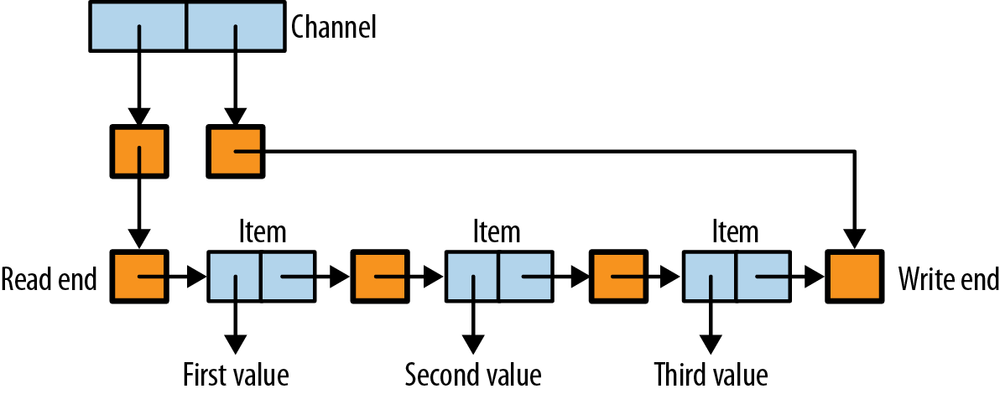

## Chapter 7. Basic Concurrency: Threads and MVars

The fundamental action in concurrency is forking a new thread of control. In Concurrent Haskell, this is achieved with the `forkIO` operation:

```
forkIO :: IO () -> IO ThreadId
```

The `forkIO` operation takes a computation of type `IO ()` as its argument; that is, a computation in the `IO` monad that eventually delivers a value of type `()`. The computation passed to `forkIO` is executed in a new thread that runs concurrently with the other threads in the system. If the thread has effects, those effects will be interleaved in an indeterminate fashion with the effects from other threads.

To illustrate the interleaving of effects, let’s try a simple example with two threads, one that repeatedly prints the letter `A` while the other repeatedly prints `B`:

*fork.hs*

```
import Control.Concurrent
import Control.Monad
import System.IO

main = do
  hSetBuffering stdout NoBuffering            -- ①
  forkIO (replicateM_ 100000 (putChar 'A'))   -- ②
  replicateM_ 100000 (putChar 'B')            -- ③
```

①  
Put the output `Handle` into nonbuffered mode, so that we can see the interleaving more clearly.

②  
Create a thread to print the character `A` 100,000 times.

③  
In the main thread, print `B` 100,000 times.

Try running the program; it should produce output similar to this:

```
AAAAAAAAABABABABABABABABABABABABABABABABABABABABABABAB
ABABABABABABABABABABABABABABABABABABABABABABABABABABAB
ABABABABABABABABABABABABABABABABABABABABABABABABABABAB
ABABABABABABABABABABABABABABABABABABABABABABABABABABAB
```

The output might have a different pattern, depending on the particular version of GHC that you use to run the test. In this case, we sometimes see strings of a single letter and sometimes a regular alternation between the two letters. Strings of a single letter are to be expected; the runtime system runs one thread for a “time slice” and then switches to the other thread.^(\[26\]) But why do we see sequences where each thread only gets a chance to output a single letter before switching? The threads in this example are contending for a single resource, the `stdout` Handle, so the behavior is affected by how contention for this resource is managed by the runtime system. We’ll see later how GHC’s fairness policy gives rise to the `ABABABA` behavior seen here.

## A Simple Example: Reminders

The following program illustrates the creation of threads in a program that implements timed reminders. The user enters a number of seconds, and after the specified time has elapsed, the program prints a message and emits a beep.^(\[27\]) Any number of reminders can be active simultaneously.

We’ll need an operation that waits for some time to elapse:

```
threadDelay :: Int -> IO ()
```

The function `threadDelay` takes an argument representing a number of microseconds and waits for that amount of time before returning.

*reminders.hs*

```
import Control.Concurrent
import Text.Printf
import Control.Monad

main =
  forever $ do
    s <- getLine           -- ①
    forkIO $ setReminder s -- ②

setReminder :: String -> IO ()
setReminder s  = do
  let t = read s :: Int
  printf "Ok, I'll remind you in %d seconds\n" t
  threadDelay (10^6 * t)                   -- ③
  printf "%d seconds is up! BING!\BEL\n" t -- ④
```

The program works by creating a thread for each new request for a reminder:

①  
Waits for input from the user.

②  
Creates a new thread to handle this reminder.

③  
The new thread, after printing a confirmation message, waits for the specified number of seconds using `threadDelay`.

④  
Finally, when `threadDelay` returns, the reminder message is printed.

For example:

```
$ ./reminders
2
Ok, I'll remind you in 2 seconds
3
Ok, I'll remind you in 3 seconds
4
Ok, I'll remind you in 4 seconds
2 seconds is up! BING!
3 seconds is up! BING!
4 seconds is up! BING!
```

Let’s extend this example to allow the user to terminate the program by entering `exit` instead of a number. We need to modify only the `main` function:

*reminders2.hs*

```
main = loop
 where
  loop = do
    s <- getLine
    if s == "exit"
       then return ()
       else do forkIO $ setReminder s
               loop
```

Instead of `forever`, we now use a recursive loop, and we choose to return from the loop if the string entered was `"exit"`; otherwise, we create a new thread as before and loop again. Returning from the loop causes `main` itself to return, which ends the program.

Now we can terminate the program, even if there are outstanding reminders:

```
$ ./reminders2
2
Ok, I'll remind you in 2 seconds
3
Ok, I'll remind you in 3 seconds
2 seconds is up! BING!
exit
$
```

This tells us something important about how threads work in Haskell: *the program terminates when `main` returns, even if there are other threads still running*. The other threads simply stop running and cease to exist after `main` returns.

Why does Haskell make this design decision, when in many cases it would be more useful to wait for all the concurrent threads to finish before terminating the program? Haskell’s approach is to give you the simplest possible interface that allows you to program whatever behavior you need, and waiting for threads is an additional service that can be implemented using the facilities provided by Concurrent Haskell. Higher-level interfaces can be provided by libraries. If you don’t like the behavior provided by a certain library, you can always modify it or write your own.

In MVar as a Simple Channel: A Logging Service, we’ll see one way to wait for a thread to terminate. In Chapter 8, we will build a more general interface for waiting for threads, which will be developed further in the following chapters.

## Communication: MVars

So far, we have learned how to create threads, but they can’t talk to each other. In this section we’ll introduce `MVar`, the basic communication mechanism provided by Concurrent Haskell.

The API for `MVar` is as follows:

```
data MVar a  -- abstract

newEmptyMVar :: IO (MVar a)
newMVar      :: a -> IO (MVar a)
takeMVar     :: MVar a -> IO a
putMVar      :: MVar a -> a -> IO ()
```

An `MVar` can be thought of as a box that is either empty or full. The `newEmptyMVar` operation creates a new empty box, and `newMVar` creates a new full box containing the value passed as its argument. The `takeMVar` operation removes the value from a full `MVar` and returns it, but waits (or *blocks*) if the `MVar` is currently empty. Symmetrically, the `putMVar` operation puts a value into the `MVar` but blocks if the `MVar` is already full.

The following sequence of small examples should help to illustrate how `MVar`s work. First, this program passes a single value from one thread to another:

*mvar1.hs*

```
main = do
  m <- newEmptyMVar
  forkIO $ putMVar m 'x'
  r <- takeMVar m
  print r
```

The `MVar` is empty when it is created, the child thread puts the value `x` into it, and the main thread takes the value and prints it. If the main thread calls `takeMVar` before the child thread has put the value, no problem: `takeMVar` blocks until the value is available.

This second example passes *two* values from the child thread to the main thread:

*mvar2.hs*

```
main = do
  m <- newEmptyMVar
  forkIO $ do putMVar m 'x'; putMVar m 'y'
  r <- takeMVar m
  print r
  r <- takeMVar m
  print r
```

The output when we run the program will be `'x'` followed by `'y'`. An `MVar` can be used in this way as a simple channel between two threads, or even between many writers and a single reader. We will see a realistic example of this use case shortly.

What happens if a thread blocks in `takeMVar` but there is no other thread to perform the corresponding `putMVar`? For example:

*mvar3.hs*

```
main = do
  m <- newEmptyMVar
  takeMVar m
```

If we run the program, we should see this:

```
$ ./mvar3
mvar3: thread blocked indefinitely in an MVar operation
```

The runtime system detects that the `takeMVar` operation in the main thread is blocked forever and throws a special exception called `BlockedIndefinitelyOnMVar`. In practice, this means that if you accidentally write a program that contains a deadlock, in many cases the program will fail with an exception rather than just hanging, which is useful for debugging. We’ll return to cover deadlock detection in more detail in Detecting Deadlock.

The `MVar` is a fundamental building block that generalizes many different communication and synchronization patterns, and over the next few sections we shall see examples of these various use cases. To summarize the main ways in which an `MVar` can be used:

- An `MVar` is a *one-place channel*, which means that it can be used for passing messages between threads, but it can hold at most one message at a time.

- An `MVar` is a *container for shared mutable state*. For example, a common design pattern in Concurrent Haskell, when several threads need read and write access to some state, is to represent the state value as an ordinary immutable Haskell data structure stored in an `MVar`. Modifying the state consists of taking the current value with `takeMVar` (which implicitly acquires a lock), and then placing a new value back in the `MVar` with `putMVar` (which implicitly releases the lock again).

  Sometimes the mutable state is not a Haskell data structure; it might be stored in C code or on the filesystem, for example. In such cases, we can use an `MVar` with a dummy value such as `()` to act as a lock on the external state, where `takeMVar` acquires the lock and `putMVar` releases it again.^(\[28\])

- An `MVar` is a *building block* for constructing larger concurrent Datastructures.

The next three sections give examples of each of these use cases in turn.

## MVar as a Simple Channel: A Logging Service

A logging service is a thread to which the rest of the program can send messages, and it is the job of the logger to record those messages somewhere. For example, the logger might just print the messages to the screen, or store them in a file, or perhaps forward them over the network to a separate machine that collects logs from multiple sources.

Logging is usually a fire-and-forget activity. We care that the log messages from any given thread come out in the right order, but we don’t need to wait until the logger has actually recorded each message before we go on to do something else. Therefore, running the logging service in a separate thread means that logging can take place concurrently with other activity in the system, which means that we can overlap the input/output performed by the logger with other activity in the program.

In this section, we implement a simple logging service in Concurrent Haskell using an `MVar` for communication. The logging service will have the following API:

```
data Logger

initLogger :: IO Logger
logMessage :: Logger -> String -> IO ()
logStop    :: Logger -> IO ()
```

There is an abstract data type called `Logger` that represents a handle to the logging service, and a new logging service is created by calling `initLogger`. The handle is required to perform a logging action—having `Logger` be a value that we pass around rather than a globally known top-level value is good practice; it means we could have multiple loggers, for example.

There are two operations that we can perform: `logMessage` takes a `String` and logs it, and `logStop` causes the logging service to terminate. The latter operation is important because if we want to shut down the program, we need to be sure that the logging service has finished processing any outstanding requests. Recall from A Simple Example: Reminders that when the main thread exits, the program terminates immediately rather than waiting for other threads to terminate first. Hence `logStop` has an extra requirement: it must not return until the logging service has processed all outstanding requests and stopped.

The implementation is given in the following code fragments. First, the data type `Logger`:

*logger.hs*

```
data Logger = Logger (MVar LogCommand)

data LogCommand = Message String | Stop (MVar ())
```

The `Logger` is just an `MVar` that we use as a channel for communication with the logging thread. Requests are made by placing a `LogCommand` in the `MVar`, and the logging thread will process requests one at a time by taking them from the `MVar`.

There are two kinds of requests that we can make, and so `LogCommand` is a data type with two constructors. The first, `Message`, is straightforward; it simply contains a `String` that we want to log. The second, `Stop`, obviously represents the message requesting that the logging thread terminate, but it contains a field of type `MVar ()`. This enables the sender of the `Stop` message to wait for a reply from the logging thread that indicates it has finished. We’ll see how this works in a moment.

The `initLogger` function creates a new logging service:

```
initLogger :: IO Logger
initLogger = do
  m <- newEmptyMVar
  let l = Logger m
  forkIO (logger l)
  return l
```

This is straightforward: just create an empty `MVar` for the channel and fork a thread to perform the service. The thread will run the function `logger`, which is defined as follows:

```
logger :: Logger -> IO ()
logger (Logger m) = loop
 where
  loop = do
    cmd <- takeMVar m
    case cmd of
      Message msg -> do
        putStrLn msg
        loop
      Stop s -> do
        putStrLn "logger: stop"
        putMVar s ()
```

The logger is implemented with a recursive `loop`. The `loop` function retrieves the next `LogCommand` from the `MVar` and inspects it. If it is a `Message`, this simple logger just prints the message using `putStrLn` and recursively invokes `loop`. If it is a `Stop` command, the logger emits a log message to say that it is stopping, replies to the initiator of the `Stop` by putting the unit value `()` into the `MVar` from the `Stop` command, and then returns without calling `loop` again, which causes the logger thread to exit.

Next we have the implementation of `logMessage`, which is the function that a client uses to log a message.

```
logMessage :: Logger -> String -> IO ()
logMessage (Logger m) s = putMVar m (Message s)
```

This is simple. Just put a `Message` command in the `MVar`. Next up, `logStop`:

```
logStop :: Logger -> IO ()
logStop (Logger m) = do
  s <- newEmptyMVar
  putMVar m (Stop s)
  takeMVar s
```

We have to create an empty `MVar` to hold the response and then send a `Stop` command to the logger containing the new empty `MVar`. After sending the command, we call `takeMVar` on the new `MVar` to wait for the response. After the logging thread has processed the `Stop` command, it puts `()` into this `MVar`, which allows the `takeMVar` to continue and `logStop` to return.

We can test our logger with a simple `main` function:

*logger.hs*

```
main :: IO ()
main = do
  l <- initLogger
  logMessage l "hello"
  logMessage l "bye"
  logStop l
```

If we run the program, we should see this:

```
$ ./logger
hello
bye
logger: stop
```

Does this logger achieve what we set out to do? The `logMessage` function can return immediately provided the `MVar` is already empty, and then the logger will proceed concurrently with the caller of `logMessage`. However, if there are multiple threads trying to log messages at the same time, it seems likely that the logging thread would not be able to process the messages fast enough and most of the threads would get blocked in `logMessage` while waiting for the `MVar` to become empty. This is because the `MVar` is only a one-place channel. If it could hold more messages, we would gain greater concurrency when multiple threads need to call `logMessage` simultaneously. In MVar as a Building Block: Unbounded Channels, we will see how to use `MVar` to build fully buffered channels.

## MVar as a Container for Shared State

Concurrent programs often need to share some state between multiple threads. Furthermore, we usually need to be able to perform complex operations on the state, in a way that makes these operations appear atomic from the point of view of the other threads. Other threads should not be able to observe intermediate states during a complex operation, nor should they be able to initiate their own operations while another operation is in progress.

Traditional imperative languages achieve this using “locks,” whereby to operate on the state (including reading it) a thread must acquire a lock, perform the operation, and then release the lock. Only one thread is allowed to hold the lock at any given time, so the acquisition of a lock must block until the lock is available.

`MVar` provides the combination of a lock and a mutable variable in Haskell. To acquire the lock, we take the `MVar`, whereas, to update the variable and release the lock, we put the `MVar`.^(\[29\])

The following example models a phone book as a piece of mutable state that may be concurrently modified and inspected by multiple threads. First, we define the types:

*phonebook.hs*

```
type Name        = String
type PhoneNumber = String
type PhoneBook   = Map Name PhoneNumber

newtype PhoneBookState = PhoneBookState (MVar PhoneBook)
```

A `PhoneBook` is a mapping from names to phone numbers represented by Haskell’s `Map` type from the `Data.Map` library. To make this into a piece of shared mutable state, all we need to do is wrap it in an `MVar`. Here, we have made a new type called `PhoneBookState` to contain the `MVar`. This is simply good practice. If we were to make this interface into a library, the `PhoneBookState` type could be exported abstractly so that clients could not see or depend on its implementation.

Making a new `PhoneBookState` is straightforward:

```
new :: IO PhoneBookState
new = do
  m <- newMVar Map.empty
  return (PhoneBookState m)
```

Now to implement `insert`, the operation that allows a thread to insert a new entry in the phone book:

```
insert :: PhoneBookState -> Name -> PhoneNumber -> IO ()
insert (PhoneBookState m) name number = do
  book <- takeMVar m
  putMVar m (Map.insert name number book)
```

We call `takeMVar` to get the current `PhoneBook`, which has the effect of locking the state against concurrent updates. Any other thread attempting to update the state will now block in `takeMVar`. Then, `putMVar` simultaneously unlocks the state and updates it with the new value, which we construct by calling `Map.insert` to insert the new entry into the phone book.

Next, we’ll create a `lookup` operation that allows us to query the phone book for a particular name:

```
lookup :: PhoneBookState -> Name -> IO (Maybe PhoneNumber)
lookup (PhoneBookState m) name = do
  book <- takeMVar m
  putMVar m book
  return (Map.lookup name book)
```

Note that we need to put back the state after taking it; otherwise, the state would remain locked after `lookup` returns.

Now we can test our data structure with a simple `main` function that inserts a few entries in a phone book and then does a couple of `lookup`s:

*phonebook.hs*

```
main = do
  s <- new
  sequence_ [ insert s ("name" ++ show n) (show n) | n <- [1..10000] ]
  lookup s "name999" >>= print
  lookup s "unknown" >>= print
```

We should see the following:

```
$ ./phonebook
Just "999"
Nothing
```

This example illustrates an important principle for managing state in Concurrent Haskell programs. We can take *any* pure immutable data structure such as `Map` and turn it into mutable shared state by simply wrapping it in an `MVar`.

Using immutable data structures in a mutable wrapper has further benefits. Note that in the `lookup` operation, we simply grabbed the current value of the state and then the complex `Map.lookup` operation takes place outside of the `takeMVar`/`putMVar` sequence. This is good for concurrency, because it means the lock is held only for a very short time. This is possible only because the value of the state is immutable. If the data structure were mutable, we would have to hold the lock while operating on it.^(\[30\])

The effect of lazy evaluation here is important to understand. The `insert` operation had this line:

```
  putMVar m (Map.insert name number book)
```

This places in the `MVar` the *unevaluated* expression `Map.insert name number book`. There are both good and bad consequences to this. The benefit is that we don’t have to wait for `Map.insert` to finish before we can unlock the state; as in `lookup`, the state is only locked very briefly. However, if we were to do many `insert` operations consecutively, the `MVar` would build up a large chain of unevaluated expressions, which could create a space leak. As an alternative, we might try:

```
  putMVar m $! Map.insert name number book
```

The `$!` operator is like the infix apply operator `$`, but it evaluates the argument strictly before applying the function. The effect is to reverse the two consequences of the lazy version noted previously. Now we hold the lock until `Map.insert` has completed, but there is no risk of a space leak. To get brief locking *and* no space leaks, we need to use a trick:

```
  let book' = Map.insert name number book
  putMVar m book'
  seq book' (return ())
```

With this sequence, we’re storing an unevaluated expression in the `MVar`, but it is evaluated immediately after the `putMVar`. The lock is held only briefly, but now the thunk is also evaluated so we avoid building up a long chain of thunks.

## MVar as a Building Block: Unbounded Channels

One of the strengths of `MVar`s is to provide a useful building block from which larger abstractions can be constructed. Here, we will use `MVar`s to construct an unbounded buffered channel that supports the following basic interface:

```
data Chan a

newChan   :: IO (Chan a)
readChan  :: Chan a -> IO a
writeChan :: Chan a -> a -> IO ()
```

This channel implementation is available in the Haskell module `Control.Concurrent.Chan`. The structure of the implementation is represented diagrammatically in Figure 7-1, where each bold box represents an `MVar` and the lighter boxes are ordinary Haskell data structures.



Figure 7-1. Structure of the buffered channel implementation

The current contents of the channel are represented as a `Stream`, defined like this:

*chan.hs*

```
type Stream a = MVar (Item a)
data Item a   = Item a (Stream a)
```

A `Stream` represents the sequence of values currently stored in the channel. Each element is an `MVar` containing an `Item`, which contains the value and the rest of the `Stream`. The end of the `Stream` is represented by an empty `MVar` called the *hole*, into which the next value to be written to the channel will be placed.

The channel needs to track both ends of the `Stream`, because values read from the channel are taken from the beginning, and values written are added to the end. Hence a channel consists of two pointers called the *read* and the *write* pointer, respectively, both represented by `MVar`s:

```
data Chan a
 = Chan (MVar (Stream a))
        (MVar (Stream a))
```

The read pointer always points to the next item to be read from the channel, and the write pointer points to the *hole* into which the next item written will be placed.

To construct a new channel, we must first create an empty `Stream`, which is just a single empty `MVar`, and then the `Chan` constructor with `MVar`s for the read and write ends, both pointing to the empty `Stream`:

```
newChan :: IO (Chan a)
newChan = do
  hole  <- newEmptyMVar
  readVar  <- newMVar hole
  writeVar <- newMVar hole
  return (Chan readVar writeVar)
```

To add a new element to the channel we must make an `Item` with a new hole, fill in the current hole to point to the new item, and adjust the write-end of the `Chan` to point to the new hole:

```
writeChan :: Chan a -> a -> IO ()
writeChan (Chan _ writeVar) val = do
  newHole <- newEmptyMVar
  oldHole <- takeMVar writeVar
  putMVar oldHole (Item val newHole)
  putMVar writeVar newHole
```

To remove a value from the channel, we must follow the read end of the `Chan` to the first `MVar` of the stream, take that `MVar` to get the `Item`, adjust the read end to point to the next `MVar` in the stream, and finally return the value stored in the `Item`:

```
readChan :: Chan a -> IO a
readChan (Chan readVar _) = do
  stream <- takeMVar readVar            -- ①
  Item val tail <- takeMVar stream      -- ②
  putMVar readVar tail                  -- ③
  return val
```

Consider what happens if the channel is empty. The first `takeMVar` (①) will succeed, but the second `takeMVar` (②) will find an empty hole, and so will block. When another thread calls `writeChan`, it will fill the hole, allowing the first thread to complete its `takeMVar`, update the read end (③) and finally return.

If multiple threads concurrently call `readChan`, the first one will successfully call `takeMVar` on the read end, but the subsequent threads will all block at this point until the first thread completes the operation and updates the read end. If multiple threads call `writeChan`, a similar thing happens: the write end of the `Chan` is the synchronization point, allowing only one thread at a time to add an item to the channel. However, the read and write ends, being separate `MVar`s, allow concurrent `readChan` and `writeChan` operations to proceed without interference.

This implementation allows a nice generalization to *multicast* channels without changing the underlying structure. The idea is to add one more operation:

```
dupChan :: Chan a -> IO (Chan a)
```

This creates a duplicate `Chan` with the following semantics:

- The new `Chan` begins empty.
- Subsequent writes to either `Chan` are read from both; that is, reading an item from one `Chan` does not remove it from the other.

This implementation seems to fit the bill:

```
dupChan :: Chan a -> IO (Chan a)
dupChan (Chan _ writeVar) = do
  hole <- readMVar writeVar
  newReadVar <- newMVar hole
  return (Chan newReadVar writeVar)
```

I’m using `readMVar` here, which is defined thus:^(\[31\])

```
readMVar :: MVar a -> IO a
readMVar m = do
  a <- takeMVar m
  putMVar m a
  return a
```

After a `dupChan`, we have two channels that share a single `writeVar`, so items written to one channel will appear in both. However, the channels have separate `readVar`s, so reading an item from one of the channels will not cause the item to be removed from the other channel.

Sadly, this implementation of `dupChan` does not work. Can you see the problem? The definition of `dupChan` itself is not at fault, but combined with the definition of `readChan` given earlier, it does not implement the required semantics. The problem is that `readChan` does not replace the contents of a hole after having read it, so if `readChan` is called to read values from both the channel returned by `dupChan` and the original channel, the second call will block. The fix is to change a `takeMVar` to `readMVar` in the implementation of `readChan`:

*chan2.hs*

```
readChan :: Chan a -> IO a
readChan (Chan readVar _) = do
  stream <- takeMVar readVar
  Item val tail <- readMVar stream      -- ①
  putMVar readVar tail
  return val
```

①  
Returns the `Item` back to the `Stream`, where it can be read by any duplicate channels created by `dupChan`.

Before we leave the topic of channels, consider one more extension to the interface that was described as an “easy extension” and left as an exercise in the original paper on Concurrent Haskell:

```
unGetChan :: Chan a -> a -> IO ()
```

The operation `unGetChan` pushes a value back on the read end of the channel. Leaving aside for a moment the fact that the interface does not allow the atomic combination of `readChan` and `unGetChan` (which would appear to be an important use case), let us consider how to implement `unGetChan`. The straightforward implementation is as follows:

```
unGetChan :: Chan a -> a -> IO ()
unGetChan (Chan readVar _) val = do
  newReadEnd <- newEmptyMVar             -- ①
  readEnd <- takeMVar readVar            -- ②
  putMVar newReadEnd (Item val readEnd)  -- ③
  putMVar readVar newReadEnd             -- ④
```

①  
Creates a new hole to place at the front of the `Stream`.

②  
Takes the current read end, giving us the current front of the stream.

③  
Places a new `Item` in the new hole.

④  
Replaces the read end with a pointer to our new item.

Simple testing will confirm that the implementation works. However, consider what happens when the channel is empty, a `readChan` is already waiting in a blocked state, and another thread calls `unGetChan`. The desired semantics is that `unGetChan` succeeds, and `readChan` should return with the new element. What actually happens in this case is deadlock. The thread blocked in `readChan` will be holding the read end `MVar`, and so `unGetChan` will also block in `takeMVar` trying to take the read end. There is no known implementation of `unGetChan` based on this representation of `Chan` that has the desired semantics.

The lesson here is that programming larger structures with `MVar` can be much trickier than it appears. As we shall see shortly, life gets even more difficult when we consider exceptions. Fortunately there is an alternative to `MVar` that avoids some of these problems, which we will describe in Chapter 10.

Despite the difficulties with scaling `MVar`s up to larger abstractions, `MVar`s do have some nice properties, as we shall see in the next section.

## Fairness

We would like our concurrent programs to be executed with some degree of *fairness*. At the very least, no thread should be starved of CPU time indefinitely, and ideally each thread should be given an equal share of the CPU.

GHC uses a simple round-robin scheduler. It does guarantee that no thread is starved indefinitely, although it does not ensure that every thread gets an exactly equal share of the CPU. In practice, though, the scheduler is reasonably fair in this respect. The `MVar` implementation also provides an important fairness guarantee:

*No thread can be blocked indefinitely on an `MVar` unless another thread holds that `MVar` indefinitely.*

In other words, if a thread *`T`* is blocked in `takeMVar` and there are regular `putMVar` operations on the same `MVar`, it is guaranteed that at some point thread *`T`*’s `takeMVar` will return. In GHC, this guarantee is implemented by keeping blocked threads in a FIFO queue attached to the `MVar`, so eventually every thread in the queue will get to complete its operation as long as there are other threads performing regular `putMVar` operations (an equivalent guarantee applies to threads blocked in `putMVar` when there are regular `takeMVar`s). Note that it is not enough to merely *wake up* the blocked thread because another thread might run first and take (respectively put) the `MVar`, causing the newly woken thread to go to the back of the queue again, which would invalidate the fairness guarantee. The implementation must therefore wake up the blocked thread *and* perform the blocked operation in a single atomic step, which is exactly what GHC does.

Recall our example from the beginning of Chapter 7 where we had two threads, one printing `A`s and the other printing `B`s, and the output was sometimes a perfect alternation between the two: `ABABABABABABABAB`. This is an example of the fairness guarantee in practice. The `stdout` handle is represented by an `MVar`, so when both threads attempt to call `takeMVar` to operate on the handle, one of them wins and the other becomes blocked. When the winning thread completes its operation and calls `putMVar`, the scheduler wakes up the blocked thread *and* completes its blocked `takeMVar`, so the original winning thread will immediately block when it tries to reacquire the handle. Hence this leads to perfect alternation between the two threads. The only way that the alternation pattern can be broken is if one thread is descheduled while it is not holding the `MVar`. Indeed, this does happen from time to time as a result of preemption, and we see the occasional long string of a single letter in the output. Currently, GHC doesn’t try to avoid getting into this situation, but it is possible that in the future it might implement a tweak to the scheduling policy, perhaps by yielding the CPU immediately after unblocking another thread.

A consequence of the fairness implementation is that, when multiple threads are blocked in `takeMVar` and another thread does a `putMVar`, *only one of the blocked threads becomes unblocked*. This “single wakeup” property is a particularly important performance characteristic when a large number of threads are contending for a single `MVar`. As we shall see later, it is the fairness guarantee—together with the single wakeup property—that keeps `MVar`s from being completely subsumed by software transactional memory.

  

------------------------------------------------------------------------

^(\[26\]) The length of the time slice is typically 1/50 of a second, but it can be set manually; the options for doing this will be discussed later in RTS Options to Tweak.

^(\[27\]) We regret that the audio functionality is available only on certain platforms.

^(\[28\]) It works perfectly well the other way around, too; just be sure to be consistent about the policy.

^(\[29\]) It is worth noting that while `MVar` is somewhat easier to use than locks in an imperative language, some of the same problems that plague locks also affect `MVar`, such as the potential to cause accidental deadlock by taking locks in the wrong order. Fortunately, there are solutions to these problems, which we will discuss in Chapter 10.

^(\[30\]) The other option is to use a lock-free algorithm, which is enormously complex and difficult to get right.

^(\[31\]) `readMVar` is a standard operation provided by the `Control.Concurrent` module.