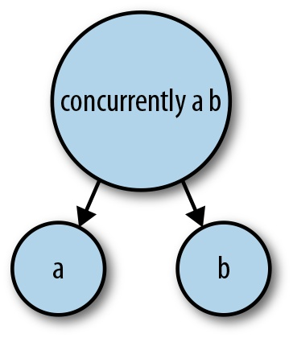

## Chapter 11. Higher-Level Concurrency Abstractions

The preceding sections covered the basic interfaces for writing concurrent code in Haskell. These are enough for simple tasks, but for larger and more complex programs we need to raise the level of abstraction.

The previous chapters developed the `Async` interface for performing operations asynchronously and waiting for the results. In this chapter, we will be revisiting that interface and expanding it with some more sophisticated functionality. In particular, we will provide a way to create an `Async` that is automatically cancelled if its parent dies and then use this to build more compositional functionality.

What we are aiming for is the ability to build *trees of threads*, such that when a thread dies for whatever reason, two things happen: any children it has are automatically terminated, and its parent is informed. Thus the tree is always collapsed from the bottom up, and no threads are ever left running accidentally. Furthermore, all threads are given a chance to clean up when they die, by handling exceptions.

## Avoiding Thread Leakage

Let’s review the last version of the `Async` API that we encountered from Async Revisited:

```
data Async

async        :: IO a -> IO (Async a)
cancel       :: Async a -> IO ()

waitCatchSTM :: Async a -> STM (Either SomeException a)
waitCatch    :: Async a -> IO (Either SomeException a)

waitSTM      :: Async a -> STM a
wait         :: Async a -> IO a

waitEither   :: Async a -> Async b -> IO (Either a b)
```

Now we’ll define a way to create an `Async` that is automatically cancelled if the current thread dies. A good motivation for this arises from the example we had in Error Handling with Async, *geturls4.hs*, which contains the following code:

```
main = do
  a1 <- async (getURL "http://www.wikipedia.org/wiki/Shovel")
  a2 <- async (getURL "http://www.wikipedia.org/wiki/Spade")
  r1 <- wait a1
  r2 <- wait a2
  print (B.length r1, B.length r2)
```

Consider what happens when the first `Async`, `a1`, fails with an exception. The first `wait` operation throws the same exception, which gets propagated up to the top of `main`, resulting in program termination. But this is untidy: we left `a2` running, and if this had been deep in a program, we would be not only leaking a thread, but also leaving some I/O running in the background.

What we would like to do is create an `Async` and install an exception handler that cancels the `Async` should an exception be raised. This is a typical resource acquire/release pattern, and Haskell has a good abstraction for that: the `bracket` function. Here is the general pattern:

```
  bracket (async io) cancel operation
```

Here, *`io`* is the IO action to perform asynchronously and *`operation`* is the code to execute while *`io`* is running. Typically, *`operation`* will include a `wait` to get the result of the `Async`. For example, we could rewrite *geturls4.hs* in this way:

```
main = do
  bracket (async (getURL "http://www.wikipedia.org/wiki/Shovel"))
          cancel $ \a1 -> do
  bracket (async (getURL "http://www.wikipedia.org/wiki/Shovel"))
          cancel $ \a2 -> do
  r1 <- wait a1
  r2 <- wait a2
  print (B.length r1, B.length r2)
```

But this is a bit of a mouthful. Let’s package up the `bracket` pattern into a function instead:

```
withAsync :: IO a -> (Async a -> IO b) -> IO b
withAsync io operation = bracket (async io) cancel operation
```

Now our `main` function becomes:

*geturls7.hs*

```
main =
  withAsync (getURL "http://www.wikipedia.org/wiki/Shovel") $ \a1 ->
  withAsync (getURL "http://www.wikipedia.org/wiki/Spade")  $ \a2 -> do
  r1 <- wait a1
  r2 <- wait a2
  print (B.length r1, B.length r2)
```

This is an improvement over *geturls6.hs*. Now the second `Async` is cleaned up if the first one fails.

## Symmetric Concurrency Combinators

Take another look at the example at the end of the previous section. The behavior in the event of failure is lopsided: if `a1` fails, then the alarm is raised immediately, but if `a2` fails, then the program waits for a result from `a1` before it notices the failure of `a2`. Ideally, we should be able to write this symmetrically so that we notice the failure of either `a1` or `a2`, whichever one happens first. This is somewhat like the `waitEither` operation that we defined earlier:

```
waitEither :: Async a -> Async b -> IO (Either a b)
```

But here we want to wait for *both* results and terminate early if either `Async` raises an exception. By analogy with `waitEither`, let’s call it `waitBoth`:

```
waitBoth :: Async a -> Async b -> IO (a,b)
```

Indeed, we can program `waitBoth` rather succinctly, thanks to STM’s `orElse` combinator:

```
waitBoth :: Async a -> Async b -> IO (a,b)
waitBoth a1 a2 =
  atomically $ do
    r1 <- waitSTM a1 `orElse` (do waitSTM a2; retry) -- ①
    r2 <- waitSTM a2
    return (r1,r2)
```

It is worth considering the different cases to convince yourself that line ① has the right behavior:

- If `a1` threw an exception, then the exception is re-thrown here (remember that if an `Async` results in an exception, it is re-thrown by `waitSTM`).

- If `a1` returned a result, then we proceed to the next line and wait for `a2`’s result.

- If `waitSTM a1` retries, then we enter the right side of `orElse`:

  - If `a2` threw an exception, then the exception is re-thrown here.
  - If `a2` returned a result, then we ignore it and call `retry`, so the whole transaction retries. This case might seem counterintuitive, but the purpose of calling `waitSTM a2` here was to check whether `a2` had thrown an exception. We aren’t interested in its result yet because we know that `a1` has still not completed.
  - If `waitSTM a2` retries, then the whole transaction retries.

Now, using `withAsync` and `waitBoth`, we can build a nice symmetric function that runs two `IO` actions concurrently but aborts if either one fails with an exception:

```
concurrently :: IO a -> IO b -> IO (a,b)
concurrently ioa iob =
  withAsync ioa $ \a ->
  withAsync iob $ \b ->
    waitBoth a b
```

Finally, we can rewrite *geturls7.hs* to use `concurrently`:

*geturls8.hs*

```
main = do
  (r1,r2) <- concurrently
               (getURL "http://www.wikipedia.org/wiki/Shovel")
               (getURL "http://www.wikipedia.org/wiki/Spade")
  print (B.length r1, B.length r2)
```

What if we wanted to download a list of URLs at the same time? The `concurrently` function takes only two arguments, but we can fold it over a list, provided that we use a small wrapper to rebuild the list of results:

*geturls9.hs*

```
main = do
  xs <- foldr conc (return []) (map getURL sites)
  print (map B.length xs)
 where
  conc ioa ioas = do
    (a,as) <- concurrently ioa ioas
    return (a:as)
```

The `concurrently` function has a companion; if we swap `waitBoth` for `waitEither`, we get a different but equally useful function:

```
race :: IO a -> IO b -> IO (Either a b)
race ioa iob =
  withAsync ioa $ \a ->
  withAsync iob $ \b ->
    waitEither a b
```

The `race` function runs two `IO` actions concurrently, but as soon as one of them returns a result or throws an exception, the other is immediately cancelled. Hence the name `race`: the two `IO` actions are racing to produce a result. As we shall see later, `race` is quite useful when we need to fork two threads while letting either one terminate the other by just returning.

These two functions, `race` and `concurrently`, are the essence of constructing trees of threads. Each builds a structure like Figure 11-1.



Figure 11-1. Threads created by concurrently

By using multiple `race` and `concurrently` calls, we can build up larger trees of threads. If we use these functions consistently, we can be sure that the tree of threads constructed will always be collapsed from the bottom up:

- If a parent throws an exception or receives an asynchronous exception, then the children are automatically cancelled. This happens recursively. If the children have children themselves, then they will also be cancelled, and so on.
- If one child receives an exception, then its sibling is also cancelled.
- The parent chooses whether to wait for a result from both children or just one, by using `race` or `concurrently`, respectively.

What is particularly nice about this way of building thread trees is that there is no explicit representation of the tree as a data structure, which would involve a lot of bookkeeping and would likely be prone to errors. The thread tree is completely implicit in the structure of the calls to `withAsync` and hence `concurrently` and `race`.

### Timeouts Using race

A simple demonstration of the power of `race` is an implementation of the `timeout` function from Timeouts.

*timeout2.hs*

```
timeout :: Int -> IO a -> IO (Maybe a)
timeout n m
    | n <  0    = fmap Just m
    | n == 0    = return Nothing
    | otherwise = do
        r <- race (threadDelay n) m
        case r of
          Left _  -> return Nothing
          Right a -> return (Just a)
```

Most of the code here is administrative: checking for negative and zero timeout values and converting the `Either () a` result of `race` into a `Maybe a`. The core of the implementation is simply `race (threadDelay n) m`.

Pedantically speaking, this implementation of `timeout` does have a few differences from the one in Timeouts. First, it doesn’t have precisely the same semantics in the case where another thread sends the current thread an exception using `throwTo`. With the original `timeout`, the exception would be delivered to the computation `m`, whereas here the exception is delivered to `race`, which then terminates `m` with `killThread`, and so the exception seen by `m` will be `ThreadKilled`, not the original one that was thrown.

Secondly, the exception thrown to `m` in the case of a timeout is `ThreadKilled`, not a special `Timeout` exception. This might be important if the thread wanted to act on the `Timeout` exception.

Finally, `race` creates an extra thread, which makes this implementation of `timeout` a little less efficient than the one in Timeouts. You won’t notice the difference unless `timeout` is in a critical path in your application, though.

## Adding a Functor Instance

When an `Async` is created, it has a fixed result type corresponding to the type of the value returned by the `IO` action. But this might be inconvenient: suppose we need to wait for several different `Async`s that have different result types. We would like to emulate the `waitAny` function defined in Async Revisited:

```
waitAny :: [Async a] -> IO a
waitAny asyncs =
  atomically $ foldr orElse retry $ map waitSTM asyncs
```

But if our `Async`s don’t all have the same result type, then we can’t put them in a list. We could force them all to have the same type when they are created, but that might be difficult, especially if we use an `Async` created by a library function that is not under our control.

A better solution to the problem is to make `Async` an instance of `Functor`:

```
class Functor f where
    fmap :: (a -> b) -> f a -> f b
```

The `fmap` operation lets us map the result of an `Async` into any type we need.

But how can we implement `fmap` for `Async`? The type of the result that the `Async` will place in the `TMVar` is fixed when we create the `Async`; the definition of `Async` is the following:

```
data Async a = Async ThreadId (TMVar (Either SomeException a))
```

Instead of storing the `TMVar` in the `Async`, we need to store something more compositional that we can compose with the function argument to `fmap` to change the result type. One solution is to replace the `TMVar` with an `STM` computation that returns the same type:

```
data Async a = Async ThreadId (STM (Either SomeException a))
```

The change is very minor. We only need to move the `readTMVar` call from `waitCatchSTM` to `async`:

```
async :: IO a -> IO (Async a)
async action = do
  var <- newEmptyTMVarIO
  t <- forkFinally action (atomically . putTMVar var)
  return (Async t (readTMVar var))
```

```
waitCatchSTM :: Async a -> STM (Either SomeException a)
waitCatchSTM (Async _ stm) = stm
```

And now we can define `fmap` by building a new `STM` computation that is composed from the old one by applying the function argument of `fmap` to the result:

```
instance Functor Async where
  fmap f (Async t stm) = Async t stm'
    where stm' = do
            r <- stm
            case r of
              Left e  -> return (Left e)
              Right a -> return (Right (f a))
```

## Summary: The Async API

We visited the `Async` API several times during the course of the previous few chapters, each time evolving it to add a new feature or to fix some undesirable behavior. The addition of the `Functor` instance in the previous section represents the last addition I’ll be making to `Async` in this book, so it seems like a good point to take a step back and summarize what has been achieved:

- We started with a simple API to execute an `IO` action asynchronously (`async`) and wait for its result (`wait`).
- We modified the implementation to catch exceptions in the asynchronous code and propagate them to the `wait` call. This avoids a common error in concurrent programming: forgetting to handle errors in a child thread.
- We reimplemented the `Async` API using STM, which made it possible to have efficient implementations of combinators that symmetrically wait for multiple `Async`s to complete (`waitEither`, `waitBoth`).
- We added `withAsync`, which avoids the accidental leakage of threads when an exception occurs in the parent thread, thus avoiding another common pitfall in concurrent programming.
- Finally, we combined `withAsync` with `waitEither` and `waitBoth` to make the high-level symmetric combinators `race` and `concurrently`. These two operations can be used to build trees of threads that are always collapsed from the bottom up and to propagate errors correctly.

The complete library is available in the `async` package on Hackage.