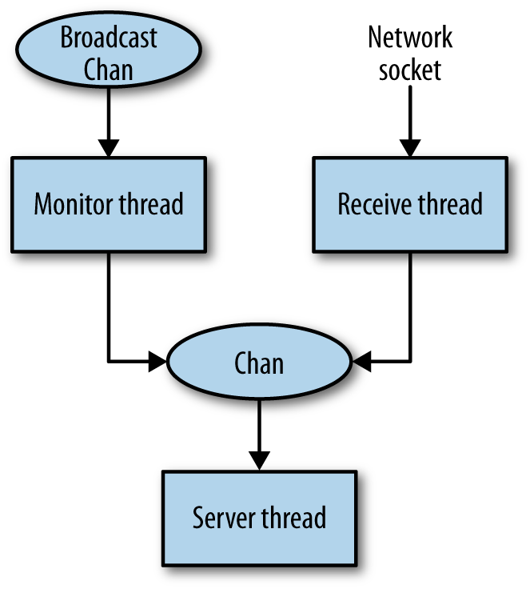
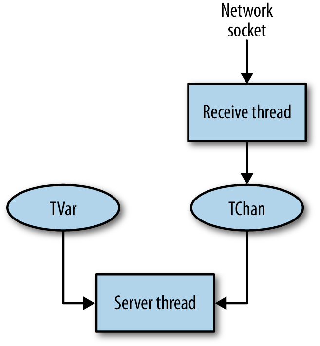

## Chapter 12. Concurrent Network Servers

Server-type applications that communicate with many clients simultaneously demand both a high degree of concurrency and high performance from the I/O subsystem. A good web server should be able to handle hundreds of thousands of concurrent connections and service tens of thousands of requests per second.

Ideally, we would like to write these kinds of applications using threads. A thread is the right abstraction. It allows the developer to focus on programming the interaction with a single client and then to lift this interaction to multiple clients by simply forking many instances of the single-client interaction in separate threads. In this chapter, we explore this idea by developing a series of server applications, starting from a trivial server with no interaction between clients, then adding some shared state, and finally building a chat server with state and inter-client interaction.

Along the way, we will need to draw on many of the concepts from previous chapters. We’ll discuss the design of the server using both `MVar` and STM, how to handle failure, and building groups of threads using the abstractions introduced in Symmetric Concurrency Combinators.

## A Trivial Server

In this section, we will consider how to build a simple network server with the following behavior:

- The server accepts connections from clients on port 44444.
- If a client sends an integer *n*, then the service responds with the value of *2n*.
- If a client sends the string `"end"`, then the server closes the connection.

First, we program the interaction with a single client. The function `talk` defined below takes a `Handle` for communicating with the client. The `Handle` will be bound to a network socket so that data sent by the client can be read from the `Handle`, and data written to the `Handle` will be sent to the client.

*server.hs*

```
talk :: Handle -> IO ()
talk h = do
  hSetBuffering h LineBuffering                                -- ①
  loop                                                         -- ②
 where
  loop = do
    line <- hGetLine h                                         -- ③
    if line == "end"                                           -- ④
       then hPutStrLn h ("Thank you for using the " ++         -- ⑤
                         "Haskell doubling service.")
       else do hPutStrLn h (show (2 * (read line :: Integer))) -- ⑥
               loop                                            -- ⑦
```

①  
First, we set the buffering mode for the `Handle` to line buffering. If we don’t, output sent to the `Handle` will be buffered up by the I/O layer until there is a full block (which is more efficient for large transfers, but not useful for interactive applications).

②  
We enter a loop to respond to requests from the client.

③  
Each iteration of the loop reads a new line of text.

④  
Then it checks whether the client sent `"end"`.

⑤  
If so, we emit a polite message and return.

⑥  
If not, we attempt to interpret the line as an integer and to write the value obtained by doubling it.

⑦  
Finally, we call `loop` again to read the next request.

Having dealt with the interaction with a single client, we can now make this into a multiclient server using concurrency. The `main` function for our server is as follows:

```
main = withSocketsDo $ do
  sock <- listenOn (PortNumber (fromIntegral port))              -- ①
  printf "Listening on port %d\n" port
  forever $ do                                                   -- ②
     (handle, host, port) <- accept sock                         -- ③
     printf "Accepted connection from %s: %s\n" host (show port)
     forkFinally (talk handle) (\_ -> hClose handle)             -- ④

port :: Int
port = 44444
```

①  
First, we create a network socket to listen on port 44444.

②  
Then we enter a loop to accept connections from clients.

③  
This line waits for a new client connection. The `accept` operation blocks until a connection request from a client arrives and then returns a `Handle` for communicating with the client (here bound to `handle`) and some information about the client. Here we bind `host` to the client’s hostname and `port` to the local port that accepted the connection but use the variables just to log information to the console.

④  
Next, we call `forkFinally` to create a new thread to handle the request. The interaction with the client is delegated to the function `talk` that we defined above, to which we pass the `handle` returned by the `accept` call. We defined `forkFinally` back in Catching Asynchronous Exceptions.^(\[43\]) It is used here to ensure that the `Handle` is always closed in the event of an exception in the server thread. If we didn’t do this, then GHC’s garbage collector would eventually close the `Handle` for us, but it might take a while, and we might run out of `Handle`s in the meantime (there is usually a fixed limit imposed by the operating system on the number of open `Handle`s).

Having forked a thread to handle this client, the main thread then goes back to accepting more connections. All the active client connections and the main thread run concurrently with each other, so the fact that the server is handling multiple clients will be invisible to any individual client.

So making our concurrent server was simple—we did not have to change the single-client code at all, and the code to lift it to a concurrent server was only a handful of lines. We can verify that it works by starting the server in one window:

```
$ ./server
```

In another window, we start a client and try a single request. We send 22 and get 44 in return.^(\[44\])

```
$ nc localhost 44444
22
44
```

Next, we leave this client running and start another client:

```
$ ghc -e 'mapM_ print [1..]' | nc localhost 44444
2
4
6
...
```

This client exercises the server a bit more by sending it a continuous stream of numbers to double. For fun, try starting a few of these. Meanwhile we can switch back to our first client and observe that it is still being serviced:

```
$ nc localhost 44444
22
44
33
66
```

Finally, we can end a single client’s interaction by typing `end`:

```
end
Thank you for using the Haskell doubling service.
```

This was just a simple example, but the same ideas underlie several high-performance web server implementations in Haskell. Furthermore, with no additional effort at all, the same server code can make use of multiple cores simply by compiling with `-threaded` and running with `+RTS -N`.

There are two technologies that make this structure feasible in Haskell:

- GHC’s very lightweight threads mean that having one thread per client is practical.
- GHC’s I/O libraries employ an I/O manager thread that multiplexes all the ongoing I/O requests using efficient operating system primitives such as `epoll` on Linux. Thus applications with lots of lightweight threads, all doing I/O simultaneously, perform very well.

Were it not for lightweight threads and the I/O manager, we would have to resort to collapsing the structure into a single event loop (or worse, multiple event loops to take advantage of multiple cores). The event loop style loses the single-client abstraction. Instead, all clients have to be dealt with simultaneously, which can be complicated if there are different kinds of clients with different behaviors. Furthermore, we have to represent the state of each client somehow, rather than just writing the straight-line code as we did in `talk` earlier. Imagine extending `talk` to implement a more elaborate protocol with several states—it would be reasonably straightforward with the single-client abstraction, but if we had to represent each state and the transitions explicitly, things would quickly get complicated.

We ignored many details that would be necessary in a real server application. The reader is encouraged to think about these and try implementing any required changes on top of the provided sample code:

- What happens if the user interrupts the server with Ctrl+C? (Ctrl+C is implemented by sending an asynchronous `Interrupted` exception to the main thread.)
- What happens in `talk` if the line does not parse as a number?
- What happens if the client cuts the connection prematurely or the network goes down?
- Should there be a limit on the number of clients we serve simultaneously?
- Can we log the activity of the server to a file?

## Extending the Simple Server with State

Next, we’ll extend the simple server from the previous section to include some state that is shared amongst the clients and may be changed by client actions.

The new behavior is as follows: instead of multiplying each number by two, the server will multiply each number by the *current factor*. Any connected client can change the current factor by sending the command `*`*`N`*, where *`N`* is an integer. When a client changes the factor, the server sends a message to all the other connected clients informing them of the change.

While this seems like a small change in behavior, it introduces some interesting new challenges in designing the server.

- There is a shared state—the current factor—so we must decide how to store it and how it is accessed and modified.
- When one server thread changes the state in response to its client issuing the `*`*`N`* command, we must arrange to send a message to all the connected clients.

Let’s explore the design space, taking as a given that we want to serve each client from a separate thread on the server. Over the following sections, I’ll outline four possible designs and explain the pros and cons of each one.

### Design One: One Giant Lock

This is the simplest approach. The state of the server is stored under a single `MVar` and looks something like this:

```
data State = State {
  currentFactor :: Int,
  clientHandles :: [Handle]
 }

newtype StateVar = StateVar (MVar State)
```

Note that the state contains all the `Handle`s of the connected clients. This is so that if a server thread receives a factor-change command from its client, it can notify all the other clients of the change by writing a message to their `Handle`.

However, we have to be careful. If multiple threads write to a `Handle` simultaneously, the messages might get interleaved in an arbitrary way. To make sure messages don’t get interleaved, we can use the `MVar` as a lock. But this means that every server thread, when it needs to send a message to its client, must hold the `MVar` while sending the message.

Clearly, the disadvantage of this model is that there will be lots of contention for the shared `MVar`, since even when clients are not interacting with each other, they still have to take the lock. This design does not have enough concurrency.

Note that we can’t reduce contention by using finer-grained locking here because the combination of modifying the state and informing all the clients must be atomic. Otherwise, the notifications created by multiple factor-change commands could interleave with one another and clients may end up being misled about the current factor value.

### Design Two: One Chan Per Server Thread

To add more concurrency, we want to design the system so that each server thread can communicate with its client privately without interacting with the other server threads. Therefore, the `Handle` for communicating with the client must be private to each server thread.

The factor-change command still has to notify all the clients, but since the server thread is the only thread allowed to communicate with a client, we must send a message to all the server threads when a factor-change occurs. Therefore, each server thread must have a `Chan` on which it receives messages.

The types in this setup would look like this:

```
data State = State {
  clientChans :: [Chan Message]
 }

data Message
  = FactorChange Int
  | ClientInput String

newtype StateVar = StateVar (MVar State)
```

There are two kinds of events that a server thread can act upon: a factor-change event from another server thread or a line of input from the client. Therefore, we make a `Message` type to combine these two events so that the `Chan` can carry either. How do the `ClientInput` events get generated? We need another thread for each server thread whose sole job it is to receive lines of input from the client’s `Handle` and forward them to the `Chan` in the form of `ClientInput` events. I’ll call this the “receive thread.”

This design is an improvement over the first design, although it does still have one drawback. A server thread that receives a factor-change command must iterate over the whole list of `Chan`s sending a message to each one, and this must be done with the lock held, again for atomicity reasons. Furthermore, we have to keep the list of `Chan`s up to date when clients connect and disconnect.

### Design Three: Use a Broadcast Chan

To solve the issue that notifying all the clients requires a possibly expensive walk over the list of `Chan`s, we can use a broadcast channel instead, where a broadcast channel is an ordinary `Chan` that we create a copy of for each server thread using `dupChan` (see MVar as a Building Block: Unbounded Channels). When an item is written to the broadcast channel, it will appear on all the copies.

So in this design, the only shared state we need is a single broadcast channel, which doesn’t even need to be stored in an `MVar` (because it never changes). The messages sent on the broadcast channel are new factor values. Because all server threads will see messages on this channel in the same order, they all have a consistent view of the state.

```
newtype State = State { broadcastChan :: Chan Int }
```

However, there is one wrinkle with this design. The server thread must listen both for events on the broadcast channel and for input from the client. To merge these two kinds of events, we’ll need a `Chan` as in the previous design, a receive thread to forward the client’s input, and another thread to forward messages from the broadcast channel. Hence this design needs a total of three threads per client. The setup is summarized by the diagram in Figure 12-1.



Figure 12-1. Server structure with Chan

### Design Four: Use STM

We can improve on the previous design further by using STM. With STM, we can avoid the broadcast channel by storing the current factor in a single shared `TVar`:

```
newtype State = State { currentFactor :: TVar Int }
```

An STM transaction can watch for changes in the `TVar`’s value using the technique that we saw in Blocking Until Something Changes, so we don’t need to explicitly send messages when it changes.

Furthermore, as we saw in Merging with STM, we can merge multiple sources of events in STM without using extra threads. We do need a receive thread to forward input from the client because an STM transaction can’t wait for IO, but that’s all. This design needs two threads per client. The overall structure is depicted in Figure 12-2.



Figure 12-2. Server structure with STM

For concreteness, let’s walk through the sequence of events that take place in this setup when a client issues a `*`*`N`* command:

- The receive thread reads the `*`*`N`* command from the `Handle`, and forwards it to the server thread’s `TChan`.
- The server thread receives the command on its `TChan` and modifies the shared `TVar` containing the current factor.
- The change of value in the `TVar` is noticed by the other server threads, which all report the new value to their respective clients.

### The Implementation

STM results in the simplest architecture, so we’ll develop our solution using that. First, the `main` function, which has a couple of changes compared with the previous version:

*server2.hs*

```
main = withSocketsDo $ do
  sock <- listenOn (PortNumber (fromIntegral port))
  printf "Listening on port %d\n" port
  factor <- atomically $ newTVar 2                               -- ①
  forever $ do
    (handle, host, port) <- accept sock
    printf "Accepted connection from %s: %s\n" host (show port)
    forkFinally (talk handle factor) (\_ -> hClose handle)       -- ②

port :: Int
port = 44444
```

①  
Here, we create the `TVar` that contains the current factor and initialize its value to 2.

②  
The `talk` function now takes the factor `TVar` as an additional argument.

The talk function sets up the threads to handle the new client connection:

```
talk :: Handle -> TVar Integer -> IO ()
talk h factor = do
  hSetBuffering h LineBuffering
  c <- atomically newTChan                -- ①
  race (server h factor c) (receive h c)  -- ②
  return ()
```

①  
Creates the new `TChan` that will carry the messages from the receive thread.

②  
Creates the `server` and `receive` threads. (The `server` and `receive` functions will be defined shortly.) Note that we are using `race` from Symmetric Concurrency Combinators. `race` is particularly useful here because we want to set up a sibling relationship between the two threads. If either thread fails for any reason, then we want to cancel the other thread and raise the exception, which will cause the client connection to be cleanly shut down. Furthermore, `race` gives us the ability to terminate one thread by simply returning from the other. We don’t intend the `receive` thread to ever voluntarily terminate, but it is useful to be able to shut down cleanly by just returning from the `server` thread.

The `receive` function repeatedly reads a line from the `Handle` and writes it to the `TChan`:

```
receive :: Handle -> TChan String -> IO ()
receive h c = forever $ do
  line <- hGetLine h
  atomically $ writeTChan c line
```

Next, we have the `server` thread, where most of the application logic resides.

```
server :: Handle -> TVar Integer -> TChan String -> IO ()
server h factor c = do
  f <- atomically $ readTVar factor     -- ①
  hPrintf h "Current factor: %d\n" f    -- ②
  loop f                                -- ③
 where
  loop f = do
    action <- atomically $ do           -- ④
      f' <- readTVar factor             -- ⑤
      if (f /= f')                      -- ⑥
         then return (newfactor f')     -- ⑦
         else do
           l <- readTChan c             -- ⑧
           return (command f l)         -- ⑨
    action

  newfactor f = do                      -- ⑩
    hPrintf h "new factor: %d\n" f
    loop f

  command f s                           -- ⑪
   = case s of
      "end" ->
        hPutStrLn h ("Thank you for using the " ++
                     "Haskell doubling service.")         -- ⑫
      '*':s -> do
        atomically $ writeTVar factor (read s :: Integer) -- ⑬
        loop f
      line  -> do
        hPutStrLn h (show (f * (read line :: Integer)))
        loop f
```

①  
Read the current value of the factor.

②  
Report the current factor value to the client.

③  
Then we enter the `loop`.

④  
The overall structure is as follows: `loop` waits for the next event, which is either a change in the factor or a command from the client, and calls `newfactor` or `command`, respectively. The `newfactor` and `command` functions take whatever action is necessary and then call back to `loop` to process the next event. The `loop` function itself is implemented as an STM transaction that returns an `IO` `action`, which is then performed. This is a common pattern in STM. Since we can’t invoke `IO` from inside `STM`, the transaction instead returns an `IO` action which is invoked by the caller of `atomically`.^(\[45\])

⑤  
In the transaction, first we read the current factor.

⑥  
Next, we compare it against the value we previously read, in `f`.

⑦  
If the two are different, indicating that the factor has been changed, then we call the `newfactor` function.

⑧  
If the factor has not been changed, we read from the `TChan`. This may `retry` if the channel is empty, but note that in the event of a `retry`, the transaction will be re-executed if either the `factor` `TVar` *or* the `TChan` changes. You can think of this transaction as a composition of two blocking operations: waiting for the factor `TVar` to change, and reading from the `TChan`. But we can code it without `orElse` thanks to the following equality:

```
  (if A then retry else B) `orElse` C  ==>  if A then C else B
```

(Convince yourself that the two versions do the same thing, and also consider why it isn’t possible to *always* transform away an `orElse`). Sometimes it isn’t necessary to use `orElse` to compose blocking operations in STM.

⑨  
Having read a line of input from the `TChan`, we call `command` to act upon it.

⑩  
The `newfactor` function reports the change in factor to the client and continues with `loop.`

⑪  
The `command` function executes a command received from the client.

⑫  
If the client said `end`, then we terminate the connection by simply returning, instead of recursively calling `loop`. As mentioned earlier, this will cause `race` to terminate the `receive` thread.

⑬  
If the client requests a change in factor, then we update the global factor value and call `loop`, *passing the old factor value*. Thus the transaction will immediately notice the change in factor and report it, giving the client confirmation that the factor was changed.

Try this server yourself by compiling and running the `server2.hs` program. Start up a few clients with the `nc` program (or another suitable telnet-style application) and check that it is working as expected. Test the error handling: what happens when you close the client connection without sending the `end` command, or if you send a non-number? You might want to add some additional debugging output to various parts of the program in order to track more clearly what is happening.

## A Chat Server

Continuing on from the simple server examples in the previous sections, we now consider a more realistic example: a network chat server. A chat server enables multiple clients to connect and type messages to one another interactively. Real chat servers (e.g., IRC) have multiple channels and allow clients to choose which channels to participate in. For simplicity, we will be building a chat server that has a single channel, whereby every message is seen by every client.

The informal specification for the server is as follows:

- When a client connects, the server requests the name that the client will be using. The client must choose a name that is not currently in use; otherwise, the server will request that the user choose a different name.

- Each line received from the client is interpreted as a command, which is one of the following:

   `/tell` *`name message`*  
  Sends *`message`* to the user *`name`*.

   `/kick` *`name`*  
  Disconnects user *`name`*.^(\[46\])

   `/quit`  
  Disconnects the current client.

   *`message`*  
  Any other string (not beginning with `/`) is broadcast as a message to all the connected clients.

- Whenever a client connects or disconnects, all other connected clients are notified.

- We will be handling errors correctly and aiming for consistent behavior. For example, when two clients connect at the same time, one of them is always deemed to have connected first and gets notified about the other client connecting.

- If two clients simultaneously try to kick each other, only one of them will succeed. This may seem obvious, but as we shall see it is easy to get this wrong.

### Architecture

As in the factor example of the previous section, the requirements dictate that a server thread must act on events from multiple sources: input from the client over the network, `/tell` messages and broadcasts from other clients, being kicked by another client, and clients connecting or disconnecting,

The basic architecture will be similar. We need a receive thread to forward the network input into a `TChan` and a server thread to wait for the different kinds of events and act upon them. Compared to the previous example, though, we have a lot more shared state. A client needs to be able to send messages to any other client, so the set of clients and their corresponding `TChan`s must be shared.

We should consider how to handle `/kick` because we want to guarantee that two clients cannot simultaneously kick each other. This implies some synchronized, shared state for each client to indicate whether it has been kicked. A server thread can then check that it has not already been kicked itself before kicking another client. To inform the victim that it has been kicked, we could send a message to its `TChan`, but because we are using STM, we might as well just watch the global state for changes as we did in the factor example in the previous section.

Next, we need to consider how the various events (apart from `/kick`) arrive at the server thread. There is input from the client over the network and also messages from other clients to be sent back to this client. We could use separate `TChan`s for the different kinds of events, but it is slightly better to use just one; the ordering on events is retained, which makes things more predictable for the client. So the design we have so far is a `TVar` to indicate whether the client has been kicked and a `TChan` to carry both network input and events from other clients.

### Client Data

Now that we have established the main architectural design, we can fill in the details. In the previous examples, we passed around the various pieces of state explicitly, but now that things are more complicated, it will help to separate the state into the global server state and the per-client state. The per-client state is defined as follows:

*chat.hs*

```
type ClientName = String

data Client = Client
  { clientName     :: ClientName
  , clientHandle   :: Handle
  , clientKicked   :: TVar (Maybe String)
  , clientSendChan :: TChan Message
  }
```

We have one `TVar` indicating whether this client has been kicked (`clientKicked`). Normally, this `TVar` contains `Nothing`, but after the client is kicked, the `TVar` contains `Just s`, where `s` is a string describing the reason for the client being kicked.

The `TChan` `clientSendChan` carries all the other messages that may be sent to a client. These have type `Message`:

```
data Message = Notice String
             | Tell ClientName String
             | Broadcast ClientName String
             | Command String
```

Where, respectively: `Notice` is a message from the server, `Tell` is a private message from another client, `Broadcast` is a public message from another client, and `Command` is a line of text received from the user (via the receive thread).

We need a way to construct a new instance of `Client`, which is Straightforward:

```
newClient :: ClientName -> Handle -> STM Client
newClient name handle = do
  c <- newTChan
  k <- newTVar Nothing
  return Client { clientName     = name
                , clientHandle   = handle
                , clientSendChan = c
                , clientKicked   = k
                }
```

Next, we define a useful function for sending a `Message` to a given `Client`:

```
sendMessage :: Client -> Message -> STM ()
sendMessage Client{..} msg =
  writeTChan clientSendChan msg
```

The syntax `Client{..}` is a *record wildcard* pattern, which brings into scope all the fields of the `Client` record with their declared names. In this case, we are using only `clientSendChan`, but when there are lots of fields it is a convenient shorthand, so we will be using it quite often from here on. (Remember to enable the `RecordWildCards` extension to use this syntax.)

Note that this function is in the `STM` monad, not `IO`. We will be using it inside some STM transactions later.

### Server Data

The data structure that stores the server state is just a `TVar` containing a mapping from `ClientName` to `Client`.

```
data Server = Server
  { clients :: TVar (Map ClientName Client)
  }

newServer :: IO Server
newServer = do
  c <- newTVarIO Map.empty
  return Server { clients = c }
```

This state must be accessible from all the clients, because each client needs to be able to broadcast to all the others. Furthermore, new clients need to ensure that they are choosing a username that is not already in use and hence the set of active usernames is shared knowledge.

Here is how we broadcast a `Message` to all the clients:

```
broadcast :: Server -> Message -> STM ()
broadcast Server{..} msg = do
  clientmap <- readTVar clients
  mapM_ (\client -> sendMessage client msg) (Map.elems clientmap)
```

### The Server

Now we will work top-down and write the code of the server. The `main` function is almost identical to the one in the previous section:

```
main :: IO ()
main = withSocketsDo $ do
  server <- newServer
  sock <- listenOn (PortNumber (fromIntegral port))
  printf "Listening on port %d\n" port
  forever $ do
      (handle, host, port) <- accept sock
      printf "Accepted connection from %s: %s\n" host (show port)
      forkFinally (talk handle server) (\_ -> hClose handle)

port :: Int
port = 44444
```

The only difference is that we create a new empty server state up front by calling `newServer` and pass this to each new client as an argument to `talk`.

### Setting Up a New Client

When a new client connects, we need to do the following tasks:

- Ask the client for a username.
- If the username already exists, ask the client to choose another name.
- Otherwise, create a new `Client` and insert it into the `Server` state, ensuring that the `Client` will be removed when it disconnects or any failure occurs.
- Notify all existing clients that the new client has connected.
- Set up the threads to handle the client connection and start processing messages.

Let’s start by defining an auxiliary function `checkAddClient`, which takes a username and attempts to add a new client with that name to the state, returning `Nothing` if a client with that name already exists, or `Just client` if the addition was successful. It also broadcasts the event to all the other connected clients:

```
checkAddClient :: Server -> ClientName -> Handle -> IO (Maybe Client)
checkAddClient server@Server{..} name handle = atomically $ do
  clientmap <- readTVar clients
  if Map.member name clientmap
    then return Nothing
    else do client <- newClient name handle
            writeTVar clients $ Map.insert name client clientmap
            broadcast server  $ Notice (name ++ " has connected")
            return (Just client)
```

And we will need a corresponding `removeClient` that removes the client again:

```
removeClient :: Server -> ClientName -> IO ()
removeClient server@Server{..} name = atomically $ do
  modifyTVar' clients $ Map.delete name
  broadcast server $ Notice (name ++ " has disconnected")
```

Now we can put the pieces together. Unfortunately we can’t reach for the usual tool for these situations, namely `bracket`, because our “resource acquisition” (`checkAddClient`) is conditional. So we need to write the code out explicitly:

```
talk :: Handle -> Server -> IO ()
talk handle server@Server{..} = do
  hSetNewlineMode handle universalNewlineMode
      -- Swallow carriage returns sent by telnet clients
  hSetBuffering handle LineBuffering
  readName
 where
  readName = do
    hPutStrLn handle "What is your name?"
    name <- hGetLine handle
    if null name
      then readName
      else do
             ok <- checkAddClient server name handle -- ①
             case ok of
               Nothing -> do                         -- ②
                  hPrintf handle
                     "The name %s is in use, please choose another\n" name
                  readName
               Just client ->                        -- ③
                  runClient server client
                      `finally` removeClient server name
```

①  
After reading the requested username from the client, we attempt to add it to the server state with `checkAddClient`.

②  
If we were unsuccessful, then print a message to the client, and recursively call `readName` to read another name.

③  
If we were successful, then call a function named `runClient` (to be defined shortly) to handle the client interaction and use `finally` to arrange that whatever happens, we eventually call `removeClient` to remove this client from the state.

This is *almost* right, but strictly speaking we should mask asynchronous exceptions to eliminate the possibility that an exception is received just after `checkAddClient` but before `runClient`, which would leave a stale client in the state. This is what `bracket` would have done for us, but because we’re rolling our own logic here, we have to handle the exception safety, too (for reference, the definition of `bracket` is given in Asynchronous Exception Safety for Channels).

The correct version of `readName` is as follows:

```
  readName = do
    hPutStrLn handle "What is your name?"
    name <- hGetLine handle
    if null name
      then readName
      else mask $ \restore -> do        -- ①
             ok <- checkAddClient server name handle
             case ok of
               Nothing -> restore $ do  -- ②
                  hPrintf handle
                     "The name %s is in use, please choose another\n" name
                  readName
               Just client ->
                  restore (runClient server client) -- ③
                      `finally` removeClient server name
```

①  
We `mask` asynchronous exceptions.

②  
We restore them again before trying again if the name was already in use.

③  
If the name is accepted, then we unmask asynchronous exceptions when calling `runClient` but being careful to do it inside the argument to `finally` so there’s no danger that a stale `Client` will be left in the state.

### Running the Client

Having initialized the client, created the `Client` data structure, and added it to the `Server` state, we now need to create the client threads themselves and start processing events. The main functionality of the client will be implemented in a function called `runClient`:

```
runClient :: Server -> Client -> IO ()
```

`runClient` returns or throws an exception only when the client is to be disconnected. Recall that we need two threads per client: a *receive* thread to read from the network socket and a *server* thread to listen for messages from other clients and to send messages back over the network. As before, we can use `race` to create the two threads with a sibling relationship so that if either thread returns or fails, the other will be cancelled.

```
runClient :: Server -> Client -> IO ()
runClient serv@Server{..} client@Client{..} = do
  race server receive
  return ()
 where
  receive = forever $ do
    msg <- hGetLine clientHandle
    atomically $ sendMessage client (Command msg)

  server = join $ atomically $ do
    k <- readTVar clientKicked
    case k of
      Just reason -> return $
        hPutStrLn clientHandle $ "You have been kicked: " ++ reason
      Nothing -> do
        msg <- readTChan clientSendChan
        return $ do
            continue <- handleMessage serv client msg
            when continue $ server
```

So `runClient` is just `race` applied to the `server` and `receive` threads. In the `receive` thread, we read one line at a time from the client’s `Handle` and forward it to the server thread as a `Command` message.

In the `server` thread, we have a transaction that tests two pieces of state: first, the `clientKicked` `TVar`, to see whether this client has been kicked. If it has not, then we take the next message from `clientSendChan` and act upon it. Note that this time, we have expressed `server` using `join` applied to the STM transaction: the `join` function is from `Control.Monad` and has the following type:

```
join :: Monad m => m (m a) -> m a
```

Here, `m` is instantiated to `IO`. The STM transaction returns an `IO` action, which is run by `join`, and in most cases this `IO` action returned will recursively invoke `server`.

The `handleMessage` function acts on a message and is entirely straightforward:

```
handleMessage :: Server -> Client -> Message -> IO Bool
handleMessage server client@Client{..} message =
  case message of
     Notice msg         -> output $ "*** " ++ msg
     Tell name msg      -> output $ "*" ++ name ++ "*: " ++ msg
     Broadcast name msg -> output $ "<" ++ name ++ ">: " ++ msg
     Command msg ->
       case words msg of
           ["/kick", who] -> do
               atomically $ kick server who clientName
               return True
           "/tell" : who : what -> do
               tell server client who (unwords what)
               return True
           ["/quit"] ->
               return False
           ('/':_):_ -> do
               hPutStrLn clientHandle $ "Unrecognized command: " ++ msg
               return True
           _ -> do
               atomically $ broadcast server $ Broadcast clientName msg
               return True
 where
   output s = do hPutStrLn clientHandle s; return True
```

Note that the function returns a `Bool` to indicate whether the caller should continue to handle more messages (`True`) or exit (`False`).

### Recap

We have now given most of the code for the chat server. The full code is less than 250 lines total, which is not at all bad considering that we have implemented a complete and usable chat server. Moreover, without changes the server will scale to many thousands of connections and can make use of multiple CPUs if they are available.

There were two tools that helped a lot here:

 `race`  
Helped to create threads that propagate errors to their parents and are automatically cancelled when their siblings terminate.

 STM  
Helped to build consistency properties, such as the requirement that two clients may not kick each other simultaneously, and helps when we need to handle multiple sources of events.

Care should be taken with STM with respect to performance, though. Take a look at the definition of `broadcast` in Server Data. It is an STM transaction that operates on an unbounded number of `TChan`s and thus builds an unbounded transaction. We noted earlier in Performance that long transactions should be avoided because they cost *O*(*n*²). Hence, `broadcast` should be reimplemented to avoid this. As an exercise, why not try to fix this yourself: one way to do it would be to use a broadcast channel.

  

------------------------------------------------------------------------

^(\[43\]) It is provided by `Control.Concurrent` in GHC 7.6.1 and later.

^(\[44\]) *nc* is the *netcat* program, which is useful for simple network interaction. You can also use `telnet` if `nc` is not available.

^(\[45\]) In fact, this pattern is more succinctly expressed using `Control.Monad.join`, but here it is written without `join` for clarity.

^(\[46\]) In real chat servers, this command would typically be available only to privileged users, but for simplicity here we will allow any user to kick any other user.