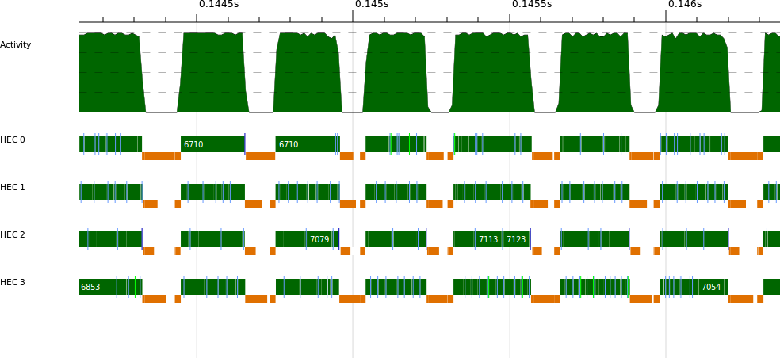
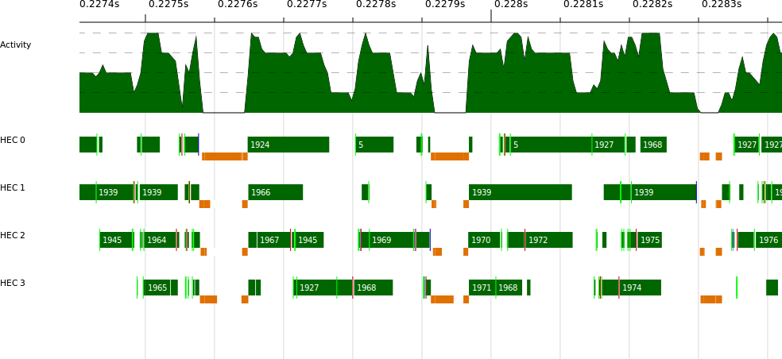

## Chapter 13. Parallel Programming Using Threads

We have been discussing concurrency as a means to modularize programs with multiple interactions. For instance, concurrency allows a network server to interact with a multitude of clients simultaneously while letting you separately write and maintain code that deals with only a single client at a time. Sometimes these interactions are batch-like operations that we want to overlap, such as when downloading multiple URLs simultaneously. There the goal was to speed up the program by overlapping the I/O, but it is not true parallelism because we don’t need multiple processors to achieve a speedup; the speedup was obtained by overlapping the time spent waiting for multiple web servers to respond.

But concurrency can also be used to achieve true parallelism. In this book, we have tried to emphasize the use of the parallel programming models—`Eval`, Strategies, the `Par` monad, and so on—for parallelism where possible, but there are some problems for which these pure parallel programming models cannot be used. These are the two main classes of problem:

- Problems where the work involves doing some I/O
- Algorithms that rely on some nondeterminism internally

Having side effects does not necessarily rule out the use of parallel programming models because Haskell has the `ST` monad for encapsulating side-effecting computations. However, it is typically difficult to use parallelism *within* the `ST` monad, and in that case probably the only solution is to drop down to concurrency unless your problem fits into the Repa model (Chapter 5).

## How to Achieve Parallelism with Concurrency

In many cases, you can achieve parallelism by forking a few threads to do the work. The `Async` API can help by propagating errors appropriately and cleaning up threads. As with the parallel programs we saw in Part I, you need to do two things to run a program on multiple cores:

- Compile the program with `-threaded`.
- Run the program with `+RTS -N`*`cores`* where *`cores`* is the number of cores to use, e.g., `+RTS -N2` to use two cores. Alternatively, use `+RTS -N` to use all the cores in your machine.

When multiple cores are available, the GHC runtime system automatically migrates threads between cores so that no cores are left idle. Its load-balancing algorithm isn’t very sophisticated, though, so don’t expect the scheduling policy to be fair, although it does try to ensure that threads do not get starved.

Many of the issues that we saw in Part I also arise when using concurrency to program parallelism; for example, static versus dynamic partitioning, and granularity. Forking a fixed number of threads will gain only a fixed amount of parallelism, so instead you probably want to fork plenty of threads to ensure that the program scales beyond a small number of cores. On the other hand, forking too many threads creates overhead that we want to avoid. The next section tackles these issues in the context of a concrete example.

## Example: Searching for Files

We start by considering how to parallelize a simple program that searches the filesystem for files with a particular name. The program takes a filename to search for and the root directory for the search as arguments, and prints either `Just p` if the file was found with pathname `p` or `Nothing` if it was not found.

This problem may be either I/O-bound or compute-bound, depending on whether the filesystem metadata is already cached in memory or not, but luckily the same solution will allow us to parallelize the work in both cases.

### Sequential Version

The search is implemented in a recursive function `find`, which takes the string to search for and the directory to start searching from, respectively, and returns a `Maybe FilePath` indicating whether the file was found (and its path) or not. The algorithm is a recursive walk over the filesystem, using the functions `getDirectoryContents` and `doesDirectoryExist` from `System.Directory`:

*findseq.hs*

```
find :: String -> FilePath -> IO (Maybe FilePath)
find s d = do
  fs <- getDirectoryContents d                         -- ①
  let fs' = sort $ filter (`notElem` [".",".."]) fs    -- ②
  if any (== s) fs'                                    -- ③
     then return (Just (d </> s))
     else loop fs'                                     -- ④
 where
  loop [] = return Nothing                             -- ⑤
  loop (f:fs)  = do
    let d' = d </> f                                   -- ⑥
    isdir <- doesDirectoryExist d'                     -- ⑦
    if isdir
       then do r <- find s d'                          -- ⑧
               case r of
                 Just _  -> return r                   -- ⑨
                 Nothing -> loop fs                    -- ⑩
       else loop fs                                    -- ⑪
```

①  
Read the list of filenames in the directory `d`.

②  
Filter out `"."` and `".."` (the two special entries corresponding to the current and the parent directory, respectively). We also `sort` the list so that the search is deterministic.

③  
If the filename we are looking for is in the current directory, then return the result: `d </> s` is the filename constructed by appending the filename `s` to the directory `d`.

④  
If the filename was not found, then loop over the filenames in the directory `d`, recursively searching each one that is a subdirectory.

⑤  
In the loop, if we reach the end of the list, then we did not find the file. Return `Nothing`.

⑥  
For a filename `f`, construct the full path `d </> f`.

⑦  
Ask whether this pathname corresponds to a directory.

⑧  
If it does, then make a recursive call to `find` to search the subdirectory.

⑨  
If the file was found in this subdirectory, then return the name.

⑩  
Otherwise, loop to search the rest of the subdirectories.

⑪  
If the name was not a directory, then loop again to search the rest.

The `main` function that wraps `find` into a program expects two command-line arguments and passes them as the arguments to `find`:

```
main :: IO ()
main = do
  [s,d] <- getArgs
  r <- find s d
  print r
```

To search a tree consisting of about 7 GB of source code on my computer, this program takes 1.14s when all the metadata is in the cache.^(\[47\]) The program isn’t as efficient as it could be. The system `find` program is about four times faster, mainly because the Haskell program is using the notoriously inefficient `String` type and doing Unicode conversion. If you were optimizing this program for real, it would obviously be important to fix these inefficiencies before trying to parallelize it, but we gloss over that here.

### Parallel Version

Parallelizing this program is not entirely straightforward because doing it naively could waste a lot of work; if we search multiple subdirectories concurrently and we find the file in one subdirectory, then we would like to stop searching the others as soon as possible. Moreover, if an error is encountered at any point, then we need to propagate the exception correctly. We must be careful to keep the deterministic behavior of the sequential version, too. If we encounter an error while searching a subtree, then the error should not prevent the return of a correct result if the sequential program would have done so.

To implement this, we’re going to use the `Async` API with its `withAsync` facility for creating threads and automatically cancelling them later. This is just what we need for spawning threads to search subtrees: the search threads should be automatically cancelled as soon as we have a result for a subtree.

Recall the type of `withAsync`:

```
withAsync :: IO a -> (Async a -> IO b) -> IO b
```

It takes the inner computation as its second argument. So to set off several searches in parallel, we have to nest multiple calls of `withAsync`. This implies a fold of some kind, and furthermore we need to collect up the `Async` values so we can wait for the results. The function we are going to fold is this:

```
subfind :: String -> FilePath
        -> ([Async (Maybe FilePath)] -> IO (Maybe FilePath))
        ->  [Async (Maybe FilePath)] -> IO (Maybe FilePath)

subfind s p inner asyncs = do
  isdir <- doesDirectoryExist p
  if not isdir
     then inner asyncs
     else withAsync (find s p) $ \a -> inner (a:asyncs)
```

The `subfind` function takes the string to search for, `s`, the path to search, `p`, the inner `IO` computation, `inner`, and the list of `Async`s, `asyncs`. If the path corresponds to a directory, we create a new `Async` to search it using `withAsync`, and inside `withAsync` we call `inner`, passing the original list of `Async`s with the new one prepended. If the pathname is not a directory, then we simply invoke the `inner` computation without creating a new `Async`.

Using this piece, we can now update the `find` function to create a new `Async` for each subdirectory:

*findpar.hs*

```
find :: String -> FilePath -> IO (Maybe FilePath)
find s d = do
  fs <- getDirectoryContents d
  let fs' = sort $ filter (`notElem` [".",".."]) fs
  if any (== s) fs'
     then return (Just (d </> s))
     else do
       let ps = map (d </>) fs'         -- ①
       foldr (subfind s) dowait ps []   -- ②
 where
   dowait as = loop (reverse as)        -- ③

   loop [] = return Nothing
   loop (a:as) = do                     -- ④
      r <- wait a
      case r of
        Nothing -> loop as
        Just a  -> return (Just a)
```

The differences from the previous `find` are as follows:

①  
Create the list of pathnames by prepending `d` to each filename.

②  
Fold `subfind` over the list of pathnames, creating the nested sequence of `withAsync` calls to create the child threads. The inner computation is the function `dowait`, defined next.

③  
`dowait` enters a loop to wait for each `Async` to finish, but first we must reverse the list. The fold generated the list in reverse order, and to make sure we retain the same behavior as the sequential version, we must check the results in the same order.

④  
The `loop` function loops over the list of `Async`s and calls `wait` for each one. If any of the `Async`s returns a `Just` result, then `loop` immediately returns it. Returning from here will cause all the `Async`s to be cancelled, as we return up through the nest of `withAsync` calls. Similarly, if an error occurs inside any of the `Async` computations, then the exception will propagate from the `wait` and cancel all the other `Async`s.

### Performance and Scaling

You might wonder whether creating a thread for every subdirectory is expensive, both in terms of time and space. Let’s compare `findseq` and `findpar` on the same 7 GB tree of source code, searching for a file that does not exist so that the search is forced to traverse the whole tree:

```
$ ./findseq nonexistent ~/code +RTS -s
Nothing
   2,392,886,680 bytes allocated in the heap
      76,466,184 bytes copied during GC
       1,179,224 bytes maximum residency (26 sample(s))
          37,744 bytes maximum slop
               4 MB total memory in use (0 MB lost due to fragmentation)

  MUT     time    1.05s  (  1.06s elapsed)
  GC      time    0.07s  (  0.07s elapsed)
  Total   time    1.13s  (  1.13s elapsed)
```

```
$ ./findpar nonexistent ~/code +RTS -s
Nothing
   2,523,910,384 bytes allocated in the heap
     601,596,552 bytes copied during GC
      34,332,168 bytes maximum residency (21 sample(s))
       1,667,048 bytes maximum slop
              80 MB total memory in use (0 MB lost due to fragmentation)

  MUT     time    1.28s  (  1.29s elapsed)
  GC      time    1.16s  (  1.16s elapsed)
  Total   time    2.44s  (  2.45s elapsed)
```

The parallel version does indeed take about twice as long, and it needs a lot more memory (80 MB compared to 4 MB). But let’s see how well it scales, first with two processors:

```
$ ./findpar nonexistent ~/code +RTS -s -N2
Nothing
   2,524,242,200 bytes allocated in the heap
     458,186,848 bytes copied during GC
      26,937,968 bytes maximum residency (21 sample(s))
       1,242,184 bytes maximum slop
              62 MB total memory in use (0 MB lost due to fragmentation)

  MUT     time    1.28s  (  0.65s elapsed)
  GC      time    0.86s  (  0.43s elapsed)
  Total   time    2.15s  (  1.08s elapsed)
```

We were lucky. This program scales super-linearly (better than double performance with two cores), and just about beats the sequential version when using `-N2`. The reason for super-linear performance may be because running in parallel allowed some of the data structures to be garbage-collected earlier than they were when running sequentially. Note the lower GC time compared with `findseq` and the lower memory use compared with the single-processor `findpar`. Running with `-N4` shows the good scaling continue:

```
$ ./findpar nonexistent ~/code +RTS -s -N4
Nothing
   2,524,666,176 bytes allocated in the heap
     373,621,096 bytes copied during GC
      23,306,264 bytes maximum residency (23 sample(s))
       1,084,456 bytes maximum slop
              55 MB total memory in use (0 MB lost due to fragmentation)

  MUT     time    1.42s  (  0.36s elapsed)
  GC      time    0.83s  (  0.21s elapsed)
  Total   time    2.25s  (  0.57s elapsed)
```

Relative to the sequential program, this is a speedup of two on four cores. Not bad, but we ought to be able to do better.

### Limiting the Number of Threads with a Semaphore

The `findpar` program is scaling quite nicely, which indicates that there is plenty of parallelism available. Indeed, a quick glance at a ThreadScope profile confirms this (Figure 13-1).



Figure 13-1. findpar ThreadScope profile

So the reason for the lack of speedup relative to the sequential version is the extra overhead in the parallel program. To improve performance, therefore, we need to focus on reducing the overhead.

The obvious target is the creation of an `Async`, and therefore a thread, for every single subdirectory. This is a classic granularity problem—the granularity is too fine.

One solution to granularity is chunking, where we increase the grain size by making larger chunks of work (we used this technique with the K-Means example in Parallelizing K-Means). However, here the computation is tree-shaped, so we can’t easily chunk. A depth threshold is more appropriate for divide-and-conquer algorithms, as we saw in Example: A Conference Timetable, but here the problem is that the tree shape is dependent on the filesystem structure and is therefore not naturally balanced. The tree could be *very* unbalanced—most of the work might be concentrated in one deep subdirectory. (The reader is invited to try adding a depth threshold to the program and experiment to see how well it works.)

So here we will try a different approach. Remember that what we are trying to do is limit the number of threads created so we have just the right amount to keep all the cores busy. So let’s program that behavior explicitly: keep a shared counter representing the number of threads we are allowed to create, and if the counter reaches zero we stop creating new ones and switch to the sequential algorithm. When a thread finishes, it increases the counter so that another thread can be created.

A counter used in this way is often called a *semaphore*. A semaphore contains a number of units of a resource and has two operations: acquire a unit of the resource or release one. Typically, acquiring a unit of the resource would *block* if there are no units available, but in our case we want something simpler. If there are no units available, then the program will do something different (fall back to the sequential algorithm). There are of course semaphore implementations for Concurrent Haskell available on Hackage, but since we only need a nonblocking semaphore, the implementation is quite straightforward, so we will write our own. Furthermore, we will need to tinker with the semaphore implementation later.

The nonblocking semaphore is called `NBSem`:

*findpar2.hs*

```
newtype NBSem = NBSem (MVar Int)

newNBSem :: Int -> IO NBSem
newNBSem i = do
  m <- newMVar i
  return (NBSem m)

tryAcquireNBSem :: NBSem -> IO Bool
tryAcquireNBSem (NBSem m) =
  modifyMVar m $ \i ->
    if i == 0
       then return (i, False)
       else let !z = i-1 in return (z, True)

releaseNBSem :: NBSem -> IO ()
releaseNBSem (NBSem m) =
  modifyMVar m $ \i ->
    let !z = i+1 in return (z, ())
```

We used an `MVar` to implement the `NBSem`, with straightforward `tryAcquireNBSem` and `releaseNBSem` operations to acquire a unit and release a unit of the resource, respectively. The implementation uses things we have seen before, e.g., `modifyMVar` for operating on the `MVar`.

We will use the semaphore in `subfind`, which is where we implement the new decision about whether to create a new `Async` or not:

```
subfind :: NBSem -> String -> FilePath
        -> ([Async (Maybe FilePath)] -> IO (Maybe FilePath))
        ->  [Async (Maybe FilePath)] -> IO (Maybe FilePath)

subfind sem s p inner asyncs = do
  isdir <- doesDirectoryExist p
  if not isdir
     then inner asyncs
     else do
       q <- tryAcquireNBSem sem         -- ①
       if q
          then do
            let dofind = find sem s p `finally` releaseNBSem sem -- ②
            withAsync dofind $ \a -> inner (a:asyncs)
          else do
            r <- find sem s p           -- ③
            case r of
              Nothing -> inner asyncs
              Just _  -> return r
```

①  
When we encounter a subdirectory, first try to acquire a unit of the semaphore.

②  
If we successfully grabbed a unit, then create an `Async` as before, but now the computation in the `Async` has an additional `finally` call to `releaseNBSem`, which releases the unit of the semaphore when this `Async` has completed.

③  
If we didn’t get a unit of the semaphore, then we do a synchronous call to `find` instead of an asynchronous one. If this `find` returns an answer, then we can return it; otherwise, we continue to perform the `inner` action.

The changes to the `find` function are straightforward, just pass around the `NBSem`. In `main`, we need to create the `NBSem`, and the main question is how many units to give it to start with. For now, we defer that question and make the number of units into a command-line parameter:

*findpar2.hs*

```
main = do
  [n,s,d] <- getArgs
  sem <- newNBSem (read n)
  find sem s d >>= print
```

Let’s see how well this performs. First, set `n` to zero so we never create any `Async`s, and this will tell us whether the `NBSem` has any impact on performance compared to the plain sequential version:

```
$ ./findpar2 0 nonexistent ~/code +RTS -N1 -s
Nothing
   2,421,849,416 bytes allocated in the heap
      84,264,920 bytes copied during GC
       1,192,352 bytes maximum residency (34 sample(s))
          33,536 bytes maximum slop
               4 MB total memory in use (0 MB lost due to fragmentation)

  MUT     time    1.09s  (  1.10s elapsed)
  GC      time    0.08s  (  0.08s elapsed)
  Total   time    1.18s  (  1.18s elapsed)
```

This ran in 1.18s, which is close to the 1.14s that the sequential program took, so the `NBSem` impacts performance by around 4% (these numbers are quite stable over several runs).

Now to see how well it scales. Remember that the value we choose for `n` is the number of *additional* threads that the program will use, aside from the main thread. So choosing `n == 1` gives us 2 threads, for example. With `n == 1` and `+RTS -N2`:

```
$ ./findpar2 1 nonexistent ~/code +RTS -N2 -s
Nothing
   2,426,329,800 bytes allocated in the heap
      90,600,280 bytes copied during GC
       2,399,960 bytes maximum residency (40 sample(s))
          80,088 bytes maximum slop
               6 MB total memory in use (0 MB lost due to fragmentation)

  MUT     time    1.23s  (  0.65s elapsed)
  GC      time    0.16s  (  0.08s elapsed)
  Total   time    1.38s  (  0.73s elapsed)
```

If you experiment a little, you might find that setting `n == 2` is slightly better. We seem to be doing better than `findpar`, which ran in 1.08s with `-N2`.

I then increased the number of cores to `-N4`, with `n == 8`, and this is a typical run on my computer:

```
$ ./findpar2 8 nonexistent ~/code +RTS -N4 -s
Nothing
   2,464,097,424 bytes allocated in the heap
     121,144,952 bytes copied during GC
       3,770,936 bytes maximum residency (47 sample(s))
          94,608 bytes maximum slop
              10 MB total memory in use (0 MB lost due to fragmentation)
  MUT     time    1.55s  (  0.47s elapsed)
  GC      time    0.37s  (  0.09s elapsed)
  Total   time    1.92s  (  0.56s elapsed)
```

The results vary a lot but hover around this value. The original `findpar` ran in about 0.57s with `-N4`; so the advantage of `findpar2` at `-N2` has evaporated at `-N4`. Furthermore, experimenting with values of `n` doesn’t seem to help much.

Where is the bottleneck? We can take a look at the ThreadScope profile; for example, Figure 13-2 is a typical section:



Figure 13-2. findpar2 ThreadScope profile

Things look quite erratic, with threads often blocked. Looking at the raw events in ThreadScope shows that threads are getting blocked on `MVar`s, and that is the clue: there is high contention for the `MVar` in the `NBSem`.

So how can we improve the `NBSem` implementation to behave better when there is contention? One solution would be to use STM because STM transactions do not block, they just re-execute repeatedly. In fact STM does work here, but instead we will introduce a different way to solve the problem, one that has less overhead than STM. The idea is to use an ordinary `IORef` to store the semaphore value and operate on it using `atomicModifyIORef`:

```
atomicModifyIORef :: IORef a -> (a -> (a, b)) -> IO b
```

The `atomicModifyIORef` function modifies the contents of an `IORef` by applying a function to it. The function returns a pair of the new value to be stored in the `IORef` and a value to be returned by `atomicModifyIORef`. You should think of `atomicModifyIORef` as a very limited version of STM; it performs a transaction on a single mutable cell. Because it is much more limited, it has less overhead than STM.

Using `atomicModifyIORef`, the `NBSem` implementation looks like this:

*findpar3.hs*

```
newtype NBSem = NBSem (IORef Int)

newNBSem :: Int -> IO NBSem
newNBSem i = do
  m <- newIORef i
  return (NBSem m)

tryWaitNBSem :: NBSem -> IO Bool
tryWaitNBSem (NBSem m) = do
  atomicModifyIORef m $ \i ->
    if i == 0
       then (i, False)
       else let !z = i-1 in (z, True)

signalNBSem :: NBSem -> IO ()
signalNBSem (NBSem m) =
  atomicModifyIORef m $ \i ->
    let !z = i+1 in (z, ())
```

Note that we are careful to evaluate the new value of `i` inside `atomicModifyIORef`, using a bang-pattern. This is a standard trick to avoid building up a large expression inside the `IORef`: `1 + 1 + 1 + ...`.

The rest of the implementation is the same as *findpar2.hs*, except that we added some logic in `main` to initialize the number of units in the `NBSem` automatically:

*findpar3.hs*

```
main = do
  [s,d] <- getArgs
  n <- getNumCapabilities
  sem <- newNBSem (if n == 1 then 0 else n * 4)
  find sem s d >>= print
```

The function `getNumCapabilities` comes from `GHC.Conc` and returns the value passed to `+RTS -N`, which is the number of cores that the program is using. This value can actually be changed while the program is running, by calling `setNumCapabilities` from the same module.

If the program is running on multiple cores, then we initialize the semaphore to `n * 4`, which experimentation suggests to be a reasonable value.

The results with `-N4` look like this:

```
$ ./findpar3 nonexistent ~/code +RTS -s -N4
Nothing
   2,495,362,472 bytes allocated in the heap
     138,071,544 bytes copied during GC
       4,556,704 bytes maximum residency (50 sample(s))
         141,160 bytes maximum slop
              12 MB total memory in use (0 MB lost due to fragmentation)

  MUT     time    1.38s  (  0.36s elapsed)
  GC      time    0.35s  (  0.09s elapsed)
  Total   time    1.73s  (  0.44s elapsed)
```

This represents a speedup of about 2.6—our best yet, but in the next section we will improve on this a bit more.

### The ParIO monad

In Chapter 4, we encountered the `Par` monad, a simple API for programming deterministic parallelism as a dataflow graph. There is another version of the `Par` monad called `ParIO`, provided by the module `Control.Monad.Par.IO` with two important differences from `Par`:^(\[48\])

- `IO` operations are allowed inside `ParIO`. To inject an `IO` operation into a `ParIO` computation, use `liftIO` from the `MonadIO` class.

- For this reason, the pure `runPar` is not available for `ParIO`. Instead, a parallel computation is performed by the following:

  ```
  runParIO :: ParIO a -> IO a
  ```

Of course, unlike `Par`, `ParIO` computations are not guaranteed to be deterministic. Nevertheless, the full power of the `Par` framework is available: very lightweight tasks, multicore scheduling, and the same dataflow API based on `IVar`s. `ParIO` is ideal for parallel programming in the `IO` monad, albeit with one caveat that we will discuss shortly.

Let’s look at the filesystem-searching program using `ParIO`. The structure will be identical to the `Async` version; we just need to change a few lines. First, `subfind`:

*findpar4.hs*

```
subfind :: String -> FilePath
        -> ([IVar (Maybe FilePath)] -> ParIO (Maybe FilePath))
        ->  [IVar (Maybe FilePath)] -> ParIO (Maybe FilePath)

subfind s p inner ivars = do
  isdir <- liftIO $ doesDirectoryExist p
  if not isdir
     then inner ivars
     else do v <- new                   -- ①
             fork (find s p >>= put v)  -- ②
             inner (v : ivars)          -- ③
```

Note that instead of a list of `Async`s, we now collect a list of `IVar`s that will hold the results of searching each subdirectory.

①  
Create a new `IVar` for this subdirectory.

②  
`fork` the computation to search the subdirectory, putting the result into the `IVar`.

③  
Perform the `inner` computation, adding the `IVar` we just created to the list.

I’ve omitted the definition of `find`, which has only one difference compared with the `Async` version: we call the `Par` monad’s `get` function to get the result of an `IVar`, instead of `Async`’s `wait`.

In `main`, we need to call `runParIO` to start the parallel computation:

*findpar4.hs*

```
main = do
  [s,d] <- getArgs
  runParIO (find s d) >>= print
```

That’s it. Let’s see how well it performs, at `-N4`:

```
$ ./findpar4 nonexistent ~/code +RTS -s -N4
Nothing
   2,460,545,952 bytes allocated in the heap
     102,831,928 bytes copied during GC
       1,721,200 bytes maximum residency (44 sample(s))
          78,456 bytes maximum slop
               7 MB total memory in use (0 MB lost due to fragmentation)

  MUT     time    1.26s  (  0.32s elapsed)
  GC      time    0.27s  (  0.07s elapsed)
  Total   time    1.53s  (  0.39s elapsed)
```

In fact, this version beats our carefully coded `NBSem` implementation, achieving a speedup of 2.92 on 4 cores. Why is that? Well, one reason is that we didn’t have to consult some shared state and choose whether to `fork` or continue our operation in the current thread, because `fork` is very cheap in `Par` and `ParIO` (note the low-memory overhead in the results above). Another reason is that the `Par` monad has a carefully tuned work-stealing scheduler implementation that is designed to achieve good parallel speedup.^(\[49\])

However, we cheated slightly here. `ParIO` has no error handling: exceptions raised by an `IO` computation might (or might not) be silently dropped, depending on which thread the `Par` monad scheduler happens to be using to run the computation. It *is* possible to fix this; if you enjoy a programming puzzle, why not have a go at finding a good way yourself—preferably one that requires few changes to the application code? My attempt can be found in *findpar5.hs*.

  

------------------------------------------------------------------------

^(\[47\]) The performance characteristics of this program depend to some extent on the structure of the filesystem used as a benchmark, so don’t be too surprised if the results are a bit different on your system.

^(\[48\]) In `monad-par-0.3.3` and later.

^(\[49\]) In fact, the `Par` monad implementation is built using nothing more than the concurrency APIs that we have seen so far in this book.