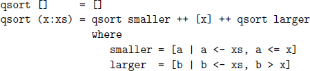
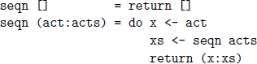

## **1**

## Introduction

In this chapter we set the stage for the rest of the book. We start by reviewing the notion of a function, then introduce the concept of functional programming, summarise the main features of Haskell and its historical background, and conclude with three small examples that give a taste of Haskell.

### **1.1Functions**

In Haskell, a *function* is a mapping that takes one or more arguments and produces a single result, and is defined using an equation that gives a name for the function, a name for each of its arguments, and a body that specifies how the result can be calculated in terms of the arguments.

For example, a function double that takes a number x as its argument, and produces the result x + x, can be defined by the following equation:

double x = x + x

When a function is applied to actual arguments, the result is obtained by substituting these arguments into the body of the function in place of the argument names. This process may immediately produce a result that cannot be further simplified, such as a number. More commonly, however, the result will be an expression containing other function applications, which must then be processed in the same way to produce the final result.

For example, the result of the application double 3 of the function double to the number 3 can be determined by the following calculation, in which each step is explained by a short comment in curly parentheses:

double 3

={ applying double }

3 + 3

={ applying + }

6

Similarly, the result of the nested application double (double 2) in which the function double is applied twice can be calculated as follows:

double (double 2)

={ applying the inner double }

double (2 + 2)

={ applying + }

double 4

={ applying double }

4 + 4

={ applying + }

8

Alternatively, the same result can also be calculated by starting with the outer application of the function double rather than the inner:

double (double 2)

={ applying the outer double }

double 2 + double 2

={ applying the first double }

(2 + 2) + double 2

={ applying the first + }

4 + double 2

={ applying double }

4 + (2 + 2)

={ applying the second + }

4 + 4

={ applying + }

8

However, this approach requires two more steps than our original version, because the expression double 2 is duplicated in the first step and hence simplified twice. In general, the order in which functions are applied in a calculation does not affect the value of the final result, but it may affect the number of steps required, and whether the calculation process terminates. These issues are explored in more detail when we consider how expressions are evaluated in chapter 15.

### **1.2Functional programming**

What is functional programming? Opinions differ, and it is difficult to give a precise definition. Generally speaking, however, functional programming can be viewed as a *style* of programming in which the basic method of computation is the application of functions to arguments. In turn, a functional programming language is one that *supports* and *encourages* the functional style.

To illustrate these ideas, let us consider the task of computing the sum of the integers (whole numbers) between one and some larger number n. In many current programming languages, this would normally be achieved using two integer variables whose values can be changed over time by means of the assignment operator =, with one such variable used to accumulate the total, and the other used to count from 1 to n. For example, in Java the following program computes the required sum using this approach:

int total = 0;

for (int count = 1; count \<= n; count++)  
total = total + count;

That is, we first initialise an integer variable total to zero, and then enter a loop that ranges an integer variable count from 1 to n, adding the current value of the counter to the total each time round the loop.

In the above program, the basic method of computation is *changing stored values*, in the sense that executing the program results in a sequence of assignments. For example, the case of n = 5 gives the following sequence, in which the final value assigned to the variable total is the required sum:

total = 0;

count = 1;

total = 1;

count = 2;

total = 3;

count = 3;

total = 6;

count = 4;

total = 10;

count = 5;

total = 15;

In general, programming languages such as Java in which the basic method of computation is changing stored values are called *imperative* languages, because programs in such languages are constructed from imperative instructions that specify precisely how the computation should proceed.

Now let us consider computing the sum of the numbers between one and n using Haskell. This would normally be achieved using two library functions, one called \[..\] that is used to produce the list of numbers between 1 and n, and the other called sum that is used to produce the sum of this list:

sum \[1..n\]

In this program, the basic method of computation is *applying functions to arguments*, in the sense that executing the program results in a sequence of applications. For example, the case of n = 5 gives the following sequence, in which the final value in the sequence is the required sum:

sum \[1..5\]

={ applying \[..\] }

sum \[1,2,3,4,5\]

={ applying sum }

1 + 2 + 3 + 4 + 5

={ applying + }

15

Most imperative languages provide some form of support for programming with functions, so the Haskell program sum \[1..n\] could be translated into such languages. However, many imperative languages do not *encourage* programming in the functional style. For example, many such languages discourage or prohibit functions from being stored in data structures such as lists, from constructing intermediate structures such as the list of numbers in the above example, from taking functions as arguments or producing functions as results, or from being defined in terms of themselves. In contrast, Haskell imposes no such restrictions on how functions can be used, and provides a range of features to make programming with functions both simple and powerful.

### **1.3Features of Haskell**

For reference, the main features of Haskell are listed below, along with particular chapters of this book that give further details.

- **Concise programs** (chapters 2 and chapters 4)

  Due to the high-level nature of the functional style, programs written in Haskell are often much more *concise* than programs written in other languages, as illustrated by the example in the previous section. Moreover, the syntax of Haskell has been designed with concise programs in mind, in particular by having few keywords, and by allowing indentation to be used to indicate the structure of programs. Although it is difficult to make an objective comparison, Haskell programs are often between two and ten times shorter than programs written in other languages.

- **Powerful type system** (chapters 3 and chapters 8)

  Most modern programming languages include some form of *type system* to detect incompatibility errors, such as erroneously attempting to add a number and a character. Haskell has a type system that usually requires little type information from the programmer, but allows a large class of incompatibility errors in programs to be automatically detected prior to their execution, using a sophisticated process called type inference. The Haskell type system is also more powerful than most languages, supporting very general forms of *polymorphism* and *overloading*, and providing a wide range of special purpose features concerning types.

- **List comprehensions** (chapter 5)

  One of the most common ways to structure and manipulate data in computing is using lists of values. To this end, Haskell provides lists as a basic concept in the language, together with a simple but powerful *comprehension* notation that constructs new lists by selecting and filtering elements from one or more existing lists. Using the comprehension notation allows many common functions on lists to be defined in a clear and concise manner, without the need for explicit recursion.

- **Recursive functions** (chapter 6)

  Most programs involve some form of looping. In Haskell, the basic mechanism by which looping is achieved is through *recursive* functions that are defined in terms of themselves. It can take some time to get used to recursion, particularly for those with experience of programming in other styles. But as we shall see, many computations have a simple and natural definition in terms of recursive functions, especially when *pattern matching* and *guards* are used to separate different cases into different equations.

- **Higher-order functions** (chapter 7)

  Haskell is a *higher-order* functional language, which means that functions can freely take functions as arguments and produce functions as results. Using higher-order functions allows common programming patterns, such as composing two functions, to be defined as functions within the language itself. More generally, higher-order functions can be used to define *domain-specific languages* within Haskell itself, such as for list processing, interactive programming, and parsing.

- **Effectful functions** (chapters 10 and chapters 12)

  Functions in Haskell are pure functions that take all their inputs as arguments and produce all their outputs as results. However, many programs require some formof *side effect* that would appear to be at odds with purity, such as reading input from the keyboard, or writing output to the screen, while the program is running. Haskell provides a uniform framework for programming with effects, without compromising the purity of functions, based upon the use of *monads* and *applicatives*.

- **Generic functions** (chapters 12 and chapters 14)

  Most languages allow functions to be defined that are *generic* over a range of simple types, such as different forms of numbers. However, the Haskell type system also supports functions that are generic over much richer kinds of structures. For example, the language provides a range of library functions that can be used with any type that is *functorial*, *applicative*, *monadic*, *foldable*, or *traversable*, and moreover, allows new structures and generic functions over them to be defined.

- **Lazy evaluation** (chapter 15)

  Haskell programs are executed using a technique called *lazy evaluation*, which is based upon the idea that no computation should be performed until its result is actually required. As well as avoiding unnecessary computation, lazy evaluation ensures that programs terminate whenever possible, encourages programming in a modular style using intermediate data structures, and even allows programming with infinite structures.

- **Equational reasoning** (chapters 16 and chapters 17)

  Because programs in Haskell are pure functions, simple *equational reasoning* techniques can be used to execute programs, to transform programs, to prove properties of programs, and even to calculate programs directly from specifications of their intended behaviour. Equational reasoning is particularly powerful when combined with the use of *induction* to reason about functions that are defined using recursion.

### **1.4Historical background**

Many of the features of Haskell are not new, but were first introduced by other languages. To help place Haskell in context, some of the key historical developments related to the language are briefly summarised below:

- In the 1930s, Alonzo Church developed the lambda calculus, a simple but powerful mathematical theory of functions.
- In the 1950s, John McCarthy developed Lisp (“LISt Processor”), generally regarded as being the first functional programming language. Lisp had some influences from the lambda calculus, but still retained the concept of variable assignment as a central feature of the language.
- In the 1960s, Peter Landin developed ISWIM (“If you See What I Mean”), the first pure functional programming language, based strongly on the lambda calculus and having no variable assignments.
- In the 1970s, John Backus developed FP (“Functional Programming”), a functional programming language that particularly emphasised the idea of higher-order functions and reasoning about programs.
- Also in the 1970s, Robin Milner and others developed ML (“Meta-Language”), the first of the modern functional programming languages, which introduced the idea of polymorphic types and type inference.
- In the 1970s and 1980s, David Turner developed a number of lazy functional programming languages, culminating in the commercially produced language Miranda (meaning “admirable”).
- In 1987, an international committee of programming language researchers initiated the development of Haskell (named after the logician Haskell Curry), a standard lazy functional programming language.
- In the 1990s, Philip Wadler and others developed the concept of type classes to support overloading, and the use of monads to handle effects, two of the main innovative features of Haskell.
- In 2003, the Haskell committee published the Haskell Report, which defined a long-awaited stable version of the language.
- In 2010, a revised and updated of the Haskell Report was published. Since then the language has continued to evolve, in response to both new foundational developments and new practical experience.

It is worthy of note that three of the above individuals — McCarthy, Backus, and Milner — have each received the ACM Turing Award, which is generally regarded as being the computing equivalent of a Nobel prize.

### **1.5A taste of Haskell**

We conclude this chapter with three small examples that give a taste of programming in Haskell. The examples involve processing lists of values of different types, and illustrate different features of the language.

##### Summing numbers

Recall the function sum used earlier in this chapter, which produces the sum of a list of numbers. In Haskell, sum can be defined using two equations:

sum \[\]= 0

sum (n:ns) = n + sum ns

The first equation states that the sum of the empty list is zero, while the second states that the sum of any non-empty list comprising a first number n and a remaining list of numbers ns is given by adding n and the sum of ns. For example, the result of sum \[1,2,3\] can be calculated as follows:

sum \[1,2,3\]

={ applying sum }

1 + sum \[2,3\]

={ applying sum }

1 + (2 + sum \[3\])

={ applying sum }

1 + (2 + (3 + sum \[\]))

={ applying sum }

1 + (2 + (3 + 0))

={ applying + }

6

Note that even though the function sum is defined in terms of itself and is hence *recursive*, it does not loop forever. In particular, each application of sum reduces the length of the argument list by one, until the list eventually becomes empty, at which point the recursion stops and the additions are performed. Returning zero as the sum of the empty list is appropriate because zero is the *identity* for addition. That is, 0 + x = x and x + 0 = x for any number x.

In Haskell, every function has a *type* that specifies the nature of its arguments and results, which is automatically inferred from the definition of the function. For example, the function sum defined above has the following type:

Num a =\> \[a\] -\> a

This type states that for any type a of numbers, sum is a function that maps a list of such numbers to a single such number. Haskell supports many different types of numbers, including integers such as 123, and floating-point numbers such as 3.14159. Hence, for example, sum could be applied to a list of integers, as in the calculation above, or to a list of floating-point numbers.

Types provide useful information about the nature of functions, but, more importantly, their use allows many errors in programs to be automatically detected prior to executing the programs themselves. In particular, for every occurrence of function application in a program, a check is made that the type of the actual arguments is compatible with the type of the function itself. For example, attempting to apply the function sum to a list of characters would be reported as an error, because characters are not a type of numbers.

##### Sorting values

Now let us consider a more sophisticated function concerning lists, which illustrates a number of other aspects of Haskell. Suppose that we define a function called qsort by the following two equations:

In this definition, ++ is an operator that appends two lists together; for example, \[1,2,3\] ++ \[4,5\] = \[1,2,3,4,5\]. In turn, where is a keyword that introduces local definitions, in this case a list smaller comprising all elements a from the list xs that are less than or equal to x, together with a list larger comprising all elements b from xs that are greater than x. For example, if x = 3 and xs = \[5,1,4,2\], then smaller = \[1,2\] and larger = \[5,4\].

What does qsort actually do? First of all, we note that it has no effect on lists with a single element, in the sense that qsort \[x\] = \[x\] for any x. It is easy to verify this property using a simple calculation:

qsort \[x\]

={ applying qsort }

qsort \[\] ++ \[x\] ++ qsort \[\]

={ applying qsort }

\[\] ++ \[x\] ++ \[\]

={ applying ++ }

\[x\]

In turn, we now work through the application of qsort to an example list, using the above property to simplify the calculation:

qsort \[3,5,1,4,2\]

={ applying qsort }

qsort \[1,2\] ++ \[3\] ++ qsort \[5,4\]

={ applying qsort }

(qsort \[\] ++ \[1\] ++ qsort \[2\]) ++ \[3\]

++ (qsort \[4\] ++ \[5\] ++ qsort \[\])

={ applying qsort, above property}

(\[\] ++ \[1\] ++ \[2\]) ++ \[3\] ++ (\[4\] ++ \[5\] ++ \[\])

={ applying ++ }

\[1,2\] ++ \[3\] ++ \[4,5\]

={ applying ++ }

\[1,2,3,4,5\]

In summary, qsort has sorted the example list into numerical order. More generally, this function produces a sorted version of any list of numbers. The first equation for qsort states that the empty list is already sorted, while the second states that any non-empty list can be sorted by inserting the first number between the two lists that result from sorting the remaining numbers that are smaller and larger than this number. This method of sorting is called *quicksort*, and is one of the best such methods known.

The above implementation of quicksort is an excellent example of the power of Haskell, being both clear and concise. Moreover, the function qsort is also more general than might be expected, being applicable not just with numbers, but with any type of ordered values. More precisely, the type

qsort :: Ord a =\> \[a\] -\> \[a\]

states that, for any type a of ordered values, qsort is a function that maps between lists of such values. Haskell supports many different types of ordered values, including numbers, single characters such as ’a’, and strings of characters such as "abcde". Hence, for example, the function qsort could also be used to sort a list of characters, or a list of strings.

##### Sequencing actions

Our third and final example further emphasises the level of precision and generality that can be achieved in Haskell. Consider a function called seqn that takes a list of input/output actions, such as reading or writing a single character, performs each of these actions in sequence, and returns a list of resulting values. In Haskell, this function can be defined as follows:

These two equations state that if the list of actions is empty we return the empty list of results, otherwise we perform the first action in the list, then perform the remaining actions, and finally return the list of results that were produced. For example, the expression seqn \[getChar,getChar,getChar\] reads three characters from the keyboard using the action getChar that reads a single character, and returns a list containing the three characters.

The interesting aspect of the function seqn is its type. One possible type that can inferred from the above definition is the following:

seqn :: \[IO a\] -\> IO \[a\]

This type states that seqn maps a list of IO (input/output) actions that produce results of some type a to a single IO action that produces a list of such results, which captures the high-level behaviour of seqn in a clear and concise manner. More importantly, however, the type also makes explicit that the function seqn involves the *side effect* of performing input/output actions. Using types in this manner to keep a clear distinction between functions that are pure and those that involve side effects is a central aspect of Haskell, and brings important benefits in terms of both programming and reasoning.

In fact, the function seqn is more general than it may initially appear. In particular, the manner in which the function is defined is not specific to the case of input/output actions, but is equally valid for other forms of effects too. For example, it can also be used to sequence actions that may change stored values, fail to succeed, write to a log file, and so on. This flexibility is captured in Haskell by means of the following more general type:

seqn :: Monad m =\> \[m a\] -\> m \[a\]

That is, for any *monadic* type m, of which IO is just one example, seqn maps a list of actions of type m a into a single action that returns a list of values of type a. Being able to define generic functions such as seqn that can be used with different kinds of effects is a key feature of Haskell.

### **1.6Chapter remarks**

The Haskell Report is freely available from [http://www.haskell.org](http://www.haskell.org). More detailed historical accounts of the development of functional languages in general, and Haskell in particular, are given in \[1\] and \[2\].

### **1.7Exercises**

1.Give another possible calculation for the result of double (double 2).

2.Show that sum \[x\] = x for any number x.

3.Define a function product that produces the product of a list of numbers, and show using your definition that product \[2,3,4\] = 24.

4.How should the definition of the function qsort be modified so that it produces a *reverse* sorted version of a list?

5.What would be the effect of replacing \<= by \< in the original definition of qsort? Hint: consider the example qsort \[2,2,3,1,1\].

Solutions to exercises 1–3 are given in appendix A.