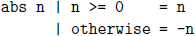
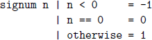
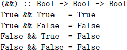
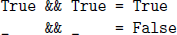
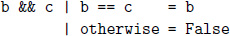
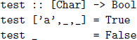
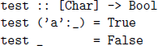
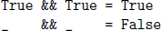

## **4**

## Defining functions

In this chapter we introduce a range of mechanisms for defining functions in Haskell. We start with conditional expressions and guarded equations, then introduce the simple but powerful idea of pattern matching, and conclude with the concepts of lambda expressions and operator sections.

### **4.1New from old**

Perhaps the most straightforward way to define new functions is simply by combining one or more existing functions. For example, a few library functions that can be defined in this way are shown below.

- Decide if an integer is even:

  even :: Integral a =\> a -\> Bool

  even n = n ‘mod‘ 2 == 0

- Split a list at the nth element:

  splitAt :: Int -\> \[a\] -\> (\[a\],\[a\])

  splitAt n xs = (take n xs, drop n xs)

- Reciprocation:

  recip :: Fractional a =\> a -\> a

  recip n = 1/n

Note the use of the class constraints in the types for even and recip above, which make precise the idea that these functions can be applied to numbers of any integral and fractional types, respectively.

### **4.2Conditional expressions**

Haskell provides a range of different ways to define functions that choose between a number of possible results. The simplest are *conditional expressions*, which use a logical expression called a *condition* to choose between two results of the same type. If the condition is True, then the first result is chosen, and if it is False, then the second result is chosen. For example, the library function abs that returns the absolute value of an integer can be defined as follows:

``` haskell
abs :: Int -> Int
abs n = if n >= 0 then n else -n
```

Conditional expressions may be nested, in the sense that they can contain other conditional expressions. For example, the library function signum that returns the sign of an integer can be defined as follows:

``` haskell
signum :: Int -> Int
signum n = if n < 0 then -1 else
if n == 0 then 0 else 1
```

Note that unlike in some programming languages, conditional expressions in Haskell must always have an else branch, which avoids the well-known *dangling else* problem. For example, if else branches were optional, then the expression if True then if False then 1 else 2 could either return the result 2 or produce an error, depending upon whether the single else branch was assumed to be part of the inner or outer conditional expression.

### **4.3Guarded equations**

As an alternative to using conditional expressions, functions can also be defined using *guarded equations*, in which a sequence of logical expressions called *guards* is used to choose between a sequence of results of the same type. If the first guard is True, then the first result is chosen; otherwise, if the second is True, then the second result is chosen, and so on. For example, the library function abs can also be defined using guarded equations as follows:



The symbol \| is read as *such that*, and the guard otherwise is defined in the standard prelude simply by otherwise = True. Ending a sequence of guards with otherwise is not necessary, but provides a convenient way of handling all other cases, as well as avoiding the possibility that none of the guards in the sequence is True, which would otherwise result in an error.

The main benefit of guarded equations over conditional expressions is that definitions with multiple guards are easier to read. For example, the library function signum is easier to understand when defined as follows:



### **4.4Pattern matching**

Many functions have a simple and intuitive definition using *pattern matching*, in which a sequence of syntactic expressions called *patterns* is used to choose between a sequence of results of the same type. If the first pattern is *matched*, then the first result is chosen; otherwise, if the second is matched, then the second result is chosen, and so on. For example, the library function not that returns the negation of a logical value can be defined as follows:

``` haskell
not :: Bool -> Bool
not False = True
not True= False
```

Functions with more than one argument can also be defined using pattern matching, in which case the patterns for each argument are matched in order within each equation. For example, the library operator && that returns the conjunction of two logical values can be defined as follows:



However, this definition can be simplified by combining the last three equations into a single equation that returns False independent of the values of the two arguments, using the *wildcard pattern* \_ that matches any value:



This version also has the benefit that, under lazy evaluation as discussed in chapter 15, if the first argument is False, then the result False is returned without the need to evaluate the second argument. In practice, the prelude defines && using equations that have this same property, but make the choice about which equation applies using the value of the first argument only:

``` haskell
True && b= b
False && _ = False
```

That is, if the first argument is True, then the result is the value of the second argument, and, if the first argument is False, then the result is False.

Note that Haskell does not permit the same name to be used for more than one argument in a single equation. For example, the following definition for the operator && is based upon the observation that, if the two logical arguments are equal, then the result is the same value, otherwise the result is False, but is invalid because of the above naming requirement:

``` haskell
b && b = b
_ && _ = False
```

If desired, however, a valid version of this definition can be obtained by using a guard to decide if the two arguments are equal:



So far, we have only considered basic patterns that are either values, variables, or the wildcard pattern. In the remainder of this section we introduce two useful ways to build larger patterns by combining smaller patterns.

##### Tuple patterns

A tuple of patterns is itself a pattern, which matches any tuple of the same arity whose components all match the corresponding patterns in order. For example, the library functions fst and snd that respectively select the first and second components of a pair are defined as follows:

``` haskell
fst :: (a,b) -> a
fst (x,_) = x
snd :: (a,b) -> b
snd (_,y) = y
```

##### List patterns

Similarly, a list of patterns is itself a pattern, which matches any list of the same length whose elements all match the corresponding patterns in order. For example, a function test that decides if a list contains precisely three characters beginning with the letter ’a’ can be defined as follows:



Up to this point, we have viewed lists as a primitive notion in Haskell. In fact they are not primitive as such, but are constructed one element at a time starting from the empty list \[\] using an operator : called *cons* that *cons*tructs a new list by prepending a new element to the start of an existing list. For example, the list \[1,2,3\] can be decomposed as follows:

``` haskell
[1,2,3]
={ list notation }
1 : [2,3]
={ list notation }
1 : (2 : [3])
={ list notation }
1 : (2 : (3 : []))
```

That is, \[1,2,3\] is just an abbreviation for 1:(2:(3:\[\])). To avoid excess parentheses when working with such lists, the cons operator is assumed to associate to the right. For example, 1:2:3:\[\] means 1:(2:(3:\[\])).

As well as being used to construct lists, the cons operator can also be used to construct patterns, which match any non-empty list whose first and remaining elements match the corresponding patterns in order. For example, we can now define a more general version of the function test that decides if a list containing any number of characters begins with the letter ’a’:



Similarly, the library functions head and tail that respectively select and remove the first element of a non-empty list are defined as follows:

``` haskell
head :: [a] -> a
head (x:_) = x
tail :: [a] -> [a]
tail (_:xs) = xs
```

Note that cons patterns must be parenthesised, because function application has higher priority than all other operators in the language. For example, the definition head x:\_ = x without parentheses means (head x):\_ = x, which is both the incorrect meaning and an invalid definition.

### **4.5Lambda expressions**

As an alternative to defining functions using equations, functions can also be constructed using *lambda expressions*, which comprise a pattern for each of the arguments, a body that specifies how the result can be calculated in terms of the arguments, but do not give a name for the function itself. In other words, lambda expressions are nameless functions.

For example, the nameless function that takes a single number x as its argument, and produces the result x + x, can be constructed as follows:

``` haskell
\x -> x + x
```

The symbol \\ represents the Greek letter *lambda*, written as λ. Despite the fact that they have no names, functions constructed using lambda expressions can be used in the same way as any other functions. For example:

``` haskell
> (\x -> x + x) 2
4
```

As well as being interesting in their own right, lambda expressions have a number of practical applications. First of all, they can be used to formalise the meaning of curried function definitions. For example, the definition

``` haskell
add :: Int -> Int -> Int
add x y = x + y
```

can be understood as meaning

``` haskell
add :: Int -> (Int -> Int)
add = \x -> (\y -> x + y)
```

which makes precise that add is a function that takes an integer x and returns a function, which in turn takes another integer y and returns the result x + y. Moreover, rewriting the original definition in this manner also has the benefit that the type for the function and the manner in which it is defined now have the same syntactic form, namely ? -\> (? -\> ?).

Secondly, lambda expressions are also useful when defining functions that return functions as results by their very nature, rather than as a consequence of currying. For example, the library function const that returns a constant function that always produces a given value can be defined as follows:

``` haskell
const :: a -> b -> a
const x _ = x
```

However, it is more appealing to define const in a way that makes explicit that it returns a function as its result, by including parentheses in the type and using a lambda expression in the definition itself:

``` haskell
const :: a -> (b -> a)
const x = \_ -> x
```

Finally, lambda expressions can be used to avoid having to name a function that is only referenced once in a program. For example, a function odds that returns the first n odd integers can be defined as follows:

``` haskell
odds :: Int -> [Int]
odds n = map f [0..n-1]
where f x = x*2 + 1
```

(The library function map applies a function to all elements of a list.) However, because the locally defined function f is only referenced once, the definition for odds can be simplified by using a lambda expression:

``` haskell
odds :: Int -> [Int]
odds n = map (\x -> x*2 + 1) [0..n-1]
```

### **4.6Operator sections**

Functions such as + that are written between their two arguments are called *operators*. As we have already seen, any function with two arguments can be converted into an operator by enclosing the name of the function in single back quotes, as in 7 ‘div‘ 2. However, the converse is also possible. In particular, any operator can be converted into a curried function that is written before its arguments by enclosing the name of the operator in parentheses, as in (+) 1 2. Moreover, this convention also allows one of the arguments to be included in the parentheses if desired, as in (1+) 2 and (+2) 1.

In general, if \# is an operator, then expressions of the form (#), (x \#), and (# y) for arguments x and y are called *sections*, whose meaning as functions can be formalised using lambda expressions as follows:

``` haskell
(#) = \x -> (\y -> x # y)
(x #) = \y -> x # y
(# y) = \x -> x # y
```

Sections have three primary applications. First of all, they can be used to construct a number of simple but useful functions in a particularly compact way, as shown in the following examples:

``` haskell
(+) is the addition function \x -> (\y -> x+y)
(1+) is the successor function \y -> 1+y
(1/) is the reciprocation function \y -> 1/y
(*2) is the doubling function \x -> x*2
(/2) is the halving function \x -> x/2
```

Secondly, sections are necessary when stating the type of operators, because an operator itself is not a valid expression in Haskell. For example, the type of the addition operator + for integers is stated as follows:

``` haskell
(+) :: Int -> Int -> Int
```

Finally, sections are also necessary when using operators as arguments to other functions. For example, the library function sum that calculates the sum of a list of integers can be defined by using the operator + as an argument to the library function foldl, which is itself discussed in chapter 7:

``` haskell
sum :: [Int] -> Int
sum = foldl (+) 0
```

### **4.7Chapter remarks**

A formal meaning for pattern matching by translation using more primitive features of the language is given in the Haskell Report \[4\]. The Greek letter λ used when defining nameless functions comes from the *lambda calculus* \[6\], the mathematical theory of functions upon which Haskell is founded.

### **4.8Exercises**

1.Using library functions, define a function halve :: \[a\] -\> (\[a\],\[a\]) that splits an even-lengthed list into two halves. For example:

``` haskell
> halve [1,2,3,4,5,6]
([1,2,3],[4,5,6])
```

2.Define a function third :: \[a\] -\> a that returns the third element in a list that contains at least this many elements using:

a.head and tail;

b.list indexing !!;

c.pattern matching.

3.Consider a function safetail :: \[a\] -\> \[a\] that behaves in the same way as tail except that it maps the empty list to itself rather than producing an error. Using tail and the function null :: \[a\] -\> Bool that decides if a list is empty or not, define safetail using:

a.a conditional expression;

b.guarded equations;

c.pattern matching.

4.In a similar way to && in section 4.4, show how the disjunction operator \|\| can be defined in four different ways using pattern matching.

5.Without using any other library functions or operators, show how the meaning of the following pattern matching definition for logical conjunction && can be formalised using conditional expressions:



Hint: use two nested conditional expressions.

6.Do the same for the following alternative definition, and note the difference in the number of conditional expressions that are required:

``` haskell
True && b= b
False && _ = False
```

7.Show how the meaning of the following curried function definition can be formalised in terms of lambda expressions:

``` haskell
mult :: Int -> Int -> Int -> Int
mult x y z = x*y*z
```

8.The *Luhn algorithm* is used to check bank card numbers for simple errors such as mistyping a digit, and proceeds as follows:

- consider each digit as a separate number;
- moving left, double every other number from the second last;
- subtract 9 from each number that is now greater than 9;
- add all the resulting numbers together;
- if the total is divisible by 10, the card number is valid.

Define a function luhnDouble :: Int -\> Int that doubles a digit and subtracts 9 if the result is greater than 9. For example:

``` haskell
> luhnDouble 3
6
> luhnDouble 6
3
```

Using luhnDouble and the integer remainder function mod, define a function luhn :: Int -\> Int -\> Int -\> Int -\> Bool that decides if a four-digit bank card number is valid. For example:

``` haskell
> luhn 1 7 8 4
True
> luhn 4 7 8 3
False
```

In the exercises for chapter 7 we will consider a more general version of this function that accepts card numbers of any length.

Solutions to exercises 1–4 are given in appendix A.