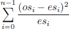
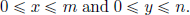
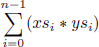

## **5**

## List comprehensions

In this chapter we introduce list comprehensions, which allow many functions on lists to be defined in simple manner. We start by explaining generators and guards, then introduce the function zip and the idea of string comprehensions, and conclude by developing a program to crack the Caesar cipher.

### **5.1Basic concepts**

In mathematics, the *comprehension* notation can be used to construct new sets from existing sets. For example, the comprehension {*x*² \| *x* ∈ {1 *. .* 5}} produces the set {1*,* 4*,* 9*,* 16*,* 25} of all numbers *x*² such that *x* is an element of the set {1 *. .* 5}. In Haskell, a similar comprehension notation can be used to construct new lists from existing lists. For example:

\> \[x^2 \| x \<- \[1..5\]\]

\[1,4,9,16,25\]

The symbol \| is read as *such that*, \<- is read as *is drawn from*, and the expression x \<- \[1..5\] is called a *generator*. A list comprehension can have more than one generator, with successive generators being separated by commas. For example, the list of all possible pairings of an element from the list \[1,2,3\] with an element from the list \[4,5\] can be produced as follows:

\> \[(x,y) \| x \<- \[1,2,3\], y \<- \[4,5\]\]

\[(1,4),(1,5),(2,4),(2,5),(3,4),(3,5)\]

Changing the order of the two generators in this example produces the same set of pairs, but arranged in a different order:

\> \[(x,y) \| y \<- \[4,5\], x \<- \[1,2,3\]\]

\[(1,4),(2,4),(3,4),(1,5),(2,5),(3,5)\]

In particular, whereas in this case the x components of the pairs change more frequently than the y components (1,2,3,1,2,3 versus 4,4,4,5,5,5), in the previous case the y components change more frequently than the x components (4,5,4,5,4,5 versus 1,1,2,2,3,3). These behaviours can be understood by thinking of later generators as being more deeply nested, and hence changing the values of their variables more frequently than earlier generators.

Later generators can also depend upon the values of variables from earlier generators. For example, the list of all possible ordered pairings of elements from the list \[1..3\] can be produced as follows:

\> \[(x,y) \| x \<- \[1..3\], y \<- \[x..3\]\]

\[(1,1),(1,2),(1,3),(2,2),(2,3),(3,3)\]

As a more practical example of this idea, the library function concat that concatenates a list of lists can be defined by using one generator to select each list in turn, and another to select each element from each list:

concat :: \[\[a\]\] -\> \[a\]

concat xss = \[x \| xs \<- xss, x \<- xs\]

The wildcard pattern \_ is sometimes useful in generators to discard certain elements from a list. For example, a function that selects all the first components from a list of pairs can be defined as follows:

firsts :: \[(a,b)\] -\> \[a\]

firsts ps = \[x \| (x,\_) \<- ps\]

Similarly, the library function that calculates the length of a list can be defined by replacing each element by one and summing the resulting list:

length :: \[a\] -\> Int

length xs = sum \[1 \| \_ \<- xs\]

In this case, the generator \_ \<- xs simply serves as a counter to govern the production of the appropriate number of ones.

### **5.2Guards**

List comprehensions can also use logical expressions called *guards* to filter the values produced by earlier generators. If a guard is True, then the current values are retained; if it is False, then they are discarded. For example, the comprehension \[x \| x \<- \[1..10\], even x\] produces the list \[2,4,6,8,10\] of all even numbers from the list \[1..10\]. Similarly, a function that maps a positive integer to its list of positive factors can be defined by:

factors :: Int -\> \[Int\]

factors n = \[x \| x \<- \[1..n\], n ‘mod‘ x == 0\]

For example:

\> factors 15

\[1,3,5,15\]  
  

\> factors 7

\[1,7\]

Recall that an integer greater than one is *prime* if its only positive factors are one and the number itself. Hence, by using factors, a simple function that decides if an integer is prime can be defined as follows:

prime :: Int -\> Bool

prime n = factors n == \[1,n\]

For example:

\> prime 15

False  
  

\> prime 7

True

Note that deciding that a number such as 15 is not prime does not require the function prime to produce all of its factors, because under lazy evaluation the result False is returned as soon as any factor other than one or the number itself is produced, which for this example is given by the factor 3.

Returning to list comprehensions, using prime we can now define a function that produces the list of all prime numbers up to a given limit:

primes :: Int -\> \[Int\]

primes n = \[x \| x \<- \[2..n\], prime x\]

For example:

\> primes 40

\[2,3,5,7,11,13,17,19,23,29,31,37\]

In chapter 15 we will present a more efficient program to generate prime numbers using the famous *sieve of Eratosthenes*, which has a particularly clear and concise implementation in Haskell using the idea of lazy evaluation.

As a final example concerning guards, suppose that we represent a lookup table by a list of pairs of keys and values. Then for any type of keys that supports equality, a function find that returns the list of all values that are associated with a given key in a table can be defined as follows:

find :: Eq a =\> a -\> \[(a,b)\] -\> \[b\]

find k t = \[v \| (k’,v) \<- t, k == k’\]

For example:

\> find ’b’ \[(’a’,1),(’b’,2),(’c’,3),(’b’,4)\]

\[2,4\]

### **5.3The** zip **function**

The library function zip produces a new list by pairing successive elements from two existing lists until either or both lists are exhausted. For example:

\> zip \[’a’,’b’,’c’\] \[1,2,3,4\]

\[(’a’,1),(’b’,2),(’c’,3)\]

The function zip is often useful when programming with list comprehensions. For example, suppose that we define a function that returns the list of all pairs of adjacent elements from a list as follows:

pairs :: \[a\] -\> \[(a,a)\]

pairs xs = zip xs (tail xs)

For example:

\> pairs \[1,2,3,4\]

\[(1,2),(2,3),(3,4)\]

Then using pairs we can now define a function that decides if a list of elements of any ordered type is sorted by simply checking that all pairs of adjacent elements from the list are in the correct order:

sorted :: Ord a =\> \[a\] -\> Bool

sorted xs = and \[x \<= y \| (x,y) \<- pairs xs\]

For example:

\> sorted \[1,2,3,4\]

True  
  

\> sorted \[1,3,2,4\]

False

Similarly to the function prime, deciding that a list such as \[1,3,2,4\] is not sorted may not require the function sorted to produce all pairs of adjacent elements, because the result False is returned as soon as any non-ordered pair is produced, which in this example is given by the pair (3,2).

Using zip we can also define a function that returns the list of all positions at which a value occurs in a list, by pairing each element with its position, and selecting those positions at which the desired value occurs:

positions :: Eq a =\> a -\> \[a\] -\> \[Int\]

positions x xs = \[i \| (x’,i) \<- zip xs \[0..\], x == x’\]

For example:

\> positions False \[True, False, True, False\]

\[1,3\]

Within the definition for positions, the expression \[0..\] produces the list of indices \[0,1,2,3,...\]. This list is notionally *infinite*, but under lazy evaluation only as many elements of the list as required by the context in which it is used, in this case zipping with the input list xs, will actually be produced. Exploiting lazy evaluation in this manner avoids the need to explicitly produce a list of indices of the same length as the input list.

### **5.4String comprehensions**

Up to this point we have viewed strings as a primitive notion in Haskell. In fact they are not primitive, but are constructed as lists of characters. For example, the string "abc" :: String is just an abbreviation for the list of characters \[’a’,’b’,’c’\] :: \[Char\]. Because strings are lists, any polymorphic function on lists can also be used with strings. For example:

\> "abcde" !! 2

’c’  
  

\> take 3 "abcde"

"abc"  
  

\> length "abcde"

5  
  

\> zip "abc" \[1,2,3,4\]

\[(’a’,1),(’b’,2),(’c’,3)\]

For the same reason, list comprehensions can also be used to define functions on strings, such as functions that return the number of lower-case letters and particular characters that occur in a string, respectively:

lowers :: String -\> Int

lowers xs = length \[x \| x \<- xs, x \>= ’a’ && x \<= ’z’\]  
  

count :: Char -\> String -\> Int

count x xs = length \[x’ \| x’ \<- xs, x == x’\]

For example:

\> lowers "Haskell"

6  
  

\> count ’s’ "Mississippi"

4

### **5.5The Caesar cipher**

We conclude this chapter with an extended programming example. Consider the problem of encoding a string in order to disguise its contents. A well-known encoding method is the *Caesar cipher*, named after its use by Julius Caesar more than 2,000 years ago. To encode a string, Caesar simply replaced each letter in the string by the letter three places further down in the alphabet, wrapping around at the end of the alphabet. For example, the string

"haskell is fun"

would be encoded as

"kdvnhoo lv ixq"

More generally, the specific shift factor of three used by Caesar can be replaced by any integer between one and twenty-five, thereby giving twenty-five different ways of encoding a string. For example, with a shift factor of ten, the original string above would be encoded as follows:

"rkcuovv sc pex"

In the remainder of this section we show how Haskell can be used to implement the Caesar cipher, and how the cipher itself can easily be cracked by exploiting information about letter frequencies in English text.

##### Encoding and decoding

We will use a number of standard functions on characters that are provided in a library called Data.Char, which can be loaded into a Haskell script by including the following declaration at the start of the script:

import Data.Char

For simplicity, we will only encode the lower-case letters within a string, leaving other characters such as upper-case letters and punctuation unchanged. We begin by defining a function let2int that converts a lower-case letter between ’a’ and ’z’ into the corresponding integer between 0 and 25, together with a function int2let that performs the opposite conversion:

let2int :: Char -\> Int

let2int c = ord c - ord ’a’  
  

int2let :: Int -\> Char

int2let n = chr (ord ’a’ + n)

(The library functions ord :: Char -\> Int and chr :: Int -\> Char convert between characters and their Unicode numbers.) For example:

\> let2int ’a’

0  
  

\> int2let 0

’a’

Using these two functions, we can define a function shift that applies a shift factor to a lower-case letter by converting the letter into the corresponding integer, adding on the shift factor and taking the remainder when divided by twenty-six (thereby wrapping around at the end of the alphabet), and converting the resulting integer back into a lower-case letter:

shift :: Int -\> Char -\> Char

shift n c \| isLower c = int2let ((let2int c + n) ‘mod‘ 26)

\| otherwise = c

(The library function isLower :: Char -\> Bool decides if a character is a lower-case letter.) Note that this function accepts both positive and negative shift factors, and that only lower-case letters are changed. For example:

\> shift 3 ’a’

’d’  
  

\> shift 3 ’z’

’c’  
  

\> shift (-3) ’c’

’z’  
  

\> shift 3 ’ ’

’ ’

Using shift within a list comprehension, it is now easy to define a function that encodes a string using a given shift factor:

encode :: Int -\> String -\> String

encode n xs = \[shift n x \| x \<- xs\]

A separate function to decode a string is not required, because this can be achieved by simply using a negative shift factor. For example:

\> encode 3 "haskell is fun"

"kdvnhoo lv ixq"  
  

\> encode (-3) "kdvnhoo lv ixq"

"haskell is fun"

##### Frequency tables

The key to cracking the Caesar cipher is the observation that some letters are used more frequently than others in English text. By analysing a large volume of such text, one can derive the following table of approximate percentage frequencies of the twenty-six letters of alphabet:

table :: \[Float\]

table = \[8.1, 1.5, 2.8, 4.2, 12.7, 2.2, 2.0, 6.1, 7.0,

0.2, 0.8, 4.0, 2.4, 6.7, 7.5, 1.9, 0.1, 6.0,

6.3, 9.0, 2.8, 1.0, 2.4, 0.2, 2.0, 0.1\]

For example, the letter ’e’ occurs most often, with a frequency of 12*.*7%, while ’q’ and ’z’ occur least often, with a frequency of just 0*.*1%. It is also useful to produce frequency tables for individual strings. To this end, we first define a function that calculates the percentage of one integer with respect to another, returning the result as a floating-point number:

percent :: Int -\> Int -\> Float

percent n m = (fromIntegral n / fromIntegral m) \* 100

(The library function fromIntegral :: Int -\> Float converts an integer into a floating-point number.) For example:

\> percent 5 15

33.333336

Using percent within a list comprehension, together with the functions lowers and count from the previous section, we can now define a function that returns a frequency table for any given string:

freqs :: String -\> \[Float\]

freqs xs = \[percent (count x xs) n \| x \<- \[’a’..’z’\]\]

where n = lowers xs

For example:

\> freqs "abbcccddddeeeee"

\[6.666667, 13.333334, 20.0, 26.666668, ..., 0.0\]

That is, the letter ’a’ occurs with a frequency of approximately 6*.*6%, the letter ’b’ with a frequency of 13*.*3%, and so on. The use of the local definition n = lowers xs within freqs ensures that the number of lower-case letters in the argument string is calculated once, rather than each of the twenty-six times that this number is used within the list comprehension.

##### Cracking the cipher

A standard method for comparing a list of observed frequencies *os* with a list of expected frequencies *es* is the *chi-square statistic*, defined by the following summation in which *n* denotes the length of the two lists, and *xs_(i)* denotes the *i*th element of a list *xs* counting from zero:

The details of the chi-square statistic need not concern us here, only the fact that the smaller the value it produces the better the match between the two frequency lists. Using the library function zip and a list comprehension, it is easy to translate the above formula into a function definition:

chisqr :: \[Float\] -\> \[Float\] -\> Float

chisqr os es = sum \[((o-e)^2)/e \| (o,e) \<- zip os es\]

In turn, we define a function that rotates the elements of a list n places to the left, wrapping around at the start of the list, and assuming that the integer argument n is between zero and the length of the list:

rotate :: Int -\> \[a\] -\> \[a\]

rotate n xs = drop n xs ++ take n xs

For example:

\> rotate 3 \[1,2,3,4,5\]

\[4,5,1,2,3\]

Now suppose that we are given an encoded string, but not the shift factor that was used to encode it, and wish to determine this number in order that we can decode the string. This can usually be achieved by producing the frequency table of the encoded string, calculating the chi-square statistic for each possible rotation of this table with respect to the table of expected frequencies, and using the position of the minimum chi-square value as the shift factor. For example, if we let table’ = freqs "kdvnhoo lv ixq", then

\[chisqr (rotate n table’) table \| n \<- \[0..25\]\]

gives the result

\[1408.8524, 640.0218, 612.3969, 202.42024, ..., 626.4024\]

in which the minimum value, 202.42024, appears at position three in this list. Hence, we conclude that three is the most likely shift factor that was used to encode the string. Using the function positions from earlier in this chapter, this procedure can be implemented as follows:

crack :: String -\> String

crack xs = encode (-factor) xs

where

factor = head (positions (minimum chitab) chitab)

chitab = \[chisqr (rotate n table’) table \| n \<- \[0..25\]\]

table’ = freqs xs

For example:

\> crack "kdvnhoo lv ixq"

"haskell is fun"  
  

\> crack "vscd mywzboroxcsyxc kbo ecopev"

"list comprehensions are useful"

More generally, the crack function can decode most strings produced using the Caesar cipher. Note, however, that it may not be successful if the string is short or has an unusual distribution of letters. For example:

\> crack (encode 3 "haskell")

"piasmtt"  
  

\> crack (encode 3 "boxing wizards jump quickly")

"wjsdib rduvmyn ephk lpdxfgt"

### **5.6Chapter remarks**

The term *comprehension* comes from the *axiom of comprehension* in set theory, which makes precise the idea of constructing a set by selecting all values that satisfy a particular property. A formal meaning for list comprehensions by translation using more primitive features of the language is given in the Haskell Report \[4\]. A popular account of the Caesar cipher, and many other famous cryptographic methods, is given in *The Code Book* \[7\].

### **5.7Exercises**

1.Using a list comprehension, give an expression that calculates the sum 1² + 2² + *...* 100² of the first one hundred integer squares.

2.Suppose that a *coordinate grid* of size *m* × *n* is given by the list of all pairs (*x, y*) of integers such that  Using a list comprehension, define a function grid :: Int -\> Int -\> \[(Int,Int)\] that returns a coordinate grid of a given size. For example:

\> grid 1 2

\[(0,0),(0,1),(0,2),(1,0),(1,1),(1,2)\]

3.Using a list comprehension and the function grid above, define a function square :: Int -\> \[(Int,Int)\] that returns a coordinate square of size *n*, excluding the diagonal from (0*,* 0) to (*n, n*). For example:

\> square 2

\[(0,1),(0,2),(1,0),(1,2),(2,0),(2,1)\]

4.In a similar way to the function length, show how the library function replicate :: Int -\> a -\> \[a\] that produces a list of identical elements can be defined using a list comprehension. For example:

\> replicate 3 True

\[True,True,True\]

5.A triple (*x, y, z*) of positive integers is *Pythagorean* if it satisfies the equation *x*² + *y*² = *z*². Using a list comprehension with three generators, define a function pyths :: Int -\> \[(Int,Int,Int)\] that returns the list of all such triples whose components are at most a given limit. For example:

\> pyths 10

\[(3,4,5),(4,3,5),(6,8,10),(8,6,10)\]

6.A positive integer is *perfect* if it equals the sum of all of its factors, excluding the number itself. Using a list comprehension and the function factors, define a function perfects :: Int -\> \[Int\] that returns the list of all perfect numbers up to a given limit. For example:

\> perfects 500

\[6,28,496\]

7.Show how the list comprehension \[(x,y) \| x \<- \[1,2\], y \<- \[3,4\]\] with two generators can be re-expressed using two comprehensions with single generators. Hint: nest one comprehension within the other and make use of the library function concat :: \[\[a\]\] -\> \[a\].

8.Redefine the function positions using the function find.

9.The *scalar product* of two lists of integers *xs* and *ys* of length *n* is given by the sum of the products of corresponding integers:

In a similar manner to chisqr, show how a list comprehension can be used to define a function scalarproduct :: \[Int\] -\> \[Int\] -\> Int that returns the scalar product of two lists. For example:

\> scalarproduct \[1,2,3\] \[4,5,6\]

32

10.Modify the Caesar cipher program to also handle upper-case letters.

Solutions to exercises 1–5 are given in appendix A.