## **6**

## Recursive functions

In this chapter we introduce recursion, the basic mechanism for looping in Haskell. We start with recursion on integers, then extend the idea to recursion on lists, consider multiple arguments, multiple recursion, and mutual recursion, and conclude with some advice on defining recursive functions.

### **6.1 Basic concepts**

As we have seen in previous chapters, many functions can naturally be defined in terms of other functions. For example, a function that returns the *factorial* of a non-negative integer can be defined by using library functions to calculate the product of the integers between one and the given number:

``` haskell
fac :: Int -> Int
fac n = product [1..n]
```

In Haskell, it is also permissible to define functions in terms of themselves, in which case the functions are called *recursive*. For example, the factorial function can be defined in this manner as follows:

``` haskell
fac :: Int -> Int
fac 0 = 1
fac n = n * fac (n-1)
```

The first equation states that the factorial of zero is one, and is called a *base case*. The second equation states that the factorial of any other number is given by the product of that number and the factorial of its predecessor, and is called a *recursive case*. For example, the following calculation shows how the factorial of three can be computed using this definition:

``` haskell
  fac 3
=   { applying fac }
  3 * fac 2
=   { applying fac }
  3 * (2 * fac 1)
=   { applying fac }
  3 * (2 * (1 * fac 0))
=   { applying fac }
  3 * (2 * (1 * 1))
=   { applying * }
  6
```

Note that even though the fac function is defined in terms of itself it does not loop forever. In particular, each application of fac decreases the (non-negative) integer argument by one, until it eventually reaches zero at which point the recursion stops and the multiplications are performed. Returning one as the factorial of zero is appropriate because one is the identity for multiplication. That is, 1 \* x = x and x \* 1 = x for any integer x.

For the case of the factorial function, the original definition using library functions is simpler than the definition using recursion. However, as we shall see in the remainder of this book, many functions have a simple and natural definition using recursion. For example, many of the library functions in Haskell are defined in this way. Moreover, as we shall see in chapter 16, defining functions using recursion also allows properties of those functions to be proved using the simple but powerful technique of induction.

As another example of recursion on integers, consider the multiplication operator \* used above. For efficiency reasons, this operator is provided as a primitive in Haskell. However, for non-negative integers it can also be defined using recursion on either of its two arguments, such as the second:

``` haskell
(*) :: Int -> Int -> Int
m * 0 = 0
m * n = m + (m * (n-1))
```

For example:

``` haskell
  4 * 3
=   { applying * }
  4 + (4 * 2)
=   { applying * }
  4 + (4 + (4 * 1))
=   { applying * }
  4 + (4 + (4 + (4 * 0)))
=   { applying * }
  4 + (4 + (4 + 0))
=   { applying + }
  12
```

That is, the recursive definition for the \* operator formalises the idea that multiplication can be reduced to repeated addition.

### **6.2 Recursion on lists**

Recursion is not restricted to functions on integers, but can also be used to define functions on lists. For example, the library function product used in the preceding section can be defined as follows:

``` haskell
product :: Num a => [a] -> a
product []     = 1
product (n:ns) = n * product ns
```

The first equation states that the product of the empty list of numbers is one, which is appropriate because one is the identity for multiplication. The second equation states that the product of any non-empty list is given by multiplying the first number and the product of the remaining list. For example:

``` haskell
  product [2,3,4]
=   { applying product }
  2 * product [3,4]
=   { applying product }
  2 * (3 * product [4])
=   { applying product }
  2 * (3 * (4 * product []))
=   { applying product }
  2 * (3 * (4 * 1))
=   { applying * }
  24
```

Recall that lists in Haskell are actually constructed one element at a time using the cons operator. Hence, \[2,3,4\] is just an abbreviation for 2:(3:(4:\[\])). As another simple example of recursion on lists, the library function length can be defined using the same pattern of recursion as product:

``` haskell
length :: [a] -> Int
length []     = 0
length (_:xs) = 1 + length xs
```

That is, the length of the empty list is zero, and the length of any non-empty list is the successor of the length of its tail. Note the use of the wildcard pattern \_ in the recursive case, which reflects the fact that calculating the length of a list does not depend upon the values of its elements.

Now let us consider the library function that reverses a list. This function can be defined using recursion as follows:

``` haskell
reverse :: [a] -> [a]
reverse []     = []
reverse (x:xs) = reverse xs ++ [x]
```

That is, the reverse of the empty list is simply the empty list, and the reverse of any non-empty list is given by appending the reverse of its tail and a singleton list comprising the head of the list. For example:

``` haskell
  reverse [1,2,3]
=   { applying reverse }
  reverse [2,3] ++ [1]
=   { applying reverse }
  (reverse [3] ++ [2]) ++ [1]
=   { applying reverse }
  ((reverse [] ++ [3]) ++ [2]) ++ [1]
=   { applying reverse }
  (([] ++ [3]) ++ [2]) ++ [1]
=   { applying ++ }
  [3,2,1]
```

In turn, the append operator ++ used in the above definition of reverse can itself be defined using recursion on its first argument:

``` haskell
(++) :: [a] -> [a] -> [a]
[]     ++ ys = ys
(x:xs) ++ ys = x : (xs ++ ys)
```

For example:

``` haskell
  [1,2,3] ++ [4,5]
=   { applying ++ }
  1 : ([2,3] ++ [4,5])
=   { applying ++ }
  1 : (2 : ([3] ++ [4,5]))
=   { applying ++ }
  1 : (2 : (3 : ([] ++ [4,5])))
=   { applying ++ }
  1 : (2 : (3 : [4,5]))
=   { list notation }
  [1,2,3,4,5]
```

That is, the recursive definition for ++ formalises the idea that two lists can be appended by copying elements from the first list until it is exhausted, at which point the second list is joined on at the end.

We conclude this section with two examples of recursion on sorted lists. First of all, a function that inserts a new element of any ordered type into a sorted list to give another sorted list can be defined as follows:

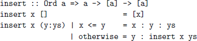

That is, inserting a new element into an empty list gives a singleton list, while for a non-empty list the result depends upon the ordering of the new element x and the head of the list y. In particular, if x \<= y then the new element x is simply prepended to the start of the list, otherwise the head y becomes the first element of the resulting list, and we then proceed to insert the new element into the tail of the given list. For example, we have:

``` haskell
  insert 3 [1,2,4,5]
=   { applying insert }
  1 : insert 3 [2,4,5]
=   { applying insert }
  1 : 2 : insert 3 [4,5]
=   { applying insert }
  1 : 2 : 3 : [4,5]
=   { list notation }
  [1,2,3,4,5]
```

Using insert we can now define a function that implements *insertion sort*, in which the empty list is already sorted, and any non-empty list is sorted by inserting its head into the list that results from sorting its tail:

``` haskell
isort :: Ord a => [a] -> [a]
isort []     = []
isort (x:xs) = insert x (isort xs)
```

For example:

``` haskell
  isort [3,2,1,4]
=   { applying isort }
  insert 3 (insert 2 (insert 1 (insert 4 [])))
=   { applying insert }
  insert 3 (insert 2 (insert 1 [4]))
=   { applying insert }
  insert 3 (insert 2 [1,4])
=   { applying insert }
  insert 3 [1,2,4]
=   { applying insert }
  [1,2,3,4]
```

### **6.3 Multiple arguments**

Functions with multiple arguments can also be defined using recursion on more than one argument at the same time. For example, the library function zip that takes two lists and produces a list of pairs is defined as follows:

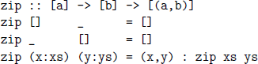

For example:

``` haskell
  zip [’a’,’b’,’c’] [1,2,3,4]
=   { applying zip }
  (’a’,1) : zip [’b’,’c’] [2,3,4]
=   { applying zip }
  (’a’,1) : (’b’,2) : zip [’c’] [3,4]
=   { applying zip }
  (’a’,1) : (’b’,2) : (’c’,3) : zip [] [4]
=   { applying zip }
  (’a’,1) : (’b’,2) : (’c’,3) : []
=   { list notation }
  [(’a’,1), (’b’,2), (’c’,3)]
```

Note that two base cases are required in the definition of zip, because either of the two argument lists may be empty. As another example of recursion on multiple arguments, the library function drop that removes a given number of elements from the start of a list is defined as follows:

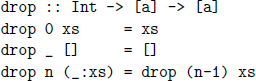

Again, two base cases are required, one for removing zero elements, and one for attempting to remove elements from the empty list.

### **6.4 Multiple recursion**

Functions can also be defined using *multiple recursion*, in which a function is applied more than once in its own definition. For example, recall the Fibonacci sequence 0*,* 1*,* 1*,* 2*,* 3*,* 5*,* 8*,* 13*,...*, in which the first two numbers are 0 and 1, and each subsequent number is given by adding the preceding two numbers in the sequence. A function that calculates the *n*th Fibonacci number for any integer 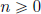 can be defined using double recursion as follows:

``` haskell
fib :: Int -> Int
fib 0 = 0
fib 1 = 1
fib n = fib (n-2) + fib (n-1)
```

As another example, in chapter 1 we showed how to implement another well-known method of sorting a list, known as quicksort:

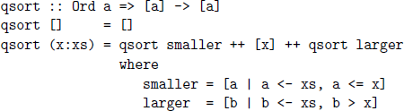

That is, the empty list is already sorted, and any non-empty list can be sorted by placing its head between the two lists that result from sorting those elements of its tail that are smaller and larger than the head.

### **6.5 Mutual recursion**

Functions can also be defined using *mutual recursion*, in which two or more functions are all defined recursively in terms of each other. For example, consider the library functions even and odd. For efficiency, these functions are normally defined using the remainder after dividing by two. However, for non-negative integers they can also be defined using mutual recursion:

``` haskell
even:: Int -> Bool
even 0 = True
even n = odd (n-1)
odd :: Int -> Bool
odd 0 = False
odd n = even (n-1)
```

That is, zero is even but not odd, and any other number is even if its predecessor is odd, and odd if its predecessor is even. For example:

``` haskell
  even 4
=   { applying even }
  odd 3
=   { applying odd }
  even 2
=   { applying even }
  odd 1
=   { applying odd }
  even 0
=   { applying even }
  True
```

Similarly, functions that select the elements from a list at all even and odd positions (counting from zero) can be defined as follows:

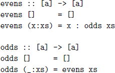

For example:

``` haskell
  evens "abcde"
=   { applying evens }
  ’a’ : odds "bcde"
=   { applying odds }
  ’a’ : evens "cde"
=   { applying evens }
  ’a’ : ’c’ : odds "de"
=   { applying odds }
  ’a’ : ’c’ : evens "e"
=   { applying evens }
  ’a’ : ’c’ : ’e’ : odds []
=   { applying odds }
  ’a’ : ’c’ : ’e’ : []
=   { string notation }
  "ace"
```

Recall that strings in Haskell are actually constructed as lists of characters. Hence, "abcde" is just an abbreviation for \[’a’,’b’,’c’,’d’,’e’\].

### **6.6 Advice on recursion**

Defining recursive functions is like riding a bicycle: it looks easy when someone else is doing it, may seem impossible when you first try to do it yourself, but becomes simple and natural with practice. In this section we offer some advice for defining functions in general, and recursive functions in particular, using a five-step process that we introduce by means of three examples.

##### Example – product

As a simple first example, we show how the definition given earlier in this chapter for the library function that calculates the product of a list of numbers can be systematically constructed in a stepwise manner.

##### **Step 1: define the type**

Thinking about types is very helpful when defining functions, so it is good practice to define the type of a function prior to starting to define the function itself. In this case, we begin with the type

``` haskell
product :: [Int] -> Int
```

that states that product takes a list of integers and produces a single integer. As in this example, it is often useful to begin with a simple type, which can be refined or generalised later on in the process.

##### **Step 2: enumerate the cases**

For most types of argument, there are a number of standard cases to consider. For lists, the standard cases are the empty list and non-empty lists, so we can write down the following skeleton definition using pattern matching:

``` haskell
product []     =
product (n:ns) =
```

For non-negative integers, the standard cases are 0 and n, for logical values they are False and True, and so on. As with the type, we may need to refine the cases later on, but it is useful to begin with the standard cases.

##### **Step 3: define the simple cases**

By definition, the product of zero integers is one, because one is the identity for multiplication. Hence it is straightforward to define the empty list case:

``` haskell
product []     = 1
product (n:ns) =
```

As in this example, the simple cases often become base cases.

##### **Step 4: define the other cases**

How can we calculate the product of a non-empty list of integers? For this step, it is useful to first consider the ingredients that can be used, such as the function itself (product), the arguments (n and ns), and library functions of relevant types (+, -, \*, and so on.) In this case, we simply multiply the first integer and the product of the remaining list of integers:

``` haskell
product []     = 1
product (n:ns) = n * product ns
```

As in this example, the other cases often become recursive cases.

##### **Step 5: generalise and simplify**

Once a function has been defined using the above process, it often becomes clear that it can be generalised and simplified. For example, the function product does not depend on the precise kind of numbers to which it is applied, so its type can be generalised from integers to any numeric type:

``` haskell
product :: Num a => [a] -> a
```

In terms of simplification, we will see in chapter 7 that the pattern of recursion used in product is encapsulated by a library function called foldr, using which product can be redefined by a single equation:

``` haskell
product = foldr (*) 1
```

In conclusion, our final definition for product is as follows:

``` haskell
product :: Num a => [a] -> a
product = foldr (*) 1
```

This is precisely the definition for lists from the standard prelude in appendix B, except that for efficiency reasons the use of foldr is replaced by the related function foldl, which is also discussed in chapter 7.

##### Example – drop

As a more substantial example, we now show how the definition given earlier for the library function drop that removes a given number of elements from the start of a list can be constructed using the five-step process.

##### **Step 1: define the type**

Let us begin with a type that states that drop takes an integer and a list of values of some type a, and produces another list of such values:

``` haskell
drop :: Int -> [a] -> [a]
```

Note that we have already made four design decisions in defining this type: using integers rather than a more general numeric type, for simplicity; using currying rather than taking the arguments as a pair, for flexibility; supplying the integer argument before the list argument, for readability (an expression of the form drop n xs can be read as *drop* n *elements from* xs); and, finally, making the function polymorphic in the type of the list elements, for generality.

##### **Step 2: enumerate the cases**

As there are two standard cases for the integer argument (0 and n) and two for the list argument (\[\] and x:xs), writing down a skeleton definition for the function using pattern matching requires four cases in total:

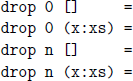

##### **Step 3: define the simple cases**

By definition, removing zero elements from the start of any list gives the same list, so it is straightforward to define the first two cases:

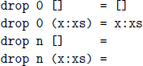

Attempting to remove one or more elements from the empty list is invalid, so the third case could be omitted, which would result in an error being produced if this situation arises. In practice, however, we choose to avoid the production of an error by returning the empty list in this case:

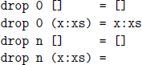

##### **Step 4: define the other cases**

How can we remove one or more elements from a non-empty list? By simply removing one fewer elements from the tail of the list:

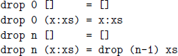

##### **Step 5: generalise and simplify**

Because the function drop does not depend on the precise kind of integers to which it is applied, its type could be generalised to any integral type, of which Int and Integer are the standard instances:

``` haskell
drop :: Integral b => b -> [a] -> [a]
```

For efficiency reasons, however, this generalisation is not in fact made in the standard prelude, as noted in section 3.9. In terms of simplification, the first two equations for drop can be combined into a single equation that states that removing zero elements from any list gives the same list:

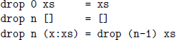

Moreover, the variable n in the second equation and x in the third can be replaced by the wildcard pattern \_, because these variables are not used in the bodies of their equations. In conclusion, our final definition for drop is as follows, which is precisely the definition from the standard prelude.


##### Example – init

As a final example, let us consider how the definition for library function init that removes the last element from a non-empty list can be constructed.

##### **Step 1: define the type**

We begin with a type that states that init takes a list of values of some type a, and produces another list of such values:

``` haskell
init :: [a] -> [a]
```

##### **Step 2: enumerate the cases**

As the empty list is not a valid argument for init, writing down a skeleton definition using pattern matching requires just one case:

``` haskell
init (x:xs) =
```

##### **Step 3: define the simple cases**

Whereas in the previous two examples defining the simple cases was straightforward, a little more thought is required for the function init. By definition, however, removing the last element from a list with one element gives the empty list, so we can introduce a guard to handle this simple case:

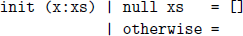

(The library function null :: \[a\] -\> Bool decides if a list is empty.)

#### **Step 4: define the other cases**

How can we remove the last element from a list with at least two elements? By simply retaining the head and removing the last element from the tail:

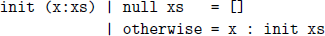

#### **Step 5: generalise and simplify**

The type for init is already as general as possible, but the definition itself can now be simplified by using pattern matching rather than guards, and by using a wildcard pattern in the first equation rather than a variable:

``` haskell
init :: [a] -> [a]
init [_]   = []
init (x:xs) = x : init xs
```

Again, this is precisely the definition from the standard prelude.

### **6.7 Chapter remarks**

The recursive definitions presented in this chapter emphasise clarity, but many can be improved in terms of efficiency or generality, as we shall see later on in the book. The five-step process for defining functions is based on \[8\].

### **6.8 Exercises**

1\. How does the recursive version of the factorial function behave if applied to a negative argument, such as (-1)? Modify the definition to prohibit negative arguments by adding a guard to the recursive case.

2\. Define a recursive function sumdown :: Int -\> Int that returns the sum of the non-negative integers from a given value down to zero. For example, sumdown 3 should return the result 3+2+1+0 = 6.

3\. Define the exponentiation operator ^ for non-negative integers using the same pattern of recursion as the multiplication operator \*, and show how the expression 2 ^ 3 is evaluated using your definition.

4\. Define a recursive function euclid :: Int -\> Int -\> Int that implements *Euclid’s algorithm* for calculating the greatest common divisor of two non-negative integers: if the two numbers are equal, this number is the result; otherwise, the smaller number is subtracted from the larger, and the same process is then repeated. For example:

``` haskell
> euclid 6 27
3
```

5\. Using the recursive definitions given in this chapter, show how length \[1,2,3\], drop 3 \[1,2,3,4,5\], and init \[1,2,3\] are evaluated.

6\. Without looking at the definitions from the standard prelude, define the following library functions on lists using recursion.

a\. Decide if all logical values in a list are True:

``` haskell
and :: [Bool] -> Bool
```

b\. Concatenate a list of lists:

``` haskell
concat :: [[a]] -> [a]
```

c\. Produce a list with n identical elements:

``` haskell
replicate :: Int -> a -> [a]
```

d\. Select the nth element of a list:

``` haskell
(!!) :: [a] -> Int -> a
```

e\. Decide if a value is an element of a list:

``` haskell
elem :: Eq a => a -> [a] -> Bool
```

Note: most of these functions are defined in the prelude using other library functions rather than using explicit recursion, and are generic functions rather than being specific to the type of lists.

7\. Define a recursive function merge :: Ord a =\> \[a\] -\> \[a\] -\> \[a\] that merges two sorted lists to give a single sorted list. For example:

``` haskell
> merge [2,5,6] [1,3,4]
[1,2,3,4,5,6]
```

Note: your definition should not use other functions on sorted lists such as insert or isort, but should be defined using explicit recursion.

8\. Using merge, define a function msort :: Ord a =\> \[a\] -\> \[a\] that implements *merge sort*, in which the empty list and singleton lists are already sorted, and any other list is sorted by merging together the two lists that result from sorting the two halves of the list separately.

Hint: first define a function halve :: \[a\] -\> (\[a\],\[a\]) that splits a list into two halves whose lengths differ by at most one.

9\. Using the five-step process, construct the library functions that:

a\. calculate the sum of a list of numbers;

b\. take a given number of elements from the start of a list;

c\. select the last element of a non-empty list.

Solutions to exercises 1–4 are given in appendix A.