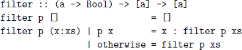
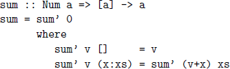
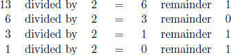
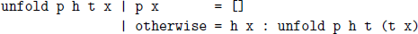

## **7**

## Higher-order functions

In this chapter we introduce higher-order functions, which allow common programming patterns to be encapsulated as functions. We start by explaining what higher-order functions are and why they are useful, then introduce a number of higher-order functions from the standard prelude, and conclude by implementing a binary string transmitter and two voting algorithms.

### **7.1Basic concepts**

As we have seen in previous chapters, functions with multiple arguments are usually defined in Haskell using the notion of currying. That is, the arguments are taken one at a time by exploiting the fact that functions can return functions as results. For example, the definition

``` haskell
add :: Int -> Int -> Int
add x y = x + y
```

means

``` haskell
add :: Int -> (Int -> Int)
add = \x -> (\y -> x + y)
```

and states that add is a function that takes an integer x and returns a function, which in turn takes another integer y and returns their sum x + y. In Haskell, it is also permissible to define functions that take functions as arguments. For example, a function that takes a function and a value, and returns the result of applying the function twice to the value, can be defined as follows:

``` haskell
twice :: (a -> a) -> a -> a
twice f x = f (f x)
```

For example:

``` haskell
> twice (*2) 3
12
> twice reverse [1,2,3]
[1,2,3]
```

Moreover, because twice is a curried function, it can be partially applied with just one argument to build other useful functions. For example, a function that quadruples a number is given by twice (\*2), and the fact that reversing a (finite) list twice has no effect i captured by the equation twice reverse = id, where id is the identity function defined by id x = x.

Formally speaking, a function that takes a function as an argument or returns a function as a result is called a *higher-order function*. In practice, however, because the term curried already exists for returning functions as results, the term higher-order is often just used for taking functions as arguments. It is this latter interpretation that is the subject of this chapter.

Using higher-order functions considerably increases the power of Haskell, by allowing common programming patterns to be encapsulated as functions within the language itself. More generally, higher-order functions can be used to define domain-specific languages within Haskell. For example, in this chapter we present a simple language for processing lists, and in part II of the book we will develop languages for a range of other domains, including interactive programming, effectful programming, and building parsers.

### **7.2Processing lists**

The standard prelude defines a number of useful higher-order functions for processing lists. Many of these are actually generic functions that can be used with a range of different types, but here we restrict our attention to lists. As our first example, the function map applies a function to all elements of a list, and can be defined using a list comprehension as follows:

``` haskell
map :: (a -> b) -> [a] -> [b]
map f xs = [f x | x <- xs]
```

That is, map f xs returns the list of all values f x such that x is an element of the argument list xs. For example, we have:

``` haskell
> map (+1) [1,3,5,7]
[2,4,6,8]
> map even [1,2,3,4]
[False,True,False,True]
> map reverse ["abc","def","ghi"]
["cba","fed","ihg"]
```

There are three further points to note about map. First of all, it is a polymorphic function that can be applied to lists of any type, as are most higher-order functions on lists. Secondly, it can be applied to itself to process nested lists. For example, the function map (map (+1)) increments each number in a list of lists of numbers, as shown in the following calculation:

``` haskell
map (map (+1)) [[1,2,3],[4,5]]
={ applying the outer map }
[map (+1) [1,2,3], map (+1) [4,5]]
={ applying the inner maps }
[[2,3,4],[5,6]]
```

And, finally, the function map can also be defined using recursion:

``` haskell
map :: (a -> b) -> [a] -> [b]
map f []= []
map f (x:xs) = f x : map f xs
```

That is, applying a function to all elements of the empty list gives the empty list, while for a non-empty list the function is simply applied to the head of the list, and we then proceed to apply the function to all elements of the tail. The original definition for map using a list comprehension is simpler, but the recursive definition is preferable for reasoning purposes (see chapter 16.)

Another useful higher-order library function is filter, which selects all elements of a list that satisfy a predicate, where a predicate (or property) is a function that returns a logical value. As with map, the function filter also has a simple definition using a list comprehension:

``` haskell
filter :: (a -> Bool) -> [a] -> [a]
filter p xs = [x | x <- xs, p x]
```

That is, filter p xs returns the list of all values x such that x is an element of the list xs and the value of p x is True. For example:

``` haskell
> filter even [1..10]
[2,4,6,8,10]
> filter (> 5) [1..10]
[6,7,8,9,10]
> filter (/= ’ ’) "abc def ghi"
"abcdefghi"
```

As with map, the function filter can be applied to lists of any type, and can be defined using recursion for the purposes of reasoning:



That is, selecting all elements that satisfy a predicate from the empty list gives the empty list, while for a non-empty list the result depends upon whether the head satisfies the predicate. If it does then the head is retained and we then proceed to filter elements from the tail of the list, otherwise the head is discarded and we simply filter elements from the tail.

The functions map and filter are often used together in programs, with filter being used to select certain elements from a list, each of which is then transformed using map. For example, a function that returns the sum of the squares of the even integers from a list could be defined as follows:

``` haskell
sumsqreven :: [Int] -> Int
sumsqreven ns = sum (map (^2) (filter even ns))
```

We conclude this section by illustrating a number of other higher-order functions for processing lists that are defined in the standard prelude.

- Decide if all elements of a list satisfy a predicate:
  \> all even \[2,4,6,8\]

  True
- Decide if any element of a list satisfies a predicate:
  \> any odd \[2,4,6,8\]

  False
- Select elements from a list while they satisfy a predicate:
  \> takeWhile even \[2,4,6,7,8\]

  \[2,4,6\]
- Remove elements from a list while they satisfy a predicate:
  \> dropWhile odd \[1,3,5,6,7\]

  \[6,7\]

### **7.3The** foldr **function**

Many functions that take a list as their argument can be defined using the following simple pattern of recursion on lists:

``` haskell
f []= v
f (x:xs) = x # f xs
```

That is, the function maps the empty list to a value v, and any non-empty list to an operator \# applied to the head of the list and the result of recursively processing the tail. For example, a number of familiar library functions on lists can be defined using this pattern of recursion:

``` haskell
sum []= 0
sum (x:xs) = x + sum xs
product []= 1
product (x:xs) = x * product xs
or []= False
or (x:xs) = x || or xs
and []= True
and (x:xs) = x && and xs
```

The higher-order library function foldr (abbreviating *fold right*) encapsulates this pattern of recursion for defining functions on lists, with the operator \# and the value v as arguments. For example, using foldr the four definitions above can be rewritten more compactly as follows:

``` haskell
sum :: Num a => [a] -> a
sum = foldr (+) 0
product :: Num a => [a] -> a
product = foldr (*) 1
or :: [Bool] -> Bool
or = foldr (||) False
and :: [Bool] -> Bool
and = foldr (&&) True
```

(Recall that operators must be parenthesised when used as arguments.) These new definitions could also include explicit list arguments, as in

``` haskell
sum xs = foldr (+) 0 xs
```

but we prefer the above definitions in which these arguments are made implicit using partial application because they are simpler.

The foldr function itself can be defined using recursion:

``` haskell
foldr :: (a -> b -> b) -> b -> [a] -> b
foldr f v []= v
foldr f v (x:xs) = f x (foldr f v xs)
```

That is, the function foldr f v maps the empty list to the value v, and any non-empty list to the function f applied to the head of the list and the recursively processed tail. In practice, however, it is best to think of the behaviour of foldr f v in a non-recursive manner, as simply replacing each cons operator in a list by the function f, and the empty list at the end by the value v. For example, applying the function foldr (+) 0 to the list

``` haskell
1 : (2 : (3 : []))
```

gives the result

``` haskell
1 + (2 + (3 + 0))
```

in which : and \[\] have been replaced by + and 0, respectively. Hence, the definition sum = foldr (+) 0 states that summing a list of numbers amounts to replacing each cons by addition and the empty list by zero.

Even though foldr encapsulates a simple pattern of recursion, it can be used to define many more functions than might first be expected. First of all, recall the following definition for the library function length:

``` haskell
length :: [a] -> Int
length []= 0
length (_:xs) = 1 + length xs
```

For example, applying length to the list

``` haskell
1 : (2 : (3 : []))
```

gives the result

``` haskell
1 + (1 + (1 + 0))
```

That is, calculating the length of a list amounts to replacing each cons by the function that adds one to its second argument, and the empty list by zero. Hence, the definition for length can be rewritten using foldr:

``` haskell
length :: [a] -> Int
length = foldr (\_ n -> 1+n) 0
```

Now let us consider the library function that reverses a list, which can be defined in a simple manner using explicit recursion as follows:

``` haskell
reverse :: [a] -> [a]
reverse []= []
reverse (x:xs) = reverse xs ++ [x]
```

For example, applying reverse to the list

``` haskell
1 : (2 : (3 : []))
```

gives the result

``` haskell
(([] ++ [3]) ++ [2]) ++ [1]
```

It is perhaps not clear from the definition, or the example, how reverse can be defined using foldr. However, if we define a function snoc x xs = xs ++ \[x\] that adds a new element at the end of a list rather than at the start (snoc is cons backwards), then reverse can be redefined as

``` haskell
reverse []= []
reverse (x:xs) = snoc x (reverse xs)
```

from which a definition using foldr is then immediate:

``` haskell
reverse :: [a] -> [a]
reverse = foldr snoc []
```

We conclude this section by noting that the name *fold right* reflects the use of an operator that is assumed to associate to the right. For example, evaluating foldr (+) 0 \[1,2,3\] gives the result 1+(2+(3+0)), in which the bracketing specifies that addition is assumed to associate to the right. More generally, the behaviour of foldr can be summarised as follows:

``` haskell
foldr (#) v [x0,x1,...,xn] = x0 # (x1 # (... (xn # v) ...))
```

### **7.4The** foldl **function**

It is also possible to define recursive functions on lists using an operator that is assumed to associate to the left. For example, the function sum can be redefined in this manner by using an auxiliary function sum’ that takes an extra argument v that is used to accumulate the final result:



For example:

``` haskell
sum [1,2,3]
={ applying sum }
sum’ 0 [1,2,3]
={ applying sum’ }
sum’ (0+1) [2,3]
={ applying sum’ }
sum’ ((0+1)+2) [3]
={ applying sum’ }
sum’ (((0+1)+2)+3) []
={ applying sum’ }
((0+1)+2)+3
={ applying + }
6
```

The bracketing in this calculation specifies that addition is now assumed to associate to the left. In practice, however, the order of association does not affect the value of the result in this case, because addition is associative. That is, x+(y+z) = (x+y)+z for any numbers x, y, and z.

Generalising from the sum example, many functions on lists can be defined using the following simple pattern of recursion:

``` haskell
f v []= v
f v (x:xs) = f (v # x) xs
```

That is, the function maps the empty list to the *accumulator* value v, and any non-empty list to the result of recursively processing the tail using a new accumulator value obtained by applying an operator \# to the current value and the head of the list. The higher-order library function foldl (abbreviating *fold left*) encapsulates this pattern of recursion, with the operator \# and the accumulator v as arguments. For example, using foldl the above definition for the function sum can be rewritten more compactly as follows:

``` haskell
sum :: Num a => [a] -> a
sum = foldl (+) 0
```

Similarly, we have:

``` haskell
product :: Num a => [a] -> a
product = foldl (*) 1
or :: [Bool] -> Bool
or = foldl (||) False
and :: [Bool] -> Bool
and = foldl (&&) True
```

The other foldr examples from the previous section can also be redefined using foldl, by supplying the appropriate operators:

``` haskell
length :: [a] -> Int
length = foldl (\n _ -> n+1) 0
reverse :: [a] -> [a]
reverse = foldl (\xs x -> x:xs) []
```

For example, with these new definitions,

``` haskell
length [1,2,3] = ((0 + 1) + 1) + 1 = 3
reverse [1,2,3] = 3 : (2 : (1 : [])) = [3,2,1]
```

When a function can be defined using both foldr and foldl, as in the above examples, the choice of which definition is preferable is usually made on grounds of efficiency and requires careful consideration of the evaluation mechanism underlying Haskell, which is discussed in chapter 15.

The foldl function itself can be defined using recursion:

``` haskell
foldl :: (a -> b -> a) -> a -> [b] -> a
foldl f v []= v
foldl f v (x:xs) = foldl f (f v x) xs
```

In practice, however, as with foldr it is best to think of the behaviour of foldl in a non-recursive manner, in terms of an operator \# that is assumed to associate to the left, as summarised by the following equation:

``` haskell
foldl (#) v [x0,x1,...,xn] = (... ((v # x0) # x1) ...) # xn
```

### **7.5The composition operator**

The higher-order library operator . returns the composition of two functions as a single function, and can be defined as follows:

``` haskell
(.) :: (b -> c) -> (a -> b) -> (a -> c)
f . g = \x -> f (g x)
```

That is, f . g, which is read as f *composed with* g, is the function that takes an argument x, applies the function g to this argument, and applies the function f to the result. This operator could also be defined by (f . g) x = f (g x). However, we prefer the above definition in which the x argument is shunted to the body of the definition using a lambda expression, because it makes explicit the idea that composition returns a function as its result.

Composition can be used to simplify nested function applications, by reducing parentheses and avoiding the need to explicitly refer to the initial argument. For example, using composition the definitions

``` haskell
odd n = not (even n)
twice f x = f (f x)
sumsqreven ns = sum (map (^2) (filter even ns))
```

can be rewritten more simply:

``` haskell
odd = not . even
twice f = f . f
sumsqreven = sum . map (^2) . filter even
```

The last definition exploits the fact that composition is associative. That is, f . (g . h) = (f . g) . h for any functions f, g, and h of the appropriate types. Hence, in a composition of three of more functions, as in sumsqreven, there is no need to include parentheses to indicate the order of association, because associativity ensures that this does not affect the result.

Composition also has an identity, given by the identity function:

``` haskell
id :: a -> a
id = \x -> x
```

That is, id is the function that simply returns its argument unchanged, and has the property that id . f = f and f . id = f for any function f. The identity function is often useful when reasoning about programs, and also provides a suitable starting point for a sequence of compositions. For example, the composition of a list of functions can be defined as follows:

``` haskell
compose :: [a -> a] -> (a -> a)
compose = foldr (.) id
```

### **7.6Binary string transmitter**

We conclude this chapter with two extended programming examples. First of all, we consider the problem of simulating the transmission of a string of characters in low-level form as a list of binary digits.

#### Binary numbers

As a consequence of having ten fingers, people normally find it most convenient to use numbers written in base-ten or *decimal* notation. A decimal number is sequence of digits in the range zero to nine, in which the rightmost digit has a weight of one, and successive digits as we move to the left in the number increase in weight by a factor of ten. For example, the decimal number 2345 can be understood in these terms as follows:

2345 = (1000 \* 2) +(100 \* 3) +(10 \* 4) +(1 \* 5)

That is, 2345 represents the sum of the products of the weights 1000*,* 100*,* 10*,* 1 with the digits 2*,* 3*,* 4*,* 5, which evaluates to the integer 2345.

In contrast, computers normally find it more convenient to use numbers written in the more primitive base-two or *binary* notation. A binary number is a sequence of zeros and ones, called binary digits or *bits*, in which successive bits as we move to the left increase in weight by a factor of two. For example, the binary number 1101 can be understood as follows:

``` haskell
1101 = (8 * 1) +(4 * 1) +(2 * 0) +(1 * 1)
```

That is, 1101 represents the sum of the products of the weights 8*,* 4*,* 2*,* 1 with the bits 1*,* 1*,* 0*,* 1, which evaluates to the integer 13.

To simplify the definition of certain functions, we assume for the remainder of this example that binary numbers are written in *reverse* order to normal. For example, 1101 would now be written as 1011, with successive bits as we move to the right increasing in weight by a factor of two:

1011 = (1 \* 1) +(2 \* 0) +(4 \* 1) +(8 \* 1)

##### Base conversion

We begin by importing the library of useful functions on characters:

``` haskell
import Data.Char
```

To make the types of the functions that we define more meaningful, we declare a type for bits as a synonym for the type of integers:

``` haskell
type Bit = Int
```

A binary number, represented as a list of bits, can be converted into an integer by simply evaluating the appropriate weighted sum:

``` haskell
bin2int :: [Bit] -> Int
bin2int bits = sum [w*b | (w,b) <- zip weights bits]
where weights = iterate (*2) 1
```

The higher-order library function iterate produces an infinite list by applying a function an increasing number of times to a value:

iterate f x = \[x, f x, f (f x), f (f (f x)), ...\]

Hence the expression iterate (\*2) 1 in the definition of bin2int produces the list of weights \[1,2,4,8,...\], which is then used to compute the weighted sum by means of a list comprehension. For example:

``` haskell
> bin2int [1,0,1,1]
13
```

There is, however, a simpler way to define bin2int, which can be revealed with the aid of some algebra. Consider an arbitrary four-bit binary number \[*a, b, c, d*\]. Applying bin2int to this list will produce the weighted sum

(1 \* *a*) +(2 \* *b*) +(4 \* *c*) +(8 \* *d*)

which can be restructured as follows:

``` haskell
(1 * a) +(2 * b) +(4 * c) +(8 * d)
={ simplifying 1 * a }
a +(2 * b) +(4 * c) +(8 * d)
={ factoring out 2 *}
a + 2 * (b +(2 * c) +(4 * d))
={ factoring out 2 *}
a + 2 * (b + 2 * (c +(2 * d)))
={ complicating d }
a + 2 * (b + 2 * (c + 2 * (d + 2 * 0)))
```

The final result shows that converting a list of bits \[*a, b, c, d*\] into an integer amounts to replacing each cons by the function that adds its first argument to twice its second argument, and replacing the empty list by zero. More generally, we conclude that bin2int can be rewritten using foldr:

``` haskell
bin2int :: [Bit] -> Int
bin2int = foldr (\x y -> x + 2*y) 0
```

Now let us consider the opposite conversion, from a non-negative integer into a binary number. This can be achieved by repeatedly dividing the integer by two and taking the remainder, until the integer becomes zero. For example, starting with the integer 13, we proceed as follows:



The sequence of remainders, 1011, provides the binary representation of the integer 13. It is easy to implement this procedure using recursion:

``` haskell
int2bin :: Int -> [Bit]
int2bin 0 = []
int2bin n = n ‘mod‘ 2 : int2bin (n ‘div‘ 2)
```

For example:

``` haskell
> int2bin 13
[1,0,1,1]
```

We will ensure that all our binary numbers have the same length, in this case eight bits, by using a function make8 that truncates or extends a binary number as appropriate to make it precisely eight bits:

``` haskell
make8 :: [Bit] -> [Bit]
make8 bits = take 8 (bits ++ repeat 0)
```

The library function repeat :: a -\> \[a\] produces an infinite list of copies of a value, but lazy evaluation ensures that only as many elements as required by the context will actually be produced. For example:

``` haskell
> make8 [1,0,1,1]
[1,0,1,1,0,0,0,0]
```

##### Transmission

We can now define a function that encodes a string of characters as a list of bits by converting each character into a Unicode number, converting each such number into an eight-bit binary number, and concatenating each of these numbers together to produce a list of bits. Using the higher-order functions map and composition, this conversion can be implemented as follows:

``` haskell
encode :: String -> [Bit]
encode = concat . map (make8 . int2bin . ord)
```

For example:

``` haskell
> encode "abc"
[1,0,0,0,0,1,1,0,0,1,0,0,0,1,1,0,1,1,0,0,0,1,1,0]
```

To decode a list of bits produced using encode, we first define a function chop8 that chops such a list up into eight-bit binary numbers:

``` haskell
chop8 :: [Bit] -> [[Bit]]
chop8 []= []
chop8 bits = take 8 bits : chop8 (drop 8 bits)
```

It is now easy to define a function that decodes a list of bits as a string of characters by chopping the list up, and converting each resulting binary number into a Unicode number and then a character:

``` haskell
decode :: [Bit] -> String
decode = map (chr . bin2int) . chop8
```

For example:

``` haskell
> decode [1,0,0,0,0,1,1,0,0,1,0,0,0,1,1,0,1,1,0,0,0,1,1,0]
"abc"
```

Finally, we define a function transmit that simulates the transmission of a string of characters as a list of bits, using a perfect communication channel that we model using the identity function:

``` haskell
transmit :: String -> String
transmit = decode . channel . encode
channel :: [Bit] -> [Bit]
channel = id
```

For example:

``` haskell
> transmit "higher-order functions are easy"
"higher-order functions are easy"
```

### **7.7Voting algorithms**

For our second extended programming example, we consider two different algorithms for deciding the winner in an election: the simple *first past the post* system, and the more refined *alternative vote* system.

##### First past the post

In this system, each person has one vote, and the candidate with the largest number of votes is declared the winner. For example, if we define

``` haskell
votes :: [String]
votes = ["Red", "Blue", "Green", "Blue", "Blue", "Red"]
```

then candidate "Green" has one vote, "Red" has two votes, while "Blue" has three votes and is hence the winner. Rather than making our implementation specific to candidate names represented as strings, we exploit the class system of Haskell to define our functions in a more general manner.

First of all, we define a function that counts the number of times that a given value occurs in a list, for any type whose values can be compared for equality. This function could be defined using recursion, but a simpler definition is possible using higher-order functions by selecting all elements from the list that are equal to the target value, and taking the length of the resulting list:

``` haskell
count :: Eq a => a -> [a] -> Int
count x = length . filter (== x)
```

For example:

``` haskell
> count "Red" votes
2
```

In turn, the higher-order function filter can also be used to define a function that removes duplicate values from a list:

``` haskell
rmdups :: Eq a => [a] -> [a]
rmdups []= []
rmdups (x:xs) = x : filter (/= x) (rmdups xs)
```

For example:

``` haskell
> rmdups votes
["Red", "Blue", "Green"]
```

The functions count and rmdups can then be combined using a list comprehension to define a function that returns the result of a first-past-the-post election in increasing order of the number of votes received:

``` haskell
result :: Ord a => [a] -> [(Int,a)]
result vs = sort [(count v vs, v) | v <- rmdups vs]
```

For example:

``` haskell
> result votes
[(1,"Green"), (2,"Red"), (3,"Blue")]
```

The sorting function sort :: Ord a =\> \[a\] -\> \[a\] used above is provided in the library Data.List. Note that because pairs are ordered lexicographically, candidates with the same number of votes are returned in order of the candidate name by result. Finally, the winner of an election can now be obtained simply by selecting the second component of the last result:

``` haskell
winner :: Ord a => [a] -> a
winner = snd . last . result
```

For example:

``` haskell
> winner votes
"Blue"
```

##### Alternative vote

In this voting system, each person can vote for as many or as few candidates as they wish, listing them in preference order on their ballot (1st choice, 2nd choice, and so on). To decide the winner, any empty ballots are first removed, then the candidate with the smallest number of 1st-choice votes is eliminated from the ballots, and same process is repeated until only one candidate remains, who is then declared the winner. For example, if we define

``` haskell
ballots ::   [[String]]
ballots = [["Red", "Green"],
["Blue"],
["Green", "Red", "Blue"],
["Blue", "Green", "Red"],
["Green"]]
```

then the first ballot has "Red" as 1st choice and "Green" as 2nd, while the second has "Blue" as the only choice, and so on. Now let us consider how the winner is decided for this example. First of all, "Red" has the smallest number of 1st-choice votes (just one), and is therefore eliminated:

``` haskell
[["Green"],
["Blue"],
["Green", "Blue"],
["Blue", "Green"],
["Green"]]
```

Within these revised ballots, candidate "Blue" now has the smallest number of 1st-choice votes (just two), and is therefore also eliminated:

``` haskell
[["Green"],
[],
["Green"],
["Green"],
["Green"]]
```

After removing the second ballot, which is now empty, "Green" is the only remaining candidate and is hence the winner.

Using filter and map, it is easy to define functions that remove empty ballots, and eliminate a given candidate from each ballot:

``` haskell
rmempty :: Eq a => [[a]] -> [[a]]
rmempty = filter (/= [])
elim :: Eq a => a -> [[a]] -> [[a]]
elim x = map (filter (/= x))
```

As before, we define such functions in a general manner rather than just for strings. In turn, using the function result from the previous section, we can define a function that ranks the 1st-choice candidates in each ballot in increasing order of the number of such votes that were received:

``` haskell
rank :: Ord a => [[a]] -> [a]
rank = map snd . result . map head
```

For example:

``` haskell
> rank ballots
["Red", "Blue", "Green"]
```

Finally, it is now straightforward to define a recursive function that implements the alternative vote algorithm, as follows:

``` haskell
winner’ :: Ord a => [[a]] -> a
winner’ bs = case rank (rmempty bs) of
[c]-> c
(c:cs) -> winner’ (elim c bs)
```

That is, we first remove empty ballots, then rank the remaining 1st-choice candidates in increasing order of votes. If only one such candidate remains, they are the winner, otherwise we eliminate the candidate with the smallest number of 1st-choice votes and repeat the process. For example:

``` haskell
> winner’ ballots
"Green"
```

We conclude by noting that the case mechanism of Haskell that is used in the above definition allows pattern matching to be used in the body of a definition, and is sometimes useful for avoiding the need to introduce an extra function definition just for the purposes of performing pattern matching.

### **7.8Chapter remarks**

Further applications of higher-order functions, including the production of computer music, financial contracts, graphical images, hardware descriptions, logic programs, and pretty printers can be found in *The Fun of Programming* \[9\]. A more in-depth tutorial on foldr is given in \[10\].

### **7.9Exercises**

1.Show how the list comprehension \[f x \| x \<- xs, p x\] can be re-expressed using the higher-order functions map and filter.

2.Without looking at the definitions from the standard prelude, define the following higher-order library functions on lists.

a.Decide if all elements of a list satisfy a predicate:

``` haskell
all :: (a -> Bool) -> [Bool] -> Bool
```

b.Decide if any element of a list satisfies a predicate:

``` haskell
any :: (a -> Bool) -> [Bool] -> Bool
```

c.Select elements from a list while they satisfy a predicate:

``` haskell
takeWhile :: (a -> Bool) -> [a] -> [a]
```

d.Remove elements from a list while they satisfy a predicate:

``` haskell
dropWhile :: (a -> Bool) -> [a] -> [a]
```

Note: in the prelude the first two of these functions are generic functions rather than being specific to the type of lists.

3.Redefine the functions map f and filter p using foldr.

4.Using foldl, define a function dec2int :: \[Int\] -\> Int that converts a decimal number into an integer. For example:

``` haskell
> dec2int [2,3,4,5]
2345
```

5.Without looking at the definitions from the standard prelude, define the higher-order library function curry that converts a function on pairs into a curried function, and, conversely, the function uncurry that converts a curried function with two arguments into a function on pairs.

Hint: first write down the types of the two functions.

6.A higher-order function unfold that encapsulates a simple pattern of recursion for producing a list can be defined as follows:



That is, the function unfold p h t produces the empty list if the predicate p is true of the argument value, and otherwise produces a non-empty list by applying the function h to this value to give the head, and the function t to generate another argument that is recursively processed in the same way to produce the tail of the list. For example, the function int2bin can be rewritten more compactly using unfold as follows:

``` haskell
int2bin = unfold (== 0) (‘mod‘ 2) (‘div‘ 2)
```

Redefine the functions chop8, map f and iterate f using unfold.

7.Modify the binary string transmitter example to detect simple transmission errors using the concept of parity bits. That is, each eight-bit binary number produced during encoding is extended with a parity bit, set to one if the number contains an odd number of ones, and to zero otherwise. In turn, each resulting nine-bit binary number consumed during decoding is checked to ensure that its parity bit is correct, with the parity bit being discarded if this is the case, and a parity error being reported otherwise.

Hint: the library function error :: String -\> a displays the given string as an error message and terminates the program; the polymorphic result type ensures that error can be used in any context.

8.Test your new string transmitter program from the previous exercise using a faulty communication channel that forgets the first bit, which can be modelled using the tail function on lists of bits.

9.Define a function altMap :: (a -\> b) -\> (a -\> b) -\> \[a\] -\> \[b\] that alternately applies its two argument functions to successive elements in a list, in turn about order. For example:

``` haskell
> altMap (+10) (+100) [0,1,2,3,4]
[10,101,12,103,14]
```

10.Using altMap, define a function luhn :: \[Int\] -\> Bool that implements the *Luhn algorithm* from the exercises in chapter 4 for bank card numbers of any length. Test your new function using your own bank card.

Solutions to exercises 1–5 are given in appendix A.