## **8**

## Declaring types and classes

In this chapter we introduce mechanisms for declaring new types and classes in Haskell. We start with three approaches to declaring types, then consider recursive types, show how to declare classes and their instances, and conclude by developing a tautology checker and an abstract machine.

### **8.1Type declarations**

The simplest way of declaring a new type is to introduce a new name for an existing type, using the type mechanism of Haskell. For example, the following declaration from the standard prelude states that the type String is just a synonym for the type \[Char\] of lists of characters:

type String = \[Char\]

As in this example, the name of a new type must begin with a capital letter. Type declarations can be nested, in the sense that one such type can be declared in terms of another. For example, if we were defining a number of functions that transform coordinate positions, we might declare a position as a pair of integers, and a transformation as a function on positions:

type Pos = (Int,Int)  
  

type Trans = Pos -\> Pos

However, type declarations cannot be recursive. For example, consider the following recursive declaration for a type of trees:

type Tree = (Int,\[Tree\])

That is, a tree is a pair comprising an integer and a list of subtrees. While this declaration is perfectly reasonable, with the empty list of subtrees forming the base case for the recursion, it is not permitted in Haskell because it is recursive. If required, recursive types can be declared using the more powerful data mechanism, which will be introduced in the next section.

Type declarations can also be parameterised by other types. For example, if we were defining a number of functions that manipulate pairs of values of the same type, we could declare a synonym for such pairs:

type Pair a = (a,a)

Finally, type declarations with more than one parameter are possible too. For example, a type of lookup tables that associate keys of one type to values of another type can be declared as a list of (key,value) pairs:

type Assoc k v = \[(k,v)\]

Using this type, a function that returns the first value that is associated with a given key in a table can then be defined as follows:

find :: Eq k =\> k -\> Assoc k v -\> v

find k t = head \[v \| (k’,v) \<- t, k == k’\]

### **8.2Data declarations**

A completely new type, as opposed to a synonym for an existing type, can be declared by specifying its values using the data mechanism of Haskell. For example, the following declaration from the standard prelude states that the type Bool comprises two new values, named False and True:

data Bool = False \| True

In such declarations, the symbol \| is read as *or*, and the new values of the type are called *constructors*. As with new types themselves, the names of new constructors must begin with a capital letter. Moreover, the same constructor name cannot be used in more than one type.

Note that the names given to new types and constructors have no inherent meaning to the Haskell system. For example, the above declaration could equally well be written as data A = B \| C, because the precise details of the names are not relevant, other than the fact that they have not been used before. The meaning of names such as Bool, False, and True is assigned by the programmer, via the functions that they define on new types.

Values of new types in Haskell can be used in precisely the same way as those of built-in types. In particular, they can freely be passed as arguments to functions, returned as results from functions, stored in data structures, and used in patterns. For example, given the declaration

data Move = North \| South \| East \| West

functions that apply a move to a position, apply a list of moves to a position, and reverse the direction of a move, can be defined as follows:

move :: Move -\> Pos -\> Pos

move North (x,y) = (x,y+1)

move South (x,y) = (x,y-1)

move East (x,y)= (x+1,y)

move West (x,y)= (x-1,y)  
  

moves :: \[Move\] -\> Pos -\> Pos

moves \[\] p = p

moves (m:ms) p = moves ms (move m p)  
  

rev :: Move -\> Move

rev North = South

rev South = North

rev East= West

rev West= East

(If you wish to try out such examples in GHCi, the phrase deriving Show must be added to the end of the data declaration, to ensure the system can display values of the new type; the deriving mechanism itself will be covered in later on in this chapter when we consider type classes.)

The constructors in a data declaration can also have arguments. For example, a type of shapes that comprise circles with a given radius and rectangles with given dimensions can be declared by:

data Shape = Circle Float \| Rect Float Float

That is, the type Shape has values of the form Circle r, where r is a floating-point number, and Rect x y, where x and y are floating-point numbers. These constructors can then be used to define functions on shapes, such as to produce a square of a given size, and to calculate the area of a shape:

square :: Float -\> Shape

square n = Rect n n  
  

area :: Shape -\> Float

area (Circle r) = pi \* r^2

area (Rect x y) = x \* y

Because of their use of arguments, the constructors Circle and Rect are actually constructor *functions*, which produce results of type Shape from arguments of type Float, as can be demonstrated using GHCi:

\> :type Circle

Circle :: Float -\> Shape  
  

\> :type Rect

Rect :: Float -\> Float -\> Shape

The difference between normal functions and constructor functions is that the latter have no defining equations, and exist purely for the purposes of building pieces of data. For example, whereas the expression negate 1.0 can be evaluated to -1.0 by applying the definition of negate, the expression Circle 1.0 is already fully evaluated and cannot be further simplified, because there are no defining equations for Circle. Rather, the expression Circle 1.0 is just a piece of data, in the same way that 1.0 itself is just data.

Not surprisingly, data declarations themselves can also be parameterised. For example, the standard prelude declares the following type:

data Maybe a = Nothing \| Just a

That is, a value of type Maybe a is either Nothing, or of the form Just x for some value x of type a. We can think of values of type Maybe a as being values of type a that may either fail or succeed, with Nothing representing failure, and Just representing success. For example, using this type we can define safe versions of the library functions div and head, which return Nothing in the case of invalid arguments, rather than producing an error:

safediv :: Int -\> Int -\> Maybe Int

safediv \_ 0 = Nothing

safediv m n = Just (m ‘div‘ n)  
  

safehead :: \[a\] -\> Maybe a

safehead \[\] = Nothing

safehead xs = Just (head xs)

### **8.3Newtype declarations**

If a new type has a single constructor with a single argument, then it can also be declared using the newtype mechanism. For example, a type of natural numbers (non-negative integers) could be declared as follows:

newtype Nat = N Int

In this case, the single constructor N takes a single argument of type Int, and it is then up to the programmer to ensure that this is always non-negative. Of course, it is natural to ask how the above declaration using newtype compares to the following alternative versions using type and data:

type Nat = Int  
  

data Nat = N Int

First of all, using newtype rather than type means that Nat and Int are different types rather than synonyms, and hence the type system of Haskell ensures that they cannot accidentally be mixed up in our programs, for example by using an integer when we expect a natural number. And secondly, using newtype rather than data brings an efficiency benefit, because newtype constructors such as N do not incur any cost when programs are evaluated, as they are automatically removed by the compiler once type checking is completed. In summary, using newtype helps improve type safety, without affecting performance.

### **8.4Recursive types**

New types declared using the data and newtype mechanisms can also be recursive. As a simple first example, the type of natural numbers from the previous section can also be declared in a recursive manner:

data Nat = Zero \| Succ Nat

That is, a value of type Nat is either Zero, or of the form Succ n for some value n of type Nat. Hence, this declaration gives rise to an infinite sequence of values, starting with the value Zero, and continuing by applying the constructor function Succ to the previous value in the sequence:

Zero

Succ Zero

Succ (Succ Zero)

Succ (Succ (Succ Zero))

.

.

.

In this manner, values of type Nat correspond to natural numbers with Zero representing the number 0, and Succ representing the successor function (1+). For example, Succ (Succ (Succ Zero)) represents 1 +(1 +(1 + 0)) = 3. More formally, we can define the following conversion functions:

nat2int :: Nat -\> Int

nat2int Zero= 0

nat2int (Succ n) = 1 + nat2int n  
  

int2nat :: Int -\> Nat

int2nat 0 = Zero

int2nat n = Succ (int2nat (n-1))

For example, using these functions, two natural numbers can be added together by first converting them into integers, adding these integers, and then converting the result back into a natural number:

add :: Nat -\> Nat -\> Nat

add m n = int2nat (nat2int m + nat2int n)

However, using recursion the function add can be redefined without the need for such conversions, and hence more efficiently:

add :: Nat -\> Nat -\> Nat

add Zero n= n

add (Succ m) n = Succ (add m n)

This definition formalises the idea that two natural numbers can be added by copying Succ constructors from the first number until they are exhausted, at which point the Zero at the end is replaced by the second number. For example, showing that 2 + 1 = 3 proceeds as follows:

add (Succ (Succ Zero)) (Succ Zero)

={ applying add }

Succ (add (Succ Zero) (Succ Zero))

={ applying add }

Succ (Succ (add Zero (Succ Zero)))

={ applying add }

Succ (Succ (Succ Zero))

As another example, the data mechanism can be used to declare our own version of the built-in type of lists, parameterised by an arbitrary type:

data List a = Nil \| Cons a (List a)

That is, a value of type List a is either Nil, representing the empty list, or of the form Cons x xs for some values x :: a and xs :: List a, representing a non-empty list. Using this type, we can then also define our own versions of library functions on lists, such as to calculate the length of a list:

len :: List a -\> Int

len Nil= 0

len (Cons \_ xs) = 1 + len xs

While lists are one of the most commonly used data structure in computing, it is often useful to store data in a two-way branching structure, or *binary tree*, as depicted in the following example tree:

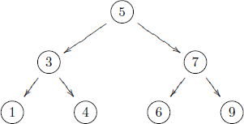

In this example, the numbers 1*,* 4*,* 6*,* 9 appear at the external *leaves* of the tree, and the numbers 5*,* 3*,* 7 appear at the internal *nodes*. Using recursion, a suitable type for representing such trees can be declared by

data Tree a = Leaf a \| Node (Tree a) a (Tree a)

and the tree pictured above can then be represented as follows:

t :: Tree Int

t = Node (Node (Leaf 1) 3 (Leaf 4)) 5

(Node (Leaf 6) 7 (Leaf 9))

We now consider a number of functions on such trees. First of all, we define a function that decides if a given value occurs in a tree:

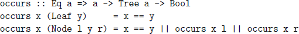

That is, a value occurs in a leaf if it matches the value at the leaf, and occurs in a node if it either matches the value at the node, occurs in the left subtree, or occurs in the right subtree. Note that under lazy evaluation, if either of the first two conditions in the node case is True, then the result True is returned without the need to evaluate the remaining conditions.

In the worst case, however, the function occurs may still traverse the entire tree, in particular when the given value does not occur anywhere in the tree. Now consider a function that flattens a tree to a list:

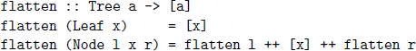

If applying this function to a tree gives a sorted list, then the tree is called a *search tree*. For instance, our example tree is a search tree, because:

flatten t = \[1,3,4,5,6,7,9\]

Search trees have the important property that, when trying to decide if a given value occurs in a tree, which of the two subtrees of a node it may occur in can always be determined in advance. In particular, if the value is less than the value at the node, then it can only occur in the left subtree, and if it is greater than this value, it can only occur in the right subtree. Hence, for search trees the occurs function can be rewritten as follows:

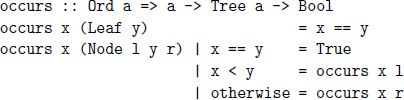

This definition is more efficient than the previous version, because it only traverses one path down the tree, rather than potentially the entire tree.

We conclude this section by noting that, as in nature, trees in computing come in many different forms. For example, we can declare types for trees that have data only in their leaves, data only in their nodes, data of different types in their leaves and nodes, or have a list of subtrees:

```cpp
data Tree a = Leaf a \| Node (Tree a) (Tree a)


data Tree a = Leaf \| Node (Tree a) a (Tree a)


data Tree a b = Leaf a \| Node (Tree a b) b (Tree a b)
```
  

data Tree a = Node a \[Tree a\]

Which form of tree is most appropriate depends upon the situation. Note that in the last example, there is no constructor for leaves, because a node with an empty list of subtrees can play the role of a leaf.

### **8.5Class and instance declarations**

We now turn our attention from types to classes. In Haskell, a new class can be declared using the class mechanism. For example, the class Eq of equality types is declared in the standard prelude as follows:

class Eq a where

(==), (/=) :: a -\> a -\> Bool  
  

x /= y = not (x == y)

This declaration states that for a type a to be an instance of the class Eq, it must support equality and inequality operators of the specified types. In fact, because a *default definition* has already been included for the /= operator, declaring an instance only requires a definition for the == operator. For example, the type Bool can be made into an equality type as follows:

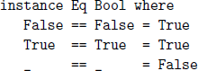

Only types that are declared using the data and newtype mechanisms can be made into instances of classes. Note also that default definitions can be overridden in instance declarations if desired. For example, for some equality types there may be a more efficient or appropriate way to decide if two values are different than simply checking if they are not equal.

Classes can also be extended to form new classes. For example, the class Ord of types whose values are totally ordered is declared in the standard prelude as an extension of the class Eq as follows:

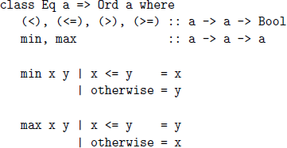

That is, for a type to be an instance of Ord it must be an instance of Eq, and support six additional operators. Because default definitions have already been included for min and max, declaring an equality type (such as Bool) as an ordered type only requires defining the four comparison operators:

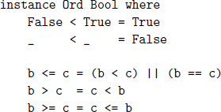

##### Derived instances

When new types are declared, it is usually appropriate to make them into instances of a number of built-in classes. Haskell provides a simple facility for automatically making new types into instances of the classes Eq, Ord, Show, and Read, in the form of the deriving mechanism. For example, the type Bool is actually declared in the standard prelude as follows:

data Bool = False \| True

deriving (Eq, Ord, Show, Read)

As a result, all the member functions from the four derived classes can then be used with logical values. For example:

\> False == False

True  
  

\> False \< True

True  
  

\> show False

"False"  
  

\> read "False" :: Bool

False

The use of :: in the last example is required to resolve the type of the result, which in this case cannot be inferred from the context in which the function is used. Note that for the purposes of deriving instances of the class Ord of ordered types, the ordering on the constructors of a type is determined by their position in its declaration. Hence, the above declaration for the type Bool, in which False appears before True, results in the ordering False \< True.

In the case of constructors with arguments, the types of these arguments must also be instances of any derived classes. For example, recall the following two declarations from earlier in this chapter:

data Shape = Circle Float \| Rect Float Float  
  

data Maybe a = Nothing \| Just a

To derive Shape as an equality type requires that the type Float is also an equality type, which is indeed the case. Similarly, to derive Maybe a as an equality type requires that the type a is also such a type, which then becomes a class constraint on this parameter. In the same manner as lists and tuples, values built using constructors with arguments are ordered lexicographically. For example, if Shape is also derived as an ordered type, then we have:

\> Rect 1.0 4.0 \< Rect 2.0 3.0

True  
  

\> Rect 1.0 4.0 \< Rect 1.0 3.0

False

### **8.6Tautology checker**

We conclude this chapter with two extended programming examples. For our first example, we develop a function that decides if simple logical propositions are always true. Such propositions are called *tautologies*.

Consider a language of propositions built up from basic values (*False*,*True*) and variables (*A, B,* ...*, Z*) using negation (¬), conjunction (^), implication (⇒), and parentheses. For example, the following are all propositions:

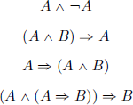

The meaning of the logical operators can be defined using *truth tables*, which give the resulting value for each combination of argument values:

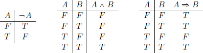

(To save space in such tables, we abbreviate the basic values by *F* and *T* .) For example, the truth table for conjunction states that *A* ^ *B* returns *True* if both *A* and *B* are *True*, and *False* otherwise. Using these definitions, the truth table for any proposition can then be constructed. In the case of our four example propositions, the resulting tables are as follows:

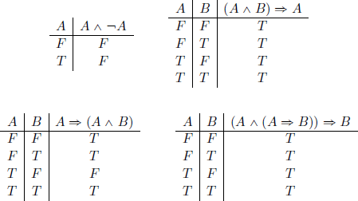

These tables show that the second and fourth propositions are tautologies, because their result value is always *True*, while the first and third are not tautologies, because their result is *False* in at least one case.

The first step towards defining a function that decides if a proposition is a tautology is to declare a type for propositions, with one constructor for each of the five possible forms that a proposition can have:

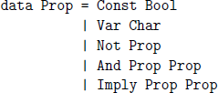

Note that an explicit constructor for parentheses is not required, as parentheses within Haskell itself can be used to indicate grouping. For example, the four propositions above can be represented as follows:

p1 :: Prop

p1 = And (Var ’A’) (Not (Var ’A’))  
  

p2 :: Prop

p2 = Imply (And (Var ’A’) (Var ’B’)) (Var ’A’)  
  

p3 :: Prop

p3 = Imply (Var ’A’) (And (Var ’A’) (Var ’B’))  
  

p4 :: Prop

p4 = Imply (And (Var ’A’) (Imply

(Var ’A’) (Var ’B’))) (Var ’B’)

In order to evaluate a proposition to a logical value, we need to know the value of each of its variables. For this purpose, we declare a *substitution* as a lookup table that associates variable names to logical values, using the Assoc type that was introduced at the start of this chapter:

type Subst = Assoc Char Bool

For example, the substitution \[(’A’,False),(’B’,True)\] assigns the variable A to False, and B to True. A function that evaluates a proposition given a substitution for its variables can now be defined by pattern matching on the five possible forms that the proposition can have:

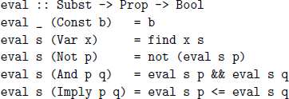

For example, the value of a constant proposition is simply the constant itself, the value of a variable is obtained by looking up its value in the substitution, and the value of a conjunction is given by taking the conjunction of the values of the two argument propositions. Note that the logical implication operator ⇒ is implemented simply by the \<= ordering on logical values.

To decide if a proposition is a tautology, we will consider all possible substitutions for the variables that it contains. First of all, we define a function that returns a list of all the variables in a proposition:

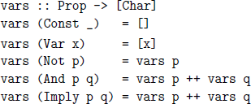

For example, vars p2 = \[’A’,’B’,’A’\]. Note that this function does not remove duplicates, which will be done separately later on.

The key to generating substitutions is producing lists of logical values of a given length. Hence we seek to define a function bools :: Int -\> \[\[Bool\]\] which, for example, will return all eight lists of three logical values:

\> bools 3

\[\[False, False, False\],

\[False, False, True\],

\[False, True, False\],

\[False, True, True\],

\[True, False, False\],

\[True, False, True\],

\[True, True, False\],

\[True, True, True\]\]

One way to achieve this behaviour is to observe that each component list corresponds to a binary number, by interpreting False and True as the binary digits 0 and 1. For example, the list \[True,False,True\] corresponds to the binary number 101. Given this interpretation, we can think of the function bools as simply counting in binary over the appropriate range of numbers.

This idea leads to the following definition for bools, in terms of the function int2bin :: Int -\> \[Bit\] from chapter 7 that converts a non-negative integer into a binary number represented as a list of bits:

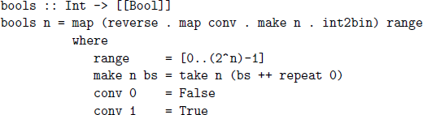

There is, however, a simpler way to define bools, which can be revealed by thinking about the structure of the resulting lists. For example, we can observe that bools 3 contains two copies of bools 2, the first preceded by False in each case, and the second preceded by True in each case:

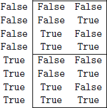

This observation leads to a recursive definition for bools. In the base case, bools 0, we return all lists of zero logical values, of which the empty list is the only one. In the recursive case, bools n, we take two copies of the lists produced by bools (n-1), place False in front of each list in the first copy, True in front of each list in the second, and append the results:

bools :: Int -\> \[\[Bool\]\]

bools 0 = \[\[\]\]

bools n = map (False:) bss ++ map (True:) bss

where bss = bools (n-1)

Using bools, it is now straightforward to define a function that generates all possible substitutions for a proposition by extracting its variables, removing duplicates from this list (using the function rmdups from chapter 7), generating all possible lists of logical values for this many variables, and then zipping the list of variables with each of the resulting lists:

substs :: Prop -\> \[Subst\]

substs p = map (zip vs) (bools (length vs))

where vs = rmdups (vars p)

For example:

\> substs p2

\[\[(’A’,False),(’B’,False)\],

\[(’A’,False),(’B’,True)\],

\[(’A’,True),(’B’,False)\],

\[(’A’,True),(’B’,True)\]\]

Finally, we define a function that decides if a proposition is a tautology, by simply checking if it evaluates to True for all possible substitutions:

isTaut :: Prop -\> Bool

isTaut p = and \[eval s p \| s \<- substs p\]

For example:

\> isTaut p1

False  
  

\> isTaut p2

True  
  

\> isTaut p3

False  
  

\> isTaut p4

True

### **8.7Abstract machine**

For our second extended example, consider a type of simple arithmetic expressions built up from integers using an addition operator, together with a function that evaluates such an expression to an integer value:

data Expr = Val Int \| Add Expr Expr  
  

value :: Expr -\> Int

value (Val n)= n

value (Add x y) = value x + value y

For example, the expression (2 + 3) + 4 is evaluated as follows:

value (Add (Add (Val 2) (Val 3)) (Val 4))

={ applying value }

value (Add (Val 2) (Val 3)) + value (Val 4)

={ applying the first value }

(value (Val 2) + value (Val 3)) + value (Val 4)

={ applying the first value }

(2 + value (Val 3)) + value (Val 4)

={ applying the first value }

(2 + 3) + value (Val 4)

={ applying the first + }

5 + value (Val 4)

={ applying value }

5 + 4

={ applying + }

9

Note that the definition of the value function does not specify that the left argument of an addition should be evaluated before the right, or, more generally, what the next step of evaluation should be at each point. Rather, the order of evaluation is determined by Haskell. If desired, however, such control information can be made explicit by defining an *abstract machine* for expressions, which specifies the step-by-step process of their evaluation.

To this end, we first declare a type of *control stacks* for the abstract machine, which comprise a list of operations to be performed by the machine after the current evaluation has been completed:

type Cont = \[Op\]  
  

data Op = EVAL Expr \| ADD Int

The meaning of the two operations will be explained shortly. We now define a function that evaluates an expression in the context of a control stack:

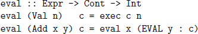

That is, if the expression is an integer, it is already fully evaluated, and we begin executing the control stack. If the expression is an addition, we evaluate the first argument, x, placing the operation EVAL y on top of the control stack to indicate that the second argument, y, should be evaluated once evaluation of the first argument is completed. In turn, we define the function that executes a control stack in the context of an integer argument:

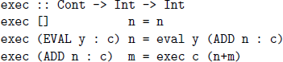

That is, if the control stack is empty, we return the integer argument as the result of the execution. If the top of the stack is an operation EVAL y, we evaluate the expression y, placing the operation ADD n on top of the remaining stack to indicate that the current integer argument, n, should be added together with the result of evaluating y once this is completed. And, finally, if the top of the stack is an operation ADD n, evaluation of the two arguments of an addition expression is now complete, and we execute the remaining control stack in the context of the sum of the two resulting integer values.

Finally, we define a function that evaluates an expression to an integer, by invoking eval with the given expression and the empty control stack:

value :: Expr -\> Int

value e = eval e \[\]

The fact that our abstract machine uses two mutually recursive functions, eval and exec, reflects the fact that it has two modes of operation, depending upon whether it is being driven by the structure of the expression or the control stack. To illustrate the machine, here is how it evaluates (2 + 3) +4:

value (Add (Add (Val 2) (Val 3)) (Val 4))

={ applying value }

eval (Add (Add (Val 2) (Val 3)) (Val 4)) \[\]

={ applying eval }

eval (Add (Val 2) (Val 3)) \[EVAL (Val 4)\]

={ applying eval }

eval (Val 2) \[EVAL (Val 3), EVAL (Val 4)\]

={ applying eval }

exec \[EVAL (Val 3), EVAL (Val 4)\] 2

={ applying exec }

eval (Val 3) \[ADD 2, EVAL (Val 4)\]

={ applying eval }

exec \[ADD 2, EVAL (Val 4)\] 3

={ applying exec }

exec \[EVAL (Val 4)\] 5

={ applying exec }

eval (Val 4) \[ADD 5\]

={ applying eval }

exec \[ADD 5\] 4

={ applying exec }

exec \[\] 9

={ applying exec }

9

Note how eval proceeds downwards to the leftmost integer in the expression, maintaining a trail of the pending right-hand expressions on the control stack. In turn, exec then proceeds upwards through the trail, transferring control back to eval and performing additions as appropriate.

### **8.8Chapter remarks**

The abstract machine example is derived from \[11\], and the type of control stacks used in this example is a special case of the zipper data structure for traversing values of recursive types \[12\]. As well as the basic mechanisms for declaring new types and classes introduced in this chapter, the GHC system also supports a number of more advanced and experimental typing features; see <http://www.haskell.org/ghc> for further details.

### **8.9Exercises**

1.In a similar manner to the function add, define a recursive multiplication function mult :: Nat -\> Nat -\> Nat for the recursive type of natural numbers:

Hint: make use of add in your definition.

2.Although not included in appendix B, the standard prelude defines

data Ordering = LT \| EQ \| GT

together with a function

compare :: Ord a =\> a -\> a -\> Ordering

that decides if one value in an ordered type is less than (LT), equal to (EQ), or greater than (GT) another value. Using this function, redefine the function occurs :: Ord a =\> a -\> Tree a -\> Bool for search trees. Why is this new definition more efficient than the original version?

3.Consider the following type of binary trees:

data Tree a = Leaf a \| Node (Tree a) (Tree a)

Let us say that such a tree is *balanced* if the number of leaves in the left and right subtree of every node differs by at most one, with leaves themselves being trivially balanced. Define a function balanced :: Tree a -\> Bool that decides if a binary tree is balanced or not.

Hint: first define a function that returns the number of leaves in a tree.

4.Define a function balance :: \[a\] -\> Tree a that converts a non-empty list into a balanced tree. Hint: first define a function that splits a list into two halves whose length differs by at most one.

5.Given the type declaration

data Expr = Val Int \| Add Expr Expr

define a higher-order function

folde :: (Int -\> a) -\> (a -\> a -\> a) -\> Expr -\> a

such that folde f g replaces each Val constructor in an expression by the function f, and each Add constructor by the function g.

6.Using folde, define a function eval :: Expr -\> Int that evaluates an expression to an integer value, and a function size :: Expr -\> Int that calculates the number of values in an expression.

7.Complete the following instance declarations:

instance Eq a =\> Eq (Maybe a) where

...  
  

instance Eq a =\> Eq \[a\] where

...

8.Extend the tautology checker to support the use of logical disjunction 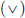 and equivalence (⇔) in propositions.

9.Extend the abstract machine to support the use of multiplication.

Solutions to exercises 1–4 are given in appendix A.