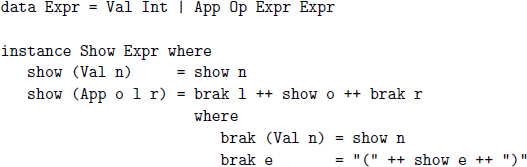
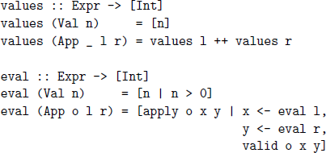
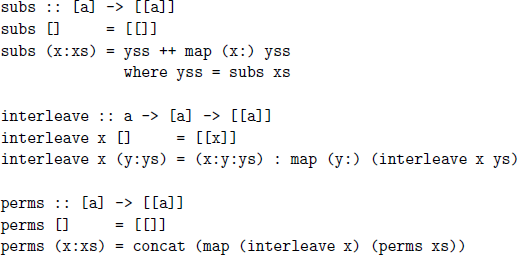
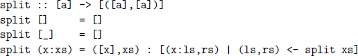
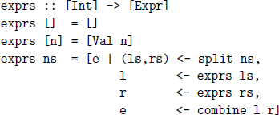
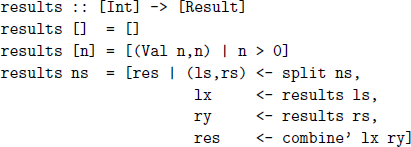
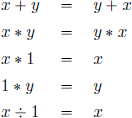
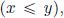

## **9**

## The countdown problem

In this chapter we conclude part I of the book, by showing how the concepts introduced so far can be used to develop an efficient program to solve a simple numbers game. We start by defining some types and utility functions, then formalise the rules of the game in Haskell, and finally present a simple brute force solution, whose performance is then improved in two steps.

### **9.1Introduction**

Countdown is a popular quiz programme that has been running on British television since 1982, and includes a numbers game that we shall refer to as the *countdown problem*. The essence of the problem is as follows:

Given a sequence of numbers and a target number, attempt to construct an expression whose value is the target, by combining one or more numbers from the sequence using addition, subtraction, multiplication, division and parentheses.

Each number in the sequence can only be used at most once in the expression, and all of the numbers involved, including intermediate values, must be positive natural numbers (1, 2, 3, . . .). In particular, the use of negative numbers, zero, and proper fractions such as 2 ÷ 3, is not permitted.

For example, suppose that we are given the sequence 1, 3, 7, 10, 25, 50, and the target 765. Then one possible solution is given by the expression (1+50)∗(25–10), as verified by the following simple calculation:

(1 + 50) ∗ (25 – 10)

={ applying + }

51 ∗ (25 – 10)

={ applying – }

51 ∗ 15

={ applying ∗ }

765

In fact, for this example it can be shown that there are 780 different solutions. On the other hand, keeping the same sequence but changing the target to 831 gives an example that can be shown to have no solutions.

In the television version of the problem, a number of additional rules are adopted to make it suitable for human players on a quiz programme. In particular, there are always six numbers selected from the sequence 1–10, 1–10, 25, 50, 75, 100, the target is always in the range 100–999, and there is a time limit of 30 seconds. It is natural to abstract from such constraints when developing a computer player, so none of the programs that we develop enforces or depends upon these extra rules. Note, however, that we do not abstract from the positive naturals to a richer numeric domain, such as the integers or the rationals, as this would change the computational complexity of the problem.

### **9.2Arithmetic operators**

We start by declaring a type for the four arithmetic operators, and making values of this type showable using a simple instance declaration:

data Op = Add \| Sub \| Mul \| Div  
  

instance Show Op where

show Add = "+"

show Sub = "-"

show Mul = "\*"

show Div = "/"

In turn, we define a function valid that decides if the application of an operator to two positive naturals gives another positive natural, and a function apply that actually performs such a valid application:

valid :: Op -\> Int -\> Int -\> Bool

valid Add \_ \_ = True

valid Sub x y = x \> y

valid Mul \_ \_ = True

valid Div x y = x ‘mod‘ y == 0  
  

apply :: Op -\> Int -\> Int -\> Int

apply Add x y = x + y

apply Sub x y = x - y

apply Mul x y = x \* y

apply Div x y = x ‘div‘ y

For example, the application Sub 2 3 is invalid because 2 – 3 is negative, while Div 2 3 is invalid because 2 ÷ 3 is a rational number.

### **9.3Numeric expressions**

We now declare a type for numeric expressions, which can either be an integer value or the application of an operator to two argument expressions, together with a simple pretty-printer for expressions:

For example, 1 + (2 ∗ 3) can be represented as a value of type Expr and then shown in more readable form as a string as follows:

\> show (App Add (Val 1) (App Mul (Val 2) (Val 3)))

"1+(2\*3)”

Using this type, we define a function that returns the list of values in an expression, and a function eval that returns the overall value of an expression, provided that this value is a positive natural number:

Note that the possibility of failure within eval is handled by returning a list of results, with the convention that a singleton list denotes success, and the empty list denotes failure. For example, for 2 + 3 and 2 – 3, we have:

\> eval (App Add (Val 2) (Val 3))

\[5\]  
  

\> eval (App Sub (Val 2) (Val 3))

\[\]

Failure within eval could also be handled by using the Maybe type, but we prefer to use the list type because the comprehension notation then provides a convenient way to define the eval function.

### **9.4Combinatorial functions**

We now define a number of useful combinatorial functions that return all possible lists that satisfy certain properties. The function subs returns all subsequences of a list, which are given by all possible combinations of excluding or including each element of the list, interleave returns all possible ways of inserting a new element into a list, and finally, perms returns all permutations of a list, which are given by all possible reorderings of the elements:

For example:

\> subs \[1,2,3\]

\[\[\],\[3\],\[2\],\[2,3\],\[1\],\[1,3\],\[1,2\],\[1,2,3\]\]  
  

\> interleave 1 \[2,3,4\]

\[\[1,2,3,4\],\[2,1,3,4\],\[2,3,1,4\],\[2,3,4,1\]\]  
  

\> perms \[1,2,3\]

\[\[1,2,3\],\[2,1,3\],\[2,3,1\],\[1,3,2\],\[3,1,2\],\[3,2,1\]\]

In turn, a function that returns all choices from a list, which are given by all possible ways of selecting zero or more elements in any order, can then be defined simply by considering all permutations of all subsequences:

choices :: \[a\] -\> \[\[a\]\]

choices = concat . map perms . subs

For example:

\> choices \[1,2,3\]

\[\[\],\[3\],\[2\],\[2,3\],\[3,2\],\[1\],\[1,3\],\[3,1\],\[1,2\],\[2,1\],

\[1,2,3\],\[2,1,3\],\[2,3,1\],\[1,3,2\],\[3,1,2\],\[3,2,1\]\]

### **9.5Formalising the problem**

Finally, we can now define a function solution that formalises what it means to solve an instance of the countdown problem:

solution :: Expr -\> \[Int\] -\> Int -\> Bool

solution e ns n =

elem (values e) (choices ns) && eval e == \[n\]

That is, an expression is a solution for a given list of numbers and a target if the list of values in the expression is chosen from the list of numbers, and the expression successfully evaluates to give the target. For example, if e :: Expr represents the expression (1 + 50) ∗ (25 – 10), then we have:

\> solution e \[1,3,7,10,25,50\] 765

True

The efficiency of solution could be improved by using a function isChoice that decides directly if one list is chosen from another, rather than doing so indirectly using the function choices that returns all possible choices from a list. However, efficiency is not important at this stage, and choices itself is used to define a number of other functions in this chapter.

### **9.6Brute force solution**

Our first approach to solving the countdown problem is by brute force, using the idea of generating all possible expressions over the given list of numbers. We start by defining a function split that returns all possible ways of splitting a list into two non-empty lists that append to give the original list:

For example:

\> split \[1,2,3,4\]

\[(\[1\],\[2,3,4\]),(\[1,2\],\[3,4\]),(\[1,2,3\],\[4\])\]

Using split we can then define the key function, exprs, which returns all possible expressions whose list of values is precisely a given list:

That is, for the empty list of numbers there are no possible expressions, while for a single number there is a single expression comprising that number. Otherwise, for a list of two or more numbers we first produce all splittings of the list, then recursively calculate all possible expressions for each of these lists, and, finally, combine each pair of expressions using each of the four numeric operators, using an auxiliary function that is defined as follows:

combine :: Expr -\> Expr -\> \[Expr\]

combine l r = \[App o l r \| o \<- ops\]  
  

ops :: \[Op\]

ops = \[Add,Sub,Mul,Div\]

In conclusion, we can now define a function solutions that returns all possible expressions that solve an instance of the countdown problem, by first generating all expressions over each choice from the given list of numbers, and then selecting those expressions that successfully evaluate to give the target:

solutions :: \[Int\] -\> Int -\> \[Expr\]

solutions ns n =

\[e \| ns’ \<- choices ns, e \<- exprs ns’, eval e == \[n\]\]

### **9.7Performance testing**

For the purposes of testing our countdown programs in this chapter, the performance of the GHCi interpreter is somewhat limited, so instead we use the GHC compiler. The first step is to put all the necessary definitions into a script called countdown.hs, together with a top-level definition main that applies the function solutions to an example and displays the result:

main :: IO ()

main = print (solutions \[1,3,7,10,25,50\] 765)

(The library function print writes a value of a showable type to the screen, and the type for main will be explained in further detail in chapter 10.) The compiler itself can then be executed from the command prompt simply by typing ghc, and using the -O2 flag to turn on compiler optimisations:

\$ ghc -O2 countdown.hs

\[1 of 1\] Compiling Main

Linking countdown ...

Finally, the resulting executable file can then be run:

\$ ./countdown

\[3\*((7\*(50-10))-25), ((7\*(50-10))-25)\*3, ...\]

For example, running some simple performance tests using GHC version 7.10.2 on a 2.8GHz Intel Core 2 Duo with 4GB of RAM, this example returns the first solution to the problem in 0.108 seconds, and all 780 solutions in 12.224 seconds, while if the target is changed to 831, the empty list of solutions is returned in 12.802 seconds. More generally, our brute force program already performs well enough to solve countdown problems from the television show within the 30 second time limit. But surely we can do better than this?

### **9.8Combining generation and evaluation**

The function solutions generates all possible expressions over the given numbers, but in practice many of these expressions will fail to evaluate, due to the fact that subtraction and division are not always valid operations for positive naturals. For example, it can be shown that there are 33,665,406 possible expressions over the numbers 1, 3, 7, 10, 25, 50, but only 4,672,540 of these expressions evaluate successfully, which is just under 14%.

Based upon this observation, our second approach to solving the countdown problem is to improve our brute force program by combining the generation of expressions with their evaluation, such that both tasks are performed simultaneously. In this way, expressions that fail to evaluate are rejected at an earlier stage, and, more importantly, are not used to generate further expressions that will fail to evaluate. We start by declaring a type Result of expressions that evaluate successfully paired with their overall values:

type Result = (Expr,Int)

Using this type, we then define a function results that returns all possible results comprising expressions whose list of values is precisely a given list:

That is, for the empty list there are no possible results, while for a single number there is a single result formed from that number, provided that the number itself is a positive natural number. Otherwise, for two or more numbers we first produce all splittings of the list, then recursively calculate all possible results for each of these lists, and, finally, combine each pair of results using each of the four numeric operators that are valid, by means of the following auxiliary function:

combine’ :: Result -\> Result -\> \[Result\]

combine’ (l,x) (r,y) =

\[(App o l r, apply o x y) \| o \<- ops, valid o x y\]

Using results we can now define a new function solutions’ that returns all possible expressions that solve an instance of the countdown problem, by first generating all results over each choice from the given numbers, and then selecting those expressions whose value is the target:

solutions’ :: \[Int\] -\> Int -\> \[Expr\]

solutions’ ns n =

\[e \| ns’ \<- choices ns, (e,m) \<- results ns’, m == n\]

In terms of performance, solutions’ \[1,3,7,10,25,50\] 765 returns the first solution in 0.014 seconds (7 times faster than solutions) and all solutions in 1.312 seconds (9 times faster), while if the target is changed to 831, the empty list is returned in 1.134 seconds (11 times faster). That is, our new program is approximately 10 times faster than the original version. But we can still do better, by using some simple high-school algebra.

### **9.9Exploiting algebraic properties**

The function solutions’ generates all possible expressions over the given numbers whose evaluation is successful, but in practice many of these expressions will be essentially the same, due to the fact that the numeric operators have algebraic properties. For example, the expressions 2 + 3 and 3 + 2 are essentially the same because the result of an addition does not depend upon the order of the two arguments, while 2 ÷ 1 and 2 are essentially the same because dividing any number by one has no effect on that number.

Based upon this observation, our final approach to solving the countdown problem is to improve our second program by exploiting such algebraic properties to reduce the number of generated expressions. In particular, we exploit the following five commutativity and identity properties:

We start by recalling the function valid that decides if the application of an operator to two positive naturals gives another such:

valid :: Op -\> Int -\> Int -\> Bool

valid Add \_ \_ = True

valid Sub x y = x \> y

valid Mul \_ \_ = True

valid Div x y = x ‘mod‘ y == 0

This definition can be modified to exploit the commutativity of addition and multiplication simply by requiring that their arguments are in numeric order  and the identity properties of multiplication and division simply by requiring that the appropriate arguments are non-unitary (≠ 1):

valid Add x y = x \<= y

valid Sub x y = x \> y

valid Mul x y = x /= 1 && y /= 1 && x \<= y

valid Div x y = y /= 1 && x ‘mod‘ y == 0

For example, using this new definition, Add 3 2 is now invalid because it is essentially the same as Add 2 3 using the commutativity property for addition, while Div 2 1 is now invalid because it is essentially the same as the number 2 on its own using the identity property for division.

Using the new version of valid gives a new version of solutions’ that solves the countdown problem, which we write as solutions’’. Using this new function can considerably reduce the number of generated expressions and the number of solutions. For example, solutions’’ \[1,3,7,10,25,50\] 765 only generates 245,644 expressions, of which just 49 are solutions, which is just over 5% and 6% respectively of the numbers using solutions’.

As regards performance, solutions’’ \[1,3,7,10,25,50\] 765 now returns the first solution in 0.007 seconds (twice as fast as solutions’) and all solutions in 0.119 seconds (11 times faster), while for the target number 831 the empty list is returned in 0.115 seconds (9 times faster). More generally, given any numbers from the television version of the countdown problem, our final program usually returns all solutions in a fraction of a second, and is around 100 times faster than the original brute force version — quite an improvement!

### **9.10Chapter remarks**

Countdown is based upon an original version on French television called *Des Chiffres et des Lettres*, while the countdown problem itself is related to the children’s arithmetic games called *krypto* and *four fours*. This chapter is based upon \[13\], which also includes proofs of correctness of the three programs that were produced. A number of more advanced approaches to solving the countdown problem are explored by Bird and Mu \[14\].

### **9.11Exercises**

1.Redefine the combinatorial function choices using a list comprehension rather than using composition, concat and map.

2.Define a recursive function isChoice :: Eq a =\> \[a\] -\> \[a\] -\> Bool that decides if one list is chosen from another, without using the combinatorial functions perms and subs. Hint: start by defining a function that removes the first occurrence of a value from a list.

3.What effect would generalising the function split to also return pairs containing the empty list have on the behaviour of solutions?

4.Using the functions choices, exprs, and eval, verify that there are 33,665,406 possible expressions over the numbers 1, 3, 7, 10, 25, 50, and that only 4,672,540 of these expressions evaluate successfully.

5.Similarly, verify that the number of expressions that evaluate successfully increases to 10,839,369 if the numeric domain is generalised to arbitrary integers. Hint: modify the definition of valid.

6.Modify the final program to:

a.allow the use of exponentiation in expressions;

b.produce the nearest solutions if no exact solution is possible;

c.order the solutions using a suitable measure of simplicity.

Solutions to exercises 1–3 are given in appendix A.