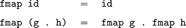
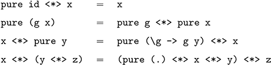
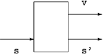
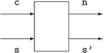
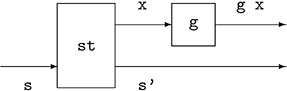
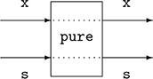
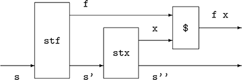
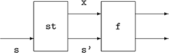
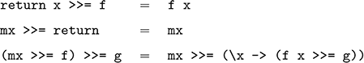

## **12**

## Monads and more

In this chapter we increase the level of generality that can be achieved in Haskell, by considering functions that are generic over a range of parameterised types such as lists, trees and input/output actions. In particular, we introduce functors, applicatives and monads, which variously capture generic notions of mapping, function application and effectful programming.

### **12.1 Functors**

All three new concepts introduced in this chapter are examples of the idea of abstracting out a common programming pattern as a definition. We begin by reviewing this idea using the following two simple functions:

``` haskell
inc :: [Int] -> [Int]
inc []     = []
inc (n:ns) = n+1 : inc ns
sqr :: [Int] -> [Int]
sqr []     = []
sqr (n:ns) = n^2 : sqr ns
```

Both functions are defined in the same manner, with the empty list being mapped to itself, and a non-empty list to some function applied to the head of the list and the result of recursively processing the tail. The only important difference is the function that is applied to each integer in the list: in the first case it is the increment function (+1), and in the second the squaring function (^2). Abstracting out this pattern gives the familiar library function map,

``` haskell
map :: (a -> b) -> [a] -> [b]
map f [] = []
map f (x:xs) = f x : map f xs
```

using which our two examples can then be defined more compactly by simply providing the function to be applied to each integer:

``` haskell
inc = map (+1)
sqr = map (^2)
```

More generally, the idea of mapping a function over each element of a data structure isn’t specific to the type of lists, but can be abstracted further to a wide range of parameterised types. The class of types that support such a mapping function are called *functors*. In Haskell, this concept is captured by the following class declaration in the standard prelude:

``` haskell
class Functor f where
  fmap :: (a -> b) -> f a -> f b
```

That is, for a parameterised type f to be an instance of the class Functor, it must support a function fmap of the specified type. The intuition is that fmap takes a function of type a -\> b and a structure of type f a whose elements have type a, and applies the function to each such element to give a structure of type f b whose elements now have type b. The fact that f must be a parameterised type, that is, a type that takes another type as a parameter, is determined automatically during type inference by virtue of the application of f to the types a and b in the specified type for fmap in the class declaration.

##### Examples

As we would expect, the type of lists can be made into a functor by simply defining fmap to be the function map:

``` haskell
instance Functor [] where
  -- fmap :: (a -> b) -> [a] -> [b]
  fmap = map
```

The symbol \[\] in this declaration denotes the list type without a type parameter, and is based upon the fact that the type \[a\] can also be written in more primitive form as the application \[\] a of the list type \[\] to the parameter type a. Note also that the type of fmap above is stated in a comment rather than explicitly, because Haskell does not permit such type information in instance declarations. However, it is useful for guiding the definition of fmap and for documentation purposes, so we include such types in comments.

For our second example, recall the built-in type Maybe a that represents values of type a that may either fail or succeed:

``` haskell
data Maybe a = Nothing | Just a
```

It is straightforward to make the Maybe type into a functor by defining a function fmap of the appropriate type, as follows:

``` haskell
instance Functor Maybe where
  -- fmap :: (a -> b) -> Maybe a -> Maybe b
  fmap _ Nothing = Nothing
  fmap g (Just x) = Just (g x)
```

(We call the argument function g to avoid confusion with the use of f for a functor in this section.) That is, mapping a function over a failed value results in the failure being propagated, while for success we apply the function to the underlying value and retag the result. For example:

``` haskell
> fmap (+1) Nothing
Nothing
> fmap (*2) (Just 3)
Just 6
> fmap not (Just False)
Just True
```

User-defined types can also be made into functors. For example, suppose that we declare a type of binary trees that have data in their leaves:

``` haskell
data Tree a = Leaf a | Node (Tree a) (Tree a)
         deriving Show
```

The deriving clause ensures that trees can be displayed on the screen. The parameterised type Tree can then be made into a functor by defining a function fmap that applies a given function to each leaf value in a tree:

``` haskell
instance Functor Tree where
  -- fmap :: (a -> b) -> Tree a -> Tree b
  fmap g (Leaf x) = Leaf (g x)
  fmap g (Node l r) = Node (fmap g l) (fmap g r)
```

For example:

``` haskell
> fmap length (Leaf "abc")
Leaf 3
> fmap even (Node (Leaf 1) (Leaf 2))
Node (Leaf False) (Leaf True)
```

Many functors f that are used in Haskell are similar to the three examples above, in the sense that f a is a data structure that contains elements of type a, which is sometimes called a *container type*, and fmap applies a given function to each such element. However, not all instances fit this pattern. For example, the IO type is not a container type in the normal sense of the term because its values represent input/output actions whose internal structure we do not have access to, but it can readily be made into a functor:

``` haskell
instance Functor IO where
  -- fmap :: (a -> b) -> IO a -> IO b
  fmap g mx = do {x <- mx; return (g x)}
```

In this case, fmap applies a function to the result value of the argument action, and hence provides a means of processing such values. For example:

``` haskell
> fmap show (return True)
"True"
```

We conclude by noting two key benefits of using functors. First of all, the function fmap can be used to process the elements of any structure that is functorial. That is, we can use the same name for functions that are essentially the same, rather than having to invent a separate name for each instance. And secondly, we can define generic functions that can be used with any functor. For example, our earlier function that increments each integer in a list can be generalised to any functorial type by simply using fmap rather than map:

``` haskell
inc :: Functor f => f Int -> f Int
inc = fmap (+1)
```

For example:

``` haskell
> inc (Just 1)
Just 2
> inc [1,2,3,4,5]
[2,3,4,5,6]
> inc (Node (Leaf 1) (Leaf 2))
Node (Leaf 2) (Leaf 3)
```

##### Functor laws

In addition to providing a function fmap of the specified type, functors are also required to satisfy two equational laws:



The first equation states that fmap preserves the identity function, in the sense that applying fmap to this function returns the same function as the result. Note, however, that the two occurrences of id in this equation have different types: on the left-hand side id has type a -\> a and hence fmap id has type f a -\> f a, which means that the id on the right-hand side must also have type f a -\> f a in order for the equation to be well-typed.

In turn, the second equation above states that fmap also preserves function composition, in the sense that applying fmap to the composition of two functions gives the same result as applying fmap to the two functions separately and then composing. In order for the compositions to be well-typed, the component functions g and h must have types b -\> c and a -\> b.

In combination with the polymorphic type for fmap, the functor laws ensure that fmap does indeed perform a mapping operation. In the case of lists, for instance, they ensure that the structure of the argument list is preserved by fmap, in the sense that elements are not added, removed or rearranged. For example, suppose that we replaced the built-in list functor by an alternative version in which fmap reverses the order of the list elements:

``` haskell
instance Functor [] where
  -- fmap :: (a -> b) -> f a -> f b
  fmap g []     = []
  fmap g (x:xs) = fmap g xs ++ [g x]
```

(If you wish to try out this example in GHCi, you must first declare your own list type and modify the above declaration accordingly, to avoiding clashing with the built-in list functor.) This declaration is type correct, but fails to satisfy the functor laws, as shown by the following examples:

``` haskell
> fmap id [1,2]
[2,1]
> id [1,2]
[1,2]
> fmap (not . even) [1,2]
[False,True]
> (fmap not . fmap even) [1,2]
[True,False]
```

All the functors that we defined in the examples section satisfy the functor laws. We will see how to formally prove such properties when we consider techniques for reasoning about programs in chapter 16. In fact, for any parameterised type in Haskell, there is at most one function fmap that satisfies the required laws. That is, if it is possible to make a given parameterised type into a functor, there is only one way to achieve this. Hence, the instances that we defined for lists, Maybe, Tree and IO were all uniquely determined.

### **12.2 Applicatives**

Functors abstract the idea of mapping a function over each element of a structure. Suppose now that we wish to generalise this idea to allow functions with any number of arguments to be mapped, rather than being restricted to functions with a single argument. More precisely, suppose that we wish to define a hierarchy of fmap functions with the following types:

``` haskell
fmap0 :: a -> f a
fmap1 :: (a -> b) -> f a -> f b
fmap2 :: (a -> b -> c) -> f a -> f b -> f c
fmap3 :: (a -> b -> c -> d) -> f a -> f b -> f c -> f d
.
.
.
```

Note that fmap1 is just another name for fmap, and fmap0 is the degenerate case when the function being mapped has no arguments. One approach would be to declare a special version of the functor class for each case: Functor0, Functor1, Functor2, and so on. Then, for example, we could write:

``` haskell
> fmap2 (+) (Just 1) (Just 2)
Just 3
```

However, this would be unsatisfactory in a number of different ways. First of all, we would have to manually declare each version of the Functor class even they all follow a similar pattern. Secondly, it is not clear how many such classes we should declare, as there are infinitely many but we can only declare a finite number. And finally, if we view fmap of type (a -\> b) -\> f a -\> f b as being a generalisation of the built-in function application operator of type (a -\> b) -\> a -\> b, we might expect that some form of currying can be used to achieve the desired behaviour. In particular, we don’t require special versions of application for functions with different numbers of arguments, instead relying on currying in definitions such as add x y = x + y.

In fact, using the idea of currying, it turns out that a version of fmap for functions with any desired number of arguments can be constructed in terms of two basic functions with the following types:

``` haskell
pure :: a -> f a
(<*>) :: f (a -> b) -> f a -> f b
```

That is, pure converts a value of type a into a structure of type f a, while \<\*\> is a generalised form of function application for which the argument function, the argument value, and the result value are all contained in f structures. As with normal function application, the \<\*\> operator is written between its two arguments and is assumed to associate to the left. For example,

``` haskell
g <*> x <*> y <*> z
```

means

``` haskell
((g <*> x) <*> y) <*> z
```

A typical use of pure and \<\*\> has the following form:

``` haskell
pure g <*> x1 <*> x2 <*> ... <*> xn
```

Such expressions are said to be in *applicative style*, because of the similarity to normal function application notation g x1 x2 ... xn. In both cases, g is a curried function that takes n arguments of type a1 ... an and produces a result of type b. However, in applicative style, each argument xi has type f ai rather than just ai, and the overall result has type f b rather than b. Using this idea, we can now define the hierarchy of mapping functions:

``` haskell
fmap0 :: a -> f a
fmap0 = pure
fmap1 :: (a -> b) -> f a -> f b
fmap1 g x = pure g <*> x
fmap2 :: (a -> b -> c) -> f a -> f b -> f c
fmap2 g x y = pure g <*> x <*> y
fmap3 :: (a -> b -> c -> d) -> f a -> f b -> f c -> f d
fmap3 g x y z = pure g <*> x <*> y <*> z
.
.
.
```

It is a useful exercise to check the types of these definitions for yourself. In practice, however, there is usually no need to define such mapping functions explicitly as they can be constructed as required, as we shall see in the next section. The class of functors that support pure and \<\*\> functions are called *applicative functors*, or *applicatives* for short. In Haskell, this concept is captured by the following built-in class declaration:

``` haskell
class Functor f => Applicative f where
  pure :: a -> f a
  (<*>) :: f (a -> b) -> f a -> f b
```

##### Examples

Using the fact that Maybe is a functor and hence supports fmap, it is straightforward to make this type into an applicative functor:

``` haskell
instance Applicative Maybe where
  -- pure :: a -> Maybe a
  pure = Just
  -- (<*>) :: Maybe (a -> b) -> Maybe a -> Maybe b
  Nothing <*> _   = Nothing
  (Just g) <*> mx = fmap g mx
```

That is, the function pure transforms a value into a successful result, while the operator \<\*\> applies a function that may fail to an argument that may fail to produce a result that may fail. For example:

``` haskell
> pure (+1) <*> Just 1
Just 2
> pure (+) <*> Just 1 <*> Just 2
Just 3
> pure (+) <*> Nothing <*> Just 2
Nothing
```

In this manner, the applicative style for Maybe supports a form of *exceptional* programming in which we can apply pure functions to arguments that may fail without the need to manage the propagation of failure ourselves, as this is taken care of automatically by the applicative machinery.

We now turn our attention to the list type, for which the standard prelude contains the following instance declaration:

``` haskell
instance Applicative [] where
  -- pure :: a -> [a]
  pure x = [x]
  -- (<*>) :: [a -> b] -> [a] -> [b]
  gs <*> xs = [g x | g <- gs, x <- xs]
```

That is, pure transforms a value into a singleton list, while \<\*\> takes a list of functions and a list of arguments, and applies each function to each argument in turn, returning all the results in a list. For example:

``` haskell
> pure (+1) <*> [1,2,3]
[2,3,4]
> pure (+) <*> [1] <*> [2]
[3]
> pure (*) <*> [1,2] <*> [3,4]
[3,4,6,8]
```

How should we understand these examples? The key is to view the type \[a\] as a generalisation of Maybe a that permits multiple results in the case of success. More precisely, we can think of the empty list as representing failure, and a nonempty list as representing all the possible ways in which a result may succeed. Hence, in the last example above there are two possible values for the first argument (1 or 2), two possible values for the second (3 or 4), which gives four possible results for the multiplication (3, 4, 6 or 8).

More generally, consider a function that returns all possible ways of multiplying two lists of integers, defined using a list comprehension:

``` haskell
prods :: [Int] -> [Int] -> [Int]
prods xs ys = [x*y | x <- xs, y <- ys]
```

Using the fact that lists are applicative, we can now also give an applicative definition, which avoids having to name the intermediate results:

``` haskell
prods :: [Int] -> [Int] -> [Int]
prods xs ys = pure (*) <*> xs <*> ys
```

In summary, the applicative style for lists supports a form of *non-deterministic* programming in which we can apply pure functions to multi-valued arguments without the need to manage the selection of values or the propagation of failure, as this is taken care of by the applicative machinery.

The final type that we consider in this section is the IO type, which can be made into an applicative functor using the following declaration:

``` haskell
instance Applicative IO where
  -- pure :: a -> IO a
  pure = return
  -- (<*>) :: IO (a -> b) -> IO a -> IO b
  mg <*> mx = do {g <- mg; x <- mx; return (g x)}
```

In this case, pure is given by the return function for the IO type, and \<\*\> applies an impure function to an impure argument to give an impure result. For example, a function that reads a given number of characters from the keyboard can be defined in applicative style as follows:

``` haskell
getChars :: Int -> IO String
getChars 0 = return []
getChars n = pure (:) <*> getChar <*> getChars (n-1)
```

That is, in the base case we simply return the empty list, and in the recursive case we apply the cons operator to the result of reading the first character and the remaining list of characters. Note that in the latter case there is no need to name the arguments that are supplied to the cons function, which there would be if the function was defined using the do notation.

More generally, the applicative style for IO supports a form of *interactive* programming in which we can apply pure functions to impure arguments without the need to manage the sequencing of actions or the extraction of result values, as this is taken care of automatically by the applicative machinery.

##### Effectful programming

Our original motivation for applicatives was the desire the generalise the idea of mapping to functions with multiple arguments. This is a valid interpretation of the concept of applicatives, but from the three instances we have seen it becomes clear that there is also another, more abstract view.

The common theme between the instances is that they all concern programming with *effects*. In each case, the applicative machinery provides an operator \<\*\> that allows us to write programs in a familiar applicative style in which functions are applied to arguments, with one key difference: the arguments are no longer just plain values but may also have effects, such as the possibility of failure, having many ways to succeed, or performing input/output actions. In this manner, applicative functors can also be viewed as abstracting the idea of applying pure functions to effectful arguments, with the precise form of effects that are permitted depending on the nature of the underlying functor.

In addition to providing a uniform approach to a form of effectful programming, using applicatives also has the important benefit that we can define generic functions that can be used with any applicative functor. By way of example, the standard library provides the following function:

``` haskell
sequenceA :: Applicative f => [f a] -> f [a]
sequenceA []   = pure []
sequenceA (x:xs) = pure (:) <*> x <*> sequenceA xs
```

This function transforms a list of applicative actions into a single such action that returns a list of result values, and captures a common pattern of applicative programming. For example, the function getChars can now be defined in a simpler manner by replicating the basic action getChar the required number of times, and executing the resulting sequence:

``` haskell
getChars :: Int -> IO String
getChars n = sequenceA (replicate n getChar)
```

##### Applicative laws

In addition to providing the functions pure and \<\*\>, applicative functors are also required to satisfy four equational laws:



The first equation states that pure preserves the identity function, in the sense that applying pure to this function gives an applicative version of the identity function. The second equation states that pure also preserves function application, in the sense that it distributes over normal function application to give applicative application. The third equation states that when an effectful function is applied to a pure argument, the order in which we evaluate the two components doesn’t matter. And finally, the fourth equation states that, modulo the types that are involved, the operator \<\*\> is associative. It is a useful exercise to work out the types for the variables in each of these laws.

The applicative laws together formalise our intuition regarding the function pure :: a -\> f a, namely that it embeds values of type a into the pure fragment of an effectful world of type f a. The laws also ensure that every well-typed expression that is built using the function pure and the operator \<\*\> can be rewritten in applicative style, that is in the form:

``` haskell
pure g <*> x1 <*> x2 <*> ... <*> xn
```

In particular, the fourth law reassociates applications to the left, the third law moves occurrences of pure to the left, and the remaining two laws allow zero or more consecutive occurrences of pure to be combined into one.

All the applicative functors that we defined in the examples section satisfy the above laws. Moreover, each of these instances also satisfies the equation fmap g x = pure g \<\*\> x, which shows how fmap can be defined in terms of the two applicative primitives. In fact, this latter law comes for free, by virtue of the fact that (as noted at the end of section 12.1) there is only one way to make any given parameterised type into a functor, and hence any function with the same polymorphic type as fmap must be equal to fmap.

We conclude by noting that Haskell also provides an infix version of fmap, defined by g \<\$\> x = fmap g x, which in combination with the above law for fmap gives an alternative formulation of applicative style:

``` haskell
g <$> x1 <*> x2 <*> ... <*> xn
```

While this is slightly more concise, for expository purposes we prefer the version in which pure is used explicitly, to emphasise the fact that applicative programming is about applying pure functions to effectful arguments. However, the version using \<\$\> is often used in practical applications.

### **12.3 Monads**

The final new concept in this chapter captures another pattern of effectful programming. By way of example, consider the following type of expressions that are built up from integer values using a division operator:

``` haskell
data Expr = Val Int | Div Expr Expr
```

Such expressions can be evaluated as follows:

``` haskell
eval :: Expr -> Int
eval (Val n)   = n
eval (Div x y) = eval x ‘div‘ eval y
```

However, this function does not take account of the possibility of division by zero, and will produce an error in this case:

``` haskell
> eval (Div (Val 1) (Val 0))
*** Exception: divide by zero
```

In order to address this, we can use the Maybe type to define a safe version of division that returns Nothing when the second argument is zero,

``` haskell
safediv :: Int -> Int -> Maybe Int
safediv _ 0 = Nothing
safediv n m = Just (n ‘div‘ m)
```

and modify our evaluator to explicitly handle the possibility of failure when the function is called recursively on the two argument expressions:

``` haskell
eval :: Expr -> Maybe Int
eval (Val n)   = Just n
eval (Div x y) = case eval x of
        Nothing -> Nothing
        Just n -> case eval y of
             Nothing -> Nothing
             Just m  -> safediv n m
```

Now, for example, we have:

``` haskell
> eval (Div (Val 1) (Val 0))
Nothing
```

The new definition for eval resolves the division by zero issue, but is rather verbose. Aiming to simplify the definition, we might use the fact that Maybe is applicative and attempt to redefine eval in applicative style:

``` haskell
eval :: Expr -> Maybe Int
eval (Val n)   = pure n
eval (Div x y) = pure safediv <*> eval x <*> eval y
```

However, this definition is not type correct. In particular, the function safediv has type Int -\> Int -\> Maybe Int, whereas in the above context a function of type Int -\> Int -\> Int is required. Replacing pure safediv by a custom-defined function would not help either, because this function would need to have type Maybe (Int -\> Int -\> Int), which does not provide any means to indicate failure when the second integer argument is zero.

The conclusion is that the function eval does not fit the pattern of effectful programming that is captured by applicative functors. The applicative style restricts us to applying pure functions to effectful arguments: eval does not fit this pattern because the function safediv that is used to process the resulting values is not a pure function, but may itself fail.

How then can we rewrite eval :: Expr -\> Maybe Int in a simpler manner? The key is to observe the common pattern that occurs twice in its definition, namely performing a case analysis on a Maybe value, mapping Nothing to itself and Just x to some result depending on x. Abstracting out this pattern gives a new operator \>\>= that is defined as follows:

``` haskell
(>>=) :: Maybe a -> (a -> Maybe b) -> Maybe b
mx >>= f = case mx of
         Nothing -> Nothing
         Just x -> f x
```

That is, \>\>= takes an argument of type a that may fail and a function of type a -\> b whose result may fail, and returns a result of type b that may fail. If the argument fails we propagate the failure, otherwise we apply the function to the resulting value. In this manner, \>\>= integrates the sequencing of values of type Maybe with the processing of their results. The \>\>= operator is often called *bind*, because the second argument binds the result of the first.

Using the bind operator and the lambda notation, we can now redefine the function eval in a more compact manner as follows:

``` haskell
eval :: Expr -> Maybe Int
eval (Val n)   = Just n
eval (Div x y) = eval x >>= \n ->
           eval y >>= \m ->
           safediv n m
```

The case for division states that we first evaluate x and call its result value n, then evaluate y and call its result value m, and finally combine the two results by applying safediv. This case can also be written on a single line, but has been broken into separate lines to emphasise its operational reading.

Generalising from the above example, a typical expression that is built using the \>\>= operator has the following structure:

``` haskell
m1 >>= \x1 ->
m2 >>= \x2 ->
.
.
.
mn >>= \xn ->
f x1 x2 ... xn
```

That is, we evaluate each of the expressions m1 ... mn in turn, and then combine their result values x1 ... xn by applying the function f. The definition of the \>\>= operator ensures that such an expression only succeeds if every component mi in the sequence succeeds. Moreover, the user does not have to worry about dealing with the possibility of failure at any point in the sequence, as this is handled automatically by the definition of the \>\>= operator.

Haskell provides a special notation for expressions of the above form, allowing them to be written in a simpler manner as follows:

``` haskell
do x1 <- m1
  x2 <- m2
  .
  .
  .
  xn <- mn
  f x1 x2 ... xn
```

This is the same notation that is also used for interactive programming. As in this setting, each item in the sequence must begin in the same column, and xi \<- mi can be abbreviated by mi if its result value xi is not required. Using this notation, eval can now be redefined simply as:

``` haskell
eval :: Expr -> Maybe Int
eval (Val n) = Just n
eval (Div x y) = do n <- eval x
           m <- eval y
           safediv n m
```

More generally, the do notation is not specific to the types IO and Maybe, but can be used with any applicative type that forms a *monad*. In Haskell, the concept of a monad is captured by the following built-in declaration:

``` haskell
class Applicative m => Monad m where
  return :: a -> m a
  (>>=) :: m a -> (a -> m b) -> m b
  return = pure
```

That is, a monad is an applicative type m that supports return and \>\>= functions of the specified types. The default definition return = pure means that return is normally just another name for the applicative function pure, but can be overridden in instances declarations if desired.

The function return is included in the Monad class for historical reasons, and to ensure backwards compatibility with existing code, articles and textbooks that assume the class declaration includes both return and \>\>= functions. However, at some point in the future return may be removed from the Monad class and become a library function instead, with the following definition:

``` haskell
return :: Applicative f => a -> f a
return = pure
```

If this change is implemented, it will no longer be possible to define return in instance declarations, but most of our examples would be unaffected as we generally just use the default definition return = pure. Any adjustments that are required will be explained on the book’s website.

##### Examples

In the standard prelude, the bind operator for the Maybe type is defined using pattern matching rather than case analysis for simplicity:

``` haskell
instance Monad Maybe where
  -- (>>=) :: Maybe a -> (a -> Maybe b) -> Maybe b
  Nothing >>= _ = Nothing
  (Just x) >>= f = f x
```

It is because of this declaration that the do notation can be used to program with Maybe values, as in the function eval from the previous section. In turn, lists can be made into a monadic type as follows:

``` haskell
instance Monad [] where
  -- (>>=) :: [a] -> (a -> [b]) -> [b]
  xs >>= f = [y | x <- xs, y <- f x]
```

That is, xs \>\>= f applies the function f to each of the results in the list xs, collecting all the resulting values in a list. In this manner, the bind operator for lists provides a means of sequencing expressions that may produce multiple results. For example, a function that returns all possible ways of pairing elements from two lists can now be defined using the do notation:

``` haskell
pairs :: [a] -> [b] -> [(a,b)]
pairs xs ys = do x <- xs
           y <- ys
           return (x,y)
```

For example:

``` haskell
> pairs [1,2] [3,4]
[(1,3),(1,4),(2,3),(2,4)]
```

Note that we could have written pure (x,y) in the final line for pairs because of the default definition return = pure, but in monadic programming the convention is to use the function return instead. It is also interesting to note the similarity to a definition using the comprehension notation:

``` haskell
pairs :: [a] -> [b] -> [(a,b)]
pairs xs ys = [(x,y) | x <- xs, y <- ys]
```

However, whereas the comprehension notation is specific to the type of lists, the do notation can be used with an arbitrary monad.

The prelude also includes an instance for the IO type, which supports the use of the do notation for interactive programming. Unlike the other examples above, in this case the definitions for return and \>\>= are built-in to the language, rather than being defined within Haskell itself:

``` haskell
instance Monad IO where
  -- return :: a -> IO a
  return x = ...
  -- (>>=) :: IO a -> (a -> IO b) -> IO b
  mx >>= f = ...
```

##### The state monad

Now let us consider the problem of writing functions that manipulate some form of state that can be changed over time. For simplicity, we assume that the state is just an integer value, but this can be modified as required:

``` haskell
type State = Int
```

The most basic form of function on this type is a *state transformer*, abbreviated by ST, which takes an input state as its argument and produces an output state as its result, in which the output state reflects any updates that were made to the state by the function during its execution:

``` haskell
type ST = State -> State
```

In general, however, we may wish to return a result value in addition to updating the state. For example, if the state represents a counter, a function for incrementing the counter may also wish to return its current value. For this reason, we generalise the type of state transformers to also return a result value, with the type of such values being a parameter of the ST type:

``` haskell
type ST a = State -> (a,State)
```

Such functions can be displayed in pictorial form as follows, where s is the input state, s’ is the output state, and v is the result value:



Conversely, a state transformer may also wish to take argument values. However, there is no need to further generalise the ST type to take account of this, because this behaviour can already be achieved by exploiting currying. For example, a state transformer that takes a character and returns an integer would have type Char -\> ST Int, which abbreviates the curried function type Char -\> State -\> (Int,State), as illustrated below:



Given that ST is a parameterised type, it is natural to try and make it into a monad so that the do notation can then be used to write stateful programs. However, types declared using the type mechanism cannot be made into instances of classes. Hence, we first redefine ST using the newtype mechanism, which requires introducing a dummy constructor, which we call S:

``` haskell
newtype ST a = S (State -> (a,State))
```

It is also convenient to define a special-purpose application function for this type, which simply removes the dummy constructor:

``` haskell
app :: ST a -> State -> (a,State)
app (S st) x = st x
```

As a first step towards making the parameterised type ST into a monad, it is straightforward to make this type into a functor:

``` haskell
instance Functor ST where
  -- fmap :: (a -> b) -> ST a -> ST b
  fmap g st = S (\s -> let (x,s’) = app st s in (g x, s’))
```

That is, fmap allows us to apply a function to the result value of a state transformer, as in the following picture:



The let mechanism of Haskell used in the above definition is similar to the where mechanism, except that it allows local definitions to be made at the level of expressions rather than at the level of function definitions. In turn, the type ST can then be made into an applicative functor:

``` haskell
instance Applicative ST where
  -- pure :: a -> ST a
  pure x = S (\s -> (x,s))
  -- (<*>) :: ST (a -> b) -> ST a -> ST b
  stf <*> stx = S (\s ->
   let (f,s’) = app stf s
      (x,s’’) = app stx s’ in (f x, s’’))
```

In this case, the function pure transforms a value into a state transformer that simply returns this value without modifying the state:



In turn, the operator \<\*\> applies a state transformer that returns a function to a state transformer that returns an argument to give a state transformer that returns the result of applying the function to the argument:



The symbol \$ denotes normal function application, defined by f \$ x = f x. Finally, the monadic instance for ST is declared as follows:

``` haskell
instance Monad ST where
  -- (>>=) :: ST a -> (a -> ST b) -> ST b
  st >>= f = S (\s -> let (x,s’) = app st s in app (f x) s’)
```

That is, st \>\>= f applies the state transformer st to an initial state s, then applies the function f to the resulting value x to give a new state transformer f x, which is then applied to the new state s’ to give the final result:



In this manner, the bind operator for the state monad integrates the sequencing of state transformers with the processing of their result values. Note that within the definition for \>\>= we produce a new state transformer f x whose behaviour may depend on the result value of the first argument x, whereas with \<\*\> we are restricted to using state transformers that are explicitly supplied as arguments. As such, using the \>\>= operator provides extra flexibility.

##### Relabelling trees

As an example of stateful programming, we develop a relabelling function for trees, for which purposes we use the following type:

``` haskell
data Tree a = Leaf a | Node (Tree a) (Tree a)
         deriving Show
```

For example, we can define:

``` haskell
tree :: Tree Char
tree = Node (Node (Leaf ’a’) (Leaf ’b’)) (Leaf ’c’)
```

Now consider the problem of defining a function that relabels each leaf in such a tree with a unique or *fresh* integer. This can be implemented in a pure language such as Haskell by taking the next fresh integer as an additional argument, and returning the next fresh integer as an additional result:

``` haskell
rlabel :: Tree a -> Int -> (Tree Int, Int)
rlabel (Leaf _) n = (Leaf n, n+1)
rlabel (Node l r) n = (Node l’ r’, n’’)
         where
           (l’,n’) = rlabel l n
           (r’,n’’) = rlabel r n’
```

Then, for example, we have:

``` haskell
> fst (rlabel tree 0)
Node (Node (Leaf 0) (Leaf 1)) (Leaf 2)
```

However, the definition for rlabel is complicated by the need to explicitly thread an integer state through the computation. To obtain a simpler definition, we first note that the type Tree a -\> Int -\> (Tree Int, Int) can be rewritten using the type of state transformers by Tree a -\> ST (Tree Int), where the state is the next fresh integer. The next such integer can be generated by defining a state transformer that simply returns the current state as its result, and the next integer as the new state:

``` haskell
fresh :: ST Int
fresh = S (\n -> (n, n+1))
```

Using the fact that ST is an applicative functor, we can now define a new version of the relabelling function that is written in applicative style:

``` haskell
alabel :: Tree a -> ST (Tree Int)
alabel (Leaf _) = Leaf <$> fresh
alabel (Node l r) = Node <$> alabel l <*> alabel r
```

(Recall that g \<\$\> x behaves in the same way as pure g \<\*\> x.) The new version gives the same result as previously:

``` haskell
> fst (app (alabel tree) 0)
Node (Node (Leaf 0) (Leaf 1)) (Leaf 2)
```

However, its definition is much simpler. In the base case we now simply apply the Leaf constructor to the next fresh integer, while in the recursive case we apply the Node constructor to the result of labelling the two subtrees. In particular, the programmer no longer has to worry about the tedious and error-prone task of threading an integer state through the computation, as this is handled automatically by the applicative machinery.

Using the fact that ST is also a monad, we can define an equivalent monadic version of the relabelling function using the do notation:

``` haskell
mlabel :: Tree a -> ST (Tree Int)
mlabel (Leaf _) = do n <- fresh
        return (Leaf n)
mlabel (Node l r) = do l’ <- mlabel l
        r’ <- mlabel r
        return (Node l’ r’)
```

This definition is similar to the applicative version, except that we are now required to give names to the intermediate results. When a non-generic function such as rlabel can be defined in both applicative and monadic style, it is largely a matter of taste which definition is preferred.

##### Generic functions

An important benefit of abstracting out the concept of monads is the ability to define generic functions that can be used with any monad. A number of such functions are provided in the library Control.Monad. For example, a monadic version of the map function on list can be defined as follows:

``` haskell
mapM :: Monad m => (a -> m b) -> [a] -> m [b]
mapM f [] = return []
mapM f (x:xs) = do y <- f x
      ys <- mapM f xs
      return (y:ys)
```

Note that mapM has the same type as map, except that the argument function and the function itself now have monadic return types. To illustrate how it might be used, consider a function that converts a digit character to its numeric value, provided that the character is indeed a digit:

``` haskell
conv :: Char -> Maybe Int
conv c | isDigit c = Just (digitToInt c)
      | otherwise = Nothing
```

(The functions isDigit and digitToInt are provided in Data.Char.) Then applying mapM to the conv function gives a means of converting a string of digits into the corresponding list of numeric values, which succeeds if every character in the string is a digit, and fails otherwise:

``` haskell
> mapM conv "1234"
Just [1,2,3,4]
> mapM conv "123a"
Nothing
```

In turn, a monadic version of the filter function on lists is defined by generalising its type and definition in a similar manner to mapM:

``` haskell
filterM :: Monad m => (a -> m Bool) -> [a] -> m [a]
filterM p [] = return []
filterM p (x:xs) = do b <- p x
        ys <- filterM p xs
        return (if b then x:ys else ys)
```

For example, in the case of the list monad, using filterM provides a particularly concise means of computing the *powerset* of a list, which is given by all possible ways of including or excluding each element of the list:

``` haskell
> filterM (\x -> [True,False]) [1,2,3]
[[1,2,3],[1,2],[1,3],[1],[2,3],[2],[3],[]]
```

As a final example, the prelude function concat :: \[\[a\]\] -\> \[a\] on lists is generalised to an arbitrary monad as follows:

``` haskell
join :: Monad m => m (m a) -> m a
join mmx = do mx <- mmx
         x <- mx
         return x
```

This function flattens a nested monadic value to a normal monadic value. For the list monad it behaves in the same way as concat, while for the Maybe monad it only succeeds if both the outer and inner values succeed:

``` haskell
> join [[1,2],[3,4],[5,6]]
[1,2,3,4,5,6]
> join (Just (Just 1))
Just 1
> join (Just Nothing)
Nothing
> join Nothing
Nothing
```

##### Monad laws

In a similar manner to functors and applicatives, the two monadic primitives are required to satisfy some equational laws:



The first two equations concern the link between return and \>\>=. The first equation states that if we return a value and then feed this into a monadic function, this should give the same result as simply applying the function to the value. Dually, the second equation states that if we feed the result of a monadic computation into the function return, this should give the same result as simply performing the computation. Together, these two equations state, modulo the fact that the second argument to \>\>= involves a binding operation, that return is the identity for the \>\>= operator.

The third equation concerns the link between \>\>= and itself, and expresses (again modulo binding) that \>\>= is associative. Note that we cannot simply write mx \>\>= (f \>\>= g) on the right-hand side of this equation, as this would not be type correct. All the monads we have seen satisfy the above laws.

### **12.4 Chapter remarks**

Functors and monads come from *category theory* \[17\], a mathematical approach to the study of algebraic structure. Having at most one way to make a parameterised type into a functor in Haskell assumes that we don’t use special language features that force evaluation, such as seq and \$!. The use of monads in functional programming was developed by Wadler \[18\], and applicatives were introduced in \[19\]. An more in-depth exploration of the IO monad is given in \[15\], and the tree relabelling example comes from \[20\].

### **12.5 Exercises**

1\. Define an instance of the Functor class for the following type of binary trees that have data in their nodes:

``` haskell
data Tree a = Leaf | Node (Tree a) a (Tree a)
         deriving Show
```

2\. Complete the following instance declaration to make the partially-applied function type (a -\>) into a functor:

``` haskell
instance Functor ((->) a) where
...
```

Hint: first write down the type of fmap, and then think if you already know a library function that has this type.

3\. Define an instance of the Applicative class for the type (a -\>). If you are familiar with combinatory logic, you might recognise pure and \<\*\> for this type as being the well-known *K* and *S* combinators.

4\. There may be more than one way to make a parameterised type into an applicative functor. For example, the library Control.Applicative provides an alternative ‘zippy’ instance for lists, in which the function pure makes an infinite list of copies of its argument, and the operator \<\*\> applies each argument function to the corresponding argument value at the same position. Complete the following declarations that implement this idea:

``` haskell
newtype ZipList a = Z [a] deriving Show
instance Functor ZipList where
  -- fmap :: (a -> b) -> ZipList a -> ZipList b
  fmap g (Z xs) = ...
instance Applicative ZipList where
  -- pure :: a -> ZipList a
  pure x = ...
  -- <*> :: ZipList (a -> b) -> ZipList a -> ZipList b
  (Z gs) <$> (Z xs) = ...
```

The ZipList wrapper around the list type is required because each type can only have at most one instance declaration for a given class.

5\. Work out the types for the variables in the four applicative laws.

6\. Define an instance of the Monad class for the type (a -\>).

7\. Given the following type of expressions

``` haskell
data Expr a = Var a | Val Int | Add (Expr a) (Expr a)
deriving Show
```

that contain variables of some type a, show how to make this type into instances of the Functor, Applicative and Monad classes. With the aid of an example, explain what the \>\>= operator for this type does.

8\. Rather than making a parameterised type into instances of the Functor, Applicative and Monad classes in this order, in practice it is sometimes simpler to define the functor and applicative instances in terms of the monad instance, relying on the fact that the order in which declarations are made is not important in Haskell. Complete the missing parts in the following declarations for the ST type using the do notation.

``` haskell
instance Functor ST where
  -- fmap :: (a -> b) -> ST a -> ST b
  fmap g st = do ...
instance Applicative ST where
  -- pure :: a -> ST a
  pure x = S (\s -> (x,s))
  -- (<*>) :: ST (a -> b) -> ST a -> ST b
  stf <*> stx = do ...
instance Monad ST where
  -- (>>=) :: ST a -> (a -> ST b) -> ST b
  st >>= f = S (\s ->
   let (x,s’) = app st s in app (f x) s’)
```

Solutions to exercises 1–4 are given in appendix A.