## **13**

## Monadic parsing

In this chapter we illustrate how monads can be used to implement parsers. We start by explaining what parsers are and why they are useful, show how parsers can naturally be viewed as functions, introduce a range of primitives and derived functions for writing parsers, and conclude by developing an arithmetic expression parser and an interactive calculator.

### **13.1What is a parser?**

A *parser* is a program that takes a string of characters as input, and produces some form of tree that makes the syntactic structure of the string explicit. For example, given the string 2\*3+4, a parser for arithmetic expressions might produce a tree of the following form, in which the numbers appear at the leaves of the tree, and the operators appear at the nodes:

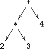

The structure of this tree makes explicit that + and \* are operators with two arguments, and that \* has higher priority than +.

Parsers are an important topic in computing, because most real-life programs use a parser to preprocess their input. For example, a calculator program parses numeric expressions prior to evaluating them, while the GHC system parses Haskell programs prior to executing them. In each case, making the structure of the input explicit considerably simplifies its further processing. For example, once a numeric expression has been parsed into a tree structure as in the example above, evaluating the expression is then straightforward.

### **13.2Parsers as functions**

In Haskell, a parser can naturally be viewed directly as a function that takes a string and produces a tree. Hence, given a suitable type Tree of trees, the notion of a parser can be represented as a function of type String -\> Tree, which we abbreviate as Parser using the following declaration:

``` haskell
type Parser = String -> Tree
```

In general, however, a parser might not always consume its entire argument string. For example, a parser for numbers might be applied to a string comprising a number followed by a word. For this reason, we generalise our type for parsers to also return any unconsumed part of the argument string:

``` haskell
type Parser = String -> (Tree,String)
```

Similarly, a parser might not always succeed. For example, a parser for numbers might be applied to a string comprising a word. To handle this, we further generalise our type for parsers to return a list of results, with the convention that the empty list denotes failure, and a singleton list denotes success:

``` haskell
type Parser = String -> [(Tree,String)]
```

Returning a list also opens up the possibility of returning more than one result if the argument string can be parsed in more than one way. For simplicity, however, we only consider parsers that return at most one result.

Finally, different parsers will likely return different kinds of trees, or more generally, any kind of value. For example, a parser for numbers might return an integer value. Hence, it is useful to abstract from the specific type Tree of result values, and make this into a parameter of the Parser type:

``` haskell
type Parser a = String -> [(a,String)]
```

In summary, this declaration states that a parser of type a is a function that takes an input string and produces a list of results, each of which is a pair comprising a result value of type a and an output string. Alternatively, the parser type can also be read as a rhyme in the style of Dr Seuss!

*A parser for things  
Is a function from strings  
To lists of pairs  
Of things and strings*

We conclude by noting that the type String -\> \[(a,String)\] for parsers is similar to the type State -\> (a,State) for state transformers from the previous chapter, where the state being manipulated is a string. The key difference is that a parser also has the possibility to fail by returning a list of results, whereas a state transformer always returns a single result. In this manner, a parser can be viewed as a generalised form of state transformer.

### **13.3Basic definitions**

We begin by importing two standard libraries for applicative functors and characters that will be used in our implementation:

``` haskell
import Control.Applicative
import Data.Char
```

To allow the Parser type to be made into instances of classes, it is first redefined using newtype, with a dummy constructor called P:

``` haskell
newtype Parser a = P (String -> [(a,String)])
```

Parser of this type can then be applied to an input string using a function that simply removes the dummy constructor:

``` haskell
parse :: Parser a -> String -> [(a,String)]
parse (P p) inp = p inp
```

Our first parsing primitive is called item, which fails if the input string is empty, and succeeds with the first character as the result value otherwise:

``` haskell
item :: Parser Char
item = P (\inp -> case inp of
[] -> []
(x:xs) -> [(x,xs)])
```

The item parser is the basic building block from which all other parsers that consume characters from the input will ultimately be constructed. Its behaviour is illustrated by the following two examples:

``` haskell
> parse item ""
[]
> parse item "abc"
[(’a’,"bc")]
```

### **13.4Sequencing parsers**

We now make the parser type into an instance of the functor, applicative and monad classes, in order that the do notation can then be used to combine parsers in sequence. The declarations are similar to those for state transformers, except that we also need to take account of the possibility that a parser may fail. The first step is to make the Parser type into a functor:

``` haskell
instance Functor Parser where
-- fmap :: (a -> b) -> Parser a -> Parser b
fmap g p = P (\inp -> case parse p inp of
[] -> []
[(v,out)] -> [(g v, out)])
```

That is, fmap applies a function to the result value of a parser if the parser succeeds, and propagates the failure otherwise. For example:

``` haskell
> parse (fmap toUpper item) "abc"
[(’A’,"bc")]
> parse (fmap toUpper item) ""
[]
```

(The function toUpper is provided in the library Data.Char.) The Parser type can then be made into an applicative functor as follows:

``` haskell
instance Applicative Parser where
-- pure :: a -> Parser a
pure v = P (\inp -> [(v,inp)])
-- <*> :: Parser (a -> b) -> Parser a -> Parser b
pg <*> px = P (\inp -> case parse pg inp of
[] -> []
[(g,out)] -> parse (fmap g px) out)
```

In this case, pure transforms a value into a parser that always succeeds with this value as its result, without consuming any of the input string:

``` haskell
> parse (pure 1) "abc"
[(1,"abc")]
```

In turn, \<\*\> applies a parser that returns a function to a parser that returns an argument to give a parser that returns the result of applying the function to the argument, and only succeeds if all the components succeed. For example, a parser that consumes three characters, discards the second, and returns the first and third as a pair can now be defined in applicative style :

``` haskell
three :: Parser (Char,Char)
three = pure g <*> item <*> item <*> item
where g x y z = (x,z)
```

Then, for example, we have:

``` haskell
> parse three "abcdef"
[((’a’,’c’),"def")]
> parse three "ab"
[]
```

Note that the applicative machinery automatically ensures that the above parser fails if the input string is too short, without the need to detect or manage this ourselves. Finally, we make the Parser type into a monad:

``` haskell
instance Monad Parser where
-- (>>=) :: Parser a -> (a -> Parser b) -> Parser b
p >>= f = P (\inp -> case parse p inp of
[] -> []
[(v,out)] -> parse (f v) out)
```

That is, the parser p \>\>= f fails if the application of the parser p to the input string inp fails, and otherwise applies the function f to the result value v to give another parser f v, which is then applied to the output string out that was produced by the first parser to give the final result.

Because Parser is a monadic type, the do notation can now be used to sequence parsers and process their result values. For example, the parser three can be defined in an alternative manner as follows:

``` haskell
three :: Parser (Char,Char)
three = do x <- item
item
z <- item
return (x,z)
```

Recall that the monadic function return is just another name for the applicative function pure, which in this case builds parsers that always succeed.

For the remainder of this chapter we adopt a monadic approach to writing parsers using the do notation, and generally avoid using the the functorial fmap and applicative \<\*\> primitives on parsers. However, some users prefer writing parsers in applicative style, and using an applicative approach can sometimes be beneficial for optimising the performance of parsers.

### **13.5Making choices**

The do notation combines parsers in sequence, with the output string from each parser in the sequence becoming the input string for the next. Another natural way of combining parsers is to apply one parser to the input string, and if this fails to then apply another to the same input instead. We now consider how such a choice operator can be defined for parsers.

Making a choice between two alternatives isn’t specific to parsers, but can be generalised to a range of applicative types. This concept is captured by the following class declaration in the library Control.Applicative:

``` haskell
class Applicative f => Alternative f where
empty :: f a
(<|>) :: f a -> f a -> f a
```

That is, for an applicative functor to be an instance of the Alternative class, it must support empty and \<\|\> primitives of the specified types. (The class also provides two further primitives, which will be discussed in the next section.) The intuition is that empty represents an alternative that has failed, and \<\|\> is an appropriate choice operator for the type. The two primitives are also required to satisfy the following identity and associativity laws:

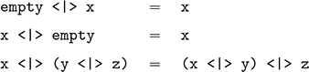

The motivating example of an Alternative type is the Maybe type, for which empty is given by the failure value Nothing, and \<\|\> returns its first argument if this succeeds, and its second argument otherwise:

``` haskell
instance Alternative Maybe where
-- empty :: Maybe a
empty = Nothing
-- (<|>) :: Maybe a -> Maybe a -> Maybe a
Nothing <|> my = my
(Just x) <|> _ = Just x
```

The instance for the Parser type is a natural extension of this idea, where empty is the parser that always fails regardless of the input string, and \<\|\> is a choice operator that returns the result of the first parser if it succeeds on the input, and applies the second parser to the same input otherwise:

``` haskell
instance Alternative Parser where
-- empty :: Parser a
empty = P (\inp -> [])
-- (<|>) :: Parser a -> Parser a -> Parser a
p <|> q = P (\inp -> case parse p inp of
[] -> parse q inp
[(v,out)] -> [(v,out)])
```

For example:

``` haskell
> parse empty "abc"
[]
> parse (item <|> return ’d’) "abc"
[(’a’,"bc")]
> parse (empty <|> return ’d’) "abc"
[(’d’,"abc")]
```

We conclude by noting that the library file Control.Monad provides a class MonadPlus that plays the same role as Alternative but for monadic types, with primitives called mzero and mplus. However, we prefer to use the applicative choice primitives empty and \<\|\> for parsers because of their similarity to the corresponding symbols for grammars, which we discuss later on.

### **13.6Derived primitives**

We now have three basic parsers: item consumes a single character if the input string is non-empty, return v always succeeds with the result value v, and empty always fails. In combination with sequencing and choice, these primitives can be used to define a number of other useful parsers. First of all, we define a parser sat p for single characters that satisfy the predicate p:

``` haskell
sat :: (Char -> Bool) -> Parser Char
sat p = do x <- item
if p x then return x else empty
```

Using sat and appropriate predicates from the library Data.Char, we can now define parsers for single digits, lower-case letters, upper-case letters, arbitrary letters, alphanumeric characters, and specific characters:

``` haskell
digit :: Parser Char
digit = sat isDigit
lower :: Parser Char
lower = sat isLower
upper :: Parser Char
upper = sat isUpper
letter :: Parser Char
letter = sat isAlpha
alphanum :: Parser Char
alphanum = sat isAlphaNum
char :: Char -> Parser Char
char x = sat (== x)
```

For example:

``` haskell
> parse (char ’a’) "abc"
[(’a’,"bc")]
```

In turn, using char we can define a parser string xs for the string of characters xs, with the string itself returned as the result value:

``` haskell
string :: String -> Parser String
string [] = return []
string (x:xs) = do char x
string xs
return (x:xs)
```

That is, the empty string can always be parsed, while for a non-empty string we parse the first character, recursively parse the remaining characters, and return the string as the result value. Note that string only succeeds if the entire target string is consumed from the input. For example:

``` haskell
> parse (string "abc") "abcdef"
[("abc","def")]
> parse (string "abc") "ab1234"
[]
```

Our next two parsers, many p and some p, apply a parser p as many times as possible until it fails, with the result values from each successful application of p being returned in a list. The difference between these two repetition primitives is that many permits zero or more applications of p, whereas some requires at least one successful application. For example:

``` haskell
> parse (many digit) "123abc"
[("123","abc")]
> parse (many digit) "abc"
[("","abc")]
> parse (some digit) "abc"
[]
```

In fact, there is no need to define many and some ourselves, as suitable default definitions are already provided in the Alternative class:

``` haskell
class Applicative f => Alternative f where
empty :: f a
(<|>) :: f a -> f a -> f a
many :: f a -> f [a]
some :: f a -> f [a]
many x = some x <|> pure []
some x = pure (:) <*> x <*> many x
```

Note that the two new functions are defined using mutual recursion. In particular, the above definition for many x states that x can either be applied at least once or not at all, while the definition for some x states that x can be applied once and then zero or more times, with the results being returned in a list. These functions are provided for any applicative type that is an instance of the class, but are primarily intended for use with parsers.

Using many and some, we can now define parsers for identifiers (variable names) comprising a lower-case letter followed by zero or more alphanumeric characters, natural numbers comprising one or more digits, and spacing comprising zero or more space, tab, and newline characters:

``` haskell
ident :: Parser String
ident = do x <- lower
xs <- many alphanum
return (x:xs)
nat :: Parser Int
nat = do xs <- some digit
return (read xs)
```

space :: Parser ()

space = do many (sat isSpace)

``` haskell
return ()
```

For example:

``` haskell
> parse ident "abc def"
[("abc"," def")]
> parse nat "123 abc"
[(123," abc")]
> parse space " abc"
[((),"abc")]
```

Note that nat converts the number that was read into an integer, and space returns the empty tuple () as a dummy result value, reflecting the fact that the details of spacing are not usually important. Finally, using nat it is now straightforward to define a parser for integer values:

``` haskell
int :: Parser Int
int = do char ’-’
n <- nat
return (-n)
<|> nat
```

For example:

``` haskell
> parse int "-123 abc"
[(-123," abc")]
```

### **13.7Handling spacing**

Most real-life parsers allow spacing to be freely used around the basic tokens in their input string. For example, the strings 1+2 and 1 + 2 are both parsed in the same way by GHC. To handle such spacing, we define a new primitive that ignores any space before and after applying a parser for a token:

``` haskell
token :: Parser a -> Parser a
token p = do space
v <- p
space
return v
```

Using token, we can now define parsers that ignore spacing around identifiers, natural numbers, integers and special symbols:

``` haskell
identifier :: Parser String
identifier = token ident
natural :: Parser Int
natural = token nat
integer :: Parser Int
integer = token int
symbol :: String -> Parser String
symbol xs = token (string xs)
```

For example, using these primitives a parser for a non-empty list of natural numbers that ignores spacing around tokens can be defined as follows:

``` haskell
nats :: Parser [Int]
nats = do symbol "["
n <- natural
ns <- many (do symbol "," natural)
symbol "]"
return (n:ns)
```

This definition states that such a list begins with an opening square bracket and a natural number, followed by zero or more commas and natural numbers, and concludes with a closing square bracket. Note that nats only succeeds if a complete list in precisely this format is consumed:

``` haskell
> parse nats " [1, 2, 3] "
[([1,2,3],"")]
> parse nats "[1,2,]"
[]
```

### **13.8Arithmetic expressions**

We conclude this chapter with two extended programming examples concerning arithmetic expressions. For our first example, consider a simple form of expressions that are built up from natural numbers using addition, multiplication and parentheses. We assume that addition and multiplication associate to the right, and that multiplication has higher priority than addition. For example, 2+3+4 means 2+(3+4), while 2\*3+4 means (2\*3)+4.

The syntactic structure of a language can be formalised using the mathematical notion of a *grammar*, which is a set of rules that describes how strings of the language can be constructed. For example, a grammar for our language of arithmetic expressions can be defined by the following two rules:

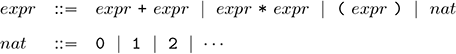

The first rule states that an expression is either the addition or multiplication of two expressions, a parenthesised expression, or a natural number. In turn, the second rule states that a natural number is either zero, one, two, etc.

For example, using the above grammar the construction of the expression 2\*3+4 can be represented by the following *parse tree*, in which the tokens in the expression appear at the leaves, and the grammatical rules applied to construct the expression give rise to the branching structure:

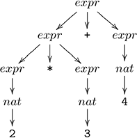

The structure of this tree makes explicit that 2\*3+4 can be constructed from the addition of two expressions, the first given by the multiplication of two further expressions which are in turn given by the numbers two and three, and the second expression given by the number four. However, the grammar also permits another possible parse tree for this example, which corresponds to the erroneous interpretation of the expression as 2\*(3+4):

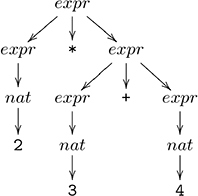

The problem is that our grammar for expressions does not take account of the fact that multiplication has higher priority than addition. However, this can easily be addressed by modifying the grammar to have a separate rule for each level of priority, with addition at the lowest level of priority, multiplication at the middle level, and parentheses and numbers at the highest level:

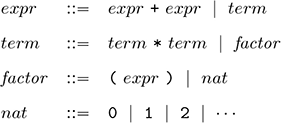

Using this new grammar, 2\*3+4 indeed has a single parse tree, which corresponds to the correct interpretation of the expression as (2\*3)+4:

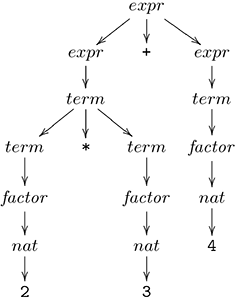

We have now dealt with the issue of priority, but our grammar does not yet take account of the fact that addition and multiplication associate to the right. For example, the expression 2+3+4 currently has two possible parse trees, corresponding to (2+3)+4 and 2+(3+4). However, this can easily be rectified by modifying the rules for addition and multiplication to be recursive in their right argument only, rather than in both arguments:

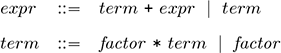

Using these new rules, 2+3+4 now has a single parse tree, which corresponds to the correct interpretation of the expression as 2+(3+4):

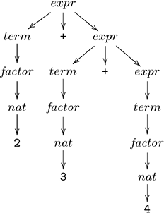

In fact, our grammar for expressions is now *unambiguous*, in the sense that every well-formed expression has precisely one parse tree.

Our final modification to the grammar is a simplification. Consider the rule *expr* ::= *term* + *expr* \| *term*, which states that an expression is either the addition of a term and an expression, or is a term. In other words, an expression always begins with a term, which can then be followed by the addition of an expression or by nothing. Hence, the rule for expressions can be simplified to *expr* ::= *term* (+ *expr* \| *ϵ*), in which the symbol *ϵ* denotes the empty string. Simplifying the rule for terms in a similar manner gives our final grammar:

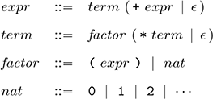

It is now straightforward to translate this grammar directly into a parser for expressions, by simply rewriting the rules using the parsing primitives we have introduced. Sequencing in the grammar is translated into the do notation, choice \| is translated into the \<\|\> operator, the empty string *ϵ* becomes the empty parser, special symbols such as + and \* are handled using the symbol function, and natural numbers are parsed using the natural primitive:

``` haskell
expr :: Parser Int
expr = do t <- term
do symbol "+"
e <- expr
return (t + e)
<|> return t
term :: Parser Int
term = do f <- factor
do symbol "*"
t <- term
return (f * t)
<|> return f
factor :: Parser Int
factor = do symbol "("
e <- expr
symbol ")"
return e
<|> natural
```

Note that each of the above parsers returns the integer value of the expression that was parsed, rather than some form of expression tree. Combining parsing and evaluation in this manner is easy to achieve using our approach. For example, expr first parses a term with integer value t, then parses an addition symbol followed by an expression with value e and returns the value t + e, or else parses nothing further and simply returns the value t.

Finally, using expr we define a function that returns the integer value that results from parsing and evaluating an expression. To handle the cases of unconsumed and invalid input, we use the library function error :: String -\> a that displays an error message and then terminates the program:

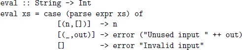

For example:

``` haskell
> eval "2*3+4"
10
> eval "2*(3+4)"
14
> eval "2*3^4"
*** Exception: Unused input ^4
> eval "one plus two"
*** Exception: Invalid input
```

### **13.9Calculator**

In the previous section we developed a parser for arithmetic expressions. We now extend this example to a simple calculator program, which allows the user to enter expressions interactively using the keyboard, and displays the value of such expressions on the screen. Our calculator will handle expressions built up from integer values using addition, subtraction, multiplication, division and parentheses. A suitable parser expr :: Parser Int for such expressions can be obtained by solving one of the exercises for this chapter.

We begin by considering the user interface of the calculator, for which purpose we use the input/output utilities cls, writeat, goto and getCh from chapter 10. First of all, we define the calculator box as a list of strings:

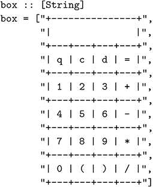

The first four buttons on the calculator, q, c, d, and =, allow the user to quit, clear the display, delete a character, and evaluate an expression, while the remaining sixteen buttons allow the user to enter expressions.

We also define the buttons on the calculator as a list of characters, comprising both the twenty standard buttons that appear on the box itself, together with a number of extra characters that will be allowed for flexibility, namely Q, C, D, space, escape, backspace, delete and newline:

``` haskell
buttons :: String
buttons = standard ++ extra
where
standard = "qcd=123+456-789*0()/"
extra = "QCD \ESC\BS\DEL\n"
```

Using a list comprehension together with the library function that performs a list of input/output actions in sequence, we can define an action that displays the calculator box in the top-left corner of the screen:

``` haskell
showbox :: IO ()
showbox = sequence_ [writeat (1,y) b | (y,b) <- zip [1..] box]
```

The last part of the user interface is to define a function that shows a string in the display of the calculator, by first clearing the display and then showing the last thirteen characters of the string:

``` haskell
display xs = do writeat (3,2) (replicate 13 ’ ’)
writeat (3,2) (reverse (take 13 (reverse xs)))
```

In this manner, if the user deletes characters from the string they will automatically be removed from the display, and if the user types more than thirteen characters the display will appear to scroll to the left.

The calculator itself is controlled by a function calc that displays the current string, and then reads a character from the keyboard without echoing it. If this character is a valid button, then it is processed, otherwise we sound a beep to indicate an error and continue with the same string:

``` haskell
calc :: String -> IO ()
calc xs = do display xs
c <- getCh
if elem c buttons then
process c xs
else
do beep
calc xs
```

The action beep :: IO () used above is defined by beep = putStr "\BEL". In turn, the function process takes a valid character and the current string, and performs the appropriate action depending upon the character:

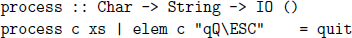

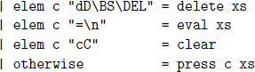

We now consider each of the five possible actions:

- Quitting moves the cursor below the calculator box and terminates:

  quit :: IO ()

  quit = goto (1,14)

- Deleting a character has no effect if the current string is empty, and otherwise removes the last character from this string:

  delete :: String -\> IO ()

  delete \[\] = calc \[\]

  delete xs = calc (init xs)

- Evaluation displays the result of parsing and evaluating the current string, sounding a beep if this process is unsuccessful:

  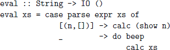

- Clearing the display resets the current string to empty:

  clear :: IO ()

  clear = calc \[\]

- Any other character is appended to the end of the current string:

  press :: Char -\> String -\> IO ()

  press c xs = calc (xs ++ \[c\])

Finally, we define a top-level function that runs the calculator, by clearing the screen, displaying the box, and starting with an empty display:

``` haskell
run :: IO ()
run = do cls
showbox
clear
```

### **13.10Chapter remarks**

A library file comprising the parsing primitives from this chapter is available online from the book’s website. Further details about the monadic approach to parsing can be found in \[21, 22\], upon which this chapter is based. A more detailed introduction to grammars is given in \[23\], and more sophisticated approaches to building parsers in Haskell are provided in \[24, 25\]. The reading of the parser type as a rhyme is due to Fritz Ruehr.

### **13.11Exercises**

1.Define a parser comment :: Parser () for ordinary Haskell comments that begin with the symbol -- and extend to the end of the current line, which is represented by the control character ’\n’.

2.Using our second grammar for arithmetic expressions, draw the two possible parse trees for the expression 2+3+4.

3.Using our third grammar for arithmetic expressions, draw the parse trees for the expressions 2+3, 2\*3\*4 and (2+3)+4.

4.Explain why the final simplification of the grammar for arithmetic expressions has a dramatic effect on the efficiency of the resulting parser. Hint: begin by considering how an expression comprising a single number would be parsed if this simplification step had not been made.

5.Define a suitable type Expr for arithmetic expressions and modify the parser for expressions to have type expr :: Parser Expr.

6.Extend the parser expr :: Parser Int to support subtraction and division, and to use integer values rather than natural numbers, based upon the following revisions to the grammar:

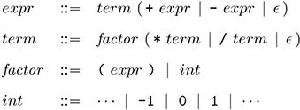

7.Further extend the grammar and parser for arithmetic expressions to support exponentiation ^, which is assumed to associate to the right and have higher priority than multiplication and division, but lower priority than parentheses and numbers. For example, 2^3\*4 means (2^3)\*4. Hint: the new level of priority requires a new rule in the grammar.

8.Consider expressions built up from natural numbers using a subtraction operator that is assumed to associate to the left.

a.Translate this description directly into a grammar.

b.Implement this grammar as a parser expr :: Parser Int.

c.What is the problem with this parser?

d.Show how it can be fixed. Hint: rewrite the parser using the repetition primitive many and the library function foldl.

9.Modify the calculator program to indicate the approximate position of an error rather than just sounding a beep, by using the fact that the parser returns the unconsumed part of the input string.

Solutions to exercises 1–4 are given in appendix A.