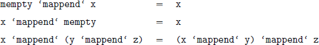
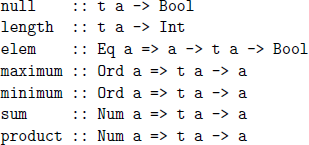
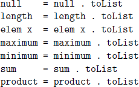
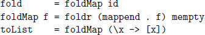

## **14**

## Foldables and friends

In this chapter we introduce three common patterns for processing the values in a data structure. We start with monoids, which capture the idea of combining values using an associative operator, then consider foldables, which generalise the concept of folding from lists to a range of parameterised types, and conclude with traversables, which further generalise the notion of mapping.

### **14.1Monoids**

In mathematics, a *monoid* is a set together with an associative operator that combines two elements from the set, and an identity element for the operator. For example, the set of integers forms a monoid with the operator given by addition and the identity element by the value zero. In Haskell, the notion of a monoid is captured by the following built-in class declaration:

``` haskell
class Monoid a where
mempty :: a
mappend :: a -> a -> a
mconcat :: [a] -> a
mconcat = foldr mappend mempty
```

That is, for a type a to be an instance of the class Monoid, it must support a value mempty and a function mappend of the specified types, which respectively play the role of the identity element and the operator for the monoid. In practice, the function mappend is often written as an infix operator by enclosing its name in single back quotes, as in x ‘mappend‘ y.

As well as the two primitives, the above class also provides a function mconcat that combines a list of values within a monoid, with a default definition that replaces each cons in the list by mappend and the empty list by mempty. For example, applying mconcat to a list of the form \[x,y,z\] gives:

``` haskell
x ‘mappend‘ (y ‘mappend‘ (z ‘mappend‘ mempty))
```

As in mathematics, the two primitives in the Monoid class are required to satisfy the following identity and associativity laws:



For example, using these laws the result of mconcat \[x,y,z\] can be written in a simpler manner as follows, without the need for parentheses or mempty, because the monoid laws ensure that these do not affect the result:

``` haskell
x ‘mappend‘ y ‘mappend‘ z
```

At some point in the future the Monoid class in Haskell may be divided up into two separate classes, one that provides an associative operator, and one that provides an identity element. If this change is implemented, any adjustments that are required will be explained on the book’s website.

##### Examples

A number of standard monoids are provided in the library Data.Monoid. The simplest example is the list monoid, for which mempty and mappend are respectively given by the empty list and the append operator for lists:

``` haskell
instance Monoid [a] where
-- mempty :: [a]
mempty = []
-- mappend :: [a] -> [a] -> [a]
mappend = (++)
```

The method names mempty and mappend are inspired by this instance, but the choice of names is unfortunate as in general the monoid primitives do not need to correspond to an empty value or provide a means of appending values. All that is required is two primitives that satisfy the monoid laws.

For our second example, the type Maybe a can also be made into a monoid, provided that the parameter type a is a monoid:

``` haskell
instance Monoid a => Monoid (Maybe a) where
-- mempty :: Maybe a
mempty = Nothing
-- mappend :: Maybe a -> Maybe a -> Maybe a
Nothing ‘mappend‘ my = my
mx ‘mappend‘ Nothing = mx
Just x ‘mappend‘ Just y = Just (x ‘mappend‘ y)
```

That is, mempty is given by the failure value Nothing, while mappend combines the results of two arguments that may fail. In the latter case, if either argument fails the other argument is returned, and if both arguments succeed the two result values are combined using mappend for the parameter type a.

A particular type may give rise to a monoid in a number of different ways. For example, we have already seen that the integers form a monoid under addition, so we could declare the following simple instance:

``` haskell
instance Monoid Int where
-- mempty :: Int
mempty = 0
-- mappend :: Int -> Int -> Int
mappend = (+)
```

The integers also form a monoid under multiplication, with the identity element given by the value one, so we could also declare:

``` haskell
instance Monoid Int where
-- mempty :: Int
mempty = 1
-- mappend :: Int -> Int -> Int
mappend = (*)
```

However, multiple instance declarations of the same type for the same class are not permitted in Haskell, so attempting to declare two separate instances for Monoid Int in this manner will result in an error. The solution is to introduce special-purpose wrapper types for each of the two instances.

In the case of addition, the monoid library declares a new type Sum a with a dummy constructor also called Sum that takes a single argument of type a, together with a function that removes the constructor:

``` haskell
newtype Sum a = Sum a
deriving (Eq, Ord, Show, Read)
getSum :: Sum a -> a
getSum (Sum x) = x
```

The deriving clause above ensures that values of type Sum a support the standard equality and ordering operators, and can be converted to and from strings. Now for any parameter type a that is a numeric (such as Int), the type Sum a can be made into a monoid by taking mempty as the value Sum 0, and mappend as the addition operator for values of type Sum a:

``` haskell
instance Num a => Monoid (Sum a) where
-- mempty :: Sum a
mempty = Sum 0
-- mappend :: Sum a -> Sum a -> Sum a
Sum x ‘mappend‘ Sum y = Sum (x+y)
```

For example, using this instance we have:

``` haskell
> mconcat [Sum 2, Sum 3, Sum 4]
Sum 9
```

(If you wish to try out such examples in GHCi, you must first load the monoid library by entering import Data.Monoid.) In particular, applying Sum to each number in the list ensures that mconcat uses the monoid for summation. We will see in the next section how the use of such wrappers can be simplified.

In turn, in the case of multiplication of numbers, the monoid library declares a new type Product a using the same approach as for addition:

``` haskell
newtype Product a = Product a
deriving (Eq, Ord, Show, Read)
getProduct :: Product a -> a
getProduct (Product x) = x
```

The type Product a can then be made into an instance of the Monoid class by defining the two primitives in the appropriate way for multiplication:

``` haskell
instance Num a => Monoid (Product a) where
-- mempty :: Product a
mempty = Product 1
-- mappend :: Product a -> Product a -> Product a
Product x ‘mappend‘ Product y = Product (x*y)
```

For example:

``` haskell
> mconcat [Product 2, Product 3, Product 4]
Product 24
```

In a similar manner, the type of logical values forms a monoid under both logical conjunction and disjunction, for which purpose the monoid library provides wrapper types for Bool called All and Any (see appendix B for the details.) For example, the function mconcat for All decides if all logical values in a list are True, while for Any decides if any such value is True:

``` haskell
> mconcat [All True, All True, All True]
All True
> mconcat [Any False, Any False, Any False]
Any False
```

We conclude this section by noting that the library also provides an infix version of mappend, defined by x \<\> y = x ‘mappend‘ y, which allows monoid expressions to be written more concisely, as in x \<\> y \<\> z. This operator is often used in practical applications, however for expository purposes in this chapter we prefer to use the mappend primitive directly.

### **14.2Foldables**

One of the primary applications of monoids in Haskell is to combine all the values in a data structure to give a single value. For example, in the case of lists we could define a function fold that implements this idea as follows:

``` haskell
fold :: Monoid a => [a] -> a
fold [] = mempty
fold (x:xs) = x ‘mappend‘ fold xs
```

That is, applying fold to an empty list gives the identity element mempty of the monoid, while for a non-empty list we use the monoid operator mappend to combine the head of the list with the result of recursively processing the tail. For example, applying fold to a list of the form \[x,y,z\] gives:

``` haskell
x ‘mappend‘ (y ‘mappend‘ (z ‘mappend‘ mempty))
```

In other words, fold provides a simple means of ‘folding up’ a list using a monoid, hence the choice of name for the function. Note that fold behaves in the same way as mconcat from the Monoid class, but is defined using explicit recursion rather than using foldr. In a similar manner, we can also define a version of fold for the type of binary trees that have data in their leaves:

``` haskell
data Tree a = Leaf a | Node (Tree a) (Tree a)
deriving Show
fold :: Monoid a => Tree a -> a
fold (Leaf x) = x
fold (Node l r) = fold l ‘mappend‘ fold r
```

That is, for a leaf we simply return the value that it contains, while for a node we recursively fold the two subtrees and combine the resulting values using mappend. For this example there is no need to use the identity element mempty in the definition, because trees of this type are always non-empty.

More generally, the idea of folding up the values in data structure using a monoid isn’t specific to types such as lists and binary trees, but can be abstracted to a range of parameterised types. In Haskell, this concept is captured by the following class declaration in the library Data.Foldable:

``` haskell
class Foldable t where
fold :: Monoid a => t a -> a
foldMap :: Monoid b => (a -> b) -> t a -> b
foldr :: (a -> b -> b) -> b -> t a -> b
foldl :: (a -> b -> a) -> a -> t b -> a
```

That is, for a parameterised type to be an instance of the class Foldable, it must support a range of fold functions of the specified types. As in the above declaration, by convention foldable types are usually denoted by t.

Intuitively, the generalised version of fold in the Foldable class takes a data structure of type t a whose elements have type a, and combines the elements using the monoid primitives for this type to give a single value of type a. In turn, foldMap generalises fold by taking a function of type a -\> b as an additional argument, which is applied to each element in the structure prior to combining the resulting values using the monoid primitives for the type b.

The final two functions in the class declaration above, foldr and foldl, generalise the higher-order functions for lists that we introduced in chapter 7 to other data structures. Note that for these latter two functions there is no need to have an underlying monoid, because a starting value and function to combine two values are explicitly supplied as arguments.

The full version of the Foldable class also includes a number of other useful functions, together with a number of default definitions, but we begin by considering the cut-down version presented above.

##### Examples

As we would expect, the type of lists can be made into a foldable type by defining the folding primitives in the appropriate manner:

``` haskell
instance Foldable [] where
-- fold :: Monoid a => [a] -> a
fold [] = mempty
fold (x:xs) = x ‘mappend‘ fold xs
-- foldMap :: Monoid b => (a -> b) -> [a] -> b
foldMap _ [] = mempty
foldMap f (x:xs) = f x ‘mappend‘ foldMap f xs
-- foldr :: (a -> b -> b) -> b -> [a] -> b
foldr _ v [] = v
foldr f v (x:xs) = f x (foldr f v xs)
-- foldl :: (a -> b -> a) -> a -> [b] -> a
foldl _ v [] = v
foldl f v (x:xs) = foldl f (f v x) xs
```

For example, using the numeric monoids from the previous section, foldMap can now be used to calculate the sum and product of a list of numbers:

``` haskell
> getSum (foldMap Sum [1..10])
55
> getProduct (foldMap Product [1..10])
3628800
```

(If trying such examples, make sure to import Data.Monoid and Data.Foldable.) An instance for binary trees can be defined in a similar manner, except that we need to take care to ensure that foldr and foldl combine the values in the tree in right-to-left and left-to-right order, respectively:

``` haskell
instance Foldable Tree where
-- fold :: Monoid a => Tree a -> a
fold (Leaf x) = x
fold (Node l r) = fold l ‘mappend‘ fold r
-- foldMap :: Monoid b => (a -> b) -> Tree a -> b
foldMap f (Leaf x) = f x
foldMap f (Node l r) = foldMap f l ‘mappend‘ foldMap f r
-- foldr :: (a -> b -> b) -> b -> Tree a -> b
foldr f v (Leaf x) = f x v
foldr f v (Node l r) = foldr f (foldr f v r) l
-- foldl :: (a -> b -> a) -> a -> Tree b -> a
foldl f v (Leaf x) = f v x
foldl f v (Node l r) = foldl f (foldl f v l) r
```

For example, consider the following tree of integers:

``` haskell
tree :: Tree Int
tree = Node (Node (Leaf 1) (Leaf 2)) (Leaf 3)
```

Then evaluating foldr (+) 0 tree gives the result 1+(2+(3+0)), in which the additions are performed from right-to-left, whereas foldl (+) 0 tree gives ((0+1)+2)+3, in which they are performed from left-to-right. Of course, in this case the result is the same, because addition is associative. However, as we will see in chapter 15, using foldl may be more efficient.

##### Other primitives and defaults

In addition to the four basic folding primitives, the Foldable class also includes a range of other useful functions for combining the values in a data structure. The first group generalise familiar functions on lists:



For example, null decides if a structure is empty (has no elements), and length counts the number of elements of type a in a structure of type t a. Hence, these functions can be applied to both lists and trees:

``` haskell
> null []
True
> null (Leaf 1)
False
> length [1..10]
10
> length (Node (Leaf ’a’) (Leaf ’b’))
2
```

In turn, the class also includes versions of foldr and foldl for structures that contain at least one element, and hence do not require a starting value:

``` haskell
foldr1 :: (a -> a -> a) -> t a -> a
foldl1 :: (a -> a -> a) -> t a -> a
```

For example:

``` haskell
> foldr1 (+) [1..10]
55
> foldl1 (+) (Node (Leaf 1) (Leaf 2))
3
```

The final primitive in the class flattens a data structure to a list, such as transforming the tree Node (Leaf 1) (Leaf 2) into the list \[1,2\]:

``` haskell
toList :: t a -> [a]
```

In fact, the function toList plays a special role in the declaration of the Foldable class, as it can be used to provide default definitions for most of the other primitives in the class in terms of the corresponding primitives for lists. In particular, we have the following collection of default definitions:

``` haskell
foldr f v = foldr f v . toList
foldl f v = foldl f v . toList
foldr1 f = foldr1 f . toList
foldl1 f = foldl1 f . toList
```



For example, the definition null = null . toList states that we can decide if a data structure is empty by first flattening the structure to a list, and then checking if this list is empty using the instance of null for lists. The other definitions have a similarly straightforward interpretation.

The final three default definitions in the foldable class establish important relationships between the primitives fold, foldMap and toList:



That is, fold can be viewed as a special case of foldMap where the identity function is applied to each element prior to combining them. In turn, foldMap can be defined in terms of foldr by applying the function f to each element before they are combined using the monoid primitives. And finally, toList can be defined in terms of foldMap by first transforming each element into a singleton list, and then concatenating the resulting lists using the list monoid.

In summary, the Foldable class provides a range of useful functions for processing the values in a data structure, most of which have default definitions in terms of the specific instance for lists, or other generic functions in the class. There are three natural questions to ask at this point.

1\. Why are there so many functions in the class? In particular, one might ask why additional primitives such as null, length, and so on are provided as methods in the Foldable class, rather than as definitions in the foldable library. The reason is to allow the default definitions to be overridden if required, which would not be possible if they were defined as top-level functions.

2\. What do we need to define manually? The minimal complete definition for an instance of the Foldable class is to define either foldMap or foldr, as all other functions in the class can be derived from either of these two using the default definitions and the instance for lists. As we have already seen with lists and trees, it is often simplest to define the function foldMap.

3. What about efficiency? For many applications using the default definitions that are provided in the class will suffice, but if greater efficiency is required these can be overridden, as noted above. In practice, the GHC system uses more efficient default definitions than the simple versions we have presented, but these are functionally equivalent to our simpler versions.

We conclude this section by noting that GHC automatically imports the library Data.Foldable, but currently hides the fold and toList methods of the class. For this reason, we generally prefer to explicitly import Data.Foldable when programming with foldable types, rather than relying on the cut-down version that is automatically provided. For reference, the complete definition for the Foldable class can be found in appendix B.

##### Generic functions

An important benefit of abstracting out the concept of foldable types is the ability to use the primitives in the Foldable class to define generic functions that can be used with any such type. For example, recall that in chapter 2 we defined a function that calculates the average of a list of integers:

``` haskell
average :: [Int] -> Int
average ns = sum ns ‘div‘ length ns
```

As we have now seen, the functions sum and length are not specific to lists, but can be used with any foldable type, so the type of average can be generalised, without any change being required to the definition itself:

``` haskell
average :: Foldable t => t Int -> Int
average ns = sum ns ‘div‘ length ns
```

As such, it can now be applied to both lists and trees:

``` haskell
> average [1..10]
5
> average (Node (Leaf 1) (Leaf 3))
2
```

In a similar manner, the library Data.Foldable provides generic versions of a number of familiar functions that operate on lists of logical values:

``` haskell
and :: Foldable t => t Bool -> Bool
and = getAll . foldMap All
or :: Foldable t => t Bool -> Bool
or = getAny . foldMap Any
all :: Foldable t => (a -> Bool) -> t a -> Bool
all p = getAll . foldMap (All . p)
any :: Foldable t => (a -> Bool) -> t a -> Bool
any p = getAny . foldMap (Any . p)
```

In each case, using foldMap together with the appropriate monoid primitives allows us to obtain the desired behaviour in a generic manner:

``` haskell
> and [True,False,True]
False
> or (Node (Leaf True) (Leaf False))
True
> all even [1,2,3]
False
> any even (Node (Leaf 1) (Leaf 2))
True
```

As a final example, the function concat :: \[\[a\]\] -\> \[a\] that concatenates a list of lists can now be generalised to any foldable type whose elements are lists by simply folding the elements using the list monoid:

``` haskell
concat :: Foldable t => t [a] -> [a]
concat = fold
```

For example:

``` haskell
> concat ["ab","cd","ef"]
"abcdef"
> concat (Node (Leaf [1,2]) (Leaf [3]))
[1,2,3]
```

In conclusion, when declaring a new type in Haskell it is useful to consider whether it can be made into a foldable type, for which it suffices to define either of the primitives foldMap or foldr. The advantage of doing so is that we are then provided with a range of useful functions for the type essentially ‘for free’, by means of the default definitions that are included in the Foldable class, as well as any other generic functions defined in terms of these primitives.

### **14.3Traversables**

As we saw in chapter 12, the idea of mapping a function over each element of a data structure is captured by the notion of a functor:

``` haskell
class Functor f where
fmap :: (a -> b) -> f a -> f b
```

For example, in the case of lists the primitive fmap is given by the familiar library function map, which can be defined recursively as follows:

``` haskell
map :: (a -> b) -> [a] -> [b]
map g [] = []
map g (x:xs) = g x : map g xs
```

However, the idea of mapping a function over a list can be generalised further. For example, suppose that the function g that is applied to each element may fail, in the sense that it has type a -\> Maybe b rather than simply a -\> b, and that the mapping as a whole only succeeds if every such application succeeds. Using the fact that Maybe is applicative, as we also saw in chapter 12, it easy to define a function that implements this behaviour:

``` haskell
traverse :: (a -> Maybe b) -> [a] -> Maybe [b]
traverse g [] = pure []
traverse g (x:xs) = pure (:) <*> g x <*> traverse g xs
```

The recursive structure of this definition is essentially the same as that for map, except that the applicative machinery is used to manage the possibility of failure. In this manner, traverse provides a simple means of traversing the elements of a list using a function that may fail, hence the choice of name for the function. By way of example, suppose that we use the Maybe type to define a function that decrements an integer, provided it is strictly positive:

``` haskell
dec :: Int -> Maybe Int
dec n = if n > 0 then Just (n-1) else Nothing
```

Then we have:

``` haskell
> traverse dec [1,2,3]
Just [0,1,2]
> traverse dec [2,1,0]
Nothing
```

(If you wish to try out these examples in GHCi, note that traverse is already defined in the standard library, as shown in the next section.)

Not surprisingly, the idea of traversing a data structure in the above manner isn’t specific to the type of lists, and isn’t specific to argument functions that may fail. The class of types that support such a generalised mapping function are called *traversable types*, or *traversables* for short. In Haskell, this concept is captured by the following built-in class declaration:

``` haskell
class (Functor t, Foldable t) => Traversable t where
traverse :: Applicative f => (a -> f b) -> t a -> f (t b)
```

That is, for a parameterised type t that is both functorial and foldable to be an instance of the class Traversable, it must support a traverse function of the specified type. The requirement that t is a functor reflects the fact that traversables generalise the idea of mapping, and are hence expected to support the fmap primitive. The requirement that t is foldable ensures that values in a traversable type can also be folded up if desired.

##### Examples

Because lists are functorial and foldable, the list type can be made traversable by simply generalising traverse for the Maybe type to an arbitrary applicative. That is, the definition remains the same, but the type is generalised:

``` haskell
instance Traversable [] where
-- traverse :: Applicative f => (a -> f b) -> [a] -> f [b]
traverse g [] = pure []
traverse g (x:xs) = pure (:) <*> g x <*> traverse g xs
```

An instance for trees can be defined in a similar manner, except that the application of the argument function then takes place in the base case:

``` haskell
instance Traversable Tree where
-- traverse :: Applicative f =>
-- (a -> f b) -> Tree a -> f (Tree b)
traverse g (Leaf x) = pure Leaf <*> g x
traverse g (Node l r) =
pure Node <*> traverse g l <*> traverse g r
```

For example, traverse can now be used to map a function that may fail, such as dec from the previous section, over both lists and trees:

``` haskell
> traverse dec [1,2,3]
Just [0,1,2]
> traverse dec [2,1,0]
Nothing
> traverse dec (Node (Leaf 1) (Leaf 2))
Just (Node (Leaf 0) (Leaf 1))
> traverse dec (Node (Leaf 0) (Leaf 1))
Nothing
```

##### Other primitives and defaults

In addition to the traverse primitive, the Traversable class also includes the following extra function and default definition:

``` haskell
sequenceA :: Applicative f => t (f a) -> f (t a)
sequenceA = traverse id
```

The type expresses that sequenceA transforms a data structure whose elements are applicative actions into a single such action that returns a data structure, while the definition states that this can be achieved by traversing the elements of the structure using the identity function, which in this case has type f a -\> f a. For example, sequenceA can be used to transform a data structure whose elements may fail into a data structure that may fail:

``` haskell
> sequenceA [Just 1, Just 2, Just 3]
Just [1,2,3]
> sequenceA [Just 1, Nothing, Just 3]
Nothing
> sequenceA (Node (Leaf (Just 1)) (Leaf (Just 2)))
Just (Node (Leaf 1) (Leaf 2))
> sequenceA (Node (Leaf (Just 1)) (Leaf Nothing))
Nothing
```

Conversely, the class declaration also includes a default definition for traverse in terms of sequenceA, which expresses that to traverse a data structure using an effectful function we can first apply the function to each element using fmap, and then combine all the effects using sequenceA:

``` haskell
-- traverse :: Applicative f => (a -> f b) -> t a -> f (t b)
traverse g = sequenceA . fmap g
```

In this manner, to declare an instance of the Traversable class it suffices to define either traverse or sequenceA, as each can be derived from the other using the above defaults. However, as the default for traverse notionally makes two passes over the data structure, one using fmap and one using sequenceA, it is generally preferable to define traverse rather than sequenceA.

Finally, the class also provides special names for the two traversable primitives for the special case when the effects that are involved are monadic rather than applicative, as shown below. For reference, the complete definition for the Traversable class can be found in appendix B.

``` haskell
mapM :: Monad m => (a -> m b) -> t a -> m (t b)
sequence :: Monad m => t (m a) -> m (t a)
mapM = traverse
sequence = sequenceA
```

In conclusion, when declaring a new type it is also useful to consider whether it can be made into a traversable type, by defining either of the primitives traverse or sequenceA. The advantage of doing so is that we are then provided with a number of useful functions for effectful programming with the type, by means of the default definitions in the Traversable class.

### **14.4Chapter remarks**

Further information on the use of monoids in Haskell can be found in \[26\]. There are two standard ways to generalise foldr from lists to other data structures, known in the literature as *catamorphisms* \[27\] and *crush operators* \[28\]. The generalised form of folding that is captured by the Foldable class corresponds to a crush, hence it can be argued that the Foldable class should really be called Crushable, and the fold primitive should be called crush. Traversables were introduced in \[19\], which also discusses the issue of laws.

### **14.5Exercises**

1.Complete the following instance declaration from Data.Monoid to make a pair type into a monoid provided the two component types are monoids:

``` haskell
instance (Monoid a, Monoid b) => Monoid (a,b) where
-- mempty :: (a,b)
mempty = ...
-- mappend :: (a,b) -> (a,b) -> (a,b)
(x1,y1) ‘mappend‘ (x2,y2) = ...
```

2.In a similar manner, show how a function type a -\> b can be made into a monoid provided that the result type b is a monoid.

3.Show how the Maybe type can be made foldable and traversable, by giving explicit definitions for fold, foldMap, foldr, foldl and traverse.

4.In a similar manner, show how the following type of binary trees with data in their nodes can be made into a foldable and traversable type:

``` haskell
data Tree a = Leaf | Node (Tree a) a (Tree a)
deriving Show
```

5.Using foldMap, define a generic version of the higher-order function filter on lists that can be used with any foldable type:

``` haskell
filterF :: Foldable t => (a -> Bool) -> t a -> [a]
```

Solutions to exercises 1 and 2 are given in appendix A.