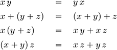
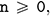
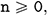
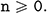
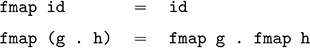
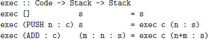
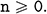
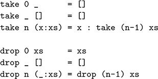

## **16**

## Reasoning about programs

In this chapter we introduce the idea of reasoning about Haskell programs. We start by reviewing the notion of equational reasoning, then consider how it can be applied in Haskell, introduce the important technique of induction, show how induction can be used to eliminate uses of the append operator, and conclude by proving the correctness of a simple compiler.

### **16.1Equational reasoning**

At school we learn basic algebraic properties of numbers, such as the fact that multiplication is commutative, addition is associative, and multiplication distributes over addition on both the left- and right-hand sides:



For example, using these properties we can show that a product of the form (*x* + *a*) (*x* + *b*) can be expanded to a summation *x*² +(*a* + *b*) *x* + *ab*:

``` haskell
(x + a) (x + b)
={ left distributivity }
(x + a) x +(x + a) b
={ right distributivity }
xx + ax + xb + ab
={ squaring }
x2 + ax + xb + ab
={ commutativity }
x2 + ax + b x + ab
={ right distributivity }
x2 +(a + b) x + ab
```

Note that in this calculation we follow the common practice of implicitly exploiting associativity properties, in this case the associativity of addition by omitting parentheses when more than one addition is used in sequence.

As well as being interesting in their own right, algebraic properties can also have a computational significance. For example, the expression *x* (*y* + *z*) requires two operations (one multiplication and one addition), whereas the equivalent expression *xy* + *xz* requires three operations (two multiplications and one addition). Hence even though these two expressions are algebraically equal, in terms of efficiency the former is preferable to the latter.

### **16.2Reasoning about Haskell**

The same style of equational reasoning can also be used in Haskell. For example, in this context the equation x \* y = y \* x means that for any expressions x and y of the same numeric types, evaluation of x \* y and y \* x will always produce the same numeric value. Note that we use the mathematical equality operator = when stating such properties, rather than the equality operator == provided within Haskell itself, because we are aiming to use mathematics as a language to reason about Haskell, rather than using Haskell as a language to reason about itself, which would be somewhat circular.

When reasoning about Haskell, we do not just use properties of built-in operations of the language such as addition and multiplication, but also use the equations from which user-defined functions are constructed. For example, consider the following function that doubles an integer:

``` haskell
double :: Int -> Int
double x = x + x
```

As well as being viewed as the *definition* of a function, this equation can also be viewed as a *property* that can be used when reasoning about this function. In particular, as a logical property the above equation states that for any integer expression x, the expression double x can freely be replaced by x + x, and, conversely, that the expression x + x can freely be replaced by double x. In this manner, when reasoning about programs, function definitions can be both *applied* from left-to-right and *unapplied* from right-to-left.

However, some care is required when reasoning about functions that are defined using multiple equations. For example, consider a function that decides if an integer is zero, defined using two equations:

``` haskell
isZero :: Int -> Bool
isZero 0 = True
isZero n = False
```

The first equation, isZero 0 = True, can freely be viewed as a logical property that can be applied in both directions. However, this is not the case for the second equation, isZero n = False. In particular, because the order in which the equations are written is significant in Haskell, an expression of the form isZero n can only be replaced by False provided that n ≠ 0, as in the case when n = 0 the first equation applies. Dually, it is only valid to unapply the equation isZero n = False and replace False by an expression of the form isZero n in the case when n ≠ 0, for the same reason.

More generally, when a function is defined using multiple equations, the equations cannot be viewed as logical properties in isolation from one another, but need to be interpreted in light of the order in which patterns are matched within the equations. For this reason, it is preferable to define functions in a manner that does not rely on the order in which their equations are written. For example, if we rewrite the above definition using a guard

``` haskell
isZero 0= True
isZero n | n /= 0 = False
```

then it is now made explicit that isZero n can only be replaced by False, and conversely that False can only be replaced by isZero n, when the guard n /= 0 is satisfied. Patterns that do not rely on the order in which they are matched are called *non-overlapping*. In order to simplify the process of reasoning about programs, it is good practice to use non-overlapping patterns whenever possible when defining functions. For example, most of the functions in the standard prelude given in appendix B are defined in this manner.

### **16.3Simple examples**

As a simple first example of equational reasoning in Haskell, recall the following definition of the library function that reverses a list:

``` haskell
reverse :: [a] -> [a]
reverse []= []
reverse (x:xs) = reverse xs ++ [x]
```

Using this definition, we can show that reverse has no effect on singleton lists, in the sense that reverse \[x\] = \[x\] for any value x:

``` haskell
reverse [x]
={ list notation }
reverse (x : [])
={ applying reverse }
reverse [] ++ [x]
={ applying reverse }
[] ++ [x]
={ applying ++ }
[x]
```

Hence any expression of the form reverse \[x\] in a program can freely be replaced by \[x\] without change in meaning, but with a change in efficiency by avoiding the need to apply the reverse function.

Equational reasoning is often combined with some form of case analysis. For example, consider the logical negation function:

``` haskell
not :: Bool -> Bool
not False = True
not True= False
```

Because this function is defined by pattern matching, properties of not are normally proved by case analysis on its argument. For example, the fact that not is its own inverse, not (not b) = b for all logical values b, can be shown by case analysis on the two possible values for b. For example, the case when b = False is verified below, and b = True follows similarly:

``` haskell
not (not False)
={ applying the inner not }
not True
={ applying not }
False
```

### **16.4Induction on numbers**

Most interesting Haskell programs involve some form of recursion. Reasoning about such programs normally proceeds using the simple but powerful technique of *induction*. Let us begin by recalling the simplest example of a recursive type, namely the type of natural numbers:

``` haskell
data Nat = Zero | Succ Nat
```

This declaration states that Zero is a value of type Nat (the base case), and that if n is a value of type Nat, then so is Succ n (the recursive case). Implicit in the declaration is the fact that Zero and Succ are the only constructors for the type Nat. Hence, the values of Nat can be enumerated as follows:

``` haskell
Zero
Succ Zero
Succ (Succ Zero)
Succ (Succ (Succ Zero))
.
.
.
```

For simplicity, we only consider the *finite* natural numbers, obtained by starting with Zero and applying Succ a finite number of times. In particular, we do not consider the infinite value Succ (Succ (Succ ...)), which can be defined recursively by inf = Succ inf. A similar comment applies to all the other recursive types that we consider in this chapter.

Now suppose we want to prove that some property, p say, holds for all (finite) natural numbers. Then the principle of induction states that it is sufficient to show that p holds for Zero, called the *base case*, and that p is preserved by Succ, called the *inductive case*. More precisely, in the inductive case one is required to show that if the property p holds for any natural number n, called the *induction hypothesis*, then it also holds for Succ n.

Why is induction sufficient to show that p holds for all natural numbers? For example, how does it then follow that p holds for Succ (Succ Zero). Starting from the base case that p holds for Zero, we can apply the inductive case once to conclude that p holds for Succ Zero, by taking n = Zero, and then apply the inductive case a second time to conclude that p holds for Succ (Succ Zero), by taking n = Succ Zero. In a similar manner, it can be established that the property p holds for any natural number.

It is useful to draw an analogy with the *domino effect*. Suppose there is a line of dominoes standing on end and you know that the first domino will fall, and that whenever a domino falls then its next neighbour will also fall. Then it is clear that all the dominoes will fall, by applying the first fact to get the process started, and repeatedly applying the second to keep it going. The same pattern of reasoning occurs with induction: we first verify the required property for Zero (the first domino falls), then that the property is preserved by Succ (if any domino falls, then so will its neighbour), and conclude that the property holds for all natural numbers (all dominoes fall).

As a concrete example, consider the definition of a recursive function that takes two natural numbers and adds them together:

``` haskell
add :: Nat -> Nat -> Nat
add Zero m= m
add (Succ n) m = Succ (add n m)
```

From the first equation, it is immediate that add Zero m = m holds for any natural number m. Now let us show that the dual property, add n Zero = n, which we abbreviate by p, also holds for all natural numbers n. We proceed by induction on n. The base case, showing that p Zero holds, amounts to showing that add Zero Zero = Zero, which is immediate:

``` haskell
add Zero Zero
={ applying add }
Zero
```

For the inductive case, we must show that if p holds for any natural number n, then p (Succ n) also holds. That is, using the induction hypothesis add n Zero = n as an assumption, we must show that the equation add (Succ n) Zero = Succ n holds, which can be verified as follows:

``` haskell
add (Succ n) Zero
={ applying add }
Succ (add n Zero)
={ induction hypothesis }
Succ n
```

□

Because proofs by induction normally involve more than one calculation, it is useful to explicitly indicate the end of the proof. For this purpose, we use a square box □ in the right-hand margin, as illustrated above.

As another example, let us show that addition of natural numbers is associative. That is, add x (add y z) = add (add x y) z for all x, y and z. There are three variables, so which should induction be performed over? Note that the add function is defined by pattern matching on its first argument, so it is natural to try induction on x, which appears twice as the first argument to add in the associativity equation, whereas y only appears once as such and z never. Using induction on x, the proof of the associativity of add proceeds as follows.

Base case:

``` haskell
add Zero (add y z)
={ applying the outer add }
add y z
={ unapplying add }
add (add Zero y) z
```

Inductive case:

``` haskell
add (Succ x) (add y z)
={ applying the outer add }
Succ (add x (add y z))
={ induction hypothesis }
Succ (add (add x y) z)
={ unapplying the outer add }
add (Succ (add x y) z)
={ unapplying the inner add }
add (add (Succ x) y) z)
```

□

Note that both cases in the proof start by applying definitions, and conclude by unapplying definitions. This pattern is typical in proofs by induction, but the latter part may seem somewhat mysterious at first sight. In particular, knowing which definitions to unapply seems to require a degree of foresight. In practice, however, if one becomes stuck at a certain point during such a calculation, progress can often be made by focusing on the desired end result and trying to work backwards to the point where one became stuck.

For example, after applying the induction hypothesis in the inductive case above to obtain Succ (add (add x y) z), it may not be clear how to proceed, as there are no more definitions that can be applied. However, if we then focus on the expression that we are aiming towards, add (add (Succ x) y) z, we can simply apply the inner add and then the outer add to produce the expression at which we became stuck, which process can then be reversed (turning applying into unapplying) to complete the calculation.

Although we have introduced induction using the recursive type Nat, the same principle can also be used with the type of integers that is built-in to Haskell. In particular, to prove that some property p holds for all integers  it is sufficient to show that p holds for 0, the base case, and that if p holds for any  then it also holds for n+1, the inductive case.

For example, consider the following recursive definition for the library function replicate that produces a list with n identical elements:

``` haskell
replicate :: Int -> a -> [a]
replicate 0 _ = []
replicate n x = x : replicate (n-1) x
```

It is easy to show that this function does indeed produce a list with n elements, that is length (replicate n x) = n, by induction on 

Base case:

``` haskell
length (replicate 0 x)
={ applying replicate }
length []
={ applying length }
0
```

Inductive case:

``` haskell
length (replicate (n+1) x)
={ applying replicate }
length (x : replicate n x)
={ applying length }
1 + length (replicate n x)
={ induction hypothesis }
1 + n
={ commutativity of + }
n + 1
```

□

### **16.5Induction on lists**

Induction is not restricted to natural numbers, but can also be used to reason about other recursive types, such as the type of lists. Just as natural numbers are built up recursively from zero by applying the successor function, so lists are built up from the empty list by applying the cons operator.

Suppose we want to prove that some property p holds for all lists. Then the induction principle for lists states that it is sufficient to show that p holds for the empty list \[\], the base case, and that if p holds for any list xs, then it also holds for x:xs for any element x, the inductive case. Of course, both the element x and the list xs must be of the appropriate types.

As a first example, let us show that the function reverse defined earlier in this chapter is its own inverse, reverse (reverse xs) = xs, by induction on xs. The base case is verified simply by applying the definition:

``` haskell
reverse (reverse [])
={ applying the inner reverse }
reverse []
={ applying reverse }
[]
```

For the inductive case, using the assumption reverse (reverse xs) = xs, we show that reverse (reverse (x:xs)) = x:xs, as follows:

``` haskell
reverse (reverse (x:xs))
={ applying the inner reverse }
reverse (reverse xs ++ [x])
={ distributivity – see below }
reverse [x] ++ reverse (reverse xs)
={ singleton lists – see below }
[x] ++ reverse (reverse xs)
={ induction hypothesis }
[x] ++ xs
={ applying ++ }
x : xs
```

□

The above calculation uses two auxiliary properties of the function reverse, namely our earlier result that reverse preserves singleton lists, reverse \[x\] = \[x\], together with a new result that reverse distributes over append, except that the order of the two argument lists is then swapped:

``` haskell
reverse (xs ++ ys) = reverse ys ++ reverse xs
```

Technically, we say that the distribution is *contravariant* . Because the append operator ++ is defined by pattern matching on its first argument, it is natural to attempt to verify this property by induction on xs.

Base case:

``` haskell
reverse ([] ++ ys)
={ applying ++ }
reverse ys
={ identity for ++ }
reverse ys ++ []
={ unapplying reverse }
reverse ys ++ reverse []
```

Inductive case:

``` haskell
reverse ((x:xs) ++ ys)
={ applying ++ }
reverse (x : (xs ++ ys))
={ applying reverse }
reverse (xs ++ ys) ++ [x]
={ induction hypothesis }
(reverse ys ++ reverse xs) ++ [x]
={ associativity of ++ }
reverse ys ++ (reverse xs ++ [x])
={ unapplying the second reverse }
reverse ys ++ reverse (x:xs)
```

□

The above calculations in turn use the fact that ++ is associative with \[\] as its identity, which can be verified by induction in a similar manner to our earlier results concerning add and Zero (see the exercises section.)

When we introduced the concept of a functor in chapter 12, we noted that the function fmap is required to satisfy two equational laws:



As another example of the use of induction on lists, we now show how these laws can be verified for the list functor, for which purpose we use the following recursive definition for the function fmap on lists:

``` haskell
fmap :: (a -> b) -> [a] -> [b]
fmap g []= []
fmap g (x:xs) = g x : fmap g xs
```

By definition, two functions of the same type are equal if they always return the same results for the same arguments. Hence, to verify the first functor law fmap id = id for the case of lists, which has the form of an equality between functions, we must show that fmap id xs = id xs for any list xs. Using the definition for the identity function, id x = x, this equation simplifies to fmap id xs = xs, which can then be verified by induction on xs.

Base case:

``` haskell
fmap id []
={ applying fmap }
[]
```

Inductive case:

``` haskell
fmap id (x : xs)
={ applying fmap }
id x : fmap id xs
={ applying id }
x : fmap id xs
={ induction hypothesis }
x : xs
```

□

In turn, for the second functor law we must show that fmap (g . h) xs = (fmap g . fmap h) xs for any xs. Using the definition for function composition, (f . g) x = f (g x), this equation simplifies to fmap (g . h) xs = fmap g (fmap h xs), which can then be verified by induction.

Base case:

``` haskell
fmap (g . h) []
={ applying fmap }
[]
={ unapplying fmap }
fmap g []
={ unapplying fmap }
fmap g (fmap h [])
```

Inductive case:

``` haskell
fmap (g . h) (x : xs)
={ applying fmap }
(g . h) x : fmap (g . h) xs
={ applying . }
g (h x) : fmap (g . h) xs
={ induction hypothesis }
g (h x) : fmap g (fmap h xs)
={ unapplying fmap }
fmap g (h x : fmap h xs)
={ unapplying fmap }
fmap g (fmap h (x : xs))
```

□

The exercises for this chapter include a number of other examples of verifying the functor laws, together with the applicative and monad laws.

### **16.6Making append vanish**

Many recursive functions are naturally defined using the append operator ++ on lists, but this operator carries a considerable efficiency cost when used recursively. In this section, we show how induction can be used to eliminate such uses of append, and hence make functions more efficient. As a first example, consider again the following simple recursive definition:

``` haskell
reverse :: [a] -> [a]
reverse []= []
reverse (x:xs) = reverse xs ++ [x]
```

How efficient is this version of reverse? First of all, it is easy to show that the number of reduction steps required to evaluate xs ++ ys is one greater than the length of xs, assuming for simplicity that both xs and ys are already fully evaluated. As a result, we say that ++ takes linear time in the length of its first argument. In turn, the number of steps required by reverse xs for a list of length *n* can be shown to be the sum of the integers from 1 to *n* + 1, which is (*n* + 1)(*n* + 2)/2. Multiplying out the brackets using the equation verified at the start of this chapter gives (*n*² + 3*n* + 2)/2, as a result of which we say that reverse takes quadratic time in the length of its argument.

Quadratic time is bad. For example, reversing a list with ten thousand elements will take approximately fifty million reduction steps. Fortunately, however, through the use of induction it is easy to eliminate the use of append in the definition of reverse, and hence improve its efficiency.

The trick is to attempt to define a *more general* function, which combines the behaviours of reverse and ++. In particular, we seek to define a recursive function reverse’ that satisfies the following equation:

``` haskell
reverse’ xs ys = reverse xs ++ ys
```

That is, applying reverse’ to two lists should give the result of reversing the first list, appended together with the second list. If we can define such a function, then reverse itself can be redefined by reverse xs = reverse’ xs \[\], using the fact that the empty list is the identity for append.

Rather than giving the definition for reverse’, and then showing that it satisfies the above equation, we can in fact use this equation as the driving force for *constructing* the definition itself. In particular, we attempt to verify this equation by induction on xs. The base case results in an equation that gives the definition for reverse’ \[\] ys, while the inductive case results in an equation that gives the definition for reverse’ (x:xs) ys.

Base case:

``` haskell
reverse’ [] ys
={ specification of reverse’ }
reverse [] ++ ys
={ applying reverse }
[] ++ ys
={ applying ++ }
ys
```

Inductive case:

``` haskell
reverse’ (x:xs) ys
={ specification of reverse’ }
reverse (x:xs) ++ ys
={ applying reverse }
(reverse xs ++ [x]) ++ ys
={ associativity of ++ }
reverse xs ++ ([x] ++ ys)
={ induction hypothesis }
reverse’ xs ([x] ++ ys)
={ applying ++ }
reverse’ xs (x : ys)
```

□

We conclude from this proof that the definition

``` haskell
reverse’ :: [a] -> [a] -> [a]
reverse’ [] ys= ys
reverse’ (x:xs) ys = reverse’ xs (x : ys)
```

suffices to show that reverse’ xs ys = reverse xs ++ ys by induction. Note that the definition for reverse’ does not refer to the original reverse function, or append. Hence, reverse itself can now be redefined as follows:

``` haskell
reverse :: [a] -> [a]
reverse xs = reverse’ xs []
```

For example, we have:

``` haskell
reverse [1,2,3]
={ applying reverse }
reverse’ [1,2,3] []
={ applying reverse’ }
reverse’ [2,3] (1:[])
={ applying reverse’ }
reverse’ [3] (2:(1:[]))
={ applying reverse’ }
reverse’ [] (3:(2:(1:[])))
={ applying reverse’ }
3:(2:(1:[]))
```

That is, the list is reversed by using an extra argument to accumulate the final result. The new definition for reverse is perhaps less clear than the original version, but it is much more efficient. In particular, the number of reduction steps required to evaluate reverse xs for a list of length *n* using the new definition is simply *n* + 2, and hence reverse now takes linear time in the length of its argument. For example, reversing a list with ten thousand elements will now take approximately ten thousand steps, in contrast to some fifty million with the original definition – quite an improvement!

Note that we have already seen the use of accumulation to improve the efficiency of functions, by means of the function foldl in chapters 7 and 15. For example, the accumulator version of reverse can also be obtained by defining reverse = foldl (\xs x -\> x:xs) \[\]. However, it is instructive to see how the same kind of behaviour can be obtained using induction.

As another example of the elimination of append, which also illustrates the use of induction on tree-like types, consider the following type of binary trees, together with a function that flattens such trees to a list:

``` haskell
data Tree = Leaf Int | Node Tree Tree
flatten :: Tree -> [Int]
flatten (Leaf n)= [n]
flatten (Node l r) = flatten l ++ flatten r
```

Because of the use of append, the function flatten is inefficient. Let us now construct a more efficient version, by using the same trick as for reverse. That is, we seek to define a more general function, flatten’, that combines the behaviours of the functions flatten and ++:

``` haskell
flatten’ t ns = flatten t ++ ns
```

In order to prove that some property holds for all trees, the induction principle for the type Tree states that it is sufficient to show that it holds for all trees of the form Leaf n, and that if the property holds for any trees l and r, then it also holds for Node l r. Using this principle, we construct a definition for flatten’ that satisfies the above equation as follows.

Base case:

``` haskell
flatten’ (Leaf n) ns
={ specification of flatten’ }
flatten (Leaf n) ++ ns
={ applying flatten }
[n] ++ ns
={ applying ++ }
n : ns
```

Inductive case:

``` haskell
flatten’ (Node l r) ns
={ specification of flatten’ }
(flatten l ++ flatten r) ++ ns
={ associativity of ++ }
flatten l ++ (flatten r ++ ns)
={ induction hypothesis for l }
flatten’ l (flatten r ++ ns)
={ induction hypothesis for r }
flatten’ l (flatten’ r ns)
```

□

We conclude that the definition

``` haskell
flatten’ :: Tree -> [Int] -> [Int]
flatten’ (Leaf n) ns= n : ns
flatten’ (Node l r) ns = flatten’ l (flatten’ r ns)
```

satisfies the specification for flatten’, and hence that the original function flatten can now be redefined as follows:

``` haskell
flatten :: Tree -> [Int]
flatten t = flatten’ t []
```

Once again, the new definition for flatten is perhaps less clear than the original version, but is much more efficient, by using an extra argument to accumulate the final result, rather than using append.

### **16.7Compiler correctness**

We conclude this chapter with an extended example. Recall that in chapter 8 we defined a type of simple arithmetic expressions built up from integers using an addition operator, together with a function (here called eval) that evaluates an expression directly to an integer value:

``` haskell
data Expr = Val Int | Add Expr Expr
eval :: Expr -> Int
eval (Val n)= n
eval (Add x y) = eval x + eval y
```

Such expressions can also be evaluated indirectly, by means of code that executes using a stack. In this context, a stack is simply a list of integers, and code comprises a list of push and add operations on the stack:

``` haskell
type Stack = [Int]
type Code = [Op]
data Op = PUSH Int | ADD
deriving Show
```

The meaning of such code is given by defining a function that executes a piece of code using an initial stack to give a final stack:



That is, the push operation places a new integer on the top of the stack, while add replaces the top two integers by their sum. Using these operations, it is now straightforward to define a function that compiles an expression into code. An integer value is compiled by simply pushing that value, while an addition is compiled by first compiling the two argument expressions x and y, and then adding the resulting two integers on the stack:

``` haskell
comp :: Expr -> Code
comp (Val n)= [PUSH n]
comp (Add x y) = comp x ++ comp y ++ [ADD]
```

Note that when an add operation is performed, the value of expression y will be the top of the stack, and the value of x will be the second top, hence the swapping of these two values in the definition of exec.

To illustrate the behaviour of the three functions defined above, if we consider an expression that represents (2 + 3) +4, then we have:

``` haskell
> let e = Add (Add (Val 2) (Val 3)) (Val 4)
> eval e
9
> comp e
[PUSH 2, PUSH 3, ADD, PUSH 4, ADD]
> exec (comp e) []
[9]
```

Generalising from this example, the correctness of our compiler for expressions can be expressed by the following equation:

``` haskell
exec (comp e) [] = [eval e]
```

That is, compiling an expression and then executing the resulting code using an empty initial stack gives the same final stack as evaluating the expression and then converting the resulting integer into a singleton stack. For the purposes of proving this result, however, we will see that it is necessary to generalise from the empty initial stack to an arbitrary initial stack:

``` haskell
exec (comp e) s = eval e : s
```

Using induction for the type Expr, which is the same as induction for the type Tree in the previous section except that the names of the constructors are different, the compiler correctness equation can be verified as follows.

Base case:

``` haskell
exec (comp (Val n)) s
={ applying comp }
exec [PUSH n] s
={ applying exec }
n : s
={ unapplying eval }
eval (Val n) : s
```

Inductive case:

``` haskell
exec (comp (Add x y)) s
={ applying comp }
exec (comp x ++ comp y ++ [ADD]) s
={ associativity of ++ }
exec (comp x ++ (comp y ++ [ADD])) s
={ distributivity – see below }
exec (comp y ++ [ADD]) (exec (comp x) s)
={ induction hypothesis for x }
exec (comp y ++ [ADD]) (eval x : s)
={ distributivity again }
exec [ADD] (exec (comp y) (eval x : s))
={ induction hypothesis for y }
exec [ADD] (eval y : eval x : s)
={ applying exec }
(eval x + eval y) : s
={ unapplying eval }
eval (Add x y) : s
```

□

Note that without having generalised the result to an arbitrary stack, the second induction hypothesis step would not be applicable, because the stack becomes non-empty at this point. The distributivity property used in the inductive case states that executing two pieces of code appended together gives the same result as executing the two pieces of code in sequence:

``` haskell
exec (c ++ d) s = exec d (exec c s)
```

The proof of this property proceeds by induction on the code c, with the inductive case being split into two separate cases, depending upon whether the first operation in the code is a push or an add.

Base case:

``` haskell
exec ([] ++ d) s
={ applying ++ }
exec d s
={ unapplying exec }
exec d (exec [] s)
```

Inductive case:

``` haskell
exec ((PUSH n : c) ++ d) s
={ applying ++ }
exec (PUSH n : (c ++ d)) s
={ applying exec }
exec (c ++ d) (n : s)
={ induction hypothesis }
exec d (exec c (n : s))
={ unapplying exec }
exec d (exec (PUSH n : c) s)
```

Inductive case:

``` haskell
exec ((ADD : c) ++ d) s
={ applying ++ }
exec (ADD : (c ++ d)) s
={ assume s of the form m : n : s’ }
exec (ADD : (c ++ d)) (m : n : s’)
={ applying exec }
exec (c ++ d) (n+m : s’)
={ induction hypothesis }
exec d (exec c (n+m : s’))
={ unapplying exec }
exec d (exec (ADD : c) (m : n : s’))
```

□

The stack not having the assumed form in the second inductive case corresponds to a stack *underflow error*. In practice, this will never arise, because the structure of the compiler ensures that the stack will always contain at least two integers at the point when an add operation is performed.

In fact, however, both the distributivity property and its consequent underflow issue can be avoided altogether by applying the technique of the previous section to eliminate the use of append. In particular, we seek to define a generalised function comp’ with the following property:

``` haskell
comp’ e c = comp e ++ c
```

By induction on e, we can construct the definition

``` haskell
comp’ :: Expr -> Code -> Code
comp’ (Val n) c= PUSH n : c
comp’ (Add x y) c = comp’ x (comp’ y (ADD : c))
```

from which it follows that we can redefine comp e = comp’ e \[\]. In turn, the correctness of the new version of the compiler with respect to our semantics for expressions can now be stated as follows:

``` haskell
exec (comp’ e c) s = exec c (eval e : s)
```

That is, compiling an expression and then executing the resulting code together with arbitrary additional code gives the same result as executing the additional code with the value of the expression on top of the original stack. The proof of this result is by induction on the expression e.

Base case:

``` haskell
exec (comp’ (Val n) c) s
={ applying comp’ }
exec (PUSH n : c) s
={ applying exec }
exec c (n:s)
={ unapplying eval }
exec c (eval (Val n) : s)
```

Inductive case:

``` haskell
exec (comp’ (Add x y) c) s
={ applying comp’ }
exec (comp’ x (comp’ y (ADD : c))) s
={ induction hypothesis for x }
exec (comp’ y (ADD : c)) (eval x : s)
={ induction hypothesis for y }
exec (ADD : c) (eval y : eval x : s)
={ applying exec }
exec c ((eval x + eval y) : s)
={ unapplying eval }
exec c (eval (Add x y) : s)
```

□

Note that with s = c = \[\], this new compiler correctness result simplifies to exec (comp e) \[\] = \[eval e\], our original statement of correctness. In addition to avoiding the problem of stack underflow in the correctness proof, the accumulator version of the compiler has two further benefits. First of all, it avoids the use of ++, and is hence more efficient. And, secondly, the new proof is less than half the combined length of our previous two proofs. As is often the case in formal reasoning, generalising a result in the appropriate manner can considerably simplify its proof. Mathematics is an excellent tool for guiding the development of efficient programs with simple proofs!

### **16.8Chapter remarks**

Reasoning about functional programs is a subject for a book in its own right, and we have only touched the surface here. Topics for further reading include reasoning about partial and infinite structures \[33, 34\], automated testing of program properties \[35\], reasoning about computational effects \[36\], and techniques that avoid induction \[10\]. The compiler example is adapted from \[37\], and the phrase *making append vanish* is inspired by \[38\].

### **16.9Exercises**

1.Show that add n (Succ m) = Succ (add n m), by induction on n.

2.Using this property, together with add n Zero = n, show that addition is commutative, add n m = add m n, by induction on n.

3.Using the following definition for the library function that decides if all elements of a list satisfy a predicate

``` haskell
all p []= True
all p (x:xs) = p x && all p xs
```

complete the proof of the correctness of replicate by showing that it produces a list with identical elements, all (== x) (replicate n x), by induction on  Hint: show that the property is always True.

4.Using the definition

``` haskell
[] ++ ys= ys
(x:xs) ++ ys = x : (xs ++ ys)
```

verify the following two properties, by induction on xs:

``` haskell
xs ++ [] = xs
xs ++ (ys ++ zs) = (xs ++ ys) ++ zs
```

Hint: the proofs are similar to those for the add function.

5.Using the above definition for ++, together with



show that take n xs ++ drop n xs = xs, by simultaneous induction on the integer n --img-- 0 and the list xs. Hint: there are three cases, one for each pattern of arguments in the definitions of take and drop.

6.Given the type declaration

``` haskell
data Tree = Leaf Int | Node Tree Tree
```

show that the number of leaves in such a tree is always one greater than the number of nodes, by induction on trees. Hint: start by defining functions that count the number of leaves and nodes in a tree.

7.Verify the functor laws for the Maybe type. Hint: the proofs proceed by case analysis, and do not require the use of induction.

8.Given the type and instance declarations below, verify the functor laws for the Tree type, by induction on trees.

``` haskell
data Tree a = Leaf a | Node (Tree a) (Tree a)
instance Functor Tree where
-- fmap :: (a -> b) -> Tree a -> Tree b
fmap g (Leaf x)= Leaf (g x)
fmap g (Node l r) = Node (fmap g l) (fmap g r)
```

9.Verify the applicative laws for the Maybe type.

10.Verify the monad laws for the list type. Hint: the proofs can be completed using simple properties of list comprehensions.

11.Given the equation comp’ e c = comp e ++ c, show how to construct the recursive definition for comp’, by induction on e.

Solutions to exercises 1–5 are given in appendix A.