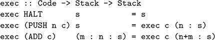
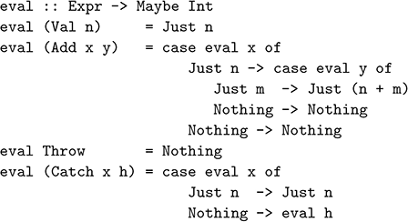

## **17**

## Calculating compilers

In this final chapter we show how the reasoning techniques introduced in the previous chapter can be used to calculate compilers. We start by showing how a semantics for a language can be transformed into a compiler in a series of steps, and then show how the steps can be combined to allow a compiler to be calculated directly from a statement of its correctness.

### **17.1Introduction**

The ability to calculate compilers has been a key objective in the field of program transformation since its earliest days. Starting from a high-level semantics for a source language, the aim is to transform the semantics into a compiler that translates source programs into a lower-level target language, together with a virtual machine that executes the resulting target programs.

There are two main advantages of such an approach. Firstly, the compiler, target language and virtual machine are *systematically derived* during the transformation process, rather than having to be manually defined by the user. And secondly, the resulting compiler and virtual machine do not usually require subsequent proofs of correctness, as they are *correct by construction*.

In chapter 16 we presented a compiler for arithmetic expressions, and proved its correctness. In this chapter we show how the compiler can be calculated directly from a statement of its correctness. We develop our approach in two stages, first introducing the basic ideas using a series of transformation steps, and then showing how the separate steps can be combined into a single step. For simplicity, we restrict our attention to arithmetic expressions, but the same techniques can also be used to calculate compilers for more sophisticated languages.

### **17.2Syntax and semantics**

We start in the same manner as the compiler correctness example from the previous chapter, with two definitions that respectively capture the syntax (form) and semantics (meaning) of a simple language of arithmetic expressions built up from integer values using an addition operator:

data Expr = Val Int \| Add Expr Expr  
  

eval :: Expr -\> Int

eval (Val n) = n

eval (Add x y) = eval x + eval y

For example, the expression 1 + 2 can be evaluated as follows:

eval (Add (Val 1) (Val 2))

={ applying eval }

eval (Val 1) + eval (Val 2)

={ applying the first eval }

1 + eval (Val 2)

={ applying eval }

1 + 2

={ applying + }

3

We now show how to calculate a compiler based on this semantics using a series of three transformation steps. The first two steps generalise the evaluation function, and the final step simplifies the resulting definitions.

### **17.3Adding a stack**

The first step is to transform the evaluation function eval into a version that utilises a stack, in order to make the manipulation of argument values explicit. In particular, rather than returning a single value of type Int, we seek to define a more general evaluation function, eval’, that takes a stack of integers as an additional argument, and returns a modified stack given by pushing the value of the expression onto the top of the stack. More precisely, if we represent a stack as a list of integers (where the head is the top element)

type Stack = \[Int\]

then we seek to define a function

eval’ :: Expr -\> Stack -\> Stack

with the following property:

eval’ e s = eval e : s

Rather than first defining eval’ and then proving by induction on the expression e that it satisfies the above equation, we use the technique introduced in the previous chapter and calculate a definition for eval’ that satisfies this equation, using the desire to apply the induction hypotheses as the driving force for the calculation process. In the base case, Val n, the calculation is easy:

eval’ (Val n) s

={ specification of eval’ }

eval (Val n) : s

={ applying eval }

n : s

={ define: push n s = n : s }

push n s

Note that in the final step we defined an auxiliary function, push, that captures the idea of pushing a number onto the stack. With the above calculation, we have discovered the definition of eval’ for expressions of the form Val n:

eval’ (Val n) s = push n s

In the inductive case, Add x y, we proceed as follows:

eval’ (Add x y) s

={ specification of eval’ }

eval (Add x y) : s

={ applying eval }

(eval x + eval y) : s

Now we appear to be stuck, as no further definitions can be applied. However, as we are performing an inductive calculation, we can make use of the induction hypotheses for the two argument expressions x and y, namely:

eval’ x s’ = eval x : s’  
  

eval’ y s’ = eval y : s’

In order to use these hypotheses, it is clear that we must push the values eval x and eval y onto the stack, which can readily be achieved by introducing another auxiliary function, add, that captures the idea of adding the top two numbers on the stack. The remainder of the calculation is then straightforward:

(eval x + eval y) : s

={ define: add (m : n : s) = n+m : s }

add (eval y : eval x : s)

={ induction hypothesis for x }

add (eval y : eval’ x s)

={ induction hypothesis for y }

add (eval’ y (eval’ x s))

□

Note that pushing eval x onto the stack before eval y above corresponds to addition evaluating its arguments from left-to-right. It would be perfectly valid to push the values in the opposite order, which would correspond to right-to-left evaluation. In conclusion, we have calculated the following definition

eval’ :: Expr -\> Stack -\> Stack

eval’ (Val n) s = push n s

eval’ (Add x y) s = add (eval’ y (eval’ x s))

where:

push :: Int -\> Stack -\> Stack

push n s = n : s  
  

add :: Stack -\> Stack

add (m : n : s) = n+m : s

Finally, our original evaluation function eval can now be recovered from our new function by substituting the empty stack s = \[\] into the equation eval’ e s = eval e : s from which eval’ was constructed, and selecting the unique value in the resulting singleton stack using the function head:

eval :: Expr -\> Int

eval e = head (eval’ e \[\])

For example, using this new definition evaluation of 1+2 now proceeds by pushing the two values onto the stack prior adding them together:

eval (Add (Val 1) (Val 2))

={ applying eval }

head (eval’ (Add (Val 1) (Val 2)) \[\])

={ applying eval’ }

head (add (eval’ (Val 2) (eval’ (Val 1) \[\])))

={ applying the inner eval’ }

head (add (eval’ (Val 2) (push 1 \[\])))

={ applying eval’ }

head (add (push 2 (push 1 \[\])))

={ applying push }

head (add (2 : 1 : \[\]))

={ applying add }

head (3 : \[\])

={ applying head }

3

### **17.4Adding a continuation**

The next step is to transform the stack-based evaluation function eval’ into *continuation-passing style*, in order to make the flow of control explicit. In particular, we seek to define a more general evaluation function, eval’’, that takes a function from stacks to stacks (the continuation) as an additional argument, which is used to process the stack that results from evaluating the expression. More precisely, if we define a type for continuations

type Cont = Stack -\> Stack

then we seek to define a function

eval’’ :: Expr -\> Cont -\> Cont

such that:

eval’’ e c s = c (eval’ e s)

We calculate the definition for eval’’ directly from this equation by induction on the expression e. The base case is once again easy,

eval’’ (Val n) c s

={ specification of eval’’ }

c (eval’ (Val n) s)

={ applying eval’ }

c (push n s)

while for the inductive case we calculate as follows:

eval’’ (Add x y) c s

={ specification of eval’’ }

c (eval’ (Add x y) s)

={ applying eval’ }

c (add (eval’ y (eval’ x s)))

={ unapplying . }

(c . add) (eval’ y (eval’ x s))

={ induction hypothesis for y }

eval’’ y (c . add) (eval’ x s)

={ induction hypothesis for x }

eval’’ x (eval’’ y (c . add)) s

□

In conclusion, we have calculated the following definition:

eval’’ :: Expr -\> Cont -\> Cont

eval’’ (Val n) c s = c (push n s)

eval’’ (Add x y) c s = eval’’ x (eval’’ y (c . add)) s

Our previous evaluation function eval’ can now be recovered by substituting the identity continuation c = id into the equation eval’’ e c s = c (eval’ e s) from which the function eval’’ was constructed:

eval’ :: Expr -\> Cont

eval’ e s = eval’’ e id s

For example, evaluation of 1 + 2 now proceeds by transferring control to evaluation of the second argument once evaluation of the first has completed:

eval’ (Add (Val 1) (Val 2)) \[\]

={ applying eval’ }

eval’’ (Add (Val 1) (Val 2)) id \[\]

={ applying eval’’ }

eval’’ (Val 1) (eval’’ (Val 2) (id . add)) \[\]

={ applying the outer eval’’ }

eval’’ (Val 2) (id . add) (push 1 \[\])

={ applying eval’’ }

(id . add) (push 2 (push 1 \[\]))

={ applying . }

id (add (push 2 (push 1 \[\])))

={ applying push }

id (add (2 : 1 : \[\]))

={ applying add }

id \[3\]

={ applying id }

\[3\]

### **17.5Defunctionalising**

The third and final step is to transform the evaluation function back into first-order style, using *defunctionalisation*. In particular, rather than using functions of type Cont = Stack -\> Stack for continuations passed as arguments and returned as results, we define a new type that represents the specific forms of continuations that we actually need for our evaluation function.

Within the definitions for eval’ and eval’’, there are only three forms of continuations that are used, namely one to halt the evaluation process, one to push a number onto the top of the stack, and one to add the top two numbers on the stack. We begin by separating out these three forms, by giving them names and passing their variables as parameters. That is, we define three *combinators* for constructing the required forms of continuations:

haltC :: Cont

haltC = id  
  

pushC :: Int -\> Cont -\> Cont

pushC n c = c . push n  
  

addC :: Cont -\> Cont

addC c = c . add

Using these combinators, our evaluators can now be rewritten as follows:

eval’ :: Expr -\> Cont

eval’ e = eval’’ e haltC  
  

eval’’ :: Expr -\> Cont -\> Cont

eval’’ (Val n) c = pushC n c

eval’’ (Add x y) c = eval’’ x (eval’’ y (addC c))

It is easy to check by expanding definitions that these are equivalent to the previous versions. The next stage in applying defunctionalisation is to define a new type, Code, whose constructors represent the three combinators:

data Code = HALT \| PUSH Int Code \| ADD Code

deriving Show

The constructors of this type have the same types as the corresponding combinators, except that the new type Code now plays the role of Cont:

HALT :: Code

PUSH :: Int -\> Code -\> Code

ADD :: Code -\> Code

The name Code for the type reflects the fact that its values represent code for a virtual machine that evaluates expressions using a stack. For example, the code PUSH 1 (PUSH 2 (ADD HALT)) corresponds to the expression 1 + 2. The fact that values of type Code represent continuations of type Cont is formalised by defining a function that maps from one to the other:

exec :: Code -\> Cont

exec HALT = haltC

exec (PUSH n c) = pushC n (exec c)

exec (ADD c) = addC (exec c)

In turn, we then simplify the definition for exec by expanding out the definitions for the type Cont and its three combinators.

HALT case:

exec HALT s

={ applying exec }

haltC s

={ applying haltC }

id s

={ applying id }

s

PUSH case:

exec (PUSH n c) s

={ applying exec }

pushC n (exec c) s

={ applying pushC }

(exec c . push n) s

={ applying . }

exec c (push n s)

={ applying push }

exec c (n : s)

ADD case:

exec (ADD c) s

={ applying exec }

addC (exec c) s

={ applying addC }

(exec c . add) s

={ applying . }

exec c (add s)

={ assume s of the form m : n : s’ }

exec c (add (m : n : s’))

={ applying add }

exec c (n+m : s’)

□

In conclusion, we have calculated the following definition:

That is, exec is a function that executes code using an initial stack to give a final stack. In other words, exec is a virtual machine for executing code.

Finally, defunctionalisation itself now proceeds by simply replacing occurrences of the combinations haltC, pushC and addC in the evaluation functions eval’ and eval’’ by their respective counterparts HALT, PUSH and ADD from the type Code, which results in the following two new definitions:

comp :: Expr -\> Code

comp e = comp’ e HALT  
  

comp’ :: Expr -\> Code -\> Code

comp’ (Val n) c = PUSH n c

comp’ (Add x y) c = comp’ x (comp’ y (ADD c))

That is, we have now derived a function comp that compiles an expression to code, which is itself defined in terms of an auxiliary function comp’ that takes additional code as an extra argument. This is essentially the same compiler that we developed in the previous chapter, except that all the required compilation machinery — compiler, target language and virtual machine — has now been systematically derived from a semantics for the source language using equational reasoning. The only difference is that rather than representing code as a list, we now have a dedicated recursive type for code. For example, \[PUSH 1, PUSH 2, ADD\] is now written as PUSH 1 (PUSH 2 (ADD HALT)).

The correctness of the compilation functions comp and comp’ is captured by the following two equations, which are consequences of defunctionalisation, or can be verified by simple inductive proofs on the expression argument:

exec (comp e) s = eval’ e s  
  

exec (comp’ e c) s = eval’’ e (exec c) s

Expanding the right-hand sides of these equations using the original specifications for the functions eval’ and eval’’, we obtain the same compiler correctness equations that were used in the previous chapter:

exec (comp e) s = eval e : s  
  

exec (comp’ e c) s = exec c (eval e : s)

### **17.6Combining the steps**

We have now shown how an evaluation function for arithmetic expressions can be transformed into a compiler using a systematic three-step process:

1.calculate a generalised evaluation function that uses a stack;

2.calculate a further generalised version that uses a continuation;

3.defunctionalise to produce a compiler and a virtual machine.

However, there appear to be some opportunities for simplifying this process. In particular, steps 1 and 2 both calculate generalised versions of the original evaluation function. Could these steps be combined to avoid the need for separate generalisation steps? In turn, step 2 introduces the use of continuations, which are then immediately removed in step 3. Could these steps be combined the avoid the need for continuations? In fact, it turns out that *all* the transformation steps can be combined together. This section shows how this can be achieved, and explains the benefits that result from doing so.

In order to simplify the above stepwise process, let us first consider the types and functions that are involved in the process in more detail. We started off by defining a type Expr that represents the syntax of the source language, together with an evaluation function eval :: Expr -\> Int that provides a semantics for the language, and a type Stack that represents a stack of integer values. Then we derived four additional components:

- a type Code that represents code for the virtual machine;
- a function comp :: Expr -\> Code that compiles expressions to code;
- a function comp’ :: Expr -\> Code -\> Code with a code argument;
- a function exec :: Code -\> Stack -\> Stack that executes code.

Moreover, the relationships between the semantics, compilers and virtual machine were captured by the following two correctness equations:

exec (comp e) s = eval e : s  
  

exec (comp’ e c) s = exec c (eval e : s)

The key to combining the transformation steps is to use these two equations directly as a *specification* for the four additional components, from which we then aim to calculate definitions that satisfy the specification. Given that the equations involve three known definitions (Expr, eval and Stack) and four unknown definitions (Code, comp, comp’ and exec), this may seem like an impossible task. However, with the benefit of the experience gained from our earlier calculations in the previous sections, it turns out to be straightforward.

We begin with the correctness equation for comp’, and proceed by induction on the expression e. In each case, we aim to rewrite the left-hand side exec (comp’ e c) s of the equation into the form exec c’ s for some code c’, from which we can then conclude that the definition comp’ e c = c’ satisfies the specification in this case. In order to do this we will find that we need to introduce new constructors into the Code type, along with their interpretation by the function exec. In the base case, Val n, we proceed as follows:

exec (comp’ (Val n) c) s

={ specification of comp’ }

exec c (eval (Val n) : s)

={ applying eval }

exec c (n : s)

Now we appear to be stuck, as no further definitions can be applied. However, recall that we are aiming to end up with a term of the form exec c’ s for some code c’. Hence, to complete the calculation we need to solve the equation:

exec c’ s = exec c (n : s)

Note that we can’t simply use this equation as a definition for exec, because the variables n and c would be unbound in the body of the definition. The solution is to package these two variables up in the code argument c’ by means of a new constructor in the Code type that takes these variables as arguments,

PUSH :: Int -\> Code -\> Code

and define a new equation for exec as follows:

exec (PUSH n c) s = exec c (n : s)

That is, executing the code PUSH n c proceeds by pushing the value n onto the stack and then executing the code c, hence the choice of the name for the new constructor. Using these ideas, it is now easy to complete the calculation:

exec c (n : s)

={ unapplying exec }

exec (PUSH n c) s

The final term now has the form exec c’ s, where c’ = PUSH n c, from which we conclude that the specification is satisfied in the base case by defining:

comp’ (Val n) c = PUSH n c

For the inductive case, Add x y, we begin in the same way as above by first applying the specification and the definition of the evaluation function:

exec (comp’ (Add x y) c) s

={ specification of comp’ }

exec c (eval (Add x y) : s)

={ applying eval }

exec c (eval x + eval y : s)

Once again we appear to be stuck, as no further definitions can be applied. However, as we are performing an inductive calculation, we can make use of the induction hypotheses for the two argument expressions x and y, namely

exec (comp’ x c’) s’ = exec c’ (eval x : s’)  
  

exec (comp’ y c’) s’ = exec c’ (eval y : s’)

In order to use these hypotheses, it is clear that we must push the values eval x and eval y onto the stack, by transforming the term that we are manipulating into the form exec c’ (eval y : eval x : s) for some code c’. That is, we need to solve the following equation:

exec c’ (eval y : eval x : s) = exec c (eval x + eval y : s)

First of all, we generalise from specific values eval x and eval y to give:

exec c’ (m : n : s) = exec c (n+m : s)

Once again, however, we can’t use this equation as a definition for exec, this time because the variable c is unbound. The solution is to package this variable up in the code argument c’ by means of a new constructor in the Code type

ADD :: Code -\> Code

and define a new equation for exec as follows:

exec (ADD c) (m : n : s) = exec c (n+m : s)

That is, executing the code ADD c proceeds by adding the top two values on the stack and then executing the code c, hence the choice of the name for the new constructor. Using these ideas, it is now easy to complete the calculation:

exec c (eval x + eval y : s)

={ unapplying exec }

exec (ADD c) (eval y : eval x : s)

={ induction hypothesis for y }

exec (comp’ y (ADD c)) (eval x : s)

={ induction hypothesis for x }

exec (comp’ x (comp’ y (ADD c))) s

The final term now has the form exec c’ s, from which we conclude that the specification is satisfied in the inductive case by defining:

comp’ (Add x y) c = comp’ x (comp’ y (ADD c))

□

Note that as in our earlier calculation of the stack-based evaluator, we chose to transform the stack into the form eval y : eval x : s. We could equally well have chosen the opposite order, eval x : eval y : s, which would have resulted in right-to-left evaluation for Add. We have this freedom in the calculation because the semantics defined by eval does not specify an evaluation order.

Finally, we complete the development of our compiler by considering the function comp :: Expr -\> Code specified by the equation exec (comp e) s = eval e : s. In a similar manner to above, we aim to rewrite the left-hand side exec (comp e) s of the equation into the form exec c s for some code c, from which we can then conclude that the definition comp e = c satisfies the specification. In this case there is no need to use induction as simple calculation suffices, during which we introduce a new constructor HALT :: Code in order to transform the term being manipulated into the required form:

exec (comp e) s

={ specification of comp }

eval e : s

={ define: exec HALT s = s }

exec HALT (eval e : s)

={ specification of comp’ }

exec (comp’ e HALT) s

□

In conclusion, we have calculated the following definitions:

data Code = HALT \| PUSH Int Code \| ADD Code

comp :: Expr -\> Code

comp e = comp’ e HALT  
  

comp’ :: Expr -\> Code -\> Code

comp’ (Val n) c = PUSH n c

comp’ (Add x y) c = comp’ x (comp’ y (ADD c))  
  

exec :: Code -\> Stack -\> Stack

exec HALT s = s

exec (PUSH n c) s = exec c (n : s)

exec (ADD c) (m : n : s) = exec c (n+m : s)

These are precisely the same definitions as we produced in the previous section, except that they have now been calculated directly from a specification of compiler correctness, rather than indirectly by means of a series of separate transformation steps. Moreover, the combined approach also has the advantage that it only uses simple equational reasoning techniques. In particular, the use of continuations and defunctionalisation is no longer required!

### **17.7Chapter remarks**

Further details about calculating compilers can be found in \[39\], upon which this chapter is based. This article shows how the same approach can be used to calculate compilers for a wide range of programming language features and their combination, including arithmetic expressions, exceptions, state and various forms of lambda calculi. A similar approach can also be used to calculate abstract machines \[40\], such as the example from chapter 8.

### **17.8Exercises**

1.Suppose that we extend the language of arithmetic expressions with simple primitives for throwing and catching an *exception*, as follows:

data Expr = Val Int

\| Add Expr Expr

\| Throw

\| Catch Expr Expr

Informally, Catch x h behaves as the expression x unless evaluation of x throws an exception, in which case the catch behaves as the handler expression h. An exception is thrown if evaluation of Throw is attempted. To define a semantics for this extended language, we first recall the Maybe type:

data Maybe a = Nothing \| Just a

That is, a value of type Maybe a is either Nothing, which we view here as an exceptional value, or has the form Just x, which we view as a normal value. Using this type, our original evaluation function for expressions can be rewritten to take account of exceptions as follows:

Using the approach described in this chapter, calculate a compiler for this language. Hint: this is a challenging exercise!

A solution to exercise 1 is given in appendix A.