## Appendix A

## Selected solutions

In this appendix we present model solutions to selected exercises for each chapter. If solutions are being tested out using GHCi, note that some functions may need to be renamed to avoid clashing with built-in functions from the standard prelude. For example, product could be renamed to myproduct.

### **A.1Introduction**

##### Exercise 1

``` haskell
double (double 2)
={ applying the inner double }
double (2 + 2)
={ applying double }
(2 + 2) + (2 + 2)
={ applying the first + }
4 + (2 + 2)
={ applying the second + }
4 + 4
={ applying + }
8
```

or

``` haskell
double (double 2)
={ applying the outer double }
(double 2) + (double 2)
={ applying the second double }
(double 2) + (2 + 2)
={ applying the second + }
(double 2) + 4
={ applying double }
(2 + 2) + 4
={ applying the first + }
4 + 4
={ applying + }
8
```

There are a number of other possible answers.

##### Exercise 2

``` haskell
sum [x]
={ applying sum }
x + sum []
={ applying sum }
x + 0
={ applying + }
x
```

##### Exercise 3

``` haskell
product [] = 1
product (n:ns) = n * product ns
```

For example:

``` haskell
product [2,3,4]
={ applying product }
2 * (product [3,4])
={ applying product }
2 * (3 * product [4])
={ applying product }
2 * (3 * (4 * product []))
={ applying product }
2 * (3 * (4 * 1))
={ applying * }
24
```

### **A.2First steps**

##### Exercise 2

``` haskell
(2^3)*4
(2*3)+(4*5)
2+(3*(4^5))
```

##### Exercise 3

``` haskell
n = a ‘div‘ length xs
where
a = 10
xs = [1,2,3,4,5]
```

##### Exercise 4

``` haskell
last xs = head (reverse xs)
```

or

``` haskell
last xs = xs !! (length xs - 1)
```

### **A.3Types and classes**

##### Exercise 1

``` haskell
[’a’,’b’,’c’] :: [Char]
(’a’,’b’,’c’) :: (Char,Char,Char)
[(False,’O’),(True,’1’)] :: [(Bool,Char)]
([False,True],[’0’,’1’]) :: ([Bool],[Char])
[tail, init, reverse] :: [[a] -> [a]]
```

##### Exercise 2

``` haskell
bools = [False,True]
nums = [[1,2],[3,4],[5,6]]
add x y z = x+y+z
copy x = (x,x)
apply f x = f x
```

There are a number of other possible answers for bools, nums and add.

### **A.4Defining functions**

##### Exercise 1

``` haskell
halve xs = (take n xs, drop n xs)
where n = length xs ‘div‘ 2
```

or

``` haskell
halve xs = splitAt (length xs ‘div‘ 2) xs
```

##### Exercise 2

``` haskell
third xs = head (tail (tail xs))
third xs = xs !! 2
third (_:_:x:_) = x
```

##### Exercise 3

``` haskell
safetail xs = if null xs then [] else tail xs
```

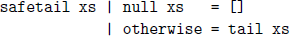

``` haskell
safetail [] = []
safetail (_:xs) = xs
```

##### Exercise 4

``` haskell
False || False = False
False || True = True
True || False = True
True || True = True
False || False = False
_ || _ = True
False || b = b
True || _ = True
```

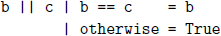

### **A.5List comprehensions**

##### Exercise 1

``` haskell
sum [x^2 | x <- [1..100]]
```

##### Exercise 2

``` haskell
grid m n = [(x,y) | x <- [0..m], y <- [0..n]]
```

##### Exercise 3

``` haskell
square n = [(x,y) | (x,y) <- grid n n, x /= y]
```

##### Exercise 4

``` haskell
replicate n x = [x | _ <- [1..n]]
```

##### Exercise 5

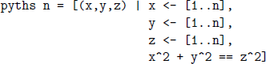

### **A.6Recursive functions**

##### Exercise 1

The function does not terminate, because each application of fac decreases the argument by one, and hence the base case is never reached.

``` haskell
fac 0 = 1
fac n | n > 0 = n * fac (n-1)
```

##### Exercise 2

``` haskell
sumdown 0 = 0
sumdown n = n + sumdown (n-1)
```

##### Exercise 3

``` haskell
(^) :: Int -> Int -> Int
m ^ 0 = 1
m ^ n = m * (m ^ (n-1))
```

For example:

``` haskell
2 ^ 3
={ applying ^ }
2 * (2 ^ 2)
={ applying ^ }
2 * (2 * (2 ^ 1))
={ applying ^ }
2 * (2 * (2 * (2 ^ 0)))
={ applying ^ }
2 * (2 * (2 * 1))
={ applying * }
8
```

##### Exercise 4

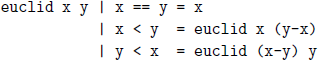

### **A.7Higher-order functions**

##### Exercise 1

``` haskell
map f (filter p xs)
```

##### Exercise 2

``` haskell
all p = and . map p
any p = or . map p
```

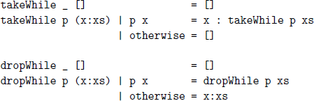

##### Exercise 3

``` haskell
map f = foldr (\x xs -> f x : xs) []
filter p = foldr (\x xs -> if p x then x:xs else xs) []
```

##### Exercise 4

``` haskell
dec2int = foldl (\x y -> 10*x + y) 0
```

##### Exercise 5

``` haskell
curry :: ((a,b) -> c) -> (a -> b -> c)
curry f = \x y -> f (x,y)
uncurry :: (a -> b -> c) -> ((a,b) -> c)
uncurry f = \(x,y) -> f x y
```

### **A.8Declaring types and classes**

##### Exercise 1

``` haskell
mult m Zero = Zero
mult m (Succ n) = add m (mult m n)
```

##### Exercise 2

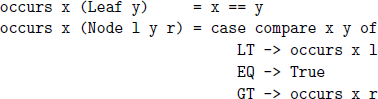

This version is more efficient because it only requires one comparison between x and y for each node, whereas the previous version may require two.

##### Exercise 3

``` haskell
leaves (Leaf _) = 1
leaves (Node l r) = leaves l + leaves r
```

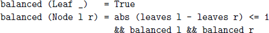

##### Exercise 4

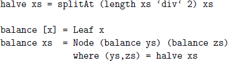

### **A.9The countdown problem**

##### Exercise 1

``` haskell
choices xs = [zs | ys <- subs xs, zs <- perms ys]
```

##### Exercise 2

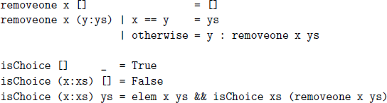

##### Exercise 3

It would lead to non-termination, because recursive calls to exprs would no longer be guaranteed to reduce the length of the list.

### **A.10Interactive programming**

##### Exercise 1

``` haskell
putStr xs = sequence_ [putChar x | x <- xs]
```

##### Exercise 2

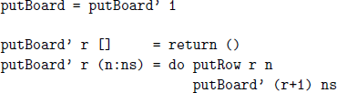

##### Exercise 3

``` haskell
putBoard b = sequence_ [putRow r n | (r,n) <- zip [1..] b]
```

### **A.11Unbeatable tic-tac-toe**

##### Exercise 1

Using the definitions

``` haskell
nodes :: Tree a -> Int
nodes (Node _ ts) = 1 + sum (map nodes ts)
mydepth :: Tree a -> Int
mydepth (Node _ []) = 0
mydepth (Node _ ts) = 1 + maximum (map mydepth ts)
```

we have:

``` haskell
> let tree = gametree empty O
> nodes tree
549946
> mydepth tree
9
```

##### Exercise 2

``` haskell
import System.Random hiding (next)
```

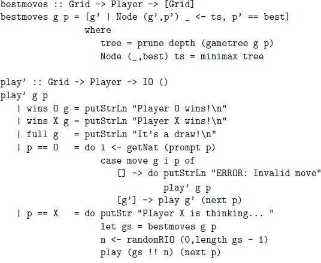

Note that the function next from the imported library is hidden to avoid clashing with our next function on player values.

### **A.12Monads and more**

##### Exercise 1

``` haskell
instance Functor Tree where
-- fmap :: (a -> b) -> Tree a -> Tree b
fmap g Leaf = Leaf
fmap g (Node l x r) = Node (fmap g l) (g x) (fmap g r)
```

##### Exercise 2

``` haskell
instance Functor ((->) a) where
-- fmap :: (b -> c) -> (a -> b) -> (a -> c)
fmap = (.)
```

##### Exercise 3

``` haskell
instance Applicative ((->) a) where
-- pure :: b -> (a -> b)
pure = const
-- (<*>) :: (a -> b -> c) -> (a -> b) -> (a -> c)
g <*> h = \x -> g x (h x)
```

##### Exercise 4

``` haskell
instance Functor ZipList where
-- fmap :: (a -> b) -> ZipList a -> ZipList b
fmap g (Z xs) = Z (fmap g xs)
instance Applicative ZipList where
-- pure :: a -> ZipList a
pure x = Z (repeat x)
-- <*> :: ZipList (a -> b) -> ZipList a -> ZipList b
(Z gs) <*> (Z xs) = Z [g x | (g,x) <- zip gs xs]
```

### **A.13Monadic parsing**

##### Exercise 1

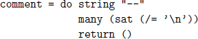

##### Exercise 2

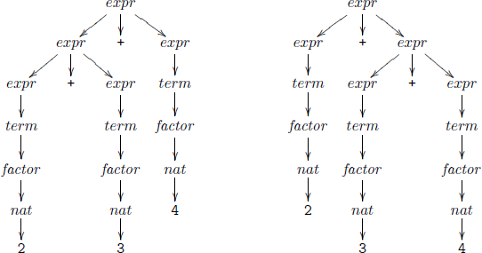

##### Exercise 3

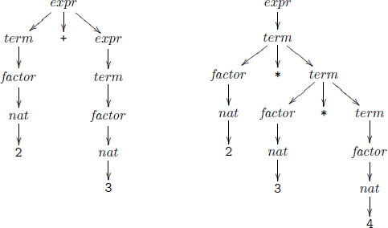

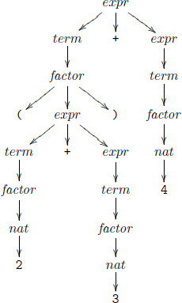

##### Exercise 4

Without left-factorising, the resulting parser would backtrack excessively and take exponential time in the size of the expression. For example, a number would be parsed four times before being recognised as an expression.

### **A.14Foldables and friends**

##### Exercise 1

``` haskell
instance (Monoid a, Monoid b) => Monoid (a,b) where
-- mempty :: (a,b)
mempty = (mempty, mempty)
-- mappend :: (a,b) -> (a,b) -> (a,b)
(x1,y1) ‘mappend‘ (x2,y2) =
(x1 ‘mappend‘ x2, y1 ‘mappend‘ y2)
```

##### Exercise 2

``` haskell
instance Monoid b => Monoid (a -> b) where
-- mempty :: a -> b
mempty = \_ -> mempty
-- mappend :: (a -> b) -> (a -> b) -> (a -> b)
f ‘mappend‘ g = \x -> f x ‘mappend‘ g x
```

### **A.15Lazy evaluation**

##### Exercise 1

The only redex in 1+(2\*3) is 2\*3, which is both innermost and outermost.

The redexes in (1+2)\*(2+3) are 1+2 and 2+3, with the first being innermost.

The redexes in fst (1+2,2+3) are 1+2, 2+3 and fst (1+2,2+3), with the first of these being innermost and the last being outermost.

The redexes in (\x -\> 1 + x) (2\*3) are 2\*3 and (\x -\> 1 + x) (2\*3), with the first being innermost and the second being outermost.

##### Exercise 2

Outermost:

``` haskell
fst (1+2, 2+3)
={ applying fst }
1+2
={ applying + }
3
```

Innermost:

``` haskell
fst (1+2, 2+3)
={ applying the first + }
fst (3, 2+3)
={ applying + }
fst (3, 5)
={ applying fst }
3
```

Outermost evaluation is preferable because it avoids evaluation of the second argument, and hence takes one fewer reduction steps.

##### Exercise 3

``` haskell
mult 3 4
={ applying mult }
(\x -> (\y -> x * y)) 3 4
={ applying the outer lambda }
(\y -> 3 * y) 4
={ applying the lambda }
3 * 4
={ applying * }
12
```

### **A.16Reasoning about programs**

##### Exercise 1

Base case:

``` haskell
add Zero (Succ m)
={ applying add }
Succ m
={ unapplying add }
Succ (add Zero m)
```

Inductive case:

``` haskell
add (Succ n) (Succ m)
={ applying add }
Succ (add n (Succ m))
={ induction hypothesis }
Succ (Succ (add n m))
={ unapplying add }
Succ (add (Succ n) m)
```

##### Exercise 2

Base case:

``` haskell
add Zero m
={ applying add }
m
={ property of add }
add m Zero
```

Inductive case:

``` haskell
add (Succ n) m
={ applying add }
Succ (add n m)
={ induction hypothesis }
Succ (add m n)
={ property of add }
add m (Succ n)
```

##### Exercise 3

Base case:

``` haskell
all (== x) (replicate 0 x)
={ applying replicate }
all (== x) []
={ applying all }
True
```

Inductive case:

``` haskell
all (== x) (replicate (n+1) x)
={ applying replicate }
all (== x) (x : replicate n x)
={ applying all }
x == x && all (== x) (replicate n x)
={ applying == }
True && all (== x) (replicate n x)
={ applying && }
all (== x) (replicate n x)
={ induction hypothesis }
True
```

##### Exercise 4

Base case:

``` haskell
[] ++ []
={ applying ++ }
[]
```

Inductive case:

``` haskell
(x : xs) ++ []
={ applying ++ }
x : (xs ++ [])
={ induction hypothesis }
x : xs
```

Base case:

``` haskell
[] ++ (ys ++ zs)
={ applying ++ }
ys ++ zs
={ unapplying ++ }
([] ++ ys) ++ zs
```

Inductive case:

``` haskell
(x : xs) ++ (ys ++ zs)
={ applying ++ }
x : (xs ++ (ys ++ zs))
={ induction hypothesis }
x : ((xs ++ ys) ++ zs)
={ unapplying ++ }
(x : (xs ++ ys)) ++ zs
={ unapplying ++ }
((x : xs) ++ ys) ++ zs
```

##### Exercise 5

Base case:

``` haskell
take 0 xs ++ drop 0 xs
={ applying take, drop }
[] ++ xs
={ applying ++ }
xs
```

Base case:

``` haskell
take (n+1) [] ++ drop (n+1) []
={ applying take, drop }
[] ++ []
={ applying ++ }
[]
```

Inductive case:

``` haskell
take (n+1) (x:xs) ++ drop (n+1) (x:xs)
={ applying take, drop }
(x : take n xs) ++ (drop n xs)
={ applying ++ }
x : (take n xs ++ drop n xs)
={ induction hypothesis }
x : xs
```

### **A.17Calculating compilers**

##### Exercise 1

A solution is given in \[39\], on which this chapter is based.