## Appendix B

## Standard prelude

In this appendix we present some of the most commonly used definitions from the Haskell standard prelude. For expository purposes, a number of the definitions are presented in simplified form. The full version of the prelude is available from the Haskell home page, [http://www.haskell.org](http://www.haskell.org).

### **B.1Basic classes**

Equality types:

``` haskell
class Eq a where
(==), (/=) :: a -> a -> Bool
x /= y = not (x == y)
```

Ordered types:

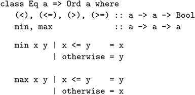

Showable types:

``` haskell
class Show a where
show :: a -> String
```

Readable types:

``` haskell
class Read a where
read :: String -> a
```

Numeric types:

``` haskell
class Num a where
(+), (-), (*) :: a -> a -> a
negate, abs, signum :: a -> a
```

Integral types:

``` haskell
class Num a => Integral a where
div, mod :: a -> a -> a
```

Fractional types:

``` haskell
class Num a => Fractional a where
(/) :: a -> a -> a
recip :: a -> a
recip n = 1/n
```

### **B.2Booleans**

Type declaration:

``` haskell
data Bool = False | True
deriving (Eq, Ord, Show, Read)
```

Logical conjunction:

``` haskell
(&&) :: Bool -> Bool -> Bool
False && _ = False
True && b = b
```

Logical disjunction:

``` haskell
(||) :: Bool -> Bool -> Bool
False || b = b
True || _ = True
```

Logical negation:

``` haskell
not :: Bool -> Bool
not False = True
not True = False
```

Guard that always succeeds:

``` haskell
otherwise :: Bool
otherwise = True
```

### **B.3Characters**

Type declaration:

``` haskell
data Char = ...
deriving (Eq, Ord, Show, Read)
```

The definitions below are provided in the library Data.Char, which can be loaded by entering the following in GHCi or at the start of a script:

``` haskell
import Data.Char
```

Decide if a character is a lower-case letter:

``` haskell
isLower :: Char -> Bool
isLower c = c >= ’a’ && c <= ’z’
```

Decide if a character is an upper-case letter:

``` haskell
isUpper :: Char -> Bool
isUpper c = c >= ’A’ && c <= ’Z’
```

Decide if a character is alphabetic:

``` haskell
isAlpha :: Char -> Bool
isAlpha c = isLower c || isUpper c
```

Decide if a character is a digit:

``` haskell
isDigit :: Char -> Bool
isDigit c = c >= ’0’ && c <= ’9’
```

Decide if a character is alpha-numeric:

``` haskell
isAlphaNum :: Char -> Bool
isAlphaNum c = isAlpha c || isDigit c
```

Decide if a character is spacing:

``` haskell
isSpace :: Char -> Bool
isSpace c = elem c " \t\n"
```

Convert a character to a Unicode number:

``` haskell
ord :: Char -> Int
ord c = ...
```

Convert a Unicode number to a character:

``` haskell
chr :: Int -> Char
chr n = ...
```

Convert a digit to an integer:

``` haskell
digitToInt :: Char -> Int
digitToInt c | isDigit c = ord c - ord ’0’
```

Convert an integer to a digit:

``` haskell
intToDigit :: Int -> Char
intToDigit n | n >= 0 && n <= 9 = chr (ord ’0’ + n)
```

Convert a letter to lower-case:

``` haskell
toLower :: Char -> Char
toLower c | isUpper c = chr (ord c - ord ’A’ + ord ’a’)
| otherwise = c
```

Convert a letter to upper-case:

``` haskell
toUpper :: Char -> Char
toUpper c | isLower c = chr (ord c - ord ’a’ + ord ’A’)
| otherwise = c
```

### **B.4Strings**

Type declaration:

``` haskell
type String = [Char]
```

### **B.5Numbers**

Type declarations:

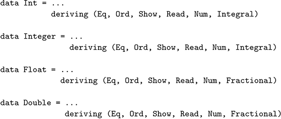

Decide if an integer is even:

``` haskell
even :: Integral a => a -> Bool
even n = n ‘mod‘ 2 == 0
```

Decide if an integer is odd:

``` haskell
odd :: Integral a => a -> Bool
odd = not . even
```

Exponentiation:

``` haskell
(^) :: (Num a, Integral b) => a -> b -> a
_ ^ 0 = 1
x ^ n = x * (x ^ (n-1))
```

### **B.6Tuples**

Type declarations:

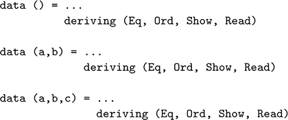

Select the first component of a pair:

``` haskell
fst :: (a,b) -> a
fst (x,_) = x
```

Select the second component of a pair:

``` haskell
snd :: (a,b) -> b
snd (_,y) = y
```

Convert a function on pairs to a curried function:

``` haskell
curry :: ((a,b) -> c) -> (a -> b -> c)
curry f = \x y -> f (x,y)
```

Convert a curried function to a function on pairs:

``` haskell
uncurry :: (a -> b -> c) -> ((a,b) -> c)
uncurry f = \(x,y) -> f x y
```

### **B.7Maybe**

Type declaration:

``` haskell
data Maybe a = Nothing | Just a
deriving (Eq, Ord, Show, Read)
```

### **B.8Lists**

Type declaration:

``` haskell
data [a] = [] | a:[a]
deriving (Eq, Ord, Show, Read)
```

Select the first element of a non-empty list:

``` haskell
head :: [a] -> a
head (x:_) = x
```

Select the last element of a non-empty list:

``` haskell
last :: [a] -> a
last [x] = x
last (_:xs) = last xs
```

Select the *n*th element of a non-empty list:

``` haskell
(!!) :: [a] -> Int -> a
(x:_) !! 0 = x
(_:xs) !! n = xs !! (n-1)
```

Select the first *n* elements of a list:

``` haskell
take :: Int -> [a] -> [a]
take 0 _ = []
take _ [] = []
take n (x:xs) = x : take (n-1) xs
```

Select all elements of a list that satisfy a predicate:

``` haskell
filter :: (a -> Bool) -> [a] -> [a]
filter p xs = [x | x <- xs, p x]
```

Select elements of a list while they satisfy a predicate:

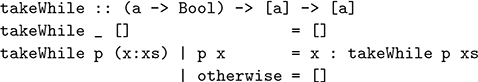

Remove the first element from a non-empty list:

``` haskell
tail :: [a] -> [a]
tail (_:xs) = xs
```

Remove the last element from a non-empty list:

``` haskell
init :: [a] -> [a]
init [_] = []
init (x:xs) = x : init xs
```

Remove the first *n* elements from a list:

``` haskell
drop :: Int -> [a] -> [a]
drop 0 xs = xs
drop _ [] = []
drop n (_:xs) = drop (n-1) xs
```

Remove elements from a list while they satisfy a predicate:

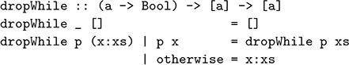

Split a list at the *n*th element:

``` haskell
splitAt :: Int -> [a] -> ([a],[a])
splitAt n xs = (take n xs, drop n xs)
```

Produce an infinite list of identical elements:

``` haskell
repeat :: a -> [a]
repeat x = xs where xs = x:xs
```

Produce a list with *n* identical elements:

``` haskell
replicate :: Int -> a -> [a]
replicate n = take n . repeat
```

Produce an infinite list by iterating a function over a value:

``` haskell
iterate :: (a -> a) -> a -> [a]
iterate f x = x : iterate f (f x)
```

Produce a list of pairs from a pair of lists:

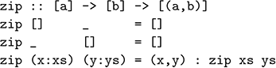

Append two lists:

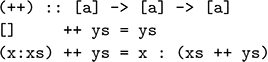

Reverse a list:

``` haskell
reverse :: [a] -> [a]
reverse = foldl (\xs x -> x:xs) []
```

Apply a function to all elements of a list:

``` haskell
map :: (a -> b) -> [a] -> [b]
map f xs = [f x | x <- xs]
```

### **B.9Functions**

Type declaration:

``` haskell
data a -> b = ...
```

Identity function:

``` haskell
id :: a -> a
id = \x -> x
```

Function composition:

``` haskell
(.) :: (b -> c) -> (a -> b) -> (a -> c)
f . g = \x -> f (g x)
```

Constant functions:

``` haskell
const :: a -> (b -> a)
const x = \_ -> x
```

Strict application:

``` haskell
($!) :: (a -> b) -> a -> b
f $! x = ...
```

Flip the arguments of a curried function:

``` haskell
flip :: (a -> b -> c) -> (b -> a -> c)
flip f = \y x -> f x y
```

### **B.10Input/output**

Type declaration:

``` haskell
data IO a = ...
```

Read a character from the keyboard:

``` haskell
getChar :: IO Char
getChar = ...
```

Read a string from the keyboard:

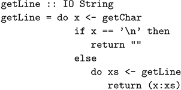

Read a value from the keyboard:

``` haskell
readLn :: Read a => IO a
readLn = do xs <- getLine
return (read xs)
```

Write a character to the screen:

``` haskell
putChar :: Char -> IO ()
putChar c = ...
```

Write a string to the screen:

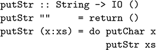

Write a string to the screen and move to a new line:

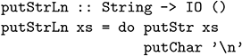

Write a value to the screen:

``` haskell
print :: Show a => a -> IO ()
print = putStrLn . show
```

Display an error message and terminate the program:

``` haskell
error :: String -> a
error xs = ...
```

### **B.11Functors**

Class declaration:

``` haskell
class Functor f where
fmap :: (a -> b) -> f a -> f b
```

Maybe functor:

``` haskell
instance Functor Maybe where
-- fmap :: (a -> b) -> Maybe a -> Maybe b
fmap _ Nothing = Nothing
fmap g (Just x) = Just (g x)
```

List functor:

``` haskell
instance Functor [] where
-- fmap :: (a -> b) -> [a] -> [b]
fmap = map
```

IO functor:

``` haskell
instance Functor IO where
-- fmap :: (a -> b) -> IO a -> IO b
fmap g mx = do {x <- mx; return (g x)}
```

Infix version of fmap:

``` haskell
(<$>) :: Functor f => (a -> b) -> f a -> f b
g <$> x = fmap g x
```

### **B.12Applicatives**

Class declaration:

``` haskell
class Functor f => Applicative f where
pure :: a -> f a
(<*>) :: f (a -> b) -> f a -> f b
```

Maybe applicative:

``` haskell
instance Applicative Maybe where
-- pure :: a -> Maybe a
pure = Just
-- (<*>) :: Maybe (a -> b) -> Maybe a -> Maybe b
Nothing <*> _ = Nothing
(Just g) <*> mx = fmap g mx
```

List applicative:

``` haskell
instance Applicative [] where
-- pure :: a -> [a]
pure x = [x]
-- (<*>) :: [a -> b] -> [a] -> [b]
gs <*> xs = [g x | g <- gs, x <- xs]
```

IO applicative:

``` haskell
instance Applicative IO where
-- pure :: a -> IO a
pure = return
-- (<*>) :: IO (a -> b) -> IO a -> IO b
mg <*> mx = do {g <- mg; x <- mx; return (g x)}
```

### **B.13Monads**

Class declaration:

``` haskell
class Applicative m => Monad m where
return :: a -> m a
(>>=) :: m a -> (a -> m b) -> m b
return = pure
```

Maybe monad:

``` haskell
instance Monad Maybe where
-- (>>=) :: Maybe a -> (a -> Maybe b) -> Maybe b
Nothing >>= _ = Nothing
(Just x) >>= f = f x
```

List monad:

``` haskell
instance Monad [] where
-- (>>=) :: [a] -> (a -> [b]) -> [b]
xs >>= f = [y | x <- xs, y <- f x]
```

IO monad:

``` haskell
instance Monad IO where
-- return :: a -> IO a
return x = ...
-- (>>=) :: IO a -> (a -> IO b) -> IO b
mx >>= f = ...
```

### **B.14Alternatives**

The declarations below are provided in the library Control.Applicative, which can be loaded by entering the following in GHCi or at the start of a script:

``` haskell
import Control.Applicative
```

Class declaration:

``` haskell
class Applicative f => Alternative f where
empty :: f a
(<|>) :: f a -> f a -> f a
many :: f a -> f [a]
some :: f a -> f [a]
many x = some x <|> pure []
some x = pure (:) <*> x <*> many x
```

Maybe alternative:

``` haskell
instance Alternative Maybe where
-- empty :: Maybe a
empty = Nothing
-- (<|>) :: Maybe a -> Maybe a -> Maybe a
Nothing <|> my = my
(Just x) <|> _ = Just x
```

List alternative:

``` haskell
instance Alternative [] where
-- empty :: [a]
empty = []
-- (<|>) :: [a] -> [a] -> [a]
(<|>) = (++)
```

### **B.15MonadPlus**

The declarations below are provided in the library Control.Monad, which can be loaded by entering the following in GHCi or at the start of a script:

``` haskell
import Control.Monad
```

Class declaration:

``` haskell
class (Alternative m, Monad m) => MonadPlus m where
mzero :: m a
mplus :: m a -> m a -> m a
mzero = empty
mplus = (<|>)
```

Maybe monadplus:

``` haskell
instance MonadPlus Maybe
```

List monadplus:

``` haskell
instance MonadPlus []
```

### **B.16Monoids**

Class declaration:

``` haskell
class Monoid a where
mempty :: a
mappend :: a -> a -> a
mconcat :: [a] -> a
mconcat = foldr mappend mempty
```

The declarations below are provided in a library Data.Monoid, which can be loaded by entering the following in GHCi or at the start of a script:

``` haskell
import Data.Monoid
```

Maybe monoid:

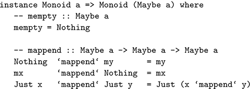

List monoid:

``` haskell
instance Monoid [a] where
-- mempty :: [a]
mempty = []
-- mappend :: [a] -> [a] -> [a]
mappend = (++)
```

Numeric monoid for addition:

``` haskell
newtype Sum a = Sum a
deriving (Eq, Ord, Show, Read)
getSum :: Sum a -> a
getSum (Sum x) = x
instance Num a => Monoid (Sum a) where
-- mempty :: Sum a
mempty = Sum 0
-- mappend :: Sum a -> Sum a -> Sum a
Sum x ‘mappend‘ Sum y = Sum (x+y)
```

Numeric monoid for multiplication:

``` haskell
newtype Product a = Product a
deriving (Eq, Ord, Show, Read)
getProduct :: Product a -> a
getProduct (Product x) = x
instance Num a => Monoid (Product a) where
-- mempty :: Product a
mempty = Product 1
-- mappend :: Product a -> Product a -> Product a
Product x ‘mappend‘ Product y = Product (x*y)
```

Boolean monoid for conjunction:

``` haskell
newtype All = All Bool
deriving (Eq, Ord, Show, Read)
getAll :: All -> Bool
getAll (All b) = b
instance Monoid All where
-- mempty :: All
mempty = All True
-- mappend :: All -> All -> All
All b ‘mappend‘ All c = All (b && c)
```

Boolean monoid for disjunction:

``` haskell
newtype Any = Any Bool
deriving (Eq, Ord, Show, Read)
getAny :: Any -> Bool
getAny (Any b) = b
instance Monoid Any where
-- mempty :: Any
mempty = Any False
-- mappend :: Any -> Any -> Any
Any b ‘mappend‘ Any c = Any (b || c)
```

Infix version of mappend:

``` haskell
(<>) :: Monoid a => a -> a -> a
x <> y = x ‘mappend‘ y
```

### **B.17Foldables**

The declarations below are provided in the library Data.Foldable, which can be loaded by entering the following in GHCi or at the start of a script:

``` haskell
import Data.Foldable
```

Class declaration:

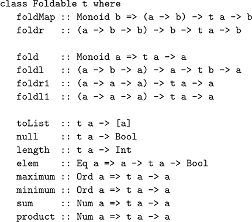

Default definitions:

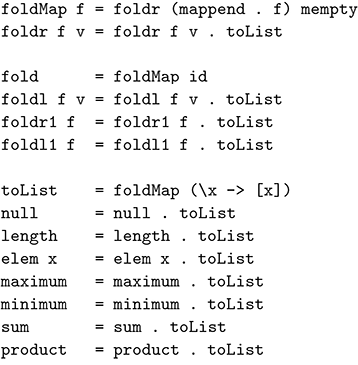

The minimal complete definition for an instance is to define foldMap or foldr, as all other functions in the class can be derived from either of these two using the above default definitions and the following instance for lists.

List foldable:

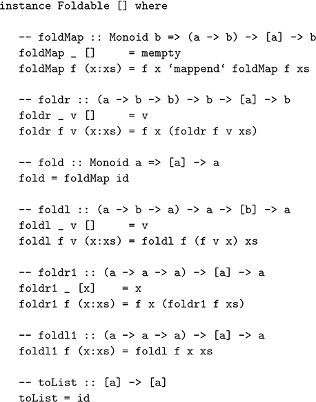

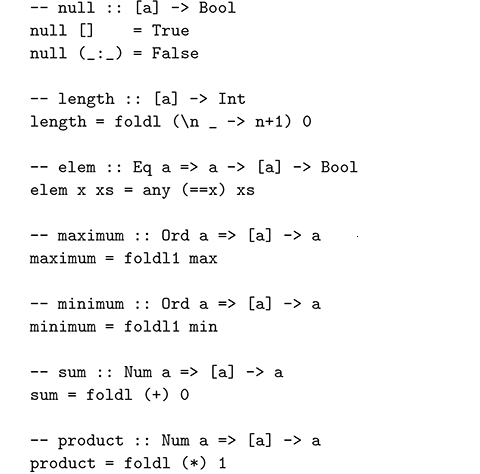

Decide if all logical values in a structure are True:

``` haskell
and :: Foldable t => t Bool -> Bool
and = getAll . foldMap All
```

Decide if any logical value in a structure is True:

``` haskell
or :: Foldable t => t Bool -> Bool
or = getAny . foldMap Any
```

Decide if all elements in a structure satisfy a predicate:

``` haskell
all :: Foldable t => (a -> Bool) -> t a -> Bool
all p = getAll . foldMap (All . p)
```

Decide if any element in a structure satisfies a predicate:

``` haskell
any :: Foldable t => (a -> Bool) -> t a -> Bool
any p = getAny . foldMap (Any . p)
```

Concatenate a structure whose elements are lists:

``` haskell
concat :: Foldable t => t [a] -> [a]
concat = fold
```

### **B.18Traversables**

Class declaration:

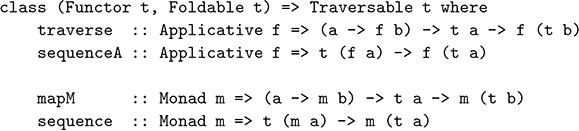

Default definitions:

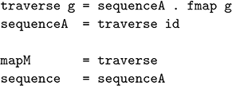

The minimal complete definition for an instance of the class is to define traverse or sequenceA, as all other functions in the class can be derived from either of these two using the above default definitions.

Maybe traversable:

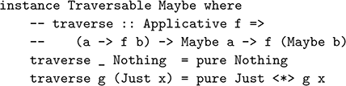

List traversable:

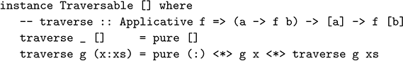