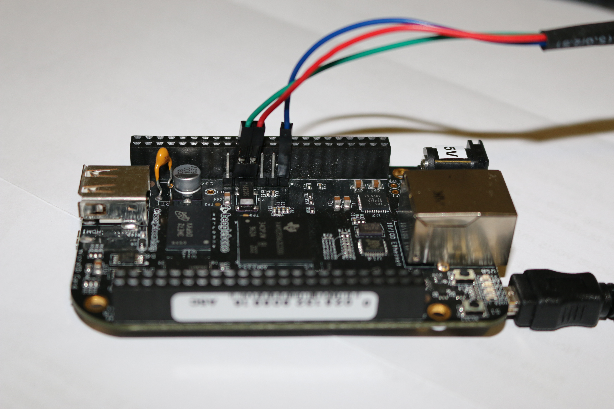

**Bootloader - U-Boot**

 

 

*Objectives: Set up serial communication, compile and install the U-Boot boot-**loader, use basic U-Boot commands, set up TFTP communication with the* *development workstation.*

 

As the bootloader is the first piece of software executed by a hardware platform, the installation procedure of the bootloader is very specific to the hardware platform. There are usually two cases:

• The processor offers nothing to ease the installation of the bootloader, in which case the JTAG has to

be used to initialize flash storage and write the bootloader code to flash. Detailed knowledge of the hardware is of course required to perform these operations.

• The processor offers a monitor, implemented in ROM, and through which access to the memories is

made easier.

The AM3358 SoC on the BeagleBone falls into the second category. The monitor integrated in the ROM reads the SD card to search for a valid bootloader.

Go to the \$HOME/embedded-linux-bbb-labs/bootloader directory.

**Setting up serial communication with the board**

The Beaglebone serial connector is exported on the 6 pins close to one of the 48 pins headers. Using your special USB to Serial adapter provided by your instructor, connect the ground wire (blue) to the pin closest to the power supply connector (let’s call it pin 1), and the TX (red) and RX (green) wires to the pins 4 (board

RX 2 ) and 5 (board TX ).

You always should make sure that you connect the TX pin of the cable to the RX pin of the board, and vice versa, whatever the board and cables that you use.

 

Once the USB to Serial connector is plugged in, a new serial port should appear: /dev/ttyUSB0.

You can also see this device appear by looking at the output of sudo dmesg.

To communicate with the board through the serial port, install a serial communication program, such as picocom:

2 See <https://www.olimex.com/Products/Components/Cables/USB-Serial-Cable/USB-Serial-Cable-F/> for details about the USB

to Serial adapter that we are using.

8 © 2004-2025 [Bootlin](https://bootlin.com), CC BY-SA license \$ sudo apt install picocom

If you run ls -l /dev/ttyUSB0, you can also see that only root and users belonging to the dialout group have read and write access to the serial console. Therefore, you need to add your user to the dialout group:

\$ sudo adduser \$USER dialout

**Important**: for the group change to be effective, you have to reboot your computer (at least on Ubuntu 22.04) and log in again. A workaround is to run newgrp dialout, but it is not global. You have to run it in each terminal.

Run picocom -b 115200 /dev/ttyUSB0, to start serial communication on /dev/ttyUSB0, with a baudrate of 115200. If you wish to exit picocom, press \[Ctrl\]\[a\] followed by \[Ctrl\]\[x\].

There should be nothing on the serial line so far, as the board is not powered up yet.

It is now time to power up your board by plugging in the mini-USB (BeagleBone Black case) or micro-USB (BeagleBone Black Wireless case) cable supplied by your instructor to your PC.

See what messages you get on the serial line. You should see U-boot start on the serial line, if there was a valid U-Boot and SPL on the board’s eMMC.

**Compiling U-Boot and SPL**

Download U-Boot:

\$ git clone https://source.denx.de/u-boot/u-boot.git/

\$ cd u-boot

\$ git checkout v2024.04

Get an understanding of U-Boot’s configuration and compilation steps by reading the README file, and specif-ically the *Building the Software* section.

Basically, you need to:

1\. Specify the cross-compiler prefix (the part before gcc in the cross-compiler executable name):

\$ export CROSS_COMPILE=arm-linux-

2\. Run \$ ls configs/ \| grep am335 to see all predefined configurations. The one that supports our

board is not obvious: it’s am335x_evm_defconfig and not am335x_boneblack_vboot_defconfig which is only for *verified boot* on BeagleBone Black.

3\. So, run \$ make am335x_evm_defconfig .

4\. Now that you have a valid initial configuration, you can now run \$ make menuconfig to further edit

your bootloader features.

Here, though, the default configuration works fine for our needs, so no change is necessary.

Install the following packages which should be needed to compile U-Boot for your board:

\$ sudo apt install libssl-dev device-tree-compiler swig \\

python3-dev python3-setuptools

5\. Finally, depending on your board, run

make DEVICE_TREE=am335x-boneblack

or

© 2004-2025 [Bootlin,](https://bootlin.com) CC BY-SA license 9

make DEVICE_TREE=am335x-boneblack-wireless

which will build U-Boot 3. The DEVICE_TREE variable specifies the specific Device Tree that describes our hardware board. Alternatively, if you wish to run just make, specify our board’s device tree name on Device Tree Control *→* Default Device Tree for DT Control option.

**Preparing a bootable micro-SD card**

The TI romcode will look for an MLO (*MMC Load*) file in a FAT partition on an SD card. This is precisely what U-Boot compiled for us, together with the U-Boot binary (u-boot.img).

Let’s prepare an SD card with such a partition.

Plug the SD card your instructor gave you on your workstation. Type the sudo dmesg command to see which device is used by your workstation. In case the device is /dev/mmcblk0, you will see something like

\[46939.425299\] mmc0: new high speed SDHC card at address 0007 \[46939.427947\] mmcblk0: mmc0:0007 SD16G 14.5 GiB

The device file name may be different (such as /dev/sdb if the card reader is connected to a USB bus (either internally or using a USB card reader).

In the following instructions, we will assume that your SD card is seen as /dev/mmcblk0 by your PC work-station.

Type the mount command to check your currently mounted partitions. If SD partitions are mounted, unmount them:

\$ sudo umount /dev/mmcblk0p\*

We will erase the existing partition table by simply zero-ing the first 16 MiB of the SD card:

\$ sudo dd if=/dev/zero of=/dev/mmcblk0 bs=1M count=16

Now, let’s use the cfdisk command to create the first partition that we need to boot the board: we are going to use:

\$ sudo cfdisk /dev/mmcblk0

If cfdisk asks you to Select a label type, choose dos. This corresponds to traditional partitions tables that DOS/Windows would understand. gpt partition tables are needed for disks bigger than 2 TB.

In the cfdisk interface, delete existing partitions, then create only one primary partition, starting from the beginning, with the following properties:

• Size: 64MB big

• Type: W95 FAT32 (LBA) (c choice)

• Bootable flag enabled

Press Write when you are done.

We will create further partitions in a later lab, when we need them.

To make sure that partition definitions are reloaded on your workstation, remove the SD card and insert it again.

Now create a FAT32 filesystem on this new partition: 4

3 You can speed up the compiling by using the-jX option with make, where X is the number of parallel jobs used for compiling.

Twice the number of CPU cores is a good value.

4 Ubuntu uses version 4.2 of mkfs.vfat and the FAT generated by this version of the command is incompatible with what the

TI AM335x romcode expects. Passing the-a option is a workaround as described on a [Bootlin blog post](https://bootlin.com/blog/workaround-for-creating-bootable-fat-partition-for-beagle-bone-am335x-on-recent-distros/)[.](https://bootlin.com/blog/workaround-for-creating-bootable-fat-partition-for-beagle-bone-am335x-on-recent-distros/)

10 © 2004-2025 [Bootlin](https://bootlin.com), CC BY-SA license sudo mkfs.vfat -a -F 32 -n boot /dev/mmcblk0p1

You can now make your workstation automatically mount this partition by removing the SD card and plugging it back. It should now be mounted on /media/\$USER/boot.

Now, copy the MLO and u-boot.img files to the SD card:

cp MLO u-boot.img /media/\$USER/boot/

sudo umount /media/\$USER/boot/

**Testing U-Boot**

Insert the SD card in the board slot. To boot the board on the external micro-SD card, you need to hold the USER button close to the USB host port, and then power-up or reset the board. You can then release the USR button.

This seems like a very inconvenient way of booting the board, but the selection of attempting to boot from the external micro-SD card remains active across resets, until the board is ultimately powered off. So, you will just need to use the button a few times during the course.

If this is too inconvenient for you, you could use U-Boot on the external micro-SD card to flash a new version of U-Boot on the internal eMMC. This would allow you to boot without an external micro-SD card.

Here’s what you should get on the serial line:

U-Boot SPL 2024.04 (May 22 2024 - 14:21:15 +0200)

Trying to boot from MMC1

 

U-Boot 2024.04 (May 22 2024 - 14:21:15 +0200)

CPU : AM335X-GP rev 2.1

Model: TI AM335x BeagleBone Black

DRAM: 512 MiB

Core: 160 devices, 18 uclasses, devicetree: separate WDT: Started wdt@44e35000 with servicing every 1000ms (60s timeout) NAND: 0 MiB

MMC: OMAP SD/MMC: 0, OMAP SD/MMC: 1

Loading Environment from FAT... Unable to read "uboot.env" from mmc0:1... \<ethaddr\> not set. Validating first E-fuse MAC

Net: eth2: ethernet@4a100000using musb-hdrc, OUT ep1out IN ep1in STATUS ep2in MAC de:ad:be:ef:00:01

HOST MAC de:ad:be:ef:00:00

RNDIS ready

, eth3: usb_ether

Hit any key to stop autoboot: 0

=\>

Make sure that the version and compile date are right. Otherwise, try again, because this means that you booted on the internal eMMC.

In U-Boot, type the help command, and explore the few commands available.

 

**Adding a new command to the U-Boot shell**

Check whether the config command is available. This command allows to dump the configuration settings U-Boot was compiled from.

If it’s not, go back to U-Boot’s configuration and enable it.

© 2004-2025 [Bootlin,](https://bootlin.com) CC BY-SA license 11 Re-run the build of U-Boot, and update the bootloader on the SD card and test that the command is now available and works as expected.

 

**Playing with the U-Boot environment**

Display the U-Boot environment using printenv.

Set a new U-Boot variable foo to a value of your choice, using setenv, and verify it has been set. Reset the board, and check if foo is still defined: it should not.

Now repeat this process, but before resetting the board, use saveenv. After the reset, check the foo variable is still defined.

Now reset the environment to its default settings using env default -a, and save these changes using saveenv.

**Setting up networking**

The next step is to configure U-boot and your workstation to let your board download files, such as the kernel image and Device Tree Binary (DTB), using the TFTP protocol through a network connection.

As this course supports both the BeagleBone Black and BeagleBone Black Wireless boards, we’re keeping things simple by using Ethernet over USB device as this works for both boards (as the Wireless board has no native Ethernet port). So, networking will work through the USB device cable that is already used to power up the board.

**Caution**: For the following to work, make sure that your board is powered by a USB port on your PC. Otherwise, networking over USB cannot work.

 

**Network configuration on the target**

Let’s configure networking in U-Boot:

• ipaddr: IP address of the board

• serverip: IP address of the PC host

=\> setenv ipaddr 192.168.0.100

=\> setenv serverip 192.168.0.1

Of course, make sure that this address belongs to a separate network segment from the one of the main company network.

We also need to configure Ethernet over USB device:

• ethprime: controls which interface gets used first

• usbnet_devaddr: MAC address on the device side

• usbnet_hostaddr: MAC address on the host side

=\> setenv ethprime usb_ether

=\> setenv usbnet_devaddr f8:dc:7a:00:00:02

=\> setenv usbnet_hostaddr f8:dc:7a:00:00:01

To make these settings permanent, save the environment:

=\> saveenv

 

**Network configuration on the PC host**

To configure your network interface on the workstation side, we need to know the name of the network interface connected to your board.

12 © 2004-2025 [Bootlin](https://bootlin.com), CC BY-SA license Note that when the board is waiting at the U-Boot prompt, no network interface will show up on the workstation side. It is only when U-Boot is actively executing a network-related command (such as ping or tftp) that it brings up the USB network connection.

From the board, run ping 192.168.0.1, and while the ping command is running, you should see on your workstation a new network interface named enx\<macaddr\>. Given the value we gave to usbnet_hostaddr, it will therefore be enxf8dc7a000001. Note that pinging the board from your PC will not work: when U-Boot is waiting at its prompt, it is not able to reply to ping requests.

Then, instead of configuring the host IP address from NetworkManager’s graphical interface, let’s do it through its command line interface, which is so much easier to use:

nmcli con add type ethernet ifname enxf8dc7a000001 ip4 192.168.0.1/24

**Setting up the TFTP server**

Let’s install a TFTP server on your development workstation:

sudo apt install tftpd-hpa

You can then test the TFTP connection. First, put a small text file in the directory exported through TFTP on your development workstation. Then, from U-Boot, do:

=\> tftp 0x81000000 textfile.txt

The tftp command should have downloaded the textfile.txt file from your development workstation into

the board’s memory at location 5 0x81000000.

You can verify that the download was successful by dumping the contents of the memory:

=\> md 0x81000000

We will see in the next labs how to use U-Boot to download, flash and boot a kernel.

**Rescue binaries**

If you have trouble generating binaries that work properly, or later make a mistake that causes you to lose your bootloader binaries, you will find working versions under data/ in the current lab directory.

 

5 This location is part of the board DRAM. If you want to check where this value comes from, you can check the SoC datasheet

at <https://www.ti.com/lit/ug/spruh73q/spruh73q.pdf>[.](https://www.ti.com/lit/ug/spruh73q/spruh73q.pdf) It’s a big document (more than 5,000 pages). In this document, look for ARM Cortex-A8 Memory Map and you will find the SoC memory map. You will see that the address range for the memory controller (*EMIF0 SDRAM*) starts at the address we are looking for. You can also try with other values in the RAM address range.

© 2004-2025 [Bootlin,](https://bootlin.com) CC BY-SA license 13