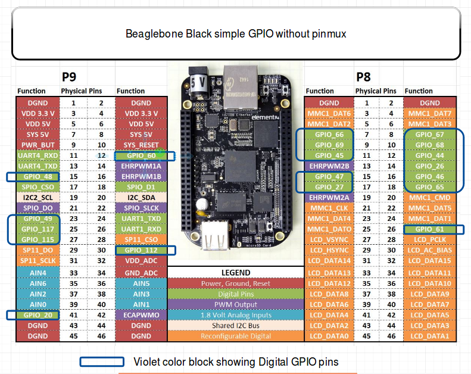
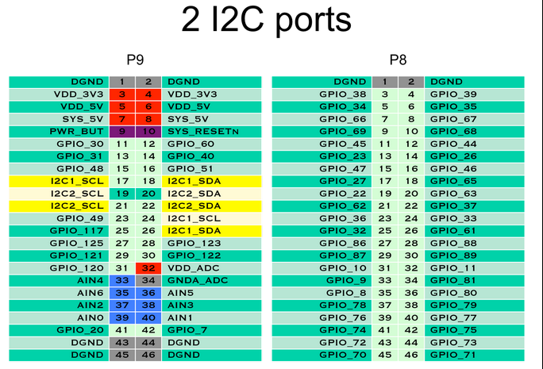
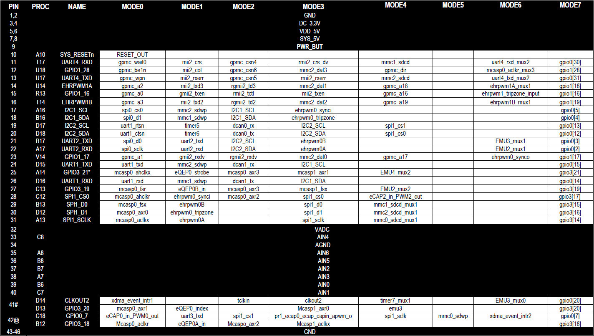
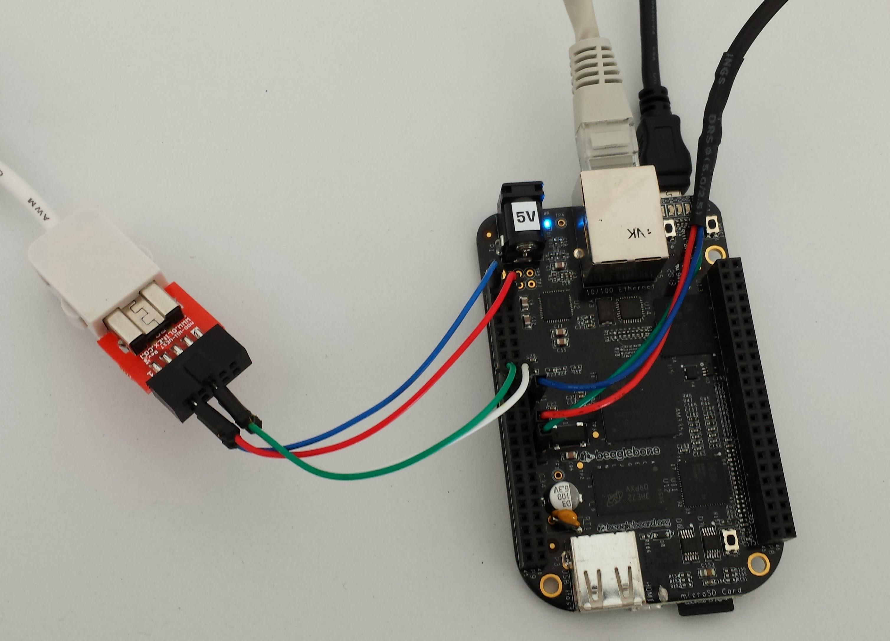

**Accessing Hardware Devices**

*Objective: learn how to access hardware devices and declare new ones.*

**Goals**

Now that we have access to a command line shell thanks to a working root filesystem, we can now explore existing devices and make new ones available. In particular, we will make changes to the Device Tree and compile an out-of-tree Linux kernel module.

**Setup**

Go to the \$HOME/embedded-linux-bbb-labs/hardware directory, which provides useful files for this lab.

However, we will go on booting the system through NFS, using the root filesystem built by the previous lab.

**Exploring /dev**

Start by exploring /dev on your target system. Here are a few noteworthy device files that you will see:

• *Terminal devices*: devices starting with tty. Terminals are user interfaces taking text as input and

producing text as output, and are typically used by interactive shells. In particular, you will find console which matches the device specified through console= in the kernel command line. You will also find the ttyS0 device file.

• *Pseudo-terminal devices*: devices starting with pty, used when you connect through SSH for example.

Those are virtual devices, but there are so many in /dev that we wanted to give a description here.

• MMC device(s) and partitions: devices starting with mmcblk. You should here recognize the MMC

device(s) on your system and the associated partitions.

• If you have a real board (not QEMU) and a USB stick, you could plug it in and if your kernel was built

with USB host and mass storage support, you should see a new sda device appear, together with the sda\<n\> devices for its partitions.

Don’t hesitate to explore /dev on your workstation too and ask any questions to your instructor.

**Exploring /sys**

The next thing you can explore is the *Sysfs* filesystem.

A good place to start is /sys/class, which exposes devices classified by the kernel frameworks which manage them.

For example, go to /sys/class/net, and you will see all the networking interfaces on your system, whether they are internal, external or virtual ones.

Find which subdirectory corresponds to the network connection to your host system, and then check device properties such as:

• speed: will show you whether this is a gigabit or hundred megabit interface.

• address: will show the device MAC address. No need to get it from a complex command!

• statistics/rx_bytes will show you how many bytes were received on this interface.

Don’t hesitate to look for further interesting properties by yourself!

You can also check whether /sys/class/thermal exists and is not empty on your system. That’s the thermal framework, and it allows to access temperature measures from the thermal sensors on your system.

Next, you can now explore all the buses (virtual or physical) available on your system, by checking the contents of /sys/bus.

In particular, go to /sys/bus/mmc/devices to see all the MMC devices on your system. Go inside the directory for the first device and check several files (for example):

• serial: the serial number for your device.

• preferred_erase_size: the preferred erase block for your device. It’s recommended that partitions

start at multiples of this size.

• name: the product name for your device. You could display it in a user interface or log file, for example.

• date: apparently the manufacturing date for the device.

Don’t hesitate to spend more time exploring /sys on your system and asking questions to your instructor.

**Driving GPIOs**

At this stage, we can only explore GPIOs through the legacy interface in /sys/class/gpio, because the *libgpiod* interface commands are provided through a dedicated project which we have to build separately, and *Busybox* does not provide a re-implementation for the *libgpiod* tools. In a later lab, we will build *libgpiod* tools which use the modern /dev/gpiochipX interface.

The first thing to do is to enable this legacy interface by enabling [CONFIG_GPIO_SYSFS](https://elixir.bootlin.com/linux/latest/K/ident/CONFIG_GPIO_SYSFS) in the kernel configu-

ration. Also make sure *Debugfs* is enabled ([CONFIG_DEBUG_FS](https://elixir.bootlin.com/linux/latest/K/ident/CONFIG_DEBUG_FS) and [CONFIG_DEBUG_FS_ALLOW_ALL](https://elixir.bootlin.com/linux/latest/K/ident/CONFIG_DEBUG_FS_ALLOW_ALL)[).](https://elixir.bootlin.com/linux/latest/K/ident/CONFIG_DEBUG_FS_ALLOW_ALL)

After rebooting the new kernel, the first thing to do is to mount the *Debugfs* filesystem:

\# mount -t debugfs debugfs /sys/kernel/debug/

Then, you can check information about available GPIOs banks and which GPIOs are already in use:

\# cat /sys/kernel/debug/gpio

We are going to use one of the free GPIOs on the expansion headers of the board, which is not already used by another device.

Take one of the M-M breadboard wires provided by your instructor and:

• Connect one end to pin 12 of connector P9

• Connect the other end to pin 1 (DGND) of connector P9

Source: <https://elinux.org/File:BBB_I-O_pins_.png>

If you check the description of the P9 connector on the board [System Reference Manual,](https://github.com/beagleboard/beaglebone-black/wiki/System-Reference-Manual#712-connector-p9) you can see that pin 12 is now called GPIO1_28 instead of GPIO_60 in the above diagram. This pin is already configured as a GPIO by default (no need to change pin muxing to use this pin as a GPIO).

If you get back to the contents of /sys/kernel/debug/gpio, you’ll recognize the association between gpio-28 on GPIO pin bank 0 (gpiochip0) and header pin P9_12. That’s very useful information, but you don’t have this level of details for all boards, unfortunately.

We now have everything we need to drive this GPIO using the legacy interface. First, let’s enable it:

\# cd /sys/class/gpio

\# echo 540 \> export

If indeed the pin is still available, this should create a new gpio540 file in /sys/class/gpio.

We can now configure this pin as input:

\# echo in \> gpio540/direction

And check its value:

\# cat gpio540/value

0

The value should be 0 as the pin is connected to a ground level.

Now, let’s connect our GPIO pin to pin 3 (VDD 3.3V) of connector P9. Check the above diagram if needed.

Let’s check the value again:

\# cat gpio540/value

1

The value is 1 because our pin is connected to a 3.3V level now.

You could use this GPIO to add a button switch to your board, for example.

Note that you could also configure the pin as output and set its value through the value file. This way, you could add an external LED to your board, for example.

Before moving on to the next section, you can also check /sys/kernel/debug/gpio again, and see that gpio-540 is now in use, through the sysfs interface, and is configured as an input pin.

When you’re done, you can see your GPIO free:

\# echo 540 \> unexport

**Driving LEDs**

First, make sure your kernel is compiled with [CONFIG_LEDS_CLASS=y,](https://elixir.bootlin.com/linux/latest/K/ident/CONFIG_LEDS_CLASS) [CONFIG_LEDS_GPIO=y](https://elixir.bootlin.com/linux/latest/K/ident/CONFIG_LEDS_GPIO) and [CONFIG_LEDS\_](https://elixir.bootlin.com/linux/latest/K/ident/CONFIG_LEDS_TRIGGER_TIMER)

[TRIGGER_TIMER=y](https://elixir.bootlin.com/linux/latest/K/ident/CONFIG_LEDS_TRIGGER_TIMER).

Then, go to /sys/class/leds to see all the LEDs that you are allowed to control.

Let’s control the LED which is called beaglebone:green:heartbeat.

Go into the directory for this LED, and check its trigger (what routine is used to drive its value):

\# cat trigger

As you can see, there are many triggers to choose from. You can disable all triggers by:

\# echo none \> trigger

And then directly control the LED:

\# echo 1 \> brightness

\# echo 0 \> brightness

You could also use the timer trigger to light the LED with specified time on and time off:

\# echo timer \> trigger

\# echo 10 \> delay_on

\# echo 200 \> delay_off

**Managing the I2C buses and devices**

**Enabling an I2C bus**

The next thing we want to do is connect an Nunchuk joystick to an I2C bus on our board. The I2C bus is very frequently used to connect all sorts of external devices. That’s why we’re covering it here.

As shown on the below picture found on <https://elinux.org/Beagleboard:Cape_Expansion_Headers>, the BeagleBone Black has two I2C busses available on its expansion headers: I2C1 and I2C2. Another one exists (I2C0), but it’s not available on the external headers.

In this lab, we will try to use I2C1 on P9 pins 17 and 18, because it’s more interesting to use than I2C2 which is already enabled by default.

So, let’s see which I2C buses are already enabled:

\# i2cdetect -l

i2c-2 i2c OMAP I2C adapter I2C adapter

i2c-0 i2c OMAP I2C adapter I2C adapter

Here you can see that I2C1 is missing.

As the bus numbering scheme in Linux doesn’t always match the one on the datasheets, let’s check the base addresses of the registers of these controllers:

\# ls -l /sys/bus/i2c/devices/i2c-\*

lrwxrwxrwx 1 0 Jan 1 00:59 /sys/bus/i2c/devices/i2c-0 -\> ../../../devices/platform/ocp/\\

44c00000.interconnect/44c00000.interconnect:segment@200000/44e0b000.target-module/\\ 44e0b000.i2c/i2c-0

lrwxrwxrwx 1 0 Jan 1 00:59 /sys/bus/i2c/devices/i2c-2 -\> ../../../devices/platform/ocp/\\

48000000.interconnect/48000000.interconnect:segment@100000/4819c000.target-module/\\ 4819c000.i2c/i2c-2

That’s not completely straightforward, but you can suppose that:

• I2C0 is at address 0x44e0b000

• I2C2 is at address 0x4819c000

Now let’s double check the addressings by looking at the [TI AM335x SoC datasheet](https://www.ti.com/lit/ug/spruh73q/spruh73q.pdf), in the L4_WKUP Peripheral Memory Map and L4_PER Peripheral Memory Map sections:

• I2C0 is indeed at address 0x44e0b000

• I2C1 is at address 0x4802a000

• I2C2 is indeed at address 0x4819c000

So, we are lucky that i2c-0 in Linux corresponds to I2C0 in the datasheet, and that i2c-2 corresponds to I2C2. We’re just missing i2c-1.

**Customizing the Device Tree**

Fortunately, I2C1 is already defined in the one of the DTS includes used by the Device Tree for our board.

In our case, that’s in [arch/arm/boot/dts/ti/omap/am33xx-l4.dtsi](https://elixir.bootlin.com/linux/latest/source/arch/arm/boot/dts/ti/omap/am33xx-l4.dtsi). Look by yourself in this file, and you will find its definition, but with status = "disabled";. This means that this I2C controller is not enabled yet, and it’s up to boards using it to do so.

We could modify the [arch/arm/boot/dts/ti/omap/am335x-boneblack.dts](https://elixir.bootlin.com/linux/latest/source/arch/arm/boot/dts/ti/omap/am335x-boneblack.dts) file for our board, but that’s not a very good idea as this file is maintained by the kernel developers. The changes that you make could collide with future changes made by the maintainers for this file.

A more futureproof idea is to create a new Device Tree file which includes the standard one, and adds custom definitions. So, create a new arch/arm/boot/dts/ti/omap/am335x-boneblack-custom.dts file containing:

/dts-v1/;

\#include "am335x-boneblack.dts"

&i2c1 {

status = "okay";

};

As you can see, it’s also possible to include dts files, and not only dtsi ones.

Modify the [arch/arm/boot/dts/ti/omap/Makefile](https://elixir.bootlin.com/linux/latest/source/arch/arm/boot/dts/ti/omap/Makefile) file to add your custom Device Tree, and then have it compiled (make dtbs).

Reboot your board with the update.

Back to the running system, we can now see that there is one more I2C bus:

\# i2cdetect -l

i2c-1 i2c OMAP I2C adapter I2C adapter

i2c-2 i2c OMAP I2C adapter I2C adapter

i2c-0 i2c OMAP I2C adapter I2C adapter

Run the below command to confirm that the new bus has the same address as in the datasheet (0x4802a000):

ls -l /sys/bus/i2c/devices/i2c-1

Now, let’s use i2cdetect’s capability to probe a bus for devices. Let’s start by the bus associated to i2c-0:

\# i2cdetect -r 0

i2cdetect: WARNING! This program can confuse your I2C bus Continue? \[y/N\] y

0 1 2 3 4 5 6 7 8 9 a b c d e f

00: -- -- -- -- -- -- -- -- -- -- -- -- --10: -- -- -- -- -- -- -- -- -- -- -- -- -- -- -- --

20: -- -- -- -- UU -- -- -- -- -- -- -- -- -- -- --

30: -- -- -- -- 34 -- -- -- -- -- -- -- -- -- -- --

40: -- -- -- -- -- -- -- -- -- -- -- -- -- -- -- --

50: 50 -- -- -- -- -- -- -- -- -- -- -- -- -- -- --

60: -- -- -- -- -- -- -- -- -- -- -- -- -- -- -- --

70: -- -- -- -- -- -- -- --

We can see three devices on this internal bus:

• One at address 0x24, indicated by UU, which means that there is a kernel driver actively driving this

device.

• Two other devices at addresses 0x34 and 0x50. We just know that they are currently not bound to a

kernel driver.

Now try to probe I2C1 through i2cdetect -r 1.

You will see that the command will fail to connect to the bus. That’s because the corresponding signals are not exposed yet to the outside connectors through pin muxing.

So, get back to your custom Device Tree and add pin muxing definitions for I2C1 (we took them from a

device tree from another board with the same CPU: [arch/arm/boot/dts/ti/omap/am335x-evm.dts](https://elixir.bootlin.com/linux/latest/source/arch/arm/boot/dts/ti/omap/am335x-evm.dts)) and refer to these definitions in the i2c1 node through the pinctrl-names and pinctrl-0 properties:

/dts-v1/;

\#include "am335x-boneblack.dts"

&am33xx_pinmux {

i2c1_pins: pinmux_i2c1_pins {

pinctrl-single,pins = \<

AM33XX_PADCONF(AM335X_PIN_SPI0_CS0, PIN_INPUT_PULLUP, MUX_MODE2) /\* spi0_cs0.i2c1_scl \*/ AM33XX_PADCONF(AM335X_PIN_SPI0_D1, PIN_INPUT_PULLUP, MUX_MODE2) /\* spi0_d1.i2c1_sda \*/

\>;

};

};

&i2c1 {

pinctrl-names = "default";

pinctrl-0 = \<&i2c1_pins\>;

status = "okay";

};

You can understand the above values thanks to the pin muxing diagram for connector P9, available at

[https://elinux.org/images/b/b4/HeaderP9.jpg,](https://elinux.org/images/b/b4/HeaderP9.jpg) which was extracted from the board System Reference Manual:

• AM335X_PIN_SPI0_CS0 and AM335X_PIN_SPI0_D1 are the offsets of the registers controlling pin muxing

for the corresponding pins of the SoC package.

• [MUX_MODE2](https://elixir.bootlin.com/linux/latest/ident/MUX_MODE2) corresponds to MODE2, to get I2C1 SCL and SDA signals on such pins.

• [PIN_INPUT_PULLUP](https://elixir.bootlin.com/linux/latest/ident/PIN_INPUT_PULLUP) is one of the supported options for these pins.

Recompile your Device Tree and reboot.

You should now be able to probe your bus:

\# i2cdetect -r 1

i2cdetect: WARNING! This program can confuse your I2C bus Continue? \[y/N\] y

0 1 2 3 4 5 6 7 8 9 a b c d e f

00: -- -- -- -- -- -- -- -- -- -- -- -- --10: -- -- -- -- -- -- -- -- -- -- -- -- -- -- -- --

20: -- -- -- -- -- -- -- -- -- -- -- -- -- -- -- --

30: -- -- -- -- -- -- -- -- -- -- -- -- -- -- -- --

40: -- -- -- -- -- -- -- -- -- -- -- -- -- -- -- --

50: -- -- -- -- -- -- -- -- -- -- -- -- -- -- -- --

60: -- -- -- -- -- -- -- -- -- -- -- -- -- -- -- --

70: -- -- -- -- -- -- -- --

No device is detected yet, because this bus is just used for external devices. It’s time to add one though.

**Adding and enabling an I2C device**

Let’s connect the Nunchuk provided by your instructor to the I2C1 bus on the board, using breadboard wires:

Serial

SCL

PWR Wii Nunchuk

GND

PWR

SDA

SCL

GND SDA

Nunchuk i2c pinout

(UEXT connector from Olimex, front view)

• Connect the Nunchuk PWR pin to pin 4 (3V3) of connector P9

• Connect the Nunchuk GND pin to pin 1 (GND) of connector P9

• Connect the Nunchuk SCL pin to pin 17 of connector P9

• Connect the Nunchuk SDA pin to pin 18 of connector P9

If you didn’t do any mistake, your new device should be detected at address 0x52:

\# i2cdetect -r 1

i2cdetect: WARNING! This program can confuse your I2C bus Continue? \[y/N\] y

0 1 2 3 4 5 6 7 8 9 a b c d e f

00: -- -- -- -- -- -- -- -- -- -- -- -- --10: -- -- -- -- -- -- -- -- -- -- -- -- -- -- -- --

20: -- -- -- -- -- -- -- -- -- -- -- -- -- -- -- --

30: -- -- -- -- -- -- -- -- -- -- -- -- -- -- -- --

40: -- -- -- -- -- -- -- -- -- -- -- -- -- -- -- --

50: -- -- 52 -- -- -- -- -- -- -- -- -- -- -- -- --

60: -- -- -- -- -- -- -- -- -- -- -- -- -- -- -- --

70: -- -- -- -- -- -- -- --

We will later compile an out-of-tree kernel module to support this device.

**Plugging a USB audio headset**

In the next labs, we are going to play audio using a USB audio headset. Let’s see whether our kernel supports such hardware by plugging the headset provided by your instructor.

Before plugging the device, look at the output of lsusb:

\# lsusb

Bus 001 Device 001: ID 1d6b:0002

Now, when you plug the USB headset, a number of messages should appear on the console, and running lsusb again should show an additional device:

\# lsusb

Bus 001 Device 001: ID 1d6b:0002

Bus 001 Device 003: ID 0d8c:0014

The device of vendor ID 0d8c and product ID 0014 has appeared. Of course, this depends on the actual USB audio device that you used.

The device also appears in /sys/bus/usb/devices/, in a directory whose name depends on the topology of the USB bus. When the device is plugged in the kernel messages show:

usb 1-1: new full-speed USB device number 4 using musb-hdrc

So if we go in /sys/bus/usb/devices/1-1, we get the *sysfs* representation of this USB device:

\# cd /sys/bus/usb/devices/1-1

\# cat idVendor

0d8c

\# cat idProduct

0014

\# cat manufacturer

C-Media Electronics Inc.

\# cat product

USB Audio Device

However, while the USB device is detected, we currently do not have any driver for this device, so no actual sound card is detected.

**Enabling, installing and using in-tree kernel modules**

Go back to the kernel source directory.

The Linux kernel has a generic driver supporting all USB audio devices supporting the standard USB audio

class. This driver can be enabled using the [CONFIG_SND_USB_AUDIO](https://elixir.bootlin.com/linux/latest/K/ident/CONFIG_SND_USB_AUDIO) configuration option. Look for this parameter in the kernel configuration, and you should find that it is already enabled as a module.

So, instead of compiling the corresponding driver as a built-in, that’s a good opportunity to practice with kernel modules.

So, compile your modules:

make modules

Then, following details given in the lectures, install the modules in our NFS root filesystem (\$HOME/embedded-linux-bbb-labs/tinysystem/nfsroot).

Also make sure to update the kernel image (make zImage), and reboot the board. Indeed, due to the changes we have made to the kernel source code, the kernel version is now 6.6.\<x\>-dirty, the *dirty* keyword indicating that the Git working tree has uncommitted changes. The modules are therefore installed in /lib/modules/6.6.\<x\>-dirty/, and the version of the running Linux kernel must match this.

After rebooting, try to load the module that we need:

modprobe snd-usb-audio

By running lsmod, see all the module dependencies that were loaded too.

You can also see that a new USB device driver in /sys/bus/usb/drivers/snd-usb-audio. This directory shows which USB devices are bound to this driver.

You can check that /proc/asound now exists (thanks to loading modules for ALSA, the Linux sound subsys-tem), and that one sound card is available:

\# cat /proc/asound/cards

0 \[Device \]: USB-Audio - USB Audio Device

GeneralPlus USB Audio Device at usb-musb-hdrc.1-1, full speed

Check also the /dev/snd directory, which should now contain some character device files. These will be used by the user-space libraries and applications to access the audio devices.

Modify your startup scripts so that the snd-usb-audio module is always loaded at startup.

We cannot test the sound card yet, as we will need to build some software first. Be patient, this is coming soon.

**Compiling and installing an out-of-tree kernel module**

The next device we want to support is the I2C Nunchuk. There is a driver in the kernel to support it when connected to a Wiimote controller, but there is no such driver to support it as an I2C device.

Fortunately, one is provided in \$HOME/embedded-linux-bbb-labs/hardware/data/nunchuk/nunchuk.c. You

can check [Bootlin’s Linux kernel and driver development course](https://bootlin.com/training/kernel/) to learn how to implement all sorts of device drivers for Linux.

Go to this directory, and compile the out-of-tree module as follows:

make -C \$HOME/embedded-linux-bbb-labs/kernel/linux M=\$PWD

Here are a few explanations:

• The-C option lets make know which Makefile to use, here the toplevel Makefile in the kernel sources.

• M=\$PWD tells the kernel Makefile to build external module(s) from the file(s) in the current directory.

Now, you can install the compiled module in the NFS root filesystem by passing the modules_install target and specifying the target directory through the INSTALL_MOD_PATH variable:

make -C \$HOME/embedded-linux-bbb-labs/kernel/linux \\

M=\$PWD \\

INSTALL_MOD_PATH=\$HOME/embedded-linux-bbb-labs/tinysystem/nfsroot \\ modules_install

You can see that this installs out-of-tree kernel modules under lib/modules/\<version\>/updates/.

Back on the target, you can now check that your custom module can be loaded:

\# modprobe nunchuk

\[ 4317.737978\] nunchuk: loading out-of-tree module taints kernel.

See [kbuild/modules](https://www.kernel.org/doc/html/latest/kbuild/modules.html) in kernel documentation for details about building out-of-tree kernel modules.

However, run i2cdetect -r 1 again. You will see that the Nunchuk is still detected, but still not driven by the kernel. Otherwise, it would be signaled by the UU character. You may also look at the nunchuk.c file and notice a Nunchuk device probed successfully message that you didn’t see when loading the module.

That’s because the Linux kernel doesn’t know about the Nunchuk device yet, even though the driver for this kind of devices is already loaded. Our device also has to be described in the Device Tree.

You can confirm this by having a look at the contents of the /sys/bus/i2c directory. It contains two subdirectories: devices and drivers.

In drivers, there should be a nunchuk subdirectory, but no symbolic link to a device yet. In devices you should see some devices, but not the Nunchuk one yet.

**Declaring an I2C device**

To allow the kernel to manage our Nunchuk device, let’s declare the device in the custom Device Tree for our board. The declaration of the I2C1 bus will then look as follows:

&i2c1 {

status = "okay";

clock-frequency = \<100000\>;

nunchuk: joystick@52 {

compatible = "nintendo,nunchuk";

reg = \<0x52\>;

};

};

Here are a few notes:

• The clock-frequency property is used to configure the bus to operate at 100 KHz. This is supposed

to be required for the Nunchuk.

• The Nunchuk device is added through a child node in the I2C controller node.

• For the kernel to *probe* and drive our device, it’s required that the compatible string matches one of

the compatible strings supported by the driver.

• The reg property is the address of the device on the I2C bus. If it doesn’t match, the driver will probe

the device but won’t be able to communicate with it.

Recompile your Device Tree and reboot your kernel with the new binary.

You can now load your module again, and this time, you should see that the Nunchuk driver probed the Nunchuk device:

\# modprobe nunchuk

\[ 66.680455\] nunchuk: loading out-of-tree module taints kernel. \[ 66.687645\] input: Wii Nunchuk as /devices/platform/ocp/48000000.interconnect/\\

48000000.interconnect:segment@0/4802a000.target-module/4802a000.i2c/i2c-1/1-0052/input/\\ input0

\[ 66.695421\] Nunchuk device probed successfully

List the contents of /sys/bus/i2c/drivers/nunchuk once again. You should now see a symbolic link corre-sponding to our new device.

Also list /sys/bus/i2c/devices/ again. You should now see the Nunchuk device, which can be recognized through its 0052 address. Follow the link and you should see a symbolic link back to the Nunchuk driver!

We are not ready to use this input device yet, but at least we can test that we get bytes when buttons or the joypad are used. In the below command, use the same number as in the message you got in the console (event0 for input0 for example):

\# cat /dev/input/event0 \| od -x

**Caution**: using od directly on input event files should work but is currently broken with the Musl library. We are investigating this issue.

We will use the Nunchuk to control audio playback in an upcoming lab.

**Setting the board’s model name**

Modify the custom Device Tree file one last time to override the model name for your system. Set the model property to BeagleBone Black media player. Don’t hesitate to ask your instructor if you’re not sure how.

Recompile the device tree, and reboot the board with it. You should see the new model name in two different places:

• In the first kernel messages on the serial console.

• In /sys/firmware/devicetree/base/model. This can be handy for a distribution to identify the de-

vice it’s running on. By the way, you can explore /sys/firmware/devicetree and find that every subdirectory corresponds to a DT node, and every file corresponds to a DT property.

**Committing kernel tree changes**

Now that our changes to the kernel sources are over, create a branch for your changes and create a patch for them. **Please don’t skip this step** as we need it for the next labs.

First, if not done yet, you should set your identity and e-mail address in git:

git config --global user.email "linus@bootlin.com"

git config --global user.name "Linus Torvalds"

This is necessary to create a commit with the git commit -s command, as required by the Linux kernel contribution guidelines.

Let’s create the branch and the patch now:

git checkout -b bootlin-labs

git add arch/arm/boot/dts/ti/omap/am335x-boneblack-custom.dts \\ arch/arm/boot/dts/ti/omap/Makefile

git commit -as -m "Custom DTS for Bootlin lab"

We can now create the patch:

git format-patch stable/linux-6.6.y

This should generate a 0001-Custom-DTS-for-Bootlin-lab.patch file.

Creating the branch will impact the versions of the kernel and the modules. Compile your kernel and install your modules again (not necessary for the Nunchuk one for the moment) and see the version changes through the new base directory for modules.

To save space for the next lab, remove the old directory under \<code\>lib/modules\</code\> containing the ”dirty” modules.

Don’t forget to update the kernel your board boots.

That’s all for now!

