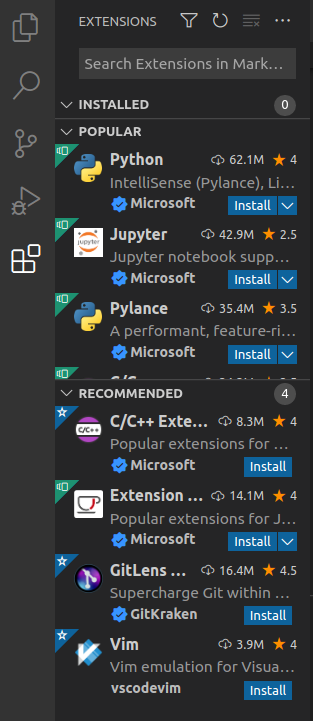
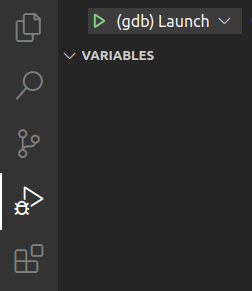
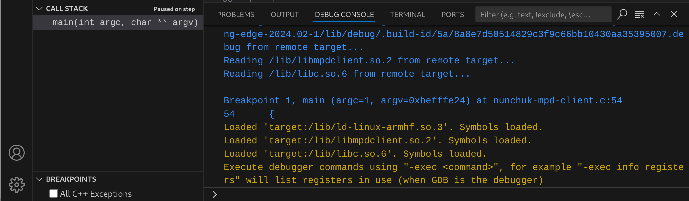
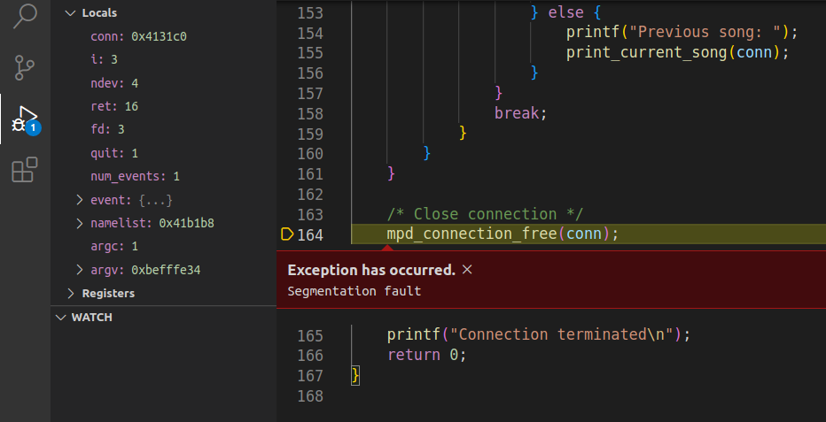

**Application development and applica-**

 

 

**tion debugging**

 

*Objective: compile an application against a Buildroot build space and debug* *it remotely.*

 

**Setup**

We will continue to use the same root filesystem.

Our goal is to compile and debug our own *MPD* client. This client will be driven by the Nunckuk to switch between audio tracks, and to adjust the playback volume.

However, this client will be used together with mpc, as it won’t be able to create the playlist and start the playback. It will just be used to control the volume and switch between songs. So, you need to run mpc commands first before trying the new client:

mpc update

mpc add /

mpc pause

We will use the new client to resume playback.

**Compile your own application**

Go to the \$HOME/embedded-linux-bbb-labs/appdev directory.

In the lab directory the file nunchuk-mpd-client.c contains an application which implements a simple MPD

client based on the [*libmpdclient*](https://musicpd.org/libs/libmpdclient/) library. As *mpc* is also based on this library, Buildroot already compiled it and added it to our root filesystem. What’s special in this application is that it allows to drive music playback through our Nunchuk.

Buildroot has generated toolchain wrappers in output/host/bin, which make it easier to use the toolchain, since these wrappers pass some mandatory flags (especially the--sysroot *gcc* flag, which tells *gcc* where to look for the headers and libraries). This way, we can compile our application outside of Buildroot, as often as we want.

Let’s add this directory to our PATH:

\$ export PATH=\$HOME/embedded-linux-bbb-labs/integration/buildroot/output/host/bin:\$PATH

Let’s try to compile the application:

\$ arm-linux-gcc -o nunchuk-mpd-client nunchuk-mpd-client.c

The compiler complains about undefined references to some symbols in *libmpdclient*. This is normal, since we didn’t tell the compiler to link with this library. So let’s use pkg-config to query the *pkg-config* database

about the list of libraries needed to build an application against 11 *libmpdclient*:

11 Normally, output/host/bin has a special pkg-config that automatically knows where to look, so it already knows the

right paths to find .pc files and their sysroot, but here there is an open issue with Buildroot 2024.02 which forced us to set PKG_CONFIG_PATH to make it point to where the .pc files are found.

© 2004-2025 [Bootlin,](https://bootlin.com) CC BY-SA license 63 \$ export PKG_CONFIG_PATH=\$HOME/embedded-linux-bbb-labs/integration/buildroot/output/host/\\

arm-buildroot-linux-gnueabihf/sysroot/usr/lib/pkgconfig

\$ arm-linux-gcc -o nunchuk-mpd-client nunchuk-mpd-client.c \\ \$(pkg-config --libs libmpdclient)

Copy the nunchuk-mpd-client executable to the /root directory of the root filesystem, and then strip it.

Back to target system, try to run the program:

\# /root/nunchuk-mpd-client

ERROR: didn't manage to find the Nunchuk device in /dev/input. Is the Nunchuk driver loaded?

**Enable debugging tools**

In order to debug our application, let’s make Buildroot build some debugging tools for our root filesystem. This is also an opportunity to enable perf, that we are using later on during this lab. Go back to the Buildroot configuration interface and enable the following options:

• Kernel

**–** In Linux Kernel Tools, select perf

• Target packages

**–** Debugging, profiling and benchmark

∗ Select ltrace

∗ Select strace

Then rebuild and update your NFS root filesystem.

**Using strace**

Let’s run the program through the strace command to find out why this happens.

You should see that it’s trying to access files that don’t exist. Once you’ve found what’s wrong, fix the code (or ask your instructor for help if needed), then rebuild the program and run it again:

\# /root/nunchuk-mpd-client

ERROR: didn't manage to find the Nunchuk device in /dev/input. Is the Nunchuk driver loaded?

Ouch, same problem again!

You can run the program again through strace, and check that the right paths are now accessed, but the cause of the issue won’t be easy to find.

**Using ltrace**

Let’s run the program through ltrace now. We will be able to see the shared library calls.

Take your time to study the ltrace output. That’s interesting information! Back to our issue, the last lines of output should make the issue pretty obvious.

Fix the bug in the code, recompile the program, copy it to the target, strip it and start it again.

You should now be able to use the new client, driving the server through the following Nunchuk inputs:

• Joystick up: volume up 5%

• Joystick down: volume down 5%

• Joystick left: previous song

• Joystick right: next song

64 © 2004-2025 [Bootlin](https://bootlin.com), CC BY-SA license

• Z (big) button: pause / play

• C (small) button: quit client

Have fun with the new client. You’ll just realize that quitting causes the program to crash with a segmentation fault. Let’s debug this too.

**Using gdbserver from the command line**

We are going to use gdbserver to understand why the program segfaults.

Compile nunchuk-mpd-client.c again with the-g (g means *gdb*) option to include debugging symbols. This time, just keep it on your workstation, as you already have the version without debugging symbols on your target.

Then, on the target side, run the program under gdbserver. gdbserver will listen on a TCP port for a connection from gdb on the host, and will control the execution of nunchuk-mpd-client according to the gdb commands:

=\> gdbserver localhost:2345 /root/nunchuk-mpd-client

On the host side, run arm-linux-gdb (also found in your toolchain):

\$ arm-linux-gdb nunchuk-mpd-client

gdb starts and loads the debugging information from the nunchuk-mpd-client binary (in the appdev directory) which has been compiled with-g.

Then, we need to tell where to find our libraries, since they are not present in the default /lib and /usr/lib directories on your workstation. This is done by setting the gdb sysroot variable (on one line):

(gdb) set sysroot /home/\<user\>/embedded-linux-bbb-labs/integration/\\

buildroot/output/staging

Of course, replace \<user\> by your actual user name.

And tell gdb to connect to the remote system:

(gdb) target remote \<target-ip-address\>:2345

Then, use gdb as usual to set breakpoints, look at the source code, run the application step by step, etc.

In our case, we’ll just start the program, press the C button to quit to cause the the segmentation fault:

 

(gdb) continue

After the segmentation fault, you can ask for a backtrace to see where this happened:

(gdb) backtrace

This will tell you that the segmentation fault occurred in a function of the libmpdclient, called by our program. You will also get the number of the line in the program which caused this. This should help you to find the bug in our application.

Once you found it, don’t fix it yet. We are going to make further experiments around this segmentation fault.

**Post mortem analysis**

By default systemd disables generating core files, so we need to re-enable the generation of core files by running on the target:

© 2004-2025 [Bootlin,](https://bootlin.com) CC BY-SA license 65

• echo core.%p \> /proc/sys/kernel/core_pattern , which will replace the \|/bin/false that was set

by *systemd* during boot

• ulimit -c unlimited to make sure no size limit is imposed on core files

Run nunchuk-mpd-client again, and exit by pressing C on the joystick, it should generate the crash, which in turn should cause a core.\<pid\> file to be generated.

Once you have such a file, inspect it with arm-linux-gdb on the host as explained in the lectures.

Don’t be surprised, the below warnings are expected:

warning: Can't open file /root/nunchuk-mpd-client during file-backed mapping note processing warning: Can't open file /usr/lib/libc.so.6 during file-backed mapping note processing warning: Can't open file /usr/lib/libmpdclient.so.2.22 during file-backed mapping note processing warning: Can't open file /usr/lib/ld-linux-armhf.so.3 during file-backed mapping note processing warning: core file may not match specified executable file.

In the gdb shell, set the sysroot setting as previously, and then generate a backtrace to see where the program crashed. You can even see the value of all variables in the different function contexts of your program:

(gdb) bt full

This way, you can have a lot of information about the crash without running the program through the debugger.

**Editing and remote compiling with VS Code**

**Installing software**

We are going to use Visual Studio Code to do the remote debugging again, and eventually fix and recompile our program.

The first thing to do is install VS Code. This package is only available as a *snap package*:

\$ sudo snap install --classic code

 

**Preparing the target for debugging with VSCode**

We will use Visual Studio Code to modify and recompile our client program, and also to update and run the binary on the target. Of course, we will use a simple solution, as we won’t be able to spend too much time learning about all the possibilities offered by VS Code.

For our purpose, a good solution is SSH, which allows to copy files (through the scp command) and to run remote commands. We already included the *Dropbear* SSH server in our root filesystem.

We just need to implement password-less SSH access, to keep things simple:

• If you don’t have an SSH key yet (look at ~/.ssh/), generate a password-less one with the ssh-keygen

command. By default, this creates two files in ~/.ssh/: id_rsa (private key) and id_rsa.pub (public key).

• Then create a /root/.ssh/authorized_keys file **on the target** with the line in id_rsa.pub.

• Then, fix permissions on the target, as Dropbear is quite strict about them:

\# chmod -R go-rwx /root

\# chown -R root.root /root

Then, you can test that SSH works without a password:

66 © 2004-2025 [Bootlin](https://bootlin.com), CC BY-SA license ssh root@192.168.0.100

If you face trouble, you can check the Dropbear logs on the target:

journalctl -fu dropbear

Additionally, before being able to debug the our application on the target, we need to make sure that a gdbserver instance is running and can be accessed by VSCode. We can add a small systemd service to handle this. The minimal code to enable such service looks like this:

\[Unit\]

Description=GDB server for application debugging

After=network.target

Wants=network.target

\[Service\]

Type=exec

ExecStart=/usr/bin/gdbserver --multi :3333

Restart=always

\[Install\]

WantedBy=multi-user.target

Copy this snippet and paste it in a new gdbserver.service file onto the target filesystem, in /usr/lib/ systemd/system/. Then enable the service and make it start automatically during each boot:

systemctl daemon-reload && systemctl enable --now gdbserver

 

**Compiling and debugging the program from VS Code**

The appdev directory already contains a .vscode directory with ready made settings for code editing and for compiling and debugging our application. Here are these files:

• .vscode/c_cpp_properties.json: settings for the code editor.

• .vscode/tasks.json: definition of some standard project management tasks, like ”build”, ”clean” and

”deploy” tasks

• .vscode/launch.json: these are the settings for remote debugging.

• .vscode/extensions.json: some needed extensions pinned as ”recommended” so that you can find

those easily in the plugins menu

• .env: some user-defined to let all the files above know how to access the target.

First, start VS Code:

\$ code

Use File *→* Open Folder to open the appdev directory.

The first thing to do is to make sure that some needed extensions are installed. To do so, switch to the plugins section in the vertical tab, then search and install the following extensions:

• C/C++ extension from Microsoft (ms-vscode.cpptools)

• Tasks Shell Input extension (augustocdias.tasks-shell-input)

Those extensions should appear on top of the ”Recommended” section.

© 2004-2025 [Bootlin,](https://bootlin.com) CC BY-SA license 67

Then open the .env file and if needed, update the TARGET_IP variable to make it match the IP address of the target.

 

You are now ready to build and debug your application. Start by clicking on the nunchuk-mpd-client.c file in the left column to open it in VS Code. Build it thanks to the tasks configured in VSCode: bring the Command Palette by typing Ctrl+Shift+P, then type ”Run Build Task”, then Enter.

*Note: you can also use the* Ctrl+Shift+B *shortcut to execute the default build action*

You can start debugging the program by clicking on the Run and Debug tab, and then on the green ”Play” button on top:

 

In the debug console, you should see that debugging has started:

 

68 © 2004-2025 [Bootlin](https://bootlin.com), CC BY-SA license *Note: VSCode will automatically rebuild and redeploy the application each time you start a debugging session.*

Then, start using the Nunchuk to control playback, and when you try to quit with the C button, VS Code should now see the segmentation fault:

 

You can then look at variables, the call stack, browse the code...

To stop debugging, you should use Run *→* Stop Debugging.

By studing the the code, you should eventually find that what’s causing the segmentation fault is the call to free() in the test for the C button. Remove this line, save the file through the File menu (otherwise nothing will change), and then compile and run the application again. This time, there should be no more segmentation fault when you hit the C button.

If you are ahead of time, don’t hesitate to spend more time with VS Code, for example to add breakpoints and execute the program step by step.

**Profiling the application with perf**

Let’s make a quick attempt at profiling our application with the perf command:

perf record /root/nunchuk-mpd-client

Use your application and leave it when you are done.

This stores profiling data in a perf.data file. One way to extract information from it is to run the below command in the same directory (the one containing perf.data):

perf report

See the time spent in various kernel (\[k\]) and userspace (\[.\]) functions. The details of the kernel functions is not visible, but additional symbol information can be added by building the kernel with the CONFIG\_ KALLSYMS_ALL option enabled.

Now, let’s profile the whole system. First, make sure that the system is currently playing audio. Then SSH to your board and run perf top (working better through SSH) to see live information about kernel and userspace functions consuming most CPU time.

This is interactive, but hard to analyze. You can also run perf record for about 30 seconds, followed by perf report to have a useful summary of system wide activity for a substantial amount of time.

This was a very brief start at practising with perf, which offers many more possibilities than we could see here.

© 2004-2025 [Bootlin,](https://bootlin.com) CC BY-SA license 69 **What to remember**

During this lab, we learned that...

• It’s easy to study the behavior of programs and diagnose issues without even having the source code,

thanks to strace, ltrace and perf.

• You can use perf as a system wide profiler too.

• You can leave a small gdbserver program (about 400 KB) on your target that allows to debug target

applications, using a standard gdb debugger on the development host, or a graphical IDE such as VS Code.

• It is fine to strip applications and binaries on the target machine, as long as the programs and libraries

with debugging symbols are available on the development host.

• Thanks to core dumps, you can know where a program crashed, without having to reproduce the issue

by running the program through the debugger.

**Going further: packaging your application with Meson**

Now that our application is ready, the next thing to do is to properly integrate it into our root filesystem. This is a nice opportunity to see how to do this with *Meson* and leverage Buildroot’s infrastructure to cross-compile *Meson* based packages.

Still in the main appdev directory, create a nunchuk-mpd-client-1.0 directory and copy the nunchuk-mpd-client.c file to it.

In this new directory, all you have to do is create a very simple meson.build file:

project('nunchuk-mpd-client', 'c', version: '1.0')

libmpdclient_dep = dependency('libmpdclient', version: '\>= 2.16') executable('nunchuk-mpd-client', 'nunchuk-mpd-client.c',

dependencies: libmpdclient_dep, install: true)

Note that install: true is necessary to get the executable installed by ninja install.

Now, the next thing is to add a new package to the Buildroot source tree:

• Create a nunchuk-mpd-client directory under package.

• In this directory, create a Config.in file. You can reuse the one from the mpd-mpc package (the *mpc*

client) which also depends on *libmpdclient*.

• Modify package/Config.in to source this new file in the Audio and video applications submenu.

• Last but not least, create the nunchuk-mpd-client.mk file with the following contents:

\################################################################################ \#

\# nunchuk-mpd-client

\#

\################################################################################

NUNCHUK_MPD_CLIENT_VERSION = 1.0

NUNCHUK_MPD_CLIENT_SITE = \$(HOME)/embedded-linux-bbb-labs/appdev/nunchuk-mpd-client-1.0 NUNCHUK_MPD_CLIENT_SITE_METHOD = local

NUNCHUK_MPD_CLIENT_DEPENDENCIES = host-pkgconf libmpdclient

\$(eval \$(meson-package))

All you have to do now is to enable the nunchuk-mpd-client package in Buildroot’s configuration, run make, update the root filesystem and check on the target that /usr/bin/nunchuk-mpd-client exists and runs fine.

70 © 2004-2025 [Bootlin](https://bootlin.com), CC BY-SA license All this was pretty straightforward, wasn’t it? *Meson* rocks!

Congratulations, you’ve reached the end of all our labs. Try to look back, and see how much experience you’ve gained in these last days.

 

© 2004-2025 [Bootlin,](https://bootlin.com) CC BY-SA license 71