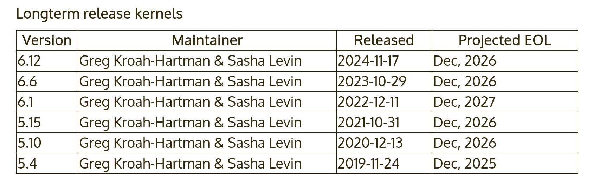

Linux Kernel Introduction

 

Linux Kernel

 

Introduction

 

© Copyright 2004-2025, Bootlin. embedded Linux and kernel engineering Creative Commons BY-SA 3.0 license.

Corrections, suggestions, contributions and translations are welcome!

 

- Kernel, drivers and embedded Linux - Development, consulting, training and support -https://bootlin.com 17/436

Origin

 

▶ The Linux kernel was created as a hobby in 1991 by a Finnish

student, Linus Torvalds.

*•* Linux quickly started to be used as the kernel for free software

operating systems

▶ Linus Torvalds has been able to create a large and dynamic

developer and user community around Linux.

▶ As of today, about 2,000+ people contribute to each kernel

release, individuals or companies big and small. Linus Torvalds in 2014 Image credits (Wikipedia):

<https://bit.ly/2UIa1TD>

 

- Kernel, drivers and embedded Linux - Development, consulting, training and support -https://bootlin.com 18/436 Linux kernel in the system

 

- Kernel, drivers and embedded Linux - Development, consulting, training and support -https://bootlin.com 19/436

Linux kernel main roles

 

▶ **Manage all the hardware resources**: CPU, memory, I/O. ▶ Provide a **set of portable, architecture and hardware independent APIs** to

allow user space applications and libraries to use the hardware resources. ▶ **Handle concurrent accesses and usage** of hardware resources from different

applications.

*•* Example: a single network interface is used by multiple user space applications

through various network connections. The kernel is responsible for “multiplexing” the hardware resource.

 

- Kernel, drivers and embedded Linux - Development, consulting, training and support -https://bootlin.com 20/436 System calls

 

▶ The main interface between the kernel and user space is

the set of system calls

▶ About 400 system calls that provide the main kernel

services

*•* File and device operations, networking operations,

inter-process communication, process management, memory mapping, timers, threads, synchronization primitives, etc.

▶ This system call interface is wrapped by the C library,

and user space applications usually never make a system

call directly but rather use the corresponding C library Image credits (Wikipedia):

<https://bit.ly/2U2rdGB>

function

 

- Kernel, drivers and embedded Linux - Development, consulting, training and support -https://bootlin.com 21/436

Pseudo filesystems

 

▶ Linux makes system and kernel information available in user space through

**pseudo filesystems**, sometimes also called **virtual filesystems** ▶ Pseudo filesystems allow applications to see directories and files that do not exist

on any real storage: they are created and updated on the fly by the kernel ▶ The two most important pseudo filesystems are

*•* proc, usually mounted on /proc:

Operating system related information (processes, memory management parameters...)

*•* sysfs, usually mounted on /sys:

Representation of the system as a tree of devices connected by buses. Information gathered by the kernel frameworks managing these devices.

 

- Kernel, drivers and embedded Linux - Development, consulting, training and support -https://bootlin.com 22/436

Linux Kernel Introduction

 

Linux kernel sources

 

- Kernel, drivers and embedded Linux - Development, consulting, training and support -https://bootlin.com 23/436

Location of the official kernel sources

 

▶ The mainline versions of the Linux kernel, as released by Torvalds

*•* These versions follow the development model of the kernel (master branch) *•* They may not contain the latest developments from a specific area yet *•* A good pick for products development phase

*•* <https://git.kernel.org/pub/scm/linux/kernel/git/torvalds/linux.git>

 

- Kernel, drivers and embedded Linux - Development, consulting, training and support -https://bootlin.com 24/436 Linux versioning scheme

 

▶ Until 2003, there was a new “stabilized” release branch of Linux every 2 or 3 years

(2.0, 2.2, 2.4). Development branches took 2-3 years to be merged (too slow!). ▶ Since 2003, there is a new official release of Linux about every 10 weeks:

*•* Versions 2.6 (Dec. 2003) to 2.6.39 (May 2011) *•* Versions 3.0 (Jul. 2011) to 3.19 (Feb. 2015) *•* Versions 4.0 (Apr. 2015) to 4.20 (Dec. 2018) *•* Versions 5.0 (Mar. 2019) to 5.19 (July 2022) *•* Version 6.0 was released in Oct. 2022.

▶ Features are added to the kernel in a progressive way. Since 2003, kernel

developers have managed to do so without having to introduce a massively

incompatible development branch.

 

- Kernel, drivers and embedded Linux - Development, consulting, training and support -https://bootlin.com 25/436 Linux development model

 

▶ Each new release starts with a two-week merge window for new features ▶ Follow about 8 release candidates (one week each) ▶ Until adoption of a new official release.

 

- Kernel, drivers and embedded Linux - Development, consulting, training and support -https://bootlin.com 26/436 Need to further stabilize the official kernels

 

▶ Issue: bug and security fixes only merged into the master branch, need to update

to the latest kernel to benefit from them.

▶ Solution: a stable maintainers team goes through all the patches merged into

Torvald’s tree and backports the relevant ones into their stable branches for at

least a few months.

 

- Kernel, drivers and embedded Linux - Development, consulting, training and support -https://bootlin.com 27/436

Location of the stable kernel sources

 

▶ The stable versions of the Linux kernel, as maintained by a maintainers group

*•* These versions do not bring new features compared to Linus’ tree *•* Only bug fixes and security fixes are pulled there *•* Each version is stabilized during the development period of the next mainline kernel *•* A good pick for products commercialization phase

*•* <https://git.kernel.org/pub/scm/linux/kernel/git/stable/linux.git> *•* Certain versions will be maintained much longer

 

- Kernel, drivers and embedded Linux - Development, consulting, training and support -https://bootlin.com 28/436 Need for long term support

 

▶ Issue: bug and security fixes only released for most recent kernel versions. ▶ Solution: the last release of each year is made an LTS *(Long Term Support)*

release, and is supposed to be supported (and receive bug and security fixes) for

up to 6 years.

 

Captured on <https://kernel.org> in Nov.

2023, following the [*Releases*](https://www.kernel.org/category/releases.html) link.

 

▶ Example at Google: starting from *Android O (2017)*, all new Android devices have

to run such an LTS kernel.

 

- Kernel, drivers and embedded Linux - Development, consulting, training and support -https://bootlin.com 29/436

Need for even longer term support

 

▶ You could also get long term support from a commercial embedded Linux

provider.

*•* Wind River Linux can be supported for up to 15 years. *•* Ubuntu Core can be supported for up to 10 years.

▶ *”If you are not using a supported distribution kernel, or a stable / longterm kernel,*

*you have an insecure kernel”*- Greg KH, 2019

Some vulnerabilities are fixed in stable without ever getting a CVE. ▶ The *Civil Infrastructure Platform* project is an industry / Linux Foundation effort

to support much longer (at least 10 years) selected LTS versions (currently 4.4,

4.19, 5.10 and 6.1) on selected architectures. See

<https://wiki.linuxfoundation.org/civilinfrastructureplatform/start>.

 

- Kernel, drivers and embedded Linux - Development, consulting, training and support -https://bootlin.com 30/436 Location of non-official kernel sources

 

▶ Many chip vendors supply their own kernel sources

*•* Focusing on hardware support first *•* Can have a very important delta with mainline Linux *•* Sometimes they break support for other platforms/devices without caring *•* Useful in early phases only when mainline hasn’t caught up yet (many vendors invest

in the mainline kernel at the same time)

*•* Suitable for PoC, not suitable for products on the long term as usually no updates

are provided to these kernels

*•* Getting stuck with a deprecated system with broken software that cannot be

updated has a real cost in the end

▶ Many kernel sub-communities maintain their own kernel, with usually newer but

fewer stable features, only for cutting-edge development

*•* Architecture communities (ARM, MIPS, PowerPC, etc) *•* Device drivers communities (I2C, SPI, USB, PCI, network, etc) *•* Other communities (filesystems, memory-management, scheduling, etc) *•* Not suitable to be used in products

- Kernel, drivers and embedded Linux - Development, consulting, training and support -https://bootlin.com 31/436

Linux kernel size and structure

 

▶ Linux v5.18 sources: close to 80k files, 35M lines, 1.3GiB ▶ But a compressed Linux kernel just sizes a few megabytes. ▶ So, why are these sources so big?

Because they include numerous device drivers, network protocols, architectures,

filesystems... The core is pretty small!

▶ As of kernel version v5.18 (in percentage of total number of lines):

 

▶ [drivers/](https://elixir.bootlin.com/linux/latest/source/drivers/)[:](https://elixir.bootlin.com/linux/latest/source/drivers/) 61.1% ▶ [include/](https://elixir.bootlin.com/linux/latest/source/include/)[:](https://elixir.bootlin.com/linux/latest/source/include/) 3.5% ▶ [scripts/](https://elixir.bootlin.com/linux/latest/source/scripts/)[,](https://elixir.bootlin.com/linux/latest/source/scripts/) [security/](https://elixir.bootlin.com/linux/latest/source/security/)[,](https://elixir.bootlin.com/linux/latest/source/security/) [crypto/](https://elixir.bootlin.com/linux/latest/source/crypto/),

▶ [block/,](https://elixir.bootlin.com/linux/latest/source/block/) [samples/](https://elixir.bootlin.com/linux/latest/source/samples/), [ipc/](https://elixir.bootlin.com/linux/latest/source/ipc/)[,](https://elixir.bootlin.com/linux/latest/source/ipc/) [virt/](https://elixir.bootlin.com/linux/latest/source/virt/)[,](https://elixir.bootlin.com/linux/latest/source/virt/) [arch/](https://elixir.bootlin.com/linux/latest/source/arch/): 11.6% ▶

[Documentation/:](https://elixir.bootlin.com/linux/latest/source/Documentation/)

[init/](https://elixir.bootlin.com/linux/latest/source/init/), [certs/](https://elixir.bootlin.com/linux/latest/source/certs/): \<0.5%

▶ 3.4%

[fs/](https://elixir.bootlin.com/linux/latest/source/fs/): 4.4% ▶ Build system files: [Kbuild](https://elixir.bootlin.com/linux/latest/source/Kbuild), ▶

▶ [kernel/](https://elixir.bootlin.com/linux/latest/source/kernel/): 1.3%

[sound/: ](https://elixir.bootlin.com/linux/latest/source/sound/)4.1% [Kconfig](https://elixir.bootlin.com/linux/latest/source/Kconfig), [Makefile](https://elixir.bootlin.com/linux/latest/source/Makefile)

▶ ▶ [lib/](https://elixir.bootlin.com/linux/latest/source/lib/)[:](https://elixir.bootlin.com/linux/latest/source/lib/) 0.7% [tools/](https://elixir.bootlin.com/linux/latest/source/tools/) [:](https://elixir.bootlin.com/linux/latest/source/tools/) 3.9% ▶ Other files: [COPYING](https://elixir.bootlin.com/linux/latest/source/COPYING)[,](https://elixir.bootlin.com/linux/latest/source/COPYING) [CREDITS](https://elixir.bootlin.com/linux/latest/source/CREDITS),

▶ ▶ [usr/](https://elixir.bootlin.com/linux/latest/source/usr/)[:](https://elixir.bootlin.com/linux/latest/source/usr/) 0.6% [MAINTAINERS](https://elixir.bootlin.com/linux/latest/source/MAINTAINERS)[,](https://elixir.bootlin.com/linux/latest/source/MAINTAINERS) [README](https://elixir.bootlin.com/linux/latest/source/README) [net/](https://elixir.bootlin.com/linux/latest/source/net/) [:](https://elixir.bootlin.com/linux/latest/source/net/) 3.7%

▶ [mm/](https://elixir.bootlin.com/linux/latest/source/mm/): 0.5%

- Kernel, drivers and embedded Linux - Development, consulting, training and support -https://bootlin.com 32/436 Practical lab - Downloading kernel source code

 

▶ Clone the mainline Linux source tree with git

 

- Kernel, drivers and embedded Linux - Development, consulting, training and support -https://bootlin.com 33/436

Linux Kernel Introduction

 

Linux kernel source code

 

- Kernel, drivers and embedded Linux - Development, consulting, training and support -https://bootlin.com 34/436 Programming language

 

▶ Implemented in C like all UNIX systems ▶ A little Assembly is used too:

*•* CPU and machine initialization, exceptions *•* Critical library routines.

▶ No C++ used, see <https://lkml.org/lkml/2004/1/20/20>

▶ Rust support is currently being introduced: [drivers/net/phy/ax88796b_rust.rs](https://elixir.bootlin.com/linux/latest/source/drivers/net/phy/ax88796b_rust.rs)

is a first driver written in Rust.

▶ All the code compiled with gcc

*•* Many gcc specific extensions used in the kernel code, any ANSI C compiler will not

compile the kernel

*•* See <https://gcc.gnu.org/onlinedocs/gcc-10.2.0/gcc/C-Extensions.html>

▶ A subset of the supported architectures can be built with the LLVM C compiler

(Clang) too: <https://clangbuiltlinux.github.io/>

 

- Kernel, drivers and embedded Linux - Development, consulting, training and support -https://bootlin.com 35/436

No C library

 

▶ The kernel has to be standalone and can’t use user space code. ▶ Architectural reason: user space is implemented on top of kernel services, not the

opposite.

▶ Technical reason: the kernel is on its own during the boot up phase, before it has

accessed a root filesystem.

▶ Hence, kernel code has to supply its own library implementations (string utilities,

cryptography, uncompression...)

▶ So, you can’t use standard C library functions in kernel code (printf(),

memset(), malloc(),...).

▶ Fortunately, the kernel provides similar C functions for your convenience, like

[printk(),](https://elixir.bootlin.com/linux/latest/ident/printk) [memset()](https://elixir.bootlin.com/linux/latest/ident/memset), [kmalloc()](https://elixir.bootlin.com/linux/latest/ident/kmalloc)[,](https://elixir.bootlin.com/linux/latest/ident/kmalloc) ...

 

- Kernel, drivers and embedded Linux - Development, consulting, training and support -https://bootlin.com 36/436 Portability

 

▶ The Linux kernel code is designed to be portable

▶ All code outside [arch/](https://elixir.bootlin.com/linux/latest/source/arch/) should be portable ▶ To this aim, the kernel provides macros and functions to abstract the architecture

specific details

*•* Endianness

*•* I/O memory access

*•* Memory barriers to provide ordering guarantees if needed *•* DMA API to flush and invalidate caches if needed

▶ Never use floating point numbers in kernel code. Your code may need to run on a

low-end processor without a floating point unit.

 

- Kernel, drivers and embedded Linux - Development, consulting, training and support -https://bootlin.com 37/436

Linux kernel to user API/ABI stability

**Linux kernel to user** **API** ☐ ✔ API stability **is** guaranteed, source code

is portable!

Linux kernel to userspace API is stable

▶ Source code for userspace applications will not have to

be updated when compiling for a more recent kernel

*•* System calls, /proc and /sys content cannot be

removed or changed. Only new entries can be added.

Linux kernel to userspace ABI is stable **Linux kernel to user** **ABI**

▶ ☐ ✔compatible ABI **can be** guaranteed, Binaries are portable and can be executed on a more binaries are portable

Linux v3.8

recent kernel LibreOffice

*•* Firefox The way memory is accessed, the size of the variables in Emacs Linux v4.14

memory, how structures are organized, the calling Gimp VLC

et al.

convention, etc, are all stable over time. compiled against Linux v5.19

LSB 5.0 for x86-64

compiled against

LSB 5.0 for x86-64

Modified Image from Wikipedia:

<https://bit.ly/2U2rdGB>

- Kernel, drivers and embedded Linux - Development, consulting, training and support -https://bootlin.com 38/436 Linux internal API/ABI instability

**Linux internal** **API** ✘ ☐ API stability **is not** guaranteed,

Linux internal API is not stable source code portability is not given

▶ The source code of a driver is not portable across

versions

*•* In-tree drivers are updated by the developer proposing

the API change: works great for mainline code

*•* An out-of-tree driver compiled for a given version may

 

*•* no longer compile or work on a more recent one **Linux internal** **ABI** See [process/stable-api-nonsense](https://www.kernel.org/doc/html/latest/process/stable-api-nonsense.html) for reasons why ☐ ✘ **no** stable ABI over Linux kernel releases, binaries are not portable

Linux internal ABI is not stable ✘

▶ in Linux v5.19 A binary module compiled for a given kernel version

cannot be used with another version ✘

*•* compiled for in Linux v5.18 The module loading utilities will perform this check Linux v5.17

prior to the insertion ✔

in Linux v5.17

Modified Image from Wikipedia:

<https://bit.ly/2U2rdGB>

- Kernel, drivers and embedded Linux - Development, consulting, training and support -https://bootlin.com 39/436 Kernel memory constraints

 

▶ No memory protection

▶ The kernel doesn’t try to recover from attemps to access illegal memory locations.

It just dumps *oops* messages on the system console. ▶ Fixed size stack (8 or 4 KB). Unlike in user space, no mechanism was

implemented to make it grow. Don’t use recursion! ▶ Swapping is not implemented for kernel memory either

(except *tmpfs* which lives completely in the page cache and on swap)

 

- Kernel, drivers and embedded Linux - Development, consulting, training and support -https://bootlin.com 40/436 Linux kernel licensing constraints

 

▶ The Linux kernel is licensed under the GNU General Public License version 2

*•* This license gives you the right to use, study, modify and share the software freely

▶ However, when the software is redistributed, either modified or unmodified, the

GPL requires that you redistribute the software under the same license, with the

source code

*•* If modifications are made to the Linux kernel (for example to adapt it to your

hardware), it is a derivative work of the kernel, and therefore must be released under GPLv2.

▶ The GPL license has been successfully enforced in courts:

<https://en.wikipedia.org/wiki/Gpl-violations.org#Notable_victories> ▶ However, you’re only required to do so

*•* At the time the device starts to be distributed *•* To your customers, not to the entire world

 

- Kernel, drivers and embedded Linux - Development, consulting, training and support -https://bootlin.com 41/436

Proprietary code and the kernel

 

▶ It is illegal to distribute a binary kernel that includes statically compiled

proprietary drivers

▶ The kernel modules are a gray area: unclear if they are legal or not

*•* The general opinion of the kernel community is that proprietary modules are bad:

[process/kernel-driver-statement](https://www.kernel.org/doc/html/latest/process/kernel-driver-statement.html)

*•* From a legal point of view, each driver is probably a different case:

Are they derived works of the kernel?

Are they designed to be used with another operating system?

▶ Is it really useful to keep drivers secret anyway?

 

- Kernel, drivers and embedded Linux - Development, consulting, training and support -https://bootlin.com 42/436 Abusing the kernel licensing constraints

 

▶ There are some examples of ▶ The current trend is to hide the logic proprietary drivers in the firmware or in userspace. The *•* Nvidia uses a wrapper between their GPL kernel driver is almost empty and

 

*•* They claim the drivers could be used *•* drivers and the kernel either: Blindly writes an incoming flow of

with a different OS with another

bytes in the hardware

 

*•* Unclear whether it makes it legal or userspace through wrapper *•* Exposes a huge MMIO region to mmap

not

 

- Kernel, drivers and embedded Linux - Development, consulting, training and support -https://bootlin.com 43/436

Advantages of GPL drivers

 

▶ You don’t have to write your driver from scratch. You can reuse code from similar

free software drivers.

▶ Your drivers can be freely and easily shipped by others (for example by Linux

distributions or embedded Linux build systems). ▶ Legal certainty, you are sure that a GPL driver is fine from a legal point of view.

 

- Kernel, drivers and embedded Linux - Development, consulting, training and support -https://bootlin.com 44/436 Advantages of mainlining your kernel drivers

 

▶ The community, reviewers and maintainers will review your code before accepting

it, offering you the opportunity to enhance it and understand better the internal

APIs.

▶ Once accepted, you will get cost-free bug and security fixes, support for new

features, and general improvements.

▶ Your work will automatically follow the API changes. ▶ Accessing your code will be much easier for users. ▶ Your code will remain valid no matter the kernel version.

This will for sure reduce your maintenance and support work

 

- Kernel, drivers and embedded Linux - Development, consulting, training and support -https://bootlin.com 45/436

User space device drivers 1/2

 

▶ The kernel provides some mechanisms to access hardware from userspace:

*•* USB devices with *libusb*, <https://libusb.info/>

*•* SPI devices with *spidev*, [spi/spidev](https://www.kernel.org/doc/html/latest/spi/spidev.html)

*•* I2C devices with *i2cdev*, [i2c/dev-interface](https://www.kernel.org/doc/html/latest/i2c/dev-interface.html)

*•* GPIOs with *libgpiod*, <https://libgpiod.readthedocs.io> *•* Memory-mapped devices with *UIO*, including interrupt handling,

[driver-api/uio-howto](https://www.kernel.org/doc/html/latest/driver-api/uio-howto.html)

▶ These solutions can only be used if:

*•* There is no need to leverage an existing kernel subsystem such as the networking

stack or filesystems.

*•* There is no need for the kernel to act as a “multiplexer” for the device: only one

application accesses the device.

▶ Certain classes of devices like printers and scanners do not have any kernel

support, they have always been handled in user space for historical reasons. ▶ Otherwise this is ***not*** how the system should be architectured. Kernel drivers

should always be preferred!

- Kernel, drivers and embedded Linux - Development, consulting, training and support -https://bootlin.com 46/436 User space device drivers 2/2

 

▶ Advantages

*•* No need for kernel coding skills. *•* Drivers can be written in any language, even Perl! *•* Drivers can be kept proprietary.

*•* Driver code can be killed and debugged. Cannot crash the kernel. *•* Can use floating-point computation. *•* Potentially higher performance, especially for memory-mapped devices, thanks to the

avoidance of system calls.

▶ Drawbacks

*•* The kernel has no longer access to the device. *•* None of the standard applications will be able to use it. *•* Cannot use any hardware abstraction or software helpers from the kernel *•* Need to adapt applications when changing the hardware. *•* Less straightforward to handle interrupts: increased latency.

 

- Kernel, drivers and embedded Linux - Development, consulting, training and support -https://bootlin.com 47/436

Practical lab - Kernel Source Code - Exploring

 

▶ Explore kernel sources manually ▶ Use automated tools to explore the source code

 

- Kernel, drivers and embedded Linux - Development, consulting, training and support -https://bootlin.com 48/436