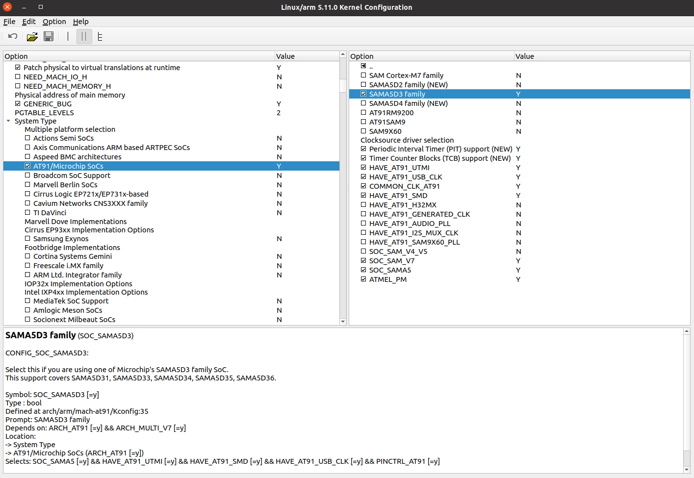
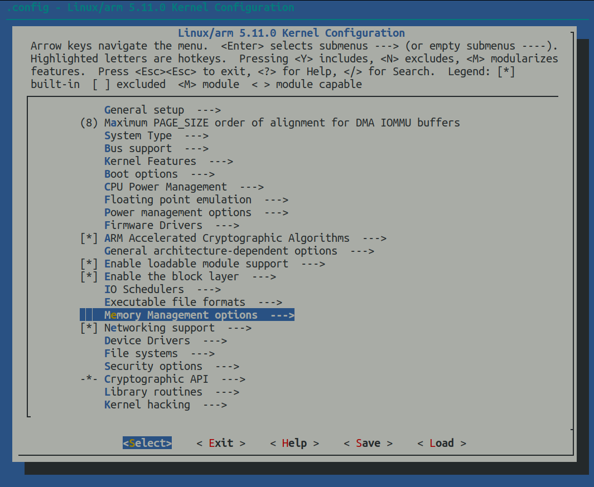
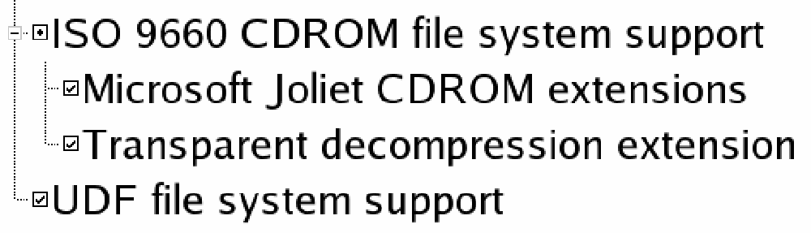
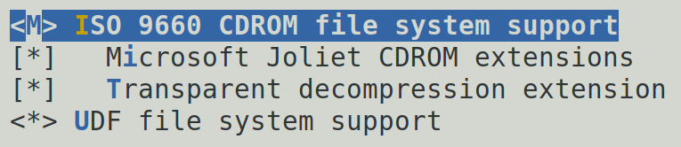
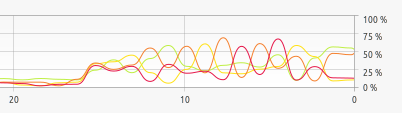
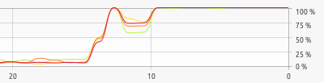
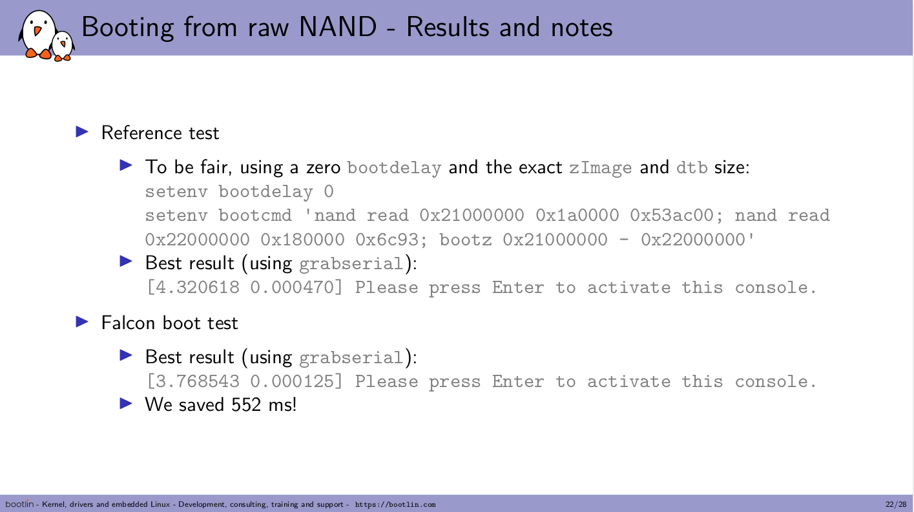

Linux Kernel Usage

 

 

© Copyright 2004-2025, Bootlin. embedded Linux and kernel engineering Creative Commons BY-SA 3.0 license.

Corrections, suggestions, contributions and translations are welcome!

 

- Kernel, drivers and embedded Linux - Development, consulting, training and support -https://bootlin.com 49/436

 

Kernel configuration

 

- Kernel, drivers and embedded Linux - Development, consulting, training and support -https://bootlin.com 50/436 Kernel configuration

 

▶ The kernel contains thousands of device drivers, filesystem drivers, network

protocols and other configurable items

▶ Thousands of options are available, that are used to selectively compile parts of

the kernel source code

▶ The kernel configuration is the process of defining the set of options with which

you want your kernel to be compiled

▶ The set of options depends

*•* On the target architecture and on your hardware (for device drivers, etc.) *•* On the capabilities you would like to give to your kernel (network capabilities,

filesystems, real-time, etc.). Such generic options are available in all architectures.

 

- Kernel, drivers and embedded Linux - Development, consulting, training and support -https://bootlin.com 51/436

Kernel configuration and build system

 

▶ The kernel configuration and build system is based on multiple Makefiles

▶ One only interacts with the main [Makefile](https://elixir.bootlin.com/linux/latest/source/Makefile), present at the **top directory** of the

kernel source tree

▶ Interaction takes place

*•* using the make tool, which parses the Makefile *•* through various **targets**, defining which action should be done (configuration,

compilation, installation, etc.).

*•* Run make help to see all available targets.

▶ Example

*•* cd linux/

*•* make \<target\>

 

- Kernel, drivers and embedded Linux - Development, consulting, training and support -https://bootlin.com 52/436 Specifying the target architecture

 

First, specify the architecture for the kernel to build

▶ Set ARCH to the name of a directory under [arch/](https://elixir.bootlin.com/linux/latest/source/arch/):

ARCH=arm or ARCH=arm64 or ARCH=riscv, etc ▶ By default, the kernel build system assumes that the kernel is configured and built

for the host architecture (x86 in our case, native kernel compiling) ▶ The kernel build system will use this setting to:

*•* Use the configuration options for the target architecture. *•* Compile the kernel with source code and headers for the target architecture.

 

- Kernel, drivers and embedded Linux - Development, consulting, training and support -https://bootlin.com 53/436

Choosing a compiler

 

The compiler invoked by the kernel Makefile is \$(CROSS_COMPILE)gcc

▶ Specifying the compiler is already needed at configuration time, as some kernel

configuration options depend on the capabilities of the compiler. ▶ When compiling natively

*•* Leave CROSS_COMPILE undefined and the kernel will be natively compiled for the host

architecture using gcc.

▶ When using a cross-compiler

*•* Specify the prefix of your cross-compiler executable, for example for

arm-linux-gnueabi-gcc:

CROSS_COMPILE=arm-linux-gnueabi-

Set LLVM to 1 to compile your kernel with Clang.

See our [LLVM tools for the Linux kernel](https://bootlin.com/pub/conferences/2022/lee/opdenacker-llvm-tools-for-linux-kernel/opdenacker-llvm-tools-for-linux-kernel.pdf) presentation.

 

- Kernel, drivers and embedded Linux - Development, consulting, training and support -https://bootlin.com 54/436 Specifying ARCH and CROSS_COMPILE

 

There are actually two ways of defining ARCH and CROSS_COMPILE:

▶ Pass ARCH and CROSS_COMPILE on the make command line:

make ARCH=arm CROSS_COMPILE=arm-linux- ...

Drawback: it is easy to forget to pass these variables when you run any make

command, causing your build and configuration to be screwed up. ▶ Define ARCH and CROSS_COMPILE as environment variables:

export ARCH=arm

export CROSS_COMPILE=arm-linux-

Drawback: it only works inside the current shell or terminal. You could put these

settings in a file that you source every time you start working on the project, see

also the <https://direnv.net/> project.

 

- Kernel, drivers and embedded Linux - Development, consulting, training and support -https://bootlin.com 55/436

Initial configuration

 

Difficult to find which kernel configuration will work with your hardware and root filesystem. Start with one that works!

▶ Desktop or server case:

*•* Advisable to start with the configuration of your running kernel:

cp /boot/config-\`uname -r\` .config

▶ Embedded platform case:

*•* Default configurations stored in-tree as minimal configuration files (only listing

settings that are different with the defaults) in arch/\<arch\>/configs/

*•* make help will list the available configurations for your platform *•* To load a default configuration file, just run make foo_defconfig (will erase your

current .config!)

On ARM 32-bit, there is usually one default configuration per CPU family On ARM 64-bit, there is only one big default configuration to customize

 

- Kernel, drivers and embedded Linux - Development, consulting, training and support -https://bootlin.com 56/436 Create your own default configuration

 

▶ Use a tool such as make menuconfig to make changes to the configuration ▶ Saving your changes will overwrite your .config (not tracked by Git) ▶ When happy with it, create your own default configuration file:

*•* Create a minimal configuration (non-default settings) file:

make savedefconfig

*•* Save this default configuration in the right directory:

mv defconfig arch/\<arch\>/configs/myown_defconfig

*•* Add this file to Git.

▶ This way, you can share a reference configuration inside the kernel sources and

other developers can now get the same .config as you by running

make myown_defconfig

▶ When you use an embedded build system (Buildroot, OpenEmbedded) use its

specific commands. E.g. make linux-menuconfig and

make linux-update-defconfig in Buildroot.

 

- Kernel, drivers and embedded Linux - Development, consulting, training and support -https://bootlin.com 57/436

Built-in or module?

 

▶ The **kernel image** is a **single file**, resulting from the linking of all object files that

correspond to features enabled in the configuration

*•* This is the file that gets loaded in memory by the bootloader *•* All built-in features are therefore available as soon as the kernel starts, at a time

where no filesystem exists

▶ Some features (device drivers, filesystems, etc.) can however be compiled as

**modules**

*•* These are *plugins* that can be loaded/unloaded dynamically to add/remove features

to the kernel

*•* Each **module is stored as a separate file in the filesystem**, and therefore access

to a filesystem is mandatory to use modules

*•* This is not possible in the early boot procedure of the kernel, because no filesystem

is available

 

- Kernel, drivers and embedded Linux - Development, consulting, training and support -https://bootlin.com 58/436 Kernel option types

 

There are different types of options, defined in Kconfig files:

▶ bool options, they are either

*•* *true* (to include the feature in the kernel) or *•* *false* (to exclude the feature from the kernel)

▶ tristate options, they are either

*•* *true* (to include the feature in the kernel image) or *•* *module* (to include the feature as a kernel module) or *•* *false* (to exclude the feature)

▶ int options, to specify integer values ▶ hex options, to specify hexadecimal values

Example: [CONFIG_PAGE_OFFSET=0xC0000000](https://elixir.bootlin.com/linux/latest/K/ident/CONFIG_PAGE_OFFSET) ▶ string options, to specify string values

Example: [CONFIG_LOCALVERSION=-no-network](https://elixir.bootlin.com/linux/latest/K/ident/CONFIG_LOCALVERSION)

Useful to distinguish between two kernels built from different options

 

- Kernel, drivers and embedded Linux - Development, consulting, training and support -https://bootlin.com 59/436

Kernel option dependencies

Enabling a network driver requires the network stack to be enabled, therefore configuration symbols have two ways to express dependencies:

▶ depends on dependency: ▶ select dependency:

config B config A

depends on A select B

*•* B is not visible until A is *•* When A is enabled, B is enabled too (and

enabled cannot be disabled manually)

*•* Works well for dependency *•* Should preferably not select symbols with

chains depends on dependencies

*•* Used to declare hardware features or select

libraries

config SPI_ATH79

tristate "Atheros AR71XX/AR724X/AR913X SPI controller driver" depends on ATH79 \|\| COMPILE_TEST

select SPI_BITBANG

help

This enables support for the SPI controller present on the Atheros AR71XX/AR724X/AR913X SoCs.

- Kernel, drivers and embedded Linux - Development, consulting, training and support -https://bootlin.com 60/436 Kernel configuration details

 

\#

\# CD-ROM/DVD Filesystems

 

▶ \# The configuration is stored in the .config file at CONFIG_ISO9660_FS=m

the root of kernel sources CONFIG_JOLIET=y

*•* Simple text file, CONFIG_PARAM=value CONFIG_ZISOFS=y *•* CONFIG_UDF_FS=y Options are grouped by sections and are prefixed

with \# end of CD-ROM/DVD Filesystems CONFIG\_

*•* ”No” value is encoded as

\# CONFIG_FOO is not set \#

*•* \# DOS/FAT/EXFAT/NT Filesystems Included by the top-level kernel Makefile \#

*•* Typically not edited by hand because of the CONFIG_FAT_FS=y

dependencies CONFIG_MSDOS_FS=y

\# CONFIG_VFAT_FS is not set

CONFIG_FAT_DEFAULT_CODEPAGE=437

\# CONFIG_EXFAT_FS is not set

 

- Kernel, drivers and embedded Linux - Development, consulting, training and support -https://bootlin.com 61/436

xconfig

 

make xconfig

▶ A graphical interface to configure the

kernel.

▶ File browser: easy to load

configuration files

▶ Search interface to look for

parameters (\[Ctrl\] + \[f\])

▶ Required Debian/Ubuntu packages:

qtbase5-dev on Ubuntu 22.04

 

- Kernel, drivers and embedded Linux - Development, consulting, training and support -https://bootlin.com 62/436 menuconfig

 

make menuconfig

▶ Useful when no graphics are available.

Very efficient interface.

▶ Same interface found in other tools:

BusyBox, Buildroot...

▶ Convenient number shortcuts to jump

directly to search results.

▶ Required Debian/Ubuntu packages:

libncurses-dev

▶ Alternative: make nconfig

(now also has the number shortcuts)

 

- Kernel, drivers and embedded Linux - Development, consulting, training and support -https://bootlin.com 63/436

Kernel configuration options

 

You can switch from one tool to another, they all load/save the same .config file, and show the same set of options

Compiled as a module:

CONFIG_ISO9660_FS=m

Additional driver options:

CONFIG_JOLIET=y

CONFIG_ZISOFS=y

Statically built:

CONFIG_UDF_FS=y

Values in resulting .config file Parameter values as displayed by xconfig Parameter values as displayed by menuconfig

 

- Kernel, drivers and embedded Linux - Development, consulting, training and support -https://bootlin.com 64/436 make oldconfig

 

make oldconfig

▶ Useful to upgrade a .config file from an earlier kernel release ▶ Asks for values for new parameters. ▶ ... unlike make menuconfig and make xconfig which silently set default values

for new parameters.

If you edit a .config file by hand, it’s useful to run make oldconfig afterwards, to set values to new parameters that could have appeared because of dependency changes.

 

- Kernel, drivers and embedded Linux - Development, consulting, training and support -https://bootlin.com 65/436

Undoing configuration changes

 

A frequent problem:

▶ After changing several kernel configuration settings, your kernel no longer works. ▶ If you don’t remember all the changes you made, you can get back to your

previous configuration:

\$ cp .config.old .config

▶ All the configuration tools keep this .config.old backup copy.

 

- Kernel, drivers and embedded Linux - Development, consulting, training and support -https://bootlin.com 66/436

 

Compiling and installing the kernel

 

- Kernel, drivers and embedded Linux - Development, consulting, training and support -https://bootlin.com 67/436

Kernel compilation

 

make Tests on Linux 5.11 on arm

configuration

▶ showing the load on 4 threads / 2 CPUs Only works from the top kernel source directory ▶ Should not be performed as a privileged user ▶ Run several **j**obs in parallel. Our advice: \$(nproc) to

fully load the CPU and I/Os at all times. Command: make Total time: 129 s

Example: make -j20

▶ To **re**compile faster (7x according to some benchmarks),

use the ccache compiler cache:

export CROSS_COMPILE="ccache arm-linux-" Command: make -j8 Total time: 67 s

 

- Kernel, drivers and embedded Linux - Development, consulting, training and support -https://bootlin.com 68/436 Kernel compilation results

 

▶ arch/\<arch\>/boot/Image, uncompressed kernel image that can be booted ▶ arch/\<arch\>/boot/\*Image\*, compressed kernel images that can also be booted

*•* bzImage for x86, zImage for ARM, Image.gz for RISC-V, vmlinux.bin.gz for ARC,

etc.

▶ arch/\<arch\>/boot/dts/\<vendor\>/\*.dtb, compiled Device Tree Blobs ▶ All kernel modules, spread over the kernel source tree, as .ko (*Kernel Object*) files. ▶ vmlinux, a raw uncompressed kernel image in the ELF format, useful for

debugging purposes but generally not used for booting purposes

 

- Kernel, drivers and embedded Linux - Development, consulting, training and support -https://bootlin.com 69/436

Kernel installation: native case

 

▶ sudo make install

*•* Does the installation for the host system by default

▶ Installs

*•* /boot/vmlinuz-\<version\>

Compressed kernel image. Same as the one in arch/\<arch\>/boot

*•* /boot/System.map-\<version\>

Stores kernel symbol addresses for debugging purposes (obsolete: such information is usually stored in the kernel itself)

*•* /boot/config-\<version\>

Kernel configuration for this version

▶ In GNU/Linux distributions, typically re-runs the bootloader configuration utility

to make the new kernel available at the next boot.

 

- Kernel, drivers and embedded Linux - Development, consulting, training and support -https://bootlin.com 70/436 Kernel installation: embedded case

 

▶ make install is rarely used in embedded development, as the kernel image is a

single file, easy to handle.

▶ Another reason is that there is no standard way to deploy and use the kernel

image.

▶ Therefore making the kernel image available to the target is usually manual or

done through scripts in build systems.

▶ It is however possible to customize the make install behavior in

arch/\<arch\>/boot/install.sh

 

- Kernel, drivers and embedded Linux - Development, consulting, training and support -https://bootlin.com 71/436

Module installation: native case

 

▶ sudo make modules_install

*•* Does the installation for the host system by default, so needs to be run as root

▶ Installs all modules in /lib/modules/\<version\>/

*•* kernel/

Module .ko (Kernel Object) files, in the same directory structure as in the sources.

*•* modules.alias, modules.alias.bin

Aliases for module loading utilities , see next slide

*•* modules.dep, modules.dep.bin

Module dependencies. Kernel modules can depend on other modules, based on the symbols (functions and data structures) they use.

*•* modules.symbols, modules.symbols.bin

Tells which module a given symbol belongs to (related to module dependencies).

*•* modules.builtin

List of built-in modules of the kernel.

 

- Kernel, drivers and embedded Linux - Development, consulting, training and support -https://bootlin.com 72/436 Module alias: *modules.alias*

 

- Kernel, drivers and embedded Linux - Development, consulting, training and support -https://bootlin.com 73/436

Module installation: embedded case

 

▶ In embedded development, you can’t directly use make modules_install as it

would install target modules in /lib/modules on the host! ▶ The INSTALL_MOD_PATH variable is needed to generate the module related files

and install the modules in the target root filesystem instead of your host root

filesystem (no need to be root):

make INSTALL_MOD_PATH=\<dir\>/ modules_install

 

- Kernel, drivers and embedded Linux - Development, consulting, training and support -https://bootlin.com 74/436 Kernel cleanup targets

 

▶ From make help:

Cleaning targets:

clean - Remove most generated files but keep the config and

enough build support to build external modules

mrproper - Remove all generated files + config + various backup files distclean - mrproper + remove editor backup and patch files

 

▶ If you are in a git tree, remove all files not tracked (and ignored) by git:

git clean -fdx

 

- Kernel, drivers and embedded Linux - Development, consulting, training and support -https://bootlin.com 75/436

Kernel building overview

 

- Kernel, drivers and embedded Linux - Development, consulting, training and support -https://bootlin.com 76/436

 

Booting the kernel

 

- Kernel, drivers and embedded Linux - Development, consulting, training and support -https://bootlin.com 77/436

Hardware description

 

▶ Many embedded architectures have a lot of non-discoverable hardware (serial,

Ethernet, I2C, Nand flash, USB controllers...) ▶ This hardware needs to be described and passed to the Linux kernel. ▶ The bootloader/firmware is expected to provide this description when starting the

kernel:

*•* On x86: using ACPI tables

*•* On most embedded devices: using an OpenFirmware Device Tree (DT)

▶ This way, a kernel supporting different SoCs knows which SoC and device

initialization hooks to run on the current board.

 

- Kernel, drivers and embedded Linux - Development, consulting, training and support -https://bootlin.com 78/436 Booting with U-Boot

 

▶ On ARM32, U-Boot can boot zImage (bootz command) ▶ On ARM64 or RISC-V, it boots the Image file (booti command) ▶ In addition to the kernel image, U-Boot should also pass a DTB to the kernel. ▶ The typical boot process is therefore:

1. Load zImage at address X in memory 2. Load \<board\>.dtb at address Y in memory 3. Start the kernel with boot\[z\|i\] X - Y

The-in the middle indicates no *initramfs*

 

- Kernel, drivers and embedded Linux - Development, consulting, training and support -https://bootlin.com 79/436 Kernel command line

 

▶ In addition to the compile time configuration, the kernel behavior can be adjusted

with no recompilation using the **kernel command line** ▶ The kernel command line is a string that defines various arguments to the kernel

*•* It is very important for system configuration *•* root= for the root filesystem (covered later) *•* console= for the destination of kernel messages *•* Example: console=ttyS0 root=/dev/mmcblk0p2 rootwait *•* Many more exist. The most important ones are documented in

[admin-guide/kernel-parameters](https://www.kernel.org/doc/html/latest/admin-guide/kernel-parameters.html) in kernel documentation.

 

- Kernel, drivers and embedded Linux - Development, consulting, training and support -https://bootlin.com 80/436 Passing the kernel command line

 

▶ U-Boot carries the Linux kernel command line string in

its See the ”Understanding U-Boot Falcon bootargs environment variable

Mode” presentation from Michael

▶ Opdenacker, for details about how U-Boot

Right before starting the kernel, it will store the boots Linux. contents of bootargs in the chosen section of the Device Tree

▶ The kernel will behave differently depending on its

configuration:

*•* If [CONFIG_CMDLINE_FROM_BOOTLOADER](https://elixir.bootlin.com/linux/latest/K/ident/CONFIG_CMDLINE_FROM_BOOTLOADER) is set:

The kernel will use only the string from the bootloader

*•* If [CONFIG_CMDLINE_FORCE](https://elixir.bootlin.com/linux/latest/K/ident/CONFIG_CMDLINE_FORCE) is set:

The kernel will only use the string received at Slides: [https:](https://bootlin.com/pub/conferences/2021/lee/) [//bootlin.com/pub/conferences/2021/lee/](https://bootlin.com/pub/conferences/2021/lee/)

configuration time in [CONFIG_CMDLINE](https://elixir.bootlin.com/linux/latest/K/ident/CONFIG_CMDLINE) Video: [https:](https://www.youtube.com/watch?v=LFe3x2QMhSo)

*•* [//www.youtube.com/watch?v=LFe3x2QMhSo](https://www.youtube.com/watch?v=LFe3x2QMhSo) If [CONFIG_CMDLINE_EXTEND](https://elixir.bootlin.com/linux/latest/K/ident/CONFIG_CMDLINE_EXTEND) is set:

The kernel will concatenate both strings

 

- Kernel, drivers and embedded Linux - Development, consulting, training and support -https://bootlin.com 81/436

Kernel log

 

▶ The kernel keeps its messages in a circular buffer in memory

*•* The size is configurable using [CONFIG_LOG_BUF_SHIFT](https://elixir.bootlin.com/linux/latest/K/ident/CONFIG_LOG_BUF_SHIFT)

▶ When a module is loaded, related information is available in the kernel log. ▶ Kernel log messages are available through the dmesg command (**d**iagnostic

**mes**sa**g**e)

▶ Kernel log messages are also displayed on the console pointed by the console=

kernel command line argument

*•* Console messages can be filtered by level using the loglevel parameter:

loglevel= allows to filter messages displayed on the console based on priority ignore_loglevel (same as loglevel=8) will lead to all messages being printed quiet (same as loglevel=0) prevents any message from being displayed on the console

*•* Example: console=ttyS0 root=/dev/mmcblk0p2 loglevel=5

▶ It is possible to write to the kernel log from user space:

echo "\<n\>Debug info" \> /dev/kmsg

- Kernel, drivers and embedded Linux - Development, consulting, training and support -https://bootlin.com 82/436 Practical lab - Kernel compiling and booting

 

1st lab: board and bootloader setup:

▶ Prepare the board and access its serial port ▶ Configure its bootloader to use TFTP

2nd lab: kernel compiling and booting:

▶ Set up a cross-compiling environment ▶ Cross-compile a kernel for an ARM target

platform

▶ Boot this kernel from a directory on your

workstation, accessed by the board through

NFS

 

- Kernel, drivers and embedded Linux - Development, consulting, training and support -https://bootlin.com 83/436

 

Using kernel modules

 

- Kernel, drivers and embedded Linux - Development, consulting, training and support -https://bootlin.com 84/436 Advantages of modules

 

▶ Modules make it easy to develop drivers without

rebooting: load, test, unload, rebuild, load...

▶ Useful to keep the kernel image size to the minimum

(essential in GNU/Linux distributions for PCs).

▶ Also useful to reduce boot time: you don’t spend time

initializing devices and kernel features that you only

need later.

▶ Caution: once loaded, have full control and privileges in

the system. No particular protection. That’s why only the root user can load and unload modules.

▶ To increase security, possibility to allow only signed

modules, or to disable module support entirely.

 

- Kernel, drivers and embedded Linux - Development, consulting, training and support -https://bootlin.com 85/436

Module utilities: extracting information

 

\<module_name\>: name of the module file without the trailing .ko

▶ modinfo \<module_name\> (for modules in /lib/modules)

modinfo \<module_path\>.ko

Gets information about a module without loading it: parameters, license,

description and dependencies.

 

- Kernel, drivers and embedded Linux - Development, consulting, training and support -https://bootlin.com 86/436 Module utilities: loading

 

▶ sudo insmod \<module_path\>.ko

Tries to load the given module. The full path to the module object file must be

given.

▶ sudo modprobe \<top_module_name\>

Most common usage of modprobe: tries to load all the dependencies of the given

top module, and then this module. Lots of other options are available. modprobe

automatically looks in /lib/modules/\<version\>/ for the object file

corresponding to the given module name.

▶ lsmod

Displays the list of loaded modules

Compare its output with the contents of /proc/modules!

 

- Kernel, drivers and embedded Linux - Development, consulting, training and support -https://bootlin.com 87/436

Understanding module loading issues

 

▶ When loading a module fails, insmod often doesn’t give you enough details! ▶ Details are often available in the kernel log. ▶ Example:

\$ sudo insmod ./intr_monitor.ko

insmod: error inserting './intr_monitor.ko': -1 Device or resource busy

\$ dmesg

\[17549774.552000\] Failed to register handler for irq channel 2

 

- Kernel, drivers and embedded Linux - Development, consulting, training and support -https://bootlin.com 88/436 Module utilities: removals

 

▶ sudo rmmod \<module_name\>

Tries to remove the given module.

Will only be allowed if the module is no longer in use (for example, no more

processes opening a device file)

▶ sudo modprobe -r \<top_module_name\>

Tries to remove the given top module and all its no longer needed dependencies

 

- Kernel, drivers and embedded Linux - Development, consulting, training and support -https://bootlin.com 89/436 Passing parameters to modules

 

▶ Find available parameters:

modinfo usb-storage

▶ Through insmod:

sudo insmod ./usb-storage.ko delay_use=0 ▶ Through modprobe:

Set parameters in /etc/modprobe.conf or in any file in /etc/modprobe.d/:

options usb-storage delay_use=0

▶ Through the kernel command line, when the module is built statically into the

kernel:

usb-storage.delay_use=0

*•* usb-storage is the *module name* *•* delay_use is the *module parameter name*. It specifies a delay before accessing a

USB storage device (useful for rotating devices).

*•* 0 is the *module parameter value*

 

- Kernel, drivers and embedded Linux - Development, consulting, training and support -https://bootlin.com 90/436 Check module parameter values

 

How to find/edit the current values for the parameters of a loaded module?

▶ Check /sys/module/\<name\>/parameters. ▶ There is one file per parameter, containing the parameter value. ▶ Also possible to change parameter values if these files have write permissions

(depends on the module code).

▶ Example:

echo 0 \> /sys/module/usb_storage/parameters/delay_use

 

- Kernel, drivers and embedded Linux - Development, consulting, training and support -https://bootlin.com 91/436

