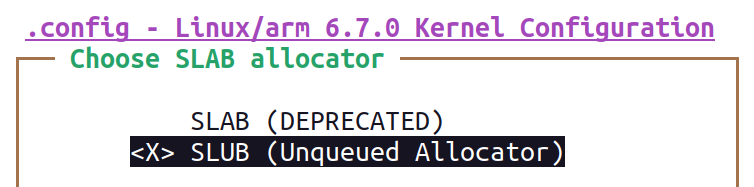
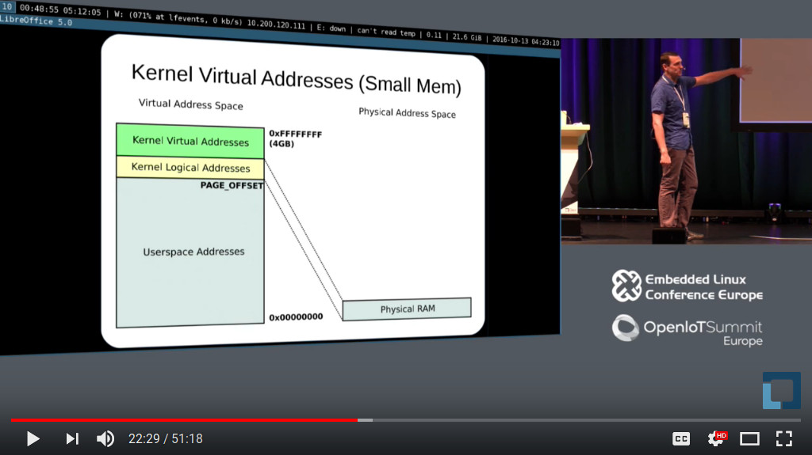

Memory Management

Memory Management

© Copyright 2004-2025, Bootlin. embedded Linux and kernel engineering Creative Commons BY-SA 3.0 license.

Corrections, suggestions, contributions and translations are welcome!

Physical and virtual memory

Virtual memory organization

▶ The top quarter reserved for kernel-space

*•* Contains kernel code and core data structures *•* Allocations for loading modules *•* All kernel physical mappings *•* Identical in all address spaces

▶ The lower part is a per user process exclusive mapping

*•* Process code and data (program, stack, ...) *•* Memory-mapped files *•* Each process has its own address space!

▶ The exact virtual mapping in-use is displayed in the

kernel log early at boot time

Physical/virtual memory mapping on 32-bit systems

32-bit systems limitations

▶ Only less than 1GB memory addressable directly through kernel virtual addresses ▶ If more physical memory is present on the platform, part of the memory will not

be accessible by kernel space, but can be used by user space ▶ To allow the kernel to access more physical memory:

*•* Change the 3GB/1GB memory split to 2GB/2GB or 1GB/3GB ([CONFIG_VMSPLIT_2G](https://elixir.bootlin.com/linux/latest/K/ident/CONFIG_VMSPLIT_2G)

or [CONFIG_VMSPLIT_1G)](https://elixir.bootlin.com/linux/latest/K/ident/CONFIG_VMSPLIT_1G)) *⇒* reduce total user memory available for each process

*•* Activate *highmem* support if available for your architecture:

Allows kernel to map parts of its non-directly accessible memory Mapping must be requested explicitly

Limited addresses ranges reserved for this usage

▶ See Arnd Bergmann’s *4GB by 4GB split* presentation ([video and slides](https://resources.linaro.org/en/resource/TXkzgNDFp3HiJKdfQjbssL)) at Linaro

Connect virtual 2020.

Physical/virtual memory mapping on 64-bit systems (4kiB-pages)

User space virtual address space

▶ When a process

starts, the executable

code is loaded in

RAM and mapped

into the process

virtual address space.

▶ During execution,

additional mappings

can be created:

*•* Memory

allocations

*•* Memory mapped

files

*•* mmap’ed areas

*•* ...

Userspace memory allocations

▶ Userspace mappings can target the full memory ▶ When allocated, memory may not be physically allocated:

*•* Kernel uses demand fault paging to allocate the physical page (the physical page is

allocated when access to the virtual address generates a page fault)

*•* ... or may have been swapped out, which also induces a page fault

See the mlock/mlockall system calls for workarounds

▶ User space memory allocation is allowed to over-commit memory (more than

available physical memory) *⇒* can lead to out of memory situations.

*•* Can be prevented with the use of /proc/sys/vm/overcommit\_\*

▶ OOM killer kicks in and selects a process to kill to retrieve some memory. That’s

better than letting the system freeze.

Kernel memory allocators

Page allocator

▶ Appropriate for medium-size allocations ▶ A page is usually 4K, but can be made greater in some architectures (sh, mips: 4,

8, 16 or 64 KB, but not configurable in x86 or arm). ▶ Buddy allocator strategy, so only allocations of power of two number of pages are

possible: 1 page, 2 pages, 4 pages, 8 pages, 16 pages, etc. ▶ Typical maximum size is 8192 KB, but it might depend on the kernel

configuration.

▶ The allocated area is contiguous in the kernel virtual address space, but also maps

to physically contiguous pages. It is allocated in the identity-mapped part of the

kernel memory space.

*•* This means that large areas may not be available or hard to retrieve due to physical

memory fragmentation.

*•* The *Contiguous Memory Allocator* (CMA) can be used to reserve a given amount of

memory at boot (see <https://lwn.net/Articles/486301/>[).](https://lwn.net/Articles/486301/)

Page allocator API

▶ unsigned long get_zeroed_page(gfp_t gfp_mask)

*•* Returns the virtual address of a free page, initialized to zero *•* gfp_mask: see the next pages for details.

▶ unsigned long \_\_get_free_page(gfp_t gfp_mask)

*•* Same, but doesn’t initialize the contents

▶ unsigned long \_\_get_free_pages(gfp_t gfp_mask, unsigned int order)

*•* Returns the starting virtual address of an area of several contiguous pages in physical

RAM, with order being log2(number_of_pages).Can be computed from the size

with the [get_order()](https://elixir.bootlin.com/linux/latest/ident/get_order) function.

▶ void free_page(unsigned long addr)

*•* Frees one page.

▶ void free_pages(unsigned long addr, unsigned int order)

*•* Frees multiple pages. Need to use the same order as in allocation.

Page allocator flags

The most common ones are:

▶ [GFP_KERNEL](https://elixir.bootlin.com/linux/latest/ident/GFP_KERNEL)

*•* Standard kernel memory allocation. The allocation may block in order to find

enough available memory. Fine for most needs, except in interrupt handler context.

▶ [GFP_ATOMIC](https://elixir.bootlin.com/linux/latest/ident/GFP_ATOMIC)

*•* RAM allocated from code which is not allowed to block (interrupt handlers or

critical sections). Never blocks, allows to access emergency pools, but can fail if no free memory is readily available.

▶ Others are defined in [include/linux/gfp_types.h](https://elixir.bootlin.com/linux/latest/source/include/linux/gfp_types.h).

See also the documentation in [core-api/memory-allocation](https://www.kernel.org/doc/html/latest/core-api/memory-allocation.html)

SLAB allocator 1/2

▶ The SLAB allocator allows to create *caches*, which contain a set of objects of the

same size. In English, *slab* means *tile*. ▶ The object size can be smaller or greater than the page size ▶ The SLAB allocator takes care of growing or reducing the size of the cache as

needed, depending on the number of allocated objects. It uses the page allocator

to allocate and free pages.

▶ SLAB caches are used for data structures that are present in many instances in

the kernel: directory entries, file objects, network packet descriptors, process

descriptors, etc.

*•* See /proc/slabinfo

▶ They are rarely used for individual drivers.

▶ See [include/linux/slab.h](https://elixir.bootlin.com/linux/latest/source/include/linux/slab.h) for the API

SLAB allocator 2/2

Different SLAB allocators

There are different, but API compatible, implementations of a SLAB allocator in the Linux kernel. A particular implementation is chosen at configuration time.

▶ [CONFIG_SLAB](https://elixir.bootlin.com/linux/latest/K/ident/CONFIG_SLAB): legacy but now deprecated

▶ [CONFIG_SLUB](https://elixir.bootlin.com/linux/latest/K/ident/CONFIG_SLUB): the default allocator, scaling better and creating less fragmentation than

previous implementations.

▶ [CONFIG_SLUB_TINY](https://elixir.bootlin.com/linux/latest/K/ident/CONFIG_SLUB_TINY)[:](https://elixir.bootlin.com/linux/latest/K/ident/CONFIG_SLUB_TINY) configure SLUB to achieve minimal memory footprint, sacrificing

scalability, debugging and other features. Not recommended for systems with more than

16 MB of RAM.

kmalloc allocator

▶ The kmalloc allocator is the general purpose memory allocator in the Linux kernel ▶ For small sizes, it relies on generic SLAB caches, named kmalloc-XXX in

/proc/slabinfo

▶ For larger sizes, it relies on the page allocator ▶ The allocated area is guaranteed to be physically contiguous ▶ The allocated area size is rounded up to the size of the smallest SLAB cache in

which it can fit (while using the SLAB allocator directly allows to have more

flexibility)

▶ It uses the same flags as the page allocator ([GFP_KERNEL,](https://elixir.bootlin.com/linux/latest/ident/GFP_KERNEL) [GFP_ATOMIC](https://elixir.bootlin.com/linux/latest/ident/GFP_ATOMIC), etc.) with

the same semantics.

▶ Maximum sizes, on x86 and arm (see <https://j.mp/YIGq6W>):

\- Per allocation: 4 MB

\- Total allocations: 128 MB

▶ Should be used as the primary allocator unless there is a strong reason to use

another one.

kmalloc API 1/2

▶ \#include \<linux/slab.h\>

▶ void \*kmalloc(size_t size, gfp_t flags);

*•* Allocate size bytes, and return a pointer to the area (virtual address) *•* size: number of bytes to allocate *•* flags: same flags as the page allocator

▶ void kfree(const void \*objp);

*•* Free an allocated area

▶ Example: [(drivers/infiniband/core/cache.c)](https://elixir.bootlin.com/linux/latest/source/drivers/infiniband/core/cache.c)

struct ib_port_attr \*tprops;

tprops = kmalloc(sizeof \*tprops, GFP_KERNEL);

...

kfree(tprops);

kmalloc API 2/2

▶ void \*kzalloc(size_t size, gfp_t flags);

*•* Allocates a zero-initialized buffer

▶ void \*kcalloc(size_t n, size_t size, gfp_t flags);

*•* Allocates memory for an array of n elements of size size, and zeroes its contents.

▶ void \*krealloc(const void \*p, size_t new_size, gfp_t flags);

*•* Changes the size of the buffer pointed by p to new_size, by reallocating a new

buffer and copying the data, unless new_size fits within the alignment of the existing buffer.

devm_kmalloc functions

Allocations with automatic freeing when the corresponding device or module is unprobed.

▶ void \*devm_kmalloc(struct device \*dev, size_t size, gfp_t gfp); ▶ void \*devm_kzalloc(struct device \*dev, size_t size, gfp_t gfp); ▶ void \*devm_kcalloc(struct device \*dev, size_t n, size_t size, gfp_t flags); ▶ void \*devm_kfree(struct device \*dev, void \*p);

Useful to immediately free an allocated buffer

For use in probe() functions, in which you have access to a [struct device](https://elixir.bootlin.com/linux/latest/ident/device) structure.

vmalloc allocator

▶ The [vmalloc()](https://elixir.bootlin.com/linux/latest/ident/vmalloc) allocator can be used to obtain memory zones that are contiguous

in the virtual addressing space, but not made out of physically contiguous pages. ▶ The requested memory size is rounded up to the next page (not efficient for small

allocations).

▶ The allocated area is in the kernel space part of the address space, but outside of

the identically-mapped area

▶ Allocations of fairly large areas is possible (almost as big as total available

memory, see <https://j.mp/YIGq6W> again), since physical memory fragmentation

is not an issue.

▶ Not suitable for DMA purposes.

▶ API in [include/linux/vmalloc.h](https://elixir.bootlin.com/linux/latest/source/include/linux/vmalloc.h)

*•* void \*vmalloc(unsigned long size);

Returns a virtual address

*•* void vfree(void \*addr);

Kernel memory debugging

▶ KASAN (*Kernel Address Sanitizer*)

*•* Dynamic memory error detector, to find use-after-free and out-of-bounds bugs. *•* Available on most architectures

*•* See [dev-tools/kasan](https://www.kernel.org/doc/html/latest/dev-tools/kasan.html) for details.

▶ KFENCE (*Kernel Electric Fence*)

*•* A low overhead alternative to KASAN, trading performance for precision. Meant to

be used in production systems.

*•* Available on most architectures.

*•* See [dev-tools/kfence](https://www.kernel.org/doc/html/latest/dev-tools/kfence.html) for details.

▶ Kmemleak

*•* Dynamic checker for memory leaks *•* This feature is available for all architectures.

*•* See [dev-tools/kmemleak](https://www.kernel.org/doc/html/latest/dev-tools/kmemleak.html) for details.

KASAN and Kmemleak have a significant overhead. Only use them in development!

Kernel memory management: resources

Virtual memory and Linux, Alan Ott and Matt Porter, 2016 Great and much more complete presentation about this topic

<https://bit.ly/2Af1G2i> (video: <https://bit.ly/2Bwwv0C>[)](https://bit.ly/2Bwwv0C)

