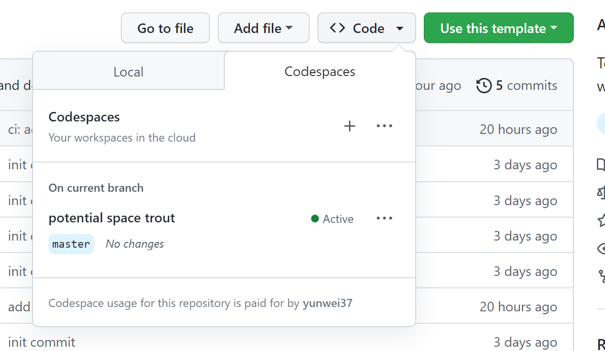
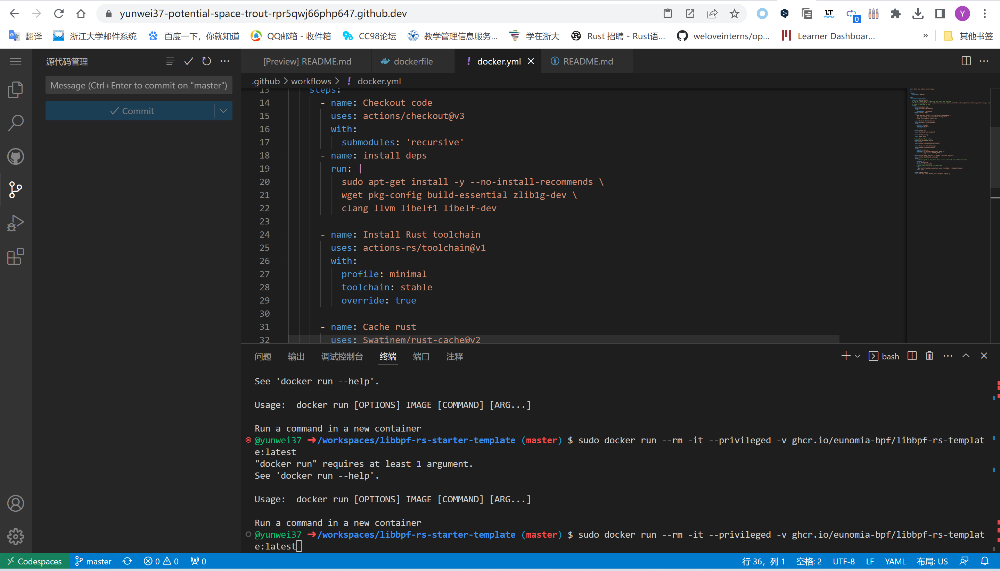
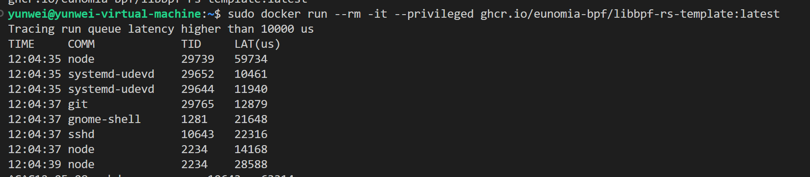

# eBPF Developer Tutorial: Learning eBPF Step by Step with Examples

[](https://github.com/eunomia-bpf/bpf-developer-tutorial/actions/workflows/test-libbpf.yml)
[](https://github.com/eunomia-bpf/bpf-developer-tutorial/actions/workflows/trigger-sync.yml)

[GitHub](https://github.com/eunomia-bpf/bpf-developer-tutorial)
[Gitee Mirror](https://gitee.com/yunwei37/bpf-developer-tutorial)
[中文版](https://github.com/eunomia-bpf/bpf-developer-tutorial/blob/main/README.zh.md)

This is a development tutorial for eBPF based on CO-RE (Compile Once, Run Everywhere). It provides practical eBPF development practices from beginner to advanced, including basic concepts, code examples, and real-world applications. Unlike BCC, we use frameworks like `libbpf`, `Cilium`, `libbpf-rs`, and eunomia-bpf for development, with examples in languages such as `C`, `Go`, and `Rust`.

This tutorial **does not cover complex concepts and scenario introductions**. Its main purpose is to provide examples of eBPF tools (**very short, starting with twenty lines of code!**) to help eBPF application developers quickly grasp eBPF development methods and techniques. The tutorial content can be found in the directory, with each directory being an independent eBPF tool example.

The tutorial focuses on eBPF examples in observability, networking, security, and more.

[**中文版在这里**](https://github.com/eunomia-bpf/bpf-developer-tutorial/blob/main/README.zh.md)

## Table of Contents

- [Tutorial compatibility matrix](001%20Tutorial%20compatibility%20matrix.md)

### Getting Started Examples

This section contains simple eBPF program examples and introductions. It primarily utilizes the `eunomia-bpf` framework to simplify development and introduces the basic usage and development process of eBPF.

- [lesson 0-introduce](002%20Lesson%200%20-%20Introduction%20to%20Core%20Concepts%20and%20Tools.md) Introduction to Core Concepts and Tools
- [lesson 1-helloworld](003%20Lesson%201%20-%20Hello%20World%2C%20Framework%20and%20Development.md) Hello World, Framework and Development
- [lesson 2-kprobe-unlink](004%20Lesson%202%20-%20Monitoring%20unlink%20System%20Calls%20with%20kprobe.md) Monitoring unlink System Calls with kprobe
- [lesson 3-fentry-unlink](005%20Lesson%203%20-%20Monitoring%20unlink%20System%20Calls%20with%20fentry.md) Monitoring unlink System Calls with fentry
- [lesson 4-opensnoop](006%20Lesson%204%20-%20Capturing%20Opening%20Files%20and%20Filter%20with%20Global%20Variables.md) Capturing Opening Files and Filter with Global Variables
- [lesson 5-uprobe-bashreadline](007%20Lesson%205%20-%20Capturing%20readline%20Function%20Calls%20with%20Uprobe.md) Capturing readline Function Calls with Uprobe
- [lesson 6-sigsnoop](008%20Lesson%206%20-%20Capturing%20Signal%20Sending%20and%20Store%20State%20with%20Hash%20Maps.md) Capturing Signal Sending and Store State with Hash Maps
- [lesson 7-execsnoop](009%20Lesson%207%20-%20Capturing%20Process%20Execution%2C%20Output%20with%20perf%20event%20array.md) Capturing Process Execution, Output with perf event array
- [lesson 8-exitsnoop](010%20Lesson%208%20-%20Monitoring%20Process%20Exit%20Events%2C%20Output%20with%20Ring%20Buffer.md) Monitoring Process Exit Events, Output with Ring Buffer
- [lesson 9-runqlat](011%20Lesson%209%20-%20Capturing%20Scheduling%20Latency%20and%20Recording%20as%20Histogram.md) Capturing Scheduling Latency and Recording as Histogram
- [lesson 10-hardirqs](012%20Lesson%2010%20-%20Capturing%20Interrupts%20with%20hardirqs%20or%20softirqs.md) Capturing Interrupts with hardirqs or softirqs
### Advanced Documents and Examples

We start to build complete eBPF projects mainly based on `libbpf` and combine them with various application scenarios for practical use.

- [lesson 11-bootstrap](013%20Lesson%2011%20-%20Develop%20User-Space%20Programs%20with%20libbpf%20and%20Trace%20exec%28%29%20and%20exit%28%29.md) Develop User-Space Programs with libbpf and Trace exec() and exit()
- [lesson 12-profile](014%20Lesson%2012%20-%20Using%20eBPF%20Program%20Profile%20for%20Performance%20Analysis.md) Using eBPF Program Profile for Performance Analysis
- [lesson 13-tcpconnlat](015%20Lesson%2013%20-%20Statistics%20of%20TCP%20Connection%20Delay%20with%20libbpf.md) Statistics of TCP Connection Delay with libbpf
- [lesson 14-tcpstates](016%20Lesson%2014%20-%20Recording%20TCP%20Connection%20Status%20and%20TCP%20RTT.md) Recording TCP Connection Status and TCP RTT
- [lesson 15-javagc](017%20Lesson%2015%20-%20Capturing%20User-Space%20Java%20GC%20Duration%20Using%20USDT.md) Capturing User-Space Java GC Duration Using USDT
- [lesson 16-memleak](018%20Lesson%2016%20-%20Monitoring%20Memory%20Leaks.md) Monitoring Memory Leaks
- [lesson 17-biopattern](019%20Lesson%2017%20-%20Count%20Random-Sequential%20Disk%20I-O.md) Count Random/Sequential Disk I/O
- [lesson 18-further-reading](020%20Lesson%2018%20-%20More%20Reference%20Materials%EF%BC%9A%20papers%2C%20projects.md) More Reference Materials： papers, projects
- [lesson 19-lsm-connect](021%20Lesson%2019%20-%20Security%20Detection%20and%20Defense%20using%20LSM.md) Security Detection and Defense using LSM
- [lesson 20-tc](022%20Lesson%2020%20-%20tc%20Traffic%20Control.md) tc Traffic Control
- [lesson 21-xdp](023%20Lesson%2021%20-%20Programmable%20Packet%20Processing%20with%20XDP.md) Programmable Packet Processing with XDP
### In-Depth Topics

This section covers advanced topics related to eBPF, including using eBPF programs on Android, possible attacks and defenses using eBPF programs, and complex tracing. Combining the user-mode and kernel-mode aspects of eBPF can bring great power (as well as security risks).


GPU:

- [lesson 47-cuda-events](024%20Lesson%2047%20-%20Tracing%20CUDA%20GPU%20Operations.md) Tracing CUDA GPU Operations
- [xpu flamegraph](025%20Building%20a%20GPU%20Flamegraph%20Profiler%20with%20CUPTI.md) Building a GPU Flamegraph Profiler with CUPTI
- [lesson xpu/gpu-kernel-driver](026%20Monitoring%20GPU%20Driver%20Activity%20with%20Kernel%20Tracepoints.md) Monitoring GPU Driver Activity with Kernel Tracepoints
- [lesson xpu/npu-kernel-driver](027%20Tracing%20Intel%20NPU%20Kernel%20Driver%20Operations.md) Tracing Intel NPU Kernel Driver Operations


Scheduler:

- [lesson 44-scx-simple](028%20Lesson%2044%20-%20Introduction%20to%20the%20BPF%20Scheduler.md) Introduction to the BPF Scheduler
- [lesson 45-scx-nest](029%20Lesson%2045%20-%20Implementing%20the%20scx_nest%20Scheduler.md) Implementing the `scx_nest` Scheduler


Networking:

- [lesson 23-http](030%20Lesson%2023%20-%20L7%20Tracing%20with%20eBPF%3A%20HTTP%20and%20Beyond%20via%20Socket%20Filters%20and%20Syscall%20Tracepoints.md) L7 Tracing with eBPF: HTTP and Beyond via Socket Filters and Syscall Tracepoints
- [lesson 29-sockops](031%20Lesson%2029%20-%20Accelerating%20Network%20Request%20Forwarding%20with%20Sockops.md) Accelerating Network Request Forwarding with Sockops
- [lesson 41-xdp-tcpdump](032%20Lesson%2041%20-%20Capturing%20TCP%20Information%20with%20XDP.md) Capturing TCP Information with XDP
- [lesson 42-xdp-loadbalancer](033%20Lesson%2042%20-%20XDP%20Load%20Balancer.md) XDP Load Balancer
- [lesson 46-xdp-test](034%20Lesson%2046%20-%20Building%20a%20High-Performance%20XDP%20Packet%20Generator.md) Building a High-Performance XDP Packet Generator
- [lesson 50-tcx](035%20Lesson%2050%20-%20Composable%20Traffic%20Control%20with%20TCX%20Links.md) Composable Traffic Control with TCX Links
- [lesson 53-egress-pacer](036%20Lesson%2053%20-%20Building%20an%20Egress%20Pacer%20with%20BPF%20Qdisc.md) Building an Egress Pacer with BPF Qdisc


Tracing:

- [lesson 30-sslsniff](037%20Lesson%2030%20-%20Capturing%20SSL-TLS%20Plain%20Text%20Data%20Using%20uprobe.md) Capturing SSL/TLS Plain Text Data Using uprobe
- [lesson 31-goroutine](038%20Lesson%2031%20-%20Using%20eBPF%20to%20Trace%20Go%20Routine%20States.md) Using eBPF to Trace Go Routine States
- [lesson 33-funclatency](039%20Lesson%2033%20-%20Measuring%20Function%20Latency%20with%20eBPF.md) Measuring Function Latency with eBPF
- [lesson 37-uprobe-rust](040%20Lesson%2037%20-%20Tracing%20User%20Space%20Rust%20Applications%20with%20Uprobe.md) Tracing User Space Rust Applications with Uprobe
- [lesson 39-nginx](041%20Lesson%2039%20-%20Using%20eBPF%20to%20Trace%20Nginx%20Requests.md) Using eBPF to Trace Nginx Requests
- [lesson 40-mysql](042%20Lesson%2040%20-%20Using%20eBPF%20to%20Trace%20MySQL%20Queries.md) Using eBPF to Trace MySQL Queries
- [lesson 48-energy](043%20Lesson%2048%20-%20Energy%20Monitoring%20for%20Process-Level%20Power%20Analysis.md) Energy Monitoring for Process-Level Power Analysis
- [lesson 52-fsession-latency](044%20Lesson%2052%20-%20Tracing%20Slow%20vfs_read%20Calls%20with%20fsession.md) Tracing Slow vfs_read Calls with fsession


Security:

- [lesson 24-hide](045%20Lesson%2024%20-%20Hiding%20Process%20or%20File%20Information.md) Hiding Process or File Information
- [lesson 25-signal](046%20Lesson%2025%20-%20Using%20bpf_send_signal%20to%20Terminate%20Malicious%20Processes%20in%20eBPF.md) Using bpf_send_signal to Terminate Malicious Processes in eBPF
- [lesson 26-sudo](047%20Lesson%2026%20-%20Privilege%20Escalation%20via%20File%20Content%20Manipulation.md) Privilege Escalation via File Content Manipulation
- [lesson 27-replace](048%20Lesson%2027%20-%20Transparent%20Text%20Replacement%20in%20File%20Reads.md) Transparent Text Replacement in File Reads
- [lesson 28-detach](049%20Lesson%2028%20-%20Running%20eBPF%20After%20Application%20Exits%3A%20The%20Lifecycle%20of%20eBPF%20Programs.md) Running eBPF After Application Exits: The Lifecycle of eBPF Programs
- [lesson 34-syscall](050%20Lesson%2034%20-%20Modifying%20System%20Call%20Arguments%20with%20eBPF.md) Modifying System Call Arguments with eBPF
- [lesson 51-tcp-quarantine](051%20Lesson%2051%20-%20Precisely%20Isolating%20Established%20TCP%20Connections.md) Precisely Isolating Established TCP Connections
- [lesson 54-exec-image-inspector](052%20Lesson%2054%20-%20Inspecting%20the%20Executable%20Image%20After%20exec.md) Inspecting the Executable Image After exec


Features:

- [lesson 35-user-ringbuf](053%20Lesson%2035%20-%20Asynchronously%20Send%20to%20Kernel%20with%20User%20Ring%20Buffer.md) Asynchronously Send to Kernel with User Ring Buffer
- [lesson 36-userspace-ebpf](054%20Lesson%2036%20-%20Userspace%20eBPF%20Runtimes%3A%20Overview%20and%20Applications.md) Userspace eBPF Runtimes: Overview and Applications
- [lesson 38-btf-uprobe](055%20Lesson%2038%20-%20Expanding%20eBPF%20Compile%20Once%2C%20Run%20Everywhere%28CO-RE%29%20to%20Userspace%20Compatibility.md) Expanding eBPF Compile Once, Run Everywhere(CO-RE) to Userspace Compatibility
- [lesson 43-kfuncs](056%20Lesson%2043%20-%20Extending%20eBPF%20Beyond%20Its%20Limits%3A%20Custom%20kfuncs%20in%20Kernel%20Modules.md) Extending eBPF Beyond Its Limits: Custom kfuncs in Kernel Modules
- [features bpf_arena](057%20BPF%20Arena%20for%20Zero-Copy%20Shared%20Memory.md) BPF Arena for Zero-Copy Shared Memory
- [features bpf_iters](058%20BPF%20Iterators%20for%20Kernel%20Data%20Export.md) BPF Iterators for Kernel Data Export
- [features bpf_token](059%20BPF%20Token%20for%20Delegated%20Privilege%20and%20Secure%20Program%20Loading.md) BPF Token for Delegated Privilege and Secure Program Loading
- [features bpf_wq](060%20BPF%20Workqueues%20for%20Asynchronous%20Sleepable%20Tasks.md) BPF Workqueues for Asynchronous Sleepable Tasks
- [features dynptr](061%20BPF%20Dynamic%20Pointers%20for%20Variable-Length%20Data.md) BPF Dynamic Pointers for Variable-Length Data
- [features struct_ops](062%20Extending%20Kernel%20Subsystems%20with%20BPF%20struct_ops.md) Extending Kernel Subsystems with BPF struct_ops

Other:

- [lesson 49-hid](063%20Lesson%2049%20-%20Fixing%20Broken%20HID%20Devices%20Without%20Kernel%20Patches.md) Fixing Broken HID Devices Without Kernel Patches
- [cgroup](064%20cgroup-based%20Policy%20Control.md) cgroup-based Policy Control


Android:

- [lesson 22-android](065%20Lesson%2022%20-%20Using%20eBPF%20Programs%20on%20Android.md) Using eBPF Programs on Android

Continuously updating...

## Why write this tutorial?

In the process of learning eBPF, we have been inspired and helped by the [bcc Python developer tutorial](https://github.com/iovisor/bcc/blob/master/docs/tutorial_bcc_python_developer.md). However, from the current perspective, using `libbpf` to develop eBPF applications is a relatively better choice.

This project is mainly based on [libbpf](https://github.com/libbpf/libbpf) frameworks.

> - We also provide a small tool called GPTtrace, which uses ChatGPT to automatically write eBPF programs and trace Linux systems through natural language descriptions. This tool allows you to interactively learn eBPF programs: [GPTtrace](https://github.com/eunomia-bpf/GPTtrace)
> - Feel free to raise any questions or issues related to eBPF learning, or bugs encountered in practice, in the issue or discussion section of this repository. We will do our best to help you!

## Install deps and Compile

- For libbpf based: see [src/11-bootstrap](https://github.com/eunomia-bpf/bpf-developer-tutorial/blob/main/src/11-bootstrap/README.md)
- For eunomia-bpf based: see [src/1-helloworld](https://github.com/eunomia-bpf/bpf-developer-tutorial/blob/main/src/1-helloworld/README.md)

## GitHub Templates: Easily build eBPF projects and development environments, compile and run eBPF programs online with one click

When starting a new eBPF project, are you confused about how to set up the environment and choose a programming language? Don't worry, we have prepared a series of GitHub templates for you to quickly start a brand new eBPF project. Just click the `Use this template` button on GitHub to get started.

- <https://github.com/eunomia-bpf/libbpf-starter-template>: eBPF project template based on the C language and libbpf framework
- <https://github.com/eunomia-bpf/cilium-ebpf-starter-template>: eBPF project template based on the Go language and cilium/ framework
- <https://github.com/eunomia-bpf/libbpf-rs-starter-template>: eBPF project template based on the Rust language and libbpf-rs framework
- <https://github.com/eunomia-bpf/eunomia-template>: eBPF project template based on the C language and eunomia-bpf framework

These starter templates include the following features:

- A Makefile to build the project with a single command
- A Dockerfile to automatically create a containerized environment for your eBPF project and publish it to GitHub Packages
- GitHub Actions to automate the build, test, and release processes
- All dependencies required for eBPF development

> By setting an existing repository as a template, you and others can quickly generate new repositories with the same basic structure, eliminating the need for manual creation and configuration. With GitHub template repositories, developers can focus on the core functionality and logic of their projects without wasting time on the setup and structure. For more information about template repositories, see the official documentation: <https://docs.github.com/en/repositories/creating-and-managing-repositories/creating-a-template-repository>

When you create a new repository using one of the eBPF project templates mentioned above, you can easily set up and launch an online development environment with GitHub Codespaces. Here are the steps to compile and run eBPF programs using GitHub Codespaces:

1. Click the Code button in your new repository and select the Open with Codespaces option:

    

2. GitHub will create a new Codespace for you, which may take a few minutes depending on your network speed and the size of the repository.
3. Once your Codespace is launched and ready to use, you can open the terminal and navigate to your project directory.
4. You can follow the instructions in the corresponding repository to compile and run eBPF programs:

    

With Codespaces, you can easily create, manage, and share cloud-based development environments, speeding up and making your development process more reliable. You can develop with Codespaces anywhere, on any device, just need a computer with a web browser. Additionally, GitHub Codespaces supports pre-configured environments, customized development containers, and customizable development experiences to meet your development needs.

After writing code in a codespace and making a commit, GitHub Actions will compile and automatically publish the container image. Then, you can use Docker to run this eBPF program anywhere with just one command, for example:

```console
$ sudo docker run --rm -it --privileged ghcr.io/eunomia-bpf/libbpf-rs-template:latest
[sudo] password for xxx:
Tracing run queue latency higher than 10000 us
TIME     COMM             TID     LAT(us)
12:09:19 systemd-udevd    30786   18300
12:09:19 systemd-udevd    30796   21941
12:09:19 systemd-udevd    30793   10323
12:09:19 systemd-udevd    30795   14827
12:09:19 systemd-udevd    30790   17973
12:09:19 systemd-udevd    30793   12328
12:09:19 systemd-udevd    30796   28721
```



## build

The example of local compilation is shown as follows:

```shell
git clone https://github.com/eunomia-bpf/bpf-developer-tutorial.git
cd bpf-developer-tutorial
git submodule update --init --recursive # Synchronize submodule
cd src/24-hide
make
```

## LICENSE

MIT
