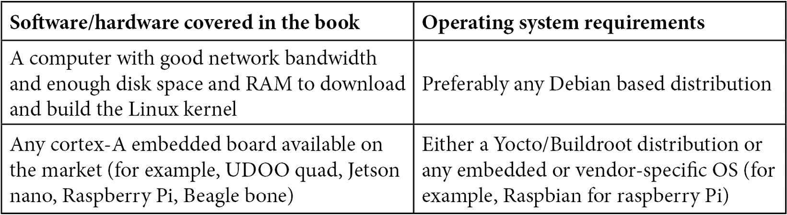

# Preface

The Linux kernel is a complex, portable, modular, and widely used piece of software, running on around 80% of servers and embedded systems in more than half of the devices throughout the world. Device drivers play a critical role in the context of how well a Linux system operates. As Linux has turned out to be one of the most popular operating systems, interest in developing personal device drivers is also increasing steadily.

A device driver is the link between the user space and hardware devices, through the kernel.

This book will begin with two chapters that will help you understand the basics of drivers and prepare you for the long journey through the Linux kernel. This book will then cover driver development based on Linux subsystems, such as memory management, **industrial input/output** (**IIO**), **general-purpose input/output** (**GPIO**), **interrupt request** (**IRQ**) management, and **Inter-Integrated Circuit** (**I2C**) and **Serial Peripheral Interface** (**SPI**). The book will also cover a practical approach to direct memory access and register map abstraction.

The source code in this book has been tested on both an x86 PC and UDOO QUAD from SECO, which is based on an ARM i.MX6 from NXP, with enough features and connections to allow us to cover all of the tests discussed in the book. Some drivers are also provided for testing purposes for inexpensive components, such as MCP23016 and 24LC512, which are an I2C GPIO controller and EEPROM memory, respectively.

By the end of this book, you will be comfortable with the concept of device driver development and will be able to write any device driver from scratch using the last stable kernel branch (v5.10.y at the time of writing).

# Who this book is for

To make use of the content of this book, prior knowledge of basic C programming and Linux commands is expected. This book covers Linux driver development for widely used embedded devices, using kernel version v5.10. This book is essentially intended for embedded engineers, Linux system administrators, developers, and kernel hackers. Whether you are a software developer, a system architect, or a creator willing to dive into Linux driver development, this book is for you.

# What this book covers

*Chapter 1*, *Introduction to Kernel Development*, introduces the Linux kernel development process. The chapter will discuss the downloading, configuring, and compiling steps of a kernel, for x86 as well as for ARM-based systems.

*Chapter 2*, *Understanding Linux Kernel Module Basic Concepts*, deals with Linux modularity by means of kernel modules and describes their loading/unloading. It also describes module architecture with some basic concepts.

*Chapter 3*, *Dealing with Kernel Core Helpers*, walks through frequently used kernel functions and mechanisms, such as the work queue, wait queue, mutexes, spinlock, and any other facilities that are useful for improved driver reliability.

*Chapter 4*, *Writing Character Device Drivers*, focuses on exporting device functionalities to the user space by means of character devices, as well as supporting custom commands using the ioctl interface.

*Chapter 5*, *Understanding and Leveraging the Device Tree*, discusses the mechanism to declare and describe devices to the kernel. This chapter explains device addressing, resource handling, and every data type supported in **device tree** (**DT**) and their kernel APIs.

*Chapter 6*, *Introduction to Devices, Drivers, and Platform Abstraction*, explains the general concept of platform devices, the concept of a pseudo-platform bus, as well as the device- and driver-matching mechanisms.

*Chapter 7*, *Understanding the Concept of Platform Devices and Drivers*, describes platform driver architecture in a general manner, and how to handle platform data.

*Chapter 8*, *Writing I2C Device Drivers*, dives into I2C device driver architecture, the data structures, and device addressing and accessing methods on the bus.

*Chapter 9*, *Writing SPI Device Drivers*, describes SPI-based device driver architecture, as well as the data structures involved. The chapter discusses each device's access method and specificities, as well as traps you should avoid. SPI DT binding is discussed too.

*Chapter 10*, *Understanding the Linux Kernel Memory Allocation*, first introduces the concept of virtual memory, to describe the whole kernel memory layout. This chapter then walks through the kernel memory management subsystem, discussing memory allocation and mapping, their APIs, and all devices involved in such mechanisms, as well as the kernel caching mechanism.

*Chapter 11*, *Implementing Direct Memory Access (DMA) Support*, introduces DMA and its new kernel API: the DMA Engine API. This chapter will talk about different DMA mappings and describe how to address cache coherency issues. In addition, the chapter summarizes all the concepts with a generic use case.

*Chapter 12*, *Abstracting Memory Access – Introduction to the Regmap API: a Register Map Abstraction*, provides an overview of the register map APIs and how they abstract the underlying SPI and I2C transactions. This chapter describes the generic API, as well as the dedicated API.

*Chapter 13*, *Demystifying the Kernel IRQ Framework*, demystifies the Linux IRQ core. This chapter walks through Linux IRQ management, starting from interrupt propagation over the system and moving to interrupt controller drivers, thus explaining the concept of IRQ multiplexing, using the Linux IRQ domain API.

*Chapter 14*, *Introduction to the Linux Device Model*, provides an overview of the heart of Linux, describing how objects are represented in the kernel, and how Linux is designed under the hood in a general manner, starting from **kobject** to devices, through to buses, classes, and device drivers.

*Chapter 15*, *Delving into the IIO Framework*, introduces the kernel data acquisition and measurement framework, to handle **Digital-to-Analog Converters** (**DACs**) and **Analog-to-Digital Converters** (**ADCs**). This chapter walks through the IIO APIs, both from kernel space and user space (thanks to **libiio**), dealing with triggered buffers and continuous data capture.

*Chapter 16*, *Getting the Most Out of the Pin Controller and GPIO Subsystems*, describes the kernel pin control infrastructure and APIs, as well as GPIO chip drivers and **gpiolib**, which is the kernel API to handle GPIO. This chapter also discusses the old and deprecated integer-based GPIO interface, as well as the descriptor-based interface, which is the new one, and finally, the way they can be configured from within the device tree. It also covers **libgpiod**, which is the official library for dealing with GPIO in user space.

*Chapter 17*, *Leveraging the Linux Kernel Input Subsystem*, provides a global view of input subsystems, dealing with both IRQ-based and polled input devices, and introducing both APIs. This chapter explains and shows how user space code deals with such devices.

# To get the most out of this book

This book assumes a medium level of understanding of the Linux operating system and basic knowledge of C programming (at least data structures, pointer handling, and memory allocation). All code examples have been tested with Linux kernel v5.10. If additional skill is required for a given chapter, links to document references will be provided for you to quickly learn these skills.

Other necessary packages are described in the dedicated chapter in the book. Internet connectivity is required for kernel source downloading.

**If you are using the digital version of this book, we advise you to type the code yourself or access the code from the book's GitHub repository (a link is available in the next section). Doing so will help you avoid any potential errors related to the copying and pasting of code.**

# Download the example code files

You can download the example code files for this book from GitHub at <https://github.com/PacktPublishing/Linux-Device-Driver-Development-Second-Edition>. If there's an update to the code, it will be updated in the GitHub repository.

We also have other code bundles from our rich catalog of books and videos available at <https://github.com/PacktPublishing/>. Check them out!

# Download the color images

We also provide a PDF file that has color images of the screenshots and diagrams used in this book. You can download it here: <https://static.packt-cdn.com/downloads/9781803240060_ColorImages.pdf>.

# Conventions used

There are a number of text conventions used throughout this book.

**Code in text**: Indicates code words in text, database table names, folder names, filenames, file extensions, pathnames, dummy URLs, user input, and Twitter handles. Here is an example: "We can lock/unlock the spinlock using the **spin_lock()** and **spin_unlock()** inline functions, both defined in **include/linux/spinlock.h**."

A block of code is set as follows:

struct mutex {

atomic_long_t owner;

spinlock_t wait_lock;

\#ifdef CONFIG_MUTEX_SPIN_ON_OWNER

struct optimistic_spin_queue osq; /\* Spinner MCS lock \*/

When we wish to draw your attention to a particular part of a code block, the relevant lines or items are set in bold:

struct fake_data {

struct i2c_client \*client;

**u16 reg_conf;**

struct mutex mutex;

};

Any command-line input or output is written as follows:

\[342081.385491\] Wait queue example

\[342081.385505\] Going to sleep my_init

\[342081.385515\] Waitqueue module handler work_handler

\[342086.387017\] Wake up the sleeping module

Tips or Important Notes

Appear like this.

# Get in touch

Feedback from our readers is always welcome.

**General feedback**: If you have questions about any aspect of this book, email us at **customercare@packtpub.com** and mention the book title in the subject of your message.

**Errata**: Although we have taken every care to ensure the accuracy of our content, mistakes do happen. If you have found a mistake in this book, we would be grateful if you would report this to us. Please visit [www.packtpub.com/support/errata](http://www.packtpub.com/support/errata) and fill in the form.

**Piracy**: If you come across any illegal copies of our works in any form on the internet, we would be grateful if you would provide us with the location address or website name. Please contact us at **copyright@packt.com** with a link to the material.

**If you are interested in becoming an author**: If there is a topic that you have expertise in and you are interested in either writing or contributing to a book, please visit [authors.packtpub.com](http://authors.packtpub.com).

# Share Your Thoughts

Once you've read *Linux Device Drivers Development - Second Edition*, we'd love to hear your thoughts! Please [click here to go straight to the Amazon review page](https://packt.link/r/1803240067) for this book and share your feedback.

Your review is important to us and the tech community and will help us make sure we're delivering excellent quality content.