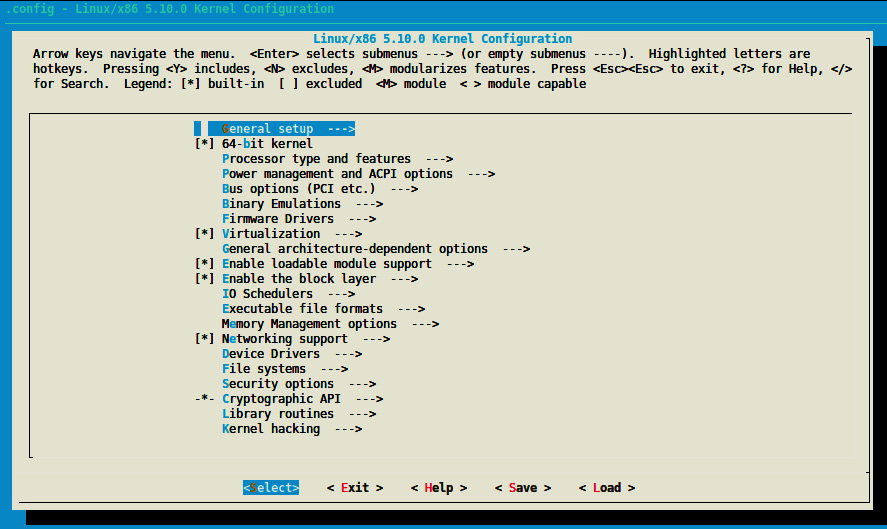

# *Chapter 1*: Introduction to Kernel Development

**Linux** started as a hobby project in 1991 by a Finnish student, Linus Torvalds. The project has gradually grown and continues to do so, with roughly a thousand contributors around the world. Nowadays, Linux is a must, in embedded systems as well as on servers. A **kernel** is a central part of an operating system, and its development is not straightforward. Linux offers many advantages over other operating systems; it is free of charge, well documented with a large community, is portable across different platforms, provides access to the source code, and has a lot of free open source software.

This book will try to be as generic as possible. There is a special topic, known as the device tree, that is not a full **x86** feature yet. This topic will be dedicated to ARM processors, especially those that fully support the device tree. Why those architectures? Because they are mostly used on desktops and servers (for x86), as well as embedded systems (ARM).

In this chapter, we will cover the following topics:

- Setting up the development environment
- Understanding the kernel configuration process
- Building your kernel

# Setting up the development environment

When you're working in embedded system fields, there are terms you must be familiar with, before even setting up your environment. They are as follows:

- **Target**: This is the machine that the binaries resulting from the build process are produced for. This is the machine that is going to run the binary.
- **Host**: This is the machine where the build process takes place.
- **Compilation**: This is also called native compilation or a **native build**. This happens when the target and the host are the same; that is, when you're building on machine A (the host) a binary that is going to be executed on the same machine (A, the target) or a machine of the same kind. Native compilation requires a native compiler. Therefore, a native compiler is one where the target and the host are the same.
- **Cross-compilation**: Here, the target and the host are different. It is where you build a binary from machine A (the host) that is going to be executed on machine B (the target). In this case, the host (machine A) must have installed the cross-compiler that supports the target architecture. Thus, a cross-compiler is a compiler where the target is different from the host.

Because embedded computers have limited or reduced resources (CPU, RAM, disk, and so on), it is common for the hosts to be x86 machines, which are much more powerful and have far more resources to speed up the development process. However, over the past few years, embedded computers have become more powerful, and they tend to be used for native compilation (thus used as the host). A typical example is the Raspberry Pi 4, which has a powerful quad-core CPU and up to 8 GB of RAM.

In this chapter, we will be using an x86 machine as the host, either to create a native build or for cross-compilation. So, any "native build" term will refer to an "x86 native build." Due to this, I'm running **Ubuntu 18.04**.

To quickly check this information, you can use the following command:

lsb_release -a

Distributor ID: Ubuntu

Description:    Ubuntu 18.04.5 LTS

Release:    18.04

Codename:   bionic

My computer is an **ASUS RoG**, with a 16 core AMD Ryzen CPU (you can use the **lscpu** command to pull this information out), 16 GB of RAM, 256 GB of SSD, and a 1 TB magnetic hard drive (information that you can obtain using the **df -h** command). That said, a quad-core CPU and 4 or 8 GB of RAM could be enough, but at the cost of an increased build duration. My favorite editor is **Vim**, but you are free to use the one you are most comfortable with. If you are using a desktop machine, you could use **Visual Studio Code** (**VS Code**), which is becoming widely used.

Now that we are familiar with the compilation-related keywords we will be using, we can start preparing the host machine.

## Setting up the host machine

Before you can start the development process, you need to set up an **environment**. The environment that's dedicated to Linux development is quite simple – on **Debian**-based systems, at least (which is our case).

On the host machine, you need to install a few packages, as follows:

\$ sudo apt update

\$ sudo apt install gawk wget git diffstat unzip \\

       texinfo gcc-multilib build-essential chrpath socat \\

       libsdl1.2-dev xterm ncurses-dev lzop libelf-dev make

In the preceding code, we installed a few development tools and some mandatory libraries so that we have a nice user interface when we're configuring the Linux kernel.

Now, we need to install the compiler and the tools (linker, assembler, and so on) for the build process to work properly and produce the executable for the target. This set of tools is called **Binutils**, and the compiler + Binutils (+ other build-time dependency libraries if any) combo is called **toolchain**. So, you need to understand what is meant by *"I need a toolchain for \<this\> architecture"* or similar sentences.

### Understanding and installing toolchains

Before we can start compiling, we need to install the necessary packages and tools for native or ARM cross-compiling; that is, the toolchains. GCC is the compiler that's supported by the Linux kernel. A lot of macros that are defined in the kernel are GCC-related. Due to this, we will use GCC as our (cross-)compiler.

For a native compilation, you can use the following toolchain installation command:

sudo apt install gcc binutils

When you need to cross-compile, you must identify and install the right toolchain. Compared to a native compiler, cross-compiler executables are prefixed by the name of the target operating system, architecture, and (sometimes) library. Thus, to identify architecture-specific toolchains, a naming convention has been defined: **arch\[-vendor\]\[-os\]-abi**. Let's look at what the fields in the pattern mean:

- **arch** identifies the architecture; that is, **arm**, **mips**, **x86**, **i686**, and so on.
- **vendor** is the toolchain supplier (company); that is, **Bootlin**, **Linaro**, **none** (if there is no provider) or simply omitting the field, and so on.
- **os** is for the target operating system; that is, **linux** or **none** (bare metal). If omitted, bare metal is assumed.
- **abi** stands for application binary interface. It refers to what the underlying binary is going to look like, the function call convention, how parameters are passed, and more. Possible conventions include **eabi**, **gnueabi**, and **gnueabihf**. Let's look at these in more detail:
  - **eabi** means that the code that will be compiled will run on a bare metal ARM core.
  - **gnueabi** means that the code for Linux will be compiled.
  - **gnueabihf** is the same as **gnueabi**, but **hf** at the end means **hard float**, which indicates that the compiler and its underlying libraries are using hardware floating-point instructions rather than a software implementation of floating-point instructions, such as fixed-point software implementations. If no floating-point hardware is available, the instructions will be trapped and performed by a floating-point emulation module instead. When you're using software emulation, the only actual difference in functionality is slower execution.

The following are some toolchain names to illustrate the use of the pattern:

- **arm-none-eabi**: This is a toolchain that targets the ARM architecture. It has no vendor, targets a bare-metal system (does not target an operating system), and complies with the ARM EABI.
- **arm-none-linux-gnueabi** or **arm-linux-gnueabi**: This is a toolchain that produces objects for the ARM architecture to be run on Linux with the default configuration (ABI) provided by the toolchain. Note that **arm-none-linux-gnueabi** is the same as **arm-linux-gnueabi** because, as we have seen, when no vendor is specified, we assume there isn't one. The variant of this toolchain supporting hardware floating point would be **arm-linux-gnueabihf** or **arm-none-linux-gnueabihf**.

Now that we are familiar with toolchain naming conventions, we can determine which toolchain can be used to cross-compile for our target architecture.

To cross-compile for a 32-bit ARM machine, we would install the toolchain using the following command:

\$ sudo apt install gcc-arm-linux-gnueabihf binutils-arm-linux-gnueabihf

Note that the 64-bit ARM backend/support in the Linux tree and GCC is called **aarch64**. So, the cross-compiler must be called something like **gcc-aarch64-linux-gnu\***, while Binutils must be called something like **binutils-aarch64-linux-gnu\***. Thus, for a 64-bit ARM toolchain, we would use the following command:

\$ sudo apt install make gcc-aarch64-linux-gnu binutils-aarch64-linux-gnu

Note

Note that aarch64 only supports/provides hardware float aarch64 toolchains. Thus, there is no need to specify **hf** at the end.

Note that not all versions of the compiler can compile a given Linux kernel version. Thus, it is important to take care of both the Linux kernel version and the compiler (GCC) version. While the previous commands installed the latest version that's supported by your distribution, it is possible to target a particular version. To achieve this, you can use **gcc-\<version\>-\<arch\>-linux-gnu\***.

For example, to install version 8 of GCC for aarch64, you can use the following command:

sudo apt install gcc-8-aarch64-linux-gnu

Now that our toolchain has been installed, we can look at the version that was picked by our distribution package manager. For example, to check which version of the aarch64 cross-compiler was installed, we can use the following command:

\$ aarch64-linux-gnu-gcc --version

aarch64-linux-gnu-gcc (Ubuntu/Linaro 7.5.0-3ubuntu1~18.04) 7.5.0

Copyright (C) 2017 Free Software Foundation, Inc.

\[...\]

For the 32-bit ARM variant, we can use the following command:

\$ arm-linux-gnueabihf-gcc --version

arm-linux-gnueabihf-gcc (Ubuntu/Linaro 7.5.0-3ubuntu1~18.04) 7.5.0

Copyright (C) 2017 Free Software Foundation, Inc.

\[...\]

Finally, for the native version, we can use the following command:

\$ gcc --version

gcc (Ubuntu 7.5.0-3ubuntu1~18.04) 7.5.0

Copyright (C) 2017 Free Software Foundation, Inc.

Now that we have set up our environment and made sure we are using the right tool versions, we can start downloading the Linux kernel sources and dig into them.

## Getting the sources

In the early kernel days (until 2003), odd-even versioning styles were used, where odd numbers were stable and even numbers were unstable. When the 2.6 version was released, the versioning scheme switched to **X.Y.Z**. Let's look at this in more detail:

- **X**: This was the actual kernel's version, also called major. It was incremented when there were backward-incompatible API changes.
- **Y**: This was the minor revision. It was incremented after functionality was added in a backward-compatible manner.
- **Z**: This is also called PATCH and represented versions related to bug fixes.

This is called *semantic versioning* and was used until version *2.6.39*, when Linus Torvalds decided to bump the version to 3.0, which also meant the end of semantic versioning in 2011. At that point, an X.Y scheme was adopted.

When it came to version 3.20, Linus argued that he could no longer increase Y. Therefore, he decided to switch to an arbitrary versioning scheme, incrementing X whenever Y got so big that he ran out of fingers and toes to count it. This is the reason why the version has moved from 3.20 to 4.0 directly.

Now, the kernel uses an arbitrary **X.Y** versioning scheme, which has nothing to do with semantic versioning.

According to the Linux kernel release model, there are always two latest releases of the kernel out there: the stable release and the **long-term support** (**LTS**) release. All bug fixes and new features are collected and prepared by subsystem maintainers and then submitted to Linus Torvalds for inclusion into his Linux tree, which is called the mainline Linux tree, also known as the *master* Git repository. This is where every stable release originates from.

Before each new kernel version is released, it is submitted to the community through *release candidate* tags so that developers can test and polish all the new features. Based on the feedback he receives during this cycle, Linus decides whether the final version is ready to go. When Linus is convinced that the new kernel is ready to go, he makes the final release. We call this release "stable" to indicate that it's not a "release candidate:" those releases are *vX.Y* versions.

There is no strict timeline for making releases, but new mainline kernels are generally released every 2-3 months. Stable kernel releases are based on Linus releases; that is, the mainline tree releases.

Once a stable kernel is released by Linus, it also appears in the *linux-stable* tree (available at <https://git.kernel.org/pub/scm/linux/kernel/git/stable/linux.git/>), where it becomes a branch. Here, it can receive bug fixes. This tree is called a stable tree because it is used to track previously released stable kernels. It is maintained and curated by *Greg Kroah-Hartman*. However, all fixes must go into Linus's tree first, which is the mainline repository. Once the bug has been fixed in the mainline repository, it can be applied to previously released kernels that are still maintained by the kernel development community. All the fixes that have been backported to stable releases must meet a set of important criteria before they are considered – one of them is that they "must already exist in Linus's tree."

Note

**Bugfix kernel releases** are considered stable.

For example, when the 4.9 kernel is released by Linus, the stable kernel is released based on the kernel's numbering scheme; that is, 4.9.1, 4.9.2, 4.9.3, and so on. Such releases are called **bugfix kernel releases**, and the sequence is usually shortened with the number "4.9.y" when referring to their branch in the stable kernel release tree. Each stable kernel release tree is maintained by a single kernel developer, who is responsible for picking the necessary patches for the release and going through the review/release process. Usually, there are only a few bugfix kernel releases until the next mainline kernel becomes available – unless it is designated as a *long-term maintenance kernel*.

Every subsystem and kernel maintainer repository is hosted here: <https://git.kernel.org/pub/scm/linux/kernel/git/>. Here, we can also find either a Linus or a stable tree. In the Linus tree (<https://git.kernel.org/pub/scm/linux/kernel/git/torvalds/linux.git/>), there is only one branch; that is, the **master branch**. Its tags are either stable releases or release candidates. In the stable tree (<https://git.kernel.org/pub/scm/linux/kernel/git/stable/linux.git/>), there is one branch per stable kernel release (named *\<A.B\>.y*, where *\<A.B\>* is the release version in the Linus tree) and each branch contains its bugfix kernel releases.

### Downloading the source and organizing it

In this book, we will be using Linus's tree, which can be downloaded using the following commands:

git clone https://git.kernel.org/pub/scm/linux/kernel/git/torvalds/linux.git --depth 1

git checkout v5.10

ls

In the preceding commands we used **--depth 1** to avoid downloading the history (or rather, picking only the last commit history), which may considerably reduce the download size and save time. Since Git supports branching and tagging, the **checkout** command allows you to switch to a specific tag or branch. In this example, we are switching to the **v5.10** tag.

Note

In this book, we will be dealing with Linux kernel v5.10.

Let's look at the content of the main source directory:

- **arch/**: To be as generic as possible, architecture-specific code is separated from the rest. This directory contains processor-specific code that's organized in a subdirectory per architecture, such as **alpha/**, **arm/**, **mips/**, **arm64/**, and so on.
- **block/**: This directory contains codes for block storage devices.
- **crypto/**: This directory contains the cryptographic API and the encryption algorithm's code.
- **certs/**: This directory contains certificates and sign files to enable a module signature to make the kernel load signed modules.
- **documentation/**: This directory contains the descriptions of the APIs that are used for different kernel frameworks and subsystems. You should look here before asking any questions on the public forums.
- **drivers/**: This is the heaviest directory since it is continuously growing as device drivers get merged. It contains every device driver, organized into various subdirectories.
- **fs/**: This directory contains the implementations of different filesystems that the kernel supports, such as NTFS, FAT, ETX{2,3,4}, sysfs, procfs, NFS, and so on.
- **include/**: This directory contains kernel header files.
- **init/**: This directory contains the initialization and startup code.
- **ipc/**: This directory contains the implementation of the **inter-process communication** (**IPC**) mechanisms, such as message queues, semaphores, and shared memory.
- **kernel/**: This directory contains architecture-independent portions of the base kernel.
- **lib/**: Library routines and some helper functions live here. This includes generic **kernel object** (**kobject**) handlers and **cyclic redundancy code** (**CRC**) computation functions.
- **mm/**: This directory contains memory management code.
- **net/**: This directory contains networking (whatever network type it is) protocol code.
- **samples/**: This directory contains device driver samples for various subsystems.
- **scripts/**: This directory contains scripts and tools that are used alongside the kernel. There are other useful tools here.
- **security/**: This directory contains the security framework code.
- **sound/**: Guess what falls here: audio subsystem code.
- **tools/**: This directory contains Linux kernel development and testing tools for various subsystems, such as USB, vhost test modules, GPIO, IIO, and SPI, among others.
- **usr/**: This directory currently contains the initramfs implementation.
- **virt/**: This is the virtualization directory, which contains the **kernel virtual machine** (**KVM**) module for a hypervisor.

To enforce portability, any architecture-specific code should be in the **arch** directory. Moreover, the kernel code that's related to the user space API does not change (system calls, **/proc**, **/sys**, and so on) as it would break the existing programs.

In this section, we have familiarized ourselves with the Linux kernel's source content. After going through all the sources, it seems quite natural to configure them to be able to compile a kernel. In the next section, we will learn how kernel configuration works.

# Configuring and building the Linux kernel

There are numerous drivers/features and build options available in the Linux kernel sources. The configuration process consists of choosing what features/drivers are going to be part of the compilation process. Depending on whether we are going to perform native compilation or cross-compilation, there are environment variables that must be defined, even before the configuration process takes place.

## Specifying compilation options

The compiler that's invoked by the kernel's **Makefile** is **\$(CROSS_COMPILE)gcc**. That said, **CROSS_COMPILE** is the prefix of the cross-compiling tools (**gcc**, **as**, **ld**, **objcopy**, and so on) and must be specified when you're invoking **make** or must have been exported before any **make** command is executed. Only **gcc** and its related Binutils executables will be prefixed with **\$(CROSS_COMPILE)**.

Note that various assumptions are made and options/features/flags are enabled by the Linux kernel build infrastructure based on the target architecture. To achieve that, in addition to the cross-compiler prefix, the architecture of the target must be specified as well. This can be done through the **ARCH** environment variable.

Thus, a typical Linux configuration or build command would look as follows:

ARCH=\<XXXX\> CROSS_COMPILE=\<YYYY\> make menuconfig

It can also look as follows:

ARCH=\<XXXX\> CROSS_COMPILE=\<YYYY\> make \<make-target\>

If you don't wish to specify these environment variables when you launch a command, you can export them into your current shell. The following is an example:

export CROSS_COMPILE=aarch64-linux-gnu-

export ARCH=aarch64

Remember that if these variables are not specified, the native host machine is going to be targeted; that is, if **CROSS_COMPILE** is omitted or not set, **\$(CROSS_COMPILE)gcc** will result in **gcc**, and it will be the same for other tools that will be invoked (for example, **\$(CROSS_COMPILE)ld** will result in **ld**).

In the same manner, if **ARCH** (the target architecture) is omitted or not set, it will default to the host where **make** is executed. It will default to **\$(uname -m)**.

As a result, you should leave **CROSS_COMPILE** and **ARCH** undefined to have the kernel natively compiled for the host architecture using **gcc**.

## Understanding the kernel configuration process

The Linux kernel is a *Makefile-based* project that contains thousands of options and drivers. Each option that's enabled can make another one available or can pull specific code into the build. To configure the kernel, you can use **make menuconfig** for a ncurses-based interface or **make xconfig** for an X-based interface. The ncurses-based interface looks as follows:

Figure 1.1 – Kernel configuration screen

For most options, you have three choices. However, we can enumerate five types of options while configuring the Linux kernel:

- Boolean options, for which you have two choices:
  - **(blank)**, which leaves this feature out. Once this option is highlighted in the configuration menu, you can press the **\<n\>** key to leave the feature out. It is equivalent to false. When it's disabled, the resulting configuration option is commented out in the configuration file.
  - **(\*)**, which compiles it statically in the kernel. This means it will always be there when the kernel first loads. It is equivalent to true. You can enable a feature in the configuration menu by selecting it and pressing the **\<y\>** key. The resulting option will appear as **CONFIG\_\<OPTION\>=y** in the configuration file; for example, **CONFIG_INPUT_EVDEV=y**.
- Tristate options, which, in addition to being able to take Boolean states, can take a third state, marked as **(M)** in the configuration windows. This results in **CONFIG\_\<OPTION\>=m** in the configuration file; for example, **CONFIG_INPUT_EVDEV=m**. To produce a loadable module (provided that this option allows it), you can select the feature and press the **M** key.
- String options, which expect string values; for example, **CONFIG_CMDLINE="noinitrd console=ttymxc0,115200"**.
- Hex options, which expect hexadecimal values; for example, **CONFIG_PAGE_OFFSET=0x80000000**.
- Int options, which expect integer values; for example, **CONFIG_CONSOLE_LOGLEVEL_DEFAULT=7**.

The selected options will be stored in a **.config** file, at the root of the source tree.

It is very difficult to know which configuration is going to work on your platform. In most cases, there will be no need to start a configuration from scratch. There are default and functional configuration files available in each arch directory that you can use as a starting point (it is important to start with a configuration that already works):

ls arch/\<your_arch\>/configs/

For 32-bit ARM-based CPUs, these config files can be found in **arch/arm/configs/**. In this architecture, there is usually one default configuration per CPU family. For instance, for i.MX6-7 processors, the default config file is **arch/arm/configs/imx_v6_v7_defconfig**. However, on ARM 64-bit CPUs, there is only one big default configuration to customize; it is located in **arch/arm64/configs/** and is called **defconfig**. Similarly, for x86 processors, we can find the files in **arch/x86/configs/**. There will be two default configuration files here – **i386_defconfig** and **x86_64_defconfig**, for 32- and 64-bit x86 architectures, respectively.

The kernel configuration command, given a default configuration file, is as follows:

make \<foo_defconfig\>

This will generate a new **.config** file in the main (root) directory, while the old **.config** will be renamed **.config.old**. This can be useful to revert the previous configuration changes. Then, to customize the configuration, you can use the following command:

make menuconfig

Saving your changes will update your **.config** file. While you could share this config with your teammates, you are better off creating a default configuration file in the same minimal format as those shipped with the Linux kernel sources. To do that, you can use the following command:

make savedefconfig

This command will create a minimal (since it won't store non-default settings) configuration file. The generated default configuration file will be called **defconfig** and stored at the root of the source tree. You can store it in another location using the following command:

mv defconfig arch/\<arch\>/configs/myown_defconfig

This way, you can share a reference configuration inside the kernel sources and other developers can now get the same **.config** file as you by running the following command:

make myown_defconfig

Note

Note that, for cross-compilation, **ARCH** and **CROSS_COMPILE** must be set before you execute any **make** command, even for kernel configuration. Otherwise, you'll have unexpected changes in your configuration.

The followings are the various configuration commands you can use, depending on the target system:

- For a 64-bit x86 native compilation, it is quite straightforward (the compilation options can be omitted):

  **make x86_64_defconfig**

  **make menuconfig**

- Given a 32-bit ARM i.MX6-based board, you can execute the following command:

  **ARCH=arm CROSS_COMPILE=arm-linux-gnueabihf- make imx_v6_v7_defconfig**

  **ARCH=arm CROSS_COMPILE=arm-linux-gnueabihf- make menuconfig**

With the first command, you store the default options in the **.config** file, while with the latter, you can update (add/remove) various options, depending on your needs.

- For 64-bit ARM boards, you can execute the following commands:

  **ARCH=aarch64 CROSS_COMPILE=aarch64-linux-gnu- make defconfig**

  **ARCH=aarch64 CROSS_COMPILE=aarch64-linux-gnu- make menuconfig**

You may run into a Qt4 error with **xconfig**. In such a case, you should just use the following command to install the missing packages:

sudo apt install qt4-dev-tools qt4-qmake

Note

You may be switching from an old kernel to a new one. Given the old **.config** file, you can copy it into the new kernel source tree and run **make oldconfig**. If there are new options in the new kernel, you'll be prompted to include them or not. However, you may want to use the default values for those options. In this case, you should run **make olddefconfig**. Finally, to say no to every new option, you should run **make oldnoconfig**.

There may be a better option to find an initial configuration file, especially if your machine is already running. Debian and Ubuntu Linux distributions save the **.config** file in the **/boot** directory, so you can use the following command to copy this configuration file:

cp /boot/config-\`uname -r\` .config

The other distributions may not do this. So, I can recommend that you always enable the **IKCONFIG** and **IKCONFIG_PROC** kernel configuration options, which will enable access to **.config** through **/proc/configs.gz**. This is a standard method that also works with embedded distributions.

### Some useful kernel configuration features

Now that we can configure the kernel, let's enumerate some useful configuration features that may be worth enabling in your kernel:

- **IKCONFIG** and **IKCONFIG_PROC**: These are the most important to me. It makes your kernel configuration available at runtime, in **/proc/config.gz**. It can be useful either to reuse this config on another system or simply look for the enabled state of a particular feature; for example:

  **\# zcat /proc/config.gz \| grep CONFIG_SOUND**

  **CONFIG_SOUND=y**

  **CONFIG_SOUND_OSS_CORE=y**

  **CONFIG_SOUND_OSS_CORE_PRECLAIM=y**

  **\# CONFIG_SOUNDWIRE is not set**

  **\#  **

- **CMDLINE_EXTEND** and **CMDLINE**: The first option is a Boolean that allows you to extend the kernel command line from within the configuration, while the second option is a string containing the actual command-line extension value; for example, **CMDLINE="noinitrd usbcore.authorized_default=0"**.

- **CONFIG_KALLSYMS**: This is a Boolean option that makes the kernel symbol table (the mapping between symbols and their addresses) available in **/proc/kallsyms**. This is very useful for tracers and other tools that need to map kernel symbols to addresses. It is used while you're printing oops messages. Without this, oops listings would produce hexadecimal output, which is difficult to interpret.

- **CONFIG_PRINTK_TIME**: This option shows timing information while printing messages from the kernel. It may be helpful to timestamp events that occurred at runtime.

- **CONFIG_INPUT_EVBUG**: This allows you to debug input devices.

- **CONFIG_MAGIC_SYSRQ**: This allows you to have some control (such as rebooting, dumping some status information, and so on) over the system, even after a crash, by simply using some combination keys.

- **DEBUG_FS**: This enables support for debug filesystems, where **GPIO**, **CLOCK**, **DMA**, **REGMAP**, **IRQs**, and many other subsystems can be debugged from.

&nbsp;

- **FTRACE** and **DYNAMIC_FTRACE**: These options enable the powerful **ftrace** tracer, which can trace the whole system. Once **ftrace** has been enabled, some of its enumeration options can be enabled as well:
  - **FUNCTION_TRACER**: This allows you to trace any non-inline function in the kernel.
  - **FUNCTION_GRAPH_TRACER**: This does the same thing as the previous command, but it shows a call graph (the caller and the callee functions).
  - **IRQSOFF_TRACER**: This allows you to track off periods of IRQs in the kernel.
  - **PREEMPT_TRACER**: This allows you to measure preemption off latency.
  - **SCHED_TRACER**: This allows you to schedule latency tracing.

Now that the kernel has been configured, it must be built to generate a runnable kernel. In the next section, we will describe the kernel building process, as well as the expected build artifacts.

## Building the Linux kernel

This step requires you to be in the same shell where you were during the configuration step; otherwise, you'll have to redefine the **ARCH** and **CROSS_COMPILE** environment variables.

Linux is a Makefile-based project. Building such a project requires using the **make** tool and executing the **make** command. Regarding the Linux kernel, this command must be executed from the main kernel source directory, as a normal user.

By default, if not specified, the make target is **all**. In the Linux kernel sources, for x86 architectures, this target points to (or depends on) **vmlinux bzImage modules** targets; for ARM or aarch64 architectures, it corresponds to **vmlinux zImage modules dtbs** targets.

In these targets, **bzImage** is an x86-specific make target that produces a binary with the same name, **bzImage**. **vmlinux** is a make target that produces a Linux image called **vmlinux**. **zImage** and **dtbs** are both ARM- and aarch64-specific make targets. The first produces a Linux image with the same name, while the second builds the device tree sources for the target CPU variant. **modules** is a make target that will build all the selected modules (marked with **m** in the configuration).

While building, you can leverage the host's CPU performance by running multiple jobs in parallel thanks to the **-j** make options. The following is an example:

make -j16

Most people define their **-j** number as 1.5x the number of cores. In my case, I always use **ncpus \* 2**.

You can build the Linux kernel like so:

- For a native compilation, use the following command:

  **make -j16**

- For a 32-bit ARM cross-compilation, use the following command:

  **ARCH=arm CROSS_COMPILE=arm-linux-gnueabihf- make -j16**

Each make target can be invoked separately, like so:

ARCH=arm CROSS_COMPILE=arm-linux-gnueabihf- make dtbs

You can also do the following:

ARCH=arm CROSS_COMPILE=arm-linux-gnueabihf- make zImage -j16

Finally, you can also do the following:

make bzImage -j16

Note

I have used **-j16** in my commands because my host has an 8-core CPU. This number of jobs must be adapted according to your host configuration.

At the end of your 32-bit ARM cross-compilation jobs, you will see something like the following:

\[…\]

  LZO     arch/arm/boot/compressed/piggy_data

  CC      arch/arm/boot/compressed/misc.o

  CC      arch/arm/boot/compressed/decompress.o

  CC      arch/arm/boot/compressed/string.o

  SHIPPED arch/arm/boot/compressed/hyp-stub.S

  SHIPPED arch/arm/boot/compressed/lib1funcs.S

  SHIPPED arch/arm/boot/compressed/ashldi3.S

  SHIPPED arch/arm/boot/compressed/bswapsdi2.S

  AS      arch/arm/boot/compressed/hyp-stub.o

  AS      arch/arm/boot/compressed/lib1funcs.o

  AS      arch/arm/boot/compressed/ashldi3.o

  AS      arch/arm/boot/compressed/bswapsdi2.o

  AS      arch/arm/boot/compressed/piggy.o

  LD      arch/arm/boot/compressed/vmlinux

  OBJCOPY arch/arm/boot/zImage

  Kernel: arch/arm/boot/zImage is ready

By using the default targets, various binaries will result from the build process, depending on the architecture. These are as follows:

- **arch/\<arch\>/boot/Image**: An uncompressed kernel image that can be booted
- **arch/\<arch\>/boot/\*Image\***: A compressed kernel image that can also be booted:

This is **bzImage** (which means "big zImage") for x86, **zImage** for ARM or aarch64, and **vary** for other architectures.

- **arch/\<arch\>/boot/dts/\*.dtb**: This provides compiled device tree blobs for the selected CPU variant.
- **vmlinux**: This is a raw, uncompressed, and unstripped kernel image in ELF format. It's useful for debugging purposes but generally not used for booting purposes.

Now that we know how to (cross-)compile the Linux kernel, let's learn how to install it.

### Installing the Linux kernel

The Linux kernel installation process differs in terms of native compilation or cross-compilation:

- In native installation (that is, you're installing host), you can simply run **sudo make install**. You must use **sudo** because the installation will take place in the **/boot** directory. If you're doing an x86 native installation, the following files are shipped:
  - **/boot/vmlinuz-\<version\>**: This is the compressed and stripped variant of **vmlinux**. It is the same kernel image as the one in **arch/\<arch\>/boot**.
  - **/boot/System.map-\<version\>**: This stores the kernel symbol table (the mapping between the kernel symbols and their addresses), not just for debugging, but also to allow some kernel modules to resolve their symbols and load properly. This file only contains a static kernel symbol table, while **/proc/kallsyms** (provided that **CONFIG_KALLSYMS** is enabled in the config) on the running kernel contains **System.map** and the loaded kernel module symbols.
  - **/boot/config-\<version\>**: This corresponds to the kernel configuration for the version that's been built.
- An embedded installation usually uses a single file kernel. Moreover, the target is not accessible, which makes manual installation preferred. Thus, embedded Linux build systems (such as Yocto or Buildroot) use internal scripts to make the kernel image available in the target root filesystem. While embedded installation may be straightforward thanks to the use of build systems, native installation (especially x86 native installation) can require running additional bootloader-related commands (such as **update-grub2**) to make the new kernel visible to the system.

Now that we are familiar with the kernel configuration, including the build and installation processes, let's look at kernel modules, which allow you to extend the kernel at runtime.

# Building and installing modules

Modules can be built separately using the **modules** target. You can install them using the **modules_install** target. Modules are built in the same directory as their corresponding source. Thus, the resulting kernel objects are spread over the kernel source tree:

- For a native build and installation, you can use the following commands:

  **make modules**

  **sudo make modules_install**

The resulting modules will be installed in **/lib/modules/\$(uname -r)/kernel/**, in the same directory structure as their corresponding source. A custom install path can be specified using the **INSTALL_MOD_PATH** environment variable.

- When you're cross-compiling for embedded systems, as with all **make** commands, **ARCH** and **CROSS_COMPILE** must be specified. As it is not possible to install a directory in the target device filesystem, embedded Linux build systems (such as Yocto or Buildroot) set **INSTALL_MOD_PATH** to a path that corresponds to the target root filesystem so that the final root filesystem image contains the modules that have been built; otherwise, the modules will be installed on the host. The following is an example of a 32-bit ARM architecture:

  **ARCH=arm CROSS_COMPILE=arm-linux-gnueabihf- make modules**

  **ARCH=arm CROSS_COMPILE=arm-linux-gnueabihf- INSTALL_MOD_PATH=\<dir\> make modules_install**

In addition to the **kernel** directory that is shipped with modules, the following files are installed in **/lib/modules/\<version\>** as well:

- **modules.builtin**: This lists all the kernel objects (**.ko**) that are built into the kernel. It is used by the module loading utility (**modprobe**, for example) so that it does not fail when it's trying to load something that's already built in. **modules.builtin.bin** is its binary counterpart.
- **modules.alias**: This contains the aliases for module loading utilities, which are used to match drivers and devices. This concept of module aliases will be explained in *Chapter 6*, *Introduction to Devices, Drivers, and Platform Abstraction*. **modules.alias.bin** is its binary equivalent.
- **modules.dep**: This lists modules, along with their dependencies. **modules.dep.bin** is its binary counterpart.
- **modules.symbols**: This tells us which module a given symbol belongs to. They are in the form of **alias symbol:\<symbol\> \<modulename\>**. An example is **alias symbol:v4l2_async_notifier_register videodev**. **modules.symbols.bin** is the binary counterpart of this file.

With that, we have installed the necessary modules. We've finished learning how to build and install Linux kernels and modules. We've also finished learning how to configure the Linux kernel and add the features we need.

# Summary

In this chapter, you learned how to download the Linux source and process your first build. We also covered some common operations, such as configuring or selecting the appropriate toolchain. That said, this chapter was quite brief; it was just an introduction. This is why, in the next chapter, we will cover the kernel building process, how to compile a driver (either externally or as part of the kernel), and some basics that you should learn before you start the long journey that kernel development represents. Let's take a look!