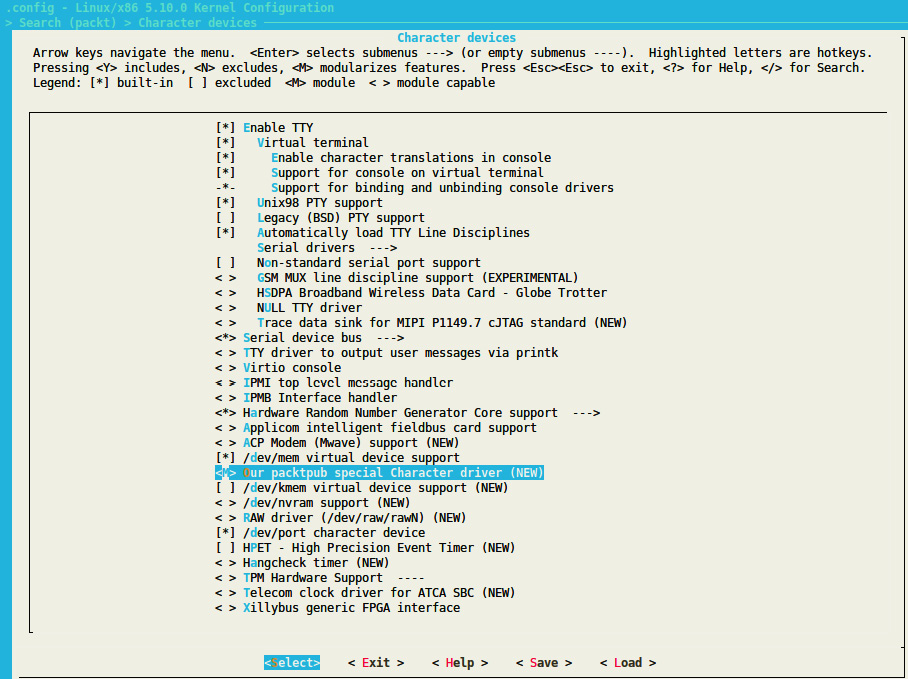
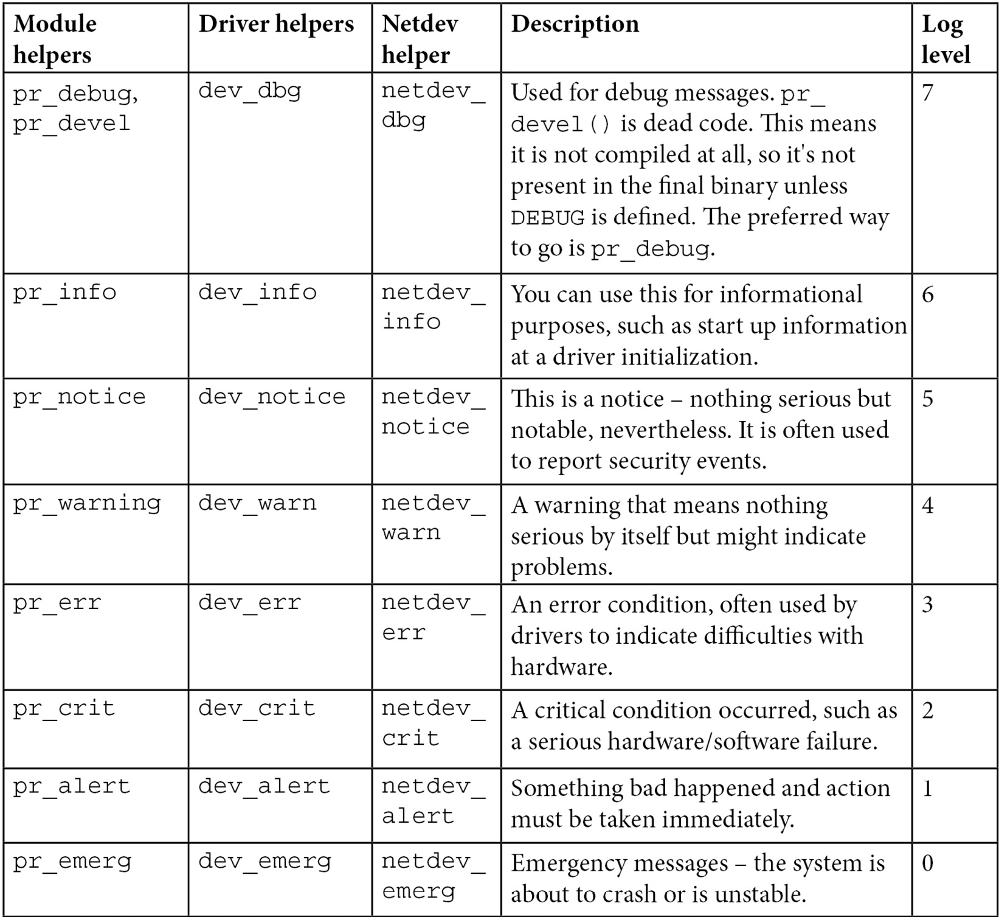

# *Chapter 2*: Understanding Linux Kernel Module Basic Concepts

A kernel module is a piece of software whose aim is to extend the Linux kernel with a new feature. A kernel module can be a device driver, in which case it would control and manage a particular hardware device, hence the name **device driver**. A module can also add a framework support (for example **IIO**, the **Industrial Input Output** framework), extend an existing framework, or even a new filesystem or an extension of it. The thing to keep in mind is that kernel modules are not always device drivers, whereas device drivers are always kernel modules.

In opposition to kernel modules, there might be simple modules or user space modules, running in user space, with low privileges. This book, however, exclusively deals with kernel space modules, particularly Linux kernel modules.

That being said, this chapter will discuss the following topics:

- An introduction to the concept of modules
- Building a Linux kernel module
- Dealing with symbol exports and module dependencies
- Learning some Linux kernel programming tips

# An introduction to the concept of modules

When building the Linux kernel, the resulting image is a single file made by the linking of all object files that correspond to features enabled in the configuration. As a result, all included features are therefore available as soon as the kernel starts, even if the filesystem is not yet ready or does not exist. These features are built-in, and the corresponding modules are called static modules. Such a module is available at any time in the kernel image and thus can't be unloaded, at the cost of extra size to the final kernel image. A static module is also known as a built-in module, since it is part of the final kernel image output. Any change in its code will require the whole kernel to be rebuilt.

Some features (such as device drivers, filesystems, and frameworks) can, however, be compiled as loadable modules. Such modules are separated from the final kernel image and are loaded on demand. These can be considered as plugins that can be loaded/unloaded dynamically to add or remove features (at runtime) to the kernel. Because each module is stored as a separate file on the filesystem, using loadable modules requires access to a filesystem.

To summarize, a module is to the Linux kernel what a plugin (add-on) is to user software (for example, Firefox). When it is statically linked to the resulting kernel image, it is said to be built in. When it is built as a separate file (which can be loaded/unloaded), it is loadable. It dynamically extends the kernel features without even the need to restart the machine.

To support module loading, the kernel must have been built with the following option enabled:

``` c
CONFIG_MODULES=y
```

Unloading modules is a kernel feature that can be enabled or disabled according to the **CONFIG_MODULE_UNLOAD** kernel configuration option. Without this option, we won't be able to unload any module. Thus, to be able to unload modules, the following feature must be enabled:

``` c
CONFIG_MODULE_UNLOAD=y
```

That said, the kernel is smart enough to prevent unloading modules that may probably break things (for example, because these are in use), even if it is asked to do so. This is because the kernel keeps a reference count of module usage so that it knows whether a module is currently in use or not. If the kernel believes it is unsafe to remove a module, it will not. We can, however, change this behavior with the following configuration feature:

``` c
MODULE_FORCE_UNLOAD=y
```

The preceding option allows us to force module unload.

Now that we are done with the main concepts behind modules, let's start practicing, first by introducing a module skeleton that will serve as a basis for this chapter.

## Case study – module skeleton

Let's consider the following **hello-world** module. It will be the basis for our work throughout this chapter. Let's call its compilation unit **helloworld.c**, with the following content:

``` c
#include <linux/module.h>
#include <linux/init.h>
static int __init helloworld_init(void) {
    pr_info("Hello world initialization!\n");
    return 0;
}
static void __exit helloworld_exit(void) {
    pr_info("Hello world exit\n");
}
module_init(helloworld_init);
module_exit(helloworld_exit);
MODULE_LICENSE("GPL");
MODULE_AUTHOR("John Madieu <john.madieu@gmail.com>");
MODULE_DESCRIPTION("Linux kernel module skeleton");
```

In the preceding skeleton, headers are specific to the Linux kernel, hence the use of **linux/xxx.h**. The **module.h** header file is mandatory for all kernel modules, and **init.h** is needed for the **\_\_init** and **\_\_exit** macros. Other elements are described in the next sections. To build this skeleton module, we need to write a *special* makefile, which will be covered a little bit later in this chapter.

### Module entry and exit points

The minimal requirement of a kernel module is an initialization method. This is a must. If the module can be built as a loadable module, then the **exit** method must be provided as well. The first method is the entry point and corresponds to the function called when the module is loaded (**modprobe** or **insmod**), and the latter is the cleanup and exit point and corresponds to the function executed at module unloading (at **rmmod** or **modprobe -r**).

All you need to do is to inform the kernel about which functions should be executed as an entry or exit point. The **helloworld_init** and **helloworld_exit** functions can be given any name. The only thing that is actually mandatory is to identify them as the corresponding initialization and exit functions, passing them as parameters to the **module_init()** and **module_exit()** macros.

To sum up, **module_init()** is used to declare the function that should be called when the module is loaded (with **insmod** or **modprobe** when the module is built as a loadable kernel module) or when the kernel reaches the run level corresponding to this module (when built-in). What is done in the initialization function will define the behavior of the module. **module_exit()** is used only when the module can be built as a loadable kernel module. It declares the function that should be called when the module is unloaded (with **rmmod**).

**init** or **exit** methods are invoked only once, whatever the number of devices currently handled by the module, provided the module is a device driver. It is common for modules that are platform (or alike) device drivers to register a platform driver and the associated **probe**/**remove** callback in their **init** functions, which this time will be invoked each time a device handled by the module is added or removed on the system. In such a case, they just unregister the platform driver from within their **exit** method.

#### \_\_init and \_\_exit attributes

**\_\_init** and **\_\_exit** are kernel macros, defined in **include/linux/init.h**, as shown here:

``` c
#define __init      __section(.init.text)
#define __exit      __section(.exit.text)
```

The **\_\_init** keyword tells the linker to place the symbols (variables or functions) they prefix in a dedicated section in the resulting kernel object file. This section is known in advance to the kernel and freed when the module is loaded and the initialization function has finished. This applies only to built-in modules, not to loadable ones. The kernel will run the initialization function of the driver for the first time during its boot sequence. Since the driver cannot be unloaded, its initialization function will never be called again until the next reboot. There is no need to keep references on this initialization function anymore. It is the same for the **\_\_exit** keyword and the **exit** method, whose corresponding code is omitted when the module is compiled statically into the kernel or when module unloading support is not enabled because, in both cases, the exit function is never called. **\_\_exit** has no effect on loadable modules.

In conclusion, **\_\_init** and **\_\_exit** are Linux directives (macros) that wrap GNU C compiler attributes used for symbol placement. They instruct the compiler to put the code they prefix in the **.init.text** and **.exit.text** sections, respectively, even though the kernel can access different object sections.

### Module information and metadata

Without having to read its code, it should be possible to gather some information (such as the author(s), module parameter descriptions, and the license) about a given module. A kernel module uses its **.modinfo** section to store information about the module. Any **MODULE\_\*** macro will update the content of this section with the values passed as parameters. Some of these macros are **MODULE_DESCRIPTION()**, **MODULE_AUTHOR()**, and **MODULE_LICENSE()**. That said, the real underlying macro provided by the kernel to add an entry to the module information section is **MODULE_INFO(tag, info)**, which adds generic information of the **tag = "info"** form. This means a driver author can add any freeform information they want, such as the following:

``` c
MODULE_INFO(my_field_name, "What easy value");
```

As well as the custom information we define, there is standard information we should provide, which the kernel provides macros for:

- **MODULE_LICENSE**: The license will define how your source code should be shared (or not) with other developers. **MODULE_LICENSE()** tells the kernel what license our module is under. It has an effect on your module behavior, since a license that is not compatible with GPL (General Public License) will result in your module not being able to see/use symbols exported by the kernel through the **EXPORT_SYMBOL_GPL()** macro, which shows the symbols for GPL-compatible modules only. This is the opposite of **EXPORT_SYMBOL()**, which exports functions for modules with any license. Loading a non-GPL-compatible module will also result in a tainted kernel; that means non-open source or untrusted code has been loaded, and you will likely have no support from the community. Remember that the module without **MODULE_LICENSE()** is not considered open source and will taint the kernel too. Available licenses can be found in **include/linux/module.h**, describing the license supported by the kernel.

- **MODULE_AUTHOR()** declares the module's author(s): **MODULE_AUTHOR("John Madieu \<john.madieu@foobar.com\>");**. It is possible to have more than one author. In this case, each author must be declared with **MODULE_AUTHOR()**:

  ``` c
  MODULE_AUTHOR("John Madieu <john.madieu@foobar.com>");
  MODULE_AUTHOR("Lorem Ipsum <l.ipsum@foobar.com>");
  ```

- **MODULE_DESCRIPTION()** briefly describes what the module does: **MODULE_DESCRIPTION("Hello, world! Module")**.

You can dump the content of the **.modeinfo** section of a kernel module using the **objdump -d -j .modinfo** command on the given module. For a cross-compiled module, you should use **\$(CORSS_COMPILE)objdump** instead.

Now that we are done with providing module information and metadata, which are the last requirements when writing Linux kernel modules, let's learn how to build these modules.

# Building a Linux kernel module

Two solutions exist for compiling a kernel module:

- The first solution is when code is outside of the kernel source tree, which is also known as out-of-tree building. The module source code is in a different directory. Building a module this way does not allow integration into the kernel configuration/compilation process, and the module needs to be built separately. It must be noted that with this solution, the module cannot be statically linked in the final kernel image – that is, it cannot be built in. Out-of-tree compilation only allows loadable kernel modules to be produced.
- The second solution is inside the kernel tree, which allows you to upstream your code, since it is well integrated into the kernel configuration/compilation process. This solution allows you to produce either a statically linked module (also known as built-in) or a loadable kernel module.

Now that we have enumerated and given the characteristics of the two possible solutions for building kernel modules, before studying each of them, let's first dig into the Linux kernel build process. This will help us to understand compilation prerequisites for each solution.

## Understanding the Linux kernel build system

The Linux kernel maintains its own build system. It is called **kbuild** (note that the k is lower case). It allows you to configure the Linux kernel and compile it based on the configuration that has been done. It relies essentially on three files to achieve that. These are **Kconfig**, for feature selections, mainly used with in-kernel tree building, and **Kbuild** (note that the K is uppercase this time) or **Makefile**, for compilation rules.

### The Kbuild or Makefile files

From within this build system, the makefile can be called either **Makefile** or **Kbuild**. If both files exist, only **Kbuild** will be used. That said, a makefile is a special file used to execute a set of actions, among which the most common is the compilation of programs. There is a dedicated tool to parse makefiles, called **make**. Using this tool, a kernel module build command pattern resembles the following:

``` c
make -C $KERNEL_SRC M=$(shell pwd) [target]
```

In the preceding pattern, **\$KERNEL_SRC** refers to the path of the prebuilt kernel directory, **-C \$KERNEL_SRC** instructs **make** to change into the specified directory when executing and change back when finished, and **M=\$(shell pwd)** instructs the kernel build system to move back into this directory to find the module that is being built. The value given to **M** is the absolute path of the directory where the module sources (or the associated **Kbuild** file) are located. **\[target\]** corresponds to the subset of the **make** targets available when building an external module. These are as follows:

- **modules**: This is the default target for external modules. It has the same functionality as if no target was specified.
- **modules_install**: This installs the external module(s). The default location is **/lib/modules/\<kernel_release\>/extra/**. This path can be overridden.
- **clean**: This removes all generated files (in the module directory only).

However, we have not told the build system what object files to build or to link together. We must specify the name of the module(s) to be built, along with the list of requisite source files. It can be as simple as the following single line:

``` c
obj-<X> := <module_name>.o
```

In the preceding, the kernel build system will build **\<module_name\>.o** from **\<module_name\>.c** or **\<module_name\>.S**, and after linking, it will result in the **\<module_name\>.ko** kernel loadable module or will be part of the single-file kernel image. **\<X\>** can be either **y**, **m**, or left blank.

How and if **mymodule.o** will be built or linked depends on the value of **\<X\>**:

- If **\<X\>** is set to **m**, the **obj-m** variable is used, and **mymodule.o** will be built as a loadable kernel module.
- If **\<X\>** is set to **y**, the **obj-y** variable is used, and **mymodule.o** will be built as part of the kernel. You then say "**foo** is a built-in kernel module".
- If **\<X\>** is not set, the **obj-** variable is used, and **mymodule.o** will not be built at all.

However, the **obj-\$(CONFIG_XXX)** pattern is often used, where **CONFIG_XXX** is a kernel configuration option, set or not, during the kernel configuration process. An example is the following:

``` c
obj-$(CONFIG_MYMODULE) += mymodule.o
```

**\$(CONFIG_MYMODULE)** evaluates to either **y**, **m**, or nothing (blank), according to its value during the kernel configuration (displayed with **menuconfig**). If **CONFIG_MYMODULE** is neither **y** nor **m**, then the file will not be compiled nor linked. **y** means built-in (it stands for **yes** in the kernel configuration process), and **m** stands for a loadable module. **\$(CONFIG_MYMODULE)** pulls the right answer from the normal config process.

So far, we have assumed the module is built from a single **.c** source file. When the module is built from multiple source files, an additional line is needed for listing these source files, as shown here:

``` c
<module_name>-y := <file1>.o <file2>.o
```

The preceding says that **\<module_name\>.ko** will be built from two files, **file1.c** and **file2.c**. However, if you wanted to build two modules, let's say **foo.ko** and **bar.ko**, the **Makefile** line would be as follows:

``` c
obj-m := foo.o bar.o
```

If **foo.o** and **bar.o** are made of source files other than **foo.c** and **bar.c**, you can specify the appropriate source files of each object file, as shown here:

``` c
obj-m := foo.o bar.o
foo-y := foo1.o foo2.o . . .
bar-y := bar1.o bar2.o bar3.o . . .
```

The following is another example of listing the requisite source files to build a given module:

``` c
obj-m := 8123.o
8123-y := 8123_if.o 8123_pci.o 8123_bin.o
```

The preceding example says that **8123** should be built as a loadable kernel module by building and linking **8123_if.c**, **8123_pci.c**, and **8123_bin.c** together.

Apart from the files being part of the resulting build artifact, the **Makefile** file can also contain compiler and linker flags, such as the following:

``` c
ccflags-y := -I$(src)/include
ccflags-y += -I$(src)/src/hal/include
ldflags-y := -T$(src)foo_sections.lds
```

What is important here is the fact that such flags can be specified as well, not the values we have set in the example.

There is another use case of **obj-\<X\>**, described in the following:

``` c
obj-<X> += somedir/
```

This means that the kernel build system should go into the directory named **somedir** and look for any **Makefile** or **Kbuild** files inside, processing it in order to decide what objects should be built.

We can summarize what we just said with the following Makefile:

``` c
# kbuild part of makefile
obj-m := helloworld.o
#the following is just an example
#ldflags-y := -T foo_sections.lds
# normal makefile
KERNEL_SRC ?= /lib/modules/$(shell uname -r)/build
all default: modules
install: modules_install
modules modules_install help clean:
    $(MAKE) -C $(KERNEL_SRC) M=$(shell pwd) $@
```

The following describes this minimalist **Makefile** skeleton:

- **obj-m := helloworld.o**: **obj-m** lists modules we want to build. For each **\<filename\>.o**, the build system will look for **\<filename\>.c** or **\<filename\>.S** to build. **obj-m** is used to build a loadable kernel module, whereas **obj-y** will result in a built-in kernel module.
- **KERNEL_SRC= /lib/modules/\$(shell uname -r)/build**: **KERNEL_SRC** is the location of the prebuilt kernel source. As we said earlier, we need a prebuilt kernel in order to build any module. If you have built your kernel from the source, you should set this variable with the absolute path of the built source directory. **–C** instructs the **make** utility to change into the specified directory reading the makefiles.
- **M=\$(shell pwd)**: This is relevant to the kernel build system. The **Makefile** kernel uses this variable to locate the directory of an external module to build. Your **.c** files should be placed in that directory.
- **all default**: **modules**: This line instructs the **make** utility to execute the **modules** target as a dependency of **all** or **default** targets. In other words, **make default**, **make all**, or simple **make** commands will result in **make modules** being executed prior to execute any subsequent command if any.
- **modules modules_install help clean**: This line represents the list target that is valid in this makefile.
- **\$(MAKE) -C \$(KERNELDIR) M=\$(shell pwd) \$@**: This is the rule to be executed for each of the targets enumerated previously. **\$@** will be replaced with the parameters given to **make**, which includes the target. Using this kind of magic word prevents us from writing as many (identical) lines as there are targets. In other words, if you run **make modules**, **\$@** will be replaced with **modules**, and the rule will become **\$(MAKE) -C \$(KERNELDIR) M=\$(shell pwd) modules**.

Now that we are familiar with the kernel build system requirements, let's see how modules are actually built.

## Out-of-tree building

Before you can build an external module, you need to have a complete and precompiled kernel source tree. The prebuilt kernel version must be the same as the kernel you'll load and use your module with. There are two ways to obtain a prebuilt kernel version:

- Building it by yourself (which we discussed earlier): This can be used for both native and cross-compilation. Using a build system such as Yocto or Buildroot may help.
- Installing the **linux-headers-\*** package from the distribution package feed: This applies only for x86 native compilations unless your embedded target runs a Linux distribution that maintains a package feed (such as Raspbian).

It must be noted that is it not possible to build a built-in kernel module with out-of-tree building. The reason is that building a Linux kernel module out of tree requires a prebuilt or prepared kernel.

### Native and out-of-tree module compiling

With a native kernel module build, the easiest way is to install the prebuilt kernel headers and to use their directory path as the kernel directory in the makefile. Before we start doing so, headers can be installed with the following command:

``` c
sudo apt update
sudo apt install linux-headers-$(uname -r)
```

This will install preconfigured and prebuilt kernel headers (not the whole source tree) in **/usr/src/linux-headers-\$(uname -r)**. There will be a symbolic link, **/lib/modules/\$(uname -r)/build**, pointing to the previously installed headers. It is the path you should specify as the kernel directory in **Makefile**. You should remember that **\$(uname -r)** corresponds to the kernel version in use.

Now, when you are done with the makefile, still in your module source directory, run the **make** command or **make modules**:

``` c
$ make
make -C /lib/modules/ 5.11.0-37-generic/build \
    M=/home/john/driver/helloworld modules
make[1]: Entering directory '/usr/src/linux-headers- 5.11.0-37-generic'
  CC [M]  /media/jma/DATA/work/tutos/sources/helloworld/helloworld.o
  Building modules, stage 2.
  MODPOST 1 modules
  CC      /media/jma/DATA/work/tutos/sources/helloworld/helloworld.mod.o
  LD [M]  /media/jma/DATA/work/tutos/sources/helloworld/helloworld.ko
make[1]: Leaving directory '/usr/src/linux-headers- 5.11.0-37-generic'
```

At the end of the build, you'll have the following:

``` c
$ ls
helloworld.c  helloworld.ko  helloworld.mod.c  helloworld.mod.o  helloworld.o  Makefile  modules.order  Module.symvers
```

To test, you can do the following:

``` c
$ sudo insmod  helloworld.ko
$ sudo rmmod helloworld
$ dmesg
[...]
[308342.285157] Hello world initialization!
[308372.084288] Hello world exit
```

The preceding example only deals with a native build, compiling on a machine running a standard distribution, allowing us to leverage its package repository to install prebuilt kernel headers. In the next section, we will discuss out-of-tree module cross-compilation.

### Out-of-tree module cross-compiling

When it comes to cross-compiling an out-of-tree kernel module, there are essentially two variables that the kernel **make** command needs to be aware of. These are **ARCH** and **CROSS_COMPILE**, which respectively represent the target architecture and the cross-compiler prefix. Moreover, the location of a prebuilt kernel for the target architecture must be specified in the makefile. In our skeleton, we called it **KERNEL_SRC**.

When using a build system such as Yocto, the Linux kernel is first cross-compiled as a dependency before it starts cross-compiling the module. That said, I voluntarily used the **KERNEL_SRC** variable name for the prebuilt kernel directory, since this variable is automatically exported by Yocto for kernel module recipes. It is set to the value of **STAGING_KERNEL_DIR** within the **module.bbclass** class, inherited by all kernel module recipes.

That said, what changes between native compilation and cross-compilation of an out-of-tree kernel module is the final **make** command, which looks like the following for a 32-bit Arm architecture:

``` c
make ARCH=arm CROSS_COMPILE=arm-linux-gnueabihf-
```

For the 64-bit variant, it would look like the following:

``` c
make ARCH=aarch64 CROSS_COMPILE=aarch64-linux-gnu-
```

The previous commands assume the cross-compiled kernel source path has been specified in the makefile.

## In-tree building

In-tree module building requires dealing with an additional file, **Kconfig**, which allows us to expose the module features in the configuration menu. That said, before you can build a module in the kernel tree, you should first identify which directory should host your source files. Given your filename, **mychardev.c**, which contains the source code of your special character driver, it should be changed to the **drivers/char** directory in the kernel source. Every subdirectory in the drivers has both **Makefile** and **Kconfig** files.

Add the following content to the **Kconfig** file of that directory:

``` c
config PACKT_MYCDEV
    tristate "Our packtpub special Character driver"
    default m
    help
      Say Y here to support /dev/mycdev char device.
      The /dev/mycdev is used to access packtpub.
```

In **Makefile** in that same directory, add the following line:

``` c
obj-$(CONFIG_PACKT_MYCDEV)   += mychardev.o
```

Be careful when updating **Makefile** – the **.o** file name must match the exact name of the **.c** file. If the source file is **foobar.c**, you must use **foobar.o** in **Makefile**. In order to have your module built as a loadable kernel module, add the following line to your **defconfig** board in the **arch/arm/configs** directory:

``` c
CONFIG_PACKT_MYCDEV=m
```

You can also run **menuconfig** to select it from the UI, run **make** to build the kernel, and then **make modules** to build modules (including yours). To make the driver built-in, just replace **m** with **y**:

``` c
CONFIG_PACKT_MYCDEV=y
```

Everything described here is what embedded board manufacturers do in order to provide a **Board Support Package** (**BSP**) with their board, with a kernel that already contains their custom drivers:



Figure 2.1 – The Packt_dev module in the kernel tree

Once configured, you can build the kernel with **make**, and build modules with **make modules**.

Modules included in the kernel source tree are installed in **/lib/modules/\$(unale -r)/kernel/**. On your Linux system, it is **/lib/modules/\$(uname -r)/kernel/**.

Now that we are familiar with out-of-tree or in-tree kernel module compilation, let's see how to handle module behavior adaptation by allowing parameters to be passed to this module.

# Handling module parameters

Similar to a user program, a kernel module can accept arguments from the command line. This allows us to dynamically change the behavior of the module according to the given parameters, which can help a developer not have to indefinitely change/compile the module during a test/debug session. In order to set this up, we should first declare the variables that will hold the values of command-line arguments and use the **module_param()** macro on each of these. The macro is defined in **include/linux/moduleparam.h** (this should be included in the code too – **\#include \<linux/moduleparam.h\>**) as follows:

``` c
module_param(name, type, perm);
```

This macro contains the following elements:

- **name**: The name of the variable used as the parameter.
- **type**: The parameter's type (**bool**, **charp**, **byte**, **short**, **ushort**, **int**, **uint**, **long**, and **ulong**), where **charp** stands for *character pointer*.
- **perm**: This represents the **/sys/module/\<module\>/parameters/\<param\>** file permissions. Some of them are **S_IWUSR**, **S_IRUSR**, **S_IXUSR**, **S_IRGRP**, **S_WGRP**, and **S_IRUGO**, where the following applies:
  - **S_I** is just a prefix.
  - **R** = read, **W** = write, and **X** = execute.
  - **USR** = user, **GRP** = group, and **UGO** = user, group, and others.

You can eventually use **\|** (the **OR** operation) to set multiple permissions. If **perm** is **0**, the file parameter in Sysfs will not be created. You should use only **S_IRUGO** read-only parameters, which I highly recommend; by OR'ing with other properties, you can obtain fine-grained properties.

When using module parameters, **MODULE_PARM_DESC** can be used on a per-parameter basis to describe each of them. This macro will populate the module information section of each parameter's description. The following is a sample, from the **helloworld-params.c** source file provided with the code repository of this book:

``` c
#include <linux/moduleparam.h>
[...]
static char *mystr = "hello";
static int myint = 1;
static int myarr[3] = {0, 1, 2};
module_param(myint, int, S_IRUGO);
module_param(mystr, charp, S_IRUGO);
module_param_array(myarr, int,NULL, S_IWUSR|S_IRUSR);
MODULE_PARM_DESC(myint,"this is my int variable");
MODULE_PARM_DESC(mystr,"this is my char pointer variable");
MODULE_PARM_DESC(myarr,"this is my array of int");
static int foo()
{
    pr_info("mystring is a string: %s\n",
             mystr);
    pr_info("Array elements: %d\t%d\t%d",
             myarr[0], myarr[1], myarr[2]);
    return myint;
}
```

To load the module and feed our parameter, we do the following:

``` c
# insmod hellomodule-params.ko mystring="packtpub" myint=15 myArray=1,2,3
```

That said, we could have used **modinfo** prior to loading the module in order to display a description of parameters supported by the module:

``` c
$ modinfo ./helloworld-params.ko
filename:       /home/jma/work/tutos/sources/helloworld/./helloworld-params.ko
license:      GPL
author:       John Madieu <john.madieu@gmail.com>
srcversion:   BBF43E098EAB5D2E2DD78C0
depends:
vermagic:     4.4.0-93-generic SMP mod_unload modversions
parm:         myint:this is my int variable (int)
parm:         mystr:this is my char pointer variable (charp)
parm:         myarr:this is my array of int (array of int)
```

It is also possible to find and edit the current values for the parameters of a loaded module from Sysfs in **/sys/module/\<name\>/parameters**. In that directory, there is one file per parameter, containing the parameter value. These parameter values can be changed if the associated files have write permissions (which depends on the module code).

The following is an example:

``` c
echo 0 > /sys/module/usbcore/parameters/authorized_default
```

Not just loadable kernel modules can accept parameters. Provided that a module is built in the kernel, you can specify parameters for this module from the Linux kernel command line (the one passed by the bootloader or the one that is provided by the **CONFIG_CMDLINE** configuration option).

This has the following form:

``` c
[initial command line ...] my_module.param=value
```

In this example, **my_module** corresponds to the module name and **value** is the value assigned to this parameter.

Now that we are able to deal with module parameters, let's dive a bit deeper into a not-so-obvious scenario, where we will learn how the Linux kernel itself and its build system handles module dependencies.

# Dealing with symbol exports and module dependencies

Only a limited number of kernel functions can be called from a kernel module. To be visible to a kernel module, functions and variables must be explicitly exported by the kernel. Thus, the Linux kernel exposes two macros that can be used to export functions and variables. These are the following:

- **EXPORT_SYMBOL(symbolname)**: This macro exports a function or variable to all modules.
- **EXPORT_SYMBOL_GPL(symbolname)**: This macro exports a function or variable only to GPL modules.

**EXPORT_SYMBOL()** or its GPL counterpart are Linux kernel macros that make a symbol available to loadable kernel modules or dynamically loaded modules (provided that said modules add an **extern** declaration – that is, include the headers corresponding to the compilation units that exported the symbols). **EXPORT_SYMBOL()** instructs the Kbuild mechanism to include the symbol passed as an argument in the global list of kernel symbols. As a result, kernel modules can access them. Code that is built into the kernel itself (as opposed to loadable kernel modules) can, of course, access any non-static symbol via an extern declaration, as with conventional C code.

These macros also allow us to export, from loadable kernel modules, symbols that can be accessed from other loadable kernel modules. An interesting thing is that a symbol thus exported by one module becomes accessible to another module that may depend on it! A normal driver should not need any non-exported function.

## An introduction to the concept of module dependencies

A dependency of module B on module A is that module B is using one or more of the symbols exported by module A. Let's see in the next section how such dependencies are handled in the Linux kernel infrastructure.

### The depmod utility

**depmod** is a tool that you run during the kernel build process to generate module dependency files. It does that by reading each module in **/lib/modules/\<kernel_release\>/** to determine what symbols it should export and what symbols it needs. The result of that process is written to a **modules.dep** file, and its binary version, **modules.dep.bin**. It is a kind of module indexing.

### Module loading and unloading

For a module to be operational, you should load it into the Linux kernel, either by using **insmod** and passing the module path as an argument, which is the preferred method during development, or by using **modprobe**, a clever command but which is preferable for use in production systems.

#### Manual loading

Manual loading needs the intervention of a user, which should have **root** access. The two classical methods to achieve this are **modprobe** and **insmod**, which are described as follows.

During development, you usually use **insmod** in order to load a module. **insmod** should be given the path of the module to load, as follows:

``` c
insmod /path/to/mydrv.ko
```

This is the low-level form of module loading, which forms the basis of the other module-loading method and the one we will use in this book. On the other hand, there is **modprobe**, mostly used by system admins or in a production system. **modprobe** is a clever command that parses the **modules.dep** file (discussed previously) in order to load dependencies first, prior to loading the given module. It automatically handles module dependencies, as a package manager does. It is invoked as follows:

``` c
modprobe mydrv
```

Whether we can use **modprobe** depends on **depmod** being aware of module installation.

#### Auto-loading

The **depmod** utility doesn't only build **modules.dep** and **modules.dep.bin** files; it does more than that. When kernel developers write drivers, they know exactly what hardware the drivers will support. They are then responsible for feeding the drivers with the product and vendor IDs of all devices supported by the driver. **depmod** also processes module files in order to extract and gather that information and generates a **modules.alias** file, located in **/lib/modules/\<kernel_release\>/modules.alias**, which maps devices to their drivers:

An excerpt of **modules.alias** is as follows:

``` c
alias usb:v0403pFF1Cd*dc*dsc*dp*ic*isc*ip*in* ftdi_sio
alias usb:v0403pFF18d*dc*dsc*dp*ic*isc*ip*in* ftdi_sio
alias usb:v0403pDAFFd*dc*dsc*dp*ic*isc*ip*in* ftdi_sio
alias usb:v0403pDAFEd*dc*dsc*dp*ic*isc*ip*in* ftdi_sio
alias usb:v0403pDAFDd*dc*dsc*dp*ic*isc*ip*in* ftdi_sio
alias usb:v0403pDAFCd*dc*dsc*dp*ic*isc*ip*in* ftdi_sio
[...]
```

At this step, you'll need a user space hotplug agent (or device manager), usually **udev** (or **mdev**), that will register with the kernel to get notified when a new device appears.

The notification is done by the kernel, sending the device's description (the product ID, the vendor ID, the class, the device class, the device subclass, the interface, and any other information that can identify a device) to the hotplug daemon, which in turn calls **modprobe** with this information. **modprobe** then parses the **modules.alias** file in order to match the driver associated with the device. Before loading the module, **modprobe** will look for its dependencies in **module.dep**. If it finds any, they will be loaded prior to the associated module loading; otherwise, the module is loaded directly.

There is another method for automatically loading a module, at boot time this time. This is achieved in **/etc/modules-load.d/\<filename\>.conf**. If you want some modules to be loaded at boot time, just create a **/etc/modules-load.d/\<filename\>.conf** file and add the module names that should be loaded, one per line. **\<filename\>** will be meaningful to you, and people usually use **module**: **/etc/modules-load.d/modules.conf**. You can create as many **.conf** files as you need.

An example of **/etc/modules-load.d/mymodules.conf** is as follows:

``` c
#This line is a comment
uio
iwlwifi
```

These configuration files are processed by **systemd-modules-load.service**, provided that **systemd** is the initialization manager on your machine. On **SysVinit** systems, these files are processed by the **/etc/init.d/kmod** script.

#### Module unloading

The usual command to unload a module is **rmmod**. This is preferable to unloading a module loaded with the **insmod** command. The command should be given the module name to unload as a parameter:

``` c
rmmod -f mymodule
```

On the other hand, a higher-level command to unload a module in a smart manner is **modeprobe –r**, which automatically unloads unused dependencies:

``` c
modeprobe -r mymodule
```

As you may have guessed, it is a helpful option for developers. Finally, we can check whether a module is loaded with the **lsmod** command, as follows:

``` c
$ lsmod
Module                  Size  Used by
btrfs                1327104  0
blake2b_generic        20480  0
xor                    24576  1 btrfs
raid6_pq              114688  1 btrfs
ufs                    81920  0
[...]
```

The output includes the name of the module, the amount of memory it uses, the number of other modules that use it, and finally, the name of these. The output of **lsmod** is actually a nice formatting view of what you can see under **/proc /modules**, which is the file listing loaded modules:

``` c
$ cat /proc/modules
btrfs 1327104 0 - Live 0x0000000000000000
blake2b_generic 20480 0 - Live 0x0000000000000000
xor 24576 1 btrfs, Live 0x0000000000000000
raid6_pq 114688 1 btrfs, Live 0x0000000000000000
ufs 81920 0 - Live 0x0000000000000000
qnx4 16384 0 - Live 0x0000000000000000
```

The preceding output is raw and poorly formatted. Therefore, it is preferable to use **lsmod**.

Now that we are familiar with kernel module management, let's extend our kernel development skills by learning some tips that kernel developers have adopted.

# Learning some Linux kernel programming tips

Linux kernel development is about learning from others and not reinventing the wheel. There is a set of rules to follow when doing kernel development. A whole chapter won't be enough to cover these rules. Thus, I picked two of the most relevant to me, those that are likely to change when programming for user space: error handling and message printing.

In user space, exiting from the **main()** method is enough to recover from all the errors that may have occurred. In the kernel, this is not the case, especially since it directly deals with the hardware. Things are different for message printing as well, and we will see that in this section.

## Error handling

Returning the wrong error code for a given error can result in either the kernel or user space application misinterpreting and taking the wrong decision, producing unneeded behavior. To keep things clear, there are predefined errors in the kernel tree that cover almost every case you may face. Some of the errors (with their meaning) are defined in **include/uapi/asm-generic/errno-base.h**, and the rest of the list can be found in **include/uapi/asm-generic/errno.h**. The following is an excerpt of this list of errors, from **include/uapi/asm-generic/errno-base.h**:

``` c
#define  EPERM    1    /* Operation not permitted */
#define  ENOENT   2    /* No such file or directory */
#define  ESRCH    3    /* No such process */
#define  EINTR    4    /* Interrupted system call */
#define  EIO      5    /* I/O error */
#define  ENXIO    6    /* No such device or address */
#define  E2BIG    7    /* Argument list too long */
#define  ENOEXEC  8    /* Exec format error */
#define  EBADF    9    /* Bad file number */
#define  ECHILD   10   /* No child processes */
#define  EAGAIN   11   /* Try again */
#define  ENOMEM   12   /* Out of memory */
#define  EACCES   13   /* Permission denied */
#define  EFAULT   14   /* Bad address */
#define  ENOTBLK  15   /* Block device required */
#define  EBUSY    16   /* Device or resource busy */
#define  EEXIST   17   /* File exists */
#define  EXDEV    18   /* Cross-device link */
#define  ENODEV   19   /* No such device */
[...]
```

Most of the time, the standard way to return an error is to do so in the form of **return –ERROR**, especially when it comes to answering system calls. For example, for an I/O error, the error code is **EIO**, and you should return **-EIO**, as follows:

``` c
dev = init(&ptr);
if(!dev)
    return –EIO
```

Errors sometimes cross the kernel space and propagate themselves to the user space. If the returned error is an answer to a system call (**open**, **read**, **ioctl**, or **mmap**), the value will be automatically assigned to the user space **errno** global variable, on which you can use **strerror(errno)** to translate the error into a readable string:

``` c
#include <errno.h>  /* to access errno global variable */
#include <string.h>
[...]
if(wite(fd, buf, 1) < 0) {
    printf("something gone wrong! %s\n", strerror(errno));
}
[...]
```

When you face an error, you must undo everything that has been set until the error occurred. The usual way to do that is to use the **goto** statement:

``` c
ret = 0;
ptr = kmalloc(sizeof (device_t));
if(!ptr) {
        ret = -ENOMEM
        goto err_alloc;
}
dev = init(&ptr);
if(!dev) {
        ret = -EIO
        goto err_init;
}
return 0;
err_init:
        free(ptr);
err_alloc:
        return ret;
```

The reason to use the **goto** statement is simple. When it comes to handling errors, let's say that at *step 5*, you have to clean up the previous operations (*steps 4*, *3*, *2*, and *1*), instead of doing lots of nested checking operations, as follows:

``` c
if (ops1() != ERR) {
    if (ops2() != ERR) {
        if (ops3() != ERR) {
            if (ops4() != ERR) {
```

This is less readable, error-prone, and confusing (readability also depends on indentation). By using the **goto** statement, we have straight control flow, as follows:

``` c
if (ops1() == ERR) // ||
    goto error1;   // ||
if (ops2() == ERR) // ||
    goto error2;   // ||
if (ops3() == ERR) // ||
    goto error3;   // ||
if (ops4() == ERR) // VV
    goto error4;
error5:
[...]
error4:
[...]
error3:
[...]
error2:
[...]
error1:
[...]
```

That said, you should only use **goto** to move forward in a function, not backward, nor to implement loops (as is the case in an assembler).

### Handling null pointer errors

When it comes to returning an error from functions that are supposed to return a pointer, functions often return the **NULL** pointer. It is functional but it is a quite meaningless approach, since we do not exactly know why this **NULL** pointer is returned. For that purpose, the kernel provides three functions, **ERR_PTR**, **IS_ERR**, and **PTR_ERR**, defined as follows:

``` c
void *ERR_PTR(long error);
long IS_ERR(const void *ptr);
long PTR_ERR(const void *ptr);
```

The first macro returns the error value as a pointer. It can be seen as an *error value to pointer* macro. Given a function that is likely to return **-ENOMEM** after a failed memory allocation, we have to do something such as **return ERR_PTR(-ENOMEM);**. The second macro is used to check whether the returned value is a pointer error using **if(IS_ERR(foo))**. The last one returns the actual error code, **return PTR_ERR(foo)**. It can be seen as a *pointer to error value* macro.

The following is an example of how to use **ERR_PTR**, **IS_ERR**, and **PTR_ERR**:

``` c
static struct iio_dev *indiodev_setup(){
    [...]
    struct iio_dev *indio_dev;
    indio_dev = devm_iio_device_alloc(&data->client->dev,
                                      sizeof(data));
    if (!indio_dev)
        return ERR_PTR(-ENOMEM);
    [...]
    return indio_dev;
}
static int foo_probe([...]){
    [...]
    struct iio_dev *my_indio_dev = indiodev_setup();
    if (IS_ERR(my_indio_dev))
        return PTR_ERR(data->acc_indio_dev);
    [...]
}
```

This is a plus with error handling, which is also an excerpt of the kernel coding style that states that if a function's name is an action or an imperative command, the function should return an integer error code. If, however, the function's name is a predicate, this function should return a Boolean to indicate the succeeded status of the operation.

**Add work**, for example, is a command, thus the **add_work()** function returns **0** for success or **-EBUSY** for failure. **PCI device present** is a predicate, and in the same way, this is why the **pci_dev_present()** function returns **1** if it succeeds in finding a matching device or **0** if it doesn't.

## Message printing – goodbye printk, long life dev\_\*, pr\_\*, and net\_\* APIs

Apart from informing users of what is going on, printing is the first debugging technique. **printk()** is to the kernel what **printf()** is to the user space. **printk()** has, for a long time, ruled kernel message printing in a leveled manner. Written messages can be displayed using the **dmesg** command. Depending on how important the message to print was, **printk()** allowed you to choose between eight log-level messages, defined in **include/linux/kern_levels.h**, along with their meaning.

Nowadays, while **printk()** remains the low-level message printing API, the printk/log-level pair has been encoded into clearly named helpers, which are recommended for use in new drivers. These are as follows:

- **pr\_\<level\>(...)**: This is used in regular modules that are not device drivers.
- **dev\_\<level\>(struct device \*dev, ...)**: This is to be used in device drivers that are not network devices (also known as **netdev** drivers).
- **netdev\_\<level\>(struct net_device \*dev, ...)**: This is used in **netdev** drivers exclusively.

In all these helpers, **\<level\>** represents the log level encoded into a quite meaningful name, as described in the following table:



Table 2.1 – The Linux kernel printing API

Log levels work in a way that, whenever a message is printed, the kernel compares the message log level with the current console log level; if the former is higher (lower value) than the last, the message will be immediately printed to the console. You can check your log-level parameters with the following:

``` c
cat /proc/sys/kernel/printk
4        4         1        7
```

In the preceding output, the first value is the current log level (**4**). According to that, any message printed with higher importance (a lower log level) will be displayed in the console as well. The second value is the default log level, according to the **CONFIG_DEFAULT_MESSAGE_LOGLEVEL** option. Other values are not relevant for the purpose of this chapter, so let's ignore them.

The current log level can be changed with the following:

``` c
echo <level> > /proc/sys/kernel/printk
```

In addition, you can prefix the module output messages with a custom string. To achieve this, you should define the **pr_fmt** macro. It is common to define this message prefix with the module name, as follows:

``` c
#define pr_fmt(fmt) KBUILD_MODNAME ": " fmt
```

For more concise log output, some overrides use the current function name as a prefix, as follows:

``` c
#define pr_fmt(fmt) "%s: " fmt, __func__
```

If we consider the **net/bluetooth/lib.c** file in the kernel source tree, we can see the following in the first line:

``` c
#define pr_fmt(fmt) "Bluetooth: " fmt
```

With that line, any **pr\_\<level\>** (we are in a regular module, not a device driver) logging call will produce a log prefixed with **Bluetooth:**, similar to the following:

``` c
$ dmesg | grep Bluetooth
[ 3.294445] Bluetooth: Core ver 2.22
[ 3.294458] Bluetooth: HCI device and connection manager initialized
[ 3.294460] Bluetooth: HCI socket layer initialized
[ 3.294462] Bluetooth: L2CAP socket layer initialized
[ 3.294465] Bluetooth: SCO socket layer initialized
[...]
```

This is all about message printing. We have learned how to choose and use the appropriate printing APIs according to the situation.

We are now done with our kernel module introduction series. At this stage, you should be able to download, configure, and (cross-)compile the Linux kernel, as well as write and build kernel modules against this kernel.

Note

**printk()** (or its encoded helpers) never blocks and is safe enough to be called even from atomic contexts. It tries to lock the console and print the message. If locking fails, the output will be written into a buffer and the function will return, never blocking. The current console holder will then be notified about new messages and will print them before releasing the console.

# Summary

This chapter showed the basics of driver development and explained the concept of built-in and loadable kernel modules, as well as their loading and unloading. Even if you are not able to interact with the user space, you are ready to write a working module, print formatted messages, and understand the concept of **init**/**exit**.

The next chapter will deal with Linux kernel core functions, which, along with this chapter, form the Swiss army knife of Linux kernel development. In the next chapter, you will be able to target enhanced features, perform fancy operations that can impact the system, and interact with the core of the Linux kernel.