# *Chapter 10*: Understanding the Linux Kernel Memory Allocation

Linux systems use an illusion referred to as "virtual memory." This mechanism makes every memory address virtual, which means they do not point to any address in the RAM directly. This way, whenever we access a memory location, a translation mechanism is performed in order to match the corresponding physical memory.

In this chapter, we will deal with the whole Linux memory allocation and management system, covering the following topics:

- An introduction to Linux kernel memory-related terms
- Demystifying address translation and MMU
- Dealing with memory allocation mechanisms
- Working with I/O memory to talk with hardware
- Memory remapping

# An introduction to Linux kernel memory-related terms

Though system memory (also known as RAM) can be extended in some computers that allow it, physical memory is a limited resource in computer systems.

Virtual memory is a concept, an illusion given to each process so that it thinks it has large and almost infinite memory, and sometimes more than the system really has. To set up everything, we will introduce the address space, virtual or logical address, physical address, and bus address terms:

- A physical address identifies a physical (RAM) location. Because of the virtual memory mechanism, the user or the kernel never directly deals with the physical address but can access it by its corresponding logical address.
- A virtual address does not necessarily exist physically. This address is used as a reference to access the physical memory location by CPU on behalf of the **Memory Management Unit** (**MMU**). The MMU sits between the CPU core and memory and is most often part of the physical CPU itself. That said, on ARM architectures, it's part of the licensed core. It is then responsible for converting virtual addresses into physical addresses every time memory locations are accessed. This mechanism is called **address translation**.
- A logical address is an address resulting from a linear mapping. It results from a mapping above **PAGE_OFFSET**. Such addresses are virtual addresses with a fixed offset from their physical addresses. Thus, a logical address is always a virtual address, and the reverse is not true.
- In computer systems, an address space is the amount of memory allocated for all possible addresses for a computational entity (in our case, the CPU). This address space may be virtual or physical. While physical address space can go up to the amount of RAM installed on the system (theoretically limited by the width of the CPU address bus and registers), the range of virtual addresses can extend to the highest address permitted by the RAM or by the operating system architecture (such as addressing up to 4 GB of virtual memory on a 1 GB RAM system).

As the MMU is the centerpiece of memory management, it organizes memory into logical units of fixed size called **pages**. The size of a page is a power of 2 in bytes and varies among systems. A page is backed by a page frame, and the size of the page matches a page frame. Before going further in our learning of memory management, let's introduce the other terms:

- A memory page, virtual page, or simply a page are terms used to refer to a fixed-length (**PAGE_SIZE**) block of virtual memory. The same term page is used as a kernel data structure to represent a memory page.
- On the other hand, a frame (or page frame) refers to a fixed-length block of physical memory (RAM) on top of which the operating system maps a page. The size of the page matches a page frame. Each page frame is given a number, called the **Page Frame Number** (**PFN**).
- Then comes the term **page table**, which is a kernel and architecture data structure used to store the mappings between virtual addresses and physical addresses. The key pair page/frame describes a single entry in the page table and represents a mapping.

Finally, the term "page-aligned" is used to qualify an address that starts exactly at the beginning of a page. It goes without saying that any memory whose address is a multiple of the system page size is said to be page-aligned. For example, on a 4 KB page size system, **4.096**, **20.480**, and **409.600** are instances of page-aligned memory addresses.

Note

The page size is fixed by the MMU, and the operating system can't modify it. Some processors allow for multiple page sizes (for example, ARMv8-A supports three different granule sizes: 4 KB, 16 KB, and 64 KB), and the OS can decide which one to use. 4 KB is a widely popular page granularity though.

Now that the terms frequently used while dealing with memory have been introduced, let's focus on memory management and organization by the kernel.

Linux is a virtual memory operating system. On a Linux running system, each process and even the kernel itself (and some devices) is allocated address space, which is some portion of the processor's virtual address space (note that neither the kernel nor processes deal with physical addresses – only MMU does). While this virtual address space is split between the kernel and user space, the upper part is used for the kernel and the lower part is used for user space.

The split varies between architectures and is held by the **CONFIG_PAGE_OFFSET** kernel configuration option. For 32-bit systems, the split is at **0xC0000000** by default. This is called the 3 GB/1 GB split, where the user space is given the lower 3 GB of virtual address space. The kernel can, however, be given a different amount of address space as desired by playing with the **CONFIG_VMSPLIT_1G**, **CONFIG_VMSPLIT_2G**, and **CONFIG_VMSPLIT_3G_OPT** kernel configuration options (see **arch/x86/Kconfig** and **arch/arm/Kconfig**). For 64-bit, the split varies by architecture, but it's high enough: **0x8000000000000000** for 64-bit ARM, and **0xffff880000000000** for x86_64.

A typical process's virtual address space layout looks like the following on a 32-bit system with the default splitting scheme:

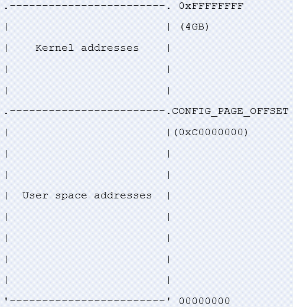

Figure 10.1 – 32-bit system memory splitting

While this layout is transparent on 64-bit systems, there are particularities on 32-bit machines that need to be introduced. In the next sections, we will study in detail the reason for this memory splitting, its usage, and where it applies.

## Kernel address space layout on 32-bit systems – the concept of low and high memory

In an ideal world, all memory is permanently mappable. There are, however, some restrictions on 32-bit systems. This results in only a portion of RAM being permanently mapped. This part of memory can be accessed directly (by simple dereference) by the kernel and is called **low memory**, while the part of (physical) memory not covered by a permanent mapping is referred to as **high memory**. There are various architecture-dependent constraints on where exactly that border lies. For example, Intel cores can permanently map only up to the first 1 GB of RAM. This is a little bit less, 896 MiB of RAM, because part of this low memory is used to dynamically map high memory:

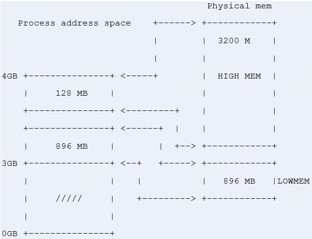

Figure 10.2 – High and low memory splitting

In the preceding diagram, we can see that 128 MB of the kernel address space is used to map a high memory of RAM on the fly when needed. On the other hand, 896 MB of kernel address space is permanently and linearly mapped to a low 896 MB of RAM.

The high-memory mechanism can also be used on a 1 GB RAM system to dynamically map user memory whenever the kernel needs access. The fact that the kernel can map the whole RAM into its address space does not mean the user space can't access it. More than one mapping to a RAM page frame can exist; it can be both permanently mapped to the kernel memory space and mapped to some address in the user space when the process is chosen for execution.

Note

Given a virtual address, you can distinguish whether it is a kernel space or a user space address by using the process layout shown previously. Every address below **PAGE_OFFSET** comes from the user space; otherwise, it is from the kernel.

### Low memory in detail

The first 896 MB of kernel address space constitutes the low memory region. Early in the boot process, the kernel permanently maps that 896 MB onto physical RAM. Addresses that result from that mapping are called **logical addresses**. These are virtual addresses but can be translated into physical addresses by subtracting a fixed offset, since the mapping is permanent and known in advance. Low memory matches with the lower bound of physical addresses. You can define low memory as being the memory for which logical addresses exist in the kernel space. The core of the kernel stays in low memory. Therefore, most of the kernel memory functions return low memory. In fact, to serve different purposes, kernel memory is divided into zones. Actually, the first 16 MB of **LOWMEM** is reserved for **Direct Memory Access** (**DMA**) usage. Hardware does not always allow you to treat all pages as identical because of limitations. We can then identify three different memory zones in the kernel space:

- **ZONE_DMA**: This contains page frames of memory below 16 MB, reserved for DMA.
- **ZONE_NORMAL**: This contains page frames of memory above 16 MB and below 896 MB, for normal use.
- **ZONE_HIGHMEM**: This contains page frames of memory at and above 896 MB.

However, on a 512 MB system, there will be no **ZONE_HIGHMEM**, 16 MB for **ZONE_DMA**, and 496 MB for **ZONE_NORMAL**.

From all the preceding, we can complete the definition of logical addresses, adding that these are addresses in kernel space mapped linearly on physical addresses, and that the corresponding physical address can be obtained by using an offset. Kernel virtual addresses are similar to logical addresses in that they are mappings from a kernel-space address to a physical address. However, the difference is that kernel virtual addresses do not always have the same linear, one-to-one mapping to physical locations as logical addresses do.

Note

You can convert a physical address into a logical address using the **\_\_pa(address)** macro and the revert with the **\_\_va(address)** macro.

### Understanding high memory

The top 128 MB of the kernel address space is called a **high-memory region**. It is used by the kernel to temporarily map physical memory above 1 GB (above 896 MB in reality). When physical memory above 1 GB (or, more precisely, 896MB) needs to be accessed, the kernel uses that 128 MB to create a temporary mapping to its virtual address space, thus achieving the goal of being able to access all physical pages. You can define high memory as being memory for which logical addresses do not exist and which is not mapped permanently into a kernel address space. The physical memory above 896 MB is mapped on demand to the 128 MB of the **HIGHMEM** region.

Mapping to access high memory is created on the fly by the kernel and destroyed when done. This makes high memory access slower. However, the concept of high memory does not exist on 64-bit systems, due to the huge address range (264 TB), where the 3 GB/1 GB (or any similar split scheme) split does not make sense anymore.

## An overview of a process address space from the kernel

On a Linux system, each process is represented in the kernel as an instance of **struct task_struct** (see **include/linux/sched.h**), which characterizes and describes this process. Before the process starts running, it is allocated a table of memory mapping, stored in a variable of the **struct mm_struct** type (see **include/linux/mm_types.h**). This can be verified by looking at the following excerpt of the **struct task_struct** definition, which embeds pointers to elements of the **struct mm_struct** type:

struct task_struct{

    \[…\]

    struct mm_struct \*mm, \*active_mm;

    \[…\]

}

In the kernel, there is a global variable that always points to the current process, **current**, and the **current-\>mm** field points to the current process memory-mapping table. Before going further in our explanation, let's have a look at the following excerpt of a **struct mm_struct** data structure:

struct mm_struct {

    struct vm_area_struct \*mmap;

    unsigned long mmap_base;

    unsigned long task_size;

    unsigned long highest_vm_end;

    pgd_t \* pgd;

    atomic_t mm_users;

    atomic_t mm_count;

    atomic_long_t nr_ptes;

\#if CONFIG_PGTABLE_LEVELS \> 2

    atomic_long_t nr_pmds;

\#endif

    int map_count;

    spinlock_t page_table_lock;

    unsigned long total_vm;

    unsigned long locked_vm;

    unsigned long pinned_vm;

    unsigned long data_vm;

    unsigned long exec_vm;

    unsigned long stack_vm;

    unsigned long start_code, end_code, start_data, end_data;

    unsigned long start_brk, brk, start_stack;

    unsigned long arg_start, arg_end, env_start, env_end;

    /\* ref to file /proc/\<pid\>/exe symlink points to \*/

    struct file \_\_rcu \*exe_file;

};

I intentionally removed some fields we are not interested in. There are some fields we will talk about later: **pgd** for example, which is a pointer to the process's base (first entry) level one table (**Page Global Directory**, abbreviated **PGD**), written in the translation table base address of the CPU at context switching. For a better understanding of this data structure, we can use the following diagram:

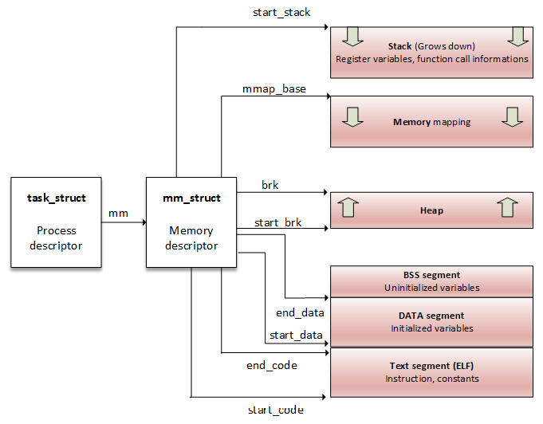

Figure 10.3 – A process address space

From a process point of view, a memory mapping can be seen as nothing but a set of page table entries dedicated to a consecutive virtual address range. That *"consecutive virtual address range"* is referred to as a memory area, or a **Virtual Memory Area** (**VMA**). Each memory mapping is described by a start address and length, permissions (such as whether the program can read, write, or execute from that memory), and associated resources (such as physical pages, swap pages, and file contents).

**mm_struct** has two ways to store process regions (VMAs):

- In a red-black tree (a self-balancing binary search tree), whose root element is pointed by the **mm_struct-\>mm_rb** field
- In a linked list, where the first element is pointed by the **mm_struct-\>mmap** field

Now that we have had an overview of a process address space and have seen that it is made of a set of virtual memory regions, let's dive into the details and study the mechanisms behind these memory regions.

## Understanding the concept of VMA

In the kernel, process memory mappings are organized into areas, each referred to as a VMA. For your information, in each running process on a Linux system, the code section, each mapped file region (a library, for example), or each distinct memory mapping (if any) is materialized by a VMA. A VMA is an architecture-independent structure, with permissions and access control flags, defined by a start address and a length. Their sizes are always a multiple of the page size (**PAGE_SIZE**). A VMA consists of a few pages, each of which has an entry in the page table (the **Page Table Entry** (**PTE**)).

A VMA is represented in the kernel as an instance of **struct vma_area**, defined as the following:

struct vm_area_struct {

    unsigned long vm_start;

    unsigned long vm_end;

    struct vm_area_struct \*vm_next, \*vm_prev;

    struct mm_struct \*vm_mm;

    pgprot_t vm_page_prot;

    unsigned long vm_flags;

    unsigned long vm_pgoff;

    struct file \* vm_file;

    \[...\]

}

For the sake of readability and understandability of this section, only elements that are relevant for us have been listed. However, the following are the meanings of the remaining elements:

- **vm_start** is the VMA start address within the address space (**vm_mm**). It is the first address within this VMA.
- **vm_end** is the first byte after our end address within **vm_mm**. It is the first address outside this VMA.
- **vm_next** and **vm_prev** are used to implement a linked list of VM areas per task, sorted by address.
- **vm_mm** is the process address space that this VMA belongs to.
- **vm_page_prot** and **vm_flags** represent the access permission of the VMA. The former is an architecture-level data type, whose update is applied directly to the PTEs of the underlying architecture. It is a form of cached conversion from **vm_flags**, which stores the proper protection bits and the type of mapping in an architecture-independent manner.
- **vm_file** is the file backing this mapping. This can be **NULL** (for example, for anonymous mapping, such as a process's heap or stack).
- **vm_pgoff** is the offset (within **vm_file**) in page size unit. This offset is measured in number of pages.

The following diagram is an overview of a process memory mapping, highlighting each VMA and describing some of its structure elements:

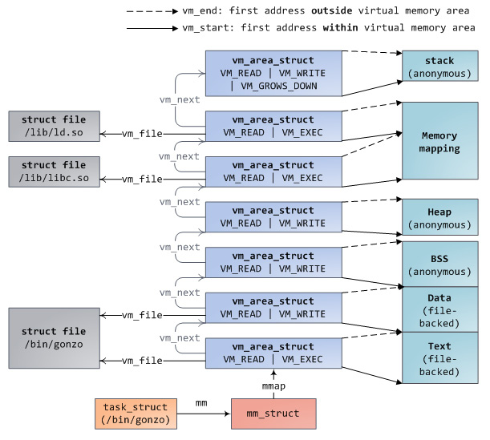

Figure 10.4 – Process memory mappings

The preceding image (from http://duartes.org/gustavo/blog/post/how-the-kernel-manages-your-memory/) describes a process's (started from **/bin/gonzo**) memory mappings (VMAs). We can see interactions between **struct task_struct** and its address space element (**mm**), which then lists and describes each VMA (the start, the end, and the backing file).

You can use the **find_vma()** function to find the VMA that corresponds to a given virtual address. **find_vma()** is declared in **linux/mm.h** as the following:

extern struct vm_area_struct \* find_vma(

           struct mm_struct \* mm, unsigned long addr);

This function searches and returns the first VMA that satisfies **vm_start \<= addr \< vm_end** or returns **NULL** if none is found. **mm** is the process address space to search in. For the current process, it can be **current-\>mm**. The following is an example:

struct vm_area_struct \*vma =

                     find_vma(task-\>mm, 0x603000);

if (vma == NULL) /\* Not found ? \*/

    return -EFAULT;

/\* Beyond the end of returned VMA ? \*/

if (0x13000 \>= vma-\>vm_end)

    return -EFAULT;

The preceding code excerpt will look for a VMA whose memory bounds contain **0x603000**.

Given a process whose identifier is **\<PID\>**, the whole memory mappings of this process can be obtained by reading the **/proc/\<PID\>/maps**, **/proc/\<PID\>/smaps**, and **/proc/\<PID\>/pagemap** files. The following lists the mappings of a running process, whose Process Identifier (PID) is **1073**:

\# cat /proc/1073/maps

00400000-00403000 r-xp 00000000 b3:04 6438             /usr/sbin/net-listener

00602000-00603000 rw-p 00002000 b3:04 6438             /usr/sbin/net-listener

00603000-00624000 rw-p 00000000 00:00 0                \[heap\]

7f0eebe4d000-7f0eebe54000 r-xp 00000000 b3:04 11717    /usr/lib/libffi.so.6.0.4

7f0eebe54000-7f0eec054000 ---p 00007000 b3:04 11717    /usr/lib/libffi.so.6.0.4

7f0eec054000-7f0eec055000 rw-p 00007000 b3:04 11717    /usr/lib/libffi.so.6.0.4

7f0eec055000-7f0eec069000 r-xp 00000000 b3:04 21629    /lib/libresolv-2.22.so

7f0eec069000-7f0eec268000 ---p 00014000 b3:04 21629    /lib/libresolv-2.22.so

\[...\]

7f0eee1e7000-7f0eee1e8000 rw-s 00000000 00:12 12532    /dev/shm/sem.thk-mcp-231016-sema

\[...\]

Each line in the preceding excerpt represents a VMA, and the fields correspond to the **{address (start-end)} {permissions} {offset} {device (major:minor)} {inode} {pathname (image)}** pattern:

- **address**: Represents the starting and ending address of the VMA.
- **permissions**: Describes access rights of the region: **r** (read), **w** (write), and **x** (execute). **p** is if the mapping is private and **s** is for shared mapping.
- **offset**: If file mapping (the **mmap** system call), it is the offset in the file where the mapping takes place. It is **0** otherwise.
- **major:minor**: If file mapping, these represent the major and minor numbers of the devices in which the file is stored (the device holding the file).
- **inode**: If mapping from a file, this is the **inode** number of the mapped file.
- **pathname**: This is the name of the mapped file or left blank otherwise. There are other region names, such as **\[heap\]**, **\[stack\]**, or **\[vdso\]** (which stands for **virtual dynamic shared object**, a shared library mapped by the kernel into every process's address space, in order to reduce performance penalties when system calls switch to kernel mode).

Each page allocated to a process belongs to an area, thus any page that does not live in the VMA does not exist and cannot be referenced by the process.

High memory is perfect for user space because its address space must be explicitly mapped. Thus, most high memory is consumed by user applications. **\_\_GFP_HIGHMEM** and **GFP_HIGHUSER** are the flags for requesting the allocation of (potentially) high memory. Without these flags, all kernel allocations return only low memory. There is no way to allocate contiguous physical memory from user space in Linux.

Now that VMAs have no more secrets for us, let's describe the hardware concepts involved in the translation to their corresponding physical addresses, if any, or their creation and allocation otherwise.

# Demystifying address translation and MMU

MMU does not only convert virtual addresses into physical ones but also protects memory from unauthorized access. Given a process, any page that needs to be accessed from this process must exist in one of its VMAs and, thus, must live in the process's page table (every process has its own).

As a recall, memory is organized by chunks of fixed-size named pages for virtual memory and frames for physical memory. The size in our case is 4 KB. However, it is defined and accessible with the **PAGE_SIZE** macro in the kernel. Remember, however, that page size is imposed by the hardware. Considering a 4 KB page-sized system, bytes 0 to 4095 fall on page 0, bytes 4096 to 8191 fall on page 1, and so on.

The concept of a page table is introduced to manage mapping between pages and frames. Pages are spread over tables so that each PTE corresponds to a mapping between a page and a frame. Each process is then given a set of page tables to describe all of its memory regions.

To walk through pages, each page is assigned an index, called a **page number**. When it comes to a frame, it is a **Page Frame Number** (**PFN**). This way, VMAs (logical addresses, more precisely) are composed of two parts: a page number and an offset. On 32-bit systems, the offset represents the 12 less significant bits of the address, whereas 13 less significant bits represent it on 8 KB page-size systems. The following diagram highlights this concept of addresses split into a page number and an offset:

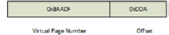

Figure 10.5 – Logical address representation

How does the OS or CPU know which physical address corresponds to a given logical address? They use a page table as a translation table and know that each entry's index is a virtual page number, and the value at this index is the PFN. To access physical memory given a virtual memory, the OS first extracts the offset, the virtual page number, and then walks through the process's page tables to match the virtual page number to the physical page. Once a match occurs, it is then possible to access data in that page frame:

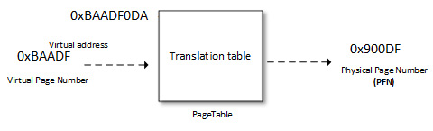

Figure 10.6 – Address translation

The offset is used to point to the right location in the frame. A page table not only holds mapping between physical and virtual page numbers but also accesses control information (read/write access, privileges, and so on).

The following diagram describes address decoding and page table lookup to point to the appropriate location in the appropriate frame:

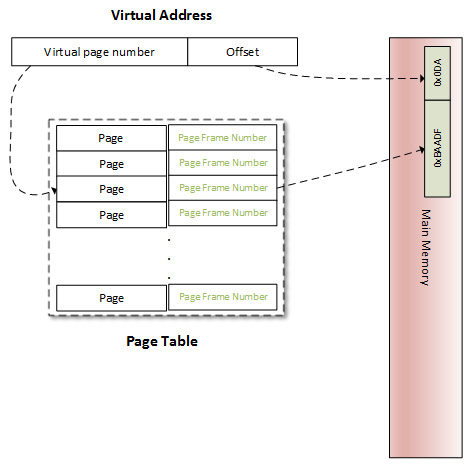

Figure 10.7 – Virtual to physical address translation

The number of bits used to represent the offset is defined by the **PAGE_SHIFT** kernel macro. **PAGE_SHIFT** is the number of times needed to left-shift 1 bit to obtain the **PAGE_SIZE** value. It is also the number of times needed to right-shift a page's logical address to obtain its page number, which is the same for a physical address to obtain its page frame number. This macro is architecture-dependent and also depends on the page granularity. Its value could be considered as the following:

\#ifdef CONFIG_ARM64_64K_PAGES

\#define PAGE_SHIFT        16

\#elif defined(CONFIG_ARM64_16K_PAGES)

\#define PAGE_SHIFT       14

\#else

\#define PAGE_SHIFT        12

\#endif

\#define PAGE_SIZE        (\_AC(1, UL) \<\< PAGE_SHIFT)

The preceding states that by default (whether on ARM or ARM64), **PAGE_SHIFT** is **12**, which means a 4 KB page size. On ARM64, it **14** or **16** when respectively a 16 KB or 64 KB page size is chosen.

With our understanding of address translation, the page table is a partial solution. Let's see why. Most 32-bit architectures require 32 bits (4 bytes) to represent a page table entry. On such systems (32-bit) where each process has its private 3 GB user address space, we need 786,432 entries to characterize and cover a process's address space. It represents too much physical memory spent per process just to store the memory mappings. In fact, a process generally uses a small but scattered portion of its virtual address space. To resolve that issue, the concept of a "level" was introduced. Page tables are hierarchized by level (page level). The space necessary to store a multi-level page table only depends on the virtual address space actually in use, instead of being proportional to the maximum size of the virtual address space. This way, unused memory is no longer represented, and the page table walk-through time is reduced. Moreover, each table entry in level **N** will point to an entry in the table of level **N+1**, level 1 being the higher level.

Linux can support up to four levels of paging. However, the number of levels to use is architecture-dependent. The following are descriptions of each lever:

- **Page Global Directory (PGD)**: This is the first level (level 1) page table. Each entry is of the **pgd_t** type in the kernel (generally, **unsigned long**) and points to an entry in the table at the second level. In the Linux kernel, **struct tastk_struct** represents a process's description, which in turn has a member (**mm**) whose type is **struct mm_struct**, which characterizes and represents the process's memory space. In **struct mm_struct**, there is a processor-specific field, **pgd**, which is a pointer to the first entry (entry 0) of the process's level-1 (PGD) page table. Each process has one and only one PGD, which may contain up to 1,024 entries.

- **Page Upper Directory (PUD)**: This represents the second level of indirection.

- **Page Middle Directory (PMD)**: This is the third indirection level.

- **Page Table Entry (PTE)**: This is the leaves of the tree. It is an array of **pte_t**, where each entry points to a physical page.

  Note

  All levels are not always used. The i.MX6's MMU only supports a two-level page table (PGD and PTE), which is the case for almost all 32-bit CPUs. In this case, PUD and PMD are simply ignored.

It is important to know that the MMU does not store any mapping. It is a data structure located in RAM. Instead, there is a special register in the CPU, called the **Page Table Base Register** (**PTBR**) or the **Translation Table Base Register 0** (**TTBR0**), which points to the base (entry 0) of the level-1 (top-level) page table (PGD) of the process. It is exactly where the **pdg** field of **struct mm_struct** points: **current-\>mm.pgd == TTBR0**.

At context switch (when a new process is scheduled and given the CPU), the kernel immediately configures the MMU and updates the PTBR with the new process's **pgd**. Now, when a virtual address is given to MMU, it uses the PTBR's content to locate the process's level-1 page table (PGD), and then it uses the level-1 index, extracted from the **Most-Significant Bits** (**MSBs**) of the virtual address to find the appropriate table entry, which contains a pointer to the base address of the appropriate level-2 page table. Then, from that base address, it uses the level-2 index to find the appropriate entry and so on, until it reaches the PTE. ARM architecture (i.MX6, in our case) has a two-level page table. In this case, the level-2 entry is a PTE and points to the physical page (PFN). Only the physical page is found at this step. To access the exact memory location in the page, the MMU extracts the memory offset, also part of the virtual address, and points to the same offset in the physical page.

For the sake of understandability, the preceding description has been limited to a two-level paging scheme but can easily extended. The following diagram is a representation of this two-level paging scheme:

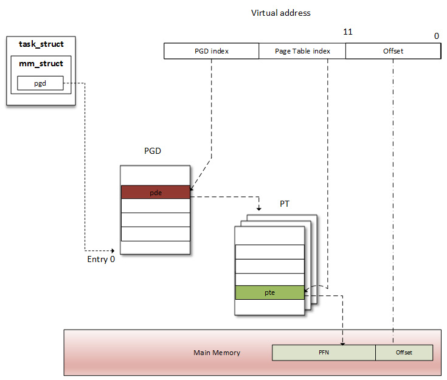

Figure 10.8 – A two-level address translation scheme

When a process needs to read from or write into a memory location (of course, we are talking about virtual memory), the MMU performs a translation into that process's page table to find the right entry (PTE). The virtual page number is extracted (from the virtual address) and used by the processor as an index into the process's page table to retrieve its page table entry. If there is a valid page table entry at that offset, the processor takes the page frame number from this entry. If not, it means the process accessed an unmapped area of its virtual memory. A page fault is then raised, and the OS should handle it.

In the real world, address translation requires a page-table walk, and it is not always a one-shot operation. There are at least as many memory accesses as there are table levels. A four-level page table would require four memory accesses. In other words, every virtual access would result in five physical memory accesses. The virtual memory concept would be useless if its access were four times slower than physical access. Fortunately, System-on-Chip (SoC) manufacturers worked hard to find a clever trick to address this performance issue: modern CPUs use a small associative and very fast memory called the **Translation Lookaside Buffer** (**TLB**), in order to cache the PTEs of recently accessed virtual pages.

## Page lookup and the TLB

Before the MMU proceeds to address translation, there is another step involved. As there is a cache for recently accessed data, there is also a cache for recently translated addresses. As data cache speeds up the data accessing process, the TLB speeds up virtual address translation (yes, address translation is a time-consuming task). It is a **Content-Addressable Memory** (**CAM**), where the key is the virtual address and the value is the physical address. In other words, the TLB is a cache for the MMU. At each memory access, the MMU first checks for recently used pages in the TLB, which contains a few of the virtual address ranges to which physical pages are currently assigned.

### How does the TLB work?

On memory access, the CPU walks through the TLB trying to find the virtual page number of the page that is being accessed. This step is called a **TLB lookup**. When a TLB entry is found (a match occurs), it is called TLB hit, and the CPU just keeps running and uses the PFN found in the TLB entry to calculate the target physical address. There is no page fault when a TLB hit occurs. If a translation can be found in the TLB, virtual memory access will be as fast as physical access. If there is no TLB hit, it is called TLB miss.

On a TLB miss, there are two possibilities. Depending on the processor type, the TLB miss event can be handled by the software, the hardware, or through the MMU:

- **Software handling**: The CPU raises a TLB miss interrupt, caught by the OS. The OS then walks through the process's page table to find the right PTE. If there is a matching and valid entry, then the CPU installs the new translation in the TLB. Otherwise, the page fault handler is executed.
- **Hardware handling**: It is up to the CPU (the MMU, in fact) to walk through the process's page table on hardware. If there is a match, the CPU adds the new translation in the TLB. Otherwise, the CPU raises a page fault interrupt, handled by the OS.

In both cases, the page fault handler is the same, **do_page_fault()**. This function is architecture-dependent; for ARM, it is defined in **arch/arm/mm/fault.c**.

The following is a diagram describing a TLB lookup, a TLB hit, or a TLB miss event:

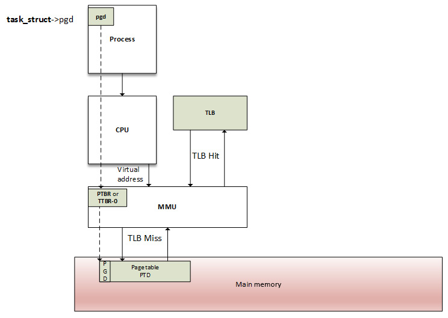

Figure 10.9 – The MMU and TLB walk-through process

Page table and page directory entries are architecture-dependent. An OS must make sure the structure of a table corresponds to a structure recognized by the MMU. On ARM processors, the location of the translation table must be written in the **control** coprocessor 15 (CP15) **c2** register, and then enable the caches and the MMU by writing to the CP15 **c1** register. Have a look at both <http://infocenter.arm.com/help/index.jsp?topic=/com.arm.doc.dui0056d/BABHJIBH.htm> and <http://infocenter.arm.com/help/index.jsp?topic=/com.arm.doc.ddi0433c/CIHFDBEJ.html> for detailed information.

Now that we are comfortable with the address translation schemes and their ease with the TLB, we can talk about memory allocation, which involves manipulating page entries under the hood.

Dealing with memory allocation mechanisms and their APIs

Before jumping to the list of APIs, let's start with the following figure, showing the different memory allocators that exist on a Linux-based system, which we will discuss later:

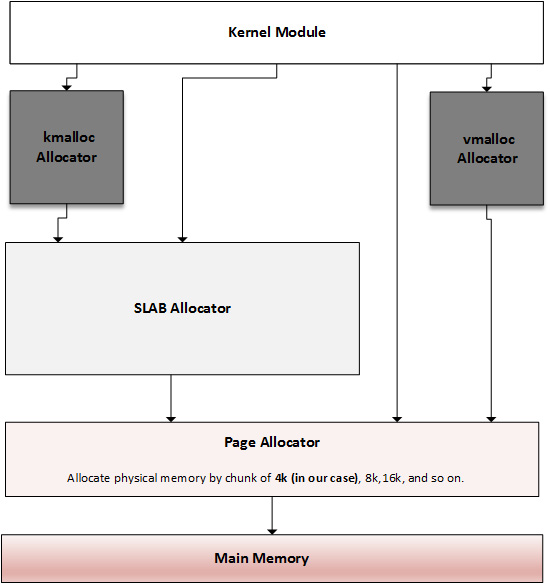

Figure 10.10 – Overview of kernel memory allocators

The preceding diagram is inspired by <https://bootlin.com/doc/training/linux-kernel/linux-kernel-slides.pdf>. What it shows is that there is an allocation mechanism to satisfy any kind of memory request. Depending on what you need memory for, you can choose the one closest to your goal. The main and lowest level allocator is the **page allocator**, which allocates memory in units of pages (a page being the smallest memory unit it can deliver). Then comes the **slab allocator**, which is built on top of the page allocator, getting pages from it and splitting them into smaller memory entities (by means of slabs and caches). This is the allocator on which the **kmalloc** API relies. While **kmalloc** can be used to request memory from the slab allocator, we can directly talk to the slab to request memory from its caches, or even build our own caches.

Let's start this memory allocation journey with the main and lowest level allocator, the page allocator, from which the others derivate.

## The page allocator

The page allocator is the low-level allocator on the Linux system, the one that serves as a basis for other allocators. This allocator brings with it the concept of the page (virtual) and page frame (physical). So, the system's physical memory is split into fixed-size blocks (called **page frames**), while virtual memory is organized into fixed-size blocks called pages. Page size is always the same as a page frame size. As this is the lowest-level allocator, a page is the smallest unit of memory that the OS will give to any memory request at a low level. In the Linux kernel, a page is represented as an instance of the **struct page** structure, which we will manipulate using dedicated APIs, introduced in the next section.

### Page allocation APIs

This is the lowest-level allocator. It allocates and deallocates blocks of pages using the buddy algorithm. Pages are allocated in blocks that are to the power of 2 in size (to get the best from the buddy algorithm). That means it can allocate a block of 1 page, 2 pages, 4 pages, 8, 16, and so on. Pages returned from this allocation are physically contiguous. **alloc_pages()** is the main API and is defined as the following:

struct page \*alloc_pages(gfp_t mask, unsigned int order)

The preceding function returns **NULL** when no page can be allocated. Otherwise, it allocates *2*order pages and returns a pointer to an instance of **struct page**, which points the first page of the reserved block. There is, however, a helper macro, **alloc_page()**, which can be used to allocate a single page. The following is its definition:

\#define alloc_page(gfp_mask) alloc_pages(gfp_mask, 0)

This macro wraps **alloc_pages()** with an order parameter set with **0**.

**\_\_free_pages()** must be used to release memory pages allocated with the **alloc_pages()** function. It takes a pointer to the first page of the allocated block as a parameter, along with the order, the same that was used for allocation. It is defined as the following:

void \_\_free_pages(struct page \*page, unsigned int order);

There are other functions working in the same way, but instead of an instance of **struct page**, they return the (logical) address of the reserved block. These are **\_\_get_free_pages()** and **\_\_get_free_page()**, and the following are their definitions:

unsigned long \_\_get_free_pages(gfp_t mask,

                               unsigned int order);

unsigned long get_zeroed_page(gfp_t mask);

**free_pages()** is used to free a page allocated with **\_\_get_free_pages()**. It takes the kernel address representing the start region of allocated page(s), along with the order, which should be the same as that used for allocation:

free_pages(unsigned long addr, unsigned int order);

Whatever the allocation type is, **mask** specifies the memory zones from where the pages should be allocated and the behavior of the allocators. The following are possible values:

- **GFP_USER**: For user memory allocation.
- **GFP_KERNEL**: The commonly used flag for kernel allocation.
- **GFP_HIGHMEM**: This requests memory from the **HIGH_MEM** zone.
- **GFP_ATOMIC**: This allocates memory in an atomic manner that cannot sleep. It is used when we need to allocate memory from an interrupt context.

However, you should note that whether specifying the **GFP_HIGHMEM** flag with **\_\_get_free_pages()** (or **\_\_get_free_page()**) or not, it won't be considered. This flag is masked out in these functions to make sure that the returned address never represents high-memory pages (because of their non-linear/permanent mapping). If you need high memory, use **alloc_pages()** and then **kmap()** to access it.

**\_\_free_pages()** and **free_pages()** can be mixed. The main difference between them is that **free_page()** takes a logical address as a parameter, whereas **\_\_free_page()** takes a **struct page** structure.

Note

The maximum order that can be used varies between architectures. It depends on the **FORCE_MAX_ZONEORDER** kernel configuration option, which is **11** by default. In this case, the number of pages you can allocate is 1,024. It means that on a 4 KB-sized system, you can allocate up to *1,024 x 4 KB = 4 MB* at maximum. On ARM64, the maximum order varies with the selected page size. If it is a 16 KB page size, the maximum order is **12**, and if it is a 64 KB page size, the maximum order is **14**. These size limitations per allocation are valid for **kmalloc()** as well.

#### Page and addresses conversion functions

There are convenient functions exposed by the kernel to switch back and forth between the **struct page** instances and their corresponding logical addresses, which can be useful at different moments while dealing with memory. The **page_to_virt()** function is used to convert a struct page (as returned by **alloc_pages()**, for example) into a kernel logical address. Alternatively, **virt_to_page()** takes a kernel logical address and returns its associated **struct page** instance (as if it was allocated using the **alloc_pages()** function). Both **virt_to_page()** and **page_to_virt()** are declared in **\<asm/page.h\>** as the following:

struct page \*virt_to_page(void \*kaddr);

void \*page_to_virt(struct page \*pg)

There is another macro, **page_address()**, which simply wraps **page_to_virt()** and which is declared as the following:

void \*page_address(const struct page \*page)

It returns the logical address of the page passed in the parameter.

## The slab allocator

The slab allocator is the one on which **kmalloc()** relies. Its main purposes are to eliminate fragmentation caused by memory (de)allocation, which is caused by the buddy system in case of small-size memory allocation, and to speed up memory allocation for commonly used objects.

### Understanding the buddy algorithm

To allocate memory, the requested size is rounded up to the power of two, and the buddy allocator searches the appropriate list. If no entries exist on the requested list, an entry from the next upper list (which has blocks of twice the size of the previous list) is split into two halves (called **buddies**). The allocator uses the first half, while the other is added to the next list down. This is a recursive approach, which stops when either the buddy allocator successfully finds a block that can be split or reaches the largest block size and there are no free blocks available.

The following case study is heavily inspired by <http://dysphoria.net/OperatingSystems1/4_allocation_buddy_system.html>. For example, if the minimum allocation size is 1K bytes, and the memory size is 1 MB, the buddy allocator will create an empty list for 1K byte holes, an empty list for 2K byte holes, one for 4K byte holes, 8K, 16K, 32K, 64K, 128K, 256K, 512K, and one list for 1 MB holes. All of them are initially empty, except for the 1 MB list, which has only one hole.

Let's now imagine a scenario where we want to allocate a 70K block. The buddy allocator will round it up to 128K and will end up splitting the 1 MB into two 512K blocks, then 256K, and finally 128K, and then it will allocate one of the 128K blocks to the user. The following are schemes that summarize this scenario:

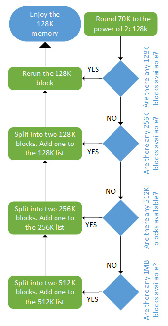

Figure 10.11 – Allocation using the buddy algorithm

The deallocation is as fast as allocation. The following is a figure that summarizes the deallocation algorithm:

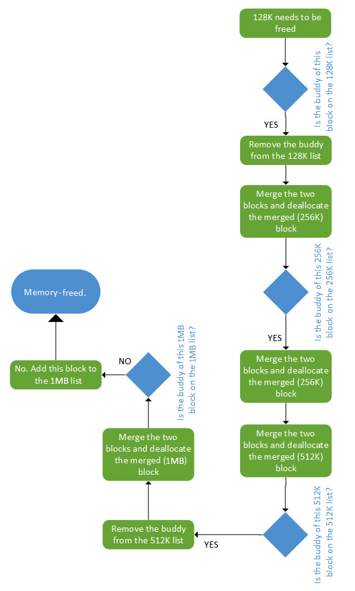

Figure 10.12 – Deallocation using the buddy algorithm

In the preceding diagram, we can see that memory deallocation using the buddy algorithm works. In the next section, we will study the slab allocator, built on top of this algorithm.

### A journey into the slab allocator

Before we introduce the slab allocator, let's define some terms that it uses:

- **Slab**: A contiguous piece of physical memory made of several page frames. Each slab is divided into equal chunks of the same size, used to store specific types of kernel objects, such as **inode** and **mutexe** objects. A slab can be considered an array of identically sized blocks.
- **Cache**: This is made of one or more slabs in a linked list. The cache only stores objects of the same type (for example, **inode** objects only).

Slabs may be in one of the following states:

- **Empty**: Where all objects (chunks) on the slab are marked as free.
- **Partial**: Both used and free objects exist in the slab.
- **Full**: All objects on the slab are marked as used.

The memory allocator is responsible for building caches. Initially, each slab is empty and marked so. When one allocates memory for a kernel object, the allocator looks for a free location for that object on a partial/free slab in a cache for that type of object. If not found, the allocator allocates a new slab and adds it to the cache. The new object gets allocated from this slab, and the slab is marked as partial. When the code is done with the memory (memory-freed), the object is simply returned to the slab cache in its initialized state. This is the reason why the kernel also provides helper functions to obtain zeroed initialized memory, which allows us to get rid of previous content. The slab keeps a reference count of how many of its objects are being used so that when all slabs in a cache are full and another object is requested, the slab allocator is responsible for adding new slabs.

The following diagram illustrates the concept of slabs, caches, and their different states:

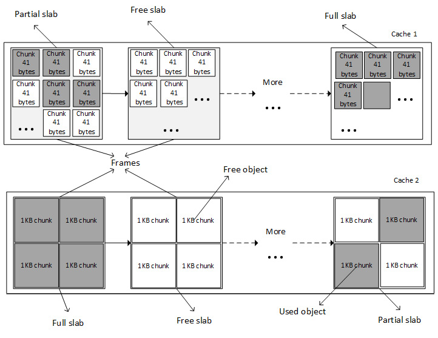

Figure 10.13 – Slabs and caches

It is a bit like creating a per-object allocator. The kernel allocates one cache per type of object, and only objects of the same type can be stored in a cache (for example, only **task_struct** structures).

There are different kinds of slab allocators in the kernel, depending on whether one needs compactness, cache-friendliness, or raw speed. These consist of the following:

- The **SLAB** (slab allocator), which is as cache-friendly as possible. This is the original memory allocator.

- The **SLOB** (simple list of blocks), which is as compact as possible, appropriate for systems with very low memory, mostly embedded systems with a few megabytes or tens of megabytes.

- The **SLUB** (unqueued allocator), which is quite simple and requires fewer instruction cost counts. This is the next-generation replacement memory allocator, enhancing and replacing the SLAB. It is based on the SLAB model but fixes several deficiencies in SLAB, especially on systems with a large number of processors. This has been (and still is) the default memory allocator in the Linux kernel since kernel 2.6.23 (**CONFIG_SLUB=y**). See this patch: <https://git.kernel.org/pub/scm/linux/kernel/git/torvalds/linux.git/commit/?id=a0acd820807680d2ccc4ef3448387fcdbf152c73>.

  Note

  The term **slab** has become a generic name referring to a memory allocation strategy employing an object cache, enabling efficient allocation and deallocation of kernel objects. It must not be confused with the allocator of the same name, SLAB, which nowadays has been replaced by SLUB.

## kmalloc family allocation

**kmalloc()** is a kernel memory allocation function. It allocates physically contiguous (but not necessarily page-aligned) memory. The following image describes how memory is allocated and returned to the caller:

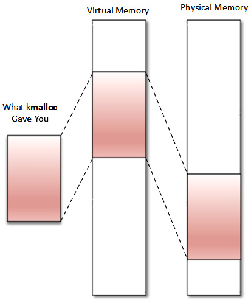

Figure 10.14 – kmalloc memory organization

This allocation API is the general and highest-level memory allocation API in the kernel, which relies on the SLAB allocator. Memory returned from **kmalloc()** has a kernel logical address because it is allocated from the **LOW_MEM** region unless **HIGH_MEM** is specified. It is declared in **\<linux/slab.h\>**, which is the header to include before using the API. It is defined as follows:

void \*kmalloc(size_t size, int flags);

In the preceding code, **size** specifies the size of the memory to be allocated (in bytes). **flags** determines how and where memory should be allocated. Available flags are the same as the page allocator (**GFP_KERNEL**, **GFP_ATOMIC**, **GFP_DMA**, and so on) and the following are their definitions:

- **GFP_KERNEL**: This is the standard flag. We cannot use this flag in an interrupt handler because its code may sleep. It always returns memory from the **LOM_MEM** zone (hence, a logical address).
- **GFP_ATOMIC**: This guarantees the atomicity of the allocation. This flag is to be used when allocation is needed from an interrupt context. Because memory is allocated from an emergency pool or memory, you should not abuse its usage.
- **GFP_USER**: This allocates memory to a user space process. Memory is then distinct and separated from those allocated to the kernel.
- **GFP_NOWAIT**: This is to be used if the allocation is performed from within an atomic context, for example, interrupt handler use. This flag prevents direct reclaim and I/O and filesystem operations while doing allocation. Unlike **GFP_ATOMIC**, it does not use memory reserves. Consequently, under memory pressure, the **GFP_NOWAIT** allocation is likely to fail.
- **GFP_NOIO**: Like **GFP_USER**, this can block, but unlike **GFP_USER**, it will not start disk I/O. In other words, it prevents any I/O operation while doing allocation. This flag is mostly used in the block/disk layer.
- **GFP_NOFS**: This will use direct reclaim but will not use any filesystem interfaces.
- **\_\_GFP_NOFAIL**: The virtual memory implementation must retry indefinitely because the caller is incapable of handling allocation failures. The allocation can stall indefinitely, but it will never fail. Consequently, it's useless to test for failure.
- **GFP_HIGHUSER**: This requests to allocate memory from the **HIGH_MEMORY** zone.
- **GFP_DMA**: This allocates memory from **DMA_ZONE**.

On successful allocation of memory, **kmalloc()** returns the virtual (logical, unless high memory is specified) address of the chunk allocated, guaranteed to be physically contiguous. On an error, it returns **NULL**.

For a device driver, however, it is recommended to use the managed version, **devm_kmalloc()**, which does not necessarily require freeing the memory, as it is handled internally by the memory core. The following is its prototype:

void \*devm_kmalloc(struct device \*dev, size_t size,

                   gfp_t gfp);

In the preceding prototype, **dev** is the device for which memory is allocated.

Note that **kmalloc()** relies on SLAB caches when allocating a small size of memory. For this reason, it can internally round the allocated area size up to the size of the smallest SLAB cache in which that memory can fit. This can result in returning more memory than requested. However, **ksize()** can be used to determine the actual amount (the size in bytes) of memory allocated. You can even use this additional memory, even though a smaller amount of memory was initially specified with the **kmalloc()** call.

The following is the **ksize** prototype:

size_t ksize(const void \*objp);

In the preceding, **objp** is the object whose real size in bytes will be returned.

**kmalloc()** has the same size limitations as the page-related allocation API. For example, with the default **FORCE_MAX_ZONEORDER** set to **11**, the maximum size per allocation with **kmalloc()** is **4 MB**.

**kfree** function is used to free the memory allocated by **kmalloc()**. It is defined as the following:

void kfree(const void \*ptr)

The following is an example of allocating and freeing memory using **kmalloc()** and **kfree()** respectively:

\#include \<linux/init.h\>

\#include \<linux/module.h\>

\#include \<linux/slab.h\>

\#include \<linux/mm.h\>

static void \*ptr;

static int alloc_init(void)

{

    size_t size = 1024; /\* allocate 1024 bytes \*/

    ptr = kmalloc(size,GFP_KERNEL);

    if(!ptr) {

        /\* handle error \*/

        pr_err("memory allocation failed\n");

        return -ENOMEM;

    } else {

        pr_info("Memory allocated successfully\n");

    }

    return 0;

}

static void alloc_exit(void)

{

    kfree(ptr);

    pr_info("Memory freed\n");

}

module_init(alloc_init);

module_exit(alloc_exit);

MODULE_LICENSE("GPL");

MODULE_AUTHOR("John Madieu");

The kernel provides other helpers based on **kmalloc()**as follows:

void kzalloc(size_t size, gfp_t flags);

void kzfree(const void \*p);

void \*kcalloc(size_t n, size_t size, gfp_t flags);

void \*krealloc(const void \*p, size_t new_size,

                gfp_t flags);

**krealloc()** is the kernel equivalent of user space **realloc()** function. Because memory returned by **kmalloc()** retains the contents from its previous incarnation, you can request a zeroed **kmalloc**-allocated memory using **kzalloc()**. **kzfree()** is the freeing function for **kzalloc()**, whereas **kcalloc()** allocates memory for an array, and its **n** and **size** parameters respectively represent the number of elements in the array and the size of an element.

Since **kmalloc()** returns a memory area in the kernel permanent mapping, the logical address can be translated into a physical address using **virt_to_phys()**, or to a I/O bus address using **virt_to_bus()**. These macros internally call either **\_\_pa()** or **\_\_va()** if necessary. The physical address (**virt_to_phys(kmalloc'ed address)**), downshifted by **PAGE_SHIFT**, will produce a PFN (**pfn**) of the first page from which the chunk is allocated.

## vmalloc family allocation

**vmalloc()** is the last kernel allocator we will discuss in the book. It returns memory that is exclusively contiguous in the virtual address space. The underlying frames are scattered, as we can see in the following diagram:

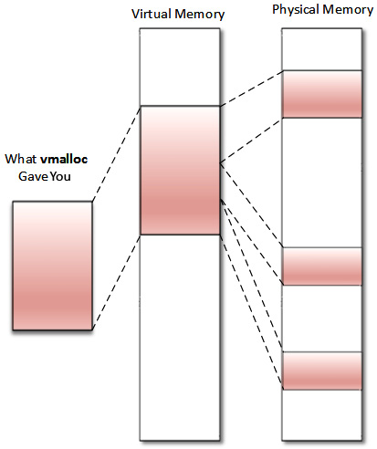

Figure 10.15 – vmalloc memory organization

In the preceding diagram, we can see that memory is not physically contiguous. Moreover, memory returned by **vmalloc()** always comes from the **HIGH_MEM** zone. Addresses returned are purely virtual (not logical) and cannot be translated into physical ones or bus addresses because there is no guarantee that the backing memory is physically contiguous. It means that memory returned by **vmalloc()** can't be used outside of the microprocessor (you cannot easily use it for a DMA purpose). It is correct to use **vmalloc()** to allocate memory for a large sequence of pages (it does not make sense to use it to allocate one page, for example) that exists only in software, such as a network buffer. It is important to note that **vmalloc()** is slower than **kmalloc()** and page allocator functions because it must both retrieve the memory and build the page tables, or even remap into a virtually contiguous range, whereas **kmalloc()** never does that.

Before using the **vmalloc()** API, you should include this header:

\#include \<linux/vmalloc.h\>

The following are the **vmalloc** family prototypes:

void \*vmalloc(unsigned long size);

void \*vzalloc(unsigned long size);

void vfree(void \*addr);

In the preceding prototypes, argument size is the size of memory you need to allocate. Upon successful allocation of memory, it returns the address of the first byte of the allocated memory block. On failure, it returns **NULL**. **vfree()** does the reverse and releases the memory allocated by **vmalloc()**. The **vzalloc** variant returns zeroed initialized memory.

The following is an example of using **vmalloc**:

\#include\<linux/init.h\>

\#include\<linux/module.h\>

\#include \<linux/vmalloc.h\>

Static void \*ptr;

static int alloc_init(void)

{

    unsigned long size = 8192; /\* 2 x 4KB \*/

    ptr = vmalloc(size);

    if(!ptr)

    {

        /\* handle error \*/

        pr_err("memory allocation failed\n");

        return -ENOMEM;

    } else {

        pr_info("Memory allocated successfully\n");

    }

    return 0;

}

static void my_vmalloc_exit(void)

{

    vfree(ptr);

    pr_info("Memory freed\n");

}

module_init(my_vmalloc_init);

module_exit(my_vmalloc_exit);

MODULE_LICENSE("GPL");

MODULE_AUTHOR("john Madieu, john.madieu@gmail.com");

**vmalloc()** will allocate non-contiguous physical pages and map them to a contiguous virtual address region. These **vmalloc** virtual addresses are limited in an area of kernel space, delimited by **VMALLOC_START** and **VMALLOC_END**, which are architecture-dependent. The kernel exposes **/proc/vmallocinfo** to display all **vmalloc**-allocated memory on the system.

## A short story about process memory allocation under the hood

**vmalloc()** prefers the **HIGH_MEM** zone if it exists, which is suitable for processes, as they require implicit and dynamic mappings. However, because memory is a limited resource, the kernel will report the allocation of frame pages (physical pages) until necessary (when accessed, either by reading or writing). This on-demand allocation is called **lazy allocation**, eliminating the risk of allocating pages that will never be used.

Whenever a page is requested, only the page table is updated; in most cases, a new entry is created, which means only virtual memory is allocated. An interrupt called **page fault** is raised only when a user accesses the page. This interrupt has a dedicated handler, called **page fault handler**, and is called by the MMU in response to an attempt to access virtual memory, which did not immediately succeed.

In fact, a page fault interrupt is raised whatever the access type is (read, write, or execute) to a page whose entry in the page table has not got the appropriate permission bits set to allow that type of access. The response to that interrupt falls in one of the following three ways:

- **The hard fault**: When the page does not reside anywhere (neither in the physical memory nor a memory-mapped file), which means the handler cannot immediately resolve the fault. The handler will perform I/O operations in order to prepare the physical page needed to resolve the fault and may suspend the interrupted process and switch to another while the system works to resolve the issue.
- **The soft fault**: When the page resides elsewhere in memory (in the working set of another process). It means the fault handler may resolve the fault by immediately attaching a page of physical memory to the appropriate page table entry, adjusting the entry, and resuming the interrupted instruction.
- **The fault cannot be resolved**: This will result in a bus error or **segmentation violation** (**segv**). A **Segmentation Violation Signal** (**SIGSEGV**) is sent to the faulty process, killing it (the default behavior), unless a signal handler has been installed for the SIGSEV to change the default behavior.

To summarize, memory mappings generally start out with no physical pages attached, only by defining the virtual address ranges without any associated physical memory. The actual physical memory is allocated later in response to a page fault exception when the memory is accessed, since the kernel provides some flags to determine whether the attempted access was legal and specifies the behavior of the page fault handler. Thus, the **brk()** user space, **mmap()**, and similar allocate (virtual) space, but physical memory is attached later.

Note

A page fault occurring in interrupt context causes a double fault interrupt, which usually panics the kernel (calling the **panic()** function). It is the reason why memory allocated in interrupt context is taken from a memory pool, which does not raise a page fault interrupt. If an interrupt occurs when a double fault is being handled, a triple fault exception is generated, causing the CPU to shut down and the OS to immediately reboot. This behavior is architecture-dependent.

### The Copy on Write case

Let's consider a memory region or data that needs to be shared by two or more tasks. The **Copy on Write** (**CoW**) (heavily used with **fork()** system call) is a mechanism that allows the operating system not to immediately allocate memory and does not make a copy of it to each task that shares this data, until one of these tasks modifies (writes into) it – in this case, memory is allocated for its private copy (hence the name, CoW). Let's consider a shared memory page to describe in in the following how the **page fault handler** manages CoW:

1.  When the page needs to be shared, a page table entry (whose target is marked as un-writable) pointing to this shared page is added to the process page table of each process accessing the shared page. This is an initial mapping.
2.  The mapping will result the creation of a VMA per process, which is added to the VMA list of each process. The shared page is associated these VMAs (that is, the VMA previously created for each process), which are marked as writeable this time. Nothing else will happen as long as no process tries to modify the content of the shared page.
3.  When one of the processes tries to write into the shared page (at its first write), the **fault handler** notices the difference between the PTE flag (previously marked as un-writable) and the VMA flag (marked as writable), which means, *"Hey, this is a CoW."*. It will then allocate a physical page, which is assigned to the PTE added previously (thus replacing the shared page previously assigned), updating the PTE flags (one of these flags will correspond to marking the PTE as writeable), flushing the TLB entry, and then will execute the **do_wp_page()** function, which will copy the content from the shared address to the new location, which is private to the process that issued the write. Subsequent writes from this process will be made to the private copy, not in the shared page.

We can now close our parenthesis on process memory allocation, with which we are now familiar. We have also learned the lazy allocation mechanism and what CoW is. We can also conclude our learning about in-kernel memory allocation. At this point, we can switch to I/O memory operations to talk with hardware devices.

# Working with I/O memory to talk to hardware

So far, we have dealt with main memory, and we used to think of memory in terms of RAM. That said, RAM one a peripheral among many others, and its memory range corresponds to its size. RAM is unique in the way it is entirely managed by the kernel, transparently for users. The RAM controller is connected to the CPU data/control/address buses, which it shares with other devices. These devices are referred to as memory-mapped devices because of their locality regarding those buses, and communication (input/output operations) with those devices is called memory-mapped I/O. These devices include controllers for various buses provided by the CPU (USB, UART, SPI, I2C, PCI, and SATA), but also IPs such as VPU, GPU, Image Processing Unit (IPU), and Secure Non-Volatile Store (SNVS, a feature in i.MX chips from NXP).

On a 32-bit system, the CPU has up to 232 choices of memory locations (from **0** to **0xFFFFFFFF**). The thing is that not all those addresses address RAM. Some of these are reserved for peripheral access and are called I/O memory. This I/O memory is split into ranges of various sizes and assigned to those peripherals so that whenever the CPU receives a physical memory access request from the kernel, it can route it to the device whose address range contains the specified physical address. The address range assigned to each device (including the RAM controller) is described in the SoC data sheet, in a section called **memory map** most of the time.

Since the kernel exclusively works with virtual addresses (through page tables), accessing a particular address for any device would require this address to be mapped first (this is even more true if there is an IOMMU, the MMU equivalent for I/O devices). This mapping of memory addresses other than RAM modules causes a classic hole in the system address space (because address space is shared between memory and I/O).

The following diagram describes how I/O memory and main memory are seen by the CPU:

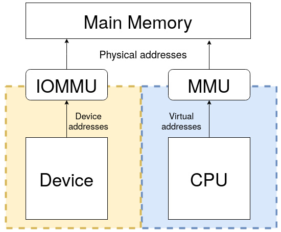

Figure 10.16 – (IO)MMU and main memory overview

Note

Always keep in mind that the CPU sees main memory (RAM) through the lenses of the MMU and devices through the lenses of IOMMU.

The main advantage with that is that the same instructions are used for transferring data to memory and I/O, which reduces software coding logic. There are some disadvantages, however. The first one is that the entire address bus must be fully decoded for every device, which increases the cost of adding hardware to the machine, leading to complex architecture.

The other inconvenience is that on a 32-bit system, even with 4 GB of RAM installed, the OS will never use the whole size because of the hole caused by memory-mapped devices, which stole part of the address space. x86 architectures adopted another approach called **Port Input Output** (**PIO**), with which registers are accessible via a dedicated bus by means of specific instructions (**in** and **out**, in an assembler, generally). In this case, device registers are not memory-mapped, and the system can address the whole address range for the RAM.

## PIO device access

On a system where PIO is used, I/O devices are mapped into a separate address space. This is usually accomplished by having a different set of signal lines to indicate memory access versus device access. Such systems have two different address spaces, one for system memory, which we already discussed, and the other one for I/O ports, sometimes referred to as port address space and limited to 65,536 ports. This is an old method and very uncommon nowadays.

The kernel exports a few functions (symbols) to handle I/O ports. Prior to accessing any port regions, we must first inform the kernel that we are using a range of ports using the **request_region()** function, which will return **NULL** on error. Once done with the region, we must call **release_region()**. These are both declared in **linux/ioport.h** as the following:

struct ressource \*request_region(unsigned long start,

                         unsigned long len, char \*name);

void release_region(unsigned long start,

                         unsigned long len);

These are politeness functions that inform the kernel about your intention to make use/release of a region of **len** ports, starting from **start**. The **name** parameter should be set with the name of the device or a meaningful one. Their use is not mandatory, however. It prevents two or more drivers from referencing the same range of ports. You can consult the ports currently in use on the system by reading the content of the **/proc/ioports** files.

After the region reservation has succeeded, the following APIs can be used to access the ports:

u8 inb(unsigned long addr)

u16 inw(unsigned long addr)

u32 inl(unsigned long addr)

The preceding functions respectively read 8, 16, or 32-bit-sized (wide) data from the **addr** ports. The write variants are defined as the following:

void outb(u8 b, unsigned long addr)

void outw(u16 b, unsigned long addr)

void outl(u32 b, unsigned long addr)

The preceding functions write **b** data, which can be 8, 16, or 32-bit-sized, into the **addr** port.

The fact that PIO uses a different set of instructions to access the I/O ports or MMIO is a disadvantage, as it requires more instructions than normal memory to accomplish the same task. For instance, 1-bit testing has only one instruction in MMIO, whereas PIO requires reading the data into a register before testing the bit, which is more than one instruction. One of the advantages of PIO is that it requires less logic to decode addresses, lowering the cost of adding hardware devices.

## MMIO device access

Main memory addresses reside in the same address space as MMIO addresses. The kernel maps the device registers to a portion of the address space that would ordinarily be utilized by RAM so that instead of system memory (that is, RAM), I/O device registration takes place. As a result, talking with an I/O device is analogous to reading and writing to memory addresses dedicated to that device.

If we need to access, let's say, the 4 MB of I/O memory assigned to IPU-2 (from **0x02400000** to **0x027fffff**), the CPU (by means of the IOMMU) can assign to us the **0x10000000** to **0x103FFFFF** addresses, which are virtual of course. This is not consuming physical RAM (except for building and storing page table entry), just address space (do you see now why 32-bit systems run into issues with expansion cards such as high-end GPUs that have GB of RAM?), meaning that the kernel will no longer use this virtual memory range to map RAM. Now, a memory write/read to, say, **0x10000004** will be routed to the IPU-2 device. This is the basic premise of memory-mapped I/O.

Like PIO, there are MMIO functions to inform the kernel about our intention to use a memory region. Remember that this information is a pure reservation only. These are **request_mem_region()** and **release_mem_region()**, defined as the following:

struct ressource\* request_mem_region(unsigned long start,

                           unsigned long len, char \*name)

void release_mem_region(unsigned long start,

                        unsigned long len)

These are only politeness functions, though the former builds and returns an appropriate **resource** structure, corresponding to the start and length of the memory region, while the latter releases it.

For the device driver, however, it is recommended to use the managed variant, as it simplifies the code and takes care of releasing the resource. This managed version is defined as the following:

struct ressource\* devm_request_region(

               struct device \*dev, resource_size_t start,

               resource_size_t n, const char \*name);

In the preceding, **dev** is the device owning the memory region, and the other parameters are the same as the non-managed version. Upon successful request, the memory region will be visible in **/proc/iomem**, which is a file that contains memory regions in use on the system.

Prior to accessing a memory region (and after you successfully request it), the region must be mapped into kernel address space by calling special architecture-dependent functions (which make use of IOMMU to build a page table and thus cannot be called from an interrupt handler). These are **ioremap()** and **iounmap()**, which handle cache coherency as well. The followings are their definitions:

void \_\_iomem \*ioremap(unsigned long phys_addr,

                      unsigned long size);

void iounmap(void \_\_iomem \*addr);

In the preceding functions, **phys_addr** corresponds to the device's physical address as specified in the device tree or in the board file. **size** corresponds to the size of the region to map. **ioremap()** returns a **\_\_iomem void** pointer to the start of the mapped region. Once again, it is recommended to use the managed version, which has the following definition:

void \_\_iomem \*devm_ioremap(struct device \*dev,

                           resource_size_t offset,

                           resource_size_t size);

Note

**ioremap()** builds new page tables, just as **vmalloc()** does. However, it does not actually allocate any memory but instead returns a special virtual address that can be used to access the specified I/O address. On 32-bit systems, the fact that MMIO steals physical memory address space to create a mapping for memory-mapped I/O devices is a disadvantage, since it prevents the system from using the stolen memory for general RAM purposes.

Because the mapping APIs are architecture-dependent, you should not deference (that is, getting/setting their value by reading/writing to the pointer) such pointers, even though on some architectures you can. The kernel provides portable functions to access memory-mapped regions. These are the following:

unsigned int ioread8(void \_\_iomem \*addr);

unsigned int ioread16(void \_\_iomem \*addr);

unsigned int ioread32(void \_\_iomem \*addr);

void iowrite8(u8 value, void \_\_iomem \*addr);

void iowrite16(u16 value, void \_\_iomem \*addr);

void iowrite32(u32 value, void \_\_iomem \*addr);

The preceding functions respectively read and write 8-, 16-, and 32-bit values.

Note

**\_\_iomem** is a kernel cookie used by **Sparse**, a semantic checker used by the kernel to find possible coding faults. It prevents mixing normal pointer use (such as dereference) with I/O memory pointers.

In this section, we have learned how to map memory-mapped device memory into kernel address space to access its registers using dedicated APIs. This will serve in driving in-chip devices.

# Memory (re)mapping

Kernel memory sometimes needs to be remapped, either from kernel to user space, or from high memory to a low memory region (from kernel to kernel space). The common case is remapping the kernel memory to user space, but there are other cases, such as when we need to access high memory.

## Understanding the use of kmap

The Linux kernel permanently maps 896 MB of its address space to the lower 896 MB of the physical memory (low memory). On a 4 GB system, there is only 128 MB left to the kernel to map the remaining 3.2 GB of physical memory (high memory). However, low memory is directly addressable by the kernel because of the permanent and one-to-one mapping. When it comes to high memory (memory preceding 896 MB), the kernel has to map the requested region of high memory into its address space, and the 128 MB mentioned previously is especially reserved for this. The function used to perform this trick is **kmap()**. The **kmap()** function is used to map a given page into the kernel address space.

void \*kmap(struct page \*page);

**page** is a pointer to the struct page structure to map. When a high memory page is allocated, it is not directly addressable. **kmap()** is the function we call to temporarily map high memory into the kernel address space. The mapping will last until **kunmap()** is called:

void kunmap(struct page \*page);

By *temporarily*, I mean the mapping should be undone as soon as it is no longer needed. A best programming practice is to unmap high memory mapping when it is no longer required.

This function works on both high and low memory. However, if a page structure resides in low memory, then just the virtual address of the page is returned (because low-memory pages already have permanent mappings). If the page belongs to high memory, a permanent mapping is created in the kernel's page tables, and the address is returned:

void \*kmap(struct page \*page)

{

    BUG_ON(in_interrupt());

    if (!PageHighMem(page))

        return page_address(page);

    return kmap_high(page);

}

**kmap_high()** and **kunmap_high()**, which are defined in **mm/highmem.c**, are at the heart of these implementations. However, **kmap()** maps pages into kernel space using a physically contiguous set of page tables allocated during the boot. Because the page tables are all connected, it's simple to move around without having to consult the page directory all the time. You should note that the **kmap** page tables correspond to kernel virtual addresses beginning with **PKMAP BASE**, which differs per architecture, and the reference count for its page table entries is kept in a separate array called **pkmap_count**.

The page frame of the page to map into kernel space is passed to **kmap()** as a **struct \*page** argument, and this can be a regular or **HIGHMEM** page; in the first case, **kmap()** simply returns the direct-mapped address. For **HIGHMEM** pages, **kmap()** searches through the **kmap** page tables (which were allocated at boot time) for an unused entry – that is, an entry whose **pkmap_count** value is zero. If there are none, it goes to sleep and waits for another process to **kunmap** a page. When it finds an unused one, it inserts the physical page address of the page we want to map, incrementing at the same time the **pkmap_count** reference count corresponding to the page table entry, and returns the virtual address to the caller. The **page-\>virtual** for the page struct is also updated to reflect the mapped address.

**kunmap()** expects a **struct page\*** representing the page to unmap. It finds the **pkmap_count** entry for the page's virtual address and decrements it.

## Mapping kernel memory to user space

Mapping physical addresses is one of the most common operations, especially in embedded systems. Sometimes, you may want to share part of the kernel memory with user space. As mentioned earlier, the CPU runs in unprivileged mode when running in user space. To let a process access a kernel memory region, we need to remap that region into the process address space.

### Using remap_pfn_range

**remap_pfn_range()** maps physical contiguous memory into a process address space by means of a VMA. It is particularly useful for implementing the **mmap** file operation, which is the backend of the **mmap()** system call.

After invoking the **mmap()** system call on a file descriptor (a device-backed file or not) given a region start and length, the CPU will switch to privileged mode. An initial kernel code will create an almost empty VMA as large as the requested mapping region and will run the corresponding **file_operations.mmap** callback, giving the VMA as a parameter. In turn, this callback should call **remap_pfn_range()**. This function will update the VMA and will derive the kernel's PTE of the mapped region before adding it to the process's page table, with different protection flags of course. The process's VMA list will be updated with the insertion of the VMA entry (with appropriate attributes), which will use the derived PTE to access the same memory. This way, the kernel and user space will both point to the same physical memory region, each through their own page tables but with different protection flags. Thus, instead of wasting memory and CPU cycles by copying, the kernel just duplicates the PTEs, each with their own attributes.

**remap_pfn_range()** is defined as the following:

int remap_pfn_range(struct vm_area_struct \*vma,

                    unsigned long addr,

                    unsigned long pfn,

                    unsigned long size, pgprot_t flags);

A successful call will return **0**, and a negative error code is returned on failure. Most of this function's arguments are provided when the **mmap()** system call is invoked. The following are their descriptions:

- **vma**: This is the virtual memory area provided by the kernel in case of the **file_operations.mmap** call. It corresponds to the user process's VMA, into which the mapping should be done.
- **addr**: This is the user (virtual) address where the VMA should start (**vma-\>vm_start** most of the time). It will result in a mapping from **addr** to **addr + size**.
- **pfn**: This represents the page frame number of the physical memory region to map. To obtain this page frame number, we must consider how the memory allocation was performed:
  - For memory allocated with **kmalloc()** or any other allocation API that returns a kernel logical address (**\_\_get_free_pages()** with the **GFP_KERNEL** flag, for instance), **pfn** can be obtained as follows (obtaining the physical address and right-shifting this address's **PAGE_SHIFT** time):

        unsigned long pfn =

          virt_to_phys((void \*)kmalloc_area)\>\>PAGE_SHIFT;

  - For memory allocated with **alloc_pages()**, we can use the following (where **page** is the pointer returned at allocation):

        unsigned long pfn = page_to_pfn(page)

  - Finally, for memory allocated with **vmalloc()**, the following can be used:

        unsigned long pfn = vmalloc_to_pfn(vmalloc_area);
- **size**: This is the dimension, in bytes, of the area being remapped. If it is not page-aligned, the kernel will take care of its alignment to the (next) page boundary.
- **flags**: This represents the protection requested for the new VMA. The driver can change the final values but should use the initial default values (found in **vma-\>vm_page_prot**) as a skeleton using the OR (**\|** in the C language) operator. These default values are those which have been set by user space. Some of these flags are as follows:
  - **VM_IO**, which specifies a device's memory-mapped I/O.
  - **VM_PFNMAP**, to specify a page range managed without a baking **struct page**, just pure PFN. This is used most of the time for I/O memory mappings. In other words, it means that the base pages are just raw PFN mappings and do not have a struct page associated with them.
  - **VM_DONTCOPY**, which tells the kernel not to copy this VMA on a fork.
  - **VM_DONTEXPAND**, which prevents the VMA from expanding with **mremap()**.
  - **VM_DONTDUMP**, which prevents the VMA from being included in a core dump, even with **VM_IO** turned off.

Memory mapping works with memory regions that are multiples of **PAGE_SIZE**, so, for example, you should allocate an entire page instead of using a **kmalloc**-allocated buffer. **kmalloc()** can return (if requesting a non-multiple size of **PAGE_SIZE**) a pointer that isn't page-aligned, and in that case, it is a terribly bad idea to use such an unaligned address with **remap_pfn_range()**. Nothing will guarantee that the **kmalloc()**-returned address will be page-aligned, so you might corrupt slab internal data structures. Instead, you should be using **kmalloc(PAGE_SIZE \* npages** or, even better, a page allocation API (or something similar because these functions always return a pointer that is page-aligned).

If your baking object (a file or device) supports an offset, then the VMA offset (the offset into the object where the mapping must start) should be considered to produce the PFN where mapping must start. **vma-\>vm_pgoff** will contain this offset (if specified by user space in the **mmap()**) value in units of the number of pages. The final PFN computation (or the position from where the mapping must start) will look like the following:

unsigned long pos

unsigned long off = vma-\>vm_pgoff;

/\*compute the initial PFN according to the memory area \*/

\[...\]

/\* Then compute the final position \*/

pos = pfn + off

\[...\]

return remap_pfn_range(vma, vma-\>vm_start,

        pos, vma-\>vm_end - vma-\>vm_start,

         vma-\>vm_page_prot);

In the preceding excerpt, the offset (specified in term of number of pages) has been included in the final position computation. This offset can, however, be ignored if the driver implementation does need its support.

Note

The offset can be used differently, by left-shifting **PAGE_SIZE** to obtain the offset by the number of bytes (**offset = vma-\>vm_pgoff \<\< PAGE_SHIFT**), and then adding this offset to the memory start address before computing the final PFN (**pfn = virt_to_phys(kmalloc_area + offset) \>\> PAGE_SHIFT**).

#### Remapping vmalloc-allocated pages

Note that memory allocated with **vmalloc()** is not physically contiguous, so if you need to map a memory region allocated with **vmalloc()**, you must map each page individually and compute the physical address for each page. This can be achieved by looping over all pages in that **vmalloc**-allocated memory region and calling **remap_pfn_range()** as follows:

while (length \> 0) {

    pfn = vmalloc_to_pfn(vmalloc_area_ptr);

    if ((ret = remap_pfn_range(vma, start, pfn,

      PAGE_SIZE, PAGE_SHARED)) \< 0) {

        return ret;

    }

    start += PAGE_SIZE;

    vmalloc_area_ptr += PAGE_SIZE;

    length -= PAGE_SIZE;

}

In the preceding excerpt, **length** corresponds to the VMA size (**length = vma-\>vm_end - vma-\>vm_start**). **pfn** is computed for each page, and the starting address for the next mapping is incremented by **PAGE_SIZE** to map the next page in the region. The initial value of **start** is **start = vma-\>vm_start**.

That said, from within the kernel, the **vmalloc**-allocated memory can be used normally. The paginated use is necessary for remapping purposes only.

### Remapping the I/O memory

Remapping the I/O memory requires a device's physical addresses, as specified in the device tree or the board file. In this case, for portability reasons, the appropriate function to use is **io_remap_pfn_range()**, whose parameters are the same as **remap_pfn_range()**. The only thing that changes is where the PFN comes from. Its prototype looks like the following:

int io_remap_page_range(struct vm_area_struct \*vma,

                     unsigned long start,

                     unsigned long phys_pfn,

                     unsigned long size, pgprot_t flags);

In the preceding function, **vma** and **start** have the same meanings as **remap_pfn_range()**. **phys_pfn** is different, however, in the way it is obtained; it must correspond to the physical I/O memory address, as it will have been given to **ioremap()**, right-shifted **PAGE_SHIFT** times.

There is, however, a simplified **io_remap_pfn_range()** for common driver use: **vm_iomap_memory()**. This lite variant is defined as the following:

int vm_iomap_memory(struct vm_area_struct \*vma,

                    phys_addr_t start, unsigned long len)

In the preceding function, **vma** is the user VMA to map to. **start** is the start of the I/O memory region to be mapped (as it would have been given to **ioremap()**), and **len** is the size of area. With **vm_iomap_memory()**, the driver just needs to give us the physical memory range to be mapped; the function will figure out the rest from the **vma** information. As with **io_remap_pfn_range()**, it returns **0** on success or a negative error code otherwise.

### Memory remapping and caching issues

While caching is generally a good idea, it can introduce side effects, especially if, for a memory-mapped device (or even RAM), the values written to the mmap'ed registers must be instantaneously visible to the device.

You should note that, by default, the kernel remaps memory to user space with caching and buffering enabled. To change the default behavior, drivers must disable the cache on the VMA before invoking the remapping API. In order to do so, the kernel provides **pgprot_noncached()**. In addition to caching, this function also disables the bufferability of the specifier region. This helper takes an initial VMA access protection and returns an updated version with the cache disabled.

It is used as follows:

vma-\>vm_page_prot = pgprot_noncached(vma-\>vm_page_prot);

While testing a driver that I've developed for a memory-mapped device, I faced an issue where I had roughly 20 ms of latency (the time between when I updated the device register in user space through the mmap'ed area and the time when it was visible to the device) when caching was used.

After disabling the cache, this latency almost went away, as it fell below 200 µs. Amazing!

### Implementing the mmap file operation

From user space, the **mmap()** system call is used to map physical memory into the address space of the calling process. In order to support this system call in a driver, this driver must implement the **file_operations.mmap** hook. After the mapping has been done, the user process will be able to write directly into the device memory via the returned address. The kernel will translate any accesses to that mapped region of memory through the usual pointer dereference into file operations.

The **mmap()** system call is declared as follows:

int mmap (void \*addr, size_t len, int prot,

           int flags, int fd, ff_t offset);

From the kernel side, the **mmap** field in the driver's file operation structure (**struct file_operations** structure) has the following prototype:

int (\*mmap)(struct file \*filp,

             struct vm_area_struct \*vma);

In the preceding file operation function, **filp** is a pointer to the open device file for the driver that results from the translation of the **fd** parameter (given in the system call). **vma** is allocated and given as parameter by the kernel. It points to the user process's VMA where the mapping should go. To understand how the kernel creates the new VMA, it uses the parameters given to the **mmap()** system call, which somehow affect some fields of the VMA as follows:

- **addr** is the user space's virtual address where the mapping should start. It has an impact on **vma\>vm_start**. If **NULL** (the portable way), the kernel will automatically pick a free address.
- **len** specifies the length of the mapping and indirectly has an impact on **vma-\>vm_end**. Remember that the size of a VMA is always a multiple of **PAGE_SIZE**. It implies that **PAGE_SIZE** is the smallest size a VMA can have. If the **len** argument is not a page size multiple, it will be rounded up to the next highest page size multiple.
- **prot** affects the permission of the VMA, which the driver can find in **vma-\>vm_page_prot**.
- **flags** determines the type of mapping that the driver can find in **vma-\>vm_flags**. The mapping can be private or shared.
- **offset** specifies the offset within the mapped region. It is computed by the kernel so that it is stored in the **vma-\>vm_pgoff** in **PAGE_SIZE** unit.

With all these parameters defined, we can split the **mmap** file operation implementation into the following steps:

1.  Get the mapping offset and check whether it is beyond our buffer size or not:

    unsigned long offset = vma-\>vm_pgoff \<\< PAGE_SHIFT;

    if (offset \>= buffer_size)

            return -EINVAL;

2.  Check whether the mapping length is bigger than our buffer size:

    unsigned long size = vma-\>vm_end - vma-\>vm_start;

    if (buffer_size \< (size + offset))

        return -EINVAL;

3.  Compute the PFN that corresponds to the page where **offset** is located in the buffer. Note that the way the PFN is obtained depends on the way the buffer has been allocated:

    unsigned long pfn;    

    pfn = virt_to_phys(buffer + offset) \>\> PAGE_SHIFT;

4.  Set the appropriate flags, disabling caching if necessary:
    - Disable caching using **vma-\>vm_page_prot = pgprot_noncached(vma-\>vm_page_prot);**.
    - Set the **VM_IO** flag if necessary: **vma-\>vm_flags \|= VM_IO;**. It also prevents the VMA from being included in the process's core dump.
    - Prevent the VMA from swapping out: **vma-\>vm_flags \|= VM_DONTEXPAND \| VM_DONTDUMP**. In kernel versions before 3.7, **VM_RESERVED** will be used.

5.  Call **remap_pfn_range()** with the PFN calculated previously, **size**, and the protection flags. We will use **vm_iomap_memory()** in case of I/O memory mapping:

    if (remap_pfn_range(vma, vma-\>vm_start, pfn,

                       size, vma-\>vm_page_prot)) {

        return -EAGAIN;

    }

    return 0;

6.  Finally, pass the function to the **struct file_operations** structure:

    static const struct file_operations my_fops = {

        .owner = THIS_MODULE,

        \[...\]

        .mmap = my_mmap,

        \[...\]

    };

This file operation implementation closes our series on memory mappings. In this section, we have learned how mappings work under the hood and all the mechanisms involved, caching considerations included.

# Summary

This chapter is one of the most important chapters. It demystifies memory management and allocation (how and where) in the Linux kernel. It teaches in detail how mapping and address translation work. Some other aspects, such as talking with hardware devices and remapping memory for user space (on behalf of the **mmap()** system call), were discussed in detail.

This provides a strong base to introduce and understand the next chapter, which deals with **Direct Memory Access** (**DMA**).