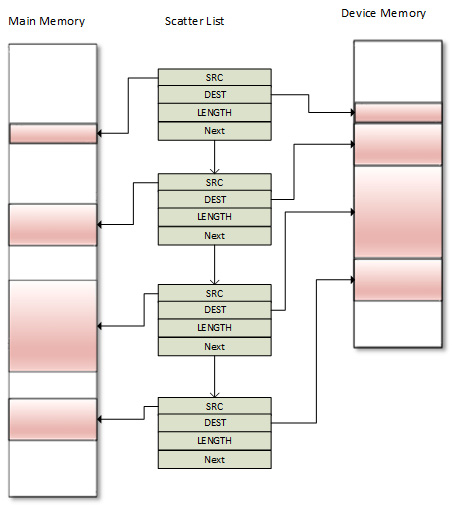
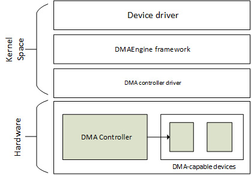
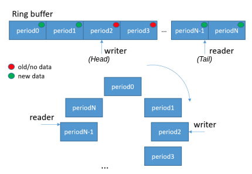

# *Chapter 11*: Implementing Direct Memory Access (DMA) Support

**Direct Memory Access** (**DMA**) is a feature of computer systems that allows devices to access the main system memory without CPU intervention, allowing the CPU to focus on other tasks. Examples of its usage include network traffic acceleration, audio data, or video frame grabbing, and its use is not limited to a particular domain. The peripheral responsible for managing the DMA transactions is the DMA controller, which is present in the majority of modern processors and microcontrollers.

The feature works in the following manner: When the driver needs to transfer a block of data, the driver sets up the DMA controller with the source address, the destination address, and the total number of bytes to copy. The DMA controller then transfers the data from the source to the destination automatically, without stealing CPU cycles. When the number of bytes remaining reaches zero, the block transfer ends, and the driver is notified.

Note

DMA does not always mean copy is going to be faster. It does not bring direct speed performance gains, but first, a true background operation, which leaves the CPU available to do other stuff, and then, performance gains due to sustaining the CPU cache/prefetcher state during DMA operation (which likely would be garbled when using plain old memcpy, executed on the CPU itself).

This chapter will deal with coherent and non-coherent DMA mappings, as well as coherency issues, the DMA engine's API, and DMA and DT bindings. More precisely, we will cover the following topics:

- Setting up DMA mappings
- Introduction to the concept of completion
- Working with the DMA engine's API
- Putting it all together – Single-buffer DMA mapping
- A word on cyclic DMA
- Understanding DMA and DT bindings

# Setting up DMA mappings

For any type of DMA transfer, you need to provide source and destination addresses, as well as the number of words to transfer. In the case of peripheral DMA, this peripheral's FIFO acts as either the source or the destination, depending on the transfer direction. When the peripheral acts as the source, the destination address is a memory location (internal or external). When the peripheral acts as the destination, the source address is a memory location (internal or external).

In other words, a DMA transfer requires suitable memory mappings. This is what we will discuss in the following sections.

## The concept of cache coherency and DMA

On a CPU equipped with a cache, copies of recently accessed memory areas are cached, even memory areas mapped for DMA. The reality is that memory shared between two independent devices is generally the source of cache coherency issues. Cache incoherency stems from the fact that other devices may not be aware of an update from another device writing. On the other hand, cache coherency ensures that every write operation appears to occur instantaneously, meaning that all devices sharing the same memory region see exactly the same sequence of changes.

A well-explained situation of coherency issues is illustrated in the following excerpt from the third edition of *Linux Device Drivers (LDD3)*:

"Let us imagine a CPU equipped with a cache and an external memory that can be accessed directly by devices using DMA. When the CPU accesses the location X in the memory, the current value will be stored in the cache. Subsequent operations on X will update the cached copy of X, but not the external memory version of X, assuming a write-back cache. If the cache is not flushed to the memory before the next time a device tries to access X, the device will receive a stale value of X. Similarly, if the cached copy of X is not invalidated when a device writes a new value to the memory, then the CPU will operate on a stale value of X."

There are two ways to address this issue:

- A hardware-based solution. Such systems are coherent systems.
- A software-based solution, where the OS is responsible for ensuring cache coherency. Such systems are non-coherent systems.

Now that we are aware of the caching aspects of DMA, let's move a step forward and learn how to perform memory mappings for DMA.

## Memory mappings for DMA

Memory buffers allocated for DMA purposes must be mapped accordingly. A DMA mapping consists of allocating a memory buffer suitable for DMA and generating a bus address for this buffer.

We distinguish between two types of DMA mappings – **coherent DMA mappings** and **streaming DMA mappings**. The former automatically addresses cache coherency issues, making it a good candidate for reuse over several transfers without unmapping in between transfers. This may entail considerable overhead on some platforms and, anyways, keeping memory synced has a cost. The streaming mapping has a lot of constraints in terms of coding and does not automatically address coherency issues, although there is a solution for that, which consists of several function calls between each transfer. Coherent mapping usually exists for the life of the driver, whereas one streaming mapping is usually unmapped once the DMA transfer completes.

Note

It is recommended to use streaming mapping when you can, and coherent mapping when you must. You should consider using coherent mapping if the buffer is accessed unpredictably by the CPU or the DMA controller since memory will always be synced. Otherwise, you should use streaming mapping because you know exactly when you need to access the buffer, in which case you'll first flush the cache (thereby syncing the buffer) before accessing the buffer.

The main header to include for handling DMA mappings is the following:

``` c
 #include <linux/dma-mapping.h>
```

However, depending on the mapping, different APIs can be used. Before going further in the API, we need to understand the operations that are performed during DMA mappings:

1.  Assuming the device supports DMA, if the driver sets up a buffer using **kmalloc()**, it will get a virtual address (let's call this *X*), which points nowhere yet.
2.  The virtual memory system (helped by the **MMU**, the **Memory Management Unit**) will map *X* to a physical address (let's call this *Y*) in the system's RAM, assuming there is still free memory available.

Because DMA does not flow through the CPU virtual memory system, the driver can use virtual address *X* to access the buffer at this point, but the device itself cannot.

1.  In some simple systems (those without I/O MMU), the device can do DMA directly to physical the address *Y*. But in many others, devices see the main memory through the lenses of the I/O MMU; thus, there is I/O MMU hardware that translates DMA addresses to physical addresses, for example, it translates *Z* to *Y*.
2.  This is where the DMA API intervenes:
    - The driver can pass a virtual address *X* to a function such as **dma_map_single()** (which we will look at later in this chapter, in The *Single-buffer mapping* section), which sets up any appropriate I/O MMU mapping and returns the DMA address *Z.*
    - The driver then instructs the device to do DMA into *Z*.
    - The I/O MMU finally maps it to the buffer at address *Y* in the system's RAM.

Now that the concept of memory mapping for DMA has been introduced, we can start creating mappings, starting with the easiest ones – the coherent DMA mappings.

### Creating coherent DMA mappings

Such mappings are most often used for long-lasting, bi-directional I/O buffers. The following function sets up a coherent mapping:

``` c
void *dma_alloc_coherent(struct device *dev, size_t size,
                      dma_addr_t *dma_handle, gfp_t flag)
```

This function is responsible for both the allocation and the mapping of the buffer. It returns a kernel virtual address for that buffer, which is **size** bytes wide and accessible by the CPU. The **size** parameter may be misleading as it is first given to **get_order()** APIs to get the page order that corresponds to this size. Consequently, this mapping is at least page-sized, and the number of pages the power of 2. **dev** is your device structure. The third argument is an output parameter that points to the associated bus address. Memory allocated for the mapping is guaranteed to be physically contiguous, and flags determine how memory should be allocated, which is usually **GFP_KERNEL**, or **GFP_ATOMIC** in an atomic context.

Do note that this mapping is said to be the following:

- Consistent (coherent) because the buffer content is always the same across all subsystems (either the device or the CPU)
- Synchronous, because a write by either the device or the CPU can immediately be read without worrying about cache coherency

To release the mapping, you can use the following API:

``` c
void dma_free_coherent(struct device *dev, size_t size,
                 void *cpu_addr, dma_addr_t dma_handle);
```

In the preceding prototype, **cpu_addr** and **dma_handle** correspond to the kernel virtual address and bus address returned by **dma_alloc_coherent()**. Those two parameters are required by the MMU (which returned the virtual address) and the I/O MMU (which returned the bus address) to release their mappings.

### Creating streaming DMA mappings

Streaming DMA mapping memory buffers are typically mapped right before the transmission and unmapped afterward. Such mappings have more constraints and differ from coherent mappings for the following reasons:

- Mappings need to function with a buffer that has previously been allocated dynamically.
- Mappings may accept several non-contiguous and scattered buffers.
- For read transactions (device to CPU), buffers belong to the device, not to the CPU. Before the CPU can use the buffers, they should be unmapped first (after **dma_unmap\_{single,sg}()**), or **dma_sync\_{single,sg}\_for_cpu()** must be invoked on those buffers. The main reason for this is caching purposes.
- For write transactions (CPU to device), the driver should place data in the buffer before establishing the mapping.
- The transfer direction has to be specified, and the data should move and should be used only based on this direction.

There are two forms of streaming mapping:

- Single-buffer mapping, which allows one physically contiguous buffer mapping
- Scatter/gather mapping, which allows several buffers to be passed (scattered over memory)

For both mappings, the transfer direction should be specified by a symbol of the **enum dma_data_direction** type, defined in **include/linux/dma-direction.h**, as follows:

``` c
enum dma_data_direction {
     DMA_BIDIRECTIONAL = 0,
     DMA_TO_DEVICE = 1,
     DMA_FROM_DEVICE = 2,
     DMA_NONE = 3,
};
```

In the preceding excerpt, each element is quite self-explanatory.

Note

Coherent mappings implicitly have a direction attribute setting set with **DMA_BIDIRECTIONAL**.

Now that we are aware of the two streaming DMA mapping methods, we can get the details of their implementations, starting with the single-buffer mappings.

#### Single-buffer mapping

Single-buffer mapping is a streaming mapping for occasional transfer. You can set up such a mapping using the **dma_map_single()** function, which has the following definition:

``` c
dma_addr_t dma_map_single(struct device *dev, void *ptr,
        size_t size, enum dma_data_direction direction);
```

The direction should be either **DMA_TO_DEVICE**, **DMA_FROM_DEVICE**, or **DMA_BIDIRECTIONAL**, respectively, when the CPU is the source (it writes to the device), when the CPU is the destination (it reads from the device), or when access is bi-directional for this mapping (implicitly used in coherent mappings). **dev** is the underlying **device** structure for your hardware device, **ptr** is an output parameter, and is the kernel virtual address of the buffer. This function returns an element of the **dma_addr_t** type, which is the bus address returned by the I/O MMU (if present) for the device so that the device can DMA into. You should use **dma_mapping_error()** (which must return **0** if no error occurred) to check whether the mapping returned a valid address and not go further in case of an error.

Such mapping can be released by the following function:

``` c
void dma_unmap_single(struct device *dev,
                      dma_addr_t dma_addr, size_t size,
                      enum dma_data_direction direction);
int dma_mapping_error(struct device *dev,
                      dma_addr_t dma_addr);
```

The other mapping is scatter/gather mappings, since memory buffers are spread (scattered) over the system on allocation and gathered by the driver.

#### Scatter/gather mappings

Scatter/gather mappings are a special type of streaming DMA mapping that allow the transfer of several memory buffers in a single shot, instead of mapping each buffer individually and transferring them one by one. Suppose you have several buffers that might not be physically contiguous, all of which need to be transferred at the same time to or from the device. This situation may occur due to the following:

- A **readv** or **writev** system call
- A disk I/O request
- Or simply a list of pages or a vmalloced region

Before you can issue such a mapping, you must set up an array of scatter elements, each of which should describe the mapping of an individual buffer. A scatter element is abstracted in the kernel as an instance of **struct scatterlist**, defined as follows:

``` c
struct scatterlist {
     unsigned long page_link;
     unsigned int     offset;
     unsigned int     length;
     dma_addr_t       dma_address;
     unsigned int     dma_length;
};
```

To set up a scatter list mapping, you should do the following:

- Allocate your scattered buffers.
- Create an array of scatter elements, initialize this array using **sg_init_table()** on it, and fill this array with allocated memory using **sg_set_buf()**. Note that each scatter element entry must be of page size, except the last one, which may not respect this rule.
- Call **dma_map_sg()** on the scatter list.
- Once done with DMA, call **dma_unmap_sg()** to unmap the scatter list.

The following is a diagram that describes most of the concepts of the scatter list:



Figure 11.1 – Scatter/gather memory organization

While it is possible to DMA the content of several buffers individually, scatter/gather makes it possible to DMA the whole list at once by sending the pointer to the scatter list array to the device, along with its length, which is the number of entries in the array.

The prototypes of **sg_init_table()**, **sg_set_buf()**, and **dma_map_sg()** are as follows:

``` c
void sg_init_table(struct scatterlist *sgl,
                   unsigned int nents)
void sg_set_buf(struct scatterlist *sg, const void *buf,
                unsigned int buflen)
int dma_map_sg(struct device *dev,
               struct scatterlist *sglist, int nents,
               enum dma_data_direction dir);
```

In the preceding APIs, **sgl** is the **scatterlist** array to initialize and **nents** is the number of entries in this array. **sg_set_buf()** sets a **scattlerlist** entry to point at given data. In its parameters, **sg** is the **scatterlist** entry, **data** is the buffer corresponding to the entry, and **buflen** is the size of the buffer. **dma_map_sg()** returns the number of elements in the list that have been successfully mapped, which means it must never be less than zero. In the event of an error, this function returns zero.

The following is a code sample that demonstrates the principle of scatter/gather mapping:

``` c
u32 *wbuf, *wbuf2, *wbuf3;
wbuf = kzalloc(SDMA_BUF_SIZE, GFP_DMA);
wbuf2 = kzalloc(SDMA_BUF_SIZE, GFP_DMA);
wbuf3 = kzalloc(SDMA_BUF_SIZE/2, GFP_DMA);
struct scatterlist sg[3];
sg_init_table(sg, 3);
sg_set_buf(&sg[0], wbuf, SDMA_BUF_SIZE);
sg_set_buf(&sg[1], wbuf2, SDMA_BUF_SIZE);
sg_set_buf(&sg[2], wbuf3, SDMA_BUF_SIZE/2);
ret = dma_map_sg(dev, sg, 3, DMA_TO_DEVICE);
if (ret != 3) {
     /*handle this error*/
}
/* As of now you can use 'ret' or 'sg_dma_len(sgl)' to retrieve the
 * length of the scatterlist array.
 */
```

The same rules described in the single-buffer mapping section apply to scatter/gather.

To unmap the list, you must use **dma_unmap_sg()**, which has the following definition:

``` c
void dma_unmap_sg_attrs(struct device *dev, struct scatterlist *sg,
                          enum dma_data_direction dir, int nents)
```

**dev** is a pointer to the same device that has been used for mapping, **sg** is the scatter list (actually a pointer to the first element in the list) to be unmapped, **dir** is the DMA direction, which should map the mapping direction, and **nents** is the number of elements in the list.

The following is an example that unmaps the previous implementation:

``` c
dma_unmap_sg(dev, sg, 3, DMA_TO_DEVICE);
```

In the preceding example, we used the same parameters that we used during the mapping.

#### Implicit and explicit cache coherency for streaming mapping

In either streaming mapping, **dma_map_single()**/**dma_unmap_single()** and **dma_map_sg()**/**dma_unmap_sg()** pairs take care of cache coherency when they are invoked. In the case of outgoing DMA transfer (CPU to device, **DMA_TO_DEVICE** direction flag set), since data must be in buffers before establishing the mapping, **dma_map_sg()**/**dma_map_single()** will handle cache coherency. In the case of device to CPU (**DMA_FROM_DEVICE** direction flag set), the mappings must be released first before the CPU can access the buffers. This is because **dma_unmap_single()**/**dma_unmap_sg()** implicitly take care of cache coherency as well.

However, if you need to use the same streaming DMA region numerous times and touch the data in between the DMA transfers, the buffer must be synced properly so that the device and CPU see the most up-to-date and correct copy of the DMA buffer. To avoid cache coherency issues, the driver must call **dma_sync\_{single,sg}\_for_device()** right before starting a DMA transfer from the RAM to the device (after you have put data in the buffer and before actually giving the buffer to the hardware). This function call will flush, if necessary, the cache lines corresponding to the DMA buffer. Similarly, the driver should not access the memory buffer immediately after completing the DMA transfer from the device to the RAM; instead, before reading the buffer, the driver should call **dma_sync\_{single,sg}\_for_cpu()**, which invalidates the associated hardware cache lines if necessary. In other words, when the source buffer is the device memory, the cache should be invalidated (cache data is not dirty as nothing has been written by the CPU to any buffer), whereas if the source is RAM (the destination is the device memory), this means the CPU may have written some data to the source buffer and the data may be in the cache line, hence the cache should be flushed.

The following are the prototypes of those syncing APIs:

``` c
void dma_sync_sg_for_cpu(struct device *dev,
                     struct scatterlist *sg,
                     int nents,
                     enum dma_data_direction direction);
void dma_sync_sg_for_device(struct device *dev,
                     struct scatterlist *sg, int nents,
                     enum dma_data_direction direction);
void dma_sync_single_for_cpu(struct device *dev,
                     dma_addr_t addr, size_t size,
                     enum dma_data_direction dir)
void dma_sync_single_for_device(struct device *dev,
                     dma_addr_t addr, size_t size,
                     enum dma_data_direction dir)
```

In all of the preceding APIs, the direction parameter must remain the same as the direction specified during the mapping of the corresponding buffer.

In this section, we have learned to set up streaming DMA mappings. Now that we are done with mappings, let's introduce the concept of completion, which is used to notify a DMA transfer completion.

# Introduction to the concept of completion

This section will briefly describe completion and the necessary part of its API that the DMA transfer uses. For a complete description, feel free to have a look at the kernel documentation at **Documentation/scheduler/completion.txt**. In kernel programming, a typical practice is to start some activity outside of the current thread and then wait for it to finish. Completions are good alternatives to waitqueues or sleeping APIs while waiting for a very commonly occurring process to complete. Completion variables are implemented using wait queues, with the only difference being that they make the developer's life easier as it does not require the wait queue to be maintained, which makes it very easy to see the intent of the code.

Working with completion requires this header:

``` c
#include <linux/completion.h>
```

A completion variable is represented in the kernel as an instance of struct completion structures that can be initialized statically as follows:

``` c
DECLARE_COMPLETION(my_comp);
```

Dynamic allocation of an initialization is done as follows:

``` c
struct completion my_comp;
init_completion(&my_comp);
```

When the driver initiates work whose completion must be awaited (a DMA transaction in our case), it just has to pass the completion event to the **wait_for_completion()** function, which has the following prototype:

``` c
void wait_for_completion(struct completion *comp);
```

When the completion occurs, the driver can wake the waiters using one of the following APIs:

``` c
void complete(struct completion *comp);
void complete_all(struct completion *comp);
```

**complete()** will wake up only one waiting task, while **complete_all()** will wake up every task waiting for that event. Completions are implemented in such a way that they will work properly even if **complete()** is called before **wait_for_completion()** is.

In this section, we have learned to implement a completion callback to notify the completeness status of a DMA transfer. Now that we are comfortable with all the common concepts of the DMA, we can start applying these concepts using the DMA engine APIs, which will also help us better understand how things work once everything is put together.

# Working with the DMA engine's API

The DMA engine is a generic kernel framework used to develop DMA controller drivers and leverage this controller from the consumer side. Through this framework, the DMA controller driver exposes a set of channels that can be used by client devices. This framework then makes it possible for client drivers (also called slaves) to request and use DMA channels from the controller to issue DMA transfers.

The following diagram is the layering, showing how this framework is integrated with the Linux kernel:



Figure 11.2 – DMA engine framework

Here we will simply walk through that (slave) API, which is applicable for slave DMA usage only. The mandatory header here is as follows:

``` c
#include <linux/dmaengine.h>
```

The slave DMA usage is straightforward, and consists of the following steps:

1.  Informing the kernel about the device's DMA addressing capabilities.
2.  Requesting a DMA channel.
3.  If successful, configuring this DMA channel.
4.  Preparing or configuring a DMA transfer. At this step, a transfer descriptor that represents the transfer is returned.
5.  Submitting the DMA transfer using the descriptor. The transfer is then added to the controller's pending queue corresponding to the specified channel. This step returns a special cookie that you can use to check the progression of the DMA activity.
6.  Starting the DMA transfers on the specified channel so that, if the channel is idle, the first transfer in the queue is started.

Now that we are aware of the steps needed to implement a DMA transfer, let's learn the data structures involved in the DMA engine framework before using the corresponding APIs.

## A brief introduction to the DMA controller interface

The usage of DMA in Linux consists of two parts: the controllers, which perform memory transfer (without the CPU intervening), and the channels, which are the ways by which client drivers (that is, DMA-capable drivers) submit jobs to controllers. It goes without saying that both the controller and its channels are tightly coupled because the former exposes the latter to clients.

Although this chapter targets DMA client drivers, for the sake of understandability, we will be introducing some controller data structures and APIs.

### The DMA controller data structure

The DMA controller is abstracted in the Linux kernel as an instance of **struct dma_device**. On its own, the controller is useless without clients, which would use the channels it exposes. Moreover, the controller driver must expose callbacks for channel configuration, as specified in its data structure, which has the following definition:

``` c
struct dma_device {
    unsigned int chancnt;
    unsigned int privatecnt;
    struct list_head channels;
    struct list_head global_node;
    struct dma_filter filter;
    dma_cap_mask_t  cap_mask;
    u32 src_addr_widths;
    u32 dst_addr_widths;
    u32 directions;
    int (*device_alloc_chan_resources)(
                                  struct dma_chan *chan);
    void (*device_free_chan_resources)(
                                  struct dma_chan *chan);
    struct dma_async_tx_descriptor
     *(*device_prep_dma_memcpy)(
        struct dma_chan *chan, dma_addr_t dst,
        dma_addr_t src, size_t len, unsigned long flags);
    struct dma_async_tx_descriptor
      *(*device_prep_dma_memset)(
       struct dma_chan *chan, dma_addr_t dest, int value,
       size_t len, unsigned long flags);
    struct dma_async_tx_descriptor
      *(*device_prep_dma_memset_sg)(
         struct dma_chan *chan, struct scatterlist *sg,
         unsigned int nents, int value,
         unsigned long flags);
    struct dma_async_tx_descriptor
      *(*device_prep_dma_interrupt)(
         struct dma_chan *chan, unsigned long flags);
    struct dma_async_tx_descriptor
      *(*device_prep_slave_sg)(
         struct dma_chan *chan, struct scatterlist *sgl,
           unsigned int sg_len,
           enum dma_transfer_direction direction,
           unsigned long flags, void *context);
    struct dma_async_tx_descriptor
      *(*device_prep_dma_cyclic)(
           struct dma_chan *chan, dma_addr_t buf_addr,
           size_t buf_len, size_t period_len,
           enum dma_transfer_direction direction,
           unsigned long flags);
     void (*device_caps)(struct dma_chan *chan,
                     struct dma_slave_caps *caps);
     int (*device_config)(struct dma_chan *chan,
                     struct dma_slave_config *config);
     void (*device_synchronize)(struct dma_chan *chan);
     enum dma_status (*device_tx_status)(
              struct dma_chan *chan, dma_cookie_t cookie,
              struct dma_tx_state *txstate);
     void (*device_issue_pending)(struct dma_chan *chan);
     void (*device_release)(struct dma_device *dev);
};
```

The complete definition of this data structure is available in **include/linux/dmaengine.h**. For this chapter, only fields of our interest have been listed. Their meanings are as follows:

- **chancnt**: Specifies how many DMA channels are supported by this controller
- **channels**: The list of **struct dma_chan** structures, which corresponds to the DMA channels exposed by this controller
- **privatecnt**: How many DMA channels are requested by **dma_request_channel()**, which is the DMA engine API to request a DMA channel
- **cap_mask**: One or more **dma_capability** flags, representing the capabilities of this controller

The following are the possible values:

``` c
enum dma_transaction_type {
    DMA_MEMCPY,     /* Memory to memory copy */
    DMA_XOR,  /* Memory to memory XOR*/
    DMA_PQ,   /* Memory to memory P+Q computation */
    DMA_XOR_VAL, /* Memory buffer parity check using
                  * XOR */
    DMA_PQ_VAL,  /* Memory buffer parity check using
                  * P+Q */
    DMA_INTERRUPT,  /* The device can generate dummy
                     * transfer that will generate
                     * interrupts */
    DMA_MEMSET_SG,  /* Prepares a memset operation over a
                     * scatter list */
    DMA_SLAVE,      /* Slave DMA operation, either to or
                     * from a device */
    DMA_PRIVATE,    /* channels are not to be used
                     * for global memcpy. Usually
                     *used with DMA_SLAVE */
    DMA_SLAVE,      /* Memory to device transfers */
    DMA_CYCLIC,     /* can handle cyclic tranfers */
    DMA_INTERLEAVE, /* Memory to memory interleaved
                     * transfer */
}
```

As an example, this element is set in the i.MX DMA controller driver as follows:

``` c
dma_cap_set(DMA_SLAVE, sdma->dma_device.cap_mask);
dma_cap_set(DMA_CYCLIC, sdma->dma_device.cap_mask);
dma_cap_set(DMA_MEMCPY, sdma->dma_device.cap_mask);
```

- **src_addr_widths**: The bit mask of source address widths that the device supports. This width must be supplied in bytes; for example, if the device supports a width of **4**, the mask should be set to **BIT(4)**.
- **dst_addr_widths**: The bit mask of destination address widths that the device supports.
- **directions**: The bit mask of slave directions supported by the device. Because **enum dma_transfer_direction** does not include a bit flag for each type, the DMA controller should set **BIT(\<TYPE\>)** and the same should be checked by the controller as well.

It is set in the i.MX SDMA controller driver as follows:

``` c
#define SDMA_DMA_DIRECTIONS (BIT(DMA_DEV_TO_MEM) | \
                     BIT(DMA_MEM_TO_DEV) | \
                       BIT(DMA_DEV_TO_DEV))
[...]
sdma->dma_device.directions = SDMA_DMA_DIRECTIONS;
```

- **device_alloc_chan_resources**: Allocates resources and returns the number of allocated descriptors. Invoked by the DMA engine core when requesting a channel on this controller.
- **device_free_chan_resources**: A callback allowing the release of the DMA channel's resources.

While the preceding was a generic callback, the following is a controller callback that depends on the controller capabilities and that must be provided if the associated capability bit masks are set in **cap_mask**.

- **device_prep_dma_memcpy** prepares a memcpy operation. If **DMA_MEMCPY** is set in **cap_mask**, then this element must be set. For each flag set, the corresponding callback must be provided, otherwise controller registration will fail. This is the case for all **device_prep\_\*** callbacks.
- **device_prep_dma_xor**: Prepares an XOR operation.
- **device_prep_dma_xor_val**: Prepares an xor validation operation.
- **device_prep_dma_memset**: Prepares a memset operation.
- **device_prep_dma_memset_sg**: Prepares a memset operation over a scatter list.
- **device_prep_dma_interrupt**: Prepares an end of chain interrupt operation.
- **device_prep_slave_sg**: Prepares a slave DMA operation.
- **device_prep_dma_cyclic**: Prepares a cyclic DMA operation. Such a DMA operation is frequently used in audio or UART drivers. A buffer of size **buf_len** is required by the function. The callback function will be called after **period_len** bytes have been transferred. We discuss such DMAs in the *A word on cyclic DMA* section.
- **device_prep_interleaved_dma**: Transfers expression in a generic way.
- **device_config**: Pushes a new configuration to a channel, with a return value of **0** in the event of success or an error code otherwise.
- **device_pause**: Pauses any current transfer on a channel and returns **0** or if the pausing is effective, or an error code otherwise.
- **device_resume**: Resumes any previously paused transfer on a channel. It returns **0** or an error code otherwise.
- **device_terminate_all**: A callback used to abort all the transfers on a channel, and which returns **0** in the event of success or an error code otherwise.
- **device_synchronize**: A callback allowing synchronization of the termination of a transfer to the current context.
- **device_tx_status**: Polls for transaction completion. The optional **txstate** parameter can be used to obtain a struct containing auxiliary transfer status information; otherwise, the call will just return a simple status code.
- **device_issue_pending**: A mandatory callback that pushes pending transactions to hardware. This is the backend of the **dma_async_issue_pending()** API.

While most drivers make a direct invocation of these callbacks (through **dma_chan-\>dma_dev-\>device_prep_dma\_\***), you should be using the **dmaengine_prep\_\*** DMA engine APIs, which additionally do some sanity checks before invoking the appropriate callback. For example, for memory to memory, the driver should use the **device_prep_dma_memcpy()** wrapper.

### The DMA channel data structure

A DMA channel is how a client driver submits DMA transactions (I/O data transfers) to the DMA controller. The way it works, a DMA-capable driver (client driver) requests one or more channels, reconfigures this channel, and asks the controller to use this channel to perform the submitted DMA transfer. A channel is defined as follows:

``` c
struct dma_chan {
     struct dma_device *device;
     struct device *slave;
     dma_cookie_t cookie;
     dma_cookie_t completed_cookie;
[...]
};
```

You can see a DMA channel as a highway for I/O data transfer. The following are the meanings of each element in this data structure:

- **device**: This is a pointer to the DMA device (the controller) that supplies this channel. This field can never be **NULL** if the channel has been requested successfully because a channel always belongs to a controller.
- **slave**: This is a pointer to the underlying **struct device** structure for the device using this channel (its driver is a client driver).
- **cookie**: This represents the last cookie value returned to the client by this channel.
- **Completed_cookie**: The last completed cookie for this channel.

The complete definition of this data structure can be found in **include/linux/dmaengine.h**.

Note

In the DMA engine framework, a cookie is nothing but a DMA transaction identifier that allows the status and progression of the transaction it identifies to be checked.

### DMA transaction descriptor data structure

A transaction descriptor does nothing other than characterize and describe a DMA transaction (or DMA transfer by abuse of language). Such a descriptor is represented in the kernel using a **struct dma_async_tx_descriptor** data structure, which has the following definition:

``` c
struct dma_async_tx_descriptor {
     dma_cookie_t cookie;
     struct dma_chan *chan;
     dma_async_tx_callback callback;
     void *callback_param;
[...]
};
```

The meanings of each element we have retained in this data structure are set out here:

- **cookie**: A tracking cookie for this transaction. It allows the progression of this transaction to be checked.
- **chan**: The target channel for this operation.
- **callback**: A function that should be called once this operation is complete.
- **callback_param**: This is given as a parameter of the callback function.

You can find the complete data structure description in **include/linux/dmaengine.h**.

## Handling device DMA addressing capabilities

The kernel considers that your device can handle 32-bit DMA addressing by default. However, the DMA memory address range your device can access may be limited, and this may be due to manufacturer or historical reasons. Some devices, for example, may only support the low order 24-bits of addressing. This limitation originated from the ISA bus, which was 24-bits wide and where DMA buffers could only live in the bottom 16 MB of the system's memory.

Nevertheless, you can use the concept of a DMA mask to inform the kernel of such limitations, which aims to inform the kernel of your device's DMA addressing capabilities.

This can be achieved using **dma_set_mask_and_coherent()**, which has the following prototype:

``` c
int dma_set_mask_and_coherent(struct device *dev,
                              u64 mask);
```

The preceding function will set the same mask for both streaming mappings and coherent mappings given that the DMA API guarantees that the coherent DMA mask can be set to the same or smaller than the streaming DMA mask.

However, for special requirements, you can use either **dma_set_mask()** or **dma_set_coherent_mask()** to set the mask accordingly. These APIs have the following prototypes:

``` c
int dma_set_mask(struct device *dev, u64 mask);
int dma_set_coherent_mask(struct device *dev, u64 mask);
```

In these functions, **dev** is the underlying device structure, while **mask** is a bit mask describing which bits of an address your device supports, which you can specify using the **DMA_BIT_MASK** macro along with the actual bit order.

Both **dma_set_mask()** and **dma_set_coherent_mask()** return zero to indicate that the device can perform DMA properly on the machine given the address mask specified. Any other return value would be an error, meaning that the given mask is too small to be supportable on the given system. In such a failure case, you can either fall back to non-DMA mode for data transfer in your driver or, if the DMA was mandatory, simply disable the feature in the device that required support for DMA or even not probe the device at all.

It is recommended that your driver prints a kernel warning (**dev_warn()** or **pr_warn()**) message when setting the DMA mask fails. The following is an example of pseudo-code for a sound card:

``` c
#define PLAYBACK_ADDRESS_BITS DMA_BIT_MASK(32)
#define RECORD_ADDRESS_BITS DMA_BIT_MASK(24)
struct my_sound_card *card;
struct device *dev;
...
if (!dma_set_mask(dev, PLAYBACK_ADDRESS_BITS)) {
     card->playback_enabled = 1;
} else {
    card->playback_enabled = 0;
    dev_warn(dev,
     "%s: Playback disabled due to DMA limitations\n",
     card->name);
}
if (!dma_set_mask(dev, RECORD_ADDRESS_BITS)) {
    card->record_enabled = 1;
} else {
    card->record_enabled = 0;
    dev_warn(dev,
          "%s: Record disabled due to DMA limitations\n",
          card->name);
}
```

In the preceding example, we have used the **DMA_BIT_MASK** macro to define the DMA mask. Then, we have disabled the features for which DMA support was mandatory when the required DMA mask was not supported. In either case, a warning is printed.

## Requesting a DMA channel

A channel is requested using **dma_request_channel()**. Its prototype is as follows:

``` c
struct dma_chan *dma_request_channel(
                      const dma_cap_mask_t *mask,
                      dma_filter_fn fn, void *fn_param);
```

In the preceding, the mask must be a bit mask that represents the capabilities the channel must satisfy. It is essentially used to specify the type of transfer the driver needs to perform, which must be supported in **dma_device.cap_mask**.

The **dma_cap_zero()** and **dma_cap_set()** functions are used to clear the mask and set the capability we need; for example:

``` c
dma_cap_mask my_dma_cap_mask;
struct dma_chan *chan;
dma_cap_zero(my_dma_cap_mask);
/* Memory 2 memory copy */
dma_cap_set(DMA_MEMCPY, my_dma_cap_mask);
chan = dma_request_channel(my_dma_cap_mask, NULL, NULL);
```

**fn** is a callback pointer whose type has the following definition:

``` c
typedef bool (*dma_filter_fn)(struct dma_chan *chan,
                void *filter_param);
```

Actually, **dma_requaest_channel()** walks through the available DMA controllers in the system (**dma_device_list**, defined in **drivers/dma/dmaengine.c**) and for each of them, it looks for a channel that corresponds to the request. If the **filter_fn** parameter (which is optional) is **NULL**, **dma_request_channel()** will simply return the first channel that satisfies the capability mask. Otherwise, when the mask parameter is insufficient for specifying the necessary channel, you can use the **filter_fn** routine as a filter so that each available channel in the system will be given to this callback for acceptance or not. The kernel calls the **filter_fn** routine once for each free channel in the system. Upon seeing a suitable channel, **filter_fn** should return **DMA_ACK**, which will tag the given channel to be the return value from **dma_request_channel()**.

A channel allocated through this interface is exclusive to the caller until **dma_release_channel()** is called. It has the following definition:

``` c
void dma_release_channel(struct dma_chan *chan)
```

This API releases the DMA channel and makes it available for request by other clients.

By way of additional information, available DMA channels on a system can be listed in user space using the **ls /sys/class/dma/** command as follows:

``` c
root@raspberrypi4-64:~# ls /sys/class/dma/
dma0chan0  dma0chan1  dma0chan2  dma0chan3  dma0chan4  dma0chan5  dma0chan6  dma0chan7  dma1chan0  dma1chan1
```

In the preceding snippet, the **chan\<chan-index\>** channel name is concatenated with the DMA controller, **dma\<dma-index\>**, to which it belongs. Whether a channel is in use or not can be seen by printing the **in_use** file value in the corresponding channel directory as follows:

``` c
root@raspberrypi4-64:~# cat /sys/class/dma/dma0chan0/in_use
1
root@raspberrypi4-64:~# cat /sys/class/dma/dma0chan1/in_use
1
root@raspberrypi4-64:~# cat /sys/class/dma/dma0chan2/in_use
1
root@raspberrypi4-64:~# cat /sys/class/dma/dma0chan3/in_use
0
root@raspberrypi4-64:~# cat /sys/class/dma/dma0chan4/in_use
0
root@raspberrypi4-64:~# cat /sys/class/dma/dma0chan5/in_use
0
root@raspberrypi4-64:~# cat /sys/class/dma/dma0chan6/in_use
0
root@raspberrypi4-64:~#
```

In the preceding, we can see, for example, that **dma0chan1** is in use, while **dma0chan6** is not.

## Configuring the DMA channel

For the DMA transfer to operate normally on a channel, a client-specific configuration must be applied to this channel. Thereby, the DMA engine framework allows this configuration by using a **struct dma_slave_config** data structure, which represents the runtime configuration of a DMA channel. This allows clients to specify parameters such as the DMA direction, DMA addresses (source and destination), bus width, and DMA burst lengths, for the peripheral. This configuration is then applied to the underlying hardware using the **dmaengine_slave_config()** function, which is defined as follows:

``` c
int dmaengine_slave_config(struct dma_chan *chan,
                         struct dma_slave_config *config)
```

The **chan** parameter represents the DMA channel to configure, and **config** is the configuration to be applied.

To better fine-tune this configuration, we must look at the **struct dma_slave_config** structure, which is defined as follows:

``` c
struct dma_slave_config {
     enum dma_transfer_direction direction;
     phys_addr_t src_addr;
     phys_addr_t dst_addr;
     enum dma_slave_buswidth src_addr_width;
     enum dma_slave_buswidth dst_addr_width;
     u32 src_maxburst;
     u32 dst_maxburst;
     [...]
};
```

Here is the meaning of each element in the structure:

- **direction** indicates whether the data should go in or out on this slave channel, right now. The possible values are as follows:

  ``` c
  /* dma transfer mode and direction indicator */
  enum dma_transfer_direction {
      DMA_MEM_TO_MEM, /* Async/Memcpy mode */
      DMA_MEM_TO_DEV, /* From Memory to Device */
      DMA_DEV_TO_MEM, /* From Device to Memory */
      DMA_DEV_TO_DEV, /* From Device to Device */
      DMA_TRANS_NONE,
  };
  ```

- **src_addr**: This is the physical address (the bus address actually) of the buffer where the DMA slave data should be read (RX). This element is ignored if the source is memory. **dst_addr** is the physical address (the bus address) of the buffer where the DMA slave data should be written (TX), which is ignored if the source is memory. **src_addr_width** is the width in bytes of the source (RX) register where the DMA data should be read. If the source is memory, this may be ignored depending on the architecture. In the same manner, **dst_addr_width** is the same as **src_addr_width**, but for the destination target (TX).

Any bus width must be one of the following enumerations:

``` c
enum dma_slave_buswidth {
    DMA_SLAVE_BUSWIDTH_UNDEFINED = 0,
    DMA_SLAVE_BUSWIDTH_1_BYTE = 1,
    DMA_SLAVE_BUSWIDTH_2_BYTES = 2,
    DMA_SLAVE_BUSWIDTH_3_BYTES = 3,
    DMA_SLAVE_BUSWIDTH_4_BYTES = 4,
    DMA_SLAVE_BUSWIDTH_8_BYTES = 8,
    DMA_SLAVE_BUSWIDTH_16_BYTES = 16,
    DMA_SLAVE_BUSWIDTH_32_BYTES = 32,
    DMA_SLAVE_BUSWIDTH_64_BYTES = 64,
};
```

- **src_maxburs**: This is the maximum number of words that can be sent to the device in a single burst (consider words as units of the **src_addr_width** member, not bytes). On I/O peripherals, typically half the FIFO depth is used so that it does not overflow. On memory sources, this may or may not be applicable. **dst_maxburst** is similar to **src_maxburst**, but it is used for the destination target.

The following is an example of DMA channel configuration:

``` c
struct dma_chan *my_dma_chan;
dma_addr_t dma_src_addr, dma_dst_addr;
struct dma_slave_config channel_cfg = {0};
/* No filter callback, neither filter param */
my_dma_chan = dma_request_channel(my_dma_cap_mask,
                                   NULL, NULL);
/* scr_addr and dst_addr are ignored for mem to mem copy */
channel_cfg.direction = DMA_MEM_TO_MEM;
channel_cfg.dst_addr_width = DMA_SLAVE_BUSWIDTH_32_BYTES;
dmaengine_slave_config(my_dma_chan, &channel_cfg);
```

In the preceding excerpt, **dma_request_channel()** is used to request a DMA channel, which is then configured using **dmaengine_slave_config()**.

## Configuring the DMA transfer

This step allows the type of transfer to be defined. A DMA transfer is configured (or should we say prepared) thanks to one of the **device_prep_dma\_\*** callbacks of the controller associated with the DMA channel to which the transfer will be submitted. Each of these APIs returns a transfer descriptor, represented by the **struct dma_async_tx_descriptor** data structure, which can be used later for customization before submitting the transfer.

For a memory-to-memory transfer, for example, you should be using the **device_prep_dma_memcpy** callback, as in the following code:

``` c
struct dma_device *dma_dev = my_dma_chan->device;
struct dma_async_tx_descriptor *tx_desc = NULL;
tx_desc = dma_dev->device_prep_dma_memcpy(
                          my_dma_chan, dma_dst_addr,
                          dma_src_addr, BUFFER_SIZE, 0);
if (!tx_desc) {
    /* dma_unmap_* the buffer */
    handle_error();
}
```

In the preceding code sample, we dereference the controller callback for invocation while we could have checked for its existence first. However, for sanity and portability reasons, it is recommended to use the **dmaengine_prep\_\*** DMA engine APIs instead of invoking the controller callback directly. Our **tx_desc** assignation will then have the following form:

``` c
tx_desc = dmaengine_prep_dma_memcpy(my_dma_chan,
             dma_dst_addr, dma_src_addr, BUFFER_SIZE, 0);
```

This last approach is safer and portable regarding the controller data structure that may be subject to changes.

Additionally, the client driver can use the **callback** element of the **dma_async_tx_descriptor** structure (returned by the **dmaengine_prep\_\*** function) to supply a completion callback.

## Submitting the DMA transfer

To put the transaction in the driver pending queue, **dmaengine_submit()** is used, which has the following prototype:

``` c
dma_cookie_t dmaengine_submit(
                  struct dma_async_tx_descriptor *desc)
```

This API is the frontend of the controller's **device_issue_pending** callback. This function returns a cookie that you can use to check the progression of DMA activity through other DMA engines. To check whether the returned cookie is valid, you can use the **dma_submit_error()** helper, as we will see in the example. Assuming the completion callback has not yet been provided, it can be set up before submitting the transfer, as in the following excerpt:

``` c
struct completion transfer_ok;
init_completion(&transfer_ok);
/*
 * you can also set the parameter to be given to this
 * callback in tx->callback_param
 */
Tx_desc->callback = my_dma_callback;
/* Submitting our DMA transfer */
dma_cookie_t cookie = dmaengine_submit(tx);
if (dma_submit_error(cookie)) {
    /* handle error */
    [...]
}
```

The preceding excerpt is quite short and self-explanatory. For a parameter to be passed to the callback, it must be set in the descriptor's **callback_param** field. It can be a device state structure, for example.

Note

An interrupt (from the DMA controller) is raised after each DMA transfer has been completed, after which the next transfer in the queue is initiated and a tasklet is activated. If the client driver has provided a completion callback, the tasklet will call it when it is scheduled. Thus, the completion callback runs in an interrupt context.

## Issuing pending DMA requests and waiting for callback notification

Starting the transaction is the last step of the DMA transfer setup. Transactions in the pending queue of a channel are activated by calling **dma_async_issue_pending()** on that channel. If the channel is idle, then the first transaction in the queue is started and subsequent ones are queued up. Upon completion of a DMA operation, the next one in the queue is started and a tasklet triggered. This tasklet is in charge of calling the client driver completion callback routine for notification, if set:

``` c
void dma_async_issue_pending(struct dma_chan *chan);
```

This function is a wrapper around the controller's **device_issue_pending** callback. An example of its usage would look like the following:

``` c
dma_async_issue_pending(my_dma_chan);
wait_for_completion(&transfer_ok);
/* may be unmap buffer if necessary and if it is not
 * done in the completion callback yet
 */
[...]
/* Process buffer through rx_data and tx_data virtual addresses. */
[...]
```

The **wait_for_completion()** function will block, putting the current task to sleep until our DMA callback gets called to update (complete) our completion variable in order to resume the blocked code. It is a good alternative to **while (!done) msleep(SOME_TIME);**. The following is an example:

``` c
static void my_dma_complete_callback (void *param)
{
    complete(transfer_ok);
[...]
}
```

This is all in our DMA transfer implementation. When the completion callback returns, the main code will resume and continue its normal workflow.

Now that we have gone through the DMA engine APIs, we can summarize the knowledge in a complete example, as we see in the next section.

# Putting it all together – Single-buffer DMA mapping

Let's consider the following case where we would like to map a single buffer (streaming mapping) and DMA data from the source, **src**, to the destination, **dst**. We will use a character device so that any write operation in this device will trig the DMA and any read operation will compare both the source and destination to check whether they match.

First, let's enumerate the header files required to pull the necessary APIs:

``` c
#define pr_fmt(fmt) "DMA-TEST: " fmt
#include <linux/module.h>
#include <linux/slab.h>
#include <linux/init.h>
#include <linux/dma-mapping.h>
#include <linux/fs.h>
#include <linux/dmaengine.h>
#include <linux/device.h>
#include <linux/io.h>
#include <linux/delay.h>
```

Let's now define some global variables for the driver:

``` c
/* we need page aligned buffers */
#define DMA_BUF_SIZE  2 * PAGE_SIZE
static u32 *wbuf;
static u32 *rbuf;
static int dma_result;
static int gMajor; /* major number of device */
static struct class *dma_test_class;
static struct completion dma_m2m_ok;
static struct dma_chan *dma_m2m_chan;
```

In the preceding, **wbuf** represents the source buffer, and **rbuf** represents the destination buffer. Since our implementation is based on a character device, **gMajor** and **dma_test_class** are used to represent the major number and the class of the character device.

Because DMA mappings need to be given a device structure as the first parameter, let's create a dummy one:

``` c
static void dev_release(struct device *dev)
{
    pr_info( "releasing dma capable device\n");
}
static struct device dev = {
    .release = dev_release,
    .coherent_dma_mask = ~0, // allow any address
    .dma_mask = &dev.coherent_dma_mask,// use the same mask
};
```

Because we have used a static device, we set the device's DMA mask in the device structure. In a platform driver, we would have used **dma_set_mask_and_coherent()** to achieve that.

The time has come to implement our first file operation, the **open** method, which in our case, simply allocates buffers:

``` c
int dma_open(struct inode * inode, struct file * filp)
{
     init_completion(&dma_m2m_ok);
     wbuf = kzalloc(DMA_BUF_SIZE, GFP_KERNEL | GFP_DMA);
     if(!wbuf) {
           pr_err("Failed to allocate wbuf!\n");
           return -ENOMEM;
     }
     rbuf = kzalloc(DMA_BUF_SIZE, GFP_KERNEL | GFP_DMA);
     if(!rbuf) {
           kfree(wbuf);
           pr_err("Failed to allocate rbuf!\n");
           return -ENOMEM;
     }
     return 0;
}
```

The preceding character device's open operation does nothing other than allocate the buffer that will be used for our transfer. These buffers will be freed when the device file is closed, which will result in invoking our device's release function, implemented as follows:

``` c
int dma_release(struct inode * inode, struct file * filp)
{
     kfree(wbuf);
     kfree(rbuf);
     return 0;
}
```

We arrive at the implementation of the **read** method. This method will simply add an entry to the kernel message buffer, reporting the result of the DMA operation. It is implemented as follows:

``` c
ssize_t dma_read (struct file *filp, char __user * buf,
                   size_t count, loff_t * offset)
{
     pr_info("DMA result: %d!\n", dma_result);
     return 0;
}
```

Now comes the DMA-related part. We first implement the completion callback, which does nothing other than invoke **complete()** on our completion structure and add a trace in the kernel log buffer. It is implemented as follows:

``` c
static void dma_m2m_callback(void *data)
{
    pr_info("in %s\n",__func__);
    complete(&dma_m2m_ok);
}
```

The choice has been made to implement all the DMA logic in the write method. There is no technical reason behind this choice. A user is free to adapt the code architecture, based on the following implementation:

``` c
ssize_t dma_write(struct file * filp,
                  const char __user * buf,
                  size_t count, loff_t * offset)
{
    u32 *index, i;
    size_t err = count;
    dma_cookie_t cookie;
    dma_cap_mask_t dma_m2m_mask;
    dma_addr_t dma_src, dma_dst;
    struct dma_slave_config dma_m2m_config = {0};
    struct dma_async_tx_descriptor *dma_m2m_desc;
```

In the preceding, there are variables we will require in order to perform our memory-to-memory DMA transfer.

Now that our variables are defined, we initialize the source buffer with some content that will later be copied to the destination with the DMA operation:

``` c
    pr_info("Initializing buffer\n");
    index = wbuf;
    for (i = 0; i < DMA_BUF_SIZE/4; i++) {
        *(index + i) = 0x56565656;
    }
    data_dump("WBUF initialized buffer", (u8*)wbuf,
               DMA_BUF_SIZE);
    pr_info("Buffer initialized\n");
```

The source buffer is ready, and we can now start the DMA-related code. At this first step, we initialize capabilities and request a DMA channel:

``` c
     dma_cap_zero(dma_m2m_mask);
     dma_cap_set(DMA_MEMCPY, dma_m2m_mask);
     dma_m2m_chan = dma_request_channel(dma_m2m_mask,
                                         NULL, NULL);
     if (!dma_m2m_chan) {
           pr_err("Error requesting the DMA channel\n");
           return -EINVAL;
     } else {
           pr_info("Got DMA channel %d\n",
                    dma_m2m_chan->chan_id);
     }
```

In the preceding, the channel could have also registered with **dma_m2m_chan = dma_request_chan_by_mask(&dma_m2m_mask);**. The advantage of using this method is that only the mask has to be specified in a parameter, and the driver need not bother with other arguments.

In the second step, we set slave- and controller-specific parameters, and then we create the mappings for both source and destination buffers:

``` c
     dma_m2m_config.direction = DMA_MEM_TO_MEM;
     dma_m2m_config.dst_addr_width =
                     DMA_SLAVE_BUSWIDTH_4_BYTES;
     dmaengine_slave_config(dma_m2m_chan,
                            &dma_m2m_config);
     pr_info("DMA channel configured\n");
     /* Grab bus addresses to prepare the DMA transfer */
     dma_src = dma_map_single(&dev, wbuf, DMA_BUF_SIZE,
                               DMA_TO_DEVICE);
     if (dma_mapping_error(&dev, dma_src)) {
           pr_err("Could not map src buffer\n");
           err = -ENOMEM;
           goto channel_release;
     }
     dma_dst = dma_map_single(&dev, rbuf, DMA_BUF_SIZE,
                               DMA_FROM_DEVICE);
     if (dma_mapping_error(&dev, dma_dst)) {
           dma_unmap_single(&dev, dma_src,
                            DMA_BUF_SIZE, DMA_TO_DEVICE);
           err = -ENOMEM;
           goto channel_release;
     }
     pr_info("DMA mappings created\n");
```

In the third step, we grab a descriptor for the transaction:

``` c
    dma_m2m_desc =
        dmaengine_prep_dma_memcpy(dma_m2m_chan,
                      dma_dst, dma_src, DMA_BUF_SIZE,0);
     if (!dma_m2m_desc) {
           pr_err("error in prep_dma_sg\n");
           err = -EINVAL;
           goto dma_unmap;
     }
     dma_m2m_desc->callback = dma_m2m_callback;
```

Calling **dmaengine_prep_dma_memcpy()** results in invoking **dma_m2m_chan-\>device-\>device_prep_dma_memcpy()**. It is, however, recommended to use the DMA engine method since it is more portable.

In the fourth step, we submit the DMA transaction:

``` c
     cookie = dmaengine_submit(dma_m2m_desc);
     if (dma_submit_error(cookie)) {
           pr_err("Unable to submit the DMA coockie\n");
           err = -EINVAL;
           goto dma_unmap;
     }
     pr_info("Got this cookie: %d\n", cookie);
```

Now that the transaction has been submitted, we can move to the fifth and final step, where we issue pending DMA requests and wait for callback notification:

``` c
     dma_async_issue_pending(dma_m2m_chan);
     pr_info("waiting for DMA transaction...\n");
     /* you also can use wait_for_completion_timeout() */
     wait_for_completion(&dma_m2m_ok);
```

At this point in the code, the DMA transaction has run until completion, and we can check whether source and destination buffers have the same content. However, before accessing the buffers, they must be synced; luckily, the unmapping methods perform an implicit buffer sync:

``` c
dma_unmap:
    /* we do not care about the source anymore */
    dma_unmap_single(&dev, dma_src, DMA_BUF_SIZE,
                       DMA_TO_DEVICE);
    /* unmap the DMA memory destination for CPU access.
     * This will sync the buffer */
    dma_unmap_single(&dev, dma_dst, DMA_BUF_SIZE,
                       DMA_FROM_DEVICE);
    /*
     * if no error occured, then we are safe to access
     * the buffer. The buffer must be synced first, and
     * thanks to dma_unmap_single(), it is.
     */
    if (err >= 0) {
        pr_info("Checking if DMA succeed ...\n");
        for (i = 0; i < DMA_BUF_SIZE/4; i++) {
            if (*(rbuf+i) != *(wbuf+i)) {
                pr_err("Single DMA buffer copy falled!,
                        r=%x,w=%x,%d\n",
                        *(rbuf+i), *(wbuf+i), i);
                return err;
            }
        }
        pr_info("buffer copy passed!\n");
        dma_result = 1;
        data_dump("RBUF DMA buffer", (u8*)rbuf,
                  DMA_BUF_SIZE);
    }
channel_release:
     dma_release_channel(dma_m2m_chan);
     dma_m2m_chan = NULL;
     return err;
}
```

In the preceding write operation, we have gone through the five steps required to perform our DMA transfer: requesting a DMA channel; configuring this channel; preparing a DMA transfer; submitting this transfer; and then triggering the transfer providing a completion callback in the meantime.

After we are done with operation definitions, we can set up a file operation data structure as follows:

``` c
struct file_operations dma_fops = {
     .open = dma_open,
     .read = dma_read,
     .write = dma_write,
     .release = dma_release,
};
```

Now that the file operation has been set up, we can implement the module's **init** function, where we create and register the character device as follows:

``` c
int __init dma_init_module(void)
{
    int error;
    struct device *dma_test_dev;
    /* register a character device */
    error = register_chrdev(0, "dma_test", &dma_fops);
    if (error < 0) {
      pr_err("DMA test driver can't get major number\n");
        return error;
    }
    gMajor = error;
    pr_info("DMA test major number = %d\n",gMajor);
    dma_test_class = class_create(THIS_MODULE,
                                  "dma_test");
    if (IS_ERR(dma_test_class)) {
       pr_err("Error creating dma test module class.\n");
       unregister_chrdev(gMajor, "dma_test");
       return PTR_ERR(dma_test_class);
    }
    dma_test_dev = device_create(dma_test_class, NULL,
                     MKDEV(gMajor, 0), NULL, "dma_test");
    if (IS_ERR(dma_test_dev)) {
       pr_err("Error creating dma test class device.\n");
       class_destroy(dma_test_class);
       unregister_chrdev(gMajor, "dma_test");
       return PTR_ERR(dma_test_dev);
    }
     dev_set_name(&dev, "dmda-test-dev");
     device_register(&dev);
     pr_info("DMA test Driver Module loaded\n");
     return 0;
}
```

The module initialization will create and register a character device. This operation must be reverted when the module is unloaded, that is, in the module's **exit** method, implemented as follows:

``` c
static void dma_cleanup_module(void)
{
    unregister_chrdev(gMajor, "dma_test");
    device_destroy(dma_test_class, MKDEV(gMajor, 0));
    class_destroy(dma_test_class);
    device_unregister(&dev);
    pr_info("DMA test Driver Module Unloaded\n");
}
```

At this point, we can register our module's init and exit methods with the driver core and provide metadata for our module. This is done as follows:

``` c
module_init(dma_init_module);
module_exit(dma_cleanup_module);
MODULE_AUTHOR("John Madieu, <john.madieu@laabcsmart.com>");
MODULE_DESCRIPTION("DMA test driver");
MODULE_LICENSE("GPL");
```

The full code is available in the repository of the book in the **chapter-12/** directory.

Now that we are familiar with the DMA engine APIs and have summarized our skills in a concrete example, we can discuss a particular DMA transfer, the Cyclic DMA, mostly used in UART drivers.

# A word on cyclic DMA

Cyclic mode is a particular DMA transfer mode where an I/O peripheral drives the data transaction, triggering transfers repeatedly on a periodic basis. While dealing with callbacks that the DMA controller can expose, we have seen **dma_device.device_prep_dma_cyclic**, which is the backend for **dmaengine_prep_dma_cyclic()**, which has the following prototype:

``` c
struct dma_async_tx_descriptor
     *dmaengine_prep_dma_cyclic(
             struct dma_chan *chan, dma_addr_t buf_addr,
             size_t buf_len, size_t period_len,
             enum dma_transfer_direction dir,
             unsigned long flags)
```

The preceding API takes in five parameters: **chan**, which is the allocated DMA channel structure; **buf_addr**, the handle to the mapped DMA buffer; **buf_len**, which is the size of the DMA buffer; **period_len**, the size of one cyclic period; **dir**, the direction of the DMA transfer; and **flags**, the control flags for this transfer. In the event of success, this function returns a DMA channel descriptor structure, which can be used to assign a completion function to the DMA transfer. Most of the time, **flags** correspond to **DMA_PREP_INTERRUPT**, which means that the DMA transfer callback should be invoked upon each cycle completion.

Cyclic mode is mostly used in TTY drivers, where the data is fed into a **First In First Out** (**FIFO**) ring buffer. In this mode, the allocated DMA buffer is divided into periods equal in size (often referenced as cyclic periods) so that every time one such transfer is finished, the callback function is invoked.

The callback function that has been implemented is used to keep track of the state of the ring buffer and buffer management is implemented using the kernel ring buffer API (so you need to include **\<linux/circ_buf.h\>**):



Figure 11.3 – Cyclic DMA ring buffer

The following is an example from the Atmel serial driver in **drivers/tty/serial/atmel_serial.c**, which demonstrates this principle of cyclic DMA quite well.

The driver first prepares the DMA resources as in the following:

``` c
static int atmel_prepare_rx_dma(struct uart_port *port)
{
    struct atmel_uart_port *atmel_port =
                       to_atmel_uart_port(port);
     struct device *mfd_dev = port->dev->parent;
     struct dma_async_tx_descriptor *desc;
     dma_cap_mask_t        mask;
     struct dma_slave_config config;
     struct circ_buf       *ring;
     int ret, nent;
     ring = &atmel_port->rx_ring;
     dma_cap_zero(mask);
     dma_cap_set(DMA_CYCLIC, mask);
    atmel_port->chan_rx =
              dma_request_slave_channel(mfd_dev, "rx");
    sg_init_one(&atmel_port->sg_rx, ring->buf,
                  sizeof(struct atmel_uart_char) *
                    ATMEL_SERIAL_RINGSIZE);
    nent = dma_map_sg(port->dev, &atmel_port->sg_rx, 1,
                       DMA_FROM_DEVICE);
    /* Configure the slave DMA */
    [...]
    ret = dmaengine_slave_config(atmel_port->chan_rx,
                           &config);
    /* Prepare a cyclic dma transfer, assign 2
     * descriptors, each one is half ring buffer size */
     desc =
       dmaengine_prep_dma_cyclic(atmel_port->chan_rx,
           sg_dma_address(&atmel_port->sg_rx),
           sg_dma_len(&atmel_port->sg_rx),
           sg_dma_len(&atmel_port->sg_rx)/2,
           DMA_DEV_TO_MEM, DMA_PREP_INTERRUPT);
    desc->callback = atmel_complete_rx_dma;
    desc->callback_param = port;
    atmel_port->desc_rx = desc;
    atmel_port->cookie_rx = dmaengine_submit(desc);
    dma_async_issue_pending(chan);
    return 0;
chan_err:
[...]
}
```

For the sake of readability, error checking has been omitted. The function starts by setting the appropriate DMA capability mask (using **dma_set_cap()**) before requesting the DMA channel. After the channel has been requested, the mapping (a streaming one) is created and the channel is configured using **dmaengine_slave_config()**. Thereafter, a cyclic DMA transfer descriptor is obtained thanks to **dmaengine_prep_dma_cyclic()** and **DMA_PREP_INTERRUPT** is there to instruct the DMA engine core to invoke the callback at the end of each cycle transfer. The descriptor obtained is then configured with the callback along with its parameter before being submitted to the DMA controller using **dmaengine_submit()** and fired with **dma_async_issue_pending()**.

The **atmel_complete_rx_dma()** callback will schedule a tasklet whose handler is **atmel_tasklet_rx_func()** and which will invoke the real DMA completion callback, **atmel_rx_from_dma()**, implemented as follows:

``` c
static void atmel_rx_from_dma(struct uart_port *port)
{
    struct atmel_uart_port *atmel_port =
                               to_atmel_uart_port(port);
    struct tty_port *tport = &port->state->port;
    struct circ_buf *ring = &atmel_port->rx_ring;
    struct dma_chan *chan = atmel_port->chan_rx;
    struct dma_tx_state state;
    enum dma_status dmastat;
    size_t count;
    dmastat = dmaengine_tx_status(chan,
                  atmel_port->cookie_rx, &state);
    /* CPU claims ownership of RX DMA buffer */
    dma_sync_sg_for_cpu(port->dev, &atmel_port->sg_rx, 1,
                        DMA_FROM_DEVICE);
    /* The current transfer size should not be larger
     * than the dma buffer length.
     */
    ring->head =
         sg_dma_len(&atmel_port->sg_rx) - state.residue;

    /* we first read from tail to the end of the buffer
     * then reset tail */
    if (ring->head < ring->tail) {
        count =
            sg_dma_len(&atmel_port->sg_rx) - ring->tail;
        tty_insert_flip_string(tport,
                          ring->buf + ring->tail, count);
           ring->tail = 0;
           port->icount.rx += count;
     }
     /* Finally we read data from tail to head */
     if (ring->tail < ring->head) {
           count = ring->head - ring->tail;
        tty_insert_flip_string(tport,
                         ring->buf + ring->tail, count);
        /* Wrap ring->head if needed */
        if (ring->head >= sg_dma_len(&atmel_port->sg_rx))
            ring->head = 0;
        ring->tail = ring->head;
        port->icount.rx += count;
     }
    /* USART retrieves ownership of RX DMA buffer */
    dma_sync_sg_for_device(port->dev, &atmel_port->sg_rx,
                            1, DMA_FROM_DEVICE);
     [...]
     tty_flip_buffer_push(tport);
[...]
}
```

In the DMA completion callback, we can see that before the buffer is being accessed by the CPU, **dma_sync_sg_for_cpu()** is invoked to invalidate the corresponding hardware cache lines. Then, some ring buffers and TTY-related operations are performed (respectively, reading the received data and forwarding it to the TTY layer). And finally, the buffer is given back to the device after **dma_sync_sg_for_device()** is invoked.

To summarize, the preceding example did not only show how cyclic DMA works but also showed how to address coherency issues when the buffer is used and reused between transfers, either by the CPU or the device.

Now that we are familiar with the cyclic DMA, we have concluded our series on DMA transfer and DMA engine APIs. We have learned how to set up transfers, initiate them, and await their completion.

In the next section, we will learn how to specify and grab DMA channels from the device tree and the code.

# Understanding DMA and DT bindings

DT binding for the DMA channel depends on the DMA controller node, which is SoC-dependent, and some parameters (such as DMA cells) may vary from one SoC to another. This example only focuses on the i.MX SDMA controller, which can be found in the kernel source, at **Documentation/devicetree/bindings/dma/fsl-imx-sdma.txt**.

## Consumer binding

According to the SDMA event-mapping table, the following code shows the DMA request signals for peripherals in i.MX 6Dual/6Quad:

``` c
uart1: serial@02020000 {
    compatible = "fsl,imx6sx-uart", "fsl,imx21-uart";
    reg = <0x02020000 0x4000>;
    interrupts = <GIC_SPI 26 IRQ_TYPE_LEVEL_HIGH>;
    clocks = <&clks IMX6SX_CLK_UART_IPG>,
                <&clks IMX6SX_CLK_UART_SERIAL>;
    clock-names = "ipg", "per";
    dmas = <&sdma 25 4 0>, <&sdma 26 4 0>;
    dma-names = "rx", "tx";
    status = "disabled";
};
```

The second cells (25 and 26) in the **dma** property correspond to the DMA request/event ID. Those values come from the SoC manuals (i.MX53 in our case). You can have a look at <https://community.nxp.com/servlet/JiveServlet/download/614186-1-373516/iMX6_Firmware_Guide.pdf> and the Linux reference manual at <https://community.nxp.com/servlet/JiveServlet/download/614186-1-373515/i.MX_Linux_Reference_Manual.pdf>.

The third cell indicates the priority of use. The driver code to request a specified parameter is defined next. You can find the complete code in **drivers/tty/serial/imx.c** in the kernel source tree. The following is the excerpt of the code grabbing elements from the device tree:

``` c
static int imx_uart_dma_init(struct imx_port *sport)
{
    struct dma_slave_config slave_config = {};
    struct device *dev = sport->port.dev;
    int ret;
    /* Prepare for RX : */
    sport->dma_chan_rx =
               dma_request_slave_channel(dev, "rx");
    if (!sport->dma_chan_rx)
        /* cannot get the DMA channel. handle error */
        [...]
    [...] /* configure the slave channel */
    ret = dmaengine_slave_config(sport->dma_chan_rx,
                                 &slave_config);
[...]
    /* Prepare for TX */
    sport->dma_chan_tx =
                 dma_request_slave_channel(dev, "tx");
    if (!sport->dma_chan_tx) {
        /* cannot get the DMA channel. handle error */
        [...]
    [...] /* configure the slave channel */
    ret = dmaengine_slave_config(sport->dma_chan_tx,
                                 &slave_config);
    if (ret) {
        [...] /* handle error */
    }
    [...]
}
```

The magic call here is **dma_request_slave_channel()**, which will parse the device node (in the DT) using **of_dma_request_slave_channel()** to gather channel settings, according to the DMA channel name (refer to the named resource in *Chapter 6*, *Understanding and Leveraging the Device Tree*).

# Summary

DMA is a feature that is found in many modern CPUs. This chapter gives you the necessary steps to get the most out of this device, using the kernel DMA mapping and DMA engine APIs. After this chapter, I have no doubt you will be able to set up at least a memory-to-memory DMA transfer. Further information can be found at **Documentation/dmaengine/**, in the kernel source tree.

However, the next chapter deals with the regmap, which introduces memory-oriented abstractions, and which unify access to memory-oriented devices (I2C, SPI, or memory-mapped).