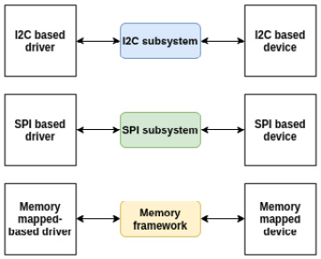
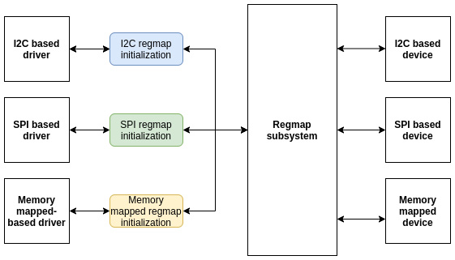

# *Chapter 12*: Abstracting Memory Access – Introduction to the Regmap API: a Register Map Abstraction

Before the Regmap API was developed, there was redundant code for the device drivers dealing with SPI, I2C, or memory-mapped devices. Many of these drivers contained some very similar code for accessing hardware device registers.

The following figure shows how SPI, I2C, and memory-mapped related APIs were used standalone before Regmap was introduced:

Figure 12.1 – I2C, SPI, and memory-mapped access before Regmap

The Regmap API was introduced in version v3.1 of the Linux kernel and proposes a solution that factors out and unifies these similar register access codes, saving code and making it much easier to share infrastructure. It is then just a matter of how to initialize and to configure a **regmap** structure, and process any read/write/modify operations fluently, whether it is SPI, I2C, or memory-mapped.

The following diagram depicts this API unification:

Figure 12.2 - I2C, SPI, and memory-mapped access after Regmap

The previous figure shows how Regmap unified transactions between devices and their respective bus frameworks. In this chapter, we will cover as much as possible of the whole aspect of the APIs this framework offers, from initialization to complex use cases.

This chapter will walk through the Regmap framework via the following topics:

- Introduction to the Regmap data structures
- Handling Regmap initialization
- Using Regmap register access functions
- Regmap-based SPI driver example – putting it all together
- Leveraging Regmap from the userspace

# Introduction to the Regmap data structures

The Regmap framework, which is enabled via the **CONFIG_REGMAP** kernel configuration option, is made of a few data structures, among which the most important are **struct regmap_config**, which represents the Regmap configuration, and **struct regmap**, which is the Regmap instance itself. That said, all of the Regmap data structures are defined in **include/linux/regmap.h**. It then goes without saying that this header must be included in all Regmap-based drivers:

\#include \<linux/regmap.h\>

Including the preceding header is sufficient to make the most out of the Regmap framework. With this header, a lot of data structures will be made available, among which, **struct regmap_config** is the most important, which we will describe in the next section.

## Understanding the struct regmap_config structure

**struct regmap_config** stores the configuration of the register map during the driver's lifetime. What you set there affects the memory read/write operations. This is the most important structure, which is defined as follows:

struct regmap_config {

    const char \*name;

    int reg_bits;

    int reg_stride;

    int pad_bits;

    int val_bits;

    bool (\*writeable_reg)(struct device \*dev,

                          unsigned int reg);

    bool (\*readable_reg)(struct device \*dev,

                         unsigned int reg);

    bool (\*volatile_reg)(struct device \*dev,

                         unsigned int reg);

    bool (\*precious_reg)(struct device \*dev,

                         unsigned int reg);

    bool disable_locking;

    regmap_lock lock;

    regmap_unlock unlock;

    void \*lock_arg;

    int (\*reg_read)(void \*context, unsigned int reg,

                    unsigned int \*val);

    int (\*reg_write)(void \*context, unsigned int reg,

                    unsigned int val);

    bool fast_io;

    unsigned int max_register;

    const struct regmap_access_table \*wr_table;

    const struct regmap_access_table \*rd_table;

    const struct regmap_access_table \*volatile_table;

    const struct regmap_access_table \*precious_table;

\[...\]

    const struct reg_default \*reg_defaults;

    unsigned int num_reg_defaults;

    enum regcache_type cache_type;

    const void \*reg_defaults_raw;

    unsigned int num_reg_defaults_raw;

    unsigned long read_flag_mask;

    unsigned long write_flag_mask;

    bool use_single_rw;

    bool can_multi_write;

    enum regmap_endian reg_format_endian;

    enum regmap_endian val_format_endian;

    const struct regmap_range_cfg \*ranges;

    unsigned int num_ranges;

}

Don't be afraid of how big this structure is. All the elements are self-explanatory. However, for more clarity, let's expand on their meanings here:

- **reg_bits** is a mandatory field, which is the number of valid bits in a register's address. This is the size in bits of register addresses.

- **reg_stride** represents a value that valid register addresses must be a multiple of. If set to **0**, a value of **1** will be used. If set to **4**, for example, an address will be considered valid only if this address is a multiple of **4**.

- **pad_bits** is the number of bits of padding between the register and value. This is the number of bits to (left) shift the register value when formatting.

- **val_bits** represents the number of bits used to store a register's value. It is a mandatory field.

- **writeable_reg** is an optional callback function. If provided, it is used by the Regmap subsystem when a register needs to be written. Before writing into a register, this function is automatically called to check whether the register can be written to or not. The following is an example of using such a function:

  static bool foo_writeable_register(struct device \*dev,

                                      unsigned int reg)

  {

      switch (reg) {

      case 0x30 ... 0x38:

      case 0x40 ... 0x45:

      case 0x50 ... 0x57:

      case 0x60 ... 0x6e:

      case 0x70 ... 0x75:

      case 0x80 ... 0x85:

      case 0x90 ... 0x95:

      case 0xa0 ... 0xa5:

      case 0xb0 ... 0xb2:

          return true;

      default:

          return false;

      }

  }

- **readable_reg** is the same as **writeable_reg** but for all register read operations.

- **volatile_reg** is an optional callback function called every time a register needs to be read or written through the Regmap cache. If the register is volatile, the function should return true. A direct read/write is then performed on the register. If false is returned, it means the register is cacheable. In this case, the cache will be used for a read operation, and the cache will be written in the case of a write operation:

  static bool foo_volatile_register(struct device \*dev,

                                      unsigned int reg)

  {

      switch (reg) {

      case 0x24 ... 0x29:

      case 0xb6 ... 0xb8:

          return true;

      default:

          return false;

      }

  }

- **precious_reg**: Some devices are sensitive to reads on some of their registers, especially for things such as clear on read interrupt status registers. With this set, this optional callback must return true if the specified register falls in this case, which will present the core (**debugfs**, for example) from internally generating any reads of it. This way, only explicit reads by the driver will be allowed.

- **disable_locking** tells whether the following lock/unlock callbacks should be used or not. If false, it means not to use any locking mechanisms. It means this **regmap** object is either protected by external means or is guaranteed not to be accessed from multiple threads.

- **lock**/**unlock** are optional lock/unlock callbacks, overriding default lock/unlock functions of **regmap**, based on spinlock or mutex, depending on whether accessing the underlying device may put the caller to sleep or not.

- **lock_arg** will be used as the only argument of lock/unlock functions (ignored if regular lock/unlock functions are not overridden).

- **reg_read**: Your device may not support simple I2C/SPI read operations. You'll then have no choice but to write your own customized read function. **reg_read** should then point to that function. That said, most devices do not need that.

- **reg_write** is the same as **reg_read** but for write operations.

- **fast_io** indicates that the register IO is fast. If set, the **regmap** will use a spinlock instead of a mutex to perform locking. This field is ignored if custom lock/unlock (not discussed here) functions are used (see the fields **lock**/**unlock** of **struct regmap_config** in the kernel sources). It should be used only for "nobus" cases (MMIO devices), since accessing I2C, SPI, or similar buses may put the caller to sleep.

- **max_register**: This optional element specifies the maximum valid register address above which no operation is permitted.

- **wr_table**: Instead of providing a **writeable_reg** callback, you could provide a **regmap_access_table** object, which is a structure holding a **yes_ranges** and a **no_range** field, both pointers to **struct regmap_range**. Any register that belongs to a **yes_range** entry is considered as writeable and is considered as not writeable if belonging to **no_range**.

- **rd_table** is the same as **wr_table**, but for any read operation.

- **volatile_table**: Instead of **volatile_reg**, you could provide **volatile_table**. The principle is then the same as **wr_table** or **rd_table**, but for caching mechanisms.

- **precious_table**: As above, for precious registers.

- **reg_defaults** is an array of elements of type **reg_default**, where each **reg_default** element is a **{reg, value}** structure that represents power-on reset values for a register. This is used with the cache so that a read of an address that exists in this array, and that has not been written since power-on reset, will return the default register value in this array without performing any read transactions on the device. An example of this is the IIO device driver, whose link is the following: <https://elixir.bootlin.com/linux/v5.10/source/drivers/iio/light/apds9960.c>.

- **num_reg_defaults** is the number of elements in **reg_defaults**.

- **cache_type**: The actual cache type, which can be either **REGCACHE_NONE**, **REGCACHE_RBTREE**, **REGCACHE_COMPRESSED**, or **REGCACHE_FLAT**.

- **read_flag_mask**: This is the mask to be applied in the top bytes of the register when doing a read. Normally, the highest bit in the top byte of a write or read operation in SPI or I2C is set to differentiate write and read operations.

- **write_flag_mask**: The mask to be set in the top bytes of the register when doing a write.

- **use_single_rw** is a Boolean that, if set, will instruct the register map to convert any bulk write or read operation on the device into a series of single write or read operations. This is useful for devices that do not support bulk read or write, or either.

- **can_multi_write** only targets write operations. If set, it indicates that this device supports the multi-write mode of bulk write operations. If clear, multi-write requests will be split into individual write operations.

You should look at **include/linux/regmap.h** for more details on each element. The following is an example of the initialization of **regmap_config**:

static const struct regmap_config regmap_config = {

    .reg_bits       = 8,

    .val_bits       = 8,

    .max_register   = LM3533_REG_MAX,

    .readable_reg   = lm3533_readable_register,

    .volatile_reg   = lm3533_volatile_register,

    .precious_reg   = lm3533_precious_register,

};

The preceding example shows how to build a basic register map configuration. Though only a few elements are set in the configuration data structure, enhanced configuration can be set up by learning about each element that we have described.

Now that we have learned about Regmap configuration, let's see how to use this configuration with the initialization API that corresponds to our needs.

# Handling Regmap initialization

As we said earlier, the Regmap API supports SPI, I2C, and memory-mapped register access. Their respective support can be enabled in the kernel thanks to the **CONFIG_REGMAP_SPI**, **CONFIG_REGMAP_I2C**, and **CONFIG_REGMAP_MMIO** kernel configuration options. It can go far beyond that and managing IRQs as well, but this is out of the scope of this book. Depending on the memory access method you need to support in the driver, you will have to call either **devm_regmap_init_i2c()**, **devm_regmap_init_spi()**, or **devm\_ regmap_init_mmio()** in the probe function. To write generic drivers, Regmap is the best choice you can make.

The Regmap API is generic and homogenous, and initialization only changes between bus types. Other functions are the same. It is a good practice to always initialize the register map in the probe function, and you must always fill the **regmap_config** elements prior to initializing the register map using one of the following APIs:

struct regmap \*devm_regmap_init_spi(struct spi_device \*spi,

                            const struct regmap_config);

struct regmap \*devm_regmap_init_i2c(struct i2c_client \*i2c,

                            const struct regmap_config);

struct regmap \* devm_regmap_init_mmio(

                        struct device \*dev,

                        void \_\_iomem \*regs,

                        const struct regmap_config \*config)

These are resource-managed APIs whose allocated resources are automatically freed when the device leaves the system or when the driver is unloaded. In the preceding prototypes, the return value will be a pointer to a valid **struct regmap** object or an **ERR_PTR()** error on failure. **regs** is a pointer to a memory-mapped IO region (returned by **devm_ioremap_resource()** or any **ioremap\*** family function). **dev** is the device (**struct device**) to interact with in the case of a memory-mapped **regmap**, and **spi** and **i2c** are respectively SPI or I2C devices to interact with in the case of SPI- or I2C-based **regmap**.

Calling one of these functions is sufficient to start interacting with the underlying device. Whether the Regmap is an I2C, SPI, or a memory-mapped register map, if it has not been initialized with a resource managed API variant, it must be freed with the **regmap_exit()** function:

void regmap_exit(struct regmap \*map)

This function simply releases a previously allocated register map.

Now that the register access method has been defined, we can jump to the device access functions, which allow reading from or writing into device registers.

# Using Regmap register access functions

Remap register access methods handle data parsing, formatting, and transmission. In most cases, device accesses are performed with **regmap_read()**, **regmap_write()**, and **regmap_update_bits()**, which are the three important APIs when it comes to writing/reading data into/from the device. Their respective prototypes are the following:

int regmap_read(struct regmap \*map, unsigned int reg,

                 unsigned int \*val);

int regmap_write(struct regmap \*map, unsigned int reg,

                 unsigned int val);

int regmap_update_bits(struct regmap \*map,

                 unsigned int reg, unsigned int mask,

                 unsigned int val);

**regmap_write()** writes data to the device. If set in **regmap_config**, **max_register** will be used to check whether the register address that needs to be accessed is greater or lower. If the register address passed is lower or equal to **max_register**, then the next operation will be performed; otherwise, the Regmap core will return an invalid I/O error (**-EIO**). Right after, the **writeable_reg** callback is called. The callback must return true before going to the next step. If it returns false, then **-EIO** is returned, and the write operation is stopped. If **wr_table** is set instead of **writeable_reg**, then the following happens:

- If the register address lies in **no_ranges**, then **-EIO** is returned.
- If the register address lies in **yes_ranges**, the next step is performed.
- If the register address is not present in **yes_range** or **no_range**, then **-EIO** is returned, and the operation is terminated.

If **cache_type != REGCACHE_NONE**, then caching is enabled. In this case, the cache entry is first updated with the new value, and then a write to the hardware is performed. Otherwise, no caching action is performed. If the **reg_write** callback is provided, it is used to perform the write operation. Otherwise, the generic Regmap's write function will be executed to write the data into the specified register address.

**regmap_read()** reads data from the device. It works exactly like **regmap_write()** with appropriate data structures (**readable_reg** and **rd_table**). Therefore, if provided, **reg_read** is used to perform the read operation; otherwise, the generic register map read function will be performed.

**regmap_update_bits()** is a three-in-one function. It performs a read/modify/write cycle on the specified register address. It is a wrapper on **\_regmap_update_bits**, which looks like the following:

static int \_regmap_update_bits(struct regmap \*map,

             unsigned int reg, unsigned int mask,

             unsigned int val, bool \*change,

             bool force_write)

{

    int ret;

    unsigned int tmp, orig;

    if (change)

        \*change = false;

    if (regmap_volatile(map, reg) &&

                   map-\>reg_update_bits) {

        ret = map-\>reg_update_bits(map-\>bus_context,

                                   reg, mask, val);

        if (ret == 0 && change)

            \*change = true;

    } else {

        ret = \_regmap_read(map, reg, &orig);

        if (ret != 0)

            return ret;

        tmp = orig & ~mask;

        tmp \|= val & mask;

        if (force_write \|\| (tmp != orig)) {

            ret = \_regmap_write(map, reg, tmp);

            if (ret == 0 && change)

                \*change = true;

        }

    }

    return ret;

}

This way, the bits you need to update must be set to **1** in **mask**, and corresponding bits should be set to the value you need to give to them in **val**.

As an example, to set the first and third bits to **1**, **mask** should be **0b00000101**, and the value should be **0bxxxxx1x1**. To clear the seventh bit, **mask** must be **0b01000000** and the value should be **0bx0xxxxxx**, and so on.

## Bulk and multiple registers reading/writing APIs

**regmap_multi_reg_write()** is one of the APIs that allows you to write multiple registers to the device. Its prototype looks like this:

int regmap_multi_reg_write(struct regmap \*map,

                    const struct reg_sequence \*regs,

                    int num_regs)

In this prototype, **regs** is an array of elements of type **reg_sequence**, which represents register/value pairs for sequences of writes with an optional delay in microseconds to be applied after each write. The following is the definition of this data structure:

struct reg_sequence {

    unsigned int reg;

    unsigned int def;

    unsigned int delay_us;

};

In the preceding data structure, **reg** is the register address, **def** is the register value, and **delay_us** is the delay to be applied after the register write in microseconds.

The following is a usage of such a sequence:

static const struct reg_sequence foo_default_regs\[\] = {

    { FOO_REG1,       0xB8 },

    { BAR_REG1,       0x00 },

    { FOO_BAR_REG1,   0x10 },

    { REG_INIT,       0x00 },

    { REG_POWER,      0x00 },

    { REG_BLABLA,     0x00 },

};

static int probe ( ...)

{

    \[...\]

    ret = regmap_multi_reg_write(my_regmap,

                          foo_default_regs,

                          ARRAY_SIZE(foo_default_regs));

    \[...\]

}

In the preceding, we have learned how to use our first multi-register write API, which takes a set of registers along with their values.

There are also **regmap_bulk_read()** and **regmap_bulk_write()**, which can be used to read/write multiple registers from/to the device. Their usage fits for large blocks of data and they are defined as follows:

int regmap_bulk_read(struct regmap \*map,

                     unsigned int reg, void \*val,

                     size_tval_count);

int regmap_bulk_write(struct regmap \*map,

                      unsigned int reg,

                      const void \*val, size_t val_count);

In the parameters in the preceding functions, **map** is the register map to operate on and **reg** is the register address from where the read/write operation must start. In the case of the read, **val** will contain the read value; it must be allocated to store at least the **count** value in the native register size for the device. In the case of the write operation, **val** must point to the data array to write to the device. Finally, **count** is the number of elements in **val**.

## Understanding the Regmap caching system

Obviously, Regmap supports data caching. Whether the cache system is used or not depends on the value of the **cache_type** field in **regmap_config**. Looking at **include/linux/regmap.h**, accepted values are as follows:

/\* An enum of all the supported cache types \*/

enum regcache_type {

   REGCACHE_NONE,

   REGCACHE_RBTREE,

   REGCACHE_COMPRESSED,

   REGCACHE_FLAT,

};

The cache type is set to **REGCACHE_NONE** by default, meaning that the cache is disabled. Other values simply define how the cache should be stored.

Your device may have a predefined power-on reset value in certain registers. Those values can be stored in an array so that any read operation returns the value contained in the array. However, any write operation affects the real register in the device and updates the content in the array. It is a kind of a cache that we can use to speed up access to the device. That array is **reg_defaults**. Looking at the source, its structure looks like this:

struct reg_default {

    unsigned int reg;

    unsigned int def;

};

In the preceding data structure, **reg** is the register address and **def** is the register default value. **reg_defaults** is ignored if **cache_type** is set to none. If the **default_reg** element is not set but you still enable the cache, the corresponding cache structure will be created for you.

It is quite simple to use. Just declare it and pass it as a parameter to the **regmap_config** structure. Let's have a look at the LTC3589 regulator driver in **drivers/regulator/ltc3589.c**:

static const struct reg_default ltc3589_reg_defaults\[\] = {

{ LTC3589_SCR1,   0x00 },

{ LTC3589_OVEN,   0x00 },

{ LTC3589_SCR2,   0x00 },

{ LTC3589_VCCR,   0x00 },

{ LTC3589_B1DTV1, 0x19 },

{ LTC3589_B1DTV2, 0x19 },

{ LTC3589_VRRCR,  0xff },

{ LTC3589_B2DTV1, 0x19 },

{ LTC3589_B2DTV2, 0x19 },

{ LTC3589_B3DTV1, 0x19 },

{ LTC3589_B3DTV2, 0x19 },

{ LTC3589_L2DTV1, 0x19 },

{ LTC3589_L2DTV2, 0x19 },

};

static const struct regmap_config ltc3589_regmap_config = {

        .reg_bits = 8,

        .val_bits = 8,

        .writeable_reg = ltc3589_writeable_reg,

        .readable_reg = ltc3589_readable_reg,

        .volatile_reg = ltc3589_volatile_reg,

        .max_register = LTC3589_L2DTV2,

        .reg_defaults = ltc3589_reg_defaults,

        .num_reg_defaults = ARRAY_SIZE(ltc3589_reg_defaults),

        .use_single_rw = true,

        .cache_type = REGCACHE_RBTREE,

};

Any read operation on any one of the registers present in the array will immediately return the value in the array. However, a write operation will be performed on the device itself and will update the affected register in the array. This way, reading the **LTC3589_VRRCR** register will return **0xff** and write any value in that register, and it will update its entry in the array so that any new read operation will return the last written value directly from the cache.

Now that we are able to use the Regmap APIs to access the device registers whatever the underlying bus is these devices sit on, the time has come for us to summarize the knowledge we have learned so far in a practical example.

# Regmap-based SPI driver example – putting it all together

All the steps involved in setting up Regmap, from configuration to device register access, can be enumerated as follows:

- Setting up a **struct regmap_config** object according to the device characteristics. Defining the register range if needed, default values if any, **cache_type** if needed, and so on. If custom read/write functions are needed, pass them to the **reg_read**/**reg_write** fields.
- In the **probe** function, allocating a register map using **devm_regmap_init_i2c()**, **devm_regmap_init_spi()**, or **devm_regmap_init_mmio()** depending on the connection with the underlying device – I2C, SPI, or memory-mapped.
- Whenever you need to read/write from/into registers, calling **remap\_\[read\|write\]** functions.
- When done with the register map, assuming you used resource-managed APIs, you have nothing else to do as devres core will take care of releasing the Regmap resources; otherwise, you'll have to call **regmap_exit()** to free the register map allocated in the probe.

Let's now materialize these steps in a real driver example that takes advantage of the Regmap framework.

## A Regmap example

To achieve our goal, let's first describe a fake SPI device for which we can write a driver using the Regmap framework. For understandability, let's use the following characteristics:

- The device supports 8-bit register addressing and 8-bit register values.
- The maximum address that can be accessed in this device is **0x80** (it does not necessarily mean that this device has **0x80** registers).
- The write mask is **0x80**, and the valid address ranges are as follows:
  - **0x20** to **0x4F**
  - **0x60** to **0x7F**
- Since the device supports simple SPI read/write operations, there is no need to provide a custom read/write function.

Now that we are done with the device and the Regmap specifications, we can start writing the code.

The following includes the required header to deal with Regmap:

\#include \<linux/regmap.h\>

Depending on the APIs needed in the driver, other headers might be included.

Then, we define our private data structure as follows:

struct private_struct

{

    /\* Feel free to add whatever you want here \*/

    struct regmap \*map;

    int foo;

};

Then, we define a read/write register range, that is, registers that are allowed to be accessed:

static const struct regmap_range wr_rd_range\[\] =

{

    {

            .range_min = 0x20,

            .range_max = 0x4F,

    },{

            .range_min = 0x60,

            .range_max = 0x7F

    },

};

struct regmap_access_table drv_wr_table =

{

    .yes_ranges =   wr_rd_range,

    .n_yes_ranges = ARRAY_SIZE(wr_rd_range),

};

struct regmap_access_table drv_rd_table =

{

    .yes_ranges =   wr_rd_range,

    .n_yes_ranges = ARRAY_SIZE(wr_rd_range),

};

However, it must be noted that if **writeable_reg** and/or **readable_reg** are set, there is no need to provide **wr_table** and/or **rd_table**.

After that, we define the callback that will be called any time a register is accessed for a write or a read operation. Each callback must return true if it is allowed to perform the specified operation on the register:

static bool writeable_reg(struct device \*dev,

                          unsigned int reg)

{

    if (reg\>= 0x20 &&reg\<= 0x4F)

        return true;

    if (reg\>= 0x60 &&reg\<= 0x7F)

        return true;

    return false;

}

static bool readable_reg(struct device \*dev,

                         unsigned int reg)

{

    if (reg\>= 0x20 &&reg\<= 0x4F)

        return true;

    if (reg\>= 0x60 &&reg\<= 0x7F)

        return true;

    return false;

}

Now that all Regmap-related operations have been defined, we can implement the driver's **probe** method as follows:

static int my_spi_drv_probe(struct spi_device \*dev)

{

    struct regmap_config config;

    struct private_struct \*priv;

    unsigned char data;

    /\* setup the regmap configuration \*/

    memset(&config, 0, sizeof(config));

    config.reg_bits = 8;

    config.val_bits = 8;

    config.write_flag_mask = 0x80;

    config.max_register = 0x80;

    config.fast_io = true;

    config.writeable_reg = drv_writeable_reg;

    config.readable_reg = drv_readable_reg;

    /\*

     \* If writeable_reg and readable_reg are set,

     \* there is no need to provide wr_table nor rd_table.

     \* Uncomment below code only if you do not want to use

     \* writeable_reg nor readable_reg.

     \*/

    //config.wr_table = drv_wr_table;

    //config.rd_table = drv_rd_table;

    /\* allocate the private data structures \*/

    /\* priv = kzalloc \*/

    /\* Init the regmap spi configuration \*/

    priv-\>map = devm_regmap_init_spi(dev, &config);

    /\* Use devm_regmap_init_i2c in case of i2c bus \*/

    /\*

     \* Let us write into some register

     \* Keep in mind that, below operation will remain same

     \* whether you use SPI, I2C, or memory mapped Regmap.

     \* It is and advantage when you use regmap.

     \*/

    regmap_read(priv-\>map, 0x30, &data);

    \[...\] /\* Process data \*/

    data = 0x24;

    regmap_write(priv-\>map, 0x23, data); /\* write new value \*/

    /\* set bit 2 (starting from 0) and bit 6

     \* of register 0x44 \*/

    regmap_update_bits(priv-\>map, 0x44,

                       0b00100010, 0xFF);

    \[...\] /\* Lot of stuff \*/     

    return 0;

}

In the preceding **probe** method, there are even more commands than code. We simply needed to demonstrate how the device specification could be translated into a register map configuration and used as main access functions to the device registers.

Now that we are done with Regmap from within the kernel, let's see how user space can make the most out of this framework in the next section.

# Leveraging Regmap from the user space

Register maps can be monitored from the user space via the debugfs file system. First, debugfs needs to be enabled via the **CONFIG_DEBUG_FS** kernel configuration option. Then, debugfs can be mounted using the following command:

mount -t debugfs none /sys/kernel/debug

After that, the debugfs register map implementation can be found under **/sys/kernel/debug/regmap/**. This debugfs view implemented by **drivers/base/regmap/regmap-debugfs.c** in kernel sources contains a register cache (mirror) for drivers/peripherals based on the Regmap API.

From the Regmap main debugfs directory, we can get the list of devices whose drivers are based on the Regmap API using the following command:

root@jetson-nano-devkit:~# ls -l /sys/kernel/debug/regmap/

drwxr-xr-x   2 root  root   0 Jan  1  1970 4-003c-power-slave

drwxr-xr-x   2 root  root   0 Jan  1  1970 4-0068

drwxr-xr-x   2 root  root   0 Jan  1  1970 700e3000.mipical

drwxr-xr-x   2 root  root   0 Jan  1  1970 702d3000.amx

drwxr-xr-x   2 root  root   0 Jan  1  1970 702d3100.amx

drwxr-xr-x   2 root  root   0 Jan  1  1970 hdaudioC0D3-hdaudio

drwxr-xr-x   2 root  root   0 Jan  1  1970 tegra210-admaif

drwxr-xr-x   2 root  root   0 Jan  1  1970 tegra210-adx.0

\[...\]

root@jetson-nano-devkit:~#

In each directory, there can be one or more of the following files:

- **access**: An encoding of the various access permissions to each register in respect of the pattern **readable writable volatile precious**:

  **root@jetson-nano-devkit:~# cat /sys/kernel/debug/regmap/4-003c-power-slave/access**

  **00: y y y n**

  **01: y y y n**

  **02: y y y n**

  **03: y y y n**

  **04: y y y n**

  **05: y y y n**

  **06: y y y n**

  **07: y y y n**

  **08: y y y n**

  **\[...\]**

  **5c: y y y n**

  **5d: y y y n**

  **5e: y y y n**

For example, the line **5e: y y y n** means that the register at address **5e** is readable, writeable, volatile, but not precious.

- **name**: The driver name associated with the register map. Check for the corresponding driver. For example, the **702d3000.amx** register map entry:

  **root@jetson-nano-devkit:~# cat /sys/kernel/debug/regmap/702d3000.amx/name**

  **tegra210-amx**

There are, however, Regmap entries starting with **dummy-** as follows:

**root@raspberrypi4-64:~# ls -l /sys/kernel/debug/regmap/**

**drwxr-xr-x  2 root root 0 Jan 1 1970 dummy-avs-monitor@fd5d2000**

**root@raspberrypi4-64:~#**

This kind of entry is set when there are no associated **/dev** entries (**devtmpfs**). You can check this by printing the underlying device name, which will be **nodev** as follows:

**root@raspberrypi4-64:~# cat /sys/kernel/debug/regmap/dummy-avs-monitor\\fd5d2000/name**

**nodev**

**root@raspberrypi4-64:~#**

You can look for the suffix name after **dummy-** to find the relevant node in the device tree, for example, **dummy-avs-monitor@fd5d2000**:

avs_monitor: avs-monitor@7d5d2000 {

    compatible = "brcm,bcm2711-avs-monitor",

                 "syscon", "simple-mfd";

    reg = \<0x7d5d2000 0xf00\>;

\[...\]

};

- **cache_bypass**: Puts the register map into cache-only mode. If enabled, writes to the register map will only update the hardware and not the cache directly:

  **root@jetson-nano-devkit:~# cat /sys/kernel/debug/regmap/702d3000.amx/cache_bypass**

  **N**

To enable cache bypassing, you should echo **Y** in this file as follows:

**root@jetson-nano-devkit:~# echo Y \> /sys/kernel/debug/regmap/702d30\[579449.571475\] tegra210-amx tegra210-amx.0: debugfs cache_bypass=Y forced**

**00.amx/cache_bypass**

**root@jetson-nano-devkit:~#**

This will additionally print a message in the kernel log buffer.

- **cache_dirty**: Indicates that HW registers were reset to default values and that hardware registers do not match the cache state. The read value can be either **Y** or **N**.

- **cache_only**: Echoing **N** in this file will disable caching for this register map and in the meantime, will trigger cache syncing, while writing **Y** will force registers in this register map to be cached only. Reading this file value will return **Y** or **N** according to the current caching enabled state. Any write happening while this value is true will be cached (only the register cache will be updated, no hardware changes will occur).

- **range**: The valid register ranges of the register map:

  **root@jetson-nano-devkit:~# cat /sys/kernel/debug/regmap/4-003c-power-slave/range**

  **0-5e**

- **rbtree**: Provides how much memory overhead the **rbtree** cache adds:

  **root@jetson-nano-devkit:~# cat /sys/kernel/debug/regmap/4-003c-power-slave/rbtree**

  **0-5e (95)**

  **1 nodes, 95 registers, average 95 registers, used 175 bytes**

- **registers**: The file used to read and write the actual registers associated with the register map:

  **root@jetson-nano-devkit:~# cat /sys/kernel/debug/regmap/4-003c-power-slave/registers**

  **00: d2**

  **01: 1f**

  **02: 00**

  **03: dc**

  **04: 0f**

  **05: 00**

  **06: 00**

  **07: 00**

  **08: 02**

  **\[...\]**

  **5c: 35**

  **5d: 81**

  **5e: 00**

  **\#**

In the preceding output, the register address is shown first, then its content after.

This section is quite short but is a concise description of Regmap monitoring from the user space. It allows reading and writing register content, and in some circumstances, changing the behavior of the underlying Regmap.

# Summary

This chapter is all about register access related Regmap APIs. Its simplicity should give you an idea of how useful and widely used it is. This chapter has shown everything you need to know about the Regmap API. Now you should be able to convert any standard SPI/I2C/memory-mapped driver into Regmap.

The next chapter will cover IRQ management under Linux, however, two chapters after, we will cover IIO devices, a framework for analog-to-digital converters. Those kinds of devices always sit on top of SPI/I2C buses. It could be a challenge for us, at the end of that chapter, to write an IIO driver using the Regmap API.