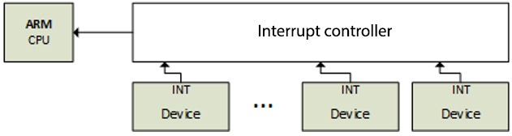
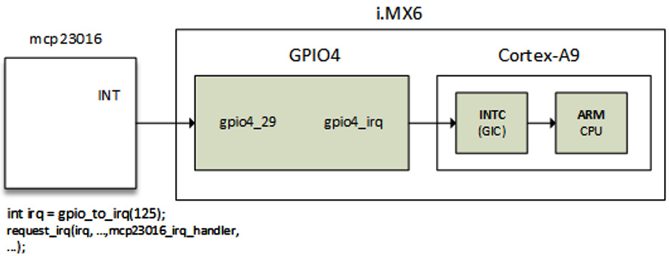

# *Chapter 13*: Demystifying the Kernel IRQ Framework

Linux is a system on which devices notify the kernel about events by means of **interrupt requests** (**IRQs**), though some devices are polled. The CPU exposes IRQ lines, shared or not, used by connected devices so that when a device needs the CPU, it sends a request to the CPU. When the CPU gets this request, it stops its actual job and saves its context, in order to serve the request issued by the device. After serving the device, its state is restored back to exactly where it stopped when the interruption occurred.

In this chapter, we will deal with the APIs that the kernel offers to manage IRQs and the ways in which multiplexing can be done. Moreover, we will analyze and look closer at **interrupt controller** driver writing.

To summarize, in this chapter, the following topics will be covered:

- Brief presentation of interrupts
- Understanding interrupt controllers and interrupt multiplexing
- Diving into advanced peripheral IRQ management
- Demystifying per-CPU interrupts

# Brief presentation of interrupts

On many platforms, a special device is responsible for managing IRQ lines. That device is the interrupt controller and it stands between the CPU and the interrupt lines it manages. The following is a diagram that shows the interactions that take place:

Figure 13.1 – Interrupt controller and IRQ lines

Not only can devices raise interrupts, but some processor operations can do that too. There are then two different kinds of interrupts:

- Synchronous interrupts, called **exceptions**, are produced by the CPU while processing instructions. These are **non-maskable interrupts** (**NMIs**) and result from a critical malfunction such as hardware failure. They are always processed by the CPU.
- Asynchronous interrupts, called **interrupts**, are issued by other hardware devices. These are normal and **maskable interrupts**. These are what we will discuss in the next sections of this chapter.

Before getting deeper into interrupt management in the Linux kernel, let's talk a bit more about exceptions.

Exceptions are consequences of programming errors, handled by the kernel, which sends a signal to the program and tries to recover from the error. These are classified into two categories, enumerated as follows:

- **Processor-detected exceptions**: Those the CPU generates in response to an anomalous condition, which are divided into three groups:
  - Faults, which can generally be corrected (bogus instruction).
  - Traps, which occur in the user process (invalid memory access, division by zero), are also a mechanism to switch to kernel mode in response to a system call. If the kernel code does cause a trap, it immediately panics.
  - Aborts – the serious errors.
- **Programmed exceptions**: These are requested by the programmer and handled like traps.

Now that we have introduced the different families of interrupts, let's learn how they are implemented from within the interrupt controller.

# Understanding interrupt controllers and interrupt multiplexing

Having a single interrupt from the CPU is usually not enough. Most systems have tens or hundreds of them. Now comes interrupt controller, which allows them to be multiplexed. Very often, architecture or platform-specific implementations offer specific facilities, such as the following:

- Masking/unmasking individual interrupts
- Setting priorities
- SMP affinity
- Exotic features, such as wake-up interrupts

IRQ management and interrupt controller drivers both rely on the concept of the IRQ domain, which is built on top of the following structures:

- **struct irq_chip**: This is the interrupt controller data structure. This structure also implements a set of methods that allow to drive the interrupt controller and that are directly called by core IRQ code.
- **struct irqdomain**: This provides the following options:
  - A pointer to the interrupt controller's firmware node (**fwnode**)
  - A function for converting an IRQ's firmware description into an ID local to this interrupt controller (**hwirq**, also called hardware IRQ number)
  - A way to retrieve the Linux view (**virq**, also called virtual IRQ number) of an IRQ from **hwirq**
- **struct irq_desc**: This structure is Linux's view of an interrupt. It contains all the information about the interrupt as well as one-to-one mapping to the Linux interrupt number.
- **struct irq_action**: This structure is used to describe an IRQ handler.
- **struct irq_data**: This structure is embedded in the **struct irq_desc** structure and provides us with the following information:
  - The data that is relevant to the IRQ chip managing this interrupt.
  - Both **virq** and **hwirq**.
  - A pointer to **struct irq_chip** (the IRQ chip data structure). Note that most IRQ chip-related function calls are given **irq_data** as a parameter, from which you can obtain the corresponding **struct irq_desc**.

All the preceding data structures are part of the IRQ domain API. An interrupt controller is represented in the kernel by an instance of the **struct irq_chip** structure, which describes the actual hardware device, and some methods used by the IRQ core. The following code block shows its definition:

struct irq_chip {

    struct device    \*parent_device;

    const char       \*name;

    void   (\*irq_enable)(struct irq_data \*data);

    void   (\*irq_disable)(struct irq_data \*data);

    void   (\*irq_ack)(struct irq_data \*data);

    void   (\*irq_mask)(struct irq_data \*data);

    void   (\*irq_unmask)(struct irq_data \*data);

    void   (\*irq_eoi)(struct irq_data \*data);

    int    (\*irq_set_affinity)(struct irq_data \*data,

                const struct cpumask \*dest, bool force);

    int    (\*irq_retrigger)(struct irq_data \*data);

    int    (\*irq_set_type)(struct irq_data \*data,

                           unsigned int flow_type);

    int    (\*irq_set_wake)(struct irq_data \*data,

                           unsigned int on);

    void   (\*irq_bus_lock)(struct irq_data \*data);

    void   (\*irq_bus_sync_unlock)(struct irq_data \*data);

    int   (\*irq_get_irqchip_state)(struct irq_data \*data,

               enum irqchip_irq_state which, bool \*state);

    int   (\*irq_set_irqchip_state)(struct irq_data \*data,

               enum irqchip_irq_state which, bool state);

    void  (\*ipi_send_single)(struct irq_data \*data,

                              unsigned int cpu);

   void   (\*ipi_send_mask)(struct irq_data \*data,

                           const struct cpumask \*dest);

    unsigned long    flags;

};

The following list explains the meanings of the elements in the structure:

- **parent_device**: This is a pointer to the parent of this IRQ chip.
- **name**: This is the name for the**/proc/interrupts** file.
- **irq_enable**: This hook enables the interrupt. If not set (if **NULL**), it defaults to **chip-\>unmask**.
- **irq_disable**: This disables the interrupt.
- **irq_ack**: This callback acknowledges an interrupt. It is unconditionally invoked by **handle_edge_irq()** and, therefore, must be defined (even an empty shell) for IRQ controller drivers that use **handle_edge_irq()** to handle interrupts. For such controllers, this callback is invoked at the start of the interrupt. Some controllers do not need this. Linux calls this function as soon as an interrupt is raised, long before it is serviced. This function is mapped to **chip-\>disable()** in some implementations so that if another interrupt request pokes on the line, it will not cause another interrupt until after the current interrupt request has been handled.
- **irq_mask**: This is the hook that masks an interrupt source in the hardware so that it cannot be raised anymore.
- **irq_unmask**: This hook unmasks an interrupt source.
- **irq_eoi**: Linux invokes this **end of interrupt** (**EOI)** hook right after an IRQ servicing completes. We use this function to reconfigure the controller as necessary in order to receive another interrupt request on that line. Some implementations map this function to **chip-\>enable()** to reverse operations done in **chip-\>ack()**.
- **irq_set_affinity**: This sets the CPU affinity only on SMP machines. In such machines, this function is used to specify the CPU on which the interrupt will be handled. This function is unused in single-processor environments, as interrupts are always services on the same single CPU.
- **irq_retrigger**: This retriggers the interrupt in the hardware, which resends an IRQ to the CPU.
- **irq_set_type**: This sets the flow type, such as **IRQ_TYPE_LEVEL**, of an IRQ.
- **irq_set_wake**: This enables/disables the power management wake-on of an IRQ.
- **irq_bus_lock**: This function locks access to slow bus (I2C) chips. Locking a mutex here is sufficient.
- **irq_bus_sync_unlock**: This function syncs and unlocks slow bus (I2C) chips, and unlocks the mutex previously locked.
- **irq_get_irqchip_state** and **irq_set_irqchip_state**: These return or set the internal state of an interrupt, respectively.
- **ipi_send_single** and **ipi_send_mask**: These are used, respectively, to send **inter-processor interrupts** (**IPIs**) either to a single CPU or to a set of CPUs defined by a mask. IPIs are used on SMP systems to generate a CPU remote interrupt from the local CPU. We will discuss this later in the chapter, in the *Demystifying per-CPU interrupts* section.

Each interrupt controller is given a domain, which is to the controller what an address space is to a process (see *Chapter 10*, *Understanding the Linux Kernel Memory Allocation*). The interrupt controller domain is described in the kernel with a **struct irq_domain** structure. It manages mappings between hardware IRQ numbers and Linux IRQ numbers (that is, virtual IRQs). It is the hardware interrupt number translation object. The following code block shows its definition:

struct irq_domain {

    const char \*name;

    const struct irq_domain_ops \*ops;

    void \*host_data;

    unsigned int flags;

    unsigned int mapcount;

    /\* Optional data \*/

    struct fwnode_handle \*fwnode;

    \[...\]

};

For the sake of readability, only elements that are relevant to us have been listed. The following list tells us their meanings:

- **name**: This is the name of the interrupt domain.
- **ops**: This is a pointer to the IRQ domain methods.
- **host_data**: This is a private data pointer for use by the owner. Not touched by the IRQ domain core code.
- **flags**: This hosts per-IRQ domain flags.
- **mapcount**: This is the number of mapped interrupts in this IRQ domain.
- Like all the remaining elements, **fwnode** is optional. It is a pointer to the **device tree** (**DT**) node associated with the IRQ domain. Used when decoding DT interrupt specifiers.

An interrupt controller driver creates and registers an IRQ domain by calling one of the **irq_domain_add\_\<mapping_method\>()** functions, where **\<mapping_method\>** is the method by which **hwirq** should be mapped to Linux **virq**. These functions are described in the following list:

- **irq_domain_add_linear()**: This uses a fixed-size table indexed by the **hwirq** number. When an **hwirq** number is mapped, an **irq_desc** object is allocated for this **hwirq** and the IRQ number is stored in the table. This linear mapping is suitable for controllers or domains that have a fixed and small number of **hwirq** (~ \< 256). The inconvenience of this mapping is the table size, being as large as the largest possible **hwirq** number. Therefore, the IRQ number lookup time is fixed, and IRQ descriptors are allocated for in-use IRQs only. Most drivers should use linear mapping. This function has the following prototype:

  struct irq_domain \*irq_domain_add_linear(

                     struct device_node \*of_node,

                     unsigned int size,

                     const struct irq_domain_ops \*ops,

                     void \*host_data)

- **irq_domain_add_tree()**: With this mapping, the IRQ domain maintains the mapping between **virqs** (Linux IRQ numbers) and **hwirsq** (Hardware interrupt numbers) in a radix tree. An **irq_desc** object is allocated when an **hwirq** is mapped, and this hardware IRQ number is used as the radix tree's lookup key. If the **hwirq** number can be very large, then the treemap is a viable solution because it does not require allocating a table as large as the largest **hwirq** number. The drawback is that the **hwirq**-to-IRQ-number lookup is affected by the number of entries in the table. Very few drivers should need this mapping. There are fewer than 10 users of this API in the kernel. It has the prototype shown in the following code block:

  struct irq_domain \*irq_domain_add_tree(

                    struct device_node \*of_node,

                    const struct irq_domain_ops \*ops,

                    void \*host_data)

- **irq_domain_add_nomap()**: You will probably never use this method. Nonetheless, its entire description is available in **Documentation/IRQ-domain.txt**, in the kernel source tree. Its prototype is shown in the following code block:

  struct irq_domain \*irq_domain_add_nomap(

                     struct device_node \*of_node,

                     unsigned int max_irq,

                     const struct irq_domain_ops \*ops,

                     void \*host_data)

In these functions, **of_node** is a pointer to the interrupt controller's DT node. **size** corresponds to the number of interrupts in the domain. **ops** represent map/unmap domain callbacks, and **host_data** is the controller's private data pointer.

When it is initially created, the IRQ domain is empty (no mapping). A mapping is created and added as and when the IRQ chip driver calls **irq_create_mapping()**, which has the following prototype:

unsigned int irq_create_mapping(struct irq_domain

              \*domain, irq_hw_number_t hwirq)

In the preceding function, **domain** is the domain to which this hardware interrupt belongs, or **NULL** for the default domain; **hwirq** represents the hardware interrupt number in that domain space.

If a mapping for the **hwirq** number doesn't already exist in the IRQ domain, the function will allocate a new Linux IRQ descriptor (**struct irq_desc**) structure, returning a virtual interrupt number at the same time. Then, it will associate it with the **hwirq** number (by means of the **irq_domain_associate()** function, which in turn invokes the **irq_domain_ops.map** callback so that the driver can perform any required hardware setup). To understand this paragraph, we need to describe the IRQ domain operation data structure (**struct irq_domain_ops**), which is defined in the following code block:

struct irq_domain_ops {

    int (\*map)(struct irq_domain \*d, unsigned int virq,

          irq_hw_number_t hw);

    void (\*unmap)(struct irq_domain \*d,

                   unsigned int virq);

    int (\*xlate)(struct irq_domain \*d,

                   struct device_node \*node,

                   const u32 \*intspec,

                   unsigned int intsize,

                   unsigned long \*out_hwirq,

                   unsigned int \*out_type);

\[...\]

};

Elements in the data structure have been limited to the scope of this chapter. Nonetheless, the complete data structure can be found in **include/linux/irqdomain.h** in the kernel source. The following list tells us the meanings of the elements we have enumerated:

- **map**: This creates or updates mapping between a **virq** number and an **hwirq** number. This callback is invoked only once for a given mapping. It generally maps the **virq** number with a given handler using **irq_set_chip_and_handler()**, so that calling either **generic_handle_irq()** or **handle_nested_irq()** will trigger this handler. The function **irq_set_chip_and_handler()** is defined as in the following code block:

  void irq_set_chip_and_handler(unsigned int irq,

                            struct irq_chip \*chip,

                            irq_flow_handler_t handle)

In this function, **irq** is the Linux IRQ given as a parameter to the **map()** function, and **chip** is your IRQ chip. There are, however, dummy controllers that need almost nothing in their **irq_chip** structure. In this case, the driver passes **dummy_irq_chip**, defined in **kernel/irq/dummychip.c**, which is a kernel-predefined **irq_chip** structure defined for such controllers. **handle** determines the interrupt flow handler, the one that calls the real handler registered using **request_irq()**. Its value depends on the IRQ being edge- or level-triggered. In either case, **handle** should be set to **handle_edge_irq** or **handle_level_irq**. Both are kernel helper functions that do some operations before and after calling the real IRQ handler. An example is shown in this code block:

static int ativic32_irq_domain_map(

                struct irq_domain \*id,

                unsigned int virq,

                irq_hw_number_t hw)

{

\[...\]

    if (int_trigger_type & (BIT(hw))) {

        irq_set_chip_and_handler(virq,

                     &ativic32_chip,

                     handle_edge_irq);

        type = IRQ_TYPE_EDGE_RISING;

    } else {

        irq_set_chip_and_handler(virq,

                     &ativic32_chip,

                     handle_level_irq);

        type = IRQ_TYPE_LEVEL_HIGH;

    }

    irqd_set_trigger_type(irq_data, type);

    return 0;

}

- **xlate**: Given a DT node with an interrupt specifier, this hook decodes the hardware interrupt number in that specifier along with its Linux interrupt type value. Depending on the **\#interrupt-cells** value specified in the DT controller node, the kernel provides generic translation functions:
  - **irq_domain_xlate_twocell()**: Generic translation function to be used for direct two-cell binding. It works with a device tree IRQ specifier with two-cell bindings where the cell values map directly to the **hwirq** number and Linux IRQ flags.
  - **irq_domain_xlate_onecell()**: Generic **xlate** for direct one-cell bindings.
  - **Irq_domain_xlate_onetwocell()**: Generic **xlate** for one- or two-cell bindings.

An example of domain operation is given in the following code block:

static struct irq_domain_ops mcp23016_irq_domain_ops = {

    .map    = mcp23016_irq_domain_map,

    .xlate  = irq_domain_xlate_twocell,

};

When an interrupt is received, the **irq_find_mapping()** function is used to find the Linux IRQ number from the **hwirq** number. Of course, the mapping must exist prior to being returned. A Linux IRQ number is always tied to a **struct irq_desc** structure, which is the structure by which Linux describes an IRQ and has the following definition:

struct irq_desc {

    struct irq_data        irq_data;

    unsigned int \_\_percpu  \*kstat_irqs;

    irq_flow_handler_t     handle_irq;

    struct irqaction       \*action;

    unsigned int           irqs_unhandled;

    raw_spinlock_t         lock;

    struct cpumask         \*percpu_enabled;

    atomic_t               threads_active;

    wait_queue_head_t      wait_for_threads;

\#ifdef CONFIG_PM_SLEEP

    unsigned int           nr_actions;

    unsigned int           no_suspend_depth;

    unsigned int           force_resume_depth;

\#endif

\#ifdef CONFIG_PROC_FS

    struct proc_dir_entry   \*dir;

\#endif

    Int               parent_irq;

    struct module     \*owner;

    const char        \*name;

};

Some fields in this data structure are intentionally missing. For the remainder, the following list gives us their definitions:

- **kstat_irqs**: This is the per-CPU IRQ statistics since boot.
- **handle_irq**: This is the high-level IRQ events handler.
- **action**: This represents the list of the IRQ actions for this descriptor.
- **irqs_unhandled**: This is the stats field for spurious unhandled interrupts.
- **lock**: This represents locking for SMP.
- **threads_active**: This is the number of IRQ action threads currently running for this descriptor.
- **wait_for_threads**: This represents the wait queue for **sync_irq** to wait for threaded handlers.
- **nr_actions**: This is the number of installed actions on this descriptor.
- **no_suspend_depth** and **force_resume_depth**: This represents the number of **irqaction** instances on an IRQ descriptor that have **IRQF_NO_SUSPEND** or **IRQF_FORCE_RESUME** flags set.
- **dir**: This represents the **/proc/irq/** procfs entry.
- **name**: This names the flow handler, visible in the **/proc/interrupts** output.

When registering an interrupt handler, this handler is added to the end of the **irq_desc.action** list associated with that interrupt line. For instance, each call to **request_irq()** (or the threaded version, **request_threaded_irq()**) creates and adds one **struct irqaction** structure to the end of the **irq_desc.action** list (knowing that **irq_desc** is the descriptor for this interrupt). For a shared interrupt, this field will contain as many **irqaction** objects as there are handlers registered. An IRQ action data structure has the following definition:

struct irqaction {

    irq_handler_t     handler;

    void              \*dev_id;

    void \_\_percpu     \*percpu_dev_id;

    struct irqaction  \*next;

    irq_handler_t     thread_fn;

    struct task_struct     \*thread;

    unsigned int      irq;

    unsigned int      flags;

    unsigned long     thread_flags;

    unsigned long     thread_mask;

    const char        \*name;

    struct proc_dir_entry   \*dir;

};

The meanings of each element in this data structure are as follows:

- **handler**: This is the non-threaded (hard) interrupt handler function.
- **name**: This is the device name.
- **dev_id**: This is a cookie to identify the device.
- **percpu_dev_id**: This is a per-CPU cookie to identify the device.
- **next**: This is a pointer to the next IRQ action for shared interrupts.
- **irq**: This is the Linux interrupt number (**virq**).
- **flags**: This represents the IRQ flags (see **IRQF\_\***).
- **thread_fn**: This is the threaded interrupt handler function for threaded interrupts.
- **thread**: This is a pointer to the thread structure in case of threaded interrupts.
- **thread_flags**: This represents the flags related to the thread.
- **thread_mask**: This is a bitmask for keeping track of thread activity.
- **dir**: This points to the **/proc/irq/NN/\<name\>/** entry.

The following is the definition of important fields in the **struct irq_data** structure, which is per-IRQ chip data passed down to chip functions:

struct irq_data {

    \[...\]

    unsigned int     irq;

    unsigned long           hwirq;

    struct irq_chip         \*chip;

    struct irq_domain \*domain;

    void              \*chip_data;

};

The following list gives the meanings of elements in this data structure:

- **irq**: This is the interrupt number (Linux IRQ number).
- **hwirq**: This is the hardware interrupt number, local to the **irq_data.domain** interrupt domain.
- **chip**: This represents the low-level interrupt controller hardware access.
- **domain**: This represents the interrupt translation domain, responsible for mapping between the **hwirq** number and the Linux IRQ number.
- **chip_data**: This is platform-specific, per-chip private data for the chip methods, to allow shared chip implementations.

Now that we are familiar with the data structures of the IRQ framework, we can go a bit further and study how interrupts are requested and propagated all along the processing chain.

# Diving into advanced peripheral IRQ management

In *Chapter 3*, *Dealing with Kernel Core Helpers*, we introduced peripheral IRQs, using **request_irq()** and **request_threaded_irq()**. With the former, you register a handler (top half) that will be executed in an atomic context, from which you can schedule a bottom half using one of the mechanisms discussed in that same chapter. On the other hand, with the **\_threaded** variant, you can provide top and bottom halves to the function, so that the former will be run as the hard IRQ handler, which may decide to raise the second and threaded handler or not, which will be run in a kernel thread.

The problem with those approaches is that sometimes, drivers requesting an IRQ do not know about the nature of the interrupt controller that provides this IRQ line, especially when the interrupt controller is a discrete chip (typically a GPIO expander connected over SPI or I2C buses). Now comes the **request_any_context_irq()**function with which drivers requesting an IRQ know whether the handler will run in a thread context, and call **request_threaded_irq()** or **request_irq()** accordingly. This means that whether the IRQ associated with our device comes from an interrupt controller that may not sleep (memory-mapped one) or from one that can sleep (behind an I2C/SPI bus), there will be no need to change the code. Its prototype is shown in the following code block:

int request_any_context_irq(unsigned int irq,

                            irq_handler_t handler,

                            unsigned long flags,

                            const char \* name,

                            void \* dev_id);

Here are the meanings of each parameter in the function:

- **irq**: This represents the interrupt line to allocate.
- **handler**: This is the function to be called when the IRQ occurs. Depending on the context, this function might run as a hard IRQ or might be threaded.
- **flags**: This represents the interrupt type flags. It is the same as those in **request_irq()**.
- **name**: This will be used for debugging purposes to name the interrupt in **/proc/interrupts**.
- **dev_id**: This is a cookie passed back to the handler function.

**request_any_context_irq()** means that you can either get a hard IRQ or a threaded one. It works in the same way as the usual **request_irq()**, except that it checks whether the IRQ is configured as nested or not, and calls the right backend. In other words, it selects either a hard IRQ or threaded handling method depending on the context. This function returns a negative value on failure. On success, it returns either **IRQC_IS_HARDIRQ** or **IRQC_IS_NESTED**. A use case is shown in the following code block:

static irqreturn_t packt_btn_interrupt(int irq,

                                        void \*dev_id)

{

    struct btn_data \*priv = dev_id;

    input_report_key(priv-\>i_dev, BTN_0,

                   gpiod_get_value(priv-\>btn_gpiod) & 1);

    input_sync(priv-\>i_dev);

    return IRQ_HANDLED;

}

static int btn_probe(struct platform_device \*pdev)

{

    struct gpio_desc \*gpiod;

    int ret, irq;

    \[...\]

    gpiod = gpiod_get(&pdev-\>dev, "button", GPIOD_IN);

    if (IS_ERR(gpiod))

        return -ENODEV;

    priv-\>irq = gpiod_to_irq(priv-\>btn_gpiod);

    priv-\>btn_gpiod = gpiod;

    \[...\]

    ret = request_any_context_irq(

            priv-\>irq,

            packt_btn_interrupt,

            (IRQF_TRIGGER_FALLING \| IRQF_TRIGGER_RISING),

            "packt-input-button", priv);

    if (ret \< 0) {

        dev_err(&pdev-\>dev,

           "Unable to request GPIO interrupt line\n");

        goto err_btn;

    }

    return ret;

}

The preceding code is an excerpt of the driver sample of an input device driver. The advantage of using **request_any_context_irq()** is that you do not need to care about what can be done in the IRQ handler, since the context in which the handler will run depends on the interrupt controller that provides the IRQ line. In our example, if the GPIO belongs to a controller sitting on an I2C or SPI bus, the handler will be threaded. Otherwise (memory mapped), the handler will run in a hard IRQ context.

## Understanding IRQ and propagation

Let's consider the following diagram with a GPIO controller whose interrupt line is connected to a native GPIO on the SoC:

Figure 13.2 – Interrupt propagation

IRQs are always processed based on the Linux IRQ number (not **hwirq**). The general function to request an IRQ on a Linux system is **request_threaded_irq()**. **request_irq()** is a wrapper on **request_threaded_irq()** which just don't provide the bottom half. The following code block shows its prototype:

int request_threaded_irq(unsigned int irq,

                  irq_handler_t handler,

                  irq_handler_t thread_fn,

                  unsigned long irqflags,

                  const char \*devname, void \*dev_id)

When called, the function extracts **struct irq_desc** associated with the IRQ using the **irq_to_desc()** macro. It then allocates a new **struct irqaction** structure and sets it up, filling parameters such as handler and flags. The following code block is an excerpt:

action-\>handler = handler;

action-\>thread_fn = thread_fn;

action-\>flags = irqflags;

action-\>name = devname;

action-\>dev_id = dev_id;

That same function finally inserts/registers the descriptor in the proper IRQ list by invoking the **\_\_setup_irq()** (by means of **setup_irq()**) function, defined in **kernel/irq/manage.c**.

Now, when an IRQ is raised, the kernel executes some assembler code in order to save the current state and jumps to the arch-specific handler, **handle_arch_irq**. For ARM architectures, this handler is set with the value of the **handle_irq** field in **struct machine_desc** of the platform in the **setup_arch()** function implemented in **arch/arm/kernel/setup.c**. The assignation is done as follows:

handle_arch_irq = mdesc-\>handle_irq

For SoCs that use the ARM **Generic Interrupt Controller** (**GIC**), the **handle_irq** callback is set with **gic_handle_irq**, in either **drivers/irqchip/irq-gic.c** or **drivers/irqchip/irq-gic-v3.c**:

set_handle_irq(gic_handle_irq);

**gic_handle_irq()** calls **handle_domain_irq()**, which executes **generic_handle_irq()**, in turn calling **generic_handle_irq_desc()**, which ends by calling **desc-\>handle_irq()**. The whole chain can be seen in **arch/arm/kernel/irq.c**. Now, **handle_irq** is the actual call for the flow handler, which we registered as **mcp23016_irq_handler** in the diagram.

**gic_hande_irq()** is a GIC interrupt handler. **generic_handle_irq()** will execute the handler of the SoC's GPIO4 IRQ, which will look for GPIO pins that issued the interrupt, and call **generic_handle_irq_desc()**.

## Chaining IRQs

This section describes how the interrupt handlers of a parent call its children's interrupt handlers, in turn calling their children's interrupt handlers, and so on. The kernel offers two approaches on how to call interrupt handlers for child devices in the IRQ handler of the parent (interrupt controller) device. These are the chained and nested methods.

### Chained interrupts

This approach is used for SoC's internal GPIO controllers, which are memory-mapped and which do not put the caller to sleep when these are accessed. Chained means that those interrupts are just chains of function calls (for example, SoC's GPIO module interrupt handler is being called from the GIC interrupt handler, just as a function call). **generic_handle_irq()** is used for interrupts chaining. Child IRQ handlers are called from inside the parent's hard IRQ handler. This means that even from within the child interrupt handlers, we are still in an atomic context (HW interrupt), and the driver must not call functions that may sleep.

### Nested interrupts

With this flow, function calls are nested, which means interrupt handlers are not invoked in the parent's handler. **handle_nested_irq()** is used for creating nested interrupt child IRQs. Handlers are called inside a new thread created for this purpose. This method is used by controllers that sit on slow buses such as SPI or I2C (such as GPIO expanders), and whose access may sleep (I2C and SPI access routines may sleep). Nested interrupt handlers that run in a process context can call any sleeping function.

# Demystifying per-CPU interrupts

The most common ARM interrupt controller, GIC in the ARM multi-core processor, supports three types of interrupts:

- **CPU private interrupts**: These interrupts are private per CPU. If triggered, such a per-CPU interrupt will exclusively be serviced on the target CPU or CPU to which it is bound. Private interrupts can be split into two families:
  - **Private peripheral interrupts** (**PPIs**): These are private and can only be generated by hardware bound to the CPU.
  - **Software-generated interrupts** (**SGIs**): Unlike PPIs, these are generated by the software. Thanks to this, SGIs are usually used as interrupt IPIs for inter-core communication on multi-core systems, meaning that one CPU can generate an interrupt (by writing the appropriate message, made of the interrupt ID and the target CPU to the GIC controller) to (an)other CPU(s). This is what we will talk about in this section.
- **Shared peripheral interrupts** (**SPIs**) (not to be confused with the SPI bus): These are the classical interrupts that we have discussed so far. Such interrupts can route to any CPU.

In systems with an interrupt controller that supports private interrupts per core, some of the IRQ controller registers will be banked so that they're only accessible from one core (for example, a core will only be able to read/write its own interrupt configuration). Usually, to be able to do so, some interrupt controller registers are banked per CPU; a CPU can enable its local interrupt by writing to its banked registers.

The distributor block and the CPU interface block are logically partitioned in the GIC. Interacting with interrupt sources, the distributor block prioritizes interrupts and delivers them to the CPU interface block. The CPU interface block links to the system's processors and manages priority masking and preemption for the processors to which it is linked.

The GIC can support up to 8 CPU interfaces, each of which can handle up to 1,020 interrupts. Interrupt ID numbers 0–1019 are assigned by the GIC as follows:

- Interrupt numbers 0–31 are interrupts that are private to a CPU interface. These private interrupts are banked in the distributor block and split as follows:
  - SGIs use banked interrupt numbers 0–15.
  - PPIs use banked interrupt numbers 16–31. In SMP systems, for example, a per-CPU timer provided by clock event devices can generate such interrupts.
- SPIs use interrupt numbers 32–1,019.
- The remaining interrupts are reserved, that is, interrupt numbers 1020–1023.

Now that we are familiar with ARM GIC interrupt families, we can focus on the family we are interested in, that is, SGIs.

## SGIs and IPIs

In ARM processors, there are 16 SGIs, numbered from 0 to 15, but the Linux kernel registers only a few of them: eight (from 0 to 7) to be precise. SGI8 to SGI15 are free for now. Registered SGIs are those defined in **enum ipi_msg_type**, which is defined as the following:

enum ipi_msg_type {

    IPI_WAKEUP,

    IPI_TIMER,

    IPI_RESCHEDULE,

    IPI_CALL_FUNC,

    IPI_CPU_STOP,

    IPI_IRQ_WORK,

    IPI_COMPLETION,

    NR_IPI,

\[...\]

    MAX_IPI

};

Their respective descriptions can be found in an array of strings, or **ipi_types**, defined in the following code block:

static const char \*ipi_types\[NR_IPI\] = {

    \[IPI_WAKEUP\] = "CPU wakeup interrupts",

    \[IPI_TIMER\] = "Timer broadcast interrupts",

    \[IPI_RESCHEDULE\] = "Rescheduling interrupts",

    \[IPI_CALL_FUNC\]  = "Function call interrupts",

    \[IPI_CPU_STOP\]   = "CPU stop interrupts",

    \[IPI_IRQ_WORK\]   = "IRQ work interrupts",

    \[IPI_COMPLETION\] = "completion interrupts",

};

IPIs are registered in the **set_smp_ipi_range()** function, defined in the following code block:

void \_\_init set_smp_ipi_range(int ipi_base, int n)

{

    int i;

    WARN_ON(n \< MAX_IPI);

    nr_ipi = min(n, MAX_IPI);

    for (i = 0; i \< nr_ipi; i++) {

        int err;

        err = request_percpu_irq(ipi_base + i,

                 ipi_handler, "IPI", &irq_stat);

        WARN_ON(err);

        ipi_desc\[i\] = irq_to_desc(ipi_base + i);

        irq_set_status_flags(ipi_base + i, IRQ_HIDDEN);

    }

    ipi_irq_base = ipi_base;

    /\* Setup the boot CPU immediately \*/

    ipi_setup(smp_processor_id());

}

In the preceding code block, each IPI is registered with **request_percpu_irq()** on a per-CPU basis. We can see that IPIs have the same handler, **ipi_handler()**, defined as follows:

static irqreturn_t ipi_handler(int irq, void \*data)

{

    do_handle_IPI(irq - ipi_irq_base);

    return IRQ_HANDLED;

}

The underlying function executed in the handler is **do_handle_IPI()**, defined as follows:

static void do_handle_IPI(int ipinr)

{

    unsigned int cpu = smp_processor_id();

    if ((unsigned)ipinr \< NR_IPI)

        trace_ipi_entry_rcuidle(ipi_types\[ipinr\]);

    switch (ipinr) {

    case IPI_WAKEUP:

        break;

\#ifdef CONFIG_GENERIC_CLOCKEVENTS_BROADCAST

    case IPI_TIMER:

        tick_receive_broadcast();

        break;

\#endif

    case IPI_RESCHEDULE:

        scheduler_ipi();

        break;

    case IPI_CPU_STOP:

        ipi_cpu_stop(cpu);

        break;

\[...\]

    default:

        pr_crit("CPU%u: Unknown IPI message 0x%x\n",

                cpu, ipinr);

        break;

    }

    if ((unsigned)ipinr \< NR_IPI)

         trace_ipi_exit_rcuidle(ipi_types\[ipinr\]);

}

From the preceding function,

- **IPI_WAKEUP**: This is used to wake up and boot a secondary CPU. It is mostly issued by the boot CPU.
- **IPI_RESCHEDULE**: The Linux kernel uses rescheduling interrupts to tell another CPU core to schedule a thread. The scheduler on SMP systems does this to distribute the load over multiple CPU cores. As a general rule, it is ideal to have as many processes running on all the cores in lower power (lower clock frequencies) rather than have one busy core running at full speed while other cores are sleeping. When the scheduler needs to offload work from one core to another sleeping core, the scheduler sends a kernel IPI message to that sleeping core, causing it to wake up from its low-power sleep and begin running a process. These IPI events are reported by **powertop** as **Rescheduling Interrupts**.
- **IPI_TIMER**: This is the timer broadcast interrupt. This IPI emulates a timer interrupt on an idle CPU. It is sent by the broadcast clock event/tick device to CPUs represented in **tick_broadcast_mask**, which is the bitmap that represents the list of processors that are in a sleeping mode. Tick devices and broadcast masks are discussed in *Chapter 3*, *Dealing with Kernel Core Helpers*.
- **IPI_CPU_STOP**: When a kernel panic occurs on one CPU, other CPUs are instructed to dump their stack and to stop execution via the **IPI_CPU_STOP** IPI message. The target CPUs are not shut down or taken offline; instead, they stop execution and are placed in a low-power loop, in a **wait for event** (**WFE**) state.
- **IPI_CALL_FUNC**: This is used to run a function in another processor context.
- **IPI_IRQ_WORK**: This is used to run a work in a hardware IRQ context. The kernel offers a bunch of mechanisms to defer works to a later time, especially out of the hardware interrupt context. There might, however, be the occasional need to run a work in a hardware interrupt context and there is no hardware conveniently signaling interrupts at the time. To achieve that, an IPI is used to run the work in a hardware interrupt context. This is mainly used in code running from non-maskable interrupts, which needs to be able to interact with the rest of the system.

On a running system, you can look for available IPIs from the **/proc/interrupt** file, as shown in the following code block:

root@udoo-labcsmart:~# cat /proc/interrupts \| grep IPI

IPI0:          0          0  CPU wakeup interrupts

IPI1:         29         22  Timer broadcast interrupts

IPI2:      84306     322774  Rescheduling interrupts

IPI3:        970       1264  Function call interruptsIPI4:          0          0  CPU stop interrupts

IPI5:    2505436    4064821  IRQ work interrupts

IPI6:          0          0  completion interrupts

root@udoo-labcsmart:~#

In the command output shown here, the first column is the IPI identifier and the last one is the description of the IPI. The columns in between are their respective numbers of executions on each CPU.

# Summary

Now, IRQ multiplexing has no more secrets from you. We have discussed the most important element of IRQ management in Linux systems: the IRQ domain API. You have the basics to understand existing interrupt controller drivers, as well as their binding from within the DT. IRQ propagation has been discussed in order to explore what happens between the request and the handler invocation.

In the next chapter, we deal with a completely different topic: the Linux device model.