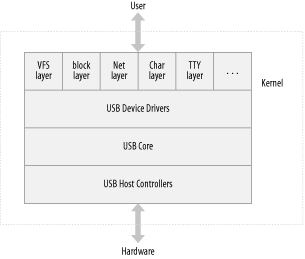
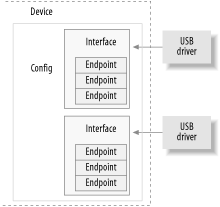

# Chapter 13. USB Drivers

The universal serial bus (USB) is a connection between a host computer and a number of peripheral devices. It was originally created to replace a wide range of slow and different buses—the parallel, serial, and keyboard connections—with a single bus type that all devices could connect to.^(\[1\]) USB has grown beyond these slow connections and now supports almost every type of device that can be connected to a PC. The latest revision of the USB specification added high-speed connections with a theoretical speed limit of 480 MBps.

Topologically, a USB subsystem is not laid out as a bus; it is rather a tree built out of several point-to-point links. The links are four-wire cables (ground, power, and two signal wires) that connect a device and a hub, just like twisted-pair Ethernet. The USB host controller is in charge of asking every USB device if it has any data to send. Because of this topology, a USB device can never start sending data without first being asked to by the host controller. This configuration allows for a very easy plug-and-play type of system, whereby devices can be automatically configured by the host computer.

The bus is very simple at the technological level, as it’s a single-master implementation in which the host computer polls the various peripheral devices. Despite this intrinsic limitation, the bus has some interesting features, such as the ability for a device to request a fixed bandwidth for its data transfers in order to reliably support video and audio I/O. Another important feature of USB is that it acts merely as a communication channel between the device and the host, without requiring specific meaning or structure to the data it delivers.^(\[2\])

The USB protocol specifications define a set of standards that any device of a specific type can follow. If a device follows that standard, then a special driver for that device is not necessary. These different types are called classes and consist of things like storage devices, keyboards, mice, joysticks, network devices, and modems. Other types of devices that do not fit into these classes require a special vendor-specific driver to be written for that specific device. Video devices and USB-to-serial devices are a good example where there is no defined standard, and a driver is needed for every different device from different manufacturers.

These features, together with the inherent hotplug capability of the design, make USB a handy, low-cost mechanism to connect (and disconnect) several devices to the computer without the need to shut the system down, open the cover, and swear over screws and wires.

The Linux kernel supports two main types of USB drivers: drivers on a host system and drivers on a device. The USB drivers for a host system control the USB devices that are plugged into it, from the host’s point of view (a common USB host is a desktop computer.) The USB drivers in a device, control how that single device looks to the host computer as a USB device. As the term “USB device drivers” is very confusing, the USB developers have created the term “USB gadget drivers” to describe the drivers that control a USB device that connects to a computer (remember that Linux also runs in those tiny embedded devices, too.) This chapter details how the USB system that runs on a desktop computer works. USB gadget drivers are outside the realm of this book at this point in time.

As Chapter 13 shows, USB drivers live between the different kernel subsytems (block, net, char, etc.) and the USB hardware controllers. The USB core provides an interface for USB drivers to use to access and control the USB hardware, without having to worry about the different types of USB hardware controllers that are present on the system.



Figure 13-1. USB driver overview

# USB Device Basics

A USB device is a very complex thing, as described in the official USB documentation (available at [http://www.usb.org](http://www.usb.org)). Fortunately, the Linux kernel provides a subsystem called the *USB core* to handle most of the complexity. This chapter describes the interaction between a driver and the USB core. Figure 13-1 shows how USB devices consist of configurations, interfaces, and endpoints and how USB drivers bind to USB interfaces, not the entire USB device.



Figure 13-2. USB device overview

## Endpoints

The most basic form of USB communication is through something called an *endpoint*. A USB endpoint can carry data in only one direction, either from the host computer to the device (called an *OUT* endpoint) or from the device to the host computer (called an *IN* endpoint). Endpoints can be thought of as unidirectional pipes.

A USB endpoint can be one of four different types that describe how the data is transmitted:

CONTROL  
Control endpoints are used to allow access to different parts of the USB device. They are commonly used for configuring the device, retrieving information about the device, sending commands to the device, or retrieving status reports about the device. These endpoints are usually small in size. Every USB device has a control endpoint called “endpoint 0” that is used by the USB core to configure the device at insertion time. These transfers are guaranteed by the USB protocol to always have enough reserved bandwidth to make it through to the device.

INTERRUPT  
Interrupt endpoints transfer small amounts of data at a fixed rate every time the USB host asks the device for data. These endpoints are the primary transport method for USB keyboards and mice. They are also commonly used to send data to USB devices to control the device, but are not generally used to transfer large amounts of data. These transfers are guaranteed by the USB protocol to always have enough reserved bandwidth to make it through.

BULK  
Bulk endpoints transfer large amounts of data. These endpoints are usually much larger (they can hold more characters at once) than interrupt endpoints. They are common for devices that need to transfer any data that must get through with no data loss. These transfers are not guaranteed by the USB protocol to always make it through in a specific amount of time. If there is not enough room on the bus to send the whole BULK packet, it is split up across multiple transfers to or from the device. These endpoints are common on printers, storage, and network devices.

ISOCHRONOUS  
Isochronous endpoints also transfer large amounts of data, but the data is not always guaranteed to make it through. These endpoints are used in devices that can handle loss of data, and rely more on keeping a constant stream of data flowing. Real-time data collections, such as audio and video devices, almost always use these endpoints.

Control and bulk endpoints are used for asynchronous data transfers, whenever the driver decides to use them. Interrupt and isochronous endpoints are periodic. This means that these endpoints are set up to transfer data at fixed times continuously, which causes their bandwidth to be reserved by the USB core.

USB endpoints are described in the kernel with the structure `struct` `usb_host_endpoint`. This structure contains the real endpoint information in another structure called `struct` `usb_endpoint_descriptor`. The latter structure contains all of the USB-specific data in the exact format that the device itself specified. The fields of this structure that drivers care about are:

`bEndpointAddress`  
This is the USB address of this specific endpoint. Also included in this 8-bit value is the direction of the endpoint. The bitmasks `USB_DIR_OUT` and `USB_DIR_IN` can be placed against this field to determine if the data for this endpoint is directed to the device or to the host.

`bmAttributes`  
This is the type of endpoint. The bitmask `USB_ENDPOINT_XFERTYPE_MASK` should be placed against this value in order to determine if the endpoint is of type `USB_ENDPOINT_XFER_ISOC`, `USB_ENDPOINT_XFER_BULK`, or of type `USB_ENDPOINT_XFER_INT`. These macros define a isochronous, bulk, and interrupt endpoint, respectively.

`wMaxPacketSize`  
This is the maximum size in bytes that this endpoint can handle at once. Note that it is possible for a driver to send amounts of data to an endpoint that is bigger than this value, but the data will be divided up into `wMaxPacketSize` chunks when actually transmitted to the device. For high-speed devices, this field can be used to support a high-bandwidth mode for the endpoint by using a few extra bits in the upper part of the value. See the USB specification for more details about how this is done.

`bInterval`  
If this endpoint is of type interrupt, this value is the interval setting for the endpoint—that is, the time between interrupt requests for the endpoint. The value is represented in milliseconds.

The fields of this structure do not have a “traditional” Linux kernel naming scheme. This is because these fields directly correspond to the field names in the USB specification. The USB kernel programmers felt that it was more important to use the specified names, so as to reduce confusion when reading the specification, than it was to have variable names that look familiar to Linux programmers.

## Interfaces

USB endpoints are bundled up into *interfaces*. USB interfaces handle only one type of a USB logical connection, such as a mouse, a keyboard, or a audio stream. Some USB devices have multiple interfaces, such as a USB speaker that might consist of two interfaces: a USB keyboard for the buttons and a USB audio stream. Because a USB interface represents basic functionality, each USB driver controls an interface; so, for the speaker example, Linux needs two different drivers for one hardware device.

USB interfaces may have alternate settings, which are different choices for parameters of the interface. The initial state of a interface is in the first setting, numbered `0`. Alternate settings can be used to control individual endpoints in different ways, such as to reserve different amounts of USB bandwidth for the device. Each device with an isochronous endpoint uses alternate settings for the same interface.

USB interfaces are described in the kernel with the `struct` `usb_interface` structure. This structure is what the USB core passes to USB drivers and is what the USB driver then is in charge of controlling. The important fields in this structure are:

`struct usb_host_interface *altsetting`  
An array of interface structures containing all of the alternate settings that may be selected for this interface. Each `struct` `usb_host_interface` consists of a set of endpoint configurations as defined by the `struct` `usb_host_endpoint` structure described above. Note that these interface structures are in no particular order.

`unsigned num_altsetting`  
The number of alternate settings pointed to by the `altsetting` pointer.

`struct usb_host_interface *cur_altsetting`  
A pointer into the array `altsetting`, denoting the currently active setting for this interface.

`int minor`  
If the USB driver bound to this interface uses the USB major number, this variable contains the minor number assigned by the USB core to the interface. This is valid only after a successful call to `usb_register_dev` (described later in this chapter).

There are other fields in the `struct` `usb_interface` structure, but USB drivers do not need to be aware of them.

## Configurations

USB interfaces are t hemselves bundled up into *configurations*. A USB device can have multiple configurations and might switch between them in order to change the state of the device. For example, some devices that allow firmware to be downloaded to them contain multiple configurations to accomplish this. A single configuration can be enabled only at one point in time. Linux does not handle multiple configuration USB devices very well, but, thankfully, they are rare.

Linux describes USB configurations with the structure `struct` `usb_host_config` and entire USB devices with the structure `struct` `usb_device`. USB device drivers do not generally ever need to read or write to any values in these structures, so they are not defined in detail here. The curious reader can find descriptions of them in the file *include/linux/usb.h* in the kernel source tree.

A USB device driver commonly has to convert data from a given `struct` `usb_interface` structure into a `struct` `usb_device` structure that the USB core needs for a wide range of function calls. To do this, the function *interface_to_usbdev* is provided. Hopefully, in the future, all USB calls that currently need a `struct` `usb_device` will be converted to take a `struct` `usb_interface` parameter and will not require the drivers to do the conversion.

So to summarize, USB devices are quite complex and are made up of lots of different logical units. The relationships among these units can be simply described as follows:

- Devices usually have one or more configurations.

- Configurations often have one or more interfaces.

- Interfaces usually have one or more settings.

- Interfaces have zero or more endpoints.

# USB and Sysfs

Due to the complexity of a single USB physical device, the representation of that device in sysfs is also quite complex. Both the physical USB device (as represented by a `struct` `usb_device`) and the individual USB interfaces (as represented by a `struct` `usb_interface`) are shown in sysfs as individual devices. (This is because both of those structures contain a `struct` `device` structure.) As an example, for a simple USB mouse that contains only one USB interface, the following would be the sysfs directory tree for that device:

```
/sys/devices/pci0000:00/0000:00:09.0/usb2/2-1
|-- 2-1:1.0
|   |-- bAlternateSetting
|   |-- bInterfaceClass
|   |-- bInterfaceNumber
|   |-- bInterfaceProtocol
|   |-- bInterfaceSubClass
|   |-- bNumEndpoints
|   |-- detach_state
|   |-- iInterface
|   `-- power
|       `-- state
|-- bConfigurationValue
|-- bDeviceClass
|-- bDeviceProtocol
|-- bDeviceSubClass
|-- bMaxPower
|-- bNumConfigurations
|-- bNumInterfaces
|-- bcdDevice
|-- bmAttributes
|-- detach_state
|-- devnum
|-- idProduct
|-- idVendor
|-- maxchild
|-- power
|   `-- state
|-- speed
`-- version
```

The `struct` `usb_device` is represented in the tree at:

```
/sys/devices/pci0000:00/0000:00:09.0/usb2/2-1
```

while the USB interface for the mouse—the interface that the USB mouse driver is bound to—is located at the directory:

```
/sys/devices/pci0000:00/0000:00:09.0/usb2/2-1/2-1:1.0
```

To help understand what this long device path means, we describe how the kernel labels the USB devices.

The first USB device is a root hub. This is the USB controller, usually contained in a PCI device. The controller is so named because it controls the whole USB bus connected to it. The controller is a bridge between the PCI bus and the USB bus, as well as being the first USB device on that bus.

All root hubs are assigned a unique number by the USB core. In our example, the root hub is called `usb2`, as it is the second root hub that was registered with the USB core. There is no limit on the number of root hubs that can be contained in a single system at any time.

Every device that is on a USB bus takes the number of the root hub as the first number in its name. That is followed by a `-` character and then the number of the port that the device is plugged into. As the device in our example is plugged into the first port, a `1` is added to the name. So the device name for the main USB mouse device is `2-1`. Because this USB device contains one interface, that causes another device in the tree to be added to the sysfs path. The naming scheme for USB interfaces is the device name up to this point: in our example, it’s `2-1` followed by a colon and the USB configuration number, then a period and the interface number. So for this example, the device name is `2-1:1.0` because it is the first configuration and has interface number zero.

So to summarize, the USB sysfs device naming scheme is:

```
            root_hub-hub_port:config.interface
```

As the devices go further down in the USB tree, and as more and more USB hubs are used, the hub port number is added to the string following the previous hub port number in the chain. For a two-deep tree, the device name looks like:

```
            root_hub-hub_port-hub_port:config.interface
```

As can be seen in the previous directory listing of the USB device and interface, all of the USB specific information is available directly through sysfs (for example, the idVendor, idProduct, and bMaxPower information). One of these files, *bConfigurationValue*, can be written to in order to change the active USB configuration that is being used. This is useful for devices that have multiple configurations, when the kernel is unable to determine what configuration to select in order to properly operate the device. A number of USB modems need to have the proper configuration value written to this file in order to have the correct USB driver bind to the device.

Sysfs does not expose all of the different parts of a USB device, as it stops at the interface level. Any alternate configurations that the device may contain are not shown, as well as the details of the endpoints associated with the interfaces. This information can be found in the *usbfs* filesystem, which is mounted in the */proc/bus/usb/* directory on the system. The file */proc/bus/usb/devices* does show all of the same information exposed in sysfs, as well as the alternate configuration and endpoint information for all USB devices that are present in the system. *usbfs* also allows user-space programs to directly talk to USB devices, which has enabled a lot of kernel drivers to be moved out to user space, where it is easier to maintain and debug. The USB scanner driver is a good example of this, as it is no longer present in the kernel because its functionality is now contained in the user-space SANE library programs.

# USB Urbs

The USB code in the Linux kernel communicates with all USB devices using something called a *urb* (USB request block). This request block is described with the `struct urb` structure and can be found in the *include/linux/usb.h* file.

A urb is used to send or receive data to or from a specific USB endpoint on a specific USB device in an asynchronous manner. It is used much like a `kiocb` structure is used in the filesystem async I/O code or as a `struct` `skbuff` is used in the networking code. A USB device driver may allocate many urbs for a single endpoint or may reuse a single urb for many different endpoints, depending on the need of the driver. Every endpoint in a device can handle a queue of urbs, so that multiple urbs can be sent to the same endpoint before the queue is empty. The typical lifecycle of a urb is as follows:

- Created by a USB device driver.

- Assigned to a specific endpoint of a specific USB device.

- Submitted to the USB core, by the USB device driver.

- Submitted to the specific USB host controller driver for the specified device by the USB core.

- Processed by the USB host controller driver that makes a USB transfer to the device.

- When the urb is completed, the USB host controller driver notifies the USB device driver.

Urbs can also be canceled any time by the driver that submitted the urb, or by the USB core if the device is removed from the system. urbs are dynamically created and contain an internal reference count that enables them to be automatically freed when the last user of the urb releases it.

The procedure described in this chapter for handling urbs is useful, because it permits streaming and other complex, overlapping communications that allow drivers to achieve the highest possible data transfer speeds. But less cumbersome procedures are available if you just want to send individual bulk or control messages and do not care about data throughput rates. (See the Section 13.5.)

## struct urb

The fields of the `struct urb` structure that matter to a USB device driver are:

`struct usb_device *dev`  
Pointer to the `struct usb_device` to which this urb is sent. This variable must be initialized by the USB driver before the urb can be sent to the USB core.

`unsigned int pipe`  
Endpoint information for the specific `struct` `usb_device` that this urb is to be sent to. This variable must be initialized by the USB driver before the urb can be sent to the USB core.

To set fields of this structure, the driver uses the following functions as appropriate, depending on the direction of traffic. Note that every endpoint can be of only one type.

`unsigned int usb_sndctrlpipe(struct usb_device *dev, unsigned int`  
`endpoint)`  
Specifies a control OUT endpoint for the specified USB device with the specified endpoint number.

`unsigned int usb_rcvctrlpipe(struct usb_device *dev, unsigned int`  
`endpoint)`  
Specifies a control IN endpoint for the specified USB device with the specified endpoint number.

`unsigned int usb_sndbulkpipe(struct usb_device *dev, unsigned int`  
`endpoint)`  
Specifies a bulk OUT endpoint for the specified USB device with the specified endpoint number.

`unsigned int usb_rcvbulkpipe(struct usb_device *dev, unsigned int`  
`endpoint)`  
Specifies a bulk IN endpoint for the specified USB device with the specified endpoint number.

`unsigned int usb_sndintpipe(struct usb_device *dev, unsigned int` `endpoint)`  
Specifies an interrupt OUT endpoint for the specified USB device with the specified endpoint number.

`unsigned int usb_rcvintpipe(struct usb_device *dev, unsigned int` `endpoint)`  
Specifies an interrupt IN endpoint for the specified USB device with the specified endpoint number.

`unsigned int usb_sndisocpipe(struct usb_device *dev, unsigned int`  
`endpoint)`  
Specifies an isochronous OUT endpoint for the specified USB device with the specified endpoint number.

`unsigned int usb_rcvisocpipe(struct usb_device *dev, unsigned int`  
`endpoint)`  
Specifies an isochronous IN endpoint for the specified USB device with the specified endpoint number.

`unsigned int transfer_flags`  
This variable can be set to a number of different bit values, depending on what the USB driver wants to happen to the urb. The available values are:

`URB_SHORT_NOT_OK`  
When set, it specifies that any short read on an IN endpoint that might occur should be treated as an error by the USB core. This value is useful only for urbs that are to be read from the USB device, not for write urbs.

`URB_ISO_ASAP`  
If the urb is isochronous, this bit can be set if the driver wants the urb to be scheduled, as soon as the bandwidth utilization allows it to be, and to set the `start_frame` variable in the urb at that point. If this bit is not set for an isochronous urb, the driver must specify the `start_frame` value and must be able to recover properly if the transfer cannot start at that moment. See the upcoming section about isochronous urbs for more information.

`URB_NO_TRANSFER_DMA_MAP`  
Should be set when the urb contains a DMA buffer to be transferred. The USB core uses the buffer pointed to by the `transfer_dma` variable and not the buffer pointed to by the `transfer_buffer` variable.

`URB_NO_SETUP_DMA_MAP`  
Like the `URB_NO_TRANSFER_DMA_MAP` bit, this bit is used for control urbs that have a DMA buffer already set up. If it is set, the USB core uses the buffer pointed to by the `setup_dma` variable instead of the `setup_packet` variable.

`URB_ASYNC_UNLINK`  
If set, the call to *usb_unlink_urb* for this urb returns almost immediately, and the urb is unlinked in the background. Otherwise, the function waits until the urb is completely unlinked and finished before returning. Use this bit with care, because it can make synchronization issues very difficult to debug.

`URB_NO_FSBR`  
Used by only the UHCI USB Host controller driver and tells it to not try to do Front Side Bus Reclamation logic. This bit should generally not be set, because machines with a UHCI host controller create a lot of CPU overhead, and the PCI bus is saturated waiting on a urb that sets this bit.

`URB_ZERO_PACKET`  
If set, a bulk out urb finishes by sending a short packet containing no data when the data is aligned to an endpoint packet boundary. This is needed by some broken USB devices (such as a number of USB to IR devices) in order to work properly.

`URB_NO_INTERRUPT`  
If set, the hardware may not generate an interrupt when the urb is finished. This bit should be used with care and only when queuing multiple urbs to the same endpoint. The USB core functions use this in order to do DMA buffer transfers.

`void *transfer_buffer`  
Pointer to the buffer to be used when sending data to the device (for an OUT urb) or when receiving data from the device (for an IN urb). In order for the host controller to properly access this buffer, it must be created with a call to `kmalloc`, not on the stack or statically. For control endpoints, this buffer is for the data stage of the transfer.

`dma_addr_t transfer_dma`  
Buffer to be used to transfer data to the USB device using DMA.

`int transfer_buffer_length`  
The length of the buffer pointed to by the `transfer_buffer` or the `transfer_dma` variable (as only one can be used for a urb). If this is `0`, neither transfer buffers are used by the USB core.

For an OUT endpoint, if the endpoint maximum size is smaller than the value specified in this variable, the transfer to the USB device is broken up into smaller chunks in order to properly transfer the data. This large transfer occurs in consecutive USB frames. It is much faster to submit a large block of data in one urb, and have the USB host controller split it up into smaller pieces, than it is to send smaller buffers in consecutive order.

`unsigned char *setup_packet`  
Pointer to the setup packet for a control urb. It is transferred before the data in the transfer buffer. This variable is valid only for control urbs.

`dma_addr_t setup_dma`  
DMA buffer for the setup packet for a control urb. It is transferred before the data in the normal transfer buffer. This variable is valid only for control urbs.

`usb_complete_t complete`  
Pointer to the completion handler function that is called by the USB core when the urb is completely transferred or when an error occurs to the urb. Within this function, the USB driver may inspect the urb, free it, or resubmit it for another transfer. (See the Section 13.3.4 for more details about the completion handler.)

The `usb_complete_t` typedef is defined as:

```
typedef void (*usb_complete_t)(struct urb *, struct pt_regs *);
```

`void *context`  
Pointer to a data blob that can be set by the USB driver. It can be used in the completion handler when the urb is returned to the driver. See the following section for more details about this variable.

`int actual_length`  
When the urb is finished, this variable is set to the actual length of the data either sent by the urb (for OUT urbs) or received by the urb (for IN urbs.) For IN urbs, this must be used instead of the `transfer_buffer_length` variable, because the data received could be smaller than the whole buffer size.

`int status`  
When the urb is finished, or being processed by the USB core, this variable is set to the current status of the urb. The only time a USB driver can safely access this variable is in the urb completion handler function (described in Section 13.3.4). This restriction is to prevent race conditions that occur while the urb is being processed by the USB core. For isochronous urbs, a successful value (`0`) in this variable merely indicates whether the urb has been unlinked. To obtain a detailed status on isochronous urbs, the `iso_frame_desc` variables should be checked.

Valid values for this variable include:

`0`  
The urb transfer was successful.

`-ENOENT`  
The urb was stopped by a call to *usb_kill_urb*.

`-ECONNRESET`  
The urb was unlinked by a call to *usb_unlink_urb*, and the `transfer_flags` variable of the urb was set to `URB_ASYNC_UNLINK`.

`-EINPROGRESS`  
The urb is still being processed by the USB host controllers. If your driver ever sees this value, it is a bug in your driver.

`-EPROTO`  
One of the following errors occurred with this urb:

- A bitstuff error happened during the transfer.

- No response packet was received in time by the hardware.

`-EILSEQ`  
There was a CRC mismatch in the urb transfer.

`-EPIPE`  
The endpoint is now stalled. If the endpoint involved is not a control endpoint, this error can be cleared through a call to the function *usb_clear_halt*.

`-ECOMM`  
Data was received faster during the transfer than it could be written to system memory. This error value happens only for an IN urb.

`-ENOSR`  
Data could not be retrieved from the system memory during the transfer fast enough to keep up with the requested USB data rate. This error value happens only for an OUT urb.

`-EOVERFLOW`  
A “babble” error happened to the urb. A “babble” error occurs when the endpoint receives more data than the endpoint’s specified maximum packet size.

`-EREMOTEIO`  
Occurs only if the `URB_SHORT_NOT_OK` flag is set in the urb’s `transfer_flags` variable and means that the full amount of data requested by the urb was not received.

`-ENODEV`  
The USB device is now gone from the system.

`-EXDEV`  
Occurs only for a isochronous urb and means that the transfer was only partially completed. In order to determine what was transferred, the driver must look at the individual frame status.

`-EINVAL`  
Something very bad happened with the urb. The USB kernel documentation describes what this value means:

```
ISO madness, if this happens: Log off and go home
```

It also can happen if a parameter is incorrectly set in the urb stucture or if an incorrect function parameter in the *usb_submit_urb* call submitted the urb to the USB core.

`-ESHUTDOWN`  
There was a severe error with the USB host controller driver; it has now been disabled, or the device was disconnected from the system, and the urb was submitted after the device was removed. It can also occur if the configuration was changed for the device, while the urb was submitted to the device.

Generally, the error values `-EPROTO`, `-EILSEQ`, and `-EOVERFLOW` indicate hardware problems with the device, the device firmware, or the cable connecting the device to the computer.

`int start_frame`  
Sets or returns the initial frame number for isochronous transfers to use.

`int interval`  
The interval at which the urb is polled. This is valid only for interrupt or isochronous urbs. The value’s units differ depending on the speed of the device. For low-speed and full-speed devices, the units are frames, which are equivalent to milliseconds. For devices, the units are in microframes, which is equivalent to units of 1/8 milliseconds. This value must be set by the USB driver for isochronous or interrupt urbs before the urb is sent to the USB core.

`int number_of_packets`  
Valid only for isochronous urbs and specifies the number of isochronous transfer buffers to be handled by this urb. This value must be set by the USB driver for isochronous urbs before the urb is sent to the USB core.

`int error_count`  
Set by the USB core only for isochronous urbs after their completion. It specifies the number of isochronous transfers that reported any type of error.

`struct usb_iso_packet_descriptor iso_frame_desc[0]`  
Valid only for isochronous urbs. This variable is an array of the `struct usb_iso_packet_descriptor` structures that make up this urb. This structure allows a single urb to define a number of isochronous transfers at once. It is also used to collect the transfer status of each individual transfer.

The `struct usb_iso_packet_descriptor` is made up of the following fields:

`unsigned int offset`  
The offset into the transfer buffer (starting at `0` for the first byte) where this packet’s data is located.

`unsigned int length`  
The length of the transfer buffer for this packet.

`unsigned int actual_length`  
The length of the data received into the transfer buffer for this isochronous packet.

`unsigned int status`  
The status of the individual isochronous transfer of this packet. It can take the same return values as the main `struct urb` structure’s `status` variable.

## Creating and Destroying Urbs

The `struct` `urb` structure must never be created statically in a driver or within another structure, because that would break the reference counting scheme used by the USB core for urbs. It must be created with a call to the *usb_alloc_urb* function. This function has the prototype:

```
struct urb *usb_alloc_urb(int iso_packets, int mem_flags);
```

The first parameter, `iso_packets`, is the number of isochronous packets this urb should contain. If you do not want to create an isochronous urb, this variable should be set to `0`. The second parameter, `mem_flags`, is the same type of flag that is passed to the *kmalloc* function call to allocate memory from the kernel (see Section 8.1.1 for the details on these flags). If the function is successful in allocating enough space for the urb, a pointer to the urb is returned to the caller. If the return value is `NULL`, some error occurred within the USB core, and the driver needs to clean up properly.

After a urb has been created, it must be properly initialized before it can be used by the USB core. See the next sections for how to initialize different types of urbs.

In order to tell the USB core that the driver is finished with the urb, the driver must call the *usb_free_urb* function. This function only has one argument:

```
void usb_free_urb(struct urb *urb);
```

The argument is a pointer to the `struct urb` you want to release. After this function is called, the urb structure is gone, and the driver cannot access it any more.

### Interrupt urbs

The function *usb_fill_int_urb* is a helper function to properly initialize a urb to be sent to an interrupt endpoint of a USB device:

```
void usb_fill_int_urb(struct urb *urb, struct usb_device *dev,
                      unsigned int pipe, void *transfer_buffer,
                      int buffer_length, usb_complete_t complete,
                      void *context, int interval);
```

This function contains a lot of parameters:

`struct urb *urb`  
A pointer to the urb to be initialized.

`struct usb_device *dev`  
The USB device to which this urb is to be sent.

`unsigned int pipe`  
The specific endpoint of the USB device to which this urb is to be sent. This value is created with the previously mentioned *usb_sndintpipe* or *usb_rcvintpipe* functions.

`void *transfer_buffer`  
A pointer to the buffer from which outgoing data is taken or into which incoming data is received. Note that this can not be a static buffer and must be created with a call to *kmalloc*.

`int buffer_length`  
The length of the buffer pointed to by the `transfer_buffer` pointer.

`usb_complete_t complete`  
Pointer to the completion handler that is called when this urb is completed.

`void *context`  
Pointer to the blob that is added to the urb structure for later retrieval by the completion handler function.

`int interval`  
The interval at which that this urb should be scheduled. See the previous description of the `struct urb` structure to find the proper units for this value.

### Bulk urbs

Bulk urbs are initialized much like interrupt urbs. The function that does this is *usb_fill_bulk_urb*, and it looks like:

```
void usb_fill_bulk_urb(struct urb *urb, struct usb_device *dev,
                       unsigned int pipe, void *transfer_buffer,
                       int buffer_length, usb_complete_t complete,
                       void *context);
```

The function parameters are all the same as in the *usb_fill_int_urb* function. However, there is no `interval` parameter because bulk urbs have no interval value. Please note that the `unsigned` `int` `pipe` variable must be initialized with a call to the *usb_sndbulkpipe* or *usb_rcvbulkpipe* function.

The *usb_fill_int_urb* function does not set the `transfer_flags` variable in the urb, so any modification to this field has to be done by the driver itself.

### Control urbs

Control urbs are initialized almost the same way as bulk urbs, with a call to the function *usb_fill_control_urb*:

```
void usb_fill_control_urb(struct urb *urb, struct usb_device *dev,
                          unsigned int pipe, unsigned char *setup_packet,
                          void *transfer_buffer, int buffer_length,
                          usb_complete_t complete, void *context);
```

The function parameters are all the same as in the *usb_fill_bulk_urb* function, except that there is a new parameter, `unsigned` `char` `*setup_packet`, which must point to the setup packet data that is to be sent to the endpoint. Also, the `unsigned int` `pipe` variable must be initialized with a call to the *usb_sndctrlpipe* or *usb_rcvictrlpipe* function.

The *usb_fill_control_urb* function does not set the `transfer_flags` variable in the urb, so any modification to this field has to be done by the driver itself. Most drivers do not use this function, as it is much simpler to use the synchronous API calls as described in Section 13.5.

### Isochronous urbs

Isochronous urbs unfortunately do not have an initializer function like the interrupt, control, and bulk urbs do. So they must be initialized “by hand” in the driver before they can be submitted to the USB core. The following is an example of how to properly initialize this type of urb. It was taken from the *konicawc.c* kernel driver located in the *drivers/usb/media* directory in the main kernel source tree.

```
urb->dev = dev;
urb->context = uvd;
urb->pipe = usb_rcvisocpipe(dev, uvd->video_endp-1);
urb->interval = 1;
urb->transfer_flags = URB_ISO_ASAP;
urb->transfer_buffer = cam->sts_buf[i];
urb->complete = konicawc_isoc_irq;
urb->number_of_packets = FRAMES_PER_DESC;
urb->transfer_buffer_length = FRAMES_PER_DESC;
for (j=0; j < FRAMES_PER_DESC; j++) {
        urb->iso_frame_desc[j].offset = j;
        urb->iso_frame_desc[j].length = 1;
}
```

## Submitting Urbs

Once the urb has been properly created and initialized by the USB driver, it is ready to be submitted to the USB core to be sent out to the USB device. This is done with a call to the function *usb_submit_urb*:

```
int usb_submit_urb(struct urb *urb, int mem_flags);
```

The `urb` parameter is a pointer to the urb that is to be sent to the device. The `mem_flags` parameter is equivalent to the same parameter that is passed to the *kmalloc* call and is used to tell the USB core how to allocate any memory buffers at this moment in time.

After a urb has been submitted to the USB core successfully, it should never try to access any fields of the urb structure until the *complete* function is called.

Because the function *usb_submit_urb* can be called at any time (including from within an interrupt context), the specification of the `mem_flags` variable must be correct. There are really only three valid values that should be used, depending on when *usb_submit_urb* is being called:

`GFP_ATOMIC`  
This value should be used whenever the following are true:

- The caller is within a urb completion handler, an interrupt, a bottom half, a tasklet, or a timer callback.

- The caller is holding a spinlock or rwlock. Note that if a semaphore is being held, this value is not necessary.

- The `current->state` is not `TASK_RUNNING`. The state is always `TASK_RUNNING` unless the driver has changed the current state itself.

`GFP_NOIO`  
This value should be used if the driver is in the block I/O patch. It should also be used in the error handling path of all storage-type devices.

`GFP_KERNEL`  
This should be used for all other situations that do not fall into one of the previously mentioned categories.

## Completing Urbs: The Completion Callback Handler

If the call to *usb_submit_urb* was successful, transferring control of the urb to the USB core, the function returns `0`; otherwise, a negative error number is returned. If the function succeeds, the completion handler of the urb (as specified by the *complete* function pointer) is called exactly once when the urb is completed. When this function is called, the USB core is finished with the URB, and control of it is now returned to the device driver.

There are only three ways a urb can be finished and have the *complete* function called:

- The urb is successfully sent to the device, and the device returns the proper acknowledgment. For an OUT urb, the data was successfully sent, and for an IN urb, the requested data was successfully received. If this has happened, the `status` variable in the urb is set to `0`.

- Some kind of error happened when sending or receiving data from the device. This is noted by the error value in the `status` variable in the urb structure.

- The urb was “unlinked” from the USB core. This happens either when the driver tells the USB core to cancel a submitted urb with a call to *usb_unlink_urb* or *usb_kill_urb*, or when a device is removed from the system and a urb had been submitted to it.

An example of how to test for the different return values within a urb completion call is shown later in this chapter.

## Canceling Urbs

To stop a urb that has been submitted to the USB core, the functions *usb_kill_urb* or *usb_unlink_urb* should be called:

```
int usb_kill_urb(struct urb *urb);
int usb_unlink_urb(struct urb *urb);
```

The `urb` parameter for both of these functions is a pointer to the urb that is to be canceled.

When the function is *usb_kill_urb*, the urb lifecycle is stopped. This function is usually used when the device is disconnected from the system, in the disconnect callback.

For some drivers, the *usb_unlink_urb* function should be used to tell the USB core to stop an urb. This function does not wait for the urb to be fully stopped before returning to the caller. This is useful for stopping the urb while in an interrupt handler or when a spinlock is held, as waiting for a urb to fully stop requires the ability for the USB core to put the calling process to sleep. This function requires that the `URB_ASYNC_UNLINK` flag value be set in the urb that is being asked to be stopped in order to work properly.

# Writing a USB Driver

The approach to writing a USB device driver is similar to a `pci_driver`: the driver registers its driver object with the USB subsystem and later uses vendor and device identifiers to tell if its hardware has been installed.

## What Devices Does the Driver Support?

The `struct usb_device_id` structure provides a list of different types of USB devices that this driver supports. This list is used by the USB core to decide which driver to give a device to, and by the hotplug scripts to decide which driver to automatically load when a specific device is plugged into the system.

The `struct usb_device_id` structure is defined with the following fields:

`_ _u16 match_flags`  
Determines which of the following fields in the structure the device should be matched against. This is a bit field defined by the different `USB_DEVICE_ID_MATCH_*` values specified in the *include/linux/mod_devicetable.h* file. This field is usually never set directly but is initialized by the `USB_DEVICE` type macros described later.

`_ _u16 idVendor`  
The USB vendor ID for the device. This number is assigned by the USB forum to its members and cannot be made up by anyone else.

`_ _u16 idProduct`  
The USB product ID for the device. All vendors that have a vendor ID assigned to them can manage their product IDs however they choose to.

`_ _u16 bcdDevice_lo`   
`_ _u16 bcdDevice_hi`  
Define the low and high ends of the range of the vendor-assigned product version number. The `bcdDevice_hi` value is inclusive; its value is the number of the highest-numbered device. Both of these values are expressed in binary-coded decimal (BCD) form. These variables, combined with the `idVendor` and `idProduct`, are used to define a specific version of a device.

`_ _u8 bDeviceClass`   
`_ _u8 bDeviceSubClass`   
`_ _u8 bDeviceProtocol`  
Define the class, subclass, and protocol of the device, respectively. These numbers are assigned by the USB forum and are defined in the USB specification. These values specify the behavior for the whole device, including all interfaces on this device.

`_ _u8 bInterfaceClass`   
`_ _u8 bInterfaceSubClass`   
`_ _u8 bInterfaceProtocol`  
Much like the device-specific values above, these define the class, subclass, and protocol of the individual interface, respectively. These numbers are assigned by the USB forum and are defined in the USB specification.

`kernel_ulong_t driver_info`  
This value is not used to match against, but it holds information that the driver can use to differentiate the different devices from each other in the `probe` callback function to the USB driver.

As with PCI devices, there are a number of macros that are used to initialize this structure:

`USB_DEVICE(vendor, product)`  
Creates a `struct usb_device_id` that can be used to match only the specified vendor and product ID values. This is very commonly used for USB devices that need a specific driver.

`USB_DEVICE_VER(vendor, product, lo, hi)`  
Creates a `struct usb_device_id` that can be used to match only the specified vendor and product ID values within a version range.

`USB_DEVICE_INFO(class, subclass, protocol)`  
Creates a `struct usb_device_id` that can be used to match a specific class of USB devices.

`USB_INTERFACE_INFO(class, subclass, protocol)`  
Creates a `struct usb_device_id` that can be used to match a specific class of USB interfaces.

So, for a simple USB device driver that controls only a single USB device from a single vendor, the `struct usb_device_id` table would be defined as:

```
/* table of devices that work with this driver */
static struct usb_device_id skel_table [  ] = {
    { USB_DEVICE(USB_SKEL_VENDOR_ID, USB_SKEL_PRODUCT_ID) },
    { }                 /* Terminating entry */
};
MODULE_DEVICE_TABLE (usb, skel_table);
```

As with a PCI driver, the `MODULE_DEVICE_TABLE` macro is necessary to allow user-space tools to figure out what devices this driver can control. But for USB drivers, the string `usb` must be the first value in the macro.

## Registering a USB Driver

The main structure that all USB drivers must create is a `struct` `usb_driver`. This structure must be filled out by the USB driver and consists of a number of function callbacks and variables that describe the USB driver to the USB core code:

`struct module *owner`  
Pointer to the module owner of this driver. The USB core uses it to properly reference count this USB driver so that it is not unloaded at inopportune moments. The variable should be set to the `THIS_MODULE` macro.

`const char *name`  
Pointer to the name of the driver. It must be unique among all USB drivers in the kernel and is normally set to the same name as the module name of the driver. It shows up in sysfs under */sys/bus/usb/drivers/* when the driver is in the kernel.

`const struct usb_device_id *id_table`  
Pointer to the `struct usb_device_id` table that contains a list of all of the different kinds of USB devices this driver can accept. If this variable is not set, the `probe` function callback in the USB driver is never called. If you want your driver always to be called for every USB device in the system, create a entry that sets only the `driver_info` field:

```
static struct usb_device_id usb_ids[  ] = {
    {.driver_info = 42},
    {  }
};
```

`int (*probe) (struct usb_interface *intf, const struct usb_device_id *id)`  
Pointer to the probe function in the USB driver. This function (described in Section 13.4.3) is called by the USB core when it thinks it has a `struct` `usb_interface` that this driver can handle. A pointer to the `struct usb_device_id` that the USB core used to make this decision is also passed to this function. If the USB driver claims the `struct` `usb_interface` that is passed to it, it should initialize the device properly and return `0`. If the driver does not want to claim the device, or an error occurs, it should return a negative error value.

`void (*disconnect) (struct usb_interface *intf)`  
Pointer to the disconnect function in the USB driver. This function (described in Section 13.4.3) is called by the USB core when the `struct usb_interface` has been removed from the system or when the driver is being unloaded from the USB core.

So, to create a value `struct usb_driver` structure, only five fields need to be initialized:

```
static struct usb_driver skel_driver = {
    .owner = THIS_MODULE,
    .name = "skeleton",
    .id_table = skel_table,
    .probe = skel_probe,
    .disconnect = skel_disconnect,
};
```

The `struct` `usb_driver` does contain a few more callbacks, which are generally not used very often, and are not required in order for a USB driver to work properly:

`int (*ioctl) (struct usb_interface *intf, unsigned int code, void *buf)`  
Pointer to an *ioctl* function in the USB driver. If it is present, it is called when a user-space program makes a *ioctl* call on the *usbfs* filesystem device entry associated with a USB device attached to this USB driver. In pratice, only the USB hub driver uses this ioctl, as there is no other real need for any other USB driver to use it.

`int (*suspend) (struct usb_interface *intf, u32 state)`  
Pointer to a suspend function in the USB driver. It is called when the device is to be suspended by the USB core.

`int (*resume) (struct usb_interface *intf)`  
Pointer to a resume function in the USB driver. It is called when the device is being resumed by the USB core.

To register the `struct` `usb_driver` with the USB core, a call to *usb_register_driver* is made with a pointer to the `struct` `usb_driver`. This is traditionally done in the module initialization code for the USB driver:

```
static int _ _init usb_skel_init(void)
{
    int result;

    /* register this driver with the USB subsystem */
    result = usb_register(&skel_driver);
    if (result)
        err("usb_register failed. Error number %d", result);

    return result;
}
```

When the USB driver is to be unloaded, the `struct usb_driver` needs to be unregistered from the kernel. This is done with a call to *usb_deregister_driver*. When this call happens, any USB interfaces that were currently bound to this driver are disconnected, and the *disconnect* function is called for them.

```
static void _ _exit usb_skel_exit(void)
{
    /* deregister this driver with the USB subsystem */
    usb_deregister(&skel_driver);
}
```

## probe and disconnect in Detail

In the `struct usb_driver` structure described in the previous section, the driver specified two functions that the USB core calls at appropriate times. The *probe* function is called when a device is installed that the USB core thinks this driver should handle; the *probe* function should perform checks on the information passed to it about the device and decide whether the driver is really appropriate for that device. The *disconnect* function is called when the driver should no longer control the device for some reason and can do clean-up.

Both the *probe* and *disconnect* function callbacks are called in the context of the USB hub kernel thread, so it is legal to sleep within them. However, it is recommended that the majority of work be done when the device is opened by a user if possible, in order to keep the USB probing time to a minimum. This is because the USB core handles the addition and removal of USB devices within a single thread, so any slow device driver can cause the USB device detection time to slow down and become noticeable by the user.

In the *probe* function callback, the USB driver should initialize any local structures that it might use to manage the USB device. It should also save any information that it needs about the device to the local structure, as it is usually easier to do so at this time. As an example, USB drivers usually want to detect what the endpoint address and buffer sizes are for the device, as they are needed in order to communicate with the device. Here is some example code that detects both IN and OUT endpoints of BULK type and saves some information about them in a local device structure:

```
/* set up the endpoint information */
/* use only the first bulk-in and bulk-out endpoints */
iface_desc = interface->cur_altsetting;
for (i = 0; i < iface_desc->desc.bNumEndpoints; ++i) {
    endpoint = &iface_desc->endpoint[i].desc;

    if (!dev->bulk_in_endpointAddr &&
        (endpoint->bEndpointAddress & USB_DIR_IN) &&
        ((endpoint->bmAttributes & USB_ENDPOINT_XFERTYPE_MASK)
                =  = USB_ENDPOINT_XFER_BULK)) {
        /* we found a bulk in endpoint */
        buffer_size = endpoint->wMaxPacketSize;
        dev->bulk_in_size = buffer_size;
        dev->bulk_in_endpointAddr = endpoint->bEndpointAddress;
        dev->bulk_in_buffer = kmalloc(buffer_size, GFP_KERNEL);
        if (!dev->bulk_in_buffer) {
            err("Could not allocate bulk_in_buffer");
            goto error;
        }
    }

    if (!dev->bulk_out_endpointAddr &&
        !(endpoint->bEndpointAddress & USB_DIR_IN) &&
        ((endpoint->bmAttributes & USB_ENDPOINT_XFERTYPE_MASK)
                =  = USB_ENDPOINT_XFER_BULK)) {
        /* we found a bulk out endpoint */
        dev->bulk_out_endpointAddr = endpoint->bEndpointAddress;
    }
}
if (!(dev->bulk_in_endpointAddr && dev->bulk_out_endpointAddr)) {
    err("Could not find both bulk-in and bulk-out endpoints");
    goto error;
}
```

This block of code first loops over every endpoint that is present in this interface and assigns a local pointer to the endpoint structure to make it easier to access later:

```
for (i = 0; i < iface_desc->desc.bNumEndpoints; ++i) {
    endpoint = &iface_desc->endpoint[i].desc;
```

Then, after we have an endpoint, and we have not found a bulk IN type endpoint already, we look to see if this endpoint’s direction is IN. That can be tested by seeing whether the bitmask `USB_DIR_IN` is contained in the `bEndpointAddress` endpoint variable. If this is true, we determine whether the endpoint type is bulk or not, by first masking off the `bmAttributes` variable with the `USB_ENDPOINT_XFERTYPE_MASK` bitmask, and then checking if it matches the value `USB_ENDPOINT_XFER_BULK`:

```
if (!dev->bulk_in_endpointAddr &&
    (endpoint->bEndpointAddress & USB_DIR_IN) &&
    ((endpoint->bmAttributes & USB_ENDPOINT_XFERTYPE_MASK)
            =  = USB_ENDPOINT_XFER_BULK)) {
```

If all of these tests are true, the driver knows it found the proper type of endpoint and can save the information about the endpoint that it will later need to communicate over it in a local structure:

```
/* we found a bulk in endpoint */
buffer_size = endpoint->wMaxPacketSize;
dev->bulk_in_size = buffer_size;
dev->bulk_in_endpointAddr = endpoint->bEndpointAddress;
dev->bulk_in_buffer = kmalloc(buffer_size, GFP_KERNEL);
if (!dev->bulk_in_buffer) {
    err("Could not allocate bulk_in_buffer");
    goto error;
}
```

Because the USB driver needs to retrieve the local data structure that is associated with this `struct` `usb_interface` later in the lifecycle of the device, the function *usb_set_intfdata* can be called:

```
/* save our data pointer in this interface device */
usb_set_intfdata(interface, dev);
```

This function accepts a pointer to any data type and saves it in the `struct` `usb_interface` structure for later access. To retrieve the data, the function *usb_get_intfdata* should be called:

```
struct usb_skel *dev;
struct usb_interface *interface;
int subminor;
int retval = 0;

subminor = iminor(inode);

interface = usb_find_interface(&skel_driver, subminor);
if (!interface) {
    err ("%s - error, can't find device for minor %d",
         _ _FUNCTION_ _, subminor);
    retval = -ENODEV;
    goto exit;
}

dev = usb_get_intfdata(interface);
if (!dev) {
    retval = -ENODEV;
    goto exit;
}
```

*usb_get_intfdata* is usually called in the *open* function of the USB driver and again in the *disconnect* function. Thanks to these two functions, USB drivers do not need to keep a static array of pointers that store the individual device structures for all current devices in the system. The indirect reference to device information allows an unlimited number of devices to be supported by any USB driver.

If the USB driver is not associated with another type of subsystem that handles the user interaction with the device (such as input, tty, video, etc.), the driver can use the USB major number in order to use the traditional char driver interface with user space. To do this, the USB driver must call the *usb_register_dev* function in the *probe* function when it wants to register a device with the USB core. Make sure that the device and driver are in a proper state to handle a user wanting to access the device as soon as this function is called.

```
/* we can register the device now, as it is ready */
retval = usb_register_dev(interface, &skel_class);
if (retval) {
    /* something prevented us from registering this driver */
    err("Not able to get a minor for this device.");
    usb_set_intfdata(interface, NULL);
    goto error;
}
```

The *usb_register_dev* function requires a pointer to a `struct` `usb_interface` and a pointer to a `struct` `usb_class_driver`. This `struct usb_class_driver` is used to define a number of different parameters that the USB driver wants the USB core to know when registering for a minor number. This structure consists of the following variables:

`char *name`  
The name that sysfs uses to describe the device. A leading pathname, if present, is used only in devfs and is not covered in this book. If the number of the device needs to be in the name, the characters `%d` should be in the name string. For example, to create the devfs name `usb/foo1` and the sysfs class name `foo1`, the name string should be set to `usb/foo%d`.

`struct file_operations *fops;`  
Pointer to the `struct file_operations` that this driver has defined to use to register as the character device. See Chapter 3 for more information about this structure.

`mode_t mode;`  
The mode for the devfs file to be created for this driver; unused otherwise. A typical setting for this variable would be the value `S_IRUSR` combined with the value `S_IWUSR`, which would provide only read and write access by the owner of the device file.

`int minor_base;`  
This is the start of the assigned minor range for this driver. All devices associated with this driver are created with unique, increasing minor numbers beginning with this value. Only 16 devices are allowed to be associated with this driver at any one time unless the `CONFIG_USB_DYNAMIC_MINORS` configuration option has been enabled for the kernel. If so, this variable is ignored, and all minor numbers for the device are allocated on a first-come, first-served manner. It is recommended that systems that have enabled this option use a program such as *udev* to manage the device nodes in the system, as a static */dev* tree will not work properly.

When the USB device is disconnected, all resources associated with the device should be cleaned up, if possible. At this time, if *usb_register_dev* has been called to allocate a minor number for this USB device during the *probe* function, the function *usb_deregister_dev* must be called to give the minor number back to the USB core.

In the *disconnect* function, it is also important to retrieve from the interface any data that was previously set with a call to *usb_set_intfdata*. Then set the data pointer in the `struct` `usb_interface` structure to `NULL` to prevent any further mistakes in accessing the data improperly:

```
static void skel_disconnect(struct usb_interface *interface)
{
    struct usb_skel *dev;
    int minor = interface->minor;

    /* prevent skel_open(  ) from racing skel_disconnect(  ) */
    lock_kernel(  );

    dev = usb_get_intfdata(interface);
    usb_set_intfdata(interface, NULL);

    /* give back our minor */
    usb_deregister_dev(interface, &skel_class);

    unlock_kernel(  );

    /* decrement our usage count */
    kref_put(&dev->kref, skel_delete);

    info("USB Skeleton #%d now disconnected", minor);
}
```

Note the call to *lock_kernel* in the previous code snippet. This takes the big kernel lock, so that the *disconnect* callback does not encounter a race condition with the open call when trying to get a pointer to the correct interface data structure. Because the `open` is called with the big kernel lock taken, if the *disconnect* also takes that same lock, only one portion of the driver can access and then set the interface data pointer.

Just before the *disconnect* function is called for a USB device, all urbs that are currently in transmission for the device are canceled by the USB core, so the driver does not have to explicitly call *usb_kill_urb* for these urbs. If a driver tries to submit a urb to a USB device after it has been disconnected with a call to *usb_submit_urb*, the submission will fail with an error value of `-EPIPE`.

## Submitting and Controlling a Urb

When the driver has data to send to the USB device (as typically happens in a driver’s `write` function), a urb must be allocated for transmitting the data to the device:

```
urb = usb_alloc_urb(0, GFP_KERNEL);
if (!urb) {
    retval = -ENOMEM;
    goto error;
}
```

After the urb is allocated successfully, a DMA buffer should also be created to send the data to the device in the most efficient manner, and the data that is passed to the driver should be copied into that buffer:

```
buf = usb_buffer_alloc(dev->udev, count, GFP_KERNEL, &urb->transfer_dma);
if (!buf) {
    retval = -ENOMEM;
    goto error;
}
if (copy_from_user(buf, user_buffer, count)) {
    retval = -EFAULT;
    goto error;
}
```

Once the data is properly copied from the user space into the local buffer, the urb must be initialized correctly before it can be submitted to the USB core:

```
/* initialize the urb properly */
usb_fill_bulk_urb(urb, dev->udev,
          usb_sndbulkpipe(dev->udev, dev->bulk_out_endpointAddr),
          buf, count, skel_write_bulk_callback, dev);
urb->transfer_flags |= URB_NO_TRANSFER_DMA_MAP;
```

Now that the urb is properly allocated, the data is properly copied, and the urb is properly initialized, it can be submitted to the USB core to be transmitted to the device:

```
/* send the data out the bulk port */
retval = usb_submit_urb(urb, GFP_KERNEL);
if (retval) {
    err("%s - failed submitting write urb, error %d", _ _FUNCTION_ _, retval);
    goto error;
}
```

After the urb is successfully transmitted to the USB device (or something happens in transmission), the urb callback is called by the USB core. In our example, we initialized the urb to point to the function *skel_write_bulk_callback*, and that is the function that is called:

```
static void skel_write_bulk_callback(struct urb *urb, struct pt_regs *regs)
{
    /* sync/async unlink faults aren't errors */
    if (urb->status && 
        !(urb->status =  = -ENOENT || 
          urb->status =  = -ECONNRESET ||
          urb->status =  = -ESHUTDOWN)) {
        dbg("%s - nonzero write bulk status received: %d",
            _ _FUNCTION_ _, urb->status);
    }

    /* free up our allocated buffer */
    usb_buffer_free(urb->dev, urb->transfer_buffer_length, 
            urb->transfer_buffer, urb->transfer_dma);
}
```

The first thing the callback function does is check the status of the urb to determine if this urb completed successfully or not. The error values, `-ENOENT`, `-ECONNRESET`, and `-ESHUTDOWN` are not real transmission errors, just reports about conditions accompanying a successful transmission. (See the list of possible errors for urbs detailed in the section Section 13.3.1.) Then the callback frees up the allocated buffer that was assigned to this urb to transmit.

It’s common for another urb to be submitted to the device while the urb callback function is running. This is useful when streaming data to a device. Remember that the urb callback is running in interrupt context, so it should do any memory allocation, hold any semaphores, or do anything else that could cause the process to sleep. When submitting a urb from within a callback, use the `GFP_ATOMIC` flag to tell the USB core to not sleep if it needs to allocate new memory chunks during the submission process.

# USB Transfers Without Urbs

Sometimes a USB driver does not want to go through all of the hassle of creating a `struct urb`, initializing it, and then waiting for the urb completion function to run, just to send or receive some simple USB data. Two functions are available to provide a simpler interface.

## usb_bulk_msg

*usb_bulk_msg* creates a USB bulk urb and sends it to the specified device, then waits for it to complete before returning to the caller. It is defined as:

```
int usb_bulk_msg(struct usb_device *usb_dev, unsigned int pipe,
                 void *data, int len, int *actual_length,
                 int timeout);
```

The parameters of this function are:

`struct usb_device *usb_dev`  
A pointer to the USB device to send the bulk message to.

`unsigned int pipe`  
The specific endpoint of the USB device to which this bulk message is to be sent. This value is created with a call to either *usb_sndbulkpipe* or *usb_rcvbulkpipe*.

`void *data`  
A pointer to the data to send to the device if this is an OUT endpoint. If this is an IN endpoint, this is a pointer to where the data should be placed after being read from the device.

`int len`  
The length of the buffer that is pointed to by the `data` parameter.

`int *actual_length`  
A pointer to where the function places the actual number of bytes that have either been transferred to the device or received from the device, depending on the direction of the endpoint.

`int timeout`  
The amount of time, in jiffies, that should be waited before timing out. If this value is `0`, the function waits forever for the message to complete.

If the function is successful, the return value is `0`; otherwise, a negative error number is returned. This error number matches up with the error numbers previously described for urbs in Section 13.3.1. If successful, the `actual_length` parameter contains the number of bytes that were transferred or received from this message.

The following is an example of using this function call:

```
/* do a blocking bulk read to get data from the device */
retval = usb_bulk_msg(dev->udev,
              usb_rcvbulkpipe(dev->udev, dev->bulk_in_endpointAddr),
              dev->bulk_in_buffer,
              min(dev->bulk_in_size, count),
              &count, HZ*10);

/* if the read was successful, copy the data to user space */
if (!retval) {
    if (copy_to_user(buffer, dev->bulk_in_buffer, count))
        retval = -EFAULT;
    else
        retval = count;
}
```

This example shows a simple bulk read from an IN endpoint. If the read is successful, the data is then copied to user space. This is typically done in a `read` function for a USB driver.

The *usb_bulk_msg* function cannot be called from within interrupt context or with a spinlock held. Also, this function cannot be canceled by any other function, so be careful when using it; make sure that your driver’s *disconnect* knows enough to wait for the call to complete before allowing itself to be unloaded from memory.

## usb_control_msg

The *usb_control_msg* function works just like the *usb_bulk_msg* function, except it allows a driver to send and receive USB control messages:

```
int usb_control_msg(struct usb_device *dev, unsigned int pipe,
                    _ _u8 request, _ _u8 requesttype,
                    _ _u16 value, _ _u16 index,
                    void *data, _ _u16 size, int timeout);
```

The parameters of this function are almost the same as *usb_bulk_msg*, with a few important differences:

`struct usb_device *dev`  
A pointer to the USB device to send the control message to.

`unsigned int pipe`  
The specific endpoint of the USB device that this control message is to be sent to. This value is created with a call to either *usb_sndctrlpipe* or *usb_rcvctrlpipe*.

`_ _u8 request`  
The USB request value for the control message.

`_ _u8 requesttype`  
The USB request type value for the control message

`_ _u16 value`  
The USB message value for the control message.

`_ _u16 index`  
The USB message index value for the control message.

`void *data`  
A pointer to the data to send to the device if this is an OUT endpoint. If this is an IN endpoint, this is a pointer to where the data should be placed after being read from the device.

`_ _u16 size`  
The size of the buffer that is pointed to by the `data` parameter.

`int timeout`  
The amount of time, in jiffies, that should be waited before timing out. If this value is `0`, the function will wait forever for the message to complete.

If the function is successful, it returns the number of bytes that were transferred to or from the device. If it is not successful, it returns a negative error number.

The parameters `request`, `requesttype`, `value`, and `index` all directly map to the USB specification for how a USB control message is defined. For more information on the valid values for these parameters and how they are used, see Chapter 9 of the USB specification.

Like the function *usb_bulk_msg*, the function *usb_control_msg* cannot be called from within interrupt context or with a spinlock held. Also, this function cannot be canceled by any other function, so be careful when using it; make sure that your driver *disconnect* function knows enough to wait for the call to complete before allowing itself to be unloaded from memory.

## Other USB Data Functions

A number of helper functions in the USB core can be used to retrieve standard information from all USB devices. These functions cannot be called from within interrupt context or with a spinlock held.

The function *usb_get_descriptor* retrieves the specified USB descriptor from the specified device. The function is defined as:

```
int usb_get_descriptor(struct usb_device *dev, unsigned char type,
                       unsigned char index, void *buf, int size);
```

This function can be used by a USB driver to retrieve from the `struct` `usb_device` structure any of the device descriptors that are not already present in the existing `struct` `usb_device` and `struct` `usb_interface` structures, such as audio descriptors or other class specific information. The parameters of the function are:

`struct usb_device *usb_dev`  
A pointer to the USB device that the descriptor should be retrieved from.

`unsigned char type`  
The descriptor type. This type is described in the USB specification and can be one of the following types:

```
USB_DT_DEVICE
USB_DT_CONFIG
USB_DT_STRING
USB_DT_INTERFACE
USB_DT_ENDPOINT
USB_DT_DEVICE_QUALIFIER
USB_DT_OTHER_SPEED_CONFIG
USB_DT_INTERFACE_POWER
USB_DT_OTG
USB_DT_DEBUG
USB_DT_INTERFACE_ASSOCIATION
USB_DT_CS_DEVICE
USB_DT_CS_CONFIG
USB_DT_CS_STRING
USB_DT_CS_INTERFACE
USB_DT_CS_ENDPOINT
```

`unsigned char index`  
The number of the descriptor that should be retrieved from the device.

`void *buf`  
A pointer to the buffer to which you copy the descriptor.

`int size`  
The size of the memory pointed to by the `buf` variable.

If this function is successful, it returns the number of bytes read from the device. Otherwise, it returns a negative error number returned by the underlying call to *usb_control_msg* that this function makes.

One of the more common uses for the *usb_get_descriptor* call is to retrieve a string from the USB device. Because this is quite common, there is a helper function for it called *usb_get_string*:

```
int usb_get_string(struct usb_device *dev, unsigned short langid,
                   unsigned char index, void *buf, int size);
```

If successful, this function returns the number of bytes received by the device for the string. Otherwise, it returns a negative error number returned by the underlying call to *usb_control_msg* that this function makes.

If this function is successful, it returns a string encoded in the UTF-16LE format (Unicode, 16 bits per character, in little-endian byte order) in the buffer pointed to by the `buf` parameter. As this format is usually not very useful, there is another function, called *usb_string*, that returns a string that is read from a USB device and is already converted into an ISO 8859-1 format string. This character set is a 8-bit subset of Unicode and is the most common format for strings in English and other Western European languages. As this is typically the format that the USB device’s strings are in, it is recommended that the *usb_string* function be used instead of the *usb_get_string* function.

# Quick Reference

This section summarizes the symbols introduced in the chapter:

`#include <linux/usb.h>`  
Header file where everything related to USB resides. It must be included by all USB device drivers.

`struct usb_driver;`  
Structure that describes a USB driver.

`struct usb_device_id;`  
Structure that describes the types of USB devices this driver supports.

`int usb_register(struct usb_driver *d);`  
`void usb_deregister(struct usb_driver *d);`  
Functions used to register and unregister a USB driver from the USB core.

`struct usb_device *interface_to_usbdev(struct usb_interface *intf);`  
Retrieves the controlling `struct` `usb_device` `*` out of a `struct` `usb_interface` `*`.

`struct usb_device;`  
Structure that controls an entire USB device.

`struct usb_interface;`  
Main USB device structure that all USB drivers use to communicate with the USB core.

`void usb_set_intfdata(struct usb_interface *intf, void *data);`  
`void *usb_get_intfdata(struct usb_interface *intf);`  
Functions to set and get access to the private data pointer section within the `struct usb_interface`.

`struct usb_class_driver;`  
A structure that describes a USB driver that wants to use the USB major number to communicate with user-space programs.

`int usb_register_dev(struct usb_interface *intf, struct usb_class_driver`  
`*class_driver);`  
`void usb_deregister_dev(struct usb_interface *intf, struct usb_class_driver`  
`*class_driver);`  
Functions used to register and unregister a specific `struct` `usb_interface` `*` structure with a `struct` `usb_class_driver` `*` structure.

`struct urb;`  
Structure that describes a USB data transmission.

`struct urb *usb_alloc_urb(int iso_packets, int mem_flags);`  
`void usb_free_urb(struct urb *urb);`  
Functions used to create and destroy a `struct` `usb` `urb` `*`.

`int usb_submit_urb(struct urb *urb, int mem_flags);`  
`int usb_kill_urb(struct urb *urb);`  
`int usb_unlink_urb(struct urb *urb);`  
Functions used to start and stop a USB data transmission.

`void usb_fill_int_urb(struct urb *urb, struct usb_device *dev, unsigned int`  
`pipe, void *transfer_buffer, int buffer_length, usb_complete_t complete`,  
`void *context, int interval);`  
`void usb_fill_bulk_urb(struct urb *urb, struct usb_device *dev, unsigned int`  
`pipe, void *transfer_buffer, int buffer_length, usb_complete_t complete`,  
`void *context);`  
`void usb_fill_control_urb(struct urb *urb, struct usb_device *dev, unsigned`  
`int pipe, unsigned char *setup_packet, void *transfer_buffer, int`  
`buffer_ length, usb_complete_t complete, void *context);`  
Functions used to initialize a `struct urb` before it is submitted to the USB core.

`int usb_bulk_msg(struct usb_device *usb_dev, unsigned int pipe, void *data`,  
`int len, int *actual_length, int timeout);`  
`int usb_control_msg(struct usb_device *dev, unsigned int pipe, _ _u8 request`,  
`_ _u8 requesttype, _ _u16 value, _ _u16 index, void *data, _ _u16 size`,  
`int timeout);`  
Functions used to send or receive USB data without having to use a `struct` `urb`.

  

------------------------------------------------------------------------

^(\[1\]) Portions of this chapter are based on the in-kernel documentation for the Linux kernel USB code, which were written by the kernel USB developers and released under the GPL.

^(\[2\]) Actually, some structure is there, but it mostly reduces to a requirement for the communication to fit into one of a few predefined classes: a keyboard won’t allocate bandwidth, for example, while some video cameras will.