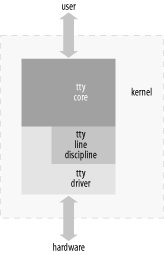

# Chapter 18. TTY Drivers

A tty device gets its name from the very old abbreviation of teletypewriter and was originally associated only with the physical or virtual terminal connection to a Unix machine. Over time, the name also came to mean any serial port style device, as terminal connections could also be created over such a connection. Some examples of physical tty devices are serial ports, USB-to-serial-port converters, and some types of modems that need special processing to work properly (such as the traditional WinModem style devices). tty virtual devices support virtual consoles that are used to log into a computer, from either the keyboard, over a network connection, or through a xterm session.

The Linux tty driver core lives right below the standard character driver level and provides a range of features focused on providing an interface for terminal style devices to use. The core is responsible for controlling both the flow of data across a tty device and the format of the data. This allows tty drivers to focus on handling the data to and from the hardware, instead of worrying about how to control the interaction with user space in a consistent way. To control the flow of data, there are a number of different line disciplines that can be virtually “plugged” into any tty device. This is done by different tty line discipline drivers.

As Figure 18-1 shows, the tty core takes data from a user that is to be sent to a tty device. It then passes it to a tty line discipline driver, which then passes it to the tty driver. The tty driver converts the data into a format that can be sent to the hardware. Data being received from the tty hardware flows back up through the tty driver, into the tty line discipline driver, and into the tty core, where it can be retrieved by a user. Sometimes the tty driver communicates directly to the tty core, and the tty core sends data directly to the tty driver, but usually the tty line discipline has a chance to modify the data that is sent between the two.



Figure 18-1. tty core overview

The tty driver never sees the tty line discipline. The driver cannot communicate directly with the line discipline, nor does it realize it is even present. The driver’s job is to format data that is sent to it in a manner that the hardware can understand, and receive data from the hardware. The tty line discipline’s job is to format the data received from a user, or the hardware, in a specific manner. This formatting usually takes the form of a protocol conversion, such as PPP or Bluetooth.

There are three different types of tty drivers: console, serial port, and pty. The console and pty drivers have already been written and probably are the only ones needed of these types of tty drivers. This leaves any new drivers using the tty core to interact with the user and the system as serial port drivers.

To determine what kind of tty drivers are currently loaded in the kernel and what tty devices are currently present, look at the */proc/tty/drivers* file. This file consists of a list of the different tty drivers currently present, showing the name of the driver, the default node name, the major number for the driver, the range of minors used by the driver, and the type of the tty driver. The following is an example of this file:

```
/dev/tty             /dev/tty        5       0 system:/dev/tty
/dev/console         /dev/console    5       1 system:console
/dev/ptmx            /dev/ptmx       5       2 system
/dev/vc/0            /dev/vc/0       4       0 system:vtmaster
usbserial            /dev/ttyUSB   188   0-254 serial
serial               /dev/ttyS       4   64-67 serial
pty_slave            /dev/pts      136   0-255 pty:slave
pty_master           /dev/ptm      128   0-255 pty:master
pty_slave            /dev/ttyp       3   0-255 pty:slave
pty_master           /dev/pty        2   0-255 pty:master
unknown              /dev/tty        4    1-63 console
```

The */proc/tty/driver/* directory contains individual files for some of the tty drivers, if they implement that functionality. The default serial driver creates a file in this directory that shows a lot of serial-port-specific information about the hardware. Information on how to create a file in this directory is described later.

All of the tty devices currently registered and present in the kernel have their own subdirectory under */sys/class/tty*. Within that subdirectory, there is a “dev” file that contains the major and minor number assigned to that tty device. If the driver tells the kernel the locations of the physical device and driver associated with the tty device, it creates symlinks back to them. An example of this tree is:

```
/sys/class/tty/
|-- console
|   `-- dev
|-- ptmx
|   `-- dev
|-- tty
|   `-- dev
|-- tty0
|   `-- dev
   ... 
|-- ttyS1
|   `-- dev
|-- ttyS2
|   `-- dev
|-- ttyS3
|   `-- dev
   ...
|-- ttyUSB0
|   |-- dev
|   |-- device -> ../../../devices/pci0000:00/0000:00:09.0/usb3/3-1/3-1:1.0/ttyUSB0
|   `-- driver -> ../../../bus/usb-serial/drivers/keyspan_4
|-- ttyUSB1
|   |-- dev
|   |-- device -> ../../../devices/pci0000:00/0000:00:09.0/usb3/3-1/3-1:1.0/ttyUSB1
|   `-- driver -> ../../../bus/usb-serial/drivers/keyspan_4
|-- ttyUSB2
|   |-- dev
|   |-- device -> ../../../devices/pci0000:00/0000:00:09.0/usb3/3-1/3-1:1.0/ttyUSB2
|   `-- driver -> ../../../bus/usb-serial/drivers/keyspan_4
`-- ttyUSB3
    |-- dev
    |-- device -> ../../../devices/pci0000:00/0000:00:09.0/usb3/3-1/3-1:1.0/ttyUSB3
    `-- driver -> ../../../bus/usb-serial/drivers/keyspan_4
```

# A Small TTY Driver

To explain how the tty core works, we create a small tty driver that can be loaded, written to and read from, and unloaded. The main data structure of any tty driver is the `struct` `tty_driver`. It is used to register and unregister a tty driver with the tty core and is described in the kernel header file *\<linux/tty_driver.h\>*.

To create a `struct` `tty_driver`, the function *alloc_tty_driver* must be called with the number of tty devices this driver supports as the paramater. This can be done with the following brief code:

```
/* allocate the tty driver */
tiny_tty_driver = alloc_tty_driver(TINY_TTY_MINORS);
if (!tiny_tty_driver)
    return -ENOMEM;
```

After the *alloc_tty_driver* function is successfully called, the `struct` `tty_driver` should be initialized with the proper information based on the needs of the tty driver. This structure contains a lot of different fields, but not all of them have to be initialized in order to have a working tty driver. Here is an example that shows how to initialize the structure and sets up enough of the fields to create a working tty driver. It uses the *tty_set_operations* function to help copy over the set of function operations that is defined in the driver:

```
static struct tty_operations serial_ops = {
    .open = tiny_open,
    .close = tiny_close,
    .write = tiny_write,
    .write_room = tiny_write_room,
    .set_termios = tiny_set_termios,
};

...

    /* initialize the tty driver */
    tiny_tty_driver->owner = THIS_MODULE;
    tiny_tty_driver->driver_name = "tiny_tty";
    tiny_tty_driver->name = "ttty";
    tiny_tty_driver->devfs_name = "tts/ttty%d";
    tiny_tty_driver->major = TINY_TTY_MAJOR,
    tiny_tty_driver->type = TTY_DRIVER_TYPE_SERIAL,
    tiny_tty_driver->subtype = SERIAL_TYPE_NORMAL,
    tiny_tty_driver->flags = TTY_DRIVER_REAL_RAW | TTY_DRIVER_NO_DEVFS,
    tiny_tty_driver->init_termios = tty_std_termios;
    tiny_tty_driver->init_termios.c_cflag = B9600 | CS8 | CREAD | HUPCL | CLOCAL;
    tty_set_operations(tiny_tty_driver, &serial_ops);
```

The variables and functions listed above, and how this structure is used, are explained in the rest of the chapter.

To register this driver with the tty core, the `struct` `tty_driver` must be passed to the *tty_register_driver* function:

```
/* register the tty driver */
retval = tty_register_driver(tiny_tty_driver);
if (retval) {
    printk(KERN_ERR "failed to register tiny tty driver");
    put_tty_driver(tiny_tty_driver);
    return retval;
}
```

When *tty_register_driver* is called, the kernel creates all of the different sysfs tty files for the whole range of minor devices that this tty driver can have. If you use *devfs* (not covered in this book) and unless the `TTY_DRIVER_NO_DEVFS` flag is specified, *devfs* files are created, too. The flag may be specified if you want to call *tty_register_device* only for the devices that actually exist on the system, so the user always has an up-to-date view of the devices present in the kernel, which is what *devfs* users expect.

After registering itself, the driver registers the devices it controls through the *tty_register_device* function. This function has three arguments:

- A pointer to the `struct` `tty_driver` that the device belongs to.

- The minor number of the device.

- A pointer to the `struct` `device` that this tty device is bound to. If the tty device is not bound to any `struct` `device`, this argument can be set to `NULL`.

Our driver registers all of the tty devices at once, as they are virtual and not bound to any physical devices:

```
for (i = 0; i < TINY_TTY_MINORS; ++i)
    tty_register_device(tiny_tty_driver, i, NULL);
```

To unregister the driver with the tty core, all tty devices that were registered by calling *tty_register_device* need to be cleaned up with a call to *tty_unregister_device*. Then the `struct` `tty_driver` must be unregistered with a call to *tty_unregister_driver*:

```
for (i = 0; i < TINY_TTY_MINORS; ++i)
    tty_unregister_device(tiny_tty_driver, i);
tty_unregister_driver(tiny_tty_driver);
```

## struct termios

The `init_termios` variable in the `struct` `tty_driver` is a `struct` `termios`. This variable is used to provide a sane set of line settings if the port is used before it is initialized by a user. The driver initializes the variable with a standard set of values, which is copied from the `tty_std_termios` variable. `tty_std_termios` is defined in the tty core as:

```
struct termios tty_std_termios = {
    .c_iflag = ICRNL | IXON,
    .c_oflag = OPOST | ONLCR,
    .c_cflag = B38400 | CS8 | CREAD | HUPCL,
    .c_lflag = ISIG | ICANON | ECHO | ECHOE | ECHOK |
               ECHOCTL | ECHOKE | IEXTEN,
    .c_cc = INIT_C_CC
};
```

The `struct termios` structure is used to hold all of the current line settings for a specific port on the tty device. These line settings control the current baud rate, data size, data flow settings, and many other values. The different fields of this structure are:

`tcflag_t c_iflag;`  
The input mode flags

`tcflag_t c_oflag;`  
The output mode flags

`tcflag_t c_cflag;`  
The control mode flags

`tcflag_t c_lflag;`  
The local mode flags

`cc_t c_line;`  
The line discipline type

`cc_t c_cc[NCCS];`  
An array of control characters

All of the mode flags are defined as a large bitfield. The different values of the modes, and what they are used for, can be seen in the termios manpages available in any Linux distribution. The kernel provides a set of useful macros to get at the different bits. These macros are defined in the header file *include/linux/tty.h*.

All the fields that were defined in the `tiny_tty_driver` variable are necessary to have a working tty driver. The `owner` field is necessary in order to prevent the tty driver from being unloaded while the tty port is open. In previous kernel versions, it was up to the tty driver itself to handle the module reference counting logic. But kernel programmers determined that it would to be difficult to solve all of the different possible race conditions, and so the tty core now handles all of this control for the tty drivers.

The `driver_name` and `name` fields look very similar, yet are used for different purposes. The `driver_name` variable should be set to something short, descriptive, and unique among all tty drivers in the kernel. This is because it shows up in the */proc/tty/drivers* file to describe the driver to the user and in the sysfs tty class directory of tty drivers currently loaded. The `name` field is used to define a name for the individual tty nodes assigned to this tty driver in the */dev* tree. This string is used to create a tty device by appending the number of the tty device being used at the end of the string. It is also used to create the device name in the sysfs */sys/class/tty/* directory. If devfs is enabled in the kernel, this name should include any subdirectory that the tty driver wants to be placed into. As an example, the serial driver in the kernel sets the name field to `tts/` if devfs is enabled and `ttyS` if it is not. This string is also displayed in the */proc/tty/drivers* file.

As we mentioned, the */proc/tty/drivers* file shows all of the currently registered tty drivers. With the *tiny_tty* driver registered in the kernel and no *devfs*, this file looks something like the following:

```
$ cat /proc/tty/drivers
tiny_tty             /dev/ttty     240     0-3 serial
usbserial            /dev/ttyUSB   188   0-254 serial
serial               /dev/ttyS       4  64-107 serial
pty_slave            /dev/pts      136   0-255 pty:slave
pty_master           /dev/ptm      128   0-255 pty:master
pty_slave            /dev/ttyp       3   0-255 pty:slave
pty_master           /dev/pty        2   0-255 pty:master
unknown              /dev/vc/        4    1-63 console
/dev/vc/0            /dev/vc/0       4       0 system:vtmaster
/dev/ptmx            /dev/ptmx       5       2 system
/dev/console         /dev/console    5       1 system:console
/dev/tty             /dev/tty        5       0 system:/dev/tty
```

Also, the sysfs directory */sys/class/tty* looks something like the following when the tiny_tty driver is registered with the tty core:

```
$ tree /sys/class/tty/ttty*
/sys/class/tty/ttty0
`-- dev
/sys/class/tty/ttty1
`-- dev
/sys/class/tty/ttty2
`-- dev
/sys/class/tty/ttty3
`-- dev

$ cat /sys/class/tty/ttty0/dev 
240:0
```

The major variable describes what the major number for this driver is. The type and subtype variables declare what type of tty driver this driver is. For our example, we are a serial driver of a “normal” type. The only other subtype for a tty driver would be a “callout” type. Callout devices were traditionally used to control the line settings of a device. The data would be sent and received through one device node, and any line setting changes would be sent to a different device node, which was the callout device. This required the use of two minor numbers for every single tty device. Thankfully, almost all drivers handle both the data and line settings on the same device node, and the callout type is rarely used for new drivers.

The `flags` variable is used by both the tty driver and the tty core to indicate the current state of the driver and what kind of tty driver it is. Several bitmask macros are defined that you must use when testing or manipulating the flags. Three bits in the `flags` variable can be set by the driver:

`TTY_DRIVER_RESET_TERMIOS`  
This flag states that the tty core resets the termios setting whenever the last process has closed the device. This is useful for the console and pty drivers. For instance, suppose the user leaves a terminal in a weird state. With this flag set, the terminal is reset to a normal value when the user logs out or the process that controlled the session is “killed.”

`TTY_DRIVER_REAL_RAW`  
This flag states that the tty driver guarantees to send notifications of parity or break characters up-to-the-line discipline. This allows the line discipline to process received characters in a much quicker manner, as it does not have to inspect every character received from the tty driver. Because of the speed benefits, this value is usually set for all tty drivers.

`TTY_DRIVER_NO_DEVFS`  
This flag states that when the call to *tty_register_driver* is made, the tty core does not create any devfs entries for the tty devices. This is useful for any driver that dynamically creates and destroys the minor devices. Examples of drivers that set this are the USB-to-serial drivers, the USB modem driver, the USB Bluetooth tty driver, and a number of the standard serial port drivers.

When the tty driver later wants to register a specific tty device with the tty core, it must call *tty_register_device*, with a pointer to the tty driver, and the minor number of the device that has been created. If this is not done, the tty core still passes all calls to the tty driver, but some of the internal tty-related functionality might not be present. This includes */sbin/hotplug* notification of new tty devices and sysfs representation of the tty device. When the registered tty device is removed from the machine, the tty driver must call *tty_unregister_device*.

The one remaining bit in this variable is controlled by the tty core and is called `TTY_DRIVER_INSTALLED`. This flag is set by the tty core after the driver has been registered and should never be set by a tty driver.

# tty_driver Function Pointers

Finally, the *tiny_tty* driver declares four function pointers.

## open and close

The *open* function is called by the tty core when a user calls `open` on the device node the tty driver is assigned to. The tty core calls this with a pointer to the `tty_struct` structure assigned to this device, and a file pointer. The `open` field must be set by a tty driver for it to work properly; otherwise, `-ENODEV` is returned to the user when open is called.

When this *open* function is called, the tty driver is expected to either save some data within the `tty_struct` variable that is passed to it, or save the data within a static array that can be referenced based on the minor number of the port. This is necessary so the tty driver knows which device is being referenced when the later close, write, and other functions are called.

The *tiny_tty* driver saves a pointer within the tty structure, as can be seen with the following code:

```
static int tiny_open(struct tty_struct *tty, struct file *file)
{
    struct tiny_serial *tiny;
    struct timer_list *timer;
    int index;

    /* initialize the pointer in case something fails */
    tty->driver_data = NULL;

    /* get the serial object associated with this tty pointer */
    index = tty->index;
    tiny = tiny_table[index];
    if (tiny =  = NULL) {
        /* first time accessing this device, let's create it */
        tiny = kmalloc(sizeof(*tiny), GFP_KERNEL);
        if (!tiny)
            return -ENOMEM;

        init_MUTEX(&tiny->sem);
        tiny->open_count = 0;
        tiny->timer = NULL;

        tiny_table[index] = tiny;
    }

    down(&tiny->sem);

    /* save our structure within the tty structure */
    tty->driver_data = tiny;
    tiny->tty = tty;
```

In this code, the `tiny_serial` structure is saved within the `tty` structure. This allows the *tiny_write*, *tiny_write_room*, and *tiny_close* functions to retrieve the `tiny_serial` structure and manipulate it properly.

The `tiny_serial` structure is defined as:

```
struct tiny_serial {
    struct tty_struct   *tty;       /* pointer to the tty for this device */
    int         open_count; /* number of times this port has been opened */
    struct semaphore    sem;        /* locks this structure */
    struct timer_list   *timer;

};
```

As we’ve seen, the `open_count` variable is initialized to `0` in the open call the first time the port is opened. This is a typical reference counter, needed because the *open* and *close* functions of a tty driver can be called multiple times for the same device in order to allow multiple processes to read and write data. To handle everything correctly, a count of how many times the port has been opened or closed must be kept; the driver increments and decrements the count as the port is used. When the port is opened for the first time, any needed hardware initialization and memory allocation can be done. When the port is closed for the last time, any needed hardware shutdown and memory cleanup can be done.

The rest of the *tiny_open* function shows how to keep track of the number of times the device has been opened:

```
    ++tiny->open_count;
    if (tiny->open_count =  = 1) {
        /* this is the first time this port is opened */
        /* do any hardware initialization needed here */
```

The *open* function must return either a negative error number if something has happened to prevent the open from being successful, or a `0` to indicate success.

The *close* function pointer is called by the tty core when *close* is called by a user on the file handle that was previously created with a call to *open*. This indicates that the device should be closed at this time. However, since the *open* function can be called more than once, the *close* function also can be called more than once. So this function should keep track of how many times it has been called to determine if the hardware should really be shut down at this time. The *tiny_tty* driver does this with the following code:

```
static void do_close(struct tiny_serial *tiny)
{
    down(&tiny->sem);

    if (!tiny->open_count) {
        /* port was never opened */
        goto exit;
    }

    --tiny->open_count;
    if (tiny->open_count <= 0) {
        /* The port is being closed by the last user. */
        /* Do any hardware specific stuff here */

        /* shut down our timer */
        del_timer(tiny->timer);
    }
exit:
    up(&tiny->sem);
}

static void tiny_close(struct tty_struct *tty, struct file *file)
{
    struct tiny_serial *tiny = tty->driver_data;

    if (tiny)
        do_close(tiny);
}
```

The *tiny_close* function just calls the *do_close* function to do the real work of closing the device. This is done so that the shutdown logic does not have to be duplicated here and when the driver is unloaded and a port is open. The *close* function has no return value, as it is not supposed to be able to fail.

## Flow of Data

The *write* function call is called by the user when there is data to be sent to the hardware. First the tty core receives the call, and then it passes the data on to the tty driver’s *write* function. The tty core also tells the tty driver the size of the data being sent.

Sometimes, because of the speed and buffer capacity of the tty hardware, not all characters requested by the writing program can be sent at the moment the *write* function is called. The *write* function should return the number of characters that was able to be sent to the hardware (or queued to be sent at a later time), so that the user program can check if all of the data really was written. It is much easier for this check to be done in user space than it is for a kernel driver to sit and sleep until all of the requested data is able to be sent out. If any errors happen during the *write* call, a negative error value should be returned instead of the number of characters that were written.

The *write* function can be called from both interrupt context and user context. This is important to know, as the tty driver should not call any functions that might sleep when it is in interrupt context. These include any function that might possibly call *schedule*, such as the common functions *copy_from_user*, *kmalloc*, and *printk*. If you really want to sleep, make sure to check first whether the driver is in interrupt context by calling *in_interrupt*.

This sample tiny tty driver does not connect to any real hardware, so its write function simply records in the kernel debug log what data was supposed to be written. It does this with the following code:

```
static int tiny_write(struct tty_struct *tty, 
              const unsigned char *buffer, int count)
{
    struct tiny_serial *tiny = tty->driver_data;
    int i;
    int retval = -EINVAL;

    if (!tiny)
        return -ENODEV;

    down(&tiny->sem);

    if (!tiny->open_count)
        /* port was not opened */
        goto exit;

    /* fake sending the data out a hardware port by
     * writing it to the kernel debug log.
     */
    printk(KERN_DEBUG "%s - ", _ _FUNCTION_ _);
    for (i = 0; i < count; ++i)
        printk("%02x ", buffer[i]);
    printk("\n");
        
exit:
    up(&tiny->sem);
    return retval;
}
```

The *write* function can be called when the tty subsystem itself needs to send some data out the tty device. This can happen if the tty driver does not implement the *put_char* function in the `tty_struct`. In that case, the tty core uses the *write* function callback with a data size of 1. This commonly happens when the tty core wants to convert a newline character to a line feed plus a newline character. The biggest problem that can occur here is that the tty driver’s *write* function must not return `0` for this kind of call. This means that the driver must write that byte of data to the device, as the caller (the tty core) does not buffer the data and try again at a later time. As the *write* function can not determine if it is being called in the place of *put_char*, even if only one byte of data is being sent, try to implement the *write* function so it always writes at least one byte before returning. A number of the current USB-to-serial tty drivers do not follow this rule, and because of this, some terminals types do not work properly when connected to them.

The *write_room* function is called when the tty core wants to know how much room in the write buffer the tty driver has available. This number changes over time as characters empty out of the write buffers and as the *write* function is called, adding characters to the buffer.

```
static int tiny_write_room(struct tty_struct *tty) 
{
    struct tiny_serial *tiny = tty->driver_data;
    int room = -EINVAL;

    if (!tiny)
        return -ENODEV;

    down(&tiny->sem);
    
    if (!tiny->open_count) {
        /* port was not opened */
        goto exit;
    }

    /* calculate how much room is left in the device */
    room = 255;

exit:
    up(&tiny->sem);
    return room;
}
```

## Other Buffering Functions

The *chars_in_buffer* function in the `tty_driver` structure is not required in order to have a working tty driver, but it is recommended. This function is called when the tty core wants to know how many characters are still remaining in the tty driver’s write buffer to be sent out. If the driver can store characters before it sends them out to the hardware, it should implement this function in order for the tty core to be able to determine if all of the data in the driver has drained out.

Three functions callbacks in the `tty_driver` structure can be used to flush any remaining data that the driver is holding on to. These are not required to be implemented, but are recommended if the tty driver can buffer data before it sends it to the hardware. The first two function callbacks are called *flush_chars* and *wait_until_sent*. These functions are called when the tty core has sent a number of characters to the tty driver using the *put_char* function callback. The *flush_chars* function callback is called when the tty core wants the tty driver to start sending these characters out to the hardware, if it hasn’t already started. This function is allowed to return before all of the data is sent out to the hardware. The *wait_until_sent* function callback works much the same way; but it must wait until all of the characters are sent before returning to the tty core or until the passed in *timeout* value has expired, whichever occurrence happens first. The tty driver is allowed to sleep within this function in order to complete it. If the timeout value passed to the *wait_until_sent* function callback is set to `0`, the function should wait until it is finished with the operation.

The remaining data flushing function callback is *flush_buffer*. It is called by the tty core when the tty driver is to flush all of the data still in its write buffers out of memory. Any data remaining in the buffer is lost and not sent to the device.

## No read Function?

With only these functions, the *tiny_tty* driver can be registered, a device node opened, data written to the device, the device node closed, and the driver unregistered and unloaded from the kernel. But the tty core and `tty_driver` structure do not provide a read function; in other words; no function callback exists to get data from the driver to the tty core.

Instead of a conventional read function, the tty driver is responsible for sending any data received from the hardware to the tty core when it is received. The tty core buffers the data until it is asked for by the user. Because of the buffering logic the tty core provides, it is not necessary for every tty driver to implement its own buffering logic. The tty core notifies the tty driver when a user wants the driver to stop and start sending data, but if the internal tty buffers are full, no such notification occurs.

The tty core buffers the data received by the tty drivers in a structure called `struct` `tty_flip_buffer`. A flip buffer is a structure that contains two main data arrays. Data being received from the tty device is stored in the first array. When that array is full, any user waiting on the data is notified that data is available to be read. While the user is reading the data from this array, any new incoming data is being stored in the second array. When that array is finished, the data is again flushed to the user, and the driver starts to fill up the first array. Essentially, the data being received “flips” from one buffer to the other, hopefully not overflowing both of them. To try to prevent data from being lost, a tty driver can monitor how big the incoming array is, and, if it fills up, tell the tty driver to flush the buffer at this moment in time, instead of waiting for the next available chance.

The details of the `struct` `tty_flip_buffer` structure do not really matter to the tty driver, with one exception, the variable `count`. This variable contains how many bytes are currently left in the buffer that are being used for receiving data. If this value is equal to the value `TTY_FLIPBUF_SIZE`, the flip buffer needs to be flushed out to the user with a call to *tty_flip_buffer_push*. This is shown in the following bit of code:

```
for (i = 0; i < data_size; ++i) {
    if (tty->flip.count >= TTY_FLIPBUF_SIZE)
        tty_flip_buffer_push(tty);
    tty_insert_flip_char(tty, data[i], TTY_NORMAL);
}
tty_flip_buffer_push(tty);
```

Characters that are received from the tty driver to be sent to the user are added to the flip buffer with a call to *tty_insert_flip_char*. The first parameter of this function is the `struct` `tty_struct` the data should be saved in, the second parameter is the character to be saved, and the third parameter is any flags that should be set for this character. The flags value should be set to `TTY_NORMAL` if this is a normal character being received. If this is a special type of character indicating an error receiving data, it should be set to `TTY_BREAK`, `TTY_FRAME`, `TTY_PARITY`, or `TTY_OVERRUN`, depending on the error.

In order to “push” the data to the user, a call to *tty_flip_buffer_push* is made. This function should also be called if the flip buffer is about to overflow, as is shown in this example. So whenever data is added to the flip buffer, or when the flip buffer is full, the tty driver must call *tty_flip_buffer_push*. If the tty driver can accept data at very high rates, the `tty->low_latency` flag should be set, which causes the call to *tty_flip_buffer_push* to be immediately executed when called. Otherwise, the *tty_flip_buffer_push* call schedules itself to push the data out of the buffer at some later point in the near future.

# TTY Line Settings

When a user wants to change the line settings of a tty device or retrieve the current line settings, he makes one of the many different termios user-space library function calls or directly makes an *ioctl* call on the tty device node. The tty core converts both of these interfaces into a number of different tty driver function callbacks and *ioctl* calls.

## set_termios

The majority of the termios user-space functions are translated by the library into an *ioctl* call to the driver node. A large number of the different tty *ioctl* calls are then translated by the tty core into a single *set_termios* function call to the tty driver. The *set_termios* callback needs to determine which line settings it is being asked to change, and then make those changes in the tty device. The tty driver must be able to decode all of the different settings in the termios structure and react to any needed changes. This is a complicated task, as all of the line settings are packed into the termios structure in a wide variety of ways.

The first thing that a *set_termios* function should do is determine whether anything actually has to be changed. This can be done with the following code:

```
unsigned int cflag;

cflag = tty->termios->c_cflag;

/* check that they really want us to change something */
if (old_termios) {
    if ((cflag =  = old_termios->c_cflag) &&
        (RELEVANT_IFLAG(tty->termios->c_iflag) =  = 
         RELEVANT_IFLAG(old_termios->c_iflag))) {
        printk(KERN_DEBUG " - nothing to change...\n");
        return;
    }
}
```

The `RELEVANT_IFLAG` macro is defined as:

```
#define RELEVANT_IFLAG(iflag) ((iflag) & (IGNBRK|BRKINT|IGNPAR|PARMRK|INPCK))
```

and is used to mask off the important bits of the `cflags` variable. This is then compared to the old value, and see if they differ. If not, nothing needs to be changed, so we return. Note that the `old_termios` variable is first checked to see if it points to a valid structure first, before it is accessed. This is required, as sometimes this variable is set to `NULL`. Trying to access a field off of a `NULL` pointer causes the kernel to panic.

To look at the requested byte size, the `CSIZE` bitmask can be used to separate out the proper bits from the `cflag` variable. If the size can not be determined, it is customary to default to eight data bits. This can be implemented as follows:

```
/* get the byte size */
switch (cflag & CSIZE) {
    case CS5:
        printk(KERN_DEBUG " - data bits = 5\n");
        break;
    case CS6:
        printk(KERN_DEBUG " - data bits = 6\n");
        break;
    case CS7:
        printk(KERN_DEBUG " - data bits = 7\n");
        break;
    default:
    case CS8:
        printk(KERN_DEBUG " - data bits = 8\n");
        break;
}
```

To determine the requested parity value, the `PARENB` bitmask can be checked against the `cflag` variable to tell if any parity is to be set at all. If so, the `PARODD` bitmask can be used to determine if the parity should be odd or even. An implementation of this is:

```
/* determine the parity */
if (cflag & PARENB)
    if (cflag & PARODD)
        printk(KERN_DEBUG " - parity = odd\n");
    else
        printk(KERN_DEBUG " - parity = even\n");
else
    printk(KERN_DEBUG " - parity = none\n");
```

The stop bits that are requested can also be determined from the `cflag` variable using the `CSTOPB` bitmask. An implemention of this is:

```
/* figure out the stop bits requested */
if (cflag & CSTOPB)
    printk(KERN_DEBUG " - stop bits = 2\n");
else
    printk(KERN_DEBUG " - stop bits = 1\n");
```

There are a two basic types of flow control: hardware and software. To determine if the user is asking for hardware flow control, the `CRTSCTS` bitmask can be checked against the `cflag` variable. An exmple of this is:

```
/* figure out the hardware flow control settings */
if (cflag & CRTSCTS)
    printk(KERN_DEBUG " - RTS/CTS is enabled\n");
else
    printk(KERN_DEBUG " - RTS/CTS is disabled\n");
```

Determining the different modes of software flow control and the different stop and start characters is a bit more involved:

```
/* determine software flow control */
/* if we are implementing XON/XOFF, set the start and 
 * stop character in the device */
if (I_IXOFF(tty) || I_IXON(tty)) {
    unsigned char stop_char  = STOP_CHAR(tty);
    unsigned char start_char = START_CHAR(tty);

    /* if we are implementing INBOUND XON/XOFF */
    if (I_IXOFF(tty))
        printk(KERN_DEBUG " - INBOUND XON/XOFF is enabled, "
            "XON = %2x, XOFF = %2x", start_char, stop_char);
    else
        printk(KERN_DEBUG" - INBOUND XON/XOFF is disabled");

    /* if we are implementing OUTBOUND XON/XOFF */
    if (I_IXON(tty))
        printk(KERN_DEBUG" - OUTBOUND XON/XOFF is enabled, "
            "XON = %2x, XOFF = %2x", start_char, stop_char);
    else
        printk(KERN_DEBUG" - OUTBOUND XON/XOFF is disabled");
}
```

Finally, the baud rate needs to be determined. The tty core provides a function, *tty_get_baud_rate* , to help do this. The function returns an integer indicating the requested baud rate for the specific tty device:

```
/* get the baud rate wanted */
printk(KERN_DEBUG " - baud rate = %d", tty_get_baud_rate(tty));
```

Now that the tty driver has determined all of the different line settings, it can set the hardware up properly based on these values.

## tiocmget and tiocmset

In the 2.4 and older kernels, there used to be a number of tty *ioctl* calls to get and set the different control line settings. These were denoted by the constants `TIOCMGET`, `TIOCMBIS`, `TIOCMBIC`, and `TIOCMSET`. `TIOCMGET` was used to get the line setting values of the kernel, and as of the 2.6 kernel, this *ioctl* call has been turned into a tty driver callback function called *tiocmget*. The other three *ioctls* have been simplified and are now represented with a single tty driver callback function called *tiocmset* .

The *tiocmget* function in the tty driver is called by the tty core when the core wants to know the current physical values of the control lines of a specific tty device. This is usually done to retrieve the values of the DTR and RTS lines of a serial port. If the tty driver cannot directly read the MSR or MCR registers of the serial port, because the hardware does not allow this, a copy of them should be kept locally. A number of the USB-to-serial drivers must implement this kind of “shadow” variable. Here is how this function could be implemented if a local copy of these values are kept:

```
static int tiny_tiocmget(struct tty_struct *tty, struct file *file)
{
    struct tiny_serial *tiny = tty->driver_data;

    unsigned int result = 0;
    unsigned int msr = tiny->msr;
    unsigned int mcr = tiny->mcr;

    result = ((mcr & MCR_DTR)  ? TIOCM_DTR  : 0) |  /* DTR is set */
             ((mcr & MCR_RTS)  ? TIOCM_RTS  : 0) |  /* RTS is set */
             ((mcr & MCR_LOOP) ? TIOCM_LOOP : 0) |  /* LOOP is set */
             ((msr & MSR_CTS)  ? TIOCM_CTS  : 0) |  /* CTS is set */
             ((msr & MSR_CD)   ? TIOCM_CAR  : 0) |  /* Carrier detect is set*/
             ((msr & MSR_RI)   ? TIOCM_RI   : 0) |  /* Ring Indicator is set */
             ((msr & MSR_DSR)  ? TIOCM_DSR  : 0);   /* DSR is set */

    return result;
}
```

The *tiocmset* function in the tty driver is called by the tty core when the core wants to set the values of the control lines of a specific tty device. The tty core tells the tty driver what values to set and what to clear, by passing them in two variables: `set` and `clear`. These variables contain a bitmask of the lines settings that should be changed. An *ioctl* call never asks the driver to both set and clear a particular bit at the same time, so it does not matter which operation occurs first. Here is an example of how this function could be implemented by a tty driver:

```
static int tiny_tiocmset(struct tty_struct *tty, struct file *file,
                         unsigned int set, unsigned int clear)
{
    struct tiny_serial *tiny = tty->driver_data;
    unsigned int mcr = tiny->mcr;

    if (set & TIOCM_RTS)
        mcr |= MCR_RTS;
    if (set & TIOCM_DTR)
        mcr |= MCR_RTS;

    if (clear & TIOCM_RTS)
        mcr &= ~MCR_RTS;
    if (clear & TIOCM_DTR)
        mcr &= ~MCR_RTS;

    /* set the new MCR value in the device */
    tiny->mcr = mcr;
    return 0;
}
```

# ioctls

The *ioctl* function callback in the `struct tty_driver` is called by the tty core when *ioctl*(2) is called on the device node. If the tty driver does not know how to handle the *ioctl* value passed to it, it should return `-ENOIOCTLCMD` to try to let the tty core implement a generic version of the call.

The 2.6 kernel defines about 70 different tty *ioctls* that can be be sent to a tty driver. Most tty drivers do not handle all of these, but only a small subset of the more common ones. Here is a list of the more popular tty *ioctls*, what they mean, and how to implement them:

`TIOCSERGETLSR`  
Gets the value of this tty device’s line status register (LSR).

`TIOCGSERIAL`  
Gets the serial line information. A caller can potentially get a lot of serial line information from the tty device all at once in this call. Some programs (such as *setserial* and *dip*) call this function to make sure that the baud rate was properly set and to get general information on what type of device the tty driver controls. The caller passes in a pointer to a large struct of type `serial_struct`, which the tty driver should fill up with the proper values. Here is an example of how this can be implemented:

```
static int tiny_ioctl(struct tty_struct *tty, struct file *file,
                      unsigned int cmd, unsigned long arg)
{
    struct tiny_serial *tiny = tty->driver_data;
    if (cmd =  = TIOCGSERIAL) {
        struct serial_struct tmp;
        if (!arg)
            return -EFAULT;
        memset(&tmp, 0, sizeof(tmp));
        tmp.type        = tiny->serial.type;
        tmp.line        = tiny->serial.line;
        tmp.port        = tiny->serial.port;
        tmp.irq         = tiny->serial.irq;
        tmp.flags       = ASYNC_SKIP_TEST | ASYNC_AUTO_IRQ;
        tmp.xmit_fifo_size  = tiny->serial.xmit_fifo_size;
        tmp.baud_base       = tiny->serial.baud_base;
        tmp.close_delay     = 5*HZ;
        tmp.closing_wait    = 30*HZ;
        tmp.custom_divisor  = tiny->serial.custom_divisor;
        tmp.hub6        = tiny->serial.hub6;
        tmp.io_type     = tiny->serial.io_type;
        if (copy_to_user((void _ _user *)arg, &tmp, sizeof(tmp)))
            return -EFAULT;
        return 0;
    }
    return -ENOIOCTLCMD;
}
```

`TIOCSSERIAL`  
Sets the serial line information. This is the opposite of `TIOCGSERIAL` and allows the user to set the serial line status of the tty device all at once. A pointer to a `struct` `serial_struct` is passed to this call, full of data that the tty device should now be set to. If the tty driver does not implement this call, most programs still works properly.

`TIOCMIWAIT`  
Waits for MSR change. The user asks for this *ioctl* in the unusual circumstances that it wants to sleep within the kernel until something happens to the MSR register of the tty device. The `arg` parameter contains the type of event that the user is waiting for. This is commonly used to wait until a status line changes, signaling that more data is ready to be sent to the device.

Be careful when implementing this *ioctl*, and do not use the *interruptible_sleep_on* call, as it is unsafe (there are lots of nasty race conditions involved with it). Instead, a *wait_queue* should be used to avoid these problems. Here’s an example of how to implement this ioctl:

```
static int tiny_ioctl(struct tty_struct *tty, struct file *file,
                      unsigned int cmd, unsigned long arg)
{
    struct tiny_serial *tiny = tty->driver_data;
    if (cmd =  = TIOCMIWAIT) {
        DECLARE_WAITQUEUE(wait, current);
        struct async_icount cnow;
        struct async_icount cprev;
        cprev = tiny->icount;
        while (1) {
            add_wait_queue(&tiny->wait, &wait);
            set_current_state(TASK_INTERRUPTIBLE);
            schedule(  );
            remove_wait_queue(&tiny->wait, &wait);
            /* see if a signal woke us up */
            if (signal_pending(current))
                return -ERESTARTSYS;
            cnow = tiny->icount;
            if (cnow.rng =  = cprev.rng && cnow.dsr =  = cprev.dsr &&
                cnow.dcd =  = cprev.dcd && cnow.cts =  = cprev.cts)
                return -EIO; /* no change => error */
            if (((arg & TIOCM_RNG) && (cnow.rng != cprev.rng)) ||
                ((arg & TIOCM_DSR) && (cnow.dsr != cprev.dsr)) ||
                ((arg & TIOCM_CD)  && (cnow.dcd != cprev.dcd)) ||
                ((arg & TIOCM_CTS) && (cnow.cts != cprev.cts)) ) {
                return 0;
            }
            cprev = cnow;
        }
    }
    return -ENOIOCTLCMD;
}
```

Somewhere in the tty driver’s code that recognizes that the MSR register changes, the following line must be called for this code to work properly:

```
wake_up_interruptible(&tp->wait);
```

`TIOCGICOUNT`  
Gets interrupt counts. This is called when the user wants to know how many serial line interrupts have happened. If the driver has an interrupt handler, it should define an internal structure of counters to keep track of these statistics and increment the proper counter every time the function is run by the kernel.

This *ioctl* call passes the kernel a pointer to a structure `serial_icounter_struct` , which should be filled by the tty driver. This call is often made in conjunction with the previous `TIOCMIWAIT` *ioctl* call. If the tty driver keeps track of all of these interrupts while the driver is operating, the code to implement this call can be very simple:

```
static int tiny_ioctl(struct tty_struct *tty, struct file *file,
                      unsigned int cmd, unsigned long arg)
{
    struct tiny_serial *tiny = tty->driver_data;
    if (cmd =  = TIOCGICOUNT) {
        struct async_icount cnow = tiny->icount;
        struct serial_icounter_struct icount;
        icount.cts  = cnow.cts;
        icount.dsr  = cnow.dsr;
        icount.rng  = cnow.rng;
        icount.dcd  = cnow.dcd;
        icount.rx   = cnow.rx;
        icount.tx   = cnow.tx;
        icount.frame    = cnow.frame;
        icount.overrun  = cnow.overrun;
        icount.parity   = cnow.parity;
        icount.brk  = cnow.brk;
        icount.buf_overrun = cnow.buf_overrun;
        if (copy_to_user((void _ _user *)arg, &icount, sizeof(icount)))
            return -EFAULT;
        return 0;
    }
    return -ENOIOCTLCMD;


}
```

# proc and sysfs Handling of TTY Devices

The tty core provides a very easy way for any tty driver to maintain a file in the */proc/tty/driver* directory. If the driver defines the *read_proc* or *write_proc* functions, this file is created. Then, any read or write call on this file is sent to the driver. The formats of these functions are just like the standard */proc* file-handling functions.

As an example, here is a simple implementation of the *read_proc tty* callback that merely prints out the number of the currently registered ports:

```
static int tiny_read_proc(char *page, char **start, off_t off, int count,
                          int *eof, void *data)
{
    struct tiny_serial *tiny;
    off_t begin = 0;
    int length = 0;
    int i;

    length += sprintf(page, "tinyserinfo:1.0 driver:%s\n", DRIVER_VERSION);
    for (i = 0; i < TINY_TTY_MINORS && length < PAGE_SIZE; ++i) {
        tiny = tiny_table[i];
        if (tiny =  = NULL)
            continue;

        length += sprintf(page+length, "%d\n", i);
        if ((length + begin) > (off + count))
            goto done;
        if ((length + begin) < off) {
            begin += length;
            length = 0;
        }
    }
    *eof = 1;
done:
    if (off >= (length + begin))
        return 0;
    *start = page + (off-begin);
    return (count < begin+length-off) ? count : begin + length-off;
}
```

The tty core handles all of the sysfs directory and device creation when the tty driver is registered, or when the individual tty devices are created, depending on the `TTY_DRIVER_NO_DEVFS` flag in the `struct` `tty_driver`. The individual directory always contains the *dev* file, which allows user-space tools to determine the major and minor number assigned to the device. It also contains a *device* and *driver* symlink, if a pointer to a valid `struct` `device` is passed in the call to *tty_register_device*. Other than these three files, it is not possible for individual tty drivers to create new sysfs files in this location. This will probably change in future kernel releases.

# The tty_driver Structure in Detail

The `tty_driver` structure is used to register a tty driver with the tty core. Here is a list of all of the different fields in the structure and how they are used by the tty core:

`struct module *owner;`  
The module owner for this driver.

`int magic;`  
The “magic” value for this structure. Should always be set to `TTY_DRIVER_MAGIC`. Is initialized in the *alloc_tty_driver* function.

`const char *driver_name;`  
Name of the driver, used in */proc/tty* and sysfs.

`const char *name;`  
Node name of the driver.

`int name_base;`  
Starting number to use when creating names for devices. This is used when the kernel creates a string representation of a specific tty device assigned to the tty driver.

`short major;`  
Major number for the driver.

`short minor_start;`  
Starting minor number for the driver. This is usually set to the same value as `name_base`. Typically, this value is set to `0`.

`short num;`  
Number of minor numbers assigned to the driver. If an entire major number range is used by the driver, this value should be set to 255. This variable is initialized in the *alloc_tty_driver* function.

`short type;`  
`short subtype;`  
Describe what kind of tty driver is being registered with the tty core. The value of `subtype` depends on the `type`. The `type` field can be:

`TTY_DRIVER_TYPE_SYSTEM`  
Used internally by the tty subsystem to remember that it is dealing with an internal tty driver. `subtype` should be set to `SYSTEM_TYPE_TTY`, `SYSTEM_TYPE_CONSOLE`, `SYSTEM_TYPE_SYSCONS`, or `SYSTEM_TYPE_SYSPTMX`. This type should not be used by any “normal” tty driver.

`TTY_DRIVER_TYPE_CONSOLE`  
Used only by the console driver.

`TTY_DRIVER_TYPE_SERIAL`  
Used by any serial type driver. `subtype` should be set to `SERIAL_TYPE_NORMAL` or `SERIAL_TYPE_CALLOUT`, depending on which type your driver is. This is one of the most common settings for the `type` field.

`TTY_DRIVER_TYPE_PTY`  
Used by the pseudo terminal interface (pty). `subtype` needs to be set to either `PTY_TYPE_MASTER` or `PTY_TYPE_SLAVE`.

`struct termios init_termios;`  
Initial struct termios values for the device when it is created.

`int flags;`  
Driver flags, as described earlier in this chapter.

`struct proc_dir_entry *proc_entry;`  
This driver’s */proc* entry structure. It is created by the tty core if the driver implements the *write_proc* or *read_proc* functions. This field should not be set by the tty driver itself.

`struct tty_driver *other;`  
Pointer to a tty slave driver. This is used only by the pty driver and should not be used by any other tty driver.

`void *driver_state;`  
Internal state of the tty driver. Should be used only by the pty driver.

`struct tty_driver *next;`  
`struct tty_driver *prev;`  
Linking variables. These variables are used by the tty core to chain all of the different tty drivers together, and should not be touched by any tty driver.

# The tty_operations Structure in Detail

The `tty_operations` structure contains all of the function callbacks that can be set by a tty driver and called by the tty core. Currently, all of the function pointers contained in this structure are also in the `tty_driver` structure, but that will be replaced soon with only an instance of this structure.

`int (*open)(struct tty_struct * tty, struct file * filp);`  
The *open* function.

`void (*close)(struct tty_struct * tty, struct file * filp);`  
The *close* function.

`int (*write)(struct tty_struct * tty, const unsigned char *buf, int count);`  
The *write* function.

`void (*put_char)(struct tty_struct *tty, unsigned char ch);`  
The single-character *write* function. This function is called by the tty core when a single character is to be written to the device. If a tty driver does not define this function, the *write* function is called instead when the tty core wants to send a single character.

`void (*flush_chars)(struct tty_struct *tty);`  
`void (*wait_until_sent)(struct tty_struct *tty, int timeout);`  
The function that flushes data to the hardware.

`int (*write_room)(struct tty_struct *tty);`  
The function that indicates how much of the buffer is free.

`int (*chars_in_buffer)(struct tty_struct *tty);`  
The function that indicates how much of the buffer is full of data.

`int (*ioctl)(struct tty_struct *tty, struct file * file, unsigned int cmd`,  
`unsigned long arg);`  
The *ioctl* function. This function is called by the tty core when *ioctl(2)* is called on the device node.

`void (*set_termios)(struct tty_struct *tty, struct termios * old);`  
The *set_termios* function. This function is called by the tty core when the device’s termios settings have been changed.

`void (*throttle)(struct tty_struct * tty);`  
`void (*unthrottle)(struct tty_struct * tty);`  
`void (*stop)(struct tty_struct *tty);`  
`void (*start)(struct tty_struct *tty);`  
Data-throttling functions. These functions are used to help control overruns of the tty core’s input buffers. The *throttle* function is called when the tty core’s input buffers are getting full. The tty driver should try to signal to the device that no more characters should be sent to it. The *unthrottle* function is called when the tty core’s input buffers have been emptied out, and it can now accept more data. The tty driver should then signal to the device that data can be received. The *stop* and *start* functions are much like the *throttle* and *unthrottle* functions, but they signify that the tty driver should stop sending data to the device and then later resume sending data.

`void (*hangup)(struct tty_struct *tty);`  
The *hangup* function. This function is called when the tty driver should hang up the tty device. Any special hardware manipulation needed to do this should occur at this time.

`void (*break_ctl)(struct tty_struct *tty, int state);`  
The *line break* control function. This function is called when the tty driver is to turn on or off the line BREAK status on the RS-232 port. If state is set to `-1`, the BREAK status should be turned on. If state is set to `0`, the BREAK status should be turned off. If this function is implemented by the tty driver, the tty core will handle the `TCSBRK`, `TCSBRKP`, `TIOCSBRK`, and `TIOCCBRK` *ioctl*s. Otherwise, these *ioctl*s are sent to the driver to the *ioctl* function.

`void (*flush_buffer)(struct tty_struct *tty);`  
Flush buffer and lose any remaining data.

`void (*set_ldisc)(struct tty_struct *tty);`  
The *set line discipline* function. This function is called when the tty core has changed the line discipline of the tty driver. This function is generally not used and should not be defined by a driver.

`void (*send_xchar)(struct tty_struct *tty, char ch);`  
Send *X-type char* function. This function is used to send a high-priority XON or XOFF character to the tty device. The character to be sent is specified in the `ch` variable.

`int (*read_proc)(char *page, char **start, off_t off, int count, int *eof`,  
`void *data);`  
`int (*write_proc)(struct file *file, const char *buffer, unsigned long` `count`,  
`void *data);`  
*/proc* *read* and *write* functions.

`int (*tiocmget)(struct tty_struct *tty, struct file *file);`  
Gets the current line settings of the specific tty device. If retrieved successfully from the tty device, the value should be returned to the caller.

`int (*tiocmset)(struct tty_struct *tty, struct file *file, unsigned int set`,  
`unsigned int clear);`  
Sets the current line settings of the specific tty device. `set` and `clear` contain the different line settings that should either be set or cleared.

# The tty_struct Structure in Detail

The `tty_struct` variable is used by the tty core to keep the current state of a specific tty port. Almost all of its fields are to be used only by the tty core, with a few exceptions. The fields that a tty driver can use are described here:

`unsigned long flags;`  
The current state of the tty device. This is a bitfield variable and is accessed through the following macros:

`TTY_THROTTLED`  
Set when the driver has had the *throttle* function called. Should not be set by a tty driver, only the tty core.

`TTY_IO_ERROR`  
Set by the driver when it does not want any data to be read from or written to the driver. If a user program attempts to do this, it receives an -EIO error from the kernel. This is usually set as the device is shutting down.

`TTY_OTHER_CLOSED`  
Used only by the pty driver to notify when the port has been closed.

`TTY_EXCLUSIVE`  
Set by the tty core to indicate that a port is in exclusive mode and can only be accessed by one user at a time.

`TTY_DEBUG`  
Not used anywhere in the kernel.

`TTY_DO_WRITE_WAKEUP`  
If this is set, the line discipline’s *write_wakeup* function is allowed to be called. This is usually called at the same time the *wake_up_interruptible* function is called by the tty driver.

`TTY_PUSH`  
Used only internally by the default tty line discipline.

`TTY_CLOSING`  
Used by the tty core to keep track if a port is in the process of closing at that moment in time or not.

`TTY_DONT_FLIP`  
Used by the default tty line discipline to notify the tty core that it should not change the flip buffer when it is set.

`TTY_HW_COOK_OUT`  
If set by a tty driver, it notifies the line discipline that it will “cook” the output sent to it. If it is not set, the line discipline copies output of the driver in chunks; otherwise, it has to evaluate every byte sent individually for line changes. This flag should generally not be set by a tty driver.

`TTY_HW_COOK_IN`  
Almost identical to setting the `TTY_DRIVER_REAL_RAW` flag in the driver flags variable. This flag should generally not be set by a tty driver.

`TTY_PTY_LOCK`  
Used by the pty driver to lock and unlock a port.

`TTY_NO_WRITE_SPLIT`  
If set, the tty core does not split up writes to the tty driver into normal-sized chunks. This value should not be used to prevent denial-of-service attacks on tty ports by sending large amounts of data to a port.

`struct tty_flip_buffer flip;`  
The flip buffer for the tty device.

`struct tty_ldisc ldisc;`  
The line discipline for the tty device.

`wait_queue_head_t write_wait;`  
The *wait_queue* for the tty writing function. A tty driver should wake this up to signal when it can receive more data.

`struct termios *termios;`  
Pointer to the current termios settings for the tty device.

`unsigned char stopped:1;`  
Indicates whether the tty device is stopped. The tty driver can set this value.

`unsigned char hw_stopped:1;`  
Indicates whether or not the tty device’s hardware is stopped. The tty driver can set this value.

`unsigned char low_latency:1;`  
Indicates whether the tty device is a low-latency device, capable of receiving data at a very high rate of speed. The tty driver can set this value.

`unsigned char closing:1;`  
Indicates whether the tty device is in the middle of closing the port. The tty driver can set this value.

`struct tty_driver driver;`  
The current `tty_driver` structure that controls this tty device.

`void *driver_data;`  
A pointer that the `tty_driver` can use to store data local to the tty driver. This variable is not modified by the tty core.

# Quick Reference

This section provides a reference for the concepts introduced in this chapter. It also explains the role of each header file that a tty driver needs to include. The lists of fields in the `tty_driver` and `tty_device` structures, however, are not repeated here.

`#include <linux/tty_driver.h>`  
Header file that contains the definition of `struct` `tty_driver` and declares some of the different flags used in this structure.

`#include <linux/tty.h>`  
Header file that contains the definition of `struct` `tty_struct` and a number of different macros to access the individual values of the `struct` `termios` fields easily. It also contains the function declarations of the tty driver core.

`#include <linux/tty_flip.h>`  
Header file that contains some tty flip buffer inline functions that make it easier to manipulate the flip buffer structures.

`#include <asm/termios.h>`  
Header file that contains the definition of `struct` `termio` for the specific hardware platform the kernel is built for.

`struct tty_driver *alloc_tty_driver(int lines);`  
Function that creates a `struct` `tty_driver` that can be later passed to the *tty_register_driver* and *tty_unregister_driver* functions.

`void put_tty_driver(struct tty_driver *driver);`  
Function that cleans up a `struct` `tty_driver` structure that has not been successfully registered with the tty core.

`void tty_set_operations(struct tty_driver *driver, struct tty_operations` `*op);`  
Function that initializes the function callbacks of a `struct` `tty_driver`. This is necessary to call before *tty_register_driver* can be called.

`int tty_register_driver(struct tty_driver *driver);`  
`int tty_unregister_driver(struct tty_driver *driver);`  
Functions that register and unregister a tty driver from the tty core.

`void tty_register_device(struct tty_driver *driver, unsigned minor, struct `  
` device *device); `  
`void tty_unregister_device(struct tty_driver *driver, unsigned minor); `  
Functions that register and unregister a single tty device with the tty core.

`void tty_insert_flip_char(struct tty_struct *tty, unsigned char ch`,  
`char` `flag);`  
Function that inserts characters into the tty device’s flip buffer to be read by a user.

`TTY_NORMAL`  
`TTY_BREAK`  
`TTY_FRAME`  
`TTY_PARITY`  
`TTY_OVERRUN`  
Different values for the flag paramater used in the *tty_insert_flip_char* function.

`int tty_get_baud_rate(struct tty_struct *tty);`  
Function that gets the baud rate currently set for the specific tty device.

`void tty_flip_buffer_push(struct tty_struct *tty);`  
Function that pushes the data in the current flip buffer to the user.

`tty_std_termios`  
Variable that initializes a termios structure with a common set of default line settings.