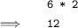
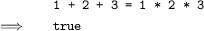
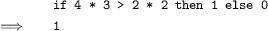
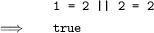
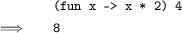

Summary of Basic OCaml

This chapter contains a summary of each OCaml construct used in the book, together with some examples. Pieces of OCaml syntax not contained in this chapter will be introduced as and when they are needed throughout the rest of the book. Existing OCaml programmers may skip this chapter.

Simple Data Types

Integers `min_int `… `-3` `-2` `-1` `0` `1` `2` `3` … `max_int `of type int. Booleans `true `and `false `of type bool. Characters of type char like `'X' `and `'!'`.

Mathematical operators `+ - * / mod `which take two integers and give another.

Operators  `=  <  <=  >  >=  <> ` which compare two values and evaluate to either `true `or `false`.

The conditional `if `expression1 `then `expression2 `else `expression3, where expresssion1 has type bool and expression2 and expression3 have the same type as one another.

The boolean operators `&& `(logical AND) and `|| `(logical OR) which allow us to build compound boolean expressions.

Tuples to combine a fixed number of elements `(a, b)`,  `(a, b, c) `etc. with types α × β,  α × β × γ etc. For example, `(1, '1') `is a tuple of type int × char. On the screen, OCaml writes `'a `for α etc.

Strings, which are sequences of characters written between double quotes and are of type string. For example, `"one" `has type string.

Names and Functions

Assigning a name to the result of evaluating an expression using the `let` name `=` expression construct.

`let x = 5 > 2` x is new, and is `false`

Building compound expressions using `let` name1 `= `expression1 `in` `let` name2 `=` expression2 `in` …

`let x = 4 in let y = 5 in x + y`

Anonymous (un-named) functions `fun `name `-> `expression.

Making operators into functions as in `( < ) `and `( + )`.

`( + ) 1 2` `3`

Functions, introduced by `let` name argument1 argument2 … `=` expression. These have type α → β, α → β → γ etc. for some types α, β, γ etc. For example, `let f a b = a > b` is a function of type α → α → bool.

Recursive functions, which are introduced in the same way, but using `let rec `instead of `let`. For example, here is a function `g `which calculates the smallest power of two greater than or equal to a given positive integer, using the recursive function `f`:

`let rec f x y =`  
`  if y < x then f x (2 * y) else y`  
  
`let g z = f z 1`

Mutually recursive functions, introduced by writing `let rec f x = …  and g y = … and …`

Pattern Matching

Matching patterns using `match `expression1 `with `pattern1 `| `… `-> `expression2 `| `pattern2 `| `… `-> `expression3 `|`…The expressions expression2, expression3 etc. must have the same type as one another, and this is the type of the whole `match `… `with `expression. The special pattern `_ `which matches anything.

`match x with`  
`  0 -> 1`  
`| 1 | 2 -> 3`  
`| _ -> 4`

Matching two or more things at once, using commas to separate as in `match a, b with 0, 0 -> `expression1 `| x, y ->`  expression2 `| `…

`match x, y, z with`  
`  0, 0, 0 -> true`  
`| _, _, _ -> false`

Lists

Lists, which are ordered collections of zero or more elements of like type. They are written between square brackets, with elements separated by semicolons e.g. `[1; 2; 3; 4; 5]`. If a list is non-empty, it has a head, which is its first element, and a tail, which is the list composed of the rest of the elements.

The `::` “cons” operator, which adds an element to the front of a list. The `@ `“append” operator, which concatenates two lists together.

`1 :: [2; 3]` `[1; 2; 3]`  
`[1; 2] @ [3]` `[1; 2; 3]`

Lists and the `::` “cons” symbol may be used for pattern matching to distinguish lists of length zero, one, etc. and with particular contents. For example, we can calculate the length of a list:

`let rec length l =`  
`  match l with`  
`    [] -> 0`  
`  | _::t -> 1 + length t`

Exceptions

Defining exceptions with `exception `name. They can carry extra information by adding `of `type. Raising exceptions with `raise`. Handling exceptions with `try `… `with` …

`exception Problem of int`  
  
`let f x y =`  
`  if y = 0`  
`    then raise (Problem x)`  
`    else x / y`  
  
`let g x y =`  
`  try f x y with Problem p -> p`

Partial Application

Partial application of functions by giving fewer than the full number of arguments. Partial application with functions built from operators.

`let add x y = x + y`  
  
`List.map (add 3) [1; 2; 3]`  
`[4; 5; 6]`  
  
`List.map (( + ) 3) [1; 2; 3]`  
`[4; 5; 6]`

New Data Types

New types with `type `name `= `constructor1 `of `type1 `| `constructor2 `of `type2 `| `… Pattern matching on them as with the built-in types. Polymorphic types.

`type colour =`  
`  Red | Blue | Green | Grey of int`  
  
`[Red; Blue; Grey 16]` this has type colour list  
  
`type 'a tree =`  
`   Lf`  
`| Br of 'a tree * 'a * 'a tree`  
  
For example, `Br (Lf, 'X', Br (Lf, 'Y', Lf))` has type char tree. A useful built-in data type is the option type, defined as `type 'a option = None | Some of 'a`. A type can be polymorphic in more than one type parameter, for example `('a, 'b) Hashtbl.t`, as in the Standard Library.

Basic Input / Output

The value `() `and its type unit. Input channels of type in_channel and output channels of type out_channel. Built-in functions such as `open_in`, `close_in`, `open_out`, `close_out`, `input_char`, `output_char `etc. for reading from and writing to them respectively.

Mutable State

References of type α ref. Building them using `ref`, accessing their contents using `! `and updating them using the `:= `operator.

` # let p = ref 0;;  `  
`val p : int ref = {contents = 0}  `  
`# p := 5;;  `  
`- : unit = ()  `  
`# !p;;  `  
`- : int = 5 `

Arrays of type α array written like `[|1; 2; 3|]`. Creating an array with the built-in function `Array.make`, finding its length with `Array.length`, accessing an element with `a.(`subscript`)`. Updating with `a.(`subscript`)` `<- `expression.

`let swap a x y =`  
`  let t = a.(x) in`  
`    a.(x) <- a.(y); a.(y) <- t`

Bracketing expressions together with `begin `and `end `instead of parentheses for readability.

`if x = y then`  
`  begin`  
`    a := b;`  
`    c := d`  
`  end`  
`else`  
`  e := f`

Performing an action many times based on a boolean condition with the `while `boolean expression `do` expression `done `construct.

`while !x < y do x := !x * 2 done`

Performing an action a fixed number of times with a varying parameter using the `for `name `= `start `to `end `do` expression `done `construct.

`for x = 1 to 10 do print_int x done`

Floating-point Numbers

Floating-point numbers `min_float `… `max_float `of type float. Floating-point operators `+. *. -. /. ** `and built-in functions `sqrt log `etc.

`2. ** 0.2` `1.1486983549970351`

The OCaml Standard Library

Using functions from the OCaml Standard Library with the form Module`.`function. For example, `List.map`, `String.length`, `Array.copy `etc. The Buffer module allows the efficient collation of strings into larger ones.

Simple Modules

Writing modules in `.ml `files. Building interfaces in `.mli `files with types and the `val `keyword. For example, the `.ml `file with contents `let f x = x + 1 `might have the interface `val f : int ->` `int`

Compiling Programs

The `ocamlc `and `ocamlopt `compilers. For example:  

`ocamlc -o x x.ml `builds `x `(or `x.exe`) from `x.ml `with the bytecode compiler.  

`ocamlopt -o x x.ml `builds `x `(or `x.exe`) from `x.ml `with the native code compiler.