Chapter 1  
Unravelling “Fold”

The List module in OCaml’s Standard Library defines two intriguingly-named functions over lists:

> 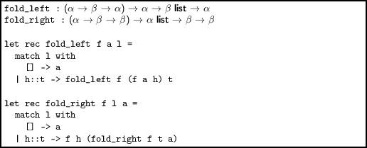

What do they do? And why are they considered important enough to include in the Standard Library? As we shall see, they abstract the idea of recursion over lists with an accumulator in a most delightfully generic way.

Let us first examine `fold_left `and its rather complicated type. The first argument is itself a function, which takes the existing accumulator and an element from the input list, combines them in some fashion, and returns a new accumulator, ready for the next element. So, in general, the first argument has type α → β → α. Then we have an initial value for the accumulator, which must have type α, and an input list of type β list. The return value is the final accumulator, so that must have type α. We can annotate the function as follows:

> 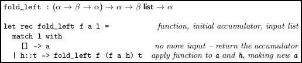

We can find the sum of a list of numbers:

Here, α and β are both int. The function `( + ) `has the right type, and we use for the initial accumulator the identity element for `( + ) `which is 0 since for all x, x + 0 = x (we cannot take the initial accumulator from the list itself since our function must have a result for the sum of all the integers in an empty list.)

It might appear to the reader that this is more complicated than the simple recursive solution, but to the experienced functional programmer, using `fold_left `is in fact easier to read. Let us find the maximum number in a list using `fold_left`:

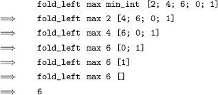

Here `max `is the built-in function for finding the larger of two things, and `min_int `is the built-in value of the smallest possible integer. We can use a similar scheme to define functions on lists of booleans:

> 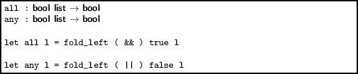

The `all `function is true if and only if all items in the list are true; the `any `function if at least one is. What can happen when α and β are different? How about making the accumulator a list too? We can use `List.mem `to turn an arbitrary list into a set by consulting the existing accumulator before putting an element in:

> 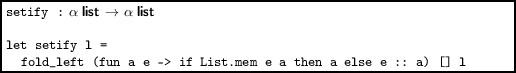

We are using `List.mem `to decide whether to add each element to the accumulator or discard it.

What about `fold_right`?

Here is the function again:

> 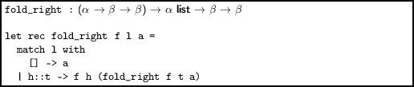

The `fold_left `function applied the given function over the elements in the input list from the left hand side. In contrast, `fold_right `processes them from the right, by changing the evaluation order. Consider, for example, our summation example:

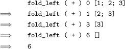

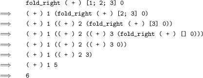

See how the accumulating of values starts from the right hand side. Note also that `fold_right `is not tail-recursive (the intermediate expression it builds is proportional to the size of the input). We can define `map` simply as a use of `fold_right`.

> 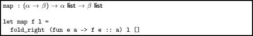

Who would have thought that `fold_right `was the more fundamental function? At the cost of a list reversal, we can make `fold_right `tail-recursive by defining it in terms of `fold_left`:

> 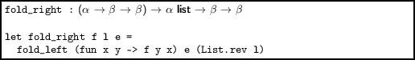

Sometimes we want to provide an initial accumulator value which is not the identity element for the computation. For example, applying `:: `over an input list with `fold_right `is not very interesting, yielding a function which returns a copy of its input:

> 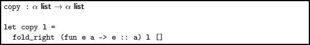

But if we supply a non-empty list as the initial value of the accumulator, we have the `append` function:

> 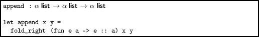

We can use a more complicated accumulator, such as a tuple. In this example, we replicate the `List.split` function which, given a list of pairs, yields a pair of lists:

> 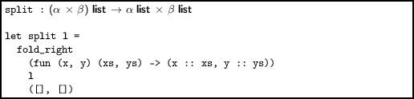

For example, `split [(1, "one"); (2, "two")] `evaluates to `([1; 2], ["one"; "two"])`.

A word of caution

One very simple definition for the function `concat `which concatenates all lists in a list of lists is given by:

> 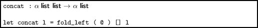

We use the append function to accumulate the lists into a single list one by one:

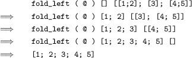

However, the order of evaluation is such that the append function `@ `(which takes time proportional to the length of its first argument) is used inefficiently – we process the list again and again.

Folding over trees

For the usual definition of a binary tree, we can define a fold. There are two accumulators, one for everything from the left sub-tree, and one for everything from the right sub-tree. The supplied function combines both into a new accumulator.

> 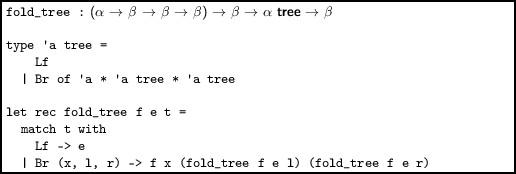

Here is an example tree:

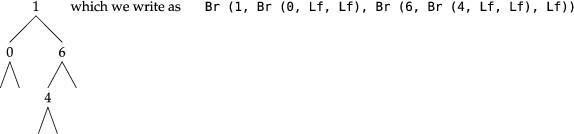

Functions for the size of a tree, and the sum of an integer tree are now easy, without explicit recursion:

> 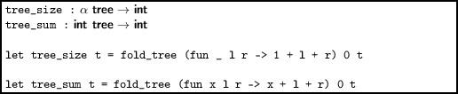

The standard tree traversals can be written easily with a list accumulator. A little typographical manipulation shows the pleasing symmetry:

> 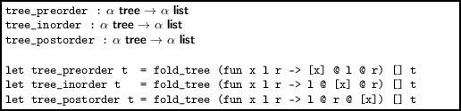

On our example list:

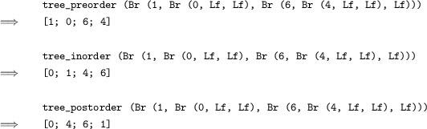

Questions

1.  Write a function which, given a list of integers representing expenses, removes them from a budget, again represented by an integer.
2.  Calculate the length of a list using one of the `fold_ `functions.
3.  Use one of the `fold_ `functions to find the last element of list, if any. Behave sensibly if the list is empty.
4.  Write a function to reverse a list, using one of the `fold_ `functions.
5.  Write a version of `List.mem `using one of the `fold_ `functions. Now `setify `can be defined entirely using folds.
6.  Use a fold to write a function which, given a list of non-empty strings representing words, returns a single string where the words are separated by spaces. Comment on its efficiency.
7.  Use `fold_tree `to write a function which calculates the maximum depth of a tree. What is its type?
8.  Compare the time efficiency of one or more of your functions with the system implementation of the same function (for example, our fold-based member function vs. `List.mem`) with regard to both computational complexity and actual time taken.
9.  Comment on whether the use of folds in each of Questions 1–7 is good style.