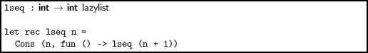
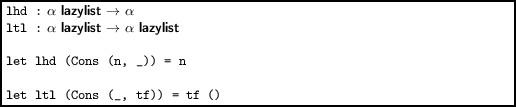
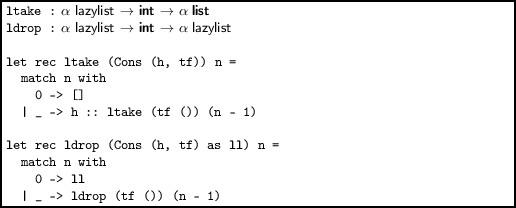
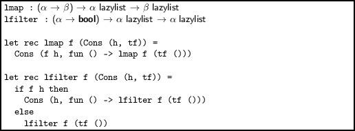
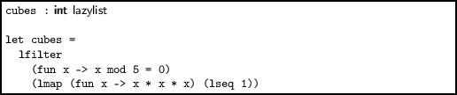
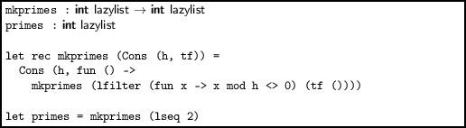
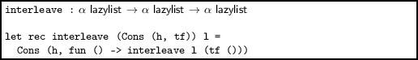
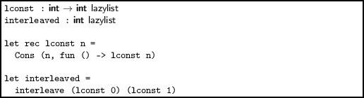
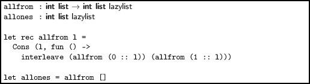
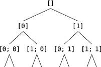

Chapter 2  
Being Lazy

We can make our own data type for OCaml’s built-in lists like this:

`type 'a list = Nil | Cons of 'a * 'a list`

The constructor `Nil `represents the empty list, and `Cons `builds a list from a head and a tail. So, for example, we can write the list `[1; 2; 3] `as `Cons (1, Cons (2, Cons (3, Nil)))`. It is also possible to define an infinitely-long list, where elements are only produced when we actually need them. This is known as a lazy list. Instead of a tail, we use a tail function. This is a function which, when given a unit value, yields the tail:

`type 'a lazylist = Cons of 'a * (unit -> 'a lazylist)`

Note that we have no `Nil `constructor, because the list has no end. Our use of unit rather than another type is a choice – we could use any type, but unit is the simplest type, containing only one value. How do we use such a creature? Let us start by writing a function which, given an integer n, builds the lazy list of all integers n,n + 1,n + 2… and returns it:

> 

When we type this in to the OCaml top level, here is what we see:

`        OCaml`  
  
`# lseq 0;;`  
`- : int lazylist = Cons (0, <fun>)`

We can see that the head of the list is zero – the rest is yet to be calculated. OCaml represents the tail function with `<fun>`. We can now write functions to extract items from the list. Here are lazy head and tail functions:

> 

Notice that, because there is only one constructor in our data type, we can pattern match directly in the function argument. When we apply the unit `() `to the tail function, we are forcing evaluation of the tail. Here are lazy versions of the familiar `take `and `drop `functions, which take or drop the first n elements of a list:

> 

The `ltake `function has to yield an ordinary list, of course. Note the use of the `as `keyword to name part of the pattern (here, `Cons (h, tf) `is named `ll`), making the base case of `ldrop `simpler. Now we can actually get at our elements:

`        OCaml`  
  
`# ltake (lseq 0) 20;;`  
`- : int list =`  
`[0; 1; 2; 3; 4; 5; 6; 7; 8; 9; 10; 11; 12; 13; 14; 15; 16; 17; 18; 19]`  
`# ldrop (lseq 0) 20;;`  
`- : int lazylist = Cons (20, <fun>)`

Two favourite list functions have easy analogues in the lazy world:

> 

Note that delaying and forcing evaluation often come together, as in both these examples. The function `map` returns almost immediately – assuming `f `is quick. The computation of the rest of the elements is, as always, delayed. The `filter `function is different – it must find at least one matching element to use as the head, before returning. If it does not find one, it will never return, so care is needed. Let us use these two functions to find the cubes divisible by five:

> 

Now, using `ltake`:

`        OCaml`  
  
`# ltake cubes 20;;`  
`- : int list =`  
`[125; 1000; 3375; 8000; 15625; 27000; 42875; 64000; 91125; 125000; 166375;`  
` 216000; 274625; 343000; 421875; 512000; 614125; 729000; 857375; 1000000]`

Here is another example of a simple lazy list, this time the list of all primes, created by use of `lfilter `and recursion, beginning with the list of all numbers from 2, calculated with `lseq`:

> 

There are plenty of list functions which cannot be adapted to lazy lists. We cannot, for example, reverse a lazy list, or append two lazy lists. But there is an analogue to `append`. We can combine two lists fairly, taking elements in turn from each:

> 

For example, the list alternating between zeros and ones can be built with `interleave `and a function to build constant lists:

> 

A more interesting example is to calculate the lazy list of all ordinary lists of zeros and ones. We can do this by prepending a zero and a one to the list, and interleaving the resulting lists:

> 

This yields:

`        OCaml`  
  
`# ltake allones 20;;`  
`- : int list list =`  
`[[]; [0]; [1]; [0; 0]; [0; 1]; [1; 0]; [1; 1]; [0; 0; 0]; [0; 0; 1];`  
` [0; 1; 0]; [0; 1; 1]; [1; 0; 0]; [1; 0; 1]; [1; 1; 0]; [1; 1; 1];`  
` [0; 0; 0; 0]; [0; 0; 0; 1]; [0; 0; 1; 0]; [0; 0; 1; 1]; [0; 1; 0; 0]]`

To see why, we can visualise the evaluation as a tree where each left branch prepends a zero and each right branch a one:

The interleavings are fair, and the interleavings of interleavings equally so, thus we see the results of length two in this order: `[0; 0] [0; 1] [1; 0] [1; 1]`.

Questions

1.  Write the lazy list whose elements are the numbers 1, 2, 4, 8, 16… What is its type?
2.  Write a function to return the nth element of a lazy list where element zero is the head of the list.
3.  Write a function which, given a list, returns the lazy list forming a repeated sequence taken from that list. For example, given the list `[1; 2; 3] `it should return a lazy list with elements 1, 2, 3, 1, 2, 3, 1, 2…
4.  Write a lazy list whose elements are the fibonacci numbers 0, 1, 1, 2, 3, 5, 8… whose first two elements are zero and one by definition, and each ensuing element is the sum of the previous two.
5.  Write the function `unleave `which, given a lazy list, returns two lazy lists, one containing elements at positions 0, 2, 4, 6… of the original list, and the other containing elements at positions 1, 3, 5, 7…
6.  Alphanumeric labels in documents go A,B,C,…,X,Y,Z,AA,AB,…,BA,BB,…AAA,…  Write the lazy list containing strings representing this sequence.