Chapter 5  
Streams of Bits

We have dealt with byte-by-byte streams of information. Often, though, we need to consider data as a stream of bits. Can we build a nice abstraction for this?

We could start with a function which builds a list of bits from a byte, and use that for each byte in the stream, building a final list. This has two disadvantages: it is inefficient in space and time (there are eight times as many bits as bytes, of course), and it processes all the bytes at once, rather than as required. Instead, let us build a bit stream based on our input type:

`type input_bits =`  
`     {input : input;`  
`      mutable byte : int;`  
`      mutable bit : int}`

The `input `field is the input this bit stream is based upon. It will start from the most significant bit of the current byte of that input. The `byte `field holds the byte just read from the input, or an undefined value if no byte has yet been read. The `bit `field records the current bit position, but instead of 0..7 we will use 128, 64, 32, 16, 8, 4, 2, 1 so this field can be used directly to extract the bit using the built-in logical AND operator `land`, and then halved:

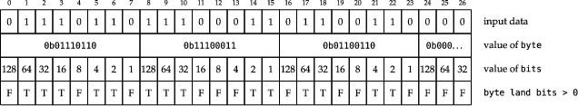

The expression `x land y `where `x `and `y `are integers yields an integer whose value has a bit pattern which is the bitwise logical AND of `x `and `y`. This input_bits type can be wholly abstracted, defined in the `.mli `by just `type input_bits`. Now, we can define a function to build an input_bits from an input:

> 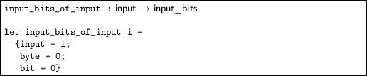

The function to get the next bit is simple. If `bit `is zero, we must load a new `byte `from the input and return the next bit. If `bit `is non-zero, we extract the given bit, and halve `bit `ready for next time.

> 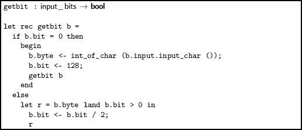

This function can raise `End_of_file`, of course, if the underlying call to `input_char `raises it. Two other functions are useful. We can align the bit stream on the next byte boundary trivially:

> 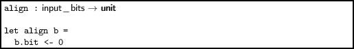

We can write a function `getval `to return a given number of bits considered as an integer, allowing us to read a data field of any width. We use the `lor `operator, which gives the bitwise logical OR of two integers, and the `lsl `or logical shift left operator, which shifts the bits in an integer left by the specified number of bits, filling zeros on the right.

> 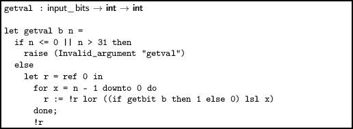

OCaml integers are at least 31 bits (depending upon the computer), so we can read fields up to 31 bits wide with this function. This number on a particular computer can be calculated by evaluating `Sys.word_size -` `1`.

Example: decoding a TCP datagram header

Here is the layout of the header of a datagram of the TCP (Transmission Control Protocol) used for network communications:

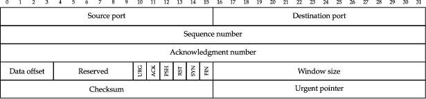

It contains fields as small as 1 bit, and as large as 32 bits. We shall use the following 20 byte TCP datagram header as an example: `00 26 bb 14 62 b7 cc 33 58 55 1e ed 08 00 45 00 03 78 f7` `ac`.

The code in Figure 5.1, to print out pertinent information from the header, uses `getbit`, `getval`, and a yet-to-be-defined function `getval_32 `to read the header of a TCP datagram and print a summary. The function `getval_32 `returns up to 32 bits in an Int32.t (implementing `getval_32 `is one of the questions at the end of the chapter). Here is the output for our example data:

------------------------------------------------------------------------

> 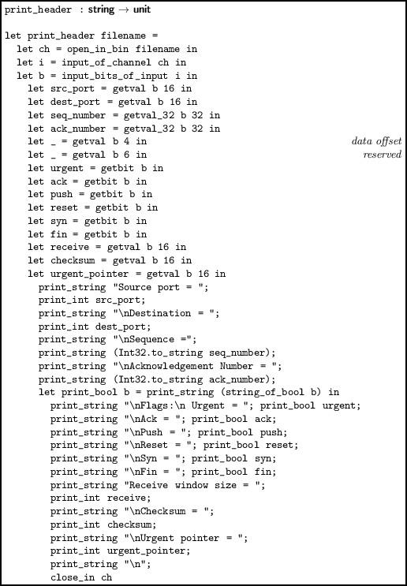

 

> Figure 5.1:

------------------------------------------------------------------------

` Source port = 38  `  
`Destination = 47892  `  
`Sequence = 1656212531  `  
`Acknowledgement Number = 1481973485  `  
`Flags:  `  
` Urgent = false  `  
` Ack = false  `  
` Push = false  `  
` Reset = false  `  
` Syn = false  `  
` Fin = false  `  
`Receive window size = 17664  `  
`Checksum = 888  `  
`Urgent pointer = 63404 `

Note we must use `open_in_bin `for binary data files in case the program is executed on Microsoft Windows, where text and binary files are considered different and read differently.

Output bit streams

The type for output bit streams is rather similar to that for input bit streams, but it must be used rather differently.

`type output_bits =`  
`     {output : output;`  
`      mutable obyte : int;`  
`      mutable obit : int}`

Here, `output `is the underlying output. The current output byte which is being constructed bit-by-bit is `obyte`, and a number `obit `from 7 down to 0 to represent the current shift required to add a bit to the byte in the correct place. When it is time to move on to the next byte, `obit `is -1. We can build a fresh output_bits from an output:

> 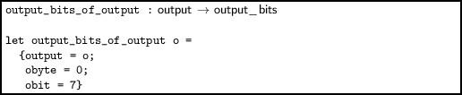

The whole byte cannot be written to the underlying `output `until it has been completed, so we must have a `flush `function to be used when output is finished:

> 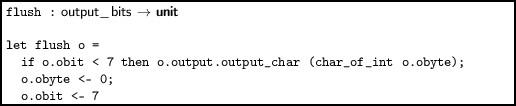

This doubles as our alignment function. We can now write `putbit`. For reasons we shall explain, it considers any non-zero input to be a `1 `bit.

> 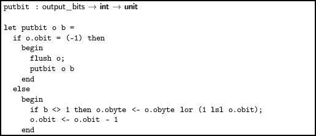

To output a value of width up to 31, we can write a function `putval o v l `which, given an output_bits, value, and length in bits, calls `putbit `on each bit in turn:

> 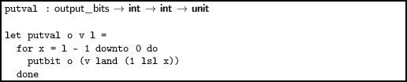

Now we can see why we allowed any non-zero integer to be considered a `1 `bit – it avoids a test in `putval`. Now we have everything we need.

We can rebuild the datagram we took apart earlier using `putbit`, `putval`, and the yet-to-be-defined `putval_32 `as shown in Figure 5.2. In the questions, you are asked to implement various specializations of some of our input and output functions on bit streams.

------------------------------------------------------------------------

> 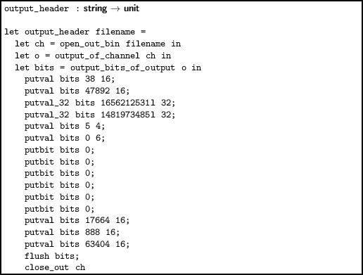

 

> Figure 5.2:

------------------------------------------------------------------------

Questions

 

1.  Specialize the function `getval `so that writing 8 bits at a time when the input is aligned is optimized. Benchmark this function against the naive one.
2.  Write the function `getval_32 `which can get a value of type Int32.t in the same fashion as `getval`.
3.  Specialize the function `putval `so that writing 8 bits at a time when the output is aligned is optimized. Benchmark this function against the naive one.
4.  Write the function `putval_32 `which can put a value of type Int32.t in the same fashion as `putval`.
5.  We said that the output_bits type needed a `flush `operation. In fact, this is not always true – for outputs built with, for example, `output_of_string`, we could write the current byte every time a bit is written, seeking back one byte each time, only moving on when the byte is actually finished. Implement this.