Chapter 6  
Compressing Data

Often we need to attempt to reduce the amount of space taken by some data, for storage or transmission. If data were arbitrary, it could not be compressed – to compress data we need to recognise and exploit patterns. However, most data is not arbitrary at all, but structured and containing repeated patterns. No compression scheme can guarantee to reduce the size of all inputs, but we would like to achieve good compression on typical data.

We will look at a simple byte-by-byte compression scheme, implementing it using our input and output data types so it can be applied to different kinds of inputs and outputs. Then, we will consider a more complex but efficient scheme for compressing data on a bit-by-bit basis.

A byte-by-byte compression scheme

The following extract from ISO-32000 (the PDF standard) defines a byte-by-byte compression scheme:

> The encoded data shall be a sequence of runs, where each run shall consist of a length byte followed by 1 to 128 bytes of data. If the length byte is in the range 0 to 127, the following length + 1 (1 to 128) bytes shall be copied literally during decompression. If the length is in the range 129 to 255, the following single byte shall be copied 257 - length (2 to 128) times during decompression. A length value of 128 shall denote EOD \[end of data\].

For example, consider the text “`((5.000000, 4.583333), (4.500000,5.000000))`”, which can be represented in ASCII as the list of integers `[40; 40; 53; 46; 48; 48; 48; 48; 48; 48; 44; 32; 52; 46; 53; 56; 51;` `51; 51; 51; 41; 44; 32; 40; 52; 46; 53; 48; 48; 48; 48; 48; 44; 53; 46; 48; 48; 48; 48; 48; 48;` `41; 41] `of length 43. This will be compressed as shown in Figure 6.1. That is to say, as `[255; 40; 1; 53;` `46; 251; 48; 5; 44; 32; 52; 46; 53; 56; 253; 51; 6; 41; 44; 32; 40; 52; 46; 53; 252; 48; 2; 44;` `53; 46; 251; 48; 255; 41; 128]`, of length 35. The maximum compression ratio achieved with this method (for long constant data) is 64:1. The worst case (alternating bytes) is 127:128 – a slight expansion.

------------------------------------------------------------------------

> 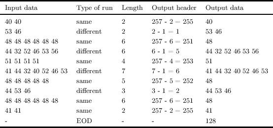

 

> Figure 6.1:

------------------------------------------------------------------------

Let us begin with two utility functions to allow us to convert between strings and lists of integers – this will make it easier to understand our examples when we evaluate them in OCaml’s top level:

> 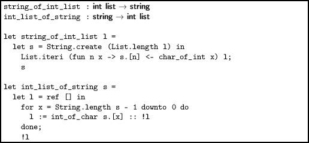

Note the use of the Standard Library function `List.iteri `which is like `List.iter`, but it passes an additional integer to the function each time, representing the position in the list, starting at 0. Note also that we use `downto `in `int_list_of_string `to avoid a list reversal.

Now, we shall build a little abstraction to allow our compression and decompression functions to share a common basis. Our `compress `and `decompress `function will need to read from any input, and write to any output. However, for our little tests, we shall be reading from and writing to strings. Since we do not know the size of the compressed or decompressed output in advance, we cannot allocate an appropriately sized string. So, let us build an output from a Buffer.t. This way, we can write a function `process `which, given a compression or decompression function, creates a buffer, builds an output from it, calls the function to process the data, and then extracts the final string from the buffer.

> 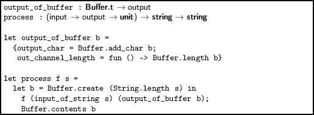

Now, given some suitable function `decompress`, say, we can call `process `giving the function and a string, and get a new string back.

Decompression in this scheme, as is often the case, is simpler than compression, so we shall address it first. The whole thing is wrapped in a loop which terminates only upon an exception. If the input data is well-formed, that exception will be `EOD`, which we have defined for this purpose. Inside the loop, we read a byte from the input. It is either in the range 0...127, in which case it is a “different” run, and we copy some bytes from input to output. Or, it is in the range 129...255, in which case it is a “same” run, and we output a number of copies of the next byte. Otherwise, the byte must have value 128, and we raise the `EOD` exception. The `decompress_string `function is as simple as we claimed it would be, because we wrote `process`.

> 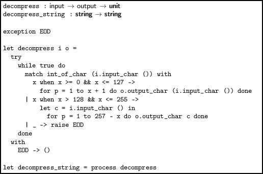

For compression, we will first write functions to recognise a “same” run and a “different” run in the input, and then a main function which uses them as appropriate. The function `get_same `returns the first character, and an integer representing the number (one or more) of “same” characters starting with the first one. It leaves the input pointing at the last “same” character. If 128 same characters have been found, we must stop early. If we are at the end of input when the function is called, `End_of_file `is raised as usual.

> 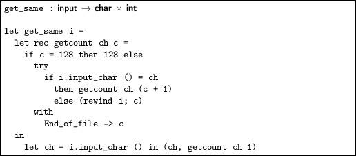

The `get_different `function is rather more awkward. It will return the non-empty list of “different” characters starting at the current position. We must stop as soon as we notice two like characters, rewinding twice and removing a character from our accumulator. So, for example, if we are reading “`An Accumulation`” we want to return `['A'; 'n'; ' '; 'A'] `but we do not know this until we read the second `'c'`. Again, we must stop after 128 differing characters. As before, `End_of_file `is raised if we are at the end of the input on the initial call.

> 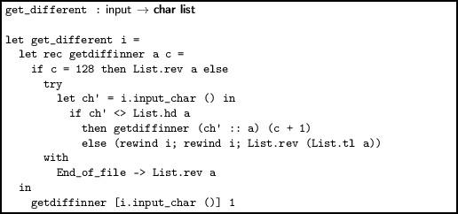

The compression function is now relatively simple. We repeatedly call `get_same`. If it indicates a run of length one, we call `get_different `instead. In each case we write appropriate data. Then, on `End_of_file`, we write the EOD marker. The `compress_string `function is built just like `decompress_string`.

> 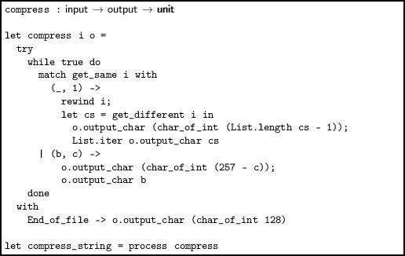

Let us try with our sample data:

`        OCaml  `  
`  `  
`# open Examples;;  `  
`# example;;  `  
`- : string = "((5.000000, 4.583333), (4.500000,5.000000))"  `  
`  `  
`# int_list_of_string example;;  `  
`- : int list =  `  
`[40; 40; 53; 46; 48; 48; 48; 48; 48; 48; 44; 32; 52; 46; 53; 56; 51; 51; 51;  `  
` 51; 41; 44; 32; 40; 52; 46; 53; 48; 48; 48; 48; 48; 44; 53; 46; 48; 48; 48;  `  
` 48; 48; 48; 41; 41]  `  
`  `  
`# let smaller = compress_string example;;  `  
`val smaller : string = "?(\0015.?0\005, 4.58?3\006), (4.5?0\002,5.?0?)\128"  `  
`  `  
`# int_list_of_string smaller;;  `  
`- : int list =  `  
`[255; 40; 1; 53; 46; 251; 48; 5; 44; 32; 52; 46; 53; 56; 253; 51; 6; 41; 44;  `  
` 32; 40; 52; 46; 53; 252; 48; 2; 44; 53; 46; 251; 48; 255; 41; 128]  `  
`  `  
`# decompress_string (compress_string example) = example;;  `  
`- : bool = true `

A bit-by-bit compression scheme

Our previous method required whole bytes to be equal to one another to compress well. Now we consider compression bit-by-bit, but on the same principle – encoding the lengths of runs of data. We will build a compressor and decompressor for the CCITT Group 3 compression scheme. This is the basic scheme used by the fax machines since the 1970s, and for 1 bit-per-pixel TIFF files. It is also used in the PDF format, as we shall see later in the book. Here is our example data, an 80x21, one-bit-per-pixel image of a scanned word from printed paper:

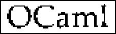

We can put it into our source file using the characters `0 `and `1 `to ease readability. A string can run over several lines if a backslash is added at the end of each line. Spaces at the beginning of the next line are also skipped, so we can line it up nicely:

`let input_data =`  
`"00000000000000000000000000000000000000000000000000000000000000000000000000000000\`  
` 00000000000000000000000000000000000000000000000000000000000000000000000001000000\`  
` 00000000111111110000000000011111111100000000000000000000000000000000000111100000\`  
`00000011000000011100000001110000001110000000000000000000000000000000000011000000\`  
`00000110000000001110000011000000000110000000000000000000000000000000000011000000\`  
`00001110000000000111000111000000000000000000000000000000000000000000000011000000\`  
`00001100000000000111000110000000000000000000000000000000000000000000000011000000\`  
`00001100000000000011001110000000000000000011100000000100111000011100000011000000\`  
`00011100000000000011001110000000000000001111111000111111111101111110000001000000\`  
`00011100000000000011101100000000000000001000011000001110001111000111000001000000\`  
`00011100000000000011101100000000000000000000011000001100000110000011000001000000\`  
`00011100000000000011001110000000000000000000011000001100000110000011000001000000\`  
`00001100000000000011001110000000000000000111011000001100000110000011000001000000\`  
`00001110000000000011000110000000000000011100011000001100000110000011000001000000\`  
`00001110000000000110000111000000000000011000011000001100000110000011000011000000\`  
`00000111000000000110000011100000000000011000011000001100000110000011000011100000\`  
`00000011100000001100000001110000000010010001110000011000001100000110000111000000\`  
`00000011111111100000000001111111111000111110111000111100011110000111001111100000\`  
`00000000011100000000000000001111000000001000000000000000000000000000000000000000\`  
`00000000000000000000000000000000000000000000000000000000000000000000000000000000\`  
`00000000000000000000000000000000000000000000000000000000000000000000000000000000"`

You can see that it consists of runs of 0 (white) and 1 (black) pixels, 80 to each line, with 21 lines.

Preliminaries

First, we had better define a function to convert the string of zeros and ones to a string containing the actual binary data. We can do this by building an output_bits with an output built from a buffer. Then, after flushing, we can use `Buffer.contents `to extract the data we have written.

> 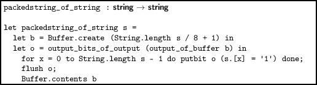

Note that, since the string will always be a whole number of bytes (possibly padded with zeros by `flush`) we must remember the width and height of our image (80 and 21 here) and pass one or both of them to some of our other functions. For example, we can write a function to print one of these packed binary strings. This needs the width of the image to know when to print newlines:

> 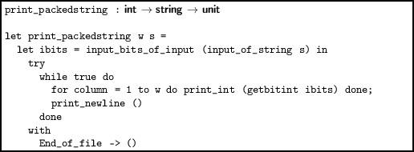

For simplicity here, we do not worry about padding at the end (in our example, since the width is 80, it will consist of whole bytes anyway).

Fax compression explained

We have said that the compression will proceed by encoding the lengths of the runs of zeros and ones in our data. How do we encode them? We need a set of binary sequences which can be distinguished from one another (i.e. no sequence can be a prefix of another sequence). In the case of fax compression, there are codes for run lengths 0 to 63, and different codes for white and black runs, as shown in Figure 6.2. Shorter codes are chosen for the more common cases, based on a statistical analysis of real documents.

------------------------------------------------------------------------

> 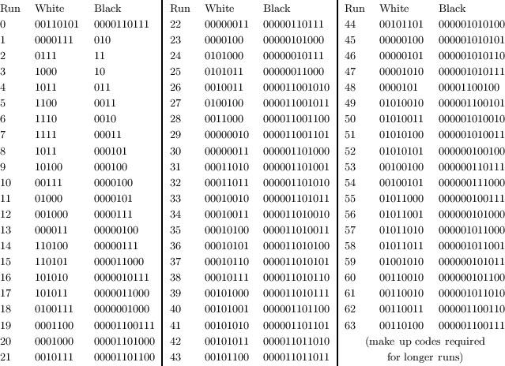

 

> Figure 6.2:

------------------------------------------------------------------------

Notice that no white symbol is a prefix of another white symbol, and no black symbol is a prefix of another black symbol. These codes for runs from 0 to 63 are called terminating codes. When a run is longer, we use one “make-up code”, shown in Figure 6.3, followed by a terminating code. Thus, the longest run is of length 1728 + 63 = 1791.

------------------------------------------------------------------------

> 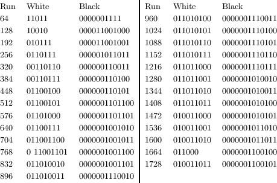

 

> Figure 6.3:

------------------------------------------------------------------------

The reason for distinguishing between white and black codes is to do with error correction in unreliable transport mechanisms (such as phone lines that fax machines operate over) – otherwise we could just have one set of codes and assume runs alternate. The reason for the existence of a zero-length run is that each line is defined to begin with a white run. If it is really black, a zero-length white run is output first. No run is longer than a line. As an example, let us compress the first three lines of our example data:

` 00000000000000000000000000000000000000000000000000000000000000000000000000000000  `  
`00000000000000000000000000000000000000000000000000000000000000000000000001000000  `  
`00000000111111110000000000011111111100000000000000000000000000000000000111100000 `

We have the following:

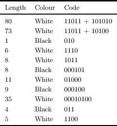

We have reduced the data from 240 bits to 64 bits, a reduction of about three quarters.

Compressing fax data

First, we need to encode the terminating and make-up codes. We will use arrays for direct indexing, but lists for each element, since we do not need random access to each bit. This is shown in Figure 6.4. Now, we can write a function which, given a length of run and a colour, gives the appropriate code as a list of bits:

------------------------------------------------------------------------

> 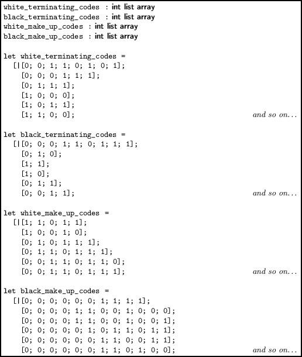

 

> Figure 6.4:

------------------------------------------------------------------------

> 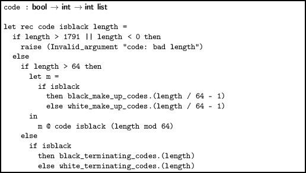

Now, a function which, given the current colour, an input_bits, the current number of like bits read, and the width of the image, returns a pair of the number of like bits, and the colour:

> 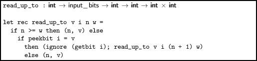

For example, the first call to `read_up_to `will calculate (80, 0). Now we can write the main function. Given an input_bits and output_bits, and the width and height of the image, for each line we check if a zero-width white run needs to be added, and then call `encode_fax_line`.

> 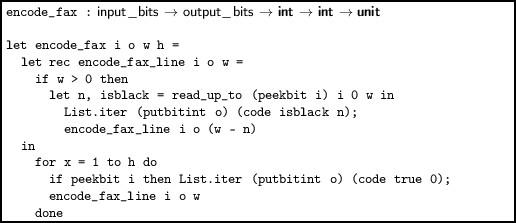

Now we can write a function `process`, just like we did in the byte-by-byte example, but for `input_bits `and `output_bits`. We must be sure to flush the output. The main `compress_string_ccitt `function is then simple:

> 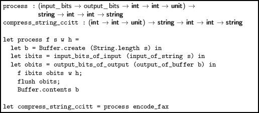

For our full input data, the input string is 80 × 21 = 1680 bits long, and the compressed string is 960 bits long, a compression ratio of 7:4.

Decompressing fax data

For decompression, we will write two functions for reading white and black codes. It is easiest to directly encode the decision tree:

> 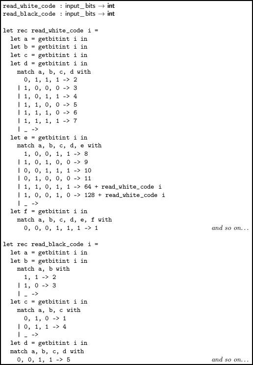

Now, decoding is relatively simple. We decode runs for each line, until the width is all used up, and do this for each line. We read white and black codes alternately – each line begins on white. We can use `process` again:

> 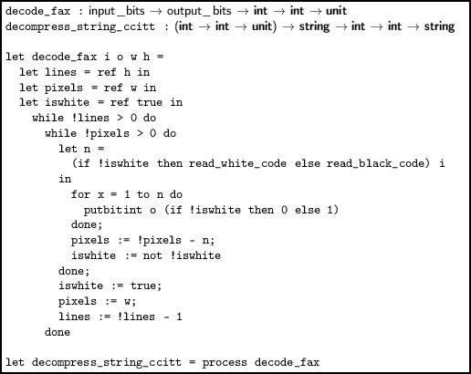

We can verify our code by evaluating `s = decompress_string_ccitt (compress_string_ccitt s) `for our example data.

Questions

 

1.  How much complexity did using the input and output types add to `compress `and `decompress `in our byte-by-byte example? Rewrite the functions so they just operate over lists of integers, in functional style, and compare the two.
2.  Replace our manual tree of codes with a tree automatically generated from the lists of codes used for compression. The tree will have no data at its branches (since no code is a prefix of another), and will have data at only some of its leaves. Define a suitable data type first.
3.  What happens if we compress our data as a single line of 1680 bits instead of 21 lines of 80? What happens if we try to compress already-compressed data?
4.  Write a function which, given input data, will calculate a histogram of the frequencies of different runs of white and black. This could be used to build custom codes for each image, improving compression.