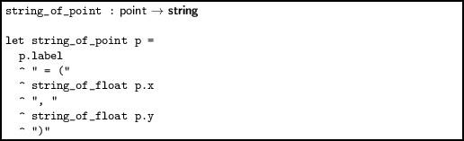
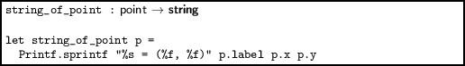
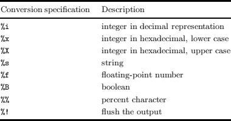
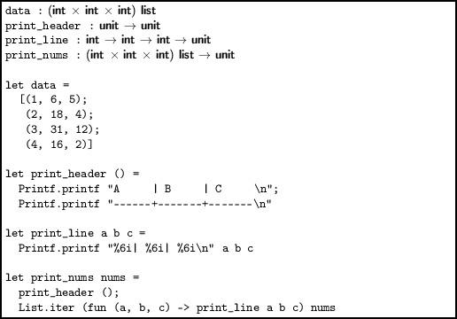
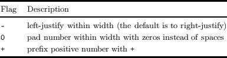
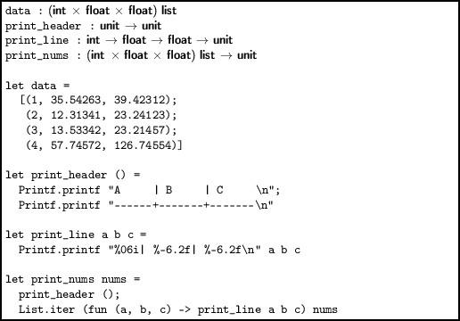
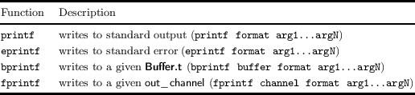
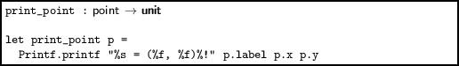

Chapter 8  
Formatted Printing

OCaml provides facilities for what is called formatted printing. Consider the following function, culled from Chapter 3:

> 

Using the function `sprintf `(“`f`ormatted `print`ing to a `s`tring”) from the Standard Library module Printf we can build this string more easily:

> 

In this example, the format string is `“%s = (%f, %f)”`. The conversion specifications `%s `and `%f `denote places for a string and the decimal representation of a floating-point number respectively to be substituted into the string. Other characters are simply reproduced from the format string to the output string. We have avoided the inefficient, repeated use of the `^ `operator for string concatenation, and our new example is both shorter and easier to read. Here is a subset of the many conversion specifications available:

The `sprintf `function knows how to match up the conversion specification with the arguments following the format specification at compile time, so run-time errors are avoided:

`        OCaml`  
  
`# Printf.sprintf "%s = (%f, %f)" "A" ``40` `65.8;;`  
`Error: This expression has type int but an expression was expected of type`  
`         float`

Indeed, even if we use partial application, the type of the resulting function will be calculated:

`        OCaml`  
  
`# let f = Printf.sprintf "%s = (%f, %f)" "A" 2.45;;`  
`val f : float -> string = <fun>`

You might be able to guess that there is a little magic going on here – we could not write `sprintf `ourselves, for example. We can see the rather complicated type of the `sprintf `function, used for its internal implementation:

`        OCaml`  
  
`# Printf.sprintf;;`  
`- : ('a, unit, string) format -> 'a = <fun>`

For printing numbers, there are some additional pieces of information which can be provided. The format of a conversion specifier is in fact:

`%`⟨flags⟩⟨width⟩⟨`.`precision⟩type

Fields enclosed in angle brackets are optional. So far, we have only used the `% `character and the type field. The width field defines the width of the representation of the number, and can be used to line things up in columns, here of width six:

> 

This will result in the following output from `print_nums data`:

`A     | B     | C`  
`------+-------+-------`  
`     1|      6|      5`  
`     2|     18|      4`  
`     3|     31|     12`  
`     4|     16|      2`

Here are some possible values of the flags field:

The optional precision field specifies the number of digits after the decimal point. For example, let us print some integers and floating-point numbers in columns with differing flags and precisions:

> 

This will result in the following output from `print_nums data`:

`A     | B     | C`  
`------+-------+-------`  
`000001| 35.54 | 39.42`  
`000002| 12.31 | 23.24`  
`000003| 13.53 | 24.21`  
`000004| 57.75 | 126.75`

Printing to other places

Of course, once we have calculated a string using `sprintf`, we can do with it what we may – however, for convenience and efficiency, the Printf module provides several other functions:

These all return unit. For example, to write a point to standard output, using the `%! `conversion specification to flush each time so screen update is immediate:

> 

It might be argued, though, that it is better to keep `string_of_point `as the basic function, so it can be reused in other situations, writing the generated string to the screen from the calling function instead.

Questions

 

1.  Given a list of pairs of integers such as `[(1, 2); (5, 6); (6, 6); (7, 5)]`, write a function to return a string representation such as `"(1, 2) --> (5, 6) --> (6, 6) --> (7, 5) --> (1,` `2)"`.

2.  Write a function which, given a string, returns another string which represents the first using hexadecimal numbers. For example, the input string `Hello `should yield the output `48656c6c6f` since `'H' `has ASCII code `0x48 `and so on.

3.  Why does the following code cause a type error?

    ` # let mkstring () = "string";;  `  
    `val mkstring : unit -> string = <fun>  `  
    `# Printf.printf (mkstring ());  `  
    `  ;;  `  
    `Error: This expression has type string but an expression was expected of type  `  
    `         ('a, out_channel, unit) format =  `  
    `           ('a, out_channel, unit, unit, unit, unit) format6 `

    What can be done to fix it?

4.  Use the `* `syntax described in the Printf module documentation to write a function which can print a table of integers to a given width. For example, given width 10, we might see:

    ` (         1)  `  
    `(        23)  `  
    `(     33241)  `  
    `(         0) `