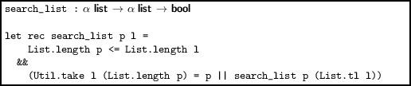
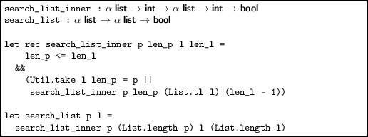
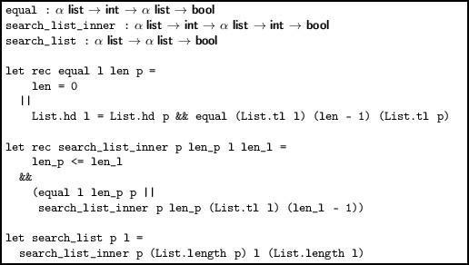
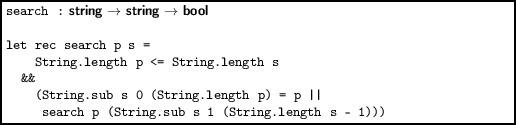
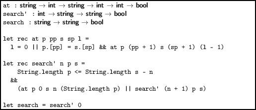
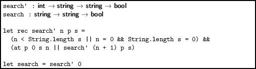
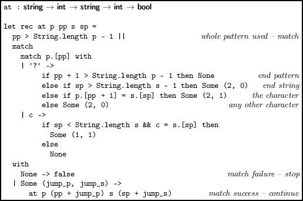
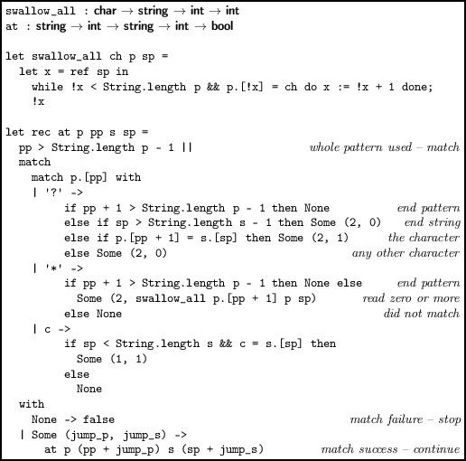
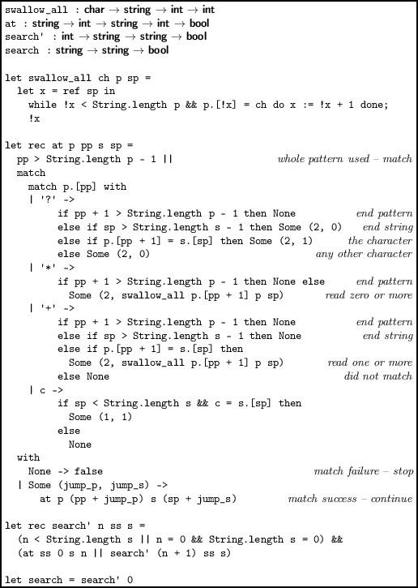

Chapter 9  
Searching for Things

How do we look for a sequence in another, longer sequence? Suppose we want to write a function `search_list` which, given the list `p `(the pattern) to search for in the list `l `determines if it exists (i.e. if it is a sub-list). For example, the list `[1; 2] `is found in `[2; 1; 2; 2] `but not in `[2; 1; 1]`. A list `p `is defined to be a sub-list of a list `l `if there exist lists `x `and `y `such that `l = x @ p @ y`. One, two, three, or all four of `x`, `p`, `y`, `l `can be the empty list, of course. So, for example, `[] `is a sub-list of `[1; 2; 3] `and of `[]`. A list `p `is a sub-list of `l` if:

- The length of `p `is less than or equal to the length of `l `and either
- The sub-list `p `is found at the beginning of `l`, or
- The list `p `is a sub-list of the tail of `l`

We can write this out easily, using the `take `and `drop `functions from our Util module, described on page xiii:

> 

(Recall that the `|| `operator does not evaluate its right hand side if the left hand side evaluates to `true`, so this function will exit as soon as it finds a match.) We might be worried about the call `List.tl `failing, but if `l `is empty, the pattern must be empty from the first test, and so the condition with `Util.take `would have succeeded already. You can see that there are two inefficiencies here, the use of `List.length `on `p `and `l `each time around, and the explicit building of the list to check the pattern against with `Util.take`. Let us remove the first one:

> 

Now, `List.length `is called only at the beginning. We can also remove `Util.take `to avoid the construction of intermediate lists, by writing an explicit function to test the pattern against the first `len_p `items in the lists:

> 

This is now about as efficient as our simple approach can get.

Searching in strings

For practical applications, we shall often need to search within strings, or other such random-access structures. Our first list version generalizes easily:

> 

This time, there is no problem with `String.length `since, unlike `List.length`, it runs in constant time. We do have the overhead of the first `String.sub`, analogous to the `Util.take `in the list version. The second `String.sub `is also a problem since, unlike `List.tl`, it creates a new string.

To solve this, we can define an auxiliary function `at `which, given pattern `p`, string `s `and the length `l `to test, together with the position in the pattern `pp `and in the main string `sp`, tests for equality. This is similar to `equal `in our lists example.

> 

The `search' `function itself has a counter for how far along the main string it is. We initialize this to zero in `search`.

More flexible searches

We can make our searching function more interesting by allowing the use of some special characters. We shall introduce only these simple constructs:

- A `? `character matches zero or one instances of the following character. For example, the pattern `?abc `matches `abc`, `bc`, and `dbc`;
- A `* `character matches zero or more instances of the following character. So, the pattern `*abc` matches `bc`, `abc`, and `aaabc`;
- A `+ `character matches one or more instances of the following character. For example, the pattern `+abc `matches `abc `and `aaabc `but not `bc `or `dbc`.

Let us add the `? `character to begin with. First, we must alter our `search' `function’s terminating condition – we can no longer just finish when the pattern is longer than the remaining part of the string – the length of the pattern and the length of the characters matching that pattern are no longer always equal. We now continue only when the position `n `is less than the length of the string, or it is equal to the length of the string and that length is zero (the latter case is required so that the pattern `?a `matches the empty string).

> 

Now we can alter the `at `function itself. We have an initial terminating condition – if the pattern has been used up entirely, we must have matched it. Otherwise, we match on the next character in the pattern, to see if the next part of the pattern matches and, if it does, calculate `jump_p` (the amount to move forward in the pattern) and `jump_s `(the amount to move forward in the string).

> 

Note the behaviour of the `? `case carefully, with regard to its specification – this kind of matching code can be rather subtle. To deal with `* `we must have a way of matching zero or more instances of a character, moving as far along the string as possible. The function `swallow_all `below, given a character `ch`, a string `p `and a position `sp`, returns the number of characters which match `ch `starting at `sp`. We can then add a match case for the `* `specifier, as shown in Figure 9.1.

------------------------------------------------------------------------

> 

> Figure 9.1:

------------------------------------------------------------------------

The `+ `character can be added with `swallow_all `too, but we must check that there is at least one matching character. Figure 9.2 shows the whole program in one place.

------------------------------------------------------------------------

> 

> Figure 9.2:

------------------------------------------------------------------------

Questions

1.  Write a function to return the number of matches of one string in another a) when all matches are considered and b) when only non-overlapping matches are considered.
2.  Write functions which return the position and length of the longest prefix of a string in another. That is to say, the longest initial part of the pattern which matches anywhere in the string.
3.  Compare the speed of the first two versions of `search `given in this chapter.
4.  Add the special symbol `\ `to our final search program. It indicates that the following symbol is not a special symbol, but a normal character. Note that, we must write `'\\' `for that character in OCaml code.
5.  Add a labelled argument of type bool whose value, when true, indicates a case-insensitive search.