Chapter 10  
Finding Permutations

How can we calculate the n! permutations of a given list of length n? For example, given the list `[1; 2; 3] `we should like to find `[[1; 2; 3]; [2; 1; 3]; [2; 3; 1]; [1; 3; 2]; [3; 1; 2]; [3; 2; 1]] `or similar (we are not concerned with the order of the list of permutations). So, we require a function of type α list → α list list.

Sometimes it is useful with a hard problem like this to simply start writing, working out what gaps there are, and then filling them in. The base case for our `perms `function is trivial: there is one permutation of the empty list, namely the empty list itself:

> 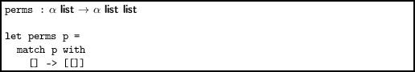

For the main case, let us try the most simple decomposition. We calculate the permutations of the tail for free with recursion, and then combine the result in some way with the head:

> 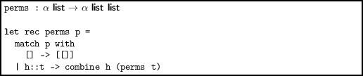

Here, `combine `is a function we have yet to concoct. It must take a list of permutations, such as `[[3;` `2]; [2; 3]] `and a single element, such as `1`, and produce `[[1; 2; 3]; [2; 1; 3]; [2; 3;` `1]; [1; 3; 2]; [3; 1; 2]; [3; 2; 1]]`. The elements of this list can be produced by placing `1 `in each possible place in each list in `[[3; 2]; [2; 3]]`. So first, we will reduce the problem by using `List.map `with an as-yet-unwritten function `interleave`, combining the results with `List.concat`:

> 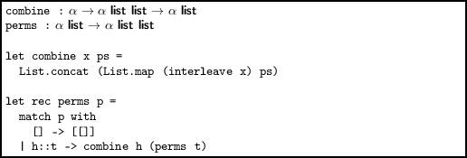

Now, we just need to build the function `interleave `which takes an item, such as `1 `and a list such as `[2; 3]` and builds the list `[[1; 2; 3]; [2; 1; 3]; [2; 3; 1]] `by placing the item at each possible position in the list.

> 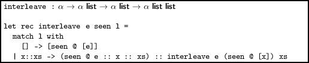

This function maintains a list of the elements already seen (which is initially empty), building each new list. When the input list is empty, the final one is generated. Thus, we avoid any kind of counter to know when we are finished. For example, consider a call to `interleave `in our example:

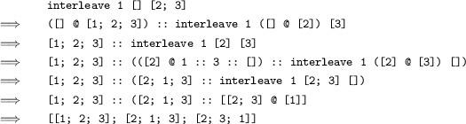

Now we can write the whole thing out:

> 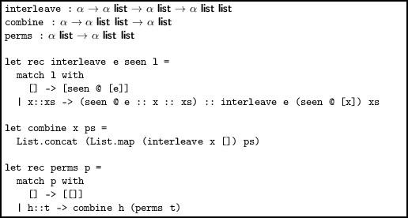

Here are the 24 permutations of the list `[1; 3; 5; 7]`:

`# perms [1; 3; 5; 7];;`  
`- : int list list =`  
`[[1; 3; 5; 7]; [3; 1; 5; 7]; [3; 5; 1; 7]; [3; 5; 7; 1]; [1; 5; 3; 7];`  
` [5; 1; 3; 7]; [5; 3; 1; 7]; [5; 3; 7; 1]; [1; 5; 7; 3]; [5; 1; 7; 3];`  
` [5; 7; 1; 3]; [5; 7; 3; 1]; [1; 3; 7; 5]; [3; 1; 7; 5]; [3; 7; 1; 5];`  
` [3; 7; 5; 1]; [1; 7; 3; 5]; [7; 1; 3; 5]; [7; 3; 1; 5]; [7; 3; 5; 1];`  
` [1; 7; 5; 3]; [7; 1; 5; 3]; [7; 5; 1; 3]; [7; 5; 3; 1]]`

Note that our function does not work properly when there are duplicates in the list – it will treat each item as if it were different:

`# perms [1; 1; 2];;`  
`- : int list list =`  
`[[1; 1; 2]; [1; 1; 2]; [1; 2; 1]; [1; 2; 1]; [2; 1; 1]; [2; 1; 1]]`

In this implementation, we run into problems with the lack of tail recursion well before we run out of memory to store the permutations:

`# List.length (perms [1; 2; 3; 4; 5; 6; 7; 8]);;`  
`- : int = 40320`  
`# List.length (perms [1; 2; 3; 4; 5; 6; 7; 8; 9]);;`  
`- : int = 362880`  
`# List.length (perms [1; 2; 3; 4; 5; 6; 7; 8; 9; 10]);;`  
`Stack overflow during evaluation (looping recursion?).`

To fix this up, we must rewrite `interleave `to be tail recursive by adding an accumulating argument:

> 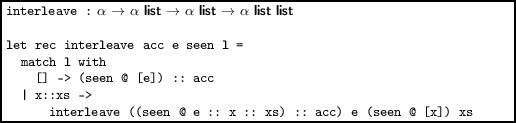

Now, we can go as far as we have time and memory (though the permutations are in a different order – can you fix that?)

Another method of finding permutations, which gives a shorter solution, is to choose each element of the input list and use that as the first element, prepending it to each of the permutations of the remaining list. First, let us define a function to remove the (first) occurrence of a given element from a list:

> 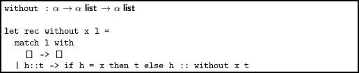

It need not be tail-recursive, since this list will always be small. Now, we can write the new `perms `function. The base case is the same. In the main case, we use `List.map `twice. The inner `map `prepends a given element to each of the permutations of the list without that element. The outer `map `uses that over each of the elements of the input, selecting each in turn as the first element. The results are then concatenated.

> 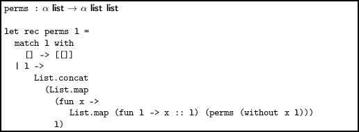

This function has the advantage of producing the items in proper lexicographic (dictionary) order:

`[[1; 2; 3]; [1; 3; 2]; [2; 1; 3]; [2; 3; 1]; [3; 1; 2]; [3; 2; 1]]`

Permutations one at a time

There is a well-known imperative algorithm for generating the lexicographically-next permutation given the current one. We can use this to build a function to generate all the permutations without the heavy recursion of our previous programs and, more interestingly, to build a lazy list of all the permutations, which requires minimal computation each time a new permutation is needed.

We begin with a sorted array, such as `[|1; 2; 3|]`. This is the first permutation. We generate new permutations until the array is in reverse-sorted order – `[|3; 2; 1|] `– this is the final permutation. In order to find the lexicographically-next permutation there are four steps:

1.  Find the right-most item which is smaller than its next item. Call this the “first” item. This is the item which must be altered to find the permutation which is the smallest distance from the current one in the lexicographic order.
2.  Find the smallest item to the right of the “first” item which is greater than it. Call this the “last” item. This is the item which will go in the position of the “first” item.
3.  Swap these two characters.
4.  Sort everything to the right of the original index of the “first” item into lexicographic order. This ensures we have selected the next permutation, not any later one.

Marking the first item with F and the last item with L, we have `[|1; 2`^(`F`)`; 3`^(`L`)`|]` -→ `[|1`^(`F`)`; 3; 2`^(`L`)`|]` -→ `[|2;` `1`^(`F`)`; 3`^(`L`)`|]` -→ `[|2`^(`F`)`; 3`^(`L`)`; 1|]` -→ `[|3; 1`^(`F`)`; 2`^(`L`)`|]` -→ `[|3; 2; 1|]`. The `first `function finds the index of the “first item” in an array:

> 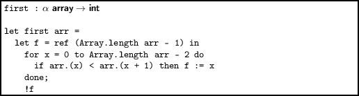

The corresponding `last `function is a little more awkward, needing to check two conditions and using a special initializer, rather than simply initializing with the last element as `first `does.

> 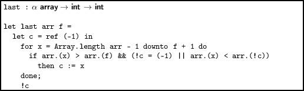

Two simple utility functions, to swap given indices in an array, and sort a sub-array given its offset and length:

> 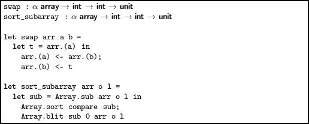

Now we are ready to write `next_permutation`:

> 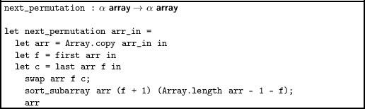

We define a predicate for non-increasing-ness:

> 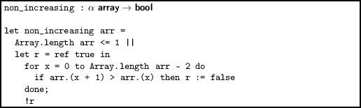

And, finally, we are finished:

> 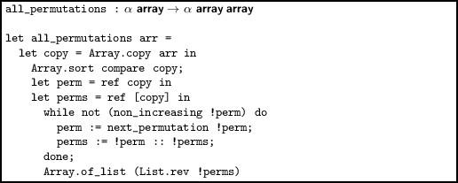

Note that this imperative algorithm works correctly with repetitions of elements – it will include the permutation only once. We can now generate a repeating lazy list of all the permutations of a given list, using our standard lazy list type from Chapter 2:

> 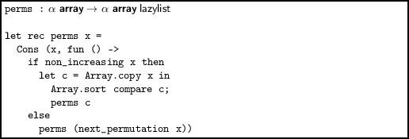

This very imperative algorithm has now been dressed in functional clothes.

Questions

1.  Write a function to generate all the unordered combinations of items from a list. For example, for the list `[1; 2; 3]`, the result, whose order is not important, might be `[[]; [1]; [2]; [3];` `[1; 2]; [1, 3]; [2; 3]; [1; 2; 3]]`.
2.  Generate all the “permicombinations” – that is all the permutations of all the combinations of a list. For the list `[1; 2; 3] `this might be `[[]; [1]; [2]; [3]; [1; 2]; [2; 1]; [1; 3]; [3;` `1]; [2; 3]; [3; 2]; [1; 2; 3]]`.
3.  Write a function to give the list of all possible lists of length n containing just `true `and `false`.
4.  The sorting phase of the imperative algorithm can be replaced with a simple list reversal, since the items are already in reverse lexicographic order each after the swap. Implement this.
5.  The imperative algorithm could be defined in terms of lists, in a functional fashion. Demonstrate this.